# Godot Fabric

**Build native Godot UIs with React.** An experimental renderer powered by
React Native Fabric, Hermes and Yoga, delivered as a Godot GDExtension.

React runs inside Godot. JSX, hooks and reconciliation produce real Godot
Controls through the original Fabric mounting pipeline. The official Godot
engine does not need rebuilding.


## Status

This is an experimental platform implementation. Native setup and rendering
are validated on **macOS arm64 with official Godot 4.7.2**. An experimental
[iOS build/export path](docs/IOS_BUILD.md) has arm64 device export/link proof and
22 runtime checks in an x86_64/Rosetta simulator. Arm64 simulator and physical
device runtime acceptance remain pending. Linux, Windows, Android
and Web do not yet have supported build paths.

Setup and the check runner prepare Godot's extension startup list before the
first import. This avoids a Godot 4.7.2 editor crash when an import-only scan
discovers extension classes late. Resources are still imported from scratch;
failures are reported without retries. See the [cold-start evidence](docs/evidence/cold-start.md).

Supported, within the documented subset: React 19 hooks and concurrent roots,
public View, Text, Pressable, ScrollView, Button and single-line TextInput,
NativeWind styles, nested rich text and a limited SVG adapter exercised by
React Native Chart Kit. The [TSX form](examples/form/README.md) uses the narrowed
public types and native editing/activation. Mobile keyboard/IME contracts and
complete React Native props remain open.

The [text layout example](examples/text-layout/README.md) draws what Text's
`onTextLayout` reports (each visible line's box and baseline) over the paragraphs
the host measured and painted, and aligns a row by `alignItems: 'baseline'`; both
come from the lines of that one shaped paragraph. Its
[evidence](docs/evidence/text-layout/README.md) records 76 headless checks against the
bundled fonts' tables, the preceding host's 5 failures, three retained sabotages and two
captures (hosted CI pending); the [research](docs/research/text-layout.md) has the oracle,
the measured tolerance and the controls. `Text` now renders RN's original `Text.js`, and a
paragraph presses through RN's own Pressability (`onPress`, `onPressIn`, `onPressOut`,
`onLongPress`, `pressRetentionOffset`, `disabled`); the example's last line is a pressable
paragraph. The [evidence record](docs/evidence/text-original/README.md) and the [research](docs/research/text-original.md) record 119 headless checks (114 in the record pinned at `ba5ff00`, before the review of PR #62 added five nested-span
responder cases) with a real
mouse and touch, the controls of the previous SDK and host (68 and 3 failures; 63 and 3 in the record) and six retained
sabotages, and four captures of the pressable line (hosted CI pending). The text style is the
third slice: `fontStyle: 'italic'` (a synthetic slant of 0.25, the bundled fonts have no italic
face), `textDecorationLine` (underline, line-through, both, `none`), `textDecorationColor` and a
solid `textDecorationStyle`, a child replacing its parent field by field, with the ellipsis now
taking the color of the run before it instead of the first run's. The
[evidence record](docs/evidence/text-style/README.md) and the [research](docs/research/text-style.md) record 61
headless checks with an independent oracle that recomputes every line from the fonts' tables, the controls of the
previous SDK and host (47 and 27 failures), eight retained sabotages and the typography example's pixel checks, with
three captures of the new line (hosted CI pending); `oblique`, the other line styles and the real italic faces stay open. Press handlers on a nested span itself (a nested `Text` that declares one fails, while a touch over its text is the outer
paragraph's press), selection,
`adjustsFontSizeToFit`, font scaling, Text accessibility, bidi/emoji and font fallback remain open.

The [View geometry example](examples/view/README.md) exercises original public
View/Fabric ordering, rectangular overflow and four solid border colors through
real input targets and renderer pixels. The later
[coordinate example](examples/coordinates/README.md) fixes the offset-root
input/measurement disagreement and exercises genuine move-out/return gestures,
Godot surface scaling and raw window input at content density two. Its
[evidence](docs/evidence/coordinates/README.md) keeps the failing prior-host and
first-event density controls separate from the verified implementation.

The [transform gallery](examples/transforms/README.md) adds original RN 2D
transform order, percentage translation/origins, reflection, shear and nested
bounds. Painting and input use the same Godot Control. Its
[evidence](docs/evidence/transforms/README.md) records 309 headless and 345 native
assertions, 33 pixel samples, stable refs/state across flattening and six
explicit rejection cases. A separate input guard cancels held contacts when an
external Godot embedding becomes non-invertible, preserving the last valid
coordinates. Singular, 3D and out-of-range JSX transforms remained unsupported then.
The later [uniform scale record](docs/evidence/uniform-scale/README.md) accepts RN's
uniform `scale`, static or animated, on the same Control and extends the rejection
cases to eight, and the
[singular transforms record](docs/evidence/singular-transforms/README.md) collapses
singular ones as RN does, which leaves six rejection cases again, though not the
checkpoint's six: perspective, `rotateX`, a weight other than 1 and three out-of-range
cases.

The [read-only tree example](examples/tree/README.md) exercises original RN
documents, ID lookup, logical traversal and collection snapshots across two
roots. It preserves element refs during keyed reorder and records the pinned
RawText replacement and imperative-ID behavior. Its
[evidence](docs/evidence/tree/README.md) retains 89 headless / 99 native checks,
eight pixel samples and the failing previous-configuration control.

Public TextInput focus uses original RN TextInput.State and native Fabric
commands. The [focus example](examples/focus/README.md) compares that singleton
with real Godot Controls across callbacks, editability changes and root
retirement. Its [evidence](docs/evidence/focus/README.md) records 175 headless /
189 native checks, two captures and controls that fail with the preceding host
or missing eligibility guards. Keyboard/IME and multiline remain open.


The [pointer example](examples/pointers/README.md) brings real Godot input to
original RN pointer events and public View capture refs. Its
[evidence](docs/evidence/pointers/README.md) records 132 headless /146 native
checks, 12 pixels, selective multi-root lifetime, 144 native assertions and
43 original JSX exception/stop checks. Two original-source controls reproduce
crashes fixed by the generated native lifetime overlay. Hardware, EventTarget
and complete mobile acceptance remain open.


The [captured geometry example](examples/pointer-geometry/README.md) keeps
client/page coordinates in the physical origin root and projects offsets into
each actual target, including transformed targets in another embedded root and
flattened logical refs. [Its evidence](docs/evidence/pointer-geometry/README.md)
records 631/648 headless/native checks, a failing previous-host control,
14 pixels and three captures. Singular cancellation and connected hidden
capture have explicit contracts. This fixes a documented limitation of the
pinned RN offset algorithm; complete differential parity remains open.


The isolated [native EventTarget example](examples/event-target/README.md)
connects the original dispatcher to the renderer's existing batch. A native
touch delivers to a listener with no JSX helper; JSX and imperative listeners
commit both React updates together. Its [evidence](docs/evidence/event-dispatch-integrated/README.md)
also records corrected native cancellation/teardown defects. Public flags remain
disabled; complete event parity remains open.


The separate [pointer-interest example](examples/pointer-interest/README.md)
reads original RN listener maps so imperative-only View `pointerdown` listeners
qualify native emission in an internal opt-in. Capture/bubble, once, abort,
removal and flattened ancestry retain original listener behavior. Its
[evidence](docs/evidence/pointer-interest/README.md) records 193 original / 230
current headless checks and 260 current viewport checks with two real captures.
That pinned snapshot leaves Document-only interest open. The later root probe
below extends it; other pointer categories, hardware/mobile and public flag
enablement remain open. The default helper still installs no query.


The [query-fault example](examples/pointer-query-fault/README.md) exercises a
failed native interest lookup without losing the same batch's TouchStart or
React update. The identical previous-host fixture has 12 normative failures;
the corrected host passes 186 headless and 204 viewport checks while retaining
four deliberate diagnostics. [Evidence and boundaries](docs/evidence/pointer-query-faults/README.md)
separate lookup recovery, contact cleanup and remaining getter/reentrancy gaps.

The [Document/root example](examples/pointer-document/README.md) lets original
Document and documentElement listeners qualify descendant native `pointerdown`.
The SDK reads their existing RN listener Maps through the actual current root
handle, preserving original flags, callbacks and React batching. Each flag
combination has an independent Hermes runtime. [Its evidence](docs/evidence/pointer-documents/README.md)
separates the original SDK, the previous native host and the corrected host.
Public flags remain disabled; arbitrary getter/reentrant faults and complete
pointer/responder contracts remain open.

The [ref-getter example](examples/pointer-resolver-fault/README.md) isolates a
throwing `canonical.publicInstance` getter before the SDK interest query. The
previous host loses three same-batch TouchStart/Raw/React outcomes; the corrected
host passes 65 headless and 85 viewport checks, including actual counter updates.
[Its evidence](docs/evidence/pointer-resolver-faults/README.md) separates the
executed one-shot getter from broader resolver/reentrancy and mobile gaps.
Public flags remain off; [its hosted CI](docs/evidence/pointer-resolver-faults/hosted-ci.json)
passed five jobs, including the independently audited 65-check getter artifact.


The isolated [pointerup example](examples/pointer-up/README.md) extends native
interest to original View Up listener Maps. Bubble and capture-only listeners
receive one trusted event without a JSX pointer helper, while original
TouchEnd/Raw and terminal cleanup remain intact. Its
[evidence](docs/evidence/pointer-up/README.md) records 62 headless / 90 viewport
checks, 24 actual pixels and the preceding host's eight failures with the same
current SDK bundle. Public flags remain off; Document Up, other flag branches
and broader event/lifecycle acceptance are open. All 16 proportional regression
commands and fresh SDK pack/verify passed; its hosted CI is verified in
[run 37241023275](docs/evidence/pointer-up/hosted-ci.json).

A one-shot throw or non-boolean result in the native interest query for that View
ref, at the Up offsets, rejects only that lookup with one retained
`E_POINTER_LISTENER_QUERY`: a capture listener on the same View still qualifies
after a bubble fault, and an unqualified View hands the lookup to its ancestors and
root, while the original TouchEnd and contact cleanup survive. The faults run in a
second application, so the healthy probe stays diagnostic-free: 240 headless and
268 graphical checks, with the preceding-host controls refreshed.
[Evidence and limits](docs/evidence/pointer-up-faults/README.md). When the native
lookup cannot even resolve the View's public ref (a one-shot getter on
`canonical.publicInstance`), that lookup fails before the SDK with the same single
diagnostic, and the next lookup proceeds normally.
[Resolver evidence](docs/evidence/pointer-up-resolver-faults/README.md). Both fault
slices passed hosted CI with the same check IDs and bundles
([component](docs/evidence/pointer-up-faults/hosted-ci.json),
[resolver](docs/evidence/pointer-up-resolver-faults/hosted-ci.json)).

The isolated [pointermove example](examples/pointer-move/README.md) extends the
same native interest to original View Move Maps. Real drags and button-less mouse
motion reach listeners on the target and on its parent as trusted moves, one React
commit each, at the Default priority that RN's pinned mapping gives unique
Continuous moves; a View without Move listeners still gets its original TouchMove.
Its [evidence](docs/evidence/pointer-move/README.md) records 219 headless / 243
viewport checks, 20 actual pixels and the preceding host's 45 failures with the
same SDK bundle. A failing Move lookup is retained once per distinct cause and its
repeats are counted, so hover cannot flood diagnostics. Hover events and pointer
capture remain open. Hosted CI repeated the 219 headless checks with the same IDs
and bundle ([receipt](docs/evidence/pointer-move/hosted-ci.json)).

The [Document pointermove example](examples/pointer-document-move/README.md)
certifies original Document and documentElement Move listeners in eight
original/current × flag lanes: 1,932 headless checks and 330 viewport checks.
Only the installed current query delivers, at phase 1 for capture and 3 for
bubble, and a retained control that drops the owner Document fails. Hosted CI
repeated the 1,932 headless checks
([receipt](docs/evidence/pointer-document-move/hosted-ci.json)).
[Evidence](docs/evidence/pointer-document-move/README.md).

The [hover example](examples/pointer-hover/README.md) lets original View
`pointerover/out/enter/leave` listeners qualify real mouse and touch hover in RN's
order, phases and Discrete priority, with enter/leave's non-bubbling rule intact:
158 headless checks and 32 old-host failures. Hosted CI repeated the 158 checks
([receipt](docs/evidence/pointer-hover/hosted-ci.json)).
[Evidence](docs/evidence/pointer-hover/README.md).

The [root-path example](examples/pointer-root-path/README.md) resolves an empty
point inside a surface to the root view, as RN does, so the root stays in the
hover path between a view and the empty area, and never makes the root an event
target. That removes a crash of the preceding host with a Document capture
`pointerenter`/`pointerleave` listener: 82 headless checks, and the same bundle
fails 9 checks and crashes on the preceding host. Hosted CI repeated the 82
checks ([receipt](docs/evidence/pointer-root-path/hosted-ci.json)).
[Evidence](docs/evidence/pointer-root-path/README.md).

The [Document hover example](examples/pointer-document-hover/README.md)
certifies original Document and documentElement hover listeners in eight
original/current × flag lanes: 1,530 headless checks. Over/out reach them at
phases 1 and 3; enter/leave reach only capture listeners, when the pointer enters
or leaves the surface; a retained control that ignores the owner Document fails.
Hosted CI repeated the 1,530 checks ([receipt](docs/evidence/pointer-document-hover/hosted-ci.json)).
[Evidence](docs/evidence/pointer-document-hover/README.md).

The [click example](examples/pointer-click/README.md) certifies `click` on a
primary release, targeted at the deepest view the press and the release share,
and the ScrollView drag that cancels its contact, in eight lanes: 728 headless
checks. The preceding host fails exactly 31 of them. Hosted CI repeated the 728
checks ([receipt](docs/evidence/pointer-click/hosted-ci.json)).
[Evidence](docs/evidence/pointer-click/README.md).

The [PanResponder example](examples/pan-responder/README.md) runs RN's original
`PanResponder` on actual Godot touches and mouse drags, including two-finger
gestures, parent claims, refused termination and removal mid-gesture, in four
flag lanes: 128 headless checks, repeated by hosted CI
([receipt](docs/evidence/pan-responder/hosted-ci.json)). [Evidence](docs/evidence/pan-responder/README.md).

The [AppState example](examples/app-state/README.md) runs React Native's original
`AppState` from the public import, fed by the focus, pause and memory-warning
notifications Godot delivers to the `FabricApplication`, with two roots sharing
one state: 75 headless checks. The preceding host fails exactly its 62
lifecycle checks. Hosted CI repeated the 75 checks
([receipt](docs/evidence/app-state/hosted-ci.json)). [Evidence](docs/evidence/app-state/README.md).

The [shared touches example](examples/shared-touches/README.md) presses two
roots of one application at the same time: every TouchEvent lists the whole
application's touches, as RN's one JS responder expects, so a touch ending in
one root no longer releases a press held in another while that press's own
touch is down; a canceled touch still terminates the one responder, as on one RN
surface. 92 headless checks in four flag lanes; the preceding host fails exactly
9. Hosted CI repeated the 92 checks ([receipt](docs/evidence/shared-touches/hosted-ci.json)).
[Evidence](docs/evidence/shared-touches/README.md).

The [Switch example](examples/switch/README.md) renders RN's original `Switch.js`
over RN's shared iOS/macOS Switch descriptor and a native Godot switch: actual
mouse clicks and touch taps toggle it, `onChange`/`onValueChange` follow RN's
order, and Switch.js's `setValue` restores a value prop that does not change.
108 headless checks in two roots; the preceding host fails the 2 mount checks.
Hosted CI repeated the 108 checks ([receipt](docs/evidence/switch/hosted-ci.json)).
[Evidence](docs/evidence/switch/README.md).

The [touchables example](examples/touchables/README.md) makes
`TouchableWithoutFeedback` and `TouchableHighlight` public with RN's original
modules and Pressability: callback order, native underlay and child opacity,
`delayPressOut`, long press, hitSlop and retention, nesting, disabled and removal
mid-press under real mouse and touch on two roots, 93 headless checks. The same
fixture on the preceding SDK fails exactly its 19 render checks, and a retained
imitation over Pressable fails. `TouchableOpacity` was unavailable then, since RN
0.87.1's Animated needs `NativeAnimatedModule`; the
[Animated example](examples/animated/README.md) below makes it public. Hosted CI
repeated the 93 checks ([receipt](docs/evidence/touchables/hosted-ci.json)).
[Evidence](docs/evidence/touchables/README.md).

The [ActivityIndicator example](examples/activity-indicator/README.md) renders
RN's original `ActivityIndicator.js` over the generated `ActivityIndicatorView`
descriptor and a native Godot spinner whose phase advances once per actual frame
while `animating`, freezes when stopped and hides with `hidesWhenStopped`. 33
headless checks in two roots; the preceding host fails the 2 mount checks.
Hosted CI repeated the 33 checks ([receipt](docs/evidence/activity-indicator/hosted-ci.json)).
[Evidence](docs/evidence/activity-indicator/README.md).

The [accessibility example](examples/accessibility/README.md) maps RN's accessibility
props on `View`, `Pressable` and `TouchableOpacity` to Godot's AccessKit tree: the
label and hint as the element's name and description, the role (61 accepted
spellings naming 44 distinct roles, a table in the [research note](docs/research/accessibility.md)), the
disabled, busy, checked, selected and expanded states, live regions, `aria-hidden`
and the OS's press (`onAccessibilityTap`, or a click at the View's center). Values
the host cannot honor fail explicitly instead of becoming a generic element.
`npm run test:accessibility` is headless, so it proves metadata only (80 checks in
two roots; the preceding host fails exactly 10, and four retained sabotages are
rejected). `npm run test:accessibility:bridge` reads the real NSAccessibility tree of
the graphical Godot and presses elements with `AXPress` (22 checks, local macOS
only; the preceding host fails exactly 5). Focus, text scale, announcements and mobile (Godot 4.7.2 has no bridge
on iOS or Android) are open; `AccessibilityInfo`'s settings and events are the next example.
Hosted CI has not run the headless step yet.
[Evidence](docs/evidence/accessibility/README.md).

The [AccessibilityInfo example](examples/accessibility-info/README.md) runs React Native's original
`AccessibilityInfo` from the public import over a native `AccessibilityManager` module and Godot's
`DisplayServer`: the screen reader, reduce motion, reduce transparency and increase contrast resolve from the
last reading, which the host takes once per frame, and each change is one event heard by every listener of every
root, with `change` as the alias of `screenReaderChanged`. A setting the platform does not report rejects as unknown,
and bold text, grayscale, inverted colors and cross-fade reject as unavailable, never off. `announceForAccessibility` and
`announceForAccessibilityWithOptions` are announced through AccessKit (the post to AppKit is proven, the audible speech is not): each is a new live element with the text as its value
(assertive for `priority: 'high'`, polite otherwise), dropped and counted when no screen reader is there; `queue: true`,
`priority: 'low'` and the screen reader's programmatic focus throw `E_UNSUPPORTED` with their reasons (the macOS API has no
queue, AccessKit has two live modes, Godot has one focus). The headless probe runs two applications, one with validation
metas that stand in for the system and for the `AccessibilityServer` (a recorder) and one with Godot's real backend, which
reports nothing there: 69 checks replayed by an independent oracle. The preceding host fails exactly its 15 normative checks,
and eight host sabotages are rejected. `npm run test:accessibility-info:bridge` (local, graphical macOS, no permission)
interposes the call AccessKit makes to AppKit and proves it posts each announcement with its text and priority level (12 checks;
that VoiceOver spoke is not proven; the announcements of one frame are published one per update and posted in the order they were made). Real
operating-system settings, mobile and a graphical CI run are not certified; hosted CI has not run the step yet.
[Evidence](docs/evidence/accessibility-info/README.md) (settings), [evidence of the announcements](docs/evidence/accessibility-announcements/README.md),
[research](docs/research/accessibility-info.md) and [announcements](docs/research/accessibility-announcements.md).

The [capture notification example](examples/pointer-capture-notifications/README.md)
certifies `gotpointercapture`/`lostpointercapture` for JSX props and original
View, documentElement and Document listeners, and hover and click while a pointer
is captured, in eight original/current × flag lanes: 672 headless checks. RN
notifies a capture at the pointer's next event, retargeted to its owner, and the
host already matches it; two retained sabotages fail. Hosted CI repeated
the 672 checks ([receipt](docs/evidence/pointer-capture-notifications/hosted-ci.json)).
[Evidence](docs/evidence/pointer-capture-notifications/README.md).

The [virtualized-list example](examples/virtualized-list/README.md) runs React
Native's original `FlatList`, `SectionList` and `VirtualizedList` from the public
import on the SDK ScrollView, windowed by real wheel and touch input in two roots:
44 headless checks. The preceding host fails exactly its 3 ScrollView checks.
Hosted CI repeated the 44 checks ([receipt](docs/evidence/virtualized-list/hosted-ci.json)).
[Evidence](docs/evidence/virtualized-list/README.md).

The [Appearance example](examples/appearance/README.md) runs React Native's
original `Appearance` and `useColorScheme` from the public import, fed by Godot's
system theme and the `setColorScheme` override, with two roots re-rendering the
same scheme and two applications sharing one system theme callback: 79 headless
checks. The preceding host fails exactly its 56 Appearance checks, and the host
from before the shared callback its 9 two-application checks.
Hosted CI repeated the 79 checks ([receipt](docs/evidence/appearance/hosted-ci.json)).
[Evidence](docs/evidence/appearance/README.md).

The [Animated example](examples/animated/README.md) runs React Native's original
`Animated`, `Easing`, `useAnimatedValue(XY)` and `TouchableOpacity` from the public
import. The JS driver advances on `requestAnimationFrame`; with `useNativeDriver`,
RN's own C++ `AnimatedModule` and shared `AnimationBackend` run timing, spring and
decay with the host's frame clock as their clock and update the Controls without a
React commit, in two roots of one application: 75 headless checks recomputed frame
by frame by an independent oracle. The preceding host fails exactly its 59
normative checks, and hosts that hand the backend seconds or leave the JS thread's
runtime reference update off fail exactly 32 and 2. A uniform `transform: [{ scale }]`
failed with `E_TRANSFORM_3D` then and renders since the uniform scale proof below;
`LayoutAnimation` has its own [example](examples/layout-animation/README.md) below. Hosted CI repeated the 75 checks on its second
attempt ([receipt](docs/evidence/native-animated/hosted-ci.json)).
[Evidence](docs/evidence/native-animated/README.md).

The [LayoutAnimation example](examples/layout-animation/README.md) runs React Native's original
`LayoutAnimation` (`configureNext`, `create`, `Presets`, and the legacy
`UIManager.configureNextLayoutAnimation`) from the public import over RN's own C++
`LayoutAnimationDriver`, which the host installs on the `UIManager` and advances with its frame
clock: the next commit's updates animate layout, its creates fade or scale in and its deletes fade
or scale out, with the linear, easeInEaseOut and spring curves, and the driver calls
`onAnimationDidEnd` (RN's JS timer stays the fallback) and `onAnimationDidFail`. The headless
suite (128 checks) recomputes every frame from the clocks RN read with RN's formulas; the preceding host fails
exactly its 87 driver checks and six retained host sabotages are rejected (80, 90, 91, 7, 1 and 4 checks). One root at a time;
reduced motion, Text and Image state interpolation, background and resume, JS load and a
performance budget are open. Hosted CI is pending. [Evidence](docs/evidence/layout-animation/README.md)
and [research](docs/research/layout-animation.md).

The [uniform scale proof](examples/transforms/README.md#uniform-scale) mounts RN's
uniform `transform: [{ scale }]` in five Hermes applications: a scale, a scale with
a rotation, a scale about a `transformOrigin`, an `Animated.View` scaled by
`useNativeDriver` and back by a real press, and a `Pressable` whose scaled bounds
take real mouse presses where its layout box does not reach. 29 headless checks
against planar matrices derived from the JSX, with an independent oracle; the
preceding host fails exactly the 22 that need the scale. The host's planar rule now
has one definition, shared by the transform adapter and pointer projection.
`scale: 0` and other singular transforms failed then and collapse their View since the
singular transforms proof below. Hosted CI repeated the 29 checks
([receipt](docs/evidence/uniform-scale/hosted-ci.json)).
[Evidence](docs/evidence/uniform-scale/README.md).

The [singular transforms proof](examples/transforms/README.md#singular-transforms)
mounts RN's singular `transform` styles in eight Hermes applications: `scale: 0`,
`scaleX: 0`, a rank-one matrix, a matrix that only loses rank in a float, an
`Animated.View` scaled by `useNativeDriver` from 0 to 1 and from 1 to 0, a scale that
React state moves through 0, and a pointer captured by a View that collapses
mid-gesture. RN draws and hits no such view and raises no error; the host hides the
Control and its subtree (as Android does, and iOS when the container clips), keeps its
last invertible transform and shows it again with the next invertible one. 49 headless
checks against values derived from the JSX with an independent oracle; the preceding
host fails exactly the 37 that need the collapse, and a retained sabotage of the pointer
projection fails exactly 2. 3D, a weight other than 1 and out-of-range transforms remain
rejected. Hosted CI repeated the 49 checks ([receipt](docs/evidence/singular-transforms/hosted-ci.json)).
[Evidence](docs/evidence/singular-transforms/README.md).

The [frame clock record](docs/evidence/frame-clock/README.md) makes
`requestAnimationFrame` callbacks and RN's Native Animated frames run at a display
link's cadence instead of on every Godot frame: a headless, uncapped or stalled loop
delivered hundreds of frames a second or frames 0.4 ms apart, which ended native decays
early and flaked hosted CI. One host clock decides, once per Godot frame, whether the
frame is a tick. With V-Sync on a real display, in a window that can draw, every frame with
a consumer is a tick; otherwise (headless, V-Sync off, or a window that cannot draw, such as
a minimized one, which Godot's main loop paces with a sleep even with V-Sync) a frame ticks
when it starts at least half a refresh period after the previous frame or a whole period
after the last tick, at the rate the display reports (60 Hz when it reports none). Timers,
input and the work queue still run on every Godot frame, and the host's own
`requestAnimationFrame` gives every callback of a tick, and the animation frame, the tick's
one timestamp. 37 headless checks over eight loop paces, none of which assumes what timing
the machine delivers (a macOS runner too slow for 3 ms frames failed the first hosted run
until they stopped; review commits
[`e6d42a4`](https://github.com/journey-studios/godot-fabric/commit/e6d42a4efa8cb224c7db82a24625341eeb21f9e8)
and
[`8fc4627`](https://github.com/journey-studios/godot-fabric/commit/8fc46279d6126b87e4fc6cc1d982f75620dfc3b5)),
recomputed by an independent oracle from the frame times the host
reports; the preceding host fails exactly the 29 cadence checks, and three retained
sabotages each fail at least one and are rejected by the oracle. The clock has no visual
output, so there is no example scene or screenshot. Timers are not quantized to ticks,
presented frames carry CPU time and not the display's regular timestamp, and real displays
beyond one exploratory headed run are not certified. Hosted CI repeated the 37 checks
([receipt](docs/evidence/frame-clock/hosted-ci.json)).

The [Networking example](examples/networking/README.md) runs React Native's own `fetch`
(with `Headers`, `Request` and `Response`), `XMLHttpRequest`, `FormData`, `Blob`,
`FileReader`, `URL` and `AbortController` as globals: the host's initialization imports
RN's `setUpXHR`, and three C++ TurboModules (`Networking` with the contract of RN's Android
wrapper, `BlobModule` and `FileReaderModule`) give them a transport on Godot's `HTTPClient`,
one connection per request, polled on the main thread. The host follows redirects (up to 20)
and enforces the time-out itself, decodes text by its charset and sends string, base64,
multipart and blob bodies. 100 headless checks in two roots of one application against a
deterministic local server over HTTP and HTTPS (a CA generated at runtime, trusted through a
validation seam), with an independent oracle that compares the 137 requests the server
recorded with what JS observed. The preceding host fails exactly its 84 normative checks, and
retained sabotages (redirects not followed, repeated headers not joined) fail 8 and 2. Cookies,
compressed responses, HTTP/2, progress events, `uri` and file bodies are open (the `WebSocket`
global got its module in the next record, below). Hosted CI passed the five jobs
on main (run 37571237096) and repeated the 100 checks
([receipt](docs/evidence/networking/hosted-ci.json)).
[Evidence](docs/evidence/networking/README.md).

The same example's second card runs React Native's own `WebSocket` against an echo server the
scene starts. Its `WebSocketModule` uses Godot `HTTPClient` for asynchronous DNS/TCP/TLS setup,
then public `StreamPeer` reads and writes with pinned wslay for RFC 6455 framing. The 95-check
headless probe covers 60 server connections; an independent wire oracle compares 53 required
JS/wire traces. It verifies data before coalesced close frames, interleaved ping, exact TLS close
1000 and peer-selected 4002/reason, and an abnormal 1006 after a TLS drop. The preceding host
passed 12 checks and failed 83; the Origin and stop-code sabotages fail four and two checks.
Each WebSocket poll admits at most 1 MiB of inbound wire bytes across WebSocket sockets. Its
256-event cap uses canonical pending networking-event capacity after the separate HTTP poll.
Eight-socket load phases reached each limit, delivered 1,024 messages per phase and ended with
zero pending events. Eight reentrant cancel/stop cases verify silent teardown; four drained echo
cases observed wire close 1001, while four greeting cases with unread input ended in TCP drops,
so cancellation's close delivery remains best effort. Connection plus upgrade has an explicit
30-second host deadline and close has a separate 60-second deadline. Hosted CI passed all five
jobs for pinned head `422c2ee` ([receipt](docs/evidence/websocket/hosted-ci.json)); later PR-head
changes need their own green run. The parity job covers 13 core-ui-v2 cases on Android/iOS, not
WebSocket differential or Godot mobile runtime behavior.
[Evidence](docs/evidence/websocket/README.md).

The [Device services example](examples/device-services/README.md) runs React Native's original
`Clipboard`, `Linking` and `Vibration` from the public import, over three native TurboModules
(`LinkingManager` with iOS's contract, `Clipboard`, `Vibration`) that call Godot's `OS.shell_open`,
`DisplayServer` clipboard and `Input.vibrate_handheld`. `openURL` rejects what has no scheme before
the platform sees it, `canOpenURL` answers by scheme (Godot cannot ask which handlers are
installed), `getInitialURL` reads the process's `--uri=` argument, and a deep link that reaches the
running application, handed to `FabricApplication.deliver_url`, is one `url` event for every
listener of every root. Where the display server has no clipboard (the headless engine) both
clipboard calls fail with `E_CLIPBOARD_UNAVAILABLE`, and a stop makes retained methods throw
`E_MODULE_DISPOSED`. The headless probe runs two applications (a recording validation backend, and
Godot's real one) with an independent oracle; the preceding host fails exactly its normative
checks and two retained sabotages are rejected. The suite and the example never open a real URL or
touch the real pasteboard. Alert, Share, Settings and BackHandler, mobile deep-link plugins,
cancelling `openURL` or a vibration, and real devices are open. Hosted CI is pending.
[Evidence](docs/evidence/device-services/README.md); [research](docs/research/device-services.md).

The [world-input spike](examples/world-input/README.md) draws a React Native HUD over a Godot map
(a `Node2D` of 24x16 tiles under a `Camera2D` at zoom 2) and measures who gets the pointer. A
`FabricSurface` now takes `MOUSE_FILTER_IGNORE` by default, so the Views React Native mounts are the only
Controls that stop a pointer: a click on the empty area of the `pointerEvents="box-none"` root reaches the
map's `_unhandled_input` exactly once (and picks the tile the camera gives), a click or tap on a `Pressable`
presses it once and never reaches the map, and with a `View` overlay or a `Modal` open nothing does. The
headless probe counts bursts of 100 events delivered by one flush, so no count depends on frame pacing, in
two topologies (one full-screen Surface, and one Surface per panel; the overlay checks and a local windowed
lane with captures on a real macOS window use the full-screen one only) with an independent oracle; the host that
predates the policy fails exactly its 31 normative checks and two retained sabotages are rejected. A hit slop,
a `Text` with `onPress`, the gaps of a ScrollView and the mouse wheel over the HUD still reach the map as well
as React Native: they are recorded and left to the second slice of the spike. Hardware pointers, a real touch
screen and mobile exports are open, and so is hosted CI. [Evidence](docs/evidence/world-input/README.md); [research](docs/research/world-input.md).

The [Image example](examples/images/README.md) renders React Native's own `Image.ios.js`,
`ImageBackground`, `AssetRegistry` and `Animated.Image` over RN's own C++ image pipeline
(`ImageShadowNode`, `ImageRequest` and its observers) with a host `ImageManager`. Pictures are
read, bounded and decoded on Godot's `WorkerThreadPool`, never on the main thread, and a native
`GodotImage` draws the texture with the six resize modes UIKit maps; `require()`d assets are
Metro's modules with Metro's descriptor, every `@Nx` variant, chosen by RN's `pickScale`, and
`res://`, `user://`, `file://` and `data:` sources decode PNG, JPEG, WebP, BMP, TGA and SVG. A
request swapped away or unmounted while its decode is in flight reports nothing and creates no
texture. `http(s)` sources, with `headers`, `method`, `body` and `cache`, download over the loader's
own HTTP transport (at most four at once) with RN iOS's request, failure and progress semantics,
through an `RCTImageCache`-like decoded cache and an `NSURLCache`-like memory byte cache that the OS
memory warning empties; `Image.prefetch`, `queryCache` and `getSize` work for them, and a
cancelled download closes its transport request, a request that carries `Authorization`,
`Proxy-Authorization` or `Cookie` neither reads nor writes either cache (stricter than iOS) and is refused
over http, and a redirect drops the source's headers as on iOS. 73 headless checks of the local pipeline in
two roots of one application and 74 of the network slice over a loopback server, each with an
independent oracle; the preceding host fails the 3 and 30 normative checks it can reach, and
retained sabotages (decoding on the main thread, a view that keeps listening to a swapped-away
request, a reload that consults the decoded cache, a download whose transport request stays open, a
repeating Image that resizes the shared texture) fail 12, 2, 1, 34 and 2. The same Image draws `tintColor`
(the picture's pixels take the color, never the view's background or border), `blurRadius` (RN iOS's two-pass
premultiplied box blur, run on the worker, on a texture no cache holds), `capInsets` (a stretched or tiled
nine-patch) and the clip of `borderRadius` (the border box with the radii, and the content frame with each radius
less the border beside it), on a canvas item of its own with one shared shader, and takes the props iOS ignores
without effect. 53 headless checks of those effects, with an independent oracle that recomputes the pixels of 14
blurred bitmaps exactly and every rectangle, radius and margin the view asked the renderer for; the preceding host
fails the 40 normative checks, four retained sabotages (a clip that ignores the border width, a third blur pass, a
blurred request that uses the decoded cache, cap insets that ignore the scale) fail 2, 3, 8 and 2, and the
example's capture sampled the shader's pixels. A disk cache, revalidation, cookies, compression, animated formats
and a comparison of the effects with iOS are open. Hosted CI passed the first slice's 74 checks on main (run
37724902858, [receipt](docs/evidence/images/hosted-ci.json)) and the network slice's 74 checks (run 37750455295,
[receipt](docs/evidence/images-network/hosted-ci.json)), and the visual slice's 53 checks (run 37773373567,
[receipt](docs/evidence/images-visual/hosted-ci.json)).
[Evidence](docs/evidence/images/README.md);
[network evidence](docs/evidence/images-network/README.md);
[visual evidence](docs/evidence/images-visual/README.md).

The [performance baselines](docs/research/performance.md) (GF-30's first slice) add a `performance` section to
the application snapshot: exact counters of the native views, Hermes' live heap after a forced collection, and the
host's pump split into JS, mount and layout phases. A soak mounts and unmounts four workloads 20 times each,
headless (a `View`, `Button`/`TextInput`/`Switch`, a react-native-chart-kit chart and a 120-row `FlatList`):
after every cycle the SceneTree, Godot's orphan count and the host's native views are back to the baseline of the
run, and the live heap at rest rises at most 2,048 bytes in the steady state (0 to 312 measured). 43 checks, recomputed
by an independent oracle from the samples the host reports; the preceding host fails exactly 28 and three retained sabotages (a Control never freed,
a frozen heap reading, a phase counted twice) are rejected. The evidence record is pinned at `ad87234`, which had 41 checks and 27 failures of the preceding host,
before the checks of the unmount notification and of the stopped application's snapshot. Durations, the resident memory and Godot's static
memory are recorded with their provenance and never judged; target-device budgets, text shaping, 10,000 rows,
graphic frame time and the mobile targets are open. The probe has no visual output, so there is no example scene or screenshot. Hosted CI is pending.
[Evidence](docs/evidence/performance/README.md); [research](docs/research/performance.md).

React Native's iOS- and Android-specific APIs keep their upstream unavailability on Godot, where
`Platform.OS` is neither: `ToastAndroid`, `PermissionsAndroid`, `DynamicColorIOS`, `ActionSheetIOS`,
`ProgressBarAndroid`, `DrawerLayoutAndroid`, `InputAccessoryView`, `PushNotificationIOS` and
`TouchableNativeFeedback` are RN's original modules, exported from the public import, and each
runs the branch RN itself takes off its own platform. ToastAndroid warns (its constants are 0),
PermissionsAndroid warns and resolves `false`, `'denied'` or `{}` (on Godot that means unavailable,
not a refusal), DynamicColorIOS, ActionSheetIOS and PushNotificationIOS throw RN's own errors,
ProgressBarAndroid and DrawerLayoutAndroid render a plain View around their children,
InputAccessoryView warns and renders nothing, and TouchableNativeFeedback is Pressability without an
Android drawable. The host registers none of their native modules, and `StatusBar` is still an
exported placeholder. The headless probe runs them in two applications against the real host
registry, with an independent oracle that reads every text, key and count from the pinned sources;
this slice has no native code, so the previous SDK is its control and fails exactly its normative
checks, and three retained sabotages are rejected. A package that imports a generic deep path
(`react-native/Libraries/Components/ToastAndroid/ToastAndroid`) still gets `undefined`; the
Android and iOS implementations, the OS-specific props and OS-version comparisons are open. Hosted
CI is pending. [Evidence](docs/evidence/os-contracts/README.md); [research](docs/research/os-contracts.md).

The 0.5 milestone's reference app is **Frontier**, a small turn-based strategy game in the interaction style of
Civilization 2 whose map, rules, scripted faction and turns live in plain GDScript
([`consumers/civ-lite/game/`](consumers/civ-lite/game/)), with the HUD to be React Native over Godot. This first package has
the rules and the state and snapshot the HUD will project, with no React and no native code: a 12-turn replay reaches one
golden hash in three processes (integers only, its own PCG32, canonical serialization, SHA-256), covers the game's seven
contexts and refuses invalid intents with a reason, judged by an independent oracle, with seven retained sabotages
(`npm run test:civ-lite-game`; `node scripts/civ-lite-game-sabotage.mjs`). The second package, the persistent `GameServices`
node, publishes the snapshot and takes the intents as typed services with an epoch, with hand-written TypeScript types
checked against the schemas Godot registered in both directions (`npm run test:frontier-services`; [evidence](docs/evidence/frontier-services/README.md), [research](docs/research/frontier-services.md)).
The third package makes `consumers/civ-lite/` a consumer project provisioned by the addon, with a minimal public-TSX HUD and a
scenery in its scene, and runs ten cycles of new game, intents, scene reload and menu with no listener or node leaked and the
epoch only rising (`npm run test:consumer:civ-lite`; [evidence](docs/evidence/frontier-consumer/README.md), [research](docs/research/frontier-consumer.md)).
The end of a turn is then an accepted job that the node runs a phase a frame and finishes once, whether or not a screen is open,
with a rule mutated in Godot changing the HUD with the same JavaScript bundle and every phase of a turn measured against the
registry's 64 tasks and 128 events (`npm run test:frontier-services`; [evidence](docs/evidence/frontier-authority/README.md), [research](docs/research/frontier-services.md)).
The playable HUD, the export and the devices are open, and so is hosted CI.
[Evidence](docs/evidence/frontier-game/README.md); [research](docs/research/frontier-game.md).

This does not promise compatibility with every React Native library.
[API and limitations](docs/API.md) define the supported contracts.
The [parity baseline](docs/compatibility/BASELINE.md) inventories the remaining
public contracts and compares a shared fixture against original native RN.

The [1.0 roadmap](ROADMAP.md) maps priorities, dependencies and acceptance
criteria for RN parity across macOS, Linux, Windows, Android and iOS. The
[dated parity audit](docs/PARITY.md) separates implemented behavior, incomplete
contracts and missing APIs against React Native 0.87.1.

The [native foundation checkpoint](docs/evidence/native-foundation/README.md)
exercises original RN refs, Fabric prop commits and JSI TurboModules. The
[refs example](examples/refs/README.md) measures scaled and rotated Godot
surfaces, then replaces a child and unmounts one root while retaining refs.
The [metrics example](examples/metrics/README.md) exercises original RN
Dimensions/PixelRatio, live resize and Yoga rounding with Godot content scale.


## Migration dashboard

Track the complete roadmap, Architecture 2.0 sequence, verified checkpoints,
dependencies and release acceptance in a local dashboard rendered from JSON:

```sh
npm run dashboard   # http://127.0.0.1:4317; no npm install or native setup needed
```

The panel refreshes when `dashboard/migration.json` changes. See the
[dashboard guide](dashboard/README.md) for progress rules and worktree support,
and the [implementation-thread prompt](dashboard/AGENT_PROMPT.md) to keep it updated.

## Independent Godot project

The [provisioned addon prototype](sdk/README.md) supplies the native runtime,
compatible React/RN, narrowed types and private build tools. After a platform
developer provisions it, the basic consumer opens `project.godot`, edits its
own TSX and presses Play; global Node is not required and Play never installs
dependencies. Additional libraries and the lockfile remain project-owned.


The [consumer guide](consumers/minimal/README.md) shows the application Resource,
scene nodes and registered roots. The [evidence](docs/evidence/consumer/README.md)
records the original 2B checkpoint. The later
[game-services evidence](docs/evidence/game-services/README.md) extends it to
18 build/ownership checks, 40 headless and 43 graphical assertions, including
offline builds, typed Godot operations, inventory-only resize and explicit errors. Provisioning is
currently from source on macOS arm64; public prebuilt artifacts, complete
exports and development tools remain open.

A second consumer, [`consumers/libraries`](consumers/libraries/README.md), brings its own lockfile and uses the original
NativeWind 4.2.7 (`className` on View, Text, Image and Pressable, `active:`, manual dark mode, retained state) and Chart Kit
7.0.4's v2 `LineChart`, built by the public SDK alone: a project's Tailwind entry is compiled from a declarative
`godotFabric.tailwind`, and `className` types are an opt-in. The [evidence](docs/evidence/library-consumer/README.md)
records 13 JS tests and 46 native checks (58 with the renderer), the exact releases and the control on the previous SDK
(hosted CI pending).

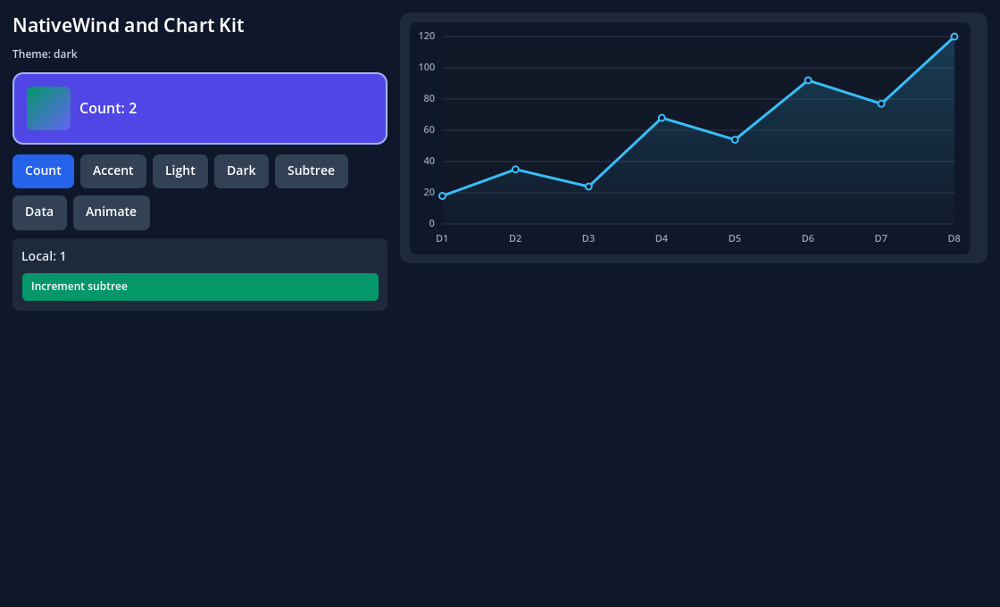

## Run the SDK laboratory

Requirements: macOS arm64, Node 22.13+, npm, Python 3.12+, Xcode Command Line Tools,
and [official Godot 4.7.2](https://github.com/godotengine/godot-builds/releases/tag/4.7.2-stable).

```sh
git clone https://github.com/journey-studios/godot-fabric.git
cd godot-fabric
npm run setup
npm run examples:list
npm run example -- counter
```

Set `GODOT_BIN` to the official engine executable if it is outside
`/Applications/Godot.app`. Setup validates the pinned stable engine before any
downloads or build output. The engine version and CI download checksum live in
[`dependencies.json`](dependencies.json); the extension declares 4.7.2 as its
minimum supported runtime. Setup downloads checksum-pinned native dependencies,
installs the npm lockfile, bundles JSX and compiles the GDExtension.
CMake lives in a local virtual environment; Godot itself is not recompiled.

```sh
npm run example -- form     # public typed Button/TextInput form
npm run example -- view     # public View stacking, overflow and four border colors
npm run example -- coordinates # root/local/screen points and real movement gestures
npm run example -- transforms # original RN affine styles, refs and transformed input
npm run example -- shared   # two registered roots in one Hermes application
npm run example -- refs     # original RN refs and transformed window geometry
npm run example -- pointers # original pointer input and public View capture
npm run example -- pointer-geometry # transformed, cross-root and logical capture
npm run example -- tree     # native IDs, original documents and logical traversal
npm run example -- services # typed Godot calls, signals and shared Zustand data
npm start -- --nativewind   # reactive utility classes and manual theme
npm start -- --chart        # original React Native Chart Kit
npm start -- --scroll       # generic scroll, filtering and editing demo
npm start                  # React state, keys, Suspense and error boundaries
npm run bundle             # rebuild after JSX/style changes
npm run setup              # rebuild after native C++ changes
npm run test:modules       # original JSI modules, promises, events and disposal
```

The [examples catalog](examples/README.md) has runnable scenes, JSX/TSX and per-case
instructions. `npm run example -- <name>` rebuilds the bundle before opening it;
the existing `npm start` flags remain available.

## Example gallery

These are real Godot Viewport captures of the runnable examples. Launch a case
with `npm run example -- <name>`; the [public control evidence](docs/evidence/public-controls/README.md)
includes initial/updated form captures and its ten-example validation snapshot.
The [runtime evidence](docs/evidence/runtime/README.md) records the additional
clock example separately.

| Counter | NativeWind | Chart Kit |
| --- | --- | --- |
| [](examples/counter/README.md) | [](examples/nativewind/README.md) | [](examples/chart/README.md) |

| Scrolling | Typography | Updated form |
| --- | --- | --- |
| [](examples/scroll/README.md) | [](examples/typography/README.md) | [](examples/form/README.md) |

| View layers | Updated View | Visible overflow |
| --- | --- | --- |
| [](examples/view/README.md) | [](examples/view/README.md) | [](examples/view/README.md) |

| Offset roots | Scaled root held | Content density two |
| --- | --- | --- |
| [](examples/coordinates/README.md) | [](examples/coordinates/README.md) | [](examples/coordinates/README.md) |

| RN affine styles | Resize and materialize | Remove transforms |
| --- | --- | --- |
| [](examples/transforms/README.md) | [](examples/transforms/README.md) | [](examples/transforms/README.md) |

| Original RN tree | Keyed reorder and text update |
| --- | --- |
| [](examples/tree/README.md) | [](examples/tree/README.md) |

| Switch | ActivityIndicator | Touchables |
| --- | --- | --- |
| [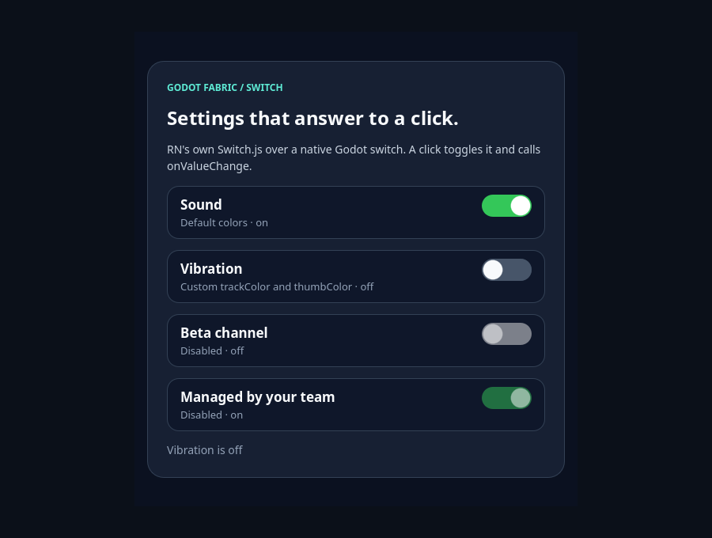](examples/switch/README.md) | [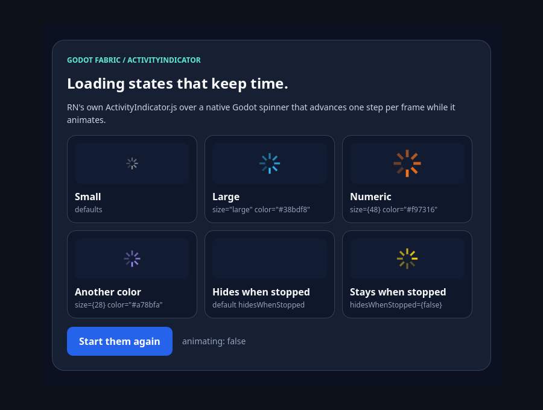](examples/activity-indicator/README.md) | [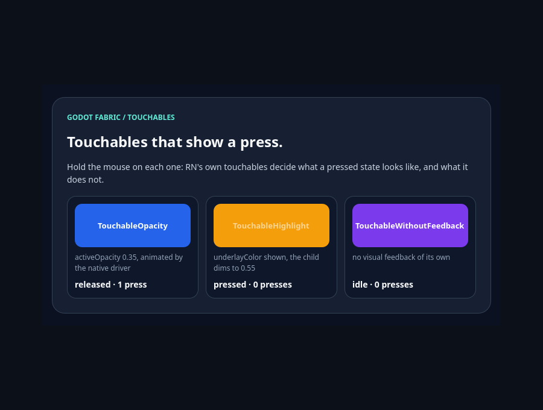](examples/touchables/README.md) |

| FlatList and SectionList | Appearance | PanResponder |
| --- | --- | --- |
| [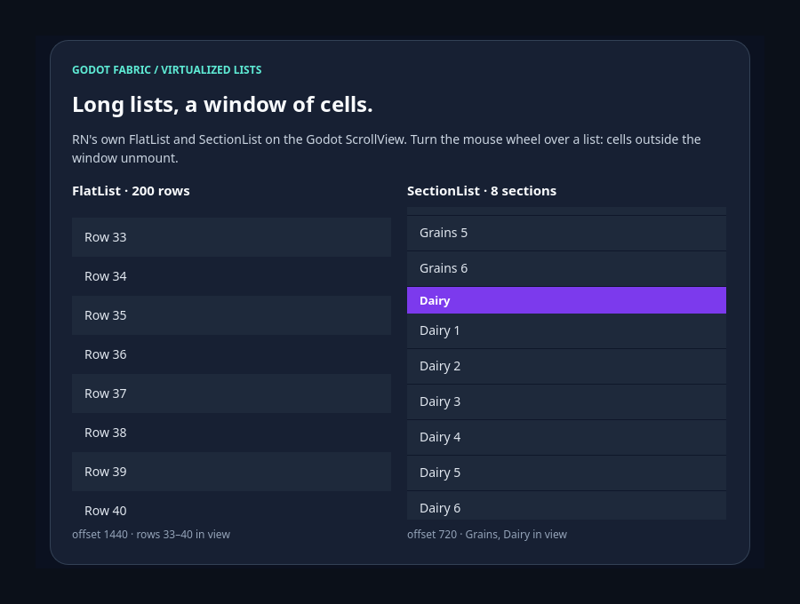](examples/virtualized-list/README.md) | [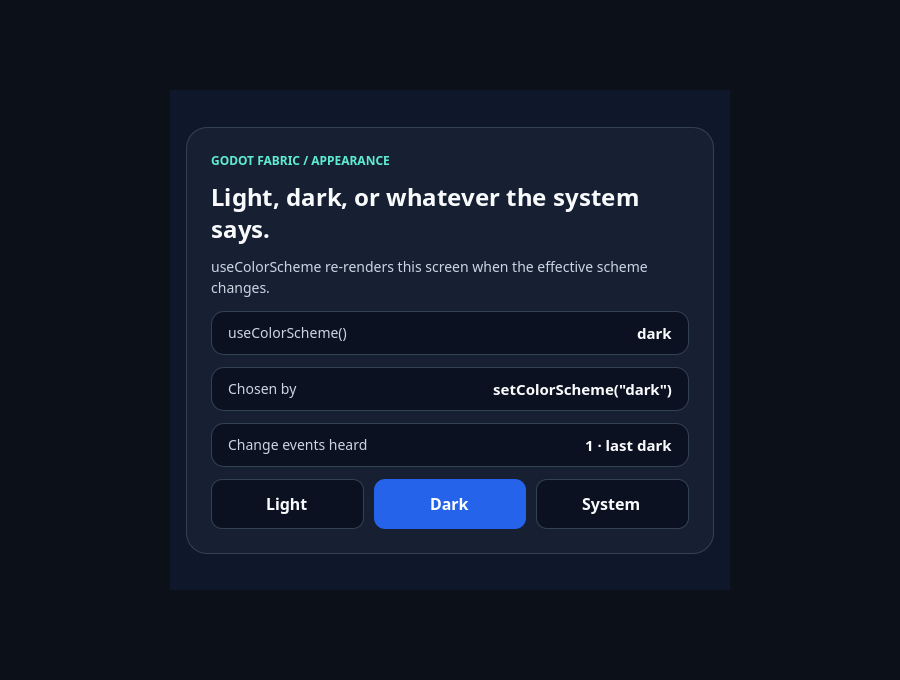](examples/appearance/README.md) | [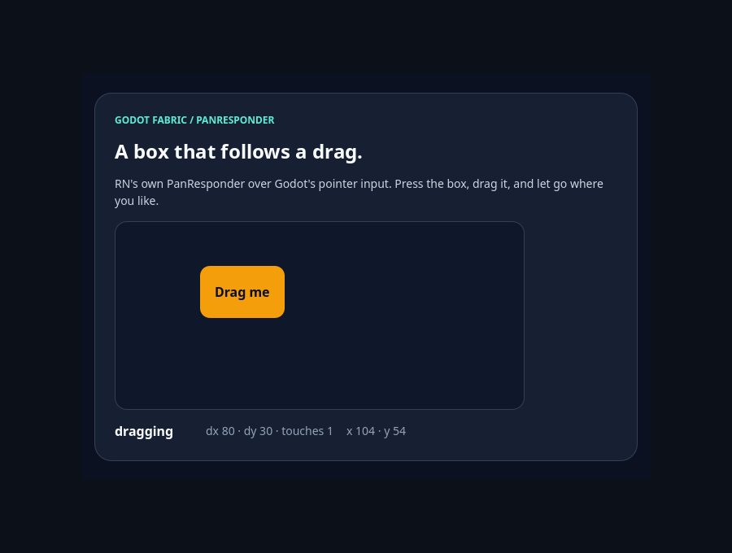](examples/pan-responder/README.md) |

| Text layout: initial | Text layout: after narrowing the column |
| --- | --- |
| [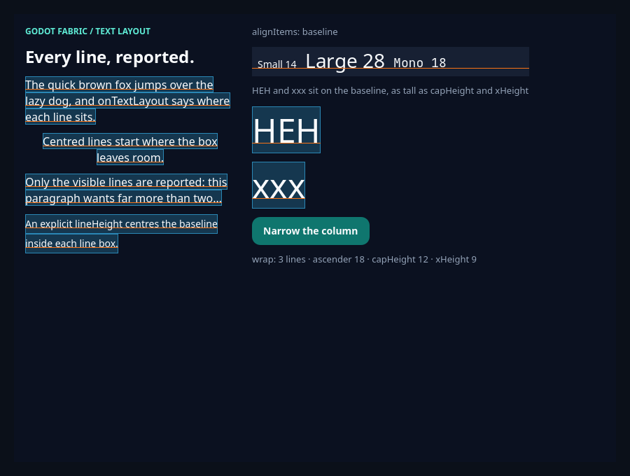](examples/text-layout/README.md) | [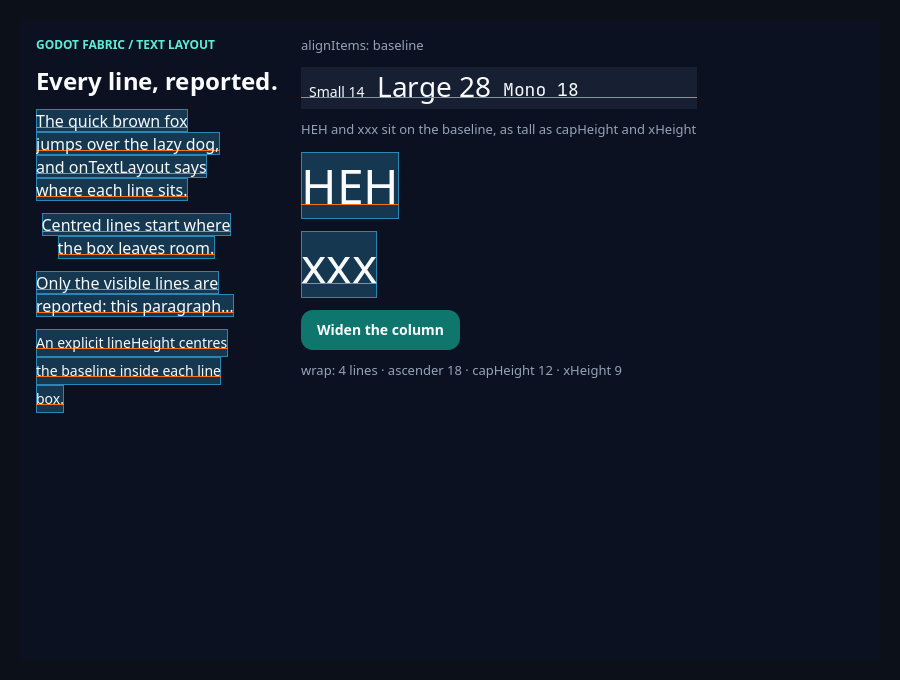](examples/text-layout/README.md) |

These six launcher examples run RN's original `Switch`, `ActivityIndicator`,
touchables, `FlatList` and `SectionList`, `Appearance` and `PanResponder` from the
public `react-native` import, each driven by real mouse input in its validation.
Every example README shows all the states it captures, and each evidence record
keeps the SHA-256 of its frames in a `captures.json`.

| Image: modes, sources, network pictures and effects | Image: after the clicks and a remount |
| --- | --- |
| [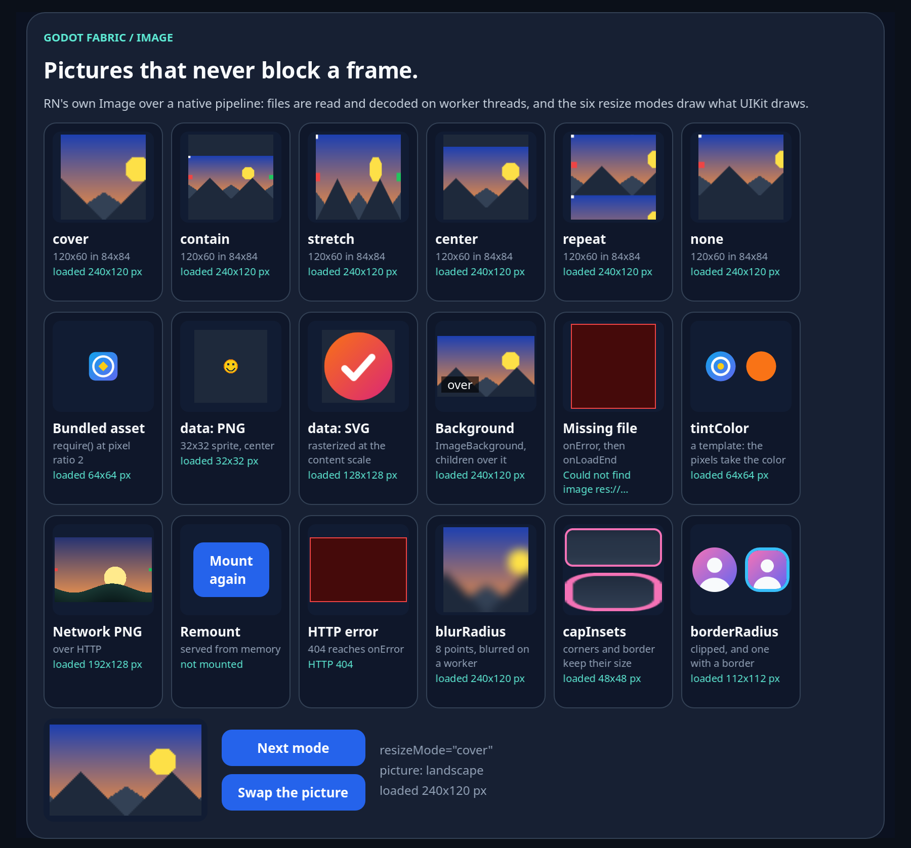](examples/images/README.md) | [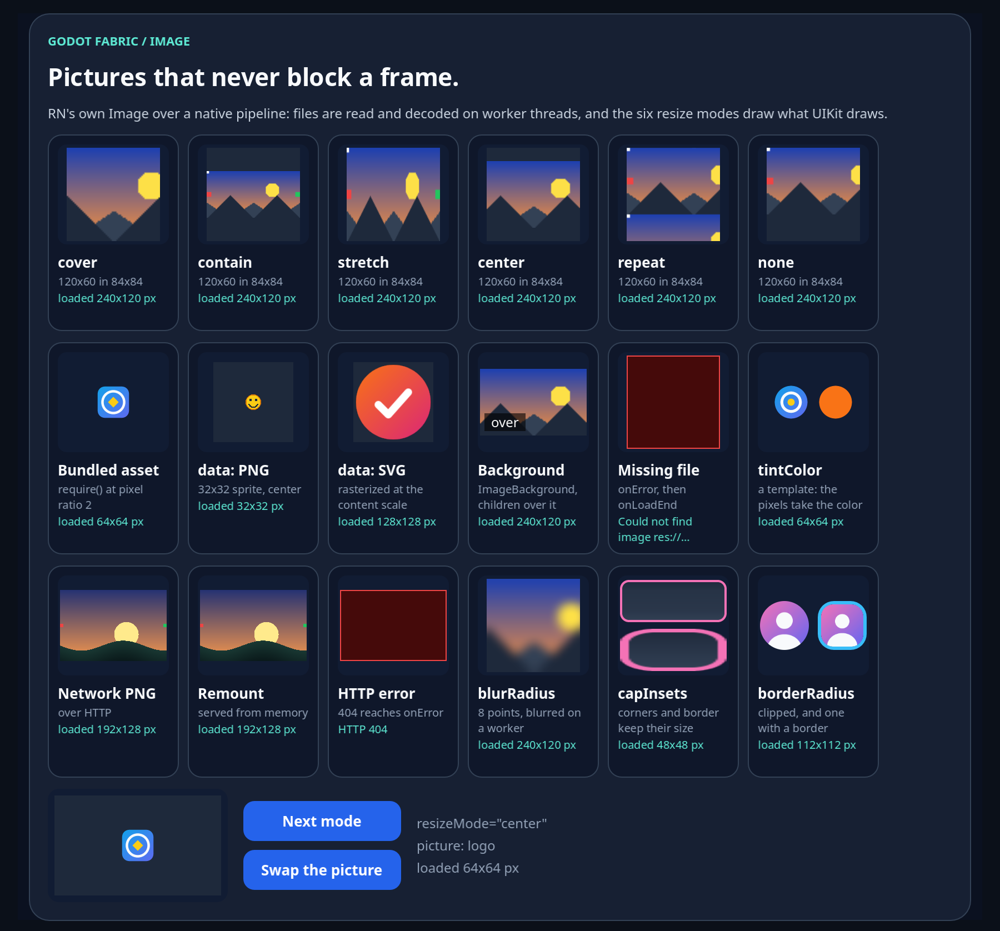](examples/images/README.md) |

The Image example's frames are taken at content scale 2; the visual evidence keeps their SHA-256 in
`report.json`, and the network and first slices keep their earlier frames of the same example.

| Pointerdown interest: initial | Pointerdown interest: after React updates |
| --- | --- |
| [](examples/pointer-interest/README.md) | [](examples/pointer-interest/README.md) |

This isolated probe uses its own test command outside the launcher catalog.
Its two 820×280 Viewport frames have 28 executed pixel assertions; the
[receipt](docs/evidence/pointer-interest/README.md) keeps injected ScreenTouch
input separate from hardware/mobile certification.

| Query faults: initial | TouchStart still commits after a failed lookup |
| --- | --- |
| [](examples/pointer-query-fault/README.md) | [](examples/pointer-query-fault/README.md) |

The 680×160 frames have 16 exact pixel assertions. Yellow counters change from
A=0/B=0 to A=3/B=1; the [receipt](docs/evidence/pointer-query-faults/README.md)
records the four faults and later retirement/stop separately.

| Document interest: initial | One descendant gesture updates its Document's state |
| --- | --- |
| [](examples/pointer-document/README.md) | [](examples/pointer-document/README.md) |

The 760×220 frames have 20 exact pixel assertions. A changes from 0 to 2 after
its original Document capture/bubble callbacks, while B remains 0. The
[receipt](docs/evidence/pointer-documents/README.md) keeps later capture-only,
isolation, retirement and root-fault controls separate from that captured frame.

| Pointerup interest: initial | A receives Up after B's independent touch gesture |
| --- | --- |
| [](examples/pointer-up/README.md) | [](examples/pointer-up/README.md) |

These 680×160 native frames have 24 fixed pixel assertions and independently
decoded PNG checks. Yellow follows TouchStart; green follows trusted Up. The
updated stage has starts A1/B1 and ups A1/B0, before capture-only and Cancel.
The [receipt](docs/evidence/pointer-up/README.md) separates manual installation
control from real native delivery and keeps wider acceptance open.

## Write React

### Shared application

`npm run example -- shared` mounts HUD and Inventory through the original
AppRegistry in one Hermes/Fabric application. Each root has local React state;
an explicit module store updates both. Updating props preserves state, while
unmounting one tree leaves the other running. The
[scene and root authoring guide](examples/shared/README.md) show how the
application owner and surfaces enter Godot's tree.


These are actual renderer readbacks. The [evidence](docs/evidence/shared-roots/README.md)
records checks and gaps; this is the bounded GF-07 prototype, not full RN/SDK parity.

### Runtime example

`npm run example -- runtime` opens a public React Native UI driven by intervals
and animation frames. Start runs four shared runtime probes; Pause cancels the
clock; six ticks complete the progress bar. See the
[initial, paused and completed captures](docs/evidence/runtime/README.md) for
the assertions behind each image and the remaining GF-05 gaps.


### Game services

`npm run example -- services` registers game methods, state getters and signals
in GDScript, then consumes them through `GodotFabric.call`, `connect` and
`subscribe`. Zustand holds the UI representation shared by HUD and inventory.
The game owns health, equipment and accepted jobs: closing inventory while
equipping leaves the job running and the surviving HUD receives its result.


The [example](examples/services/README.md) and
[API guide](docs/GAME_SERVICES.md) explain the initial snapshot race, revisions,
typed errors, pause, explicit cancellation and cleanup. This implementation
remains experimental; complete generated specs and RN parity remain open.

### Components

The build aliases `react-native` to the Godot platform facade and applies
the original NativeWind compiler. Start with the public
[counter](examples/counter/App.jsx). The shared Fabric application entry is
[examples/entry.jsx](examples/entry.jsx); the typography example is
[examples/typography/App.jsx](examples/typography/App.jsx).

```jsx
import { useState } from "react";
import { View, Text, Pressable } from "react-native";

function Counter() {
  const [count, setCount] = useState(0);
  return (
    <View className="p-6 gap-4 bg-slate-950">
      <Text className="font-sans text-xl font-bold text-white">
        React in Godot
      </Text>
      <Pressable onPress={() => setCount(value => value + 1)}>
        <Text className="text-white">
          Count: <Text className="font-bold text-emerald-300">{count}</Text>
        </Text>
      </Pressable>
    </View>
  );
}
```

Complete class strings must appear in `tailwind.config.cjs` content paths.
This repository is a runnable platform prototype with an independently
provisioned consumer. It is not yet a published npm package or a drop-in addon
release with prebuilt binaries. The consumer builder compiles a project's own Tailwind entry from
`godotFabric.tailwind` (the [libraries consumer](consumers/libraries/README.md)); it never runs a project's
`tailwind.config.*`, so a project declares its content globs, dark mode and theme as JSON.

## Verify

```sh
npm run test:examples                    # all interactive demos, headless and sequential
npm run test:runtime                     # native deadline budget and callback error recovery
npm run test:application                 # shared roots and rejected activation/lifetime cases
npm run test:consumer -- --capture        # fresh external project, private tools, real readbacks
npm run test:consumer:libraries -- --capture   # NativeWind and Chart Kit in an independent project with its own lockfile
npm run test:consumer:civ-lite -- --capture    # Frontier provisioned as a consumer, ten cycles with no leak and a monotonic epoch; sabotages: node scripts/consumer-civ-lite-sabotage.mjs
npm run test:services                    # real Hermes DTO, revocation and destruction boundaries
npm run test:codegen                     # original spec/schema/C++ generation and stale artifacts
npm run type-check                      # bounded strict public TSX consumer
npm run test:contracts                   # types/JS compiler/SVG/font contracts + Python fixtures
npm run test:pointers:geometry          # pinned RN counterexamples and real Hermes binding
npm run test:pointers:interest          # original Map query and native View pointerdown interest
npm run test:pointers:documents         # original Document/root interest across all four RN flag combinations
npm run test:transforms:guards           # rejected styles, invalid embedding input, cleanup, uniform scale and singular transforms
npm run test:frame-clock                 # display-paced frame callbacks and native animation, with controls and sabotages
npm run test:performance                 # native views, Hermes heap and phase timings in a mount/unmount soak, with controls and sabotages
npm run test:layout-animation            # RN's LayoutAnimation on RN's C++ driver; the old-host control and sabotages: node scripts/layout-animation-sabotage.mjs
npm run test:text-layout                 # onTextLayout and the Yoga baseline from the shaped paragraph; the old-host control and sabotages: node scripts/text-layout-sabotage.mjs
npm run test:text-original               # RN's original Text.js and press on the paragraph; the previous SDK and host controls and sabotages: node scripts/text-original-sabotage.mjs
npm run test:text-style                  # fontStyle italic and textDecorationLine on the paragraph; the previous SDK and host controls and sabotages: node scripts/text-style-sabotage.mjs
npm run test:civ-lite-game               # Frontier's rules in GDScript: a 12-turn replay to one golden hash in three processes, an independent oracle; sabotages: node scripts/civ-lite-game-sabotage.mjs
npm run test:frontier-services           # Frontier's GameServices node: the 12-turn roteiro played through typed services to the golden hash, an epoch, TS/Godot schema parity, the turn as an accepted job that survives its screen, a rule lane, the registry's budgets per phase; sabotages: node scripts/frontier-services-sabotage.mjs
npm run check:static
npm run check:publication
npm run test:cold                        # two disposable projects, no resource cache
npm run parity:status                    # API gaps and current native evidence
npm run parity:godot                     # shared core UI fixture in Godot
npm run check -- --typography --headless
npm run check -- --typography --capture
npm run test:typography                  # includes real native negative cases
npm run test:charts
npm run test:recovery
```

Run native checks sequentially: they share generated report files. Each check
imports through the editor and rejects native errors, script errors, crashes,
timeouts and exit without the acceptance marker. Headless proves native
contracts; captures independently exercise rendering and logical Viewport input.

[Architecture](docs/ARCHITECTURE.md) · [Architecture 2.0 direction](docs/ARCHITECTURE_V2.md) ·
[V2 decisions and practical tradeoffs](docs/ARCHITECTURE_V2_DECISIONS.md) · [API](docs/API.md) ·
[1.0 roadmap](ROADMAP.md) · [Parity audit](docs/PARITY.md) ·
[Findings](docs/research/README.md) · [Validation evidence](docs/evidence/README.md) ·
[Third-party licenses](THIRD_PARTY_NOTICES.md)

The [Codegen experiment](docs/CODEGEN.md) uses original RN specs/generators.
The [native extension layer](docs/NATIVE_EXTENSIONS.md) now loads selected
external Codegen components and TurboModules through the shared SDK. An
[independent Badge/Probe consumer](examples/native-extension/README.md) passes
[35 headless / 37 graphical checks](docs/evidence/native-adapters/README.md),
with typed events, public Commands, re-renders, defaults and cleanup. Loader
rejection tests cover 21 cases / 89 checks. Full GF-26/export/parity acceptance
remains open.


The [root-retirement example](examples/native-extension/README.md) also unmounts
or replaces one root from a native callback while another keeps running. Its
[318 checks in 17 Godot runs](docs/evidence/root-retirement/README.md) cover
deferred cleanup, same-host remount, application replacement and rejected stale
signals. Captures include pixel checks of the surviving native UI.


Only this renderer, generic demonstration fixtures and public documentation
are included. The repository starts with a new history; generated dependencies,
builds and environment-specific logs are excluded.

## License

The project's own code is [MIT licensed](LICENSE). Dependencies and bundled
fonts retain the licenses listed in [third-party notices](THIRD_PARTY_NOTICES.md).

The [Document pointerup example](examples/pointer-document-up/README.md) extends
the opt-in to original Document and documentElement Maps under all four flag
combinations. Eight lanes pass 1,371 headless checks; the actual macOS viewport
passes 243 checks and 20 native pixels. Document capture/bubble increment A
twice in one commit while B stays unchanged. Methods follow the original gates;
Event identity, own-root queries, removal, Cancel and stop are checked.
[Evidence and limits](docs/evidence/pointer-document-up/README.md) keep this
local proof separate from its [hosted CI receipt](docs/evidence/pointer-document-up/hosted-ci.json).

| Before Document Up | After Document capture and bubble |
| --- | --- |
| [](examples/pointer-document-up/README.md) | [](examples/pointer-document-up/README.md) |

### Document Up listener lifecycle

The [isolated example](examples/pointer-document-up/README.md) now validates
original RN `once` and `AbortSignal` with actual Godot input: 2,143 checks in eight
flag/SDK lanes, also passed in hosted CI, and 414 graphical checks, including 62
independently decoded pixels.
The first once Up extends A's yellow counter; the second preserves it while B
remains unchanged. [Evidence and remaining boundaries](docs/evidence/pointer-document-up-lifecycle/README.md).

| Before once | First native Up | Second native Up |
| --- | --- | --- |
|  |  |  |

### Document Up across root generations

The same example now checks Document Up listeners across a rerender, a root
retired while a finger is down and its replacement: 2,709 headless checks, also
passed in hosted CI, and 535 graphical checks with 90 pixels. Retirement cancels the held contact with
one TouchCancel and no Up, retained listeners never qualify the new root, and
only the fresh Document's listeners receive the next gesture.
[Evidence and limits](docs/evidence/pointer-document-up-refs/README.md).

| A retired, B holding | A remounted after a fresh gesture |
| --- | --- |
|  |  |

### Document Up listener mutation during dispatch

In the current lanes with native dispatch, listeners delivered by an actual native
Up remove, add and abort original Document listeners mid-dispatch. The eight-lane
matrix passes 4,401 headless checks, also passed in hosted CI, and the graphical
lane 835 checks with 118 pixels. A pending removal or abort is skipped in the same Up, an add to
the Map being iterated waits for the next gesture, and bubble listeners added by
a capture listener run in the same Up even though the root query saw only the
capture Map. [Evidence and limits](docs/evidence/pointer-document-up-mutation/README.md).

| Before an Up whose query saw only capture | After that Up |
| --- | --- |
|  |  |

### Reentrant dispatch from a native Document Up

A listener delivered by an actual native Up can dispatch a new `pointerup` on its
own or another root's Document before returning. The nested dispatch runs to
completion untrusted at target, at the Up's Discrete priority, without native
query or React update; the native Up then resumes trusted with its phase,
currentTarget, target, path and `globalThis.event` intact. Re-dispatching the
native Up itself throws `The event is already being dispatched.` The eight-lane
matrix passes 5,097 headless checks, also passed in hosted CI, and the graphical
lane 946 checks.
[Evidence and limits](docs/evidence/pointer-document-up-reentry/README.md).

### Document Up root query faults

A one-shot throw or non-boolean result in the native interest query for the
actual documentElement, at the Up offsets, rejects only that lookup with one
retained `E_POINTER_LISTENER_QUERY` diagnostic. A faulted bubble lookup still lets
a capture listener qualify the Up; with no other qualifying lookup the Up is not
delivered, while the original TouchEnd and contact cleanup survive. The faults run
in a second application, so the healthy matrix stays diagnostic-free: 6,451
headless checks, also passed in hosted CI, and 1,179 graphical checks with 132
pixels.
[Evidence and limits](docs/evidence/pointer-document-up-fault/README.md).

| After a faulted bubble lookup and its recovery |
| --- |
|  |
