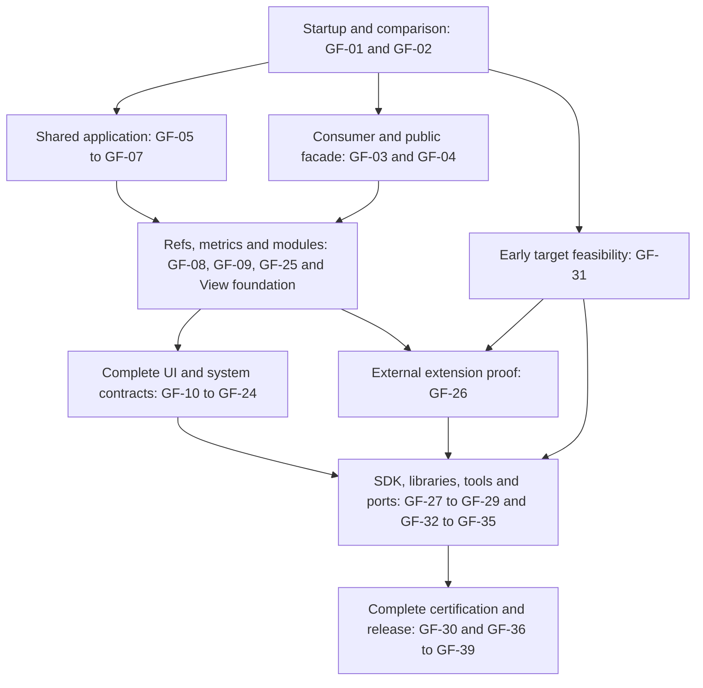

# Godot Fabric roadmap to 1.0

**Goal:** a usable Godot platform for the current stable React Native contract,
with original React/Fabric/Hermes/Yoga, a public typed SDK, native extension
support and exported applications on **macOS, Linux, Windows, Android and iOS**.
No Godot fork or rebuilt engine/export templates are part of this plan.

This is the canonical live work-status document. Baseline audit:
**2026-10-01, RN 0.87.1 / React 19.2.3 / Hermes 250829098.0.17 / Godot 4.7.2**.
See [current capabilities and gaps](docs/PARITY.md), the
[97-name API inventory](docs/compatibility/react-native-0.87.1.json) and
[retained runtime evidence](docs/evidence/README.md).

The [migration dashboard](dashboard/README.md) reads
[migration.json](dashboard/migration.json). Update its checkpoints, evidence,
remaining work, focus and history with every verified implementation slice.
The required item acceptance below remains authoritative; the dashboard
calculates checkpoint progress and does not replace full contract certification.
After committing and pushing the JSON, an implementation branch can publish
through `gh workflow run dashboard-pages.yml --ref main -f data_ref="BRANCH"`.
Confirm that exact workflow's successful deployment before reporting a public
update. The renderer comes from `main`; the published data identifies its branch
and resolved commit. Automatic deployment from `main` also remains enabled.

## Current position

The public repository, MIT license, pinned source dependencies, standalone
macOS prototype, generic fixtures, captures and contract CI are delivered.
Original reconciliation, Fabric commits, Yoga layout and several host subsets
already run. This foundation is **experimental 0.1**, not full RN parity.

GF-01 and GF-02 are **In progress**: [PR #4](https://github.com/journey-studios/godot-fabric/pull/4)
delivered the root API inventory, nine shared native reference cases, differential
CI and a cold-start containment. The GF-02 follow-up pins the tested engine,
validates it before native setup and covers failed-start cleanup. The crash was
narrowed to native-class discovery and the editor documentation shutdown path;
the upstream correction and full contract inventory remain open. See the [baseline](docs/compatibility/BASELINE.md)
and [cold-start evidence](docs/evidence/cold-start.md). GF-03/GF-04 and the
bounded public editing/widget slices of GF-12/GF-17 are now In progress.
The [typed public form](examples/form/README.md) delivers a single-line
TextInput/Button slice and explicit prop failures. Types cover bounded
View/Text/control imports and the registration/RootTagContext subset; complete facade types, mobile editing, other widgets
and differential certification remain open.

GF-05 is **In progress**: upstream TimerManager, portable RN microtask/immediate
modules, a public runtime example and four additional shared oracle cases are
implemented. [Runtime evidence](docs/evidence/runtime/README.md) records native
checks/captures and the remaining bootstrap, idle/error/global and starvation
gaps. The later DeviceInfo checkpoint starts GF-09; it does not complete GF-05.

The [runnable examples](examples/README.md) expose existing fixtures in a shared
project; they are a prerequisite for GF-28, not the independent packaged consumer
SDK required by that item. Each table row owns its status. Verification requires
its acceptance result, not an export stub, merged PR or unrelated green CI.

GF-07 is **In progress**: an explicit `FabricApplication` owns one Hermes,
UIManager, scheduler and timer queue. The [shared example](examples/shared/README.md)
registers HUD/Inventory through the original AppRegistry and validates root props,
independent state/input/constraints, module stores, unmount/remount and live
application scheduling with no mounted roots. This is the bounded 2A prototype:
full bootstrap, pause/resume, overlays/portals, reference comparison and the
complete SDK activation are still open. D19–D32 remain pending.
The [shared-root evidence](docs/evidence/shared-roots/README.md) retains local
positive/negative checks, real captures and the 12-example regression matrix.

The bounded [2B consumer/addon prototype](consumers/minimal/README.md) now runs
separate project TSX through resource-based entry configuration, a scene owner,
provisioned private tools and the editor build hook. A fresh external consumer
passes offline/no-global-Node builds, dependency/React-identity checks, visible
build rejection/recovery and two-root native assertions with real captures.
[Evidence](docs/evidence/consumer/README.md) records the exact scope.
GF-28/GF-29 remain In progress; complete installation/update, export,
diagnostics, development and per-target acceptance remain open. D19–D29 are
still pending. The later [game-services checkpoint](docs/evidence/game-services/README.md)
extends this same consumer with typed Godot calls, initial-state revision races,
ordered signals and connection cleanup. Sequence 3 remains In progress for
complete geometry, activation/restart and integrated milestone coverage below.

Priority meanings: **P0** blocks dependable development or the architecture;
**P1** is required to complete the 1.0 contract; **P2** extends the explicit
release scope. P0 describes urgency, not the full release checklist. Module
owners below are implementation boundaries, not assigned people.

The [native foundation checkpoint](docs/evidence/native-foundation/README.md)
starts GF-08/GF-09/GF-25: original RN public refs and NativeDOM use the Fabric
tree; generated DeviceInfo/SourceCode bootstrap and original JSI TurboModules
cover bounded measurements, subscriptions, promises/events and lifetime.
The [metrics example](examples/metrics/README.md) tests real resize, uniform
content density, reads without subscribers and Yoga rounding. These items
remain In progress for their full rows below. The
[services example](examples/services/README.md) now combines typed operations,
signals, consistent snapshots and Zustand across HUD/inventory. Pause,
hide/unmount/remount, accepted jobs, cancellation and terminal stop have bounded
native evidence. Full DTO string-domain parity, codegen, cross-thread execution
and restart/activation contracts remain open; D19–D32 are still pending.

GF-31/GF-35 now include the [iOS export/runtime checkpoint](docs/IOS_BUILD.md):
three native builds, two XCFramework combinations, unsigned arm64 device
export/link and 22 runtime checks in an x86_64/Rosetta iOS 18.4 consumer. Arm64
simulator execution is blocked by missing arm64 code in the official template;
physical-device, Debug, input/IME/AT and system-service certification remain
required. A reproduced engine-only mouse error is explicitly recorded. These
results are independent of the original RN reference-app CI and do not close
the iOS port or the other target foundations.

GF-26 is **In progress**: the standalone [Codegen experiment](docs/CODEGEN.md)
uses the original pinned parser/generators for a TurboModule and Fabric Badge
spec, producing common C++ and ViewConfig artifacts with reproducible checks.
The isolated compilation witness instantiates the generated descriptor and a
typed Promise/event TurboModule against the existing macOS arm64 Release build.
The [executed evidence](docs/evidence/codegen/README.md) retains 20 Node tests,
six compiled translation units and explicit generation/runtime distinctions.
The first hosted Codegen attempt failed on its assumed private Node path before
compilation. Explicit CI Node selection now has three tests and a fresh local
six-unit witness. The corrected [hosted run](https://github.com/journey-studios/godot-fabric/actions/runs/37145700599)
passed all five jobs at `5d46bba`, including the six-unit Codegen compilation.
Its [artifact evidence](docs/evidence/codegen/hosted-ci.json) records the actual
CI Node 22.23.2 separately from declared addon Node 22.23.3.
It rejects unsupported schema, collisions and stale inputs/artifacts. This
first slice does not register a native provider or draw the Badge. The next
slice must expose external factories/adapters safely, remove the fixed native
component assumptions, integrate specs before bundling and prove a consumer's
props/events/commands, defaults, stale refs and cleanup without core edits.

The next verified GF-26 foundation now provides a
[shared native SDK and registration SPI](docs/NATIVE_EXTENSIONS.md): 22 preflight
tests, 14 SDK receipt/packaging tests and an independent relocated C++ client
with 11 cases / 207 registry checks. Original generated descriptors link to the
shared host; rollback/reentrant cleanup, lazy selection/installation and terminal
lookup/disposal are exercised. [Evidence](docs/evidence/native-sdk/README.md)
retains consumed-source/binary hashes and separate package/link/registry claims.
Actual Godot cold start, runtime/roots/modules/services, 15 existing examples
(605 checks) and the independent consumer (18 tooling + 40 native checks) pass
against the rebuilt host. The [hosted SDK run](https://github.com/journey-studios/godot-fabric/actions/runs/37147754831) passed all five jobs
at `7a67f96`, with the original artifact confirming the same 207 registry checks.
Actual CI tooling/native source hashes are [retained separately](docs/evidence/native-sdk/hosted-ci.json).
A further [executed external-adapter slice](docs/evidence/native-adapters/README.md)
now passes 21 loader cases / 89 checks, and an independent original-Codegen
Badge/Probe consumer passes 35 headless / 37 graphical checks. Its JSX uses the
original registry, generated Props/emitter/Commands/CxxSpec and a shared native
host. Two roots exercise reorder, defaults, current/stale callbacks, remount,
Promise/emitter delivery and extracted-method shutdown. Captures document real
Godot rendering. Core regressions and the 207-check registry client pass.
Complete schema/name/reflection coverage, external containers/native state,
long-lived asynchronous work, full RN differential parity and all-target
export/ABI acceptance remain open; GF-26/GF-28/GF-31 stay **In progress**.
A traditional-consumer replay passed 18 tooling / 40 native checks after an
isolated recovery fingerprint mismatch; the unchanged assertion now retains
baseline/recovered bundles for investigation. That failure is historical; the
executed fix is described below.
An additional [native shutdown slice](docs/evidence/adapter-shutdown/README.md)
reproduced Control deletion inside a Godot signal during a Fabric commit. Stop
now retires authority immediately and delays destruction until execution returns;
resize/RAF/timer fixtures passed **8/9/9 checks**, and the external consumer
passed **35 headless/37 graphical** again on the rebuilt host. Native suites
passed **2/4/2/2** serially. Independent root destruction was not covered in
that slice; the executed follow-up below adds that coverage. Long-lived async
work remains open. Hosted run **37151683147** passed loader
**89** and registry **207** but reproduced the consumer recovery fingerprint
failure; its external runtime lane did not run. The subsequent
[shutdown CI](docs/evidence/adapter-shutdown/hosted-ci.json) at
`9317b46` passed all five jobs, with **35 headless** and **8/9/9 shutdown**
checks confirmed in its artifact; it predates the new builder correction. No
GF acceptance, dependency or denominator is closed by this slice.
Hosted evidence remains separate from graphical local execution and complete
RN/all-target acceptance.

An [explicit project-TSConfig slice](docs/evidence/bundle-determinism/README.md)
now fixes a reproduced import/alias ordering race in esbuild. Eighteen diagnostic
processes kept the same 154 physical/transformed inputs: inferred configuration
produced two bundle hashes, explicit configuration one. Five causal Node tests
cover both orders, strict:false, JSX and inherited settings. The actual consumer
passed **18 tooling/40 native** checks with exact recovery hashes preserved;
selected-adapter runtime passed **35/37** and shutdown **8/9/9** again. Six more
builds kept the same bundle/selection bytes and all 154 inputs. Current local
contracts passed **126 Node/13 Python**. Its
[hosted run](https://github.com/journey-studios/godot-fabric/actions/runs/37154927839)
at `9c75031` subsequently passed all five jobs; it predates the resolution
implementation below. The [resolution probes](docs/evidence/bundle-determinism/resolution-gaps.json)
remain discovery evidence for that next slice.

The [GF-03 project-resolution slice](docs/evidence/project-resolution/README.md)
now executes inherited local `paths` aliases and declared dependencies installed
inside their importing libraries through the normal addon/editor. The fresh
consumer passed **27 tooling/40 native/43 graphical** checks; its alias variant
passed **40/43**, and the nested-dependency variant **40**. SDK React identity,
lockfile ownership and exact-byte recovery remain verified. Relative imports
cannot bypass package declarations; ordinary project files with RN-like names
retain their own implementations. Unsupported suffix orders/type spoofing,
escaping aliases fail explicitly. At `dde5485`, app aliases colliding with
package/private SDK imports were also rejected; the follow-up below removes
that bounded restriction. Config/manifest snapshots reject changing or stale declarations
before publication. Original Codegen adapter runtime passed **35/37** and
shutdown **8/9/9** on the same native SDK.
Local gates also passed **172 Node/13 Python**, **10 native tests** and the
**15 headless examples/605 checks**. Complete types, assets, exports/package
conditions, arbitrary resolution/transform settings, all-target SDK/export
acceptance and D20 remain open. No GF or denominator closes with this slice;
its newer hosted acceptance is tracked separately from the preceding green run.

The [scoped-alias follow-up](docs/evidence/alias-scopes/README.md) now preserves
application, nested-library and SDK ownership in both original TypeScript
checking and runtime resolution. The actual addon/editor consumer passed
**30 tooling/40 native/43 graphical** checks; its colliding-name variant proves
distinct literal types and rendered values, unchanged SDK React identity,
lockfile ownership and exact-byte recovery. Wrong cross-scope types fail before
publication. Local gates passed **199 Node/13 Python**, **78 targeted** and
**10 serial native tests**. Codegen adapter runtime passed **35/37** and shutdown **8/9/9**.
Eight determinism/transform controls retain the reproduced race negative,
strict:false, inherited JSX and class-field behavior.
Original Metro 0.87.1 comparisons cover eight conditional-export/import profiles
and author key order/exact targets; missing-target fallback and external
`#imports` remain two explicitly tested differences. ESNext/Preserve + Bundler
is the bounded compiler profile; NodeNext/Node16/CJS emit, runtime `types`
conditions, declaration execution and unimplemented decorator metadata fail
visibly. Full types/assets/profiles/Metro/workspaces/exports and all-target
acceptance remain open; D20 and GF-03/GF-28 remain open. No denominator changes.
[Preceding resolver CI](docs/evidence/alias-scopes/preceding-ci.json) passed all
five jobs at `f2eb57f`. The subsequent scoped-alias CI passed all five jobs at
`80729da`; its [separate record](docs/evidence/root-retirement/preceding-ci.json)
predates the root-retirement implementation below.

The [independent-root retirement slice](docs/evidence/root-retirement/README.md)
now extends 2A with **17 real Godot runs / 318 checks** on macOS arm64 Release.
Resize/pressed/RAF/timer callbacks can retire one root while another keeps its
state, Controls, VM, module cache and scheduling. Immediate remount, synchronous
host free and replacement by another application preserve the current owner
and reject old refs/events. Cleanup uses original React/Fabric work in a deferred
Godot phase, outside the original registry visit. A reproduced old core Button
signal across reused root/tag IDs is now rejected using its originating runtime
and mount identity; a fresh Button still delivers normally. Original external
ViewProps no longer enter a core props cast, and adapter font ownership is
verified against a failing preceding binary. Three graphical root cases also
check rendered pixels and retain captures. Regressions passed **199 Node/13
Python**, **10 native tests** and **15 headless examples/605 checks** on the
rebuilt host. Full GF-07/GF-26/GF-28 acceptance,
original RN differential lifecycle, other targets/exports and ABI remain open.
No item, decision or checkpoint denominator closes with this slice. Its
[preceding hosted CI](docs/evidence/view/preceding-ci.json) subsequently passed
all five jobs at `b5dafc8`; the View implementation below has separate evidence.

The [public View foundation](docs/evidence/view/README.md) starts GF-10 with
original RCTView/ViewComponentDescriptor, authoritative Fabric mount order and
rectangular hidden/scroll clipping in both painting and hit testing. Four
physical border colors, source-over alpha, asymmetric rounded joins and style
removal use resolved upstream ViewProps without adding overlay Controls.
Public clipped-child measurements retain the full logical rectangle; keyed and
flattening updates preserve the selected child identity and stale refs retire.
The final fixture passed **67 headless / 107 native checks**, including **36 RGBA
samples** and three captured stages. The previous host failed **9/67** headless
and **24/107** native checks against the same final oracle, as expected.
Regression gates passed **202 Node/13 Python**, **10 native tests**, **16 headless
examples/672 checks**, **58 NativeWind native checks** and **17 adapter runs/318
checks**. NativeWind now verifies public logical-parent measures independently
against real window-space Controls, preserving padding, gap and responsive
assertions when original Fabric mounting flattens/reparents nodes. Only GF-10
first-slice checkpoint becomes done; the full item and dependencies remain open.
[Hosted CI at `b5df4d6`](docs/evidence/view/ci.json) passed all five jobs; its
reference fixtures do not certify full View rendering or Godot mobile ports.
RTL/logical edges, transforms/origin, rounded descendant masks, fractional/DPI
geometry, full StyleSheet/shadows/filters and original mobile View differential
certification still need execution.

The [coordinate and gesture slice](https://github.com/journey-studios/godot-fabric/blob/48e425345b0ecb7665a7a447c9c14453c8e4ece0/docs/evidence/coordinates/README.md) at verified implementation `48e425345b0ecb7665a7a447c9c14453c8e4ece0` now
addresses that reproduced GF-08/GF-09/GF-13 gap. Public page points and original
measure use root space; location remains relative to the original target, and
screen points include native Window origin and current content density. The
first hit root also samples density immediately after a content-scale change,
without depending on another root or the next frame to refresh a cache.
Two independent roots passed **238 headless / 247 native checks**, **6 RGBA
samples** and three captures. Real MOVE inside/outside/return, release outside,
moving a held surface, nonuniform root scale and raw-window density-two input
preserve original Pressability state, target identity and public geometry.
The preceding host fails **121/238 headless and 121/247 native** checks, while
the intermediate cached-density host fails exactly **1/238**: first screen point
was `(990,568)` instead of `(495,284)`. The final host passes the same oracle.
Regressions passed **202 Node/13 Python**, **10 native tests**, **17 headless
examples/910 checks** and **17 adapter runs/318 checks**. GF-13 becomes In progress
with only its first-slice checkpoint done; full input/HostInstance/metrics/View
and differential/target acceptances remain open. Overlapping/nested roots,
embedded Window/SubViewport, singular/rotated embeddings, RN component
transforms, physical hardware, OS DPI, multitouch and the remaining interaction
contracts still require their own evidence. Next in sequence 3: expand View
transforms and public HostInstance behavior against the original contract.
No new architectural decision, complete GF item or denominator changes here.
The [hosted CI receipt](docs/evidence/coordinates/ci.json) keeps local proof,
current CI, preceding simulator-discovery failure and verified Pages deployment
separate; none supplies the still-open full differential/target acceptance.
Coordinate CI snapshots `f40831e` and `b1732fb` each passed all five jobs,
including cold start and the current limited RN oracle. The later affine
transform slice below keeps its new local proof separate from that hosted CI.

The [affine transform slice](https://github.com/journey-studios/godot-fabric/blob/6e5db7b5cb6a4bce567c7c648240c8637a3b944f/docs/evidence/transforms/README.md) at verified implementation
`6e5db7b5cb6a4bce567c7c648240c8637a3b944f` extends
GF-07/GF-08/GF-10/GF-13 using original RN transform processors and resolved
ViewProps. Ordered transforms, percentage translation/origins, shear and
reflection affect the same Godot Control through public base/offset APIs.
No engine rebuild or extra host node is needed. Independent coefficients,
exact corners and renderer pixels are checked separately from original RN
ancestor-AABB measures and Yoga layout. Resize-only updates, removal and
flatten/materialize/flatten preserve the child Control, tag, ref and React state.
The final gallery passes **309 headless /345 native checks**, **33 RGBA samples**
and three captured phases. The previous coordinate host fails **65/309 and
68/345** against the identical fixture and bundle.

The standalone factor test passes **40,932 checks**, including proportional
rank-one rounding cases. Six fresh Hermes applications pass **61 rejection and
teardown checks** for singular, 3D/perspective and native-precision limits.
Native error recovery no longer detaches a Control rejected before insertion.
Another **25 actual input checks** reject a false START caused by composed
determinant overflow, accept a restored positive press and cancel held contacts
using their last valid coordinates under overflow or a singular external
Surface. The canceled event is consumed before Godot GUI tries another inverse.
The intermediate transform host fails **9/25** on the same input fixture.
These external-embedding safety checks do not implement singular JSX rendering.

The final rebuilt binary passes **205 Node/13 Python**, **10 native tests**,
**18 headless examples/1,219 checks** and **17 adapter runs/318 checks**.
The native SDK source and loaded consumer host hashes match the executed final
implementation. [Pages run37171971971](https://github.com/journey-studios/godot-fabric/actions/runs/37171971971)
succeeded with branch JSON5885331, checked against the served public file.
The [hosted receipt](docs/evidence/transforms/ci.json) preserves the earlier
pending observation and the subsequent successful five-job run separately;
its limited RN reference cases do not certify full transform or target parity. GF items, full contract/differential/target
checkpoints, decisions, weights and the dashboard denominator remain unchanged.
Valid transform animation during contact, transformed masks, complete
HostInstance commands, RTL and mobile differential acceptance remain open.
Next in sequence 3: continue the public HostInstance/native-command branch.

The [completed hosted run](https://github.com/journey-studios/godot-fabric/actions/runs/37171931529) at `5885331` passed contracts, native cold start, original iOS/Android references and parity comparison. The dated earlier pending observation remains in [ci.json](docs/evidence/transforms/ci.json). These limited reference fixtures do not close full transform parity, the Godot mobile ports or GF-08.

The [public tree and ID slice](https://github.com/journey-studios/godot-fabric/blob/31d08ac37d1fb61a80c233aada6a3cfc3549bfcc/docs/evidence/tree/README.md) at verified implementation
`31d08ac37d1fb61a80c233aada6a3cfc3549bfcc` extends GF-08 and
GF-10 through original RN `View.js`, base ViewConfig and narrowed read-only types.
Public View `id` takes precedence over `nativeID`; Text `nativeID` and document
lookup use the committed Fabric tree for each root. Logical parent/sibling
traversal, snapshot collections, duplicate IDs, text replacement, native
materialization and stale refs are tested across two roots and their retirement.
The pinned production RawText replacement/null ownerDocument and children-only
native-ID reversion are documented with original source links rather than
silently replaced with browser semantics.

The unchanged native host passes **89 headless / 99 native assertions**, **8
RGBA samples** at independently declared slots and two actual captures. Four
frame assertions prove the native reorder separately from logical traversal.
The same final fixture fails **25/89** with the preceding JS configuration;
restoring it regenerates exact positive bundle bytes. Regressions pass **206
Node / 13 Python**, **10 native tests**, **19 examples / 1,308 final checks** and
**17 adapter runs / 318 checks**. A first consumer graphical timeout is retained;
explicit test-window focus preparation precedes a fresh successful full run.
[Pages run37175019378](https://github.com/journey-studios/godot-fabric/actions/runs/37175019378) passed build/deploy; served JSON matches `a012f9e`, source `31d08ac`, outside main.
The [hosted receipt](docs/evidence/tree/ci.json) records contracts passed with
other jobs still running in that snapshot. These are separate from local proof.
The later [hosted run37175169255](https://github.com/journey-studios/godot-fabric/actions/runs/37175169255)
at `a608d07` passed all five jobs. It validates the preceding tree snapshot,
including the limited mobile reference suite; it is not a focus differential.
GF-08/GF-10 remain
In progress; checkpoints, dependencies, weights, decisions and denominator do
not change. Next in sequence 3: original TextInputState, public focus and native
commands, followed by remaining HostInstance/EventTarget and pointer capture
acceptance. Full mobile tree differentials and all-target evidence remain open.

### Public input focus checkpoint (2026-10-04)

The [focus slice](docs/evidence/focus/README.md), verified against implementation
`3b09b37acf735664301d3ddaf9ab275519893267`, extends GF-08/GF-12 through
the original TextInputState singleton, original public element prototype and
Fabric/Codegen focus commands. Callback-time focus, autoFocus, native transfers,
readonly updates, callback ref replacement, keyed replacement/removal and stale
commands are tested against the actual Viewport owner and LineEdit focus.
Native eligibility guards cover deleted/stopping inputs and off-tree reparenting.
Canonical props are not used as an authority for committed native editability.

The final fixture passes **175 headless / 189 native checks**, **12 pixels** and
two captures. It executes off-tree, root-retirement and application-stop
callbacks inside native operations. Controls fail **23/160** against the
preceding native host and **11/175** without JS native eligibility. Restoring
the final implementation restores exact bundle/native bytes. Regressions pass
**207 Node / 13 Python**, **10 native tests**, **20 examples / 1,483 checks** and
**17 adapter runs / 318 checks**. Exact identities and the initial fixture
callback-ref correction are retained in the linked receipts.

GF-08/GF-12 remain In progress. Existing slice checkpoints gain evidence;
full contract, reference parity, dependencies and targets remain open. Weights,
decisions and the 156-checkpoint denominator do not change. Next in sequence 3:
remaining HostInstance/EventTarget and pointer-capture acceptance. Hidden trees,
hardware keyboard/IME, multiline and mobile focus differentials retain their
separate acceptance requirements. Publication/hosted results are recorded after
verification; local runtime proof is distinct from both. Manual Pages run
[37177743564](https://github.com/journey-studios/godot-fabric/actions/runs/37177743564)
passed build/deploy and served branch JSON `0d7c731` exactly;
[the hosted snapshot](docs/evidence/focus/ci.json) keeps new focus CI status
separate from the completed preceding tree CI. Later focus snapshot
[CI37177820811](https://github.com/journey-studios/godot-fabric/actions/runs/37177820811)
at `1699e5c` passed all five jobs; limited reference coverage remains distinct
from a full focus/mobile differential.

The isolated native-command complement passes **112 checks / 40 actual focus
owner observations**, eight exact malformed-argument rejections and recovery,
with all nine input registrations released. The downloaded hosted artifact
confirms those results and source identities. The complement CI completed with
contracts/native/Android passing; iOS discovery failed and comparison skipped.
The [dated hosted receipt](docs/evidence/focus/commands-ci.json) retains the
iOS simulator-discovery timeout before app build, followed by a successful
13-check core reference on identical inputs. This does not close GF-08/GF-12 or
certify full focus/mobile parity. The later [pointer lifetime slice](docs/evidence/pointers/README.md)
passes 132/146 public checks,144 native assertions and 43 JSX fault/real-focus
stop checks, with 12 pixels/two captures and two original-source crash controls.
Generated native lifetime guards preserve the upstream capture negotiation;
complete EventTarget, transformed/hardware/mobile acceptance remains open.

## Release contract and scope

1. Ordinary public RN imports and TypeScript/TSX work, including stable
   components, props/styles/events, imperative refs, public utilities and
   required JS globals. The 84 stable/compatibility value exports in the audit
   are the first inventory slice; the complete contract is larger.
2. Applicable behavior matches a pinned original RN reference app on iOS and
   Android. Desktop ports implement the shared API and declare concrete OS
   mappings. Differences require a reviewed rationale and fixture; essential
   shared behavior cannot be waived under a generic “Godot limitation.”
3. App authors can register a typed TurboModule and a Fabric native component
   with events/commands through a documented build/export path. Existing mobile
   native binaries still require host ports; 1.0 does not promise every library.
4. macOS arm64, Linux x86_64, Windows x86_64, Android arm64 and iOS arm64 plus
   simulator are release gates. Each has a clean installation, packaged consumer
   app and physical input/system-service evidence. OS minimums are established
   in GF-31, rather than guessed now.
5. NativeWind and the selected chart/SVG contract have explicit supported
   versions and executable consumer examples. Larger library ports, Web/WASM,
   additional architectures and 13 experimental/unstable RN exports are P2.

“Current RN” is a versioned promise. GF-38 rechecks the latest stable version
before release, tests the corresponding React/Hermes combination and publishes
that support matrix. A release cannot claim “current” while ignoring a newer
stable baseline; an explicitly older baseline must be named and approved as a
scope change. RC/nightly APIs are not automatically added to the 1.0 gate.

## Next implementation order

Follow the [Architecture 2.0 migration order](#architecture-20-migration-order)
below: establish reliable startup and comparison fixtures; advance the shared
application and independent consumer in parallel; connect geometry, refs and
native services; prove external extensions; then expand UI/system behavior,
distribution and certification. Begin portable-build, accessibility and IME
probes immediately. Keep existing examples as regression evidence.

### Architecture 2.0 migration order

**Sequencing recorded: 2026-10-02.** This is the agreed prioritization of work,
not approval of the remaining architecture contracts. At this sequencing
checkpoint, the [decision register](docs/ARCHITECTURE_V2_DECISIONS.md) records
**18 approved directions and 14 pending decisions**. No item changes status because of this
plan; the release scope and acceptance requirements remain in force.

Prioritize foundations with many dependents and early tests that can reveal
design constraints. Decision numbers organize discussion, not implementation.
M0 through M5 group responsibilities; they are not a requirement to finish one
entire group before beginning another.

| Sequence | Delivery slice | Existing work owners | Prerequisite and observable result |
| --- | --- | --- | --- |
| 1 | Reliable startup and comparison fixtures | GF-01, GF-02 | Reproduce and fix cold-start/root-cause and minimum-version gaps; fresh startup, failed-start cleanup and positive/negative comparison cases remain observable |
| 2A | Shared application, bootstrap and roots | GF-05, GF-06, GF-07 | Start from the reliable baseline; register/mount two distinct roots in one runtime, update props and unmount one without restarting the other; extend the semantic suite with each behavior |
| 2B | Minimal independent consumer and authoring flow | GF-03, GF-04; initial slices of GF-28/GF-29 | Advance alongside 2A; a separate TSX project uses public imports/types and project-owned dependencies, with visible build/unsupported-contract errors and no hidden demo aliases |
| 3 | Geometry, refs and Godot-to-React communication | GF-08, GF-09, GF-25; View foundation in GF-10 | Integrate 2A/2B; window/surface metrics, drawing, measures and input agree; typed calls/events respect lifetime, initial-state revisions and stale-reference rejection |
| 4 | External native module and component | GF-26, supported by GF-25/GF-31 | Use the native registry, refs, View foundation and identified binary combination; an independent consumer builds/runs a module and component with specs, events/commands and cleanup without editing the core |
| 5 | Complete UI, interaction and system behavior | GF-10 through GF-24 | Expand the host/service foundations through the dependency branches below; forms, gestures, animations, scroll/lists, images, widgets, accessibility and services pass their applicable fixtures; OS-specific completion also needs the relevant port |
| 6 | Distributable SDK, selected libraries, development tools and complete ports | GF-27, GF-28, GF-29, GF-32 through GF-35 | Combine host contracts, extensions and per-target tooling; clean consumers install, debug and export identified artifacts; selected libraries and real input/system integration have target-specific evidence |
| 7 | Complete certification, performance and release | GF-30, GF-36 through GF-39 | Close coverage for the promised scope, budgets and soak/recovery cases; verify the actual release head, current stable baseline policy and reproducible SDK/consumer artifacts before 1.0 |

These are **implementation slices**, not substitutes for the complete item
acceptance. A minimal consumer does not close GF-28, a working form does not
close GF-12, and an early port spike does not close GF-34/GF-35. Close each item
only when its full result and completion dependencies in the tables pass.
Selected contracts can be implemented and tested before every contract of a
preceding item is complete; record exactly which slice and host were exercised.

The diagram groups slices; the item tables retain the more precise completion
dependencies. Intermediate alphas/betas can ship narrower declared scopes
without labelling them full 1.0 parity or reducing the agreed release goal.

### Dependencies that determine the schedule

- **Bootstrap and semantics → roots → refs/metrics:** GF-05/GF-06 precede full
  GF-07; GF-08/GF-09 depend on GF-07. Root/application lifecycle is an early
  migration foundation even though GF-07 has P1 release priority.
- **Public facade, bootstrap and roots → native modules:** GF-03/GF-05/GF-07
  feed GF-25. GF-25 is in M3 but is a prerequisite for completing styles,
  editing, animation, accessibility, environment and network contracts.
- **Refs, metrics, View and text → editing:** GF-08/GF-09/GF-10/GF-11, together
  with the public facade/native modules, support complete GF-12. IME, selection
  and focus commands need correct host geometry and native lifetime.
- **Editing, input and animation → scroll → lists:** full GF-14 requires
  GF-12/GF-13/GF-19 as well as refs/metrics; GF-15 requires GF-10/GF-14.
  A partial ScrollView probe is not a completed host for upstream lists.
- **Environment and modules → networking → remote images:** GF-21/GF-25
  support GF-22, which GF-16 needs for network images. This branch can advance
  alongside scrolling after its own prerequisites are available.
- **Extensions and portable builds → complete SDK/ports:** GF-26/GF-31 feed
  GF-28. A consumer/packaging prototype starts early; complete SDK acceptance
  includes extension and per-target export results, with port certification
  continuing in GF-32 through GF-35.

### Architecture decisions before dependent implementation

Use this discussion priority for the **14 pending decisions**. Agree the
contract needed by the next slice before implementing behavior that depends on
it; detailed formats and measured internal choices can be specified with that
slice. This schedule does not turn a recommendation into an approved contract.

| Discussion priority | Pending decisions | Reason and work connection |
| --- | --- | --- |
| 1 · Evidence and migration criteria | [D31](docs/ARCHITECTURE_V2_DECISIONS.md#v2-d31), [D32](docs/ARCHITECTURE_V2_DECISIONS.md#v2-d32) | Define comparison evidence and slice exit criteria before changing the host; connect GF-01/GF-37 and this migration plan without weakening 1.0 scope |
| 2 · Platform and execution safety | [D30](docs/ARCHITECTURE_V2_DECISIONS.md#v2-d30), [D27](docs/ARCHITECTURE_V2_DECISIONS.md#v2-d27), [D28](docs/ARCHITECTURE_V2_DECISIONS.md#v2-d28) | Define service responsibilities, shutdown/ownership and executor boundaries for GF-05/GF-07/GF-25/GF-31; thread migration, caching and Rust still require profiling in GF-30 |
| 3 · Authoring and activation | [D19](docs/ARCHITECTURE_V2_DECISIONS.md#v2-d19), [D20](docs/ARCHITECTURE_V2_DECISIONS.md#v2-d20), [D21](docs/ARCHITECTURE_V2_DECISIONS.md#v2-d21), [D29](docs/ARCHITECTURE_V2_DECISIONS.md#v2-d29), [D22](docs/ARCHITECTURE_V2_DECISIONS.md#v2-d22), [D26](docs/ARCHITECTURE_V2_DECISIONS.md#v2-d26) | Connect builder, resolution, transforms, types, activation and diagnostics across GF-03/GF-04/GF-28/GF-29; a successful build alone is not successful activation |
| 4 · Resources and distribution | [D24](docs/ARCHITECTURE_V2_DECISIONS.md#v2-d24), [D25](docs/ARCHITECTURE_V2_DECISIONS.md#v2-d25) | Keep resource identities, artifact generations and per-target exports coherent for GF-16/GF-28/GF-31 through GF-35 |
| 5 · State preservation while editing | [D23](docs/ARCHITECTURE_V2_DECISIONS.md#v2-d23) | Add Fast Refresh in GF-29 after reload, activation and cleanup are reliable; document eligible edits and fallback/state loss |

The **18 approved directions** map to the existing work as follows. These are
ownership links for the migration, not evidence that the decisions are shipped.

| Approved direction | Implementation connection |
| --- | --- |
| [D01–D02](docs/ARCHITECTURE_V2.md#v2-d01) · application and surface identity | GF-07/GF-28, with GF-05/GF-06 runtime foundations |
| [D03–D08](docs/ARCHITECTURE_V2.md#v2-d03) · calls, data, events and connection lifetime | GF-25 transports/game bindings, coordinated with GF-05/GF-07 and typed consumer work in GF-03/GF-28 |
| [D09–D12](docs/ARCHITECTURE_V2.md#v2-d09) · tree, input, time and hosting contexts | GF-07/GF-08/GF-09/GF-10/GF-13/GF-21, plus module/runtime integration |
| [D13–D16](docs/ARCHITECTURE_V2.md#v2-d13) · native discovery, compatibility, specs and behavior | GF-25/GF-26/GF-28/GF-31; each component also belongs to its functional GF item |
| [D17](docs/ARCHITECTURE_V2.md#v2-d17) · original library identity and demonstrated scope | GF-27/GF-37/GF-38 |
| [D18](docs/ARCHITECTURE_V2.md#v2-d18) · self-contained editor flow and project dependency ownership | GF-28/GF-29/GF-31, with GF-03 resolution/types |

In particular, make the GodotFabric binding/revision/lifetime scenarios explicit
in GF-25/GF-07 acceptance slices. A generic TurboModule example alone does not
prove every game-integration contract in D03–D08. Track those cases within the
existing owners rather than creating a second backlog from the decision IDs.

### Parallel probes and verification throughout migration

- **GF-31 begins immediately:** prove loading, JSI and a minimal Control in
  Android/iOS consumers with official Godot/templates; establish the native
  build/ABI constraints before committing the complete port design.
- **Accessibility and IME paths begin immediately:** investigate a real OS
  semantic/focus/action bridge in GF-20 and native composition/keyboard paths in
  GF-12, coordinated with GF-31. An exported executable or metadata dictionary
  does not prove assistive technology or editing behavior.
- **Comparison and CI grow per slice:** GF-01 fixtures feed GF-37 continuously;
  extend GF-36 native lanes as targets become runnable. Early passing subsets
  are not the complete certification required in sequence 7.
- **Measure before optimizing:** establish GF-30 frame/heap/node baselines and
  budgets on available workloads during migration; add list/target workloads
  as they exist. Separate runtime/mount executor contracts early, then choose
  caching, workers or bounded C++/Rust work from measured bottlenecks.

### First integrated milestone: HUD and inventory consumer

Build a generic independent Godot consumer with **HUD and inventory in one
shared application**. This integrates selected contracts from sequences 1–3;
it is an alpha migration milestone, not complete RN parity or closure of every
participating GF item. Keep the existing form/runtime/chart/style examples as
regressions and identify which host each report exercised.

Acceptance for this milestone:

1. Configure the application/addon and run public TSX imports in the separate
   consumer without editing demo internals. Exercise the provisioned basic
   editor flow from D18 without requiring global Node; additional dependencies
   remain project-owned and explicitly installed.
2. Mount HUD and inventory with separate identities/local state in one Hermes.
   Share data explicitly when needed; no state-management library is required.
3. Update the HUD from Godot data/signals, including an initial revision and
   changes during connection. Invoke a typed game operation from the inventory;
   observe defined results/errors and event ordering.
4. Resize only the inventory: its constraints/layout and input/measure geometry
   update while HUD geometry and window metrics retain their meanings.
5. Pause the simulation while UI input/timers remain available. Hide, unmount
   and remount the inventory according to their distinct lifecycle contracts;
   the HUD and application remain operant.
6. Close the inventory during an accepted operation; its result must not access
   the old mount. Repeated mounts/cleanup do not duplicate listeners or leak
   owned nodes, and runtime restart rejects old refs/callbacks.
7. Once pending activation/diagnostic contracts are agreed, inject build and
   activation failures and verify their distinct recovery policies. Outdated
   build responses cannot become the active generation; source maps identify
   the executed generation. Do not imply rollback of accepted game operations.

Record semantic assertions, root/runtime identities, cleanup observations and
native visual captures. Extend this same consumer with an external module and
Fabric component in sequence 4, then grow selected library cases. Screenshots
explain the scenario; they do not replace lifecycle/event/ref assertions.

**Checkpoint 2026-10-03:** the independent consumer demonstrates points 1–4
through public TSX, one runtime/two roots, typed Godot services and inventory-only
resize with original refs, stable window metrics and native editing. The separate
services laboratory demonstrates pause, hide/unmount/remount and accepted-job
lifetime from points 5–6. This is split evidence, not acceptance of the entire
integrated milestone: runtime restart and stale refs (6), pause/job lifetime in
this same provisioned consumer (5–6), and the pending activation/diagnostic contract (7) still need
the integrated consumer. Boundary/lifetime fixtures additionally prove queued
revocation, source destruction, terminal stop and synchronous application
destruction. The next dependency is the external spec/module/component slice
in sequence 4, coordinated with the View foundation and approved contracts.

## M0 — Establish a reliable, measurable contract

Owners: public facade/bundler, runtime lifecycle and acceptance harness.
Exit: a clean consumer can start, import truthful APIs
and expose a contract failure without hidden no-ops or stale evidence.

| ID / priority / work | Status | Required result and acceptance | Completion dependencies |
| --- | --- | --- | --- |
| GF-01 · P0 · Full contract inventory and oracle | In progress | Expand the versioned root inventory to types, component props/styles, events, ref commands, globals and applicable OS APIs. Every target contract has an owner and positive/negative fixture. Run shared fixtures against an original pinned RN iOS/Android app and Godot; record semantic traces, layout tolerances and platform applicability before implementation | None |
| GF-02 · P0 · Clean startup and engine contract | In progress | Reproduce the signal-11 cold import with fresh dependencies/resource cache; isolate load/import/shutdown and fix the root cause. Align extension metadata with the actual minimum supported Godot API. Repeated first installs and failed-start cleanup pass in native CI without retrying away crashes | GF-01 |
| GF-03 · P0 · Public API and typed platform resolution | In progress | Export actual public TextInput/Button contracts, use the original wrapper where viable, and provide strict RN-compatible public types. Resolve `.godot`, `.native`, JS/JSX/TS/TSX, assets and package conditions through a documented consumer bundler. An independent TSX app imports every in-scope root name; implemented APIs run, unfinished contracts still fail visibly | GF-01 |
| GF-04 · P0 · Eliminate silently accepted behavior | In progress | Audit facade destructuring, validAttributes, values and event registration. Implement or explicitly reject each unsupported prop/value, including accessibility metadata and userSelect/collapsable semantics; verify updates/removal as well as initial mount. Before 1.0 all applicable target contracts must be implemented, not merely guarded | GF-01, GF-03 |
| GF-05 · P0 · RN bootstrap and JS globals | In progress | Integrate upstream core initialization or an audited equivalent. Certify timers/arguments/cancellation, intervals, microtasks, immediate/idle callbacks, monotonic RAF, performance, errors and required URL/encoding/abort globals. Verify task ordering, callback exceptions, starvation and unmount cleanup against RN; network transport is GF-22 | GF-01 |
| GF-06 · P1 · React/Fabric semantic suite | In progress | Exercise every applicable feature in the pinned native React renderer, including dev StrictMode, refs/cleanup, transitions, Suspense, effects/external stores, batching, supported Activity/hidden-tree behavior and errors. Verify abandoned renders produce no native mounts and events/updates preserve upstream priority. Reuse upstream reconciliation rather than implement a second scheduler | GF-01, GF-05 |
| GF-07 · P1 · Root and surface lifecycle | In progress | Deliver AppRegistry/RootTagContext and supported mount/update/unmount APIs, multiple uniquely identified surfaces, root props, scene changes/pause/resume and error cleanup. Design overlays/portal needs against the actual public RN contract. Repeated root replacement and two concurrent surfaces preserve independent state and release tags/timers/subscriptions | GF-05, GF-06 |
| GF-08 · P1 · Public refs and native commands | In progress | Complete applicable HostInstance/React Native node APIs, root/text instances, measure/measureInWindow/measureLayout, setNativeProps and public UIManager/findNodeHandle behavior. Compare transformed/window coordinates and commit timing; deleted refs and stale commands must not access freed nodes | GF-03, GF-07 |
| GF-09 · P0 · Real metrics and platform identity | In progress | Supply window and screen dimensions, density/font scale, resize/orientation/insets and stable subscriptions. Define `Platform.OS = godot`, physical OS metadata and platform selection/resolution without impersonating iOS/Android. Verify high DPI, font scaling, multi-window coordinates and logical/pixel conversions with reference traces and real devices | GF-01, GF-07 |

**GF-02 checkpoint (2026-10-02):** the extension minimum now matches the tested
Godot 4.7.2 runtime. Setup rejects a different engine before downloads/build
outputs; runners discard stale success reports before version validation.
Regressions cover interrupted startup-list publication, disposable-project
cleanup and visible import/runtime failures. Prepared cold imports and runtime
checks pass locally. Direct empty-cache import still reproduces the engine
crash, consistent with [upstream issue #111645](https://github.com/godotengine/godot/issues/111645).
GF-02 remains In progress; the [evidence record](docs/evidence/cold-start.md)
distinguishes containment, local verification and the remaining engine boundary.

### Focus command boundary complement (2026-10-04)

The [original-dispatch guard fixture](docs/evidence/focus/commands.json) passes
**112 checks / 40 native focus-owner observations**. Eight malformed focus/blur
calls reach exact argument diagnostics, preserve focus/State/events and allow
later valid commands and React commits across two roots plus an independent
application. Readonly/removed/stopped targets retain no focus authority; all
nine input registrations and native lifetimes clear at shutdown. This is a
headless native complement on the unchanged focus host; CI now runs it, with
hosted results recorded separately. No new checkpoint or full GF closes.

### Pointer transport, capture and exception lifetime (2026-10-04)

GF-08/GF-13 remain **In progress**. Real Godot input now reaches original pointer
serialization/negotiation and public View capture refs, with app-owned contact
IDs, no-hit drag routing and selective retirement. The [executed receipt](docs/evidence/pointers/README.md)
records 132 headless/146 native checks,12 pixels/two images and 144 native
assertions. Two original processor/binding controls reproduce retained-target
and moved-hover-tracker SIGSEGV; the generated hash-pinned overlay fixes those
boundaries while preserving downloaded sources and original JS negotiation.

An isolated original JSX bundle passes 43 checks with six deliberate listener
errors, priority recovery and synchronous stop from a genuine LineEdit focus
signal inside got capture. Another app's already-captured pointer survives.
Native SDK overlay headers/identity are repackaged and validated separately.
Original Pressability regressions still test fresh Down after focus cancellation.

The [hosted receipt](docs/evidence/pointers/ci.json) independently verifies the
144 processor assertions, 43 JSX checks and both original-source crash controls
from CI artifacts at `a15fde4`. That run completed successfully in all five jobs;
its original RN reference comparison covers the current oracle fixtures.
Pages run `37197499767` passed build/deploy; the served
JSON exactly matched that branch commit outside main. Neither publication nor
the original Android/iOS reference lanes certify Godot mobile ports.

This slice does not enable imperative EventTarget flags or close transformed
capture, nested responder/PanResponder, hardware/keyboard, multi-window/scroll,
cross-app stacking or mobile differentials. No architecture decision or full
checkpoint/GF is newly closed. [Source analysis](docs/research/pointer-capture-boundary.md).

### Captured pointer geometry checkpoint (2026-10-04)

GF-08/GF-09/GF-13 remain **In progress**. The
[public geometry fixture](examples/pointer-geometry/README.md) passes 631
headless / 648 native checks, with 14 pixel checks and three Viewport captures.
The identical final fixture fails 55/631 checks on the previous committed host:
54 offsets and one exact terminal-coordinate check. Native local projection
covers rotation/skew/reflection, shared-root embeddings, flattened refs,
no-hit drag, real React transform commits and immediate raw density-two input.
Physical-origin client/page/screen fields and original capture ordering remain
separate from target-local offset and original public AABB measures.

The unchanged RN processor and lifetime overlay, compiled with their matching
binding sources/headers, each pass 108 portable checks with identical
unprojected numerical results. That fixture does not execute the binding. Three declared
cases expose the pinned incomplete capture algorithm. The Godot correction
intentionally differs from AABB origin subtraction; it is not numerical parity
with that incomplete algorithm. A real Hermes/binding witness passes 378
checks, including immutable retained samples, interleaved roots, native/JS
fault recovery, default priority initialization and monotonic terminal history.

Singular cancel preserves only the same contact/family/exact prior native point;
another captured contact survives. Connected `display:none` capture keeps the
pinned empty-layout coordinates and ordering. Late input cannot restore ended
or retired authority. Native SDK pack/verify, registry 207/11 cases, loader
89/21 cases and 13 headless consumer runs/213 checks pass with the fresh
header/binary combination; ABI certification remains false. Contracts pass
199 Node/13 Python checks and 22 example scenarios/2,246 headless checks pass.
[Executed receipt](docs/evidence/pointer-geometry/README.md).

Original queued coalescing, complete EventTarget/responder/PanResponder,
scroll/multi-window/hardware/keyboard and mobile capture differentials remain
open. Typed JSI exception RTTI across framework boundaries is uncertified.
No architecture approval, weight, denominator, complete checkpoint or GF item
changes. The [hosted receipt](docs/evidence/pointer-geometry/ci.json) confirms all five
jobs passed at f90206f and audits original108/108, binding378 and headless631
artifacts. Pages37202857849 passed build/deploy; served JSON matched f90206f
outside main. Reference mobile jobs contain no captured-pointer oracle.

### Original EventTarget baseline (2026-10-04)

GF-05/GF-08/GF-13 remain **In progress**. The isolated original-ref probe passes
119 headless checks in four Hermes runtimes/five surfaces. Each enabled root
executes 33 manual checks: original listener identity/removal, capture/bubble,
flattened ancestry, once/reentrancy, mutation, AbortSignal, cancellation,
passive and public error cleanup. The two-flag matrix retains original defaults
and rejects late/repeated overrides. One deliberate listener fault arrives once
through TimerManager; all runtime work/timers and native nodes retire.

Three gaps are reproduced separately with positive controls: imperative-only
native pointer interest, the compiled legacy dispatcher omitting imperative
delivery despite working JSX, and permanent parent cache on a warmed detached
ref versus a cold detached sibling. [Executed receipt](docs/evidence/event-target/README.md)
and [source investigation](docs/research/event-target-boundary.md). Production
flags/bundle were unchanged in that baseline; native delivery remains pending.
The subsequent current-ancestry correction is recorded below. This does not close any full checkpoint, GF or architectural
decision. [CI receipt](docs/evidence/event-target/ci.json) audits 119 identical
check IDs and all three gaps at 515d0d7; all five jobs passed. This hosted
manual baseline remains separate from native EventTarget integration.

### EventTarget current-ancestry correction (2026-10-04)

GF-08 remains **In progress**. Shared consumer/laboratory bundling now generates
a hash-guarded correction to the pinned permanent parent cache. The original
parent getter resolves current NativeDOM ancestry for each new event path; the
original dispatcher still snapshots that path before callbacks.
[Evidence](docs/evidence/event-target-ancestry/README.md) records **102 checks
in each original/corrected variant**, using identical fixtures/native host.
Retired warm refs dispatch locally after item/ancestor/root removal and remount.
Another root retains its identities, and listeners installed before a keyed
sibling reorder continue working. A separate original-EventTarget graph proves
synchronous capture-time mutation preserves the current path and changes the
next path; this does not claim native React reparenting with retained identity.

Five overlay guards, contracts204/13Python, consumer30/40, original119 control,
focus/command and pointer processor/error gates pass. All22examples/2246headless
pass with the shared correction; no native rebuild was needed. Default
EventTarget flags remain off, native interest/dispatcher and complete responder
acceptance remain open. [Hosted artifact](docs/evidence/event-target-ancestry/ci.json)
now confirms both102 variants at91e5219 with exact local check IDs and source
pins. All five jobs passed. Performance, hardware/mobile
and the full GF-08 contract are pending. No checkpoint, dependency,
architectural decision, weight or denominator is closed.

### Native touch-tag resolution and dispatcher comparison (2026-10-04)

GF-05/GF-08/GF-13 remain **In progress**. Ending one of two contacts inside a
responder exposed a production integration bug: the pinned compiled renderer
treated Godot's numeric touch target as a Fiber, so its descendant check released
the owner prematurely. Shared bundling now inserts a hash-guarded numeric-only
lookup through the runtime UIManager/current committed tree and original weak
instance handle. Invalid/removed tags return null; canonical/Fiber inputs retain
their original path. The official Godot engine is unchanged; the addon is rebuilt.

The [executed comparison](docs/evidence/event-dispatch/README.md) runs **647
identical checks per variant**. Original lookup fails exactly two normative
inside-contact retention checks; corrected lookup passes all 647 on the same
native host. Explicit calls to the original experimental dispatcher in one
two-root runtime are compared with actual Godot touch input through the compiled
legacy path in a separate two-root runtime. Normal trusted JSX/imperative
capture/bubble, nested globals, deliberate faults and recovery are exercised
separately from original responder-event semantics. Pressability now verifies
retained pressed state, a moving surviving contact and one final activation.

Contracts227/13 Python, 22 examples/2250 headless, Pressability47, independent
consumer30/40 and original EventTarget/ancestry/focus/pointer gates pass. Fresh
native SDK pack/verify and addon provisioning pass; stale native source/binary
combinations are rejected before output creation and after copying. Thirteen
composition guards complement 14 existing SDK tests. Static/publication scans
pass. Hosted run37218513221 at897b127 now passes all five jobs; the artifact reproduces647 IDs, both original negatives and the corrected pass with17 source pins audited.

Four experimental responder differences remain open: unrelated contact retention,
should-set error currentTarget cleanup, truthy should-set acceptance and undefined
termination transfer. Public EventTarget flags remain off. Native imperative
interest, batched dispatcher integration, complete responder/PanResponder,
reentrant teardown, lookup performance, dev renderer and hardware/mobile parity
remain pending. No new complete checkpoint, GF or architectural decision closes;
the dashboard denominator and weights are preserved.

### Native EventTarget batch and terminal lifetime (2026-10-04)

GF-06 starts **In progress** with its first host-validated semantic slice;
GF-05/GF-07/GF-08/GF-13 remain **In progress**. Shared bundling can opt into the
original dispatcher inside the existing renderer batch. Raw typed/star emit once;
legacy extraction is exclusive. Default generated renderer source retains the
preceding tag correction, and public flags stay disabled.

[Evidence and captures](docs/evidence/event-dispatch-integrated/README.md) record
181 original/206 integrated headless checks and236 viewport checks/28 pixels.
One native touch reaches an imperative-only listener; mixed JSX/imperative handlers
commit both functional React updates once after callbacks, changing native geometry.
Fault ordering/recovery, root-local contact scope, removal and surviving roots
have distinct controls. Explicit global manual contacts do not certify mobile scope.

The probe fixes two native defects: terminal pointer retirement preceding queued
Cancel delivery, and reentrant ancestor detachment while Godot removes a child.
A previous-host queue control fails its normative registry assertion in both lanes;
an intermediate original-lane control crashes with signal11. Root-scoped removal
deferral and revoked-origin pointer checks pass the current control in both lanes;
ordinary resize/free remains separately verified through actual adapters.

Contracts235/13 Python,18 overlay guards, fresh SDK, loader89/21 and13 actual
adapter runs/213 checks passed. Current-host consumer30/40,22 examples/2250 and pointer/focus/tag regressions
passed. Source/host pins are recorded in the receipt. [Hosted integration CI](https://github.com/journey-studios/godot-fabric/actions/runs/37223152112) passed all five jobs at0478499; the audited artifact matches 181/206 IDs, 16 committed pins, 13 RN inputs and bundle identities. Hosted lanes are headless; mobile jobs are the existing core references. The subsequent pointer-interest query requires its own proof.

Native imperative pointer interest, full experimental flag matrix, four original
responder differences, complete PanResponder/types, registered-null-target JS,
reentrant full-queue contracts, dev renderer, performance and hardware/mobile
parity remain open. Next: native listener interest with an imperative-only positive
and removal/abort/lifetime controls, then dispatcher flags and responder gaps.
Only GF-06's first semantic slice gains a completed checkpoint; no complete GF,
architectural decision, full parity/dependency acceptance or denominator closes.

### Original listener Maps qualify native pointerdown (2026-10-04)

GF-05/GF-06/GF-07/GF-08/GF-13 remain **In progress**. The shared SDK can
opt into a pure query appended to hash-pinned original RN EventTarget source.
It reads actual capture/bubble listener Maps, including immediate removal,
`once`, abort and duplicate identity, without a second registry, wrapped handlers
or mutated View event props. Only View-path `pointerdown` interest changes;
original dispatch and renderer batching still own callback delivery. Public
imperative/native EventTarget flags remain off.

The [executed receipt and actual captures](docs/evidence/pointer-interest/README.md)
record **193 original / 230 current headless checks** and **260 native macOS
viewport checks**, including 28 asserted pixels and two saved captures. Both
lanes share 13 producer pins, 13 original RN inputs and the same new native host.
An imperative-only View gets no native Raw in the original filter and one
delivery in the query lane; separate manual positives establish listener identity.
Flattened ancestry has a live original ref/Fiber and no native Control. The
14-case matrix covers capture/bubble, listener mutation and mixed JSX delivery.
Document-only listeners still have a manual positive and native zero-Raw negative.

Actual re-render retains the original ref/tag/listener. Replacement and remount
cannot revive old listener authority. B keeps an actual held contact while A
unmounts, releases it and receives another gesture. Stop removes/releases the
query and clears native contacts/roots/pending tasks. This certifies teardown,
not a post-stop query invocation. Injected ScreenTouch input is distinct from
hardware input.

Shared guards15 plus native guards6, contracts250Node/13Python, static scan,
22examples2250, consumer30/40, fresh native SDK pack/verify, loader89/21 and
13actual adapters213 pass. Previous native dispatch181/206 and pointer
processor/geometry regressions pass on the new host. This slice's CI is pending;
the preceding integration CI at0478499 is independently audited above.

Next: document/documentElement interest, complete experimental flag combinations
and visible query-fault cleanup, then other pointer categories and responder gaps.
Performance, dev renderer, full refs/commands, complete PanResponder,
hardware/mobile and full release acceptance stay open. Adapter ABI remains
experimental. No additional checkpoint, complete GF, decision, weight or
denominator changes. [Scope and platform-specific filters](docs/research/native-pointer-interest.md).

## M1 — Complete the native UI tree

Owners: component descriptors/adapters, Yoga/style schema, paragraph/input and
scroll host. Exit: normal forms, dialogs and large lists
work through public RN imports with applicable upstream behavior.

| ID / priority / work | Status | Required result and acceptance | Completion dependencies |
| --- | --- | --- | --- |
| GF-10 · P1 · View, styles and RTL | In progress | Complete shared View props/styles and StyleSheet/color utilities: logical edges, RTL, baseline/layout constraints, transforms/origin, borders, opacity/clipping, z-order, supported shadows/filters and hit geometry. Reproduce asymmetric border colors before fixing. Certify mount/update/removal, fractional layout, custom colors and dynamic RTL against the pinned schema | GF-04, GF-08, GF-09, GF-25 |
| GF-11 · P1 · Text and fonts | Planned | Complete Text props/events/refs, pressable/selectable spans, inline content, truncation/alignment/decoration, baseline/font scaling and font loading/fallback. Validate bidi, emoji, grapheme clusters, mixed fonts, empty/trailing lines, nested updates and measurement/painting agreement. Define tolerances explicitly where font engines differ | GF-08, GF-09, GF-10 |
| GF-12 · P1 · TextInput and keyboard | In progress | Connect the public wrapper to native controlled/uncontrolled editing. Complete multiline, IME composition, selection/graphemes, secure input, keyboard types/actions, autofill where applicable, submit/end-edit sequencing, undo and commands. Deliver Keyboard/KeyboardAvoidingView and prove real desktop IME and mobile keyboard/insets, including JS transformations and delayed acknowledgements | GF-03, GF-08, GF-09, GF-11, GF-25 |
| GF-13 · P1 · Input, Pressability and touchables | In progress | Complete pointer/touch/responder and PanResponder contracts, multi-pointer identity/capture/cancel, hitSlop/retention, hover, keyboard/focus traversal and applicable touchable behaviors. Preserve event coordinates/priorities under transforms/scroll. Hardware and injected fixtures cover nested negotiation, interrupted gestures, disabling/removal mid-press and no duplicate activation | GF-06, GF-08, GF-09, GF-10 |
| GF-14 · P1 · Scroll and refresh | Planned | Complete applicable ScrollView props/events/commands: animated scroll, drag/momentum sequence, clipping, nested scrolling, paging/snap, platform bounce/zoom where applicable, indicators, refresh, keyboard interactions and resizing. Compare offsets/content/insets and event timing; verify ownership during child gestures and interruption | GF-08, GF-09, GF-12, GF-13, GF-19 |
| GF-15 · P1 · Virtualized lists | Planned | Run upstream VirtualizedList/FlatList/SectionList/VirtualizedSectionList over the completed host. Certify windowing, item identity/state, measurement/getItemLayout, viewability, onEndReached, scrollToIndex failure/recovery, separators/sticky sections and dynamic data. A 10,000-row fixture mounts a bounded window and has measured frame/memory results | GF-10, GF-14 |
| GF-16 · P1 · Images and asset pipeline | Planned | Deliver Image/ImageBackground/AssetRegistry with bundled/URI/data assets, density selection, size/resize/tint/animation, loading/error/progress, caching and public image methods. Native async decode must not block frames; cancellation/unmount and missing/corrupt assets pass exported-app tests. Network image behavior uses GF-22 | GF-03, GF-09, GF-10, GF-22, GF-25 |
| GF-17 · P1 · Shared widgets | In progress | Deliver Button with RN title/onPress semantics, Switch and ActivityIndicator plus their stable props/events/accessibility and platform color behavior. Reuse shared upstream JS wrappers where possible. Verify controlled updates, disabled/focus/loading transitions and consumer imports rather than legacy demo aliases | GF-03, GF-10, GF-13, GF-20 |
| GF-18 · P1 · Modals and safe areas | Planned | Deliver Modal presentation/dismiss/requestClose, overlay stacking/focus/back handling and the pinned SafeAreaView behavior. Handle orientation/insets and root ownership across windows/surfaces. Verify nested dialogs, background focus, keyboard, abrupt unmount and exported mobile presentation | GF-07, GF-09, GF-13, GF-20, GF-23 |

## M2 — Supply the platform runtime and OS behavior

Owners: JSI/TurboModules, animation/event loop, platform service bridges and
accessibility host. Exit: components and public services
observe the real system and retain the original event/callback contracts.

| ID / priority / work | Status | Required result and acceptance | Completion dependencies |
| --- | --- | --- | --- |
| GF-19 · P1 · Animated and layout animation | Planned | Deliver upstream Animated/Easing/hooks and LayoutAnimation with an actual native animation backend and driver semantics. Cover timing/spring/decay, composition/interpolation, event binding, cancellation and layout transitions; synchronize native values and JS callbacks. Measure under JS load, background/resume and reduced motion; complete core animation without requiring Reanimated | GF-05, GF-08, GF-09, GF-10, GF-25 |
| GF-20 · P1 · Accessibility | Planned | Map the semantic tree, roles/labels/state/actions, focus, live announcements, hidden/grouped content and AccessibilityInfo settings/events to the OS assistive technology bridge. Prove screen-reader traversal/activation, keyboard navigation, reduced motion and text scaling on each target. A metadata dictionary alone is not a pass; a missing OS bridge is a release blocker to resolve early | GF-04, GF-07, GF-09, GF-13, GF-25 |
| GF-21 · P1 · System environment and app lifecycle | Planned | Deliver real Appearance/useColorScheme, AppState, device configuration and subscription behavior. Cover system theme changes/manual override, foreground/background/focus, memory pressure and event cleanup. Test window minimization, scene pauses and mobile resume with pending timers/network/animations; remove fixed success values | GF-05, GF-07, GF-09, GF-25 |
| GF-22 · P1 · Networking and web-standard runtime APIs | Planned | Deliver the required fetch/XHR/WebSocket, headers/body/form data/blob and abort behavior, backed by real native networking. Certify streaming/progress/cancellation, TLS/redirect/cookie policies, offline/reconnect and errors with a deterministic local test server. Freeze exactly which pinned RN globals/methods are in scope and verify module disposal | GF-05, GF-21, GF-25 |
| GF-23 · P1 · Shared device services | Planned | Implement applicable Alert, BackHandler, Linking, Share, Vibration, Settings and legacy Clipboard behavior through typed OS modules. Include promise/callback/error/event contracts, deep links and interaction with scene/navigation roots. Verify success, denial, unavailable hardware, lifecycle and cancelled operations on exported consumers | GF-07, GF-21, GF-25 |
| GF-24 · P1 · OS-specific public contracts | Planned | Map every pinned iOS/Android-specific component/API/prop, including InputAccessoryView, StatusBar, PermissionsAndroid, ToastAndroid, ActionSheetIOS, DynamicColorIOS and legacy notification/drawer/progress/touchable contracts. Implement on applicable OSs and reproduce upstream unavailability elsewhere. Compare API/OS-version restrictions explicitly; deprecation does not silently remove the pinned contract | GF-09, GF-12, GF-13, GF-17, GF-18, GF-23, GF-25, GF-34, GF-35 |

## M3 — Make the platform extensible and usable outside the demos

Owners: native module/component registry, code generation, package/export
integration and developer tools. Exit: an independent
consumer project can write TSX, add native functionality, debug and export.

| ID / priority / work | Status | Required result and acceptance | Completion dependencies |
| --- | --- | --- | --- |
| GF-25 · P0 · TurboModule and event infrastructure | In progress | Provide typed JSI TurboModule registration/lazy lookup, get/getEnforcing semantics, NativeModules compatibility, callable modules and native event-emitter contracts. Build a custom C++ example with constants, sync calls, async promises/events and disposal. Test missing modules, exceptions, listener lifetime and per-runtime ownership; support platform bridges without pretending mobile binaries are portable | GF-03, GF-05, GF-07 |
| GF-26 · P1 · Codegen and custom Fabric components | In progress | Integrate upstream specs/schema/codegen with public codegenNativeComponent/Commands, registry/requireNativeComponent and versioned generated artifacts. A consumer builds a new descriptor/view with typed props, events and ref commands without editing the renderer core. Verify schema mismatch failures, mount/update/delete and ABI/export packaging | GF-08, GF-10, GF-25, GF-31 |
| GF-27 · P1 · Selected library certification | Planned | Certify original NativeWind/compiler/css-interop and Chart Kit against the public SDK, including TextInput, theme/scaling and retained state. Expand the local SVG adapter to the declared chart contract and document remaining SVG limits. Tests use package imports in an independent app; publish exact versions and supported features. Reanimated/Gesture Handler/safe-area/screens ports remain explicit P2 unless added to release scope | GF-11, GF-12, GF-15, GF-16, GF-19, GF-21, GF-26 |
| GF-28 · P1 · SDK, addon and consumer exports | In progress | Separate platform SDK/native addon from generic examples. Publish typed JS entrypoints, locked build/codegen tools, supported package resolution, prebuilt native artifacts or reproducible builds, licenses and an export plugin/dependency manifest. Support application entry/root props in existing Godot projects without editing demo source. Verify a clean external consumer and exported debug/release app on every target | GF-03, GF-07, GF-25, GF-26, GF-31 |
| GF-29 · P1 · Development experience | In progress | Supply original dev renderer, mapped JS/native errors, source maps, LogBox/dev settings, Hermes inspection and React Native DevTools integration. Add reliable reload/Fast Refresh with documented state rules and no stale native nodes. Verify syntax/runtime/native exceptions, reconnect, profiler visibility and production removal of dev-only paths | GF-05, GF-06, GF-07, GF-28 |
| GF-30 · P1 · Frame, heap and threading budgets | Planned | Profile mount/layout/shaping/JS and retain reproducible frame-time, Hermes heap/RSS and native-node measurements for idle/forms/charts/10,000 rows. Define target-device budgets before accepting optimization. Implement caching or JS/worker/Rust paths only for measured bottlenecks, preserving JSI ownership, Godot main-thread calls and event/commit ordering. Soak and unmount cycles show bounded steady-state memory. The 48/480-row ScrollView benchmark from the pre-publication prototype was not ported; this item starts without a scroll benchmark | GF-11, GF-15, GF-19, GF-28 |

## M4 — Port, export and certify each supported OS

Owners: native dependency toolchain, Godot export integration and device CI.
Exit: each promised architecture has an installable,
exported consumer with native system integration. Platform feasibility starts
in M0; certification completes after the host and service contracts exist.

| ID / priority / work | Status | Required result and acceptance | Completion dependencies |
| --- | --- | --- | --- |
| GF-31 · P0 · Portable dependency/build foundation | In progress | Replace macOS-framework assumptions with per-target Hermes, RN dependencies, Fabric/Yoga and godot-cpp builds. Specify ABI/compiler/OS minimums and debug/release combinations, hashes/licenses and loader/export behavior. Build an early Android/iOS startup/JSI/Control spike with official templates and identify native-view/accessibility bridge constraints before committing the port design | GF-01 |
| GF-32 · P1 · Linux x86_64 | Planned | Build/load/export on a declared distribution baseline, package shared dependencies and verify window/DPI/input/IME/accessibility/system services. Native headless and graphical acceptance run on a fresh consumer, plus exported application evidence | GF-02, GF-09, GF-12, GF-20, GF-21, GF-23, GF-28, GF-31 |
| GF-33 · P1 · Windows x86_64 | Planned | Establish MSVC/CRT/ABI and DLL discovery/export; verify native startup/shutdown, DPI, keyboard/IME, focus, accessibility and services in exported debug/release consumers. Test installation paths with spaces and fresh machines | GF-02, GF-09, GF-12, GF-20, GF-21, GF-23, GF-28, GF-31 |
| GF-34 · P1 · Android arm64 | Planned | Integrate NDK/JNI/shared dependencies and exported Gradle project without modifying Godot. Prove startup, hardware touch, keyboard/IME, safe insets/orientation, lifecycle, accessibility, network and OS services on emulator and a physical device; debug/release packaging includes all dependencies | GF-02, GF-09, GF-12, GF-13, GF-20, GF-21, GF-23, GF-28, GF-31 |
| GF-35 · P1 · iOS arm64 and simulator | In progress | Integrate static/xcframework dependencies with the Godot Xcode export, respecting linkage/signing/store constraints without modifying the engine. Prove simulator and physical-device startup, touch/IME/insets, lifecycle, accessibility/network/services and debug/release packaging; archive/install evidence uses the consumer app | GF-02, GF-09, GF-12, GF-13, GF-20, GF-21, GF-23, GF-28, GF-31 |
| GF-36 · P1 · Native hosted CI and artifacts | Planned | Add actual native compile/import/headless/graphical/export lanes for macOS and each port, plus device/simulator lanes as applicable. Keep contract CI separate; attach version/platform/mode/source hashes and fail on crashes, script errors, missing assertions or stale reports. Some hardware/AT checks may be retained manual release evidence, explicitly named | GF-02, GF-28, GF-32, GF-33, GF-34, GF-35 |
| GF-37 · P1 · Differential parity certification | Planned | Run the complete GF-01 contract suite against the original pinned RN reference apps and all Godot targets. Compare event sequences/values, ref results, React lifecycle, layout and supported screenshots using predetermined tolerances. Cover errors/denial/unmount/background and physical-device input. Every difference is fixed or a concrete reviewed upstream OS boundary; no blanket or skipped-contract parity claim | GF-01, GF-04, GF-06, GF-08, GF-10, GF-11, GF-12, GF-13, GF-14, GF-15, GF-16, GF-17, GF-18, GF-19, GF-20, GF-21, GF-22, GF-23, GF-24, GF-27, GF-29, GF-36 |

## M5 — Freeze and release 1.0

Owners: release/version policy and acceptance evidence.
| ID / priority / work | Status | Required result and acceptance | Completion dependencies |
| --- | --- | --- | --- |
| GF-38 · P1 · Version and upgrade policy | Planned | Publish tested RN/React/Hermes/Godot/toolchain/OS combinations, private-host seam inventory and supported upgrade/backport policy. Recheck latest stable RN, generate/review API diffs and rerun affected codegen/native/differential fixtures. Record additions/removals and migration notes; choose no nightly dependencies by accident | GF-26, GF-28, GF-36, GF-37 |
| GF-39 · P1 · Release candidate and 1.0 | Planned | Freeze the tested baseline and ship reproducible SDK/addon artifacts, reference consumer projects, installation/export docs and compatibility reports. Pass the checklist below with no unresolved required contract or P0/P1 release defect. A narrower desktop-only or component-subset release must use an alpha/beta label or an explicitly renegotiated scope | GF-01 through GF-38 |
| GF-40 · P2 · Explicitly later scope | Planned | Evaluate the 13 unstable/experimental exports, Web/WASM, extra CPU architectures, editor authoring/GDSS extensions and additional native library ports. Create separate specs and versioned support claims; these cannot hide missing stable core behavior in 1.0 | None; not a 1.0 gate |

## 1.0 acceptance checklist

- [ ] Full contract inventory has no unassigned stable API, prop/style/event,
      command, type or global; all required behavior has fresh positive and
      negative parity evidence. The dated 97-name inventory is not sufficient.
- [ ] Required components include View/Text/TextInput, press/touch controls,
      ScrollView/virtualized lists, images, widgets, refresh, modal and safe-area
      behavior; all applicable styles, refs and accessibility contracts pass.
- [ ] Real system metrics/theme/lifecycle/keyboard, animation, networking and
      applicable device/OS APIs work; no success-shaped fixed-value shim or
      silently dropped behavior remains in the supported contract.
- [ ] Multiple roots, scene changes, errors and repeated unmount cycles preserve
      event/commit semantics and release memory/nodes/subscriptions. Dev and
      production behavior are tested separately.
- [ ] A custom TurboModule and custom Fabric component build, run and export in
      an independent TSX consumer; selected NativeWind/chart package versions
      pass without importing demo internals.
- [ ] Official Godot plus the addon exports debug/release consumers for macOS
      arm64, Linux x86_64, Windows x86_64, Android arm64 and iOS device/simulator.
      Cold startup, physical input/IME, OS services and assistive technologies
      have platform-specific evidence; no engine fork is needed.
- [ ] Native CI passes for the actual release head; required manual hardware/AT
      evidence is attached separately. Contract CI alone is not release proof.
- [ ] Declared device/frame/memory budgets and soak/recovery cases pass; errors,
      crashes, timeouts and stale/missing reports still fail the runner.
- [ ] Latest stable RN support is rechecked, pinned and documented, including
      React/Hermes/Godot/OS minimums and any explicitly approved version choice.
      License notices, artifact integrity and installation/upgrade/export docs
      are complete.

Evidence format for closing an item: exact source commit and dependency
versions, target OS/architecture/device, mode (headless/GUI/exported consumer),
command/fixture, assertion result, limitations and durable report/capture links.
Screenshots supplement behavior assertions; they do not replace event,
reconciliation, cleanup or system integration checks.
