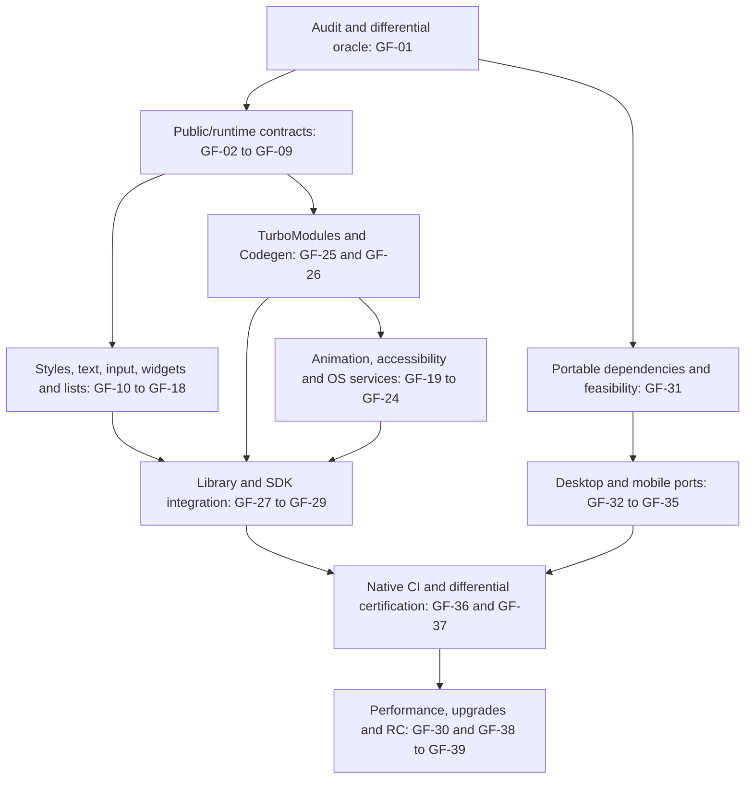

# Godot Fabric roadmap to 1.0

**Goal:** a usable Godot platform for the current stable React Native contract,
with original React/Fabric/Hermes/Yoga, a public typed SDK, native extension
support and exported applications on **macOS, Linux, Windows, Android and iOS**.
No Godot fork or rebuilt engine/export templates are part of this plan.

This is the canonical live work-status document. Baseline audit:
**2026-10-01, RN 0.87.1 / React 19.2.3 / Hermes 250829098.0.17 / Godot 4.7.2**.
See [current capabilities and gaps](docs/PARITY.md), the
[97-name API inventory](docs/compatibility/react-native-0.87.1.json) and
[retained runtime evidence](docs/evidence/README.md).

## Current position

The public repository, MIT license, pinned source dependencies, standalone
macOS prototype, generic fixtures, captures and contract CI are delivered.
Original reconciliation, Fabric commits, Yoga layout and several host subsets
already run. This foundation is **experimental 0.1**, not full RN parity.

GF-01 and GF-02 are **In progress**: [PR #4](https://github.com/journey-studios/godot-fabric/pull/4)
delivered the root API inventory, nine shared native reference cases, differential
CI and a cold-start containment. The full contract inventory and the underlying
Godot import-crash root cause remain open. See the [baseline](docs/compatibility/BASELINE.md)
and [cold-start evidence](docs/evidence/cold-start.md). GF-03/GF-04 and the
bounded public editing/widget slices of GF-12/GF-17 are now In progress.
The [typed public form](examples/form/README.md) delivers a single-line
TextInput/Button slice and explicit prop failures. Types cover only its bounded
View/Text/control imports; complete facade types, mobile editing, other widgets
and differential certification remain open.

GF-05 is **In progress**: upstream TimerManager, portable RN microtask/immediate
modules, a public runtime example and four additional shared oracle cases are
implemented. [Runtime evidence](docs/evidence/runtime/README.md) records native
checks/captures and the remaining bootstrap, idle/error/global and starvation
gaps. GF-09 system metrics remain Planned; this slice does not complete GF-05.

The [runnable examples](examples/README.md) expose existing fixtures in a shared
project; they are a prerequisite for GF-28, not the independent packaged consumer
SDK required by that item. Each table row owns its status. Verification requires
its acceptance result, not an export stub, merged PR or unrelated green CI.

Priority meanings: **P0** blocks dependable development or the architecture;
**P1** is required to complete the 1.0 contract; **P2** extends the explicit
release scope. P0 describes urgency, not the full release checklist. Module
owners below are implementation boundaries, not assigned people.

## Release contract and scope

1. Ordinary public RN imports and TypeScript/TSX work, including stable
   components, props/styles/events, imperative refs, public utilities and
   required JS globals. The 84 stable/compatibility value exports in the audit
   are the first inventory slice; the complete contract is larger.
2. Applicable behavior matches a pinned original RN reference app on iOS and
   Android. Desktop ports implement the shared API and declare concrete OS
   mappings. Differences require a reviewed rationale and fixture; essential
   shared behavior cannot be waived under a generic “Godot limitation.”
3. App authors can register a typed TurboModule and a Fabric native component
   with events/commands through a documented build/export path. Existing mobile
   native binaries still require host ports; 1.0 does not promise every library.
4. macOS arm64, Linux x86_64, Windows x86_64, Android arm64 and iOS arm64 plus
   simulator are release gates. Each has a clean installation, packaged consumer
   app and physical input/system-service evidence. OS minimums are established
   in GF-31, rather than guessed now.
5. NativeWind and the selected chart/SVG contract have explicit supported
   versions and executable consumer examples. Larger library ports, Web/WASM,
   additional architectures and 13 experimental/unstable RN exports are P2.

“Current RN” is a versioned promise. GF-38 rechecks the latest stable version
before release, tests the corresponding React/Hermes combination and publishes
that support matrix. A release cannot claim “current” while ignoring a newer
stable baseline; an explicitly older baseline must be named and approved as a
scope change. RC/nightly APIs are not automatically added to the 1.0 gate.

## Next implementation order

1. **GF-01 + GF-02:** build the contract/oracle inventory and reproduce/fix cold
   startup and the Godot minimum-version mismatch.
2. **GF-03 + GF-04:** expose a truthful typed public facade, beginning with
   TextInput/Button, module resolution and props that are currently discarded.
3. **GF-05 + GF-09:** complete JS bootstrap and actual system metrics; these
   unblock libraries, responsive layout and correct input coordinates.
4. **GF-12 + GF-13 + GF-14:** finish public editing, input/responder and scrolling
   behavior, then run original virtualized lists in GF-15.
5. In parallel with those implementation slices, **GF-31** resolves native
   toolchain/mobile feasibility and **GF-25/GF-26** designs extension contracts.
   Prove Android/iOS integration and accessibility paths early, before treating
   them as routine packaging work.

The dependencies below are completion prerequisites, not a prohibition on
starting bounded research or a build spike early. Do not wait until desktop UI
is complete to discover a mobile linking, IME or accessibility blocker.

The diagram groups workstreams; individual prerequisites in the tables are
more precise. These are substantial platform milestones, not a small backlog
of cosmetic fixes. Intermediate alphas/betas can ship narrower declared scopes
without labelling them full 1.0 parity.

## M0 — Establish a reliable, measurable contract

Owners: public facade/bundler, runtime lifecycle and acceptance harness.
Exit: a clean consumer can start, import truthful APIs
and expose a contract failure without hidden no-ops or stale evidence.

| ID / priority / work | Status | Required result and acceptance | Completion dependencies |
| --- | --- | --- | --- |
| GF-01 · P0 · Full contract inventory and oracle | In progress | Expand the versioned root inventory to types, component props/styles, events, ref commands, globals and applicable OS APIs. Every target contract has an owner and positive/negative fixture. Run shared fixtures against an original pinned RN iOS/Android app and Godot; record semantic traces, layout tolerances and platform applicability before implementation | None |
| GF-02 · P0 · Clean startup and engine contract | In progress | Reproduce the signal-11 cold import with fresh dependencies/resource cache; isolate load/import/shutdown and fix the root cause. Align extension metadata with the actual minimum supported Godot API. Repeated first installs and failed-start cleanup pass in native CI without retrying away crashes | GF-01 |
| GF-03 · P0 · Public API and typed platform resolution | In progress | Export actual public TextInput/Button contracts, use the original wrapper where viable, and provide strict RN-compatible public types. Resolve `.godot`, `.native`, JS/JSX/TS/TSX, assets and package conditions through a documented consumer bundler. An independent TSX app imports every in-scope root name; implemented APIs run, unfinished contracts still fail visibly | GF-01 |
| GF-04 · P0 · Eliminate silently accepted behavior | In progress | Audit facade destructuring, validAttributes, values and event registration. Implement or explicitly reject each unsupported prop/value, including accessibility metadata and userSelect/collapsable semantics; verify updates/removal as well as initial mount. Before 1.0 all applicable target contracts must be implemented, not merely guarded | GF-01, GF-03 |
| GF-05 · P0 · RN bootstrap and JS globals | In progress | Integrate upstream core initialization or an audited equivalent. Certify timers/arguments/cancellation, intervals, microtasks, immediate/idle callbacks, monotonic RAF, performance, errors and required URL/encoding/abort globals. Verify task ordering, callback exceptions, starvation and unmount cleanup against RN; network transport is GF-22 | GF-01 |
| GF-06 · P1 · React/Fabric semantic suite | Planned | Exercise every applicable feature in the pinned native React renderer, including dev StrictMode, refs/cleanup, transitions, Suspense, effects/external stores, batching, supported Activity/hidden-tree behavior and errors. Verify abandoned renders produce no native mounts and events/updates preserve upstream priority. Reuse upstream reconciliation rather than implement a second scheduler | GF-01, GF-05 |
| GF-07 · P1 · Root and surface lifecycle | Planned | Deliver AppRegistry/RootTagContext and supported mount/update/unmount APIs, multiple uniquely identified surfaces, root props, scene changes/pause/resume and error cleanup. Design overlays/portal needs against the actual public RN contract. Repeated root replacement and two concurrent surfaces preserve independent state and release tags/timers/subscriptions | GF-05, GF-06 |
| GF-08 · P1 · Public refs and native commands | Planned | Complete applicable HostInstance/React Native node APIs, root/text instances, measure/measureInWindow/measureLayout, setNativeProps and public UIManager/findNodeHandle behavior. Compare transformed/window coordinates and commit timing; deleted refs and stale commands must not access freed nodes | GF-03, GF-07 |
| GF-09 · P0 · Real metrics and platform identity | Planned | Supply window and screen dimensions, density/font scale, resize/orientation/insets and stable subscriptions. Define `Platform.OS = godot`, physical OS metadata and platform selection/resolution without impersonating iOS/Android. Verify high DPI, font scaling, multi-window coordinates and logical/pixel conversions with reference traces and real devices | GF-01, GF-07 |

## M1 — Complete the native UI tree

Owners: component descriptors/adapters, Yoga/style schema, paragraph/input and
scroll host. Exit: normal forms, dialogs and large lists
work through public RN imports with applicable upstream behavior.

| ID / priority / work | Status | Required result and acceptance | Completion dependencies |
| --- | --- | --- | --- |
| GF-10 · P1 · View, styles and RTL | Planned | Complete shared View props/styles and StyleSheet/color utilities: logical edges, RTL, baseline/layout constraints, transforms/origin, borders, opacity/clipping, z-order, supported shadows/filters and hit geometry. Reproduce asymmetric border colors before fixing. Certify mount/update/removal, fractional layout, custom colors and dynamic RTL against the pinned schema | GF-04, GF-08, GF-09, GF-25 |
| GF-11 · P1 · Text and fonts | Planned | Complete Text props/events/refs, pressable/selectable spans, inline content, truncation/alignment/decoration, baseline/font scaling and font loading/fallback. Validate bidi, emoji, grapheme clusters, mixed fonts, empty/trailing lines, nested updates and measurement/painting agreement. Define tolerances explicitly where font engines differ | GF-08, GF-09, GF-10 |
| GF-12 · P1 · TextInput and keyboard | In progress | Connect the public wrapper to native controlled/uncontrolled editing. Complete multiline, IME composition, selection/graphemes, secure input, keyboard types/actions, autofill where applicable, submit/end-edit sequencing, undo and commands. Deliver Keyboard/KeyboardAvoidingView and prove real desktop IME and mobile keyboard/insets, including JS transformations and delayed acknowledgements | GF-03, GF-08, GF-09, GF-11, GF-25 |
| GF-13 · P1 · Input, Pressability and touchables | Planned | Complete pointer/touch/responder and PanResponder contracts, multi-pointer identity/capture/cancel, hitSlop/retention, hover, keyboard/focus traversal and applicable touchable behaviors. Preserve event coordinates/priorities under transforms/scroll. Hardware and injected fixtures cover nested negotiation, interrupted gestures, disabling/removal mid-press and no duplicate activation | GF-06, GF-08, GF-09, GF-10 |
| GF-14 · P1 · Scroll and refresh | Planned | Complete applicable ScrollView props/events/commands: animated scroll, drag/momentum sequence, clipping, nested scrolling, paging/snap, platform bounce/zoom where applicable, indicators, refresh, keyboard interactions and resizing. Compare offsets/content/insets and event timing; verify ownership during child gestures and interruption | GF-08, GF-09, GF-12, GF-13, GF-19 |
| GF-15 · P1 · Virtualized lists | Planned | Run upstream VirtualizedList/FlatList/SectionList/VirtualizedSectionList over the completed host. Certify windowing, item identity/state, measurement/getItemLayout, viewability, onEndReached, scrollToIndex failure/recovery, separators/sticky sections and dynamic data. A 10,000-row fixture mounts a bounded window and has measured frame/memory results | GF-10, GF-14 |
| GF-16 · P1 · Images and asset pipeline | Planned | Deliver Image/ImageBackground/AssetRegistry with bundled/URI/data assets, density selection, size/resize/tint/animation, loading/error/progress, caching and public image methods. Native async decode must not block frames; cancellation/unmount and missing/corrupt assets pass exported-app tests. Network image behavior uses GF-22 | GF-03, GF-09, GF-10, GF-22, GF-25 |
| GF-17 · P1 · Shared widgets | In progress | Deliver Button with RN title/onPress semantics, Switch and ActivityIndicator plus their stable props/events/accessibility and platform color behavior. Reuse shared upstream JS wrappers where possible. Verify controlled updates, disabled/focus/loading transitions and consumer imports rather than legacy demo aliases | GF-03, GF-10, GF-13, GF-20 |
| GF-18 · P1 · Modals and safe areas | Planned | Deliver Modal presentation/dismiss/requestClose, overlay stacking/focus/back handling and the pinned SafeAreaView behavior. Handle orientation/insets and root ownership across windows/surfaces. Verify nested dialogs, background focus, keyboard, abrupt unmount and exported mobile presentation | GF-07, GF-09, GF-13, GF-20, GF-23 |

## M2 — Supply the platform runtime and OS behavior

Owners: JSI/TurboModules, animation/event loop, platform service bridges and
accessibility host. Exit: components and public services
observe the real system and retain the original event/callback contracts.

| ID / priority / work | Status | Required result and acceptance | Completion dependencies |
| --- | --- | --- | --- |
| GF-19 · P1 · Animated and layout animation | Planned | Deliver upstream Animated/Easing/hooks and LayoutAnimation with an actual native animation backend and driver semantics. Cover timing/spring/decay, composition/interpolation, event binding, cancellation and layout transitions; synchronize native values and JS callbacks. Measure under JS load, background/resume and reduced motion; complete core animation without requiring Reanimated | GF-05, GF-08, GF-09, GF-10, GF-25 |
| GF-20 · P1 · Accessibility | Planned | Map the semantic tree, roles/labels/state/actions, focus, live announcements, hidden/grouped content and AccessibilityInfo settings/events to the OS assistive technology bridge. Prove screen-reader traversal/activation, keyboard navigation, reduced motion and text scaling on each target. A metadata dictionary alone is not a pass; a missing OS bridge is a release blocker to resolve early | GF-04, GF-07, GF-09, GF-13, GF-25 |
| GF-21 · P1 · System environment and app lifecycle | Planned | Deliver real Appearance/useColorScheme, AppState, device configuration and subscription behavior. Cover system theme changes/manual override, foreground/background/focus, memory pressure and event cleanup. Test window minimization, scene pauses and mobile resume with pending timers/network/animations; remove fixed success values | GF-05, GF-07, GF-09, GF-25 |
| GF-22 · P1 · Networking and web-standard runtime APIs | Planned | Deliver the required fetch/XHR/WebSocket, headers/body/form data/blob and abort behavior, backed by real native networking. Certify streaming/progress/cancellation, TLS/redirect/cookie policies, offline/reconnect and errors with a deterministic local test server. Freeze exactly which pinned RN globals/methods are in scope and verify module disposal | GF-05, GF-21, GF-25 |
| GF-23 · P1 · Shared device services | Planned | Implement applicable Alert, BackHandler, Linking, Share, Vibration, Settings and legacy Clipboard behavior through typed OS modules. Include promise/callback/error/event contracts, deep links and interaction with scene/navigation roots. Verify success, denial, unavailable hardware, lifecycle and cancelled operations on exported consumers | GF-07, GF-21, GF-25 |
| GF-24 · P1 · OS-specific public contracts | Planned | Map every pinned iOS/Android-specific component/API/prop, including InputAccessoryView, StatusBar, PermissionsAndroid, ToastAndroid, ActionSheetIOS, DynamicColorIOS and legacy notification/drawer/progress/touchable contracts. Implement on applicable OSs and reproduce upstream unavailability elsewhere. Compare API/OS-version restrictions explicitly; deprecation does not silently remove the pinned contract | GF-09, GF-12, GF-13, GF-17, GF-18, GF-23, GF-25, GF-34, GF-35 |

## M3 — Make the platform extensible and usable outside the demos

Owners: native module/component registry, code generation, package/export
integration and developer tools. Exit: an independent
consumer project can write TSX, add native functionality, debug and export.

| ID / priority / work | Status | Required result and acceptance | Completion dependencies |
| --- | --- | --- | --- |
| GF-25 · P0 · TurboModule and event infrastructure | Planned | Provide typed JSI TurboModule registration/lazy lookup, get/getEnforcing semantics, NativeModules compatibility, callable modules and native event-emitter contracts. Build a custom C++ example with constants, sync calls, async promises/events and disposal. Test missing modules, exceptions, listener lifetime and per-runtime ownership; support platform bridges without pretending mobile binaries are portable | GF-03, GF-05, GF-07 |
| GF-26 · P1 · Codegen and custom Fabric components | Planned | Integrate upstream specs/schema/codegen with public codegenNativeComponent/Commands, registry/requireNativeComponent and versioned generated artifacts. A consumer builds a new descriptor/view with typed props, events and ref commands without editing the renderer core. Verify schema mismatch failures, mount/update/delete and ABI/export packaging | GF-08, GF-10, GF-25, GF-31 |
| GF-27 · P1 · Selected library certification | Planned | Certify original NativeWind/compiler/css-interop and Chart Kit against the public SDK, including TextInput, theme/scaling and retained state. Expand the local SVG adapter to the declared chart contract and document remaining SVG limits. Tests use package imports in an independent app; publish exact versions and supported features. Reanimated/Gesture Handler/safe-area/screens ports remain explicit P2 unless added to release scope | GF-11, GF-12, GF-15, GF-16, GF-19, GF-21, GF-26 |
| GF-28 · P1 · SDK, addon and consumer exports | Planned | Separate platform SDK/native addon from generic examples. Publish typed JS entrypoints, locked build/codegen tools, supported package resolution, prebuilt native artifacts or reproducible builds, licenses and an export plugin/dependency manifest. Support application entry/root props in existing Godot projects without editing demo source. Verify a clean external consumer and exported debug/release app on every target | GF-03, GF-07, GF-25, GF-26, GF-31 |
| GF-29 · P1 · Development experience | Planned | Supply original dev renderer, mapped JS/native errors, source maps, LogBox/dev settings, Hermes inspection and React Native DevTools integration. Add reliable reload/Fast Refresh with documented state rules and no stale native nodes. Verify syntax/runtime/native exceptions, reconnect, profiler visibility and production removal of dev-only paths | GF-05, GF-06, GF-07, GF-28 |
| GF-30 · P1 · Frame, heap and threading budgets | Planned | Profile mount/layout/shaping/JS and retain reproducible frame-time, Hermes heap/RSS and native-node measurements for idle/forms/charts/10,000 rows. Define target-device budgets before accepting optimization. Implement caching or JS/worker/Rust paths only for measured bottlenecks, preserving JSI ownership, Godot main-thread calls and event/commit ordering. Soak and unmount cycles show bounded steady-state memory. The 48/480-row ScrollView benchmark from the pre-publication prototype was not ported; this item starts without a scroll benchmark | GF-11, GF-15, GF-19, GF-28 |

## M4 — Port, export and certify each supported OS

Owners: native dependency toolchain, Godot export integration and device CI.
Exit: each promised architecture has an installable,
exported consumer with native system integration. Platform feasibility starts
in M0; certification completes after the host and service contracts exist.

| ID / priority / work | Status | Required result and acceptance | Completion dependencies |
| --- | --- | --- | --- |
| GF-31 · P0 · Portable dependency/build foundation | Planned | Replace macOS-framework assumptions with per-target Hermes, RN dependencies, Fabric/Yoga and godot-cpp builds. Specify ABI/compiler/OS minimums and debug/release combinations, hashes/licenses and loader/export behavior. Build an early Android/iOS startup/JSI/Control spike with official templates and identify native-view/accessibility bridge constraints before committing the port design | GF-01 |
| GF-32 · P1 · Linux x86_64 | Planned | Build/load/export on a declared distribution baseline, package shared dependencies and verify window/DPI/input/IME/accessibility/system services. Native headless and graphical acceptance run on a fresh consumer, plus exported application evidence | GF-02, GF-09, GF-12, GF-20, GF-21, GF-23, GF-28, GF-31 |
| GF-33 · P1 · Windows x86_64 | Planned | Establish MSVC/CRT/ABI and DLL discovery/export; verify native startup/shutdown, DPI, keyboard/IME, focus, accessibility and services in exported debug/release consumers. Test installation paths with spaces and fresh machines | GF-02, GF-09, GF-12, GF-20, GF-21, GF-23, GF-28, GF-31 |
| GF-34 · P1 · Android arm64 | Planned | Integrate NDK/JNI/shared dependencies and exported Gradle project without modifying Godot. Prove startup, hardware touch, keyboard/IME, safe insets/orientation, lifecycle, accessibility, network and OS services on emulator and a physical device; debug/release packaging includes all dependencies | GF-02, GF-09, GF-12, GF-13, GF-20, GF-21, GF-23, GF-28, GF-31 |
| GF-35 · P1 · iOS arm64 and simulator | Planned | Integrate static/xcframework dependencies with the Godot Xcode export, respecting linkage/signing/store constraints without modifying the engine. Prove simulator and physical-device startup, touch/IME/insets, lifecycle, accessibility/network/services and debug/release packaging; archive/install evidence uses the consumer app | GF-02, GF-09, GF-12, GF-13, GF-20, GF-21, GF-23, GF-28, GF-31 |
| GF-36 · P1 · Native hosted CI and artifacts | Planned | Add actual native compile/import/headless/graphical/export lanes for macOS and each port, plus device/simulator lanes as applicable. Keep contract CI separate; attach version/platform/mode/source hashes and fail on crashes, script errors, missing assertions or stale reports. Some hardware/AT checks may be retained manual release evidence, explicitly named | GF-02, GF-28, GF-32, GF-33, GF-34, GF-35 |
| GF-37 · P1 · Differential parity certification | Planned | Run the complete GF-01 contract suite against the original pinned RN reference apps and all Godot targets. Compare event sequences/values, ref results, React lifecycle, layout and supported screenshots using predetermined tolerances. Cover errors/denial/unmount/background and physical-device input. Every difference is fixed or a concrete reviewed upstream OS boundary; no blanket or skipped-contract parity claim | GF-01, GF-04, GF-06, GF-08, GF-10, GF-11, GF-12, GF-13, GF-14, GF-15, GF-16, GF-17, GF-18, GF-19, GF-20, GF-21, GF-22, GF-23, GF-24, GF-27, GF-29, GF-36 |

## M5 — Freeze and release 1.0

Owners: release/version policy and acceptance evidence.
| ID / priority / work | Status | Required result and acceptance | Completion dependencies |
| --- | --- | --- | --- |
| GF-38 · P1 · Version and upgrade policy | Planned | Publish tested RN/React/Hermes/Godot/toolchain/OS combinations, private-host seam inventory and supported upgrade/backport policy. Recheck latest stable RN, generate/review API diffs and rerun affected codegen/native/differential fixtures. Record additions/removals and migration notes; choose no nightly dependencies by accident | GF-26, GF-28, GF-36, GF-37 |
| GF-39 · P1 · Release candidate and 1.0 | Planned | Freeze the tested baseline and ship reproducible SDK/addon artifacts, reference consumer projects, installation/export docs and compatibility reports. Pass the checklist below with no unresolved required contract or P0/P1 release defect. A narrower desktop-only or component-subset release must use an alpha/beta label or an explicitly renegotiated scope | GF-01 through GF-38 |
| GF-40 · P2 · Explicitly later scope | Planned | Evaluate the 13 unstable/experimental exports, Web/WASM, extra CPU architectures, editor authoring/GDSS extensions and additional native library ports. Create separate specs and versioned support claims; these cannot hide missing stable core behavior in 1.0 | None; not a 1.0 gate |

## 1.0 acceptance checklist

- [ ] Full contract inventory has no unassigned stable API, prop/style/event,
      command, type or global; all required behavior has fresh positive and
      negative parity evidence. The dated 97-name inventory is not sufficient.
- [ ] Required components include View/Text/TextInput, press/touch controls,
      ScrollView/virtualized lists, images, widgets, refresh, modal and safe-area
      behavior; all applicable styles, refs and accessibility contracts pass.
- [ ] Real system metrics/theme/lifecycle/keyboard, animation, networking and
      applicable device/OS APIs work; no success-shaped fixed-value shim or
      silently dropped behavior remains in the supported contract.
- [ ] Multiple roots, scene changes, errors and repeated unmount cycles preserve
      event/commit semantics and release memory/nodes/subscriptions. Dev and
      production behavior are tested separately.
- [ ] A custom TurboModule and custom Fabric component build, run and export in
      an independent TSX consumer; selected NativeWind/chart package versions
      pass without importing demo internals.
- [ ] Official Godot plus the addon exports debug/release consumers for macOS
      arm64, Linux x86_64, Windows x86_64, Android arm64 and iOS device/simulator.
      Cold startup, physical input/IME, OS services and assistive technologies
      have platform-specific evidence; no engine fork is needed.
- [ ] Native CI passes for the actual release head; required manual hardware/AT
      evidence is attached separately. Contract CI alone is not release proof.
- [ ] Declared device/frame/memory budgets and soak/recovery cases pass; errors,
      crashes, timeouts and stale/missing reports still fail the runner.
- [ ] Latest stable RN support is rechecked, pinned and documented, including
      React/Hermes/Godot/OS minimums and any explicitly approved version choice.
      License notices, artifact integrity and installation/upgrade/export docs
      are complete.

Evidence format for closing an item: exact source commit and dependency
versions, target OS/architecture/device, mode (headless/GUI/exported consumer),
command/fixture, assertion result, limitations and durable report/capture links.
Screenshots supplement behavior assertions; they do not replace event,
reconciliation, cleanup or system integration checks.
