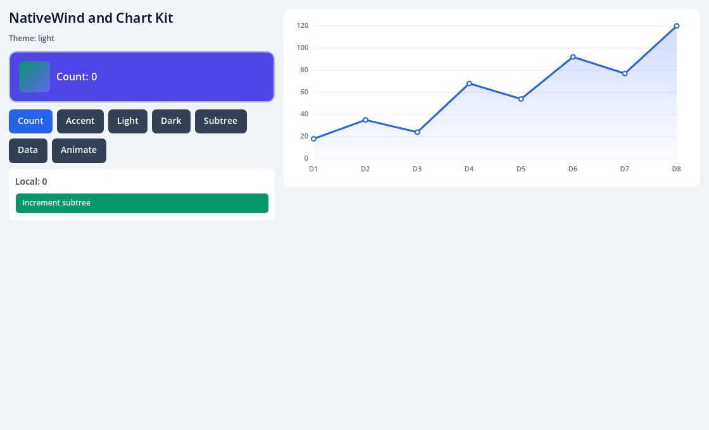
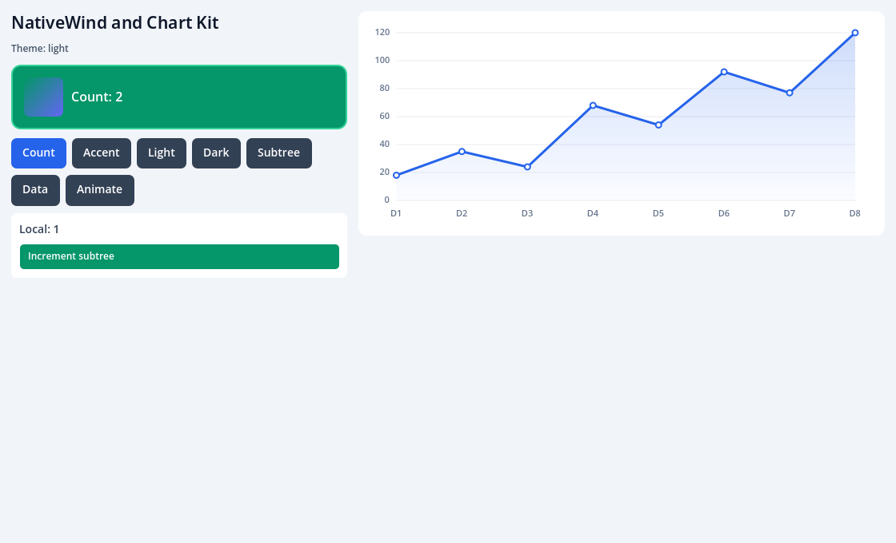
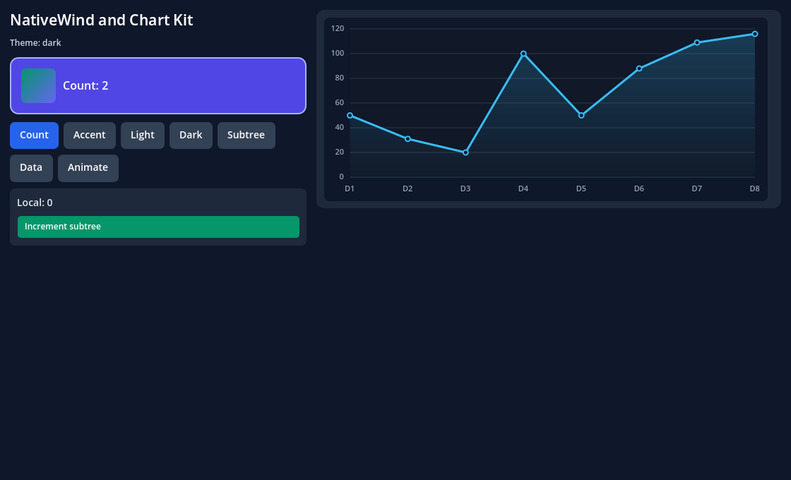

# Independent libraries consumer

NativeWind (`className` on View, Text, Image and Pressable), manual dark mode,
retained state and Chart Kit v2's `LineChart`, in a project that owns its
`package.json` and `package-lock.json` and is built only through the public SDK.
Like [`consumers/minimal`](../minimal/README.md), it becomes a separate Godot
project after provisioning the addon, and it never imports `src/`, `examples/` or
the laboratory bundler. Follow the [SDK provisioning guide](../../sdk/README.md)
first; the unprovisioned template cannot load its native surface.

## Exact releases

| Package | Release | Role |
| --- | --- | --- |
| `nativewind` | 4.2.7 | `className` interop and the Tailwind preset |
| `react-native-css-interop` | 0.2.7 | installed by NativeWind; its runtime is in the bundle |
| `tailwindcss` | 3.4.17 | editor tooling; the SDK compiles with its own copy |
| `react-native-chart-kit` | 7.0.4 | `react-native-chart-kit/v2` `LineChart` |
| `react-native-svg` | 15.15.5 | declared as Chart Kit asks; the SDK's SVG facade replaces it in the bundle |

The lockfile pins these and everything below them. The SDK compiles the styles
with its own `tailwindcss`, `nativewind/preset` and `react-native-css-interop`, so
the installed `nativewind` and `react-native-css-interop` must be exactly the SDK's
releases (`E_PROJECT_NATIVEWIND_VERSION` otherwise).

## Author and run

1. Provision the project: `npm run consumer:create -- --template libraries <new directory>`
   in the SDK checkout (the unchanged `consumer:create` still creates the minimal
   project).
2. Install the packages with the provisioned private Node, from the lockfile and
   without scripts. No global Node is needed:

   ```sh
   addons/godot_fabric/toolchain/node/bin/node \
     addons/godot_fabric/toolchain/node/lib/node_modules/npm/bin/npm-cli.js ci --ignore-scripts
   ```

   `.npmrc` sets `legacy-peer-deps`: the SDK owns `react` and `react-native`, and
   fronts the optional peers of the libraries (`react-native-reanimated`,
   `react-native-safe-area-context`) with facades that fail where they are used, so
   npm must not install them.
3. Open `project.godot` in Godot 4.7.2 on macOS arm64 and press Play, or use
   **Project → Tools → Godot Fabric: Build UI**.

## What the project declares

- `package.json` → `godotFabric.tailwind`: the Tailwind configuration as JSON
  (`content` globs relative to the project, `darkMode` and `theme`). The SDK builds
  Tailwind's configuration from it in process, with `nativewind/preset`. It never
  runs a `tailwind.config.js`; one in the project fails the build with
  `E_PROJECT_TAILWIND_CONFIG`.
- `global.css` holds the three `@tailwind` directives. `import "../global.css"`
  compiles it into styles registered with the one interop runtime of the bundle. Any
  other CSS import fails with `E_PROJECT_CSS`.
- `tsconfig.json` sets `"jsxImportSource": "nativewind"`, which routes `className`
  through the interop without Babel, and lists
  `addons/godot_fabric/types/nativewind.ts` in `include`. That file is the opt-in
  for `className` on the four certified components; without it `className` is a type
  error. `ui/assets.d.ts` declares the project's `.css` and `.png` imports.

## What `ui/` shows

`ui/App.tsx` is one surface with the `Libraries` component name:

- `className` on `View`, `Text`, `Image` and `Pressable`: colours, spacing, borders,
  radius, typography, `active:` on the Pressable, an `Image` with rounded corners and
  a project theme colour (`bg-brand-600`) from `godotFabric.tailwind`.
- Manual dark mode: Light and Dark call `Appearance.setColorScheme`, and `dark:`
  variants follow it. Godot also feeds `Appearance` with the operating system's
  theme, so the validation pins the scheme before it asserts; following the system
  theme is not certified here.
- Retained state: a counter and a styled subtree keep their state and native Controls
  through a `className` swap and a theme switch; unmounting and remounting the subtree
  restores its styles with fresh Controls.
- `LineChart` from `react-native-chart-kit/v2` over the SDK's SVG adapter, repainted
  by a React state update.
- `animate-spin`, which needs Reanimated, fails explicitly at the facade and React
  catches it.

`validation.gd` drives all of it with real pointer events and writes
`libraries-report.json`. `npm run test:consumer:libraries` runs the whole lane from
the SDK checkout: provision, `npm ci`, editor build, headless run, offline rebuild,
rejected requests, and `-- --capture` for the headed screenshots.

## Captures

Real renderer readbacks of this template, from the
[executed run](../../docs/evidence/library-consumer/README.md).

| Light theme | A `className` swap (the project's `brand` colour) |
| --- | --- |
|  |  |
| **Dark theme through `Appearance.setColorScheme`** | **A remounted subtree and an updated chart** |
|  |  |

## Supported, and not

Supported and exercised: the features above, with NativeWind's native rem of 14.
Not supported, and out of scope for this slice: `className` on `TextInput` (a type
error), `Switch`, lists and every component not named above; following the
operating system's theme (as opposed to the manual override); `fontScale`, `rem` and `PixelRatio` scaling; `darkMode`
other than `"media"`; Reanimated animations and transitions; safe-area and screens
ports; Chart Kit's v1 root API and the SVG features the adapter lacks (see the SDK
guide).
