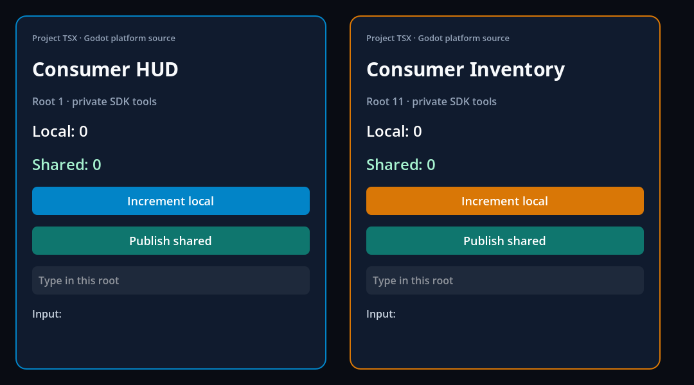

# Independent TSX consumer

This template becomes a separate Godot project after provisioning the addon.
It has its own `project.godot`, `ui/index.tsx`, Resource, scene, package manifest
and lockfile. It does not import `examples/entry.jsx` or select a laboratory
demo. Follow the [SDK provisioning guide](../../sdk/README.md) first; opening
this unprovisioned source template directly cannot load its native surfaces.

## Author and run

1. Open the generated `project.godot` in official Godot 4.7.2 on macOS arm64.
2. Edit `ui/index.tsx`. The provisioned Godot Fabric plugin is already enabled.
3. Press Play, or use **Project → Tools → Godot Fabric: Build UI** to build alone.
   Build diagnostics appear in Output; errors reject Play. No global Node or
   package-manager command is required for this basic project.

The application Resource at `ui/application.tres` selects:

```text
format_version = 1
entry_file = "res://ui/index.tsx"
bundle_file = "res://.godot_fabric/app.js"
```

`ProjectSettings["godot_fabric/application"]` points to that Resource. The
`Application` scene node also references it and creates a native
`FabricApplication` child named `Runtime` during game execution. Scene nodes
remain available for authoring without evaluating React in the editor.

## How JSX enters the SceneTree

The entry uses public React and React Native imports:

```tsx
import { useState } from "react";
import { AppRegistry, View, Text, Button } from "react-native";

function HUD({ title }: { title: string }) {
  const [count, setCount] = useState(0);
  return <View style={{ padding: 24 }}>
    <Text>{title}: {count}</Text>
    <Button title="Increment" onPress={() => setCount(value => value + 1)} />
  </View>;
}
AppRegistry.registerComponent("HUD", () => HUD);
```

Register an **entry root**, not every component in its tree. The `HUD`
`FabricSurface` Control selects `component_name = "HUD"`, receives
`initial_props` and points `application_path` at `../Application/Runtime`.
Fabric commits create actual Godot Controls below that surface; this Button
becomes a native Godot Button. The surface's size supplies its Yoga constraints.

`Inventory` selects another registered entry in the same runtime. The actual
template registers both names with `Panel` and passes different props. Both
roots keep separate `useState`; `ui/store.ts` explicitly shares data through
`useSyncExternalStore`. Context does not implicitly cross roots.

During game execution, Godot can update a root without remounting it:

```gdscript
$HUD.update_props({"panel": "hud", "title": "Props from Godot"})
$Inventory.unmount()
$Inventory.mount()
```

Updating props preserves local state. Inventory remount resets its local
state while retaining the module store in the shared application. The
application owner must outlive the surfaces that reference it.
These native APIs are the current prototype; the planned typed
`GodotFabric.subscribe`/game-service layer is still a later slice.

## What this example exercises



Initially, HUD and Inventory have local/shared counters at zero. The label
comes from `ui/platform.godot.ts`, exercising Godot source selection alongside
the competing `.native.ts` fixture. Fonts load from the addon itself.


The validation clicks HUD's native increment/publish buttons, edits its
TextInput, then replaces its title from Godot. HUD has local count 1; Inventory
keeps local count 0; both show shared count 1. The follow-up unmount/remount and
shutdown assertions verify lifecycle and native cleanup.

## Dependencies and limits

The project declares exact React/RN peer versions; the addon provides their
runtime identity. `tsconfig.json` points to the SDK's React types and narrowed
RN types, with strict project checking. `skipLibCheck` skips third-party
declaration bodies; it does not make unsupported public props valid.

Additional libraries belong in this project's `dependencies`, installed
explicitly with its package manager. Play preserves its lockfile. The fixture
tests a small hook-using project library and duplicate-React protection; it
does not certify a specific external UI library, package manager/workspace
matrix, project Babel plugins or NativeWind consumer compilation.

Only the pinned macOS arm64 combination is provisioned. Development renderer,
Fast Refresh, mapped errors, general assets, signed/prebuilt releases, upgrades,
exports and the other operating systems remain open. The [evidence](../../docs/evidence/consumer/README.md)
states precisely which checks ran; the [roadmap](../../ROADMAP.md) retains full
GF-28/GF-29 acceptance.
