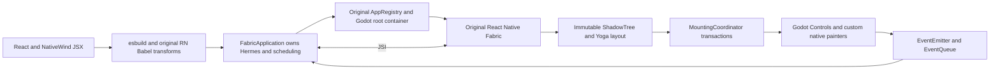

# Architecture

This document describes the current implementation. The
[Architecture 2.0 direction](ARCHITECTURE_V2.md) consolidates the approved
application/surface, layout/host context, Godot integration, input, UI time and native adapter
discovery, binary compatibility, spec/Codegen, native component behavior and library
reuse classification contracts, plus the self-contained SDK distribution direction. Its
[decision register](ARCHITECTURE_V2_DECISIONS.md) tracks approved and pending
choices. Shared native application/registered-root ownership has a bounded
implementation. A resource/addon/editor authoring prototype now supplies an
independent consumer; complete SDK activation and game-service interfaces
remain pending.

## Boundaries

- **React / ReactFabric:** hooks, reconciliation, keys, scheduling, concurrent
  roots and commit semantics come from original React 19.2.3 and the production
  ReactFabric renderer in React Native 0.87.1.
- **Fabric / Yoga:** original C++ descriptors, ShadowNodes, immutable state,
  constraints and mounting transactions are built from pinned portable sources.
  Neither the reconciler nor Yoga receives a patch.
- **Application owner:** `FabricApplication` holds one `ApplicationRuntime` with
  Hermes, module cache, UIManager, event beats, microtasks, timers, frame callbacks
  and cleanup. Its process pump runs once per Godot frame.
- **Surface host:** `FabricSurface` references an application and its AppRegistry
  entry/props. Each root has a ShadowTree, constraints, pointer adapter and native
  Controls. Committed transactions and commands route by surface ID; native
  tags remain unique within the shared runtime. Unmount releases only that root.
- **Registration:** original `AppRegistryImpl` and C++ `AppRegistryBinding` own
  named entry lookup/start/prop updates. Godot supplies the `renderApplication`
  container and original RootTagContext, with the unchanged Fabric reconciler.
- **Platform facade:** `react-native` resolves to this project's bounded host
  API. Many unsupported contracts fail explicitly, but prop filtering and fixed
  environment policies still leave gaps. Exporting a name does not certify the
  corresponding complete mobile API; see the [parity audit](PARITY.md).
- **Styling:** NativeWind 4.2.7 and css-interop 0.2.7 run their original compiler
  and runtime. Godot receives resolved props; it does not execute browser CSS.
- **SVG:** this project's limited SVG implementation is exercised by the
  unmodified Chart Kit package. The upstream `react-native-svg` native module
  does not execute here.

The GDExtension loads Hermes and ReactNativeDependencies frameworks generated
by setup. The official Godot executable remains separate and unchanged.

## Independent consumer authoring

The [SDK prototype](../sdk/README.md) provisions the native addon/frameworks,
fonts, compatible React/RN/types and private Node/builder into
`addons/godot_fabric`. A separate project owns its entry TSX, package/lockfile,
scene and `GodotFabricApplication` Resource. The EditorPlugin builds that entry
before Play; type/build failures return false and preserve the previous bundle.
It never installs project dependencies or falls back to global Node.

The scene's Resource wrapper creates a native `FabricApplication/Runtime`
child during game execution. Named surfaces reference that owner and select
entries/props through original AppRegistry. Surfaces skip automatic React
mounting in editor-hint mode. Font loading prefers the addon path; laboratory
fixtures retain their fallback. Both builders share the same host seams,
while the laboratory alone retains the NativeWind compilation path.

The synchronous oneshot production builder, Resource format and scene wrapper
are experimental validation mechanisms. They do not settle the pending builder,
activation/generation/reload, diagnostics or export decisions. See the
[independent-consumer evidence](evidence/consumer/README.md).

## Text

The public Text facade maps the outer Text to Fabric Paragraph and nested Text
to virtual Text nodes; raw strings become RawText. Fabric aggregates an
AttributedString and preserves inherited text styles. Nested React components
retain their own hooks without allocating one Godot Control per span.

`ParagraphLayout` uses Godot TextParagraph and TextServer for both measurement
and drawing. Yoga uses the measured height; `GodotParagraph`, a real Panel,
paints the same shaped glyphs with per-run colors. Family/weight changes use
FontVariation with the actual `wght` axis of bundled font assets.

Measure and draw prepare their paragraphs separately with the same algorithm.
This implementation does not yet cache shaped paragraphs or move JS/shaping to
a worker thread. All Godot calls currently run on the main thread. A concurrent
React root does not imply parallel native execution.

## Input and lifecycle

The upstream portable `TimerManager` owns timer callbacks, their JSI arguments,
coercion and cancellation. [TimerRegistry](../native/timer_registry.h) only
holds Godot deadlines. Due callbacks enter the existing runtime executor;
the registry marks queued handles so a backlog cannot dispatch duplicates.
The pump bounds timer dispatch and runtime-executor work to 256 entries each
per turn and completes Hermes microtasks between tasks. This budget does not
bound the RAF snapshot or recursively queued Promise jobs.

[Runtime initialization](../src/runtime.js) imports the original RN portable
microtask/immediate shims. It is an audited bootstrap subset rather than all of
`InitializeCore`, whose native OS services are still missing. Godot keeps its
frame-driven RAF adapter; upstream `TimerManager`'s zero-delay RAF fallback is
replaced by actual Godot process frames. The shared oracle compares cancellation
and clock monotonicity, not OS frame cadence or numeric timestamps.

Native input enters the original TouchEventEmitter and responder machinery.
Upstream Pressability decides press behavior. ScrollView uses the original
descriptor/state and a Godot ScrollContainer, with responder-mediated transfer
and native cancellation of a child's pending press. TextInput translates editing,
selection and event-count confirmation through LineEdit.

Animation frames use monotonic timestamps and pending callbacks do not run
immediately during input. Named root unmount removes its native tree/tags,
responder state and React effects. Module state and application timers/frames
remain alive, including when no roots are mounted. Effects own cleanup of their
subscriptions and clocks. Application shutdown cancels global scheduling and
unmounts all roots. The anonymous legacy fixtures preserve whole-application
shutdown on scene exit. Expected failures remain visible even after cleanup.

The [shared example](../examples/shared/README.md) and
[evidence](evidence/shared-roots/README.md) document the native owner prototype.
The SDK's complete primary-application/resource activation, pause/resume,
overlays/portals, multiwindow/ref geometry, dev renderer and original RN
multi-root comparison are still open. The main-thread executor remains;
this change does not resolve the pending thread/shutdown/activation decisions.

See [API limits](API.md) and [measured evidence](evidence/README.md) before
assuming compatibility with a React Native dependency. The
[1.0 roadmap](../ROADMAP.md) tracks the remaining platform contracts and ports.
