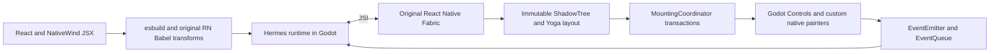

# Architecture

## Boundaries

- **React / ReactFabric:** hooks, reconciliation, keys, scheduling, concurrent
  roots and commit semantics come from original React 19.2.3 and the production
  ReactFabric renderer in React Native 0.87.1.
- **Fabric / Yoga:** original C++ descriptors, ShadowNodes, immutable state,
  constraints and mounting transactions are built from pinned portable sources.
  Neither the reconciler nor Yoga receives a patch.
- **Godot platform:** `FabricSurface` implements runtime execution, event beats,
  native mounting, microtasks, timers, animation frames and cleanup. It translates
  mounts to real Controls in the SceneTree.
- **Platform facade:** `react-native` resolves to this project's bounded host
  API. Unsupported props and components fail explicitly; exporting a name does
  not certify the corresponding complete mobile API.
- **Styling:** NativeWind 4.2.7 and css-interop 0.2.7 run their original compiler
  and runtime. Godot receives resolved props; it does not execute browser CSS.
- **SVG:** this project's limited SVG implementation is exercised by the
  unmodified Chart Kit package. The upstream `react-native-svg` native module
  does not execute here.

The GDExtension loads Hermes and ReactNativeDependencies frameworks generated
by setup. The official Godot executable remains separate and unchanged.

## Text

The public Text facade maps the outer Text to Fabric Paragraph and nested Text
to virtual Text nodes; raw strings become RawText. Fabric aggregates an
AttributedString and preserves inherited text styles. Nested React components
retain their own hooks without allocating one Godot Control per span.

`ParagraphLayout` uses Godot TextParagraph and TextServer for both measurement
and drawing. Yoga uses the measured height; `GodotParagraph`, a real Panel,
paints the same shaped glyphs with per-run colors. Family/weight changes use
FontVariation with the actual `wght` axis of bundled font assets.

Measure and draw prepare their paragraphs separately with the same algorithm.
This implementation does not yet cache shaped paragraphs or move JS/shaping to
a worker thread. All Godot calls currently run on the main thread. A concurrent
React root does not imply parallel native execution.

## Input and lifecycle

Native input enters the original TouchEventEmitter and responder machinery.
Upstream Pressability decides press behavior. ScrollView uses the original
descriptor/state and a Godot ScrollContainer, with responder-mediated transfer
and native cancellation of a child's pending press. TextInput translates editing,
selection and event-count confirmation through LineEdit.

Animation frames use monotonic timestamps and pending callbacks do not run
immediately during input. Unmount removes native nodes, tags, timers, responder
state and subscriptions. Expected failures remain visible to the CLI even when
cleanup succeeds.

See [API limits](API.md) and [measured evidence](evidence/README.md) before
assuming compatibility with a React Native dependency.
