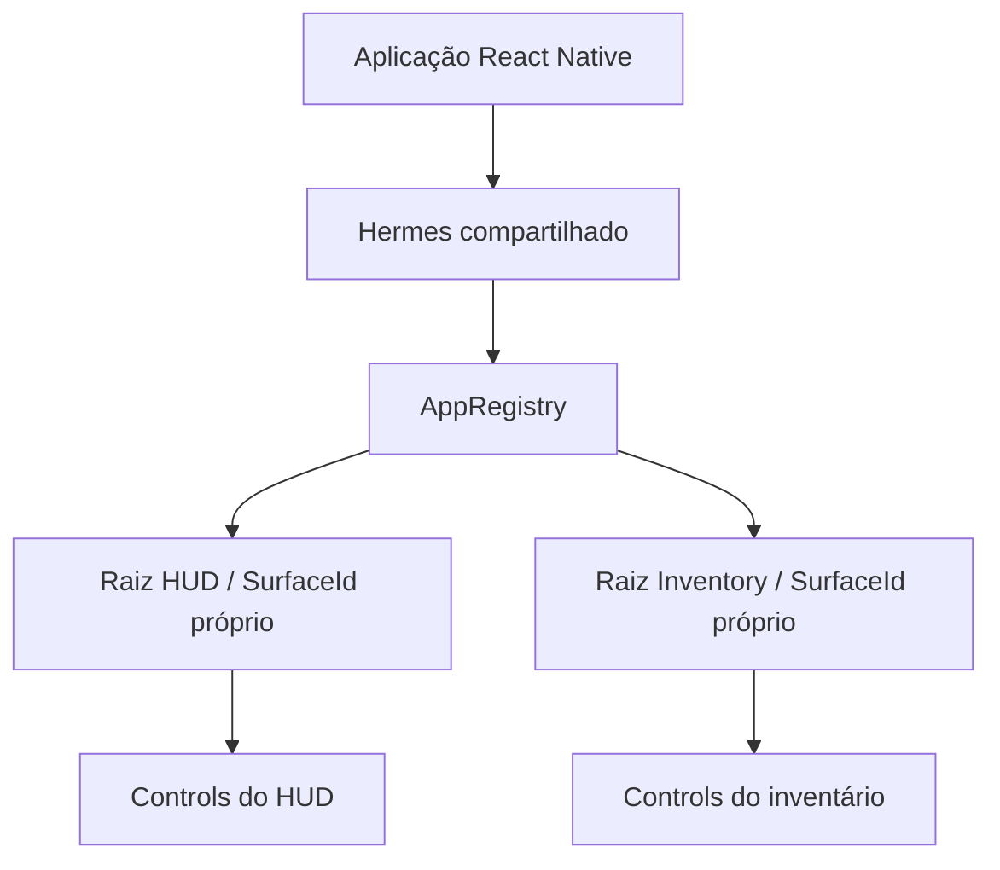
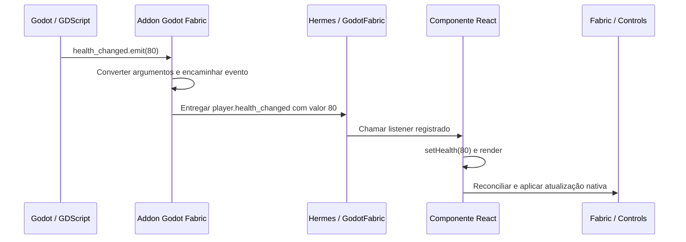

# Godot Fabric — Arquitetura 2.0

**Status:** documento de direção; V2-D01 a V2-D11 aprovadas, V2-D12 a V2-D32 pendentes.

**Data:** 2026-10-02.

**Base consultada:** `main@7e61b74`, React Native 0.87.1 / React 19.2.3.

“2.0” identifica a proposta de arquitetura. Não representa uma versão publicada
do SDK nem certificação de paridade com React Native. Os exemplos de integração
ilustram a direção aprovada e ainda não executam no projeto atual.

Este documento registra as decisões da discussão e os contratos que precisam
ser implementados. O [registro das 32 decisões](ARCHITECTURE_V2_DECISIONS.md)
identifica 11 aprovações e 21 escolhas pendentes, com seus cenários de validação.
Cada ponto pendente apresenta uma situação prática, consequências dos caminhos
e detalhes ainda a especificar. O registro distingue escolhas de produto,
contratos públicos e mecanismos internos a validar por evidência.
A [arquitetura atual](ARCHITECTURE.md), a
[auditoria de paridade](PARITY.md) e o [roadmap para 1.0](../ROADMAP.md) continuam
descrevendo, respectivamente, a implementação, seus gaps e o status do trabalho.

## Objetivo e escopo desta consolidação

Construir uma plataforma React Native para Godot, aproveitando React, Fabric,
Hermes e Yoga originais. JSX, hooks e reconciliação devem produzir UI na árvore
do Godot através do addon, usando o executável oficial do engine.

A direção geral busca uma experiência integrada ao Godot: configurar o addon,
adicionar uma surface e executar o jogo. Distribuição do SDK, ferramentas de
build, extensões nativas e exportação ainda precisam de discussão específica.

Os temas consolidados são:

1. Aplicação, runtime, raízes e ciclo de vida.
2. Dimensões, layout adaptativo e NativeWind.
3. Comunicação entre Godot e JavaScript, com gestão de estado independente.
4. Autoridade sobre a árvore, input e tempo da UI, com contextos adicionais pendentes.

As direções de V2-D01 a V2-D11 foram aprovadas em 2026-10-02 e estão
consolidadas abaixo. A aprovação define a direção dos contratos; assinaturas
finais, detalhes que as recomendações deixaram para especificação e provas de
comportamento continuam necessários. As decisões restantes estão listadas ao final.

## Tema 1 — Aplicação, runtime e surfaces

### Uma aplicação compartilhada, várias raízes

A configuração inicial será uma aplicação React Native por execução do jogo,
com um runtime Hermes compartilhado e várias surfaces. O runtime pertence à
aplicação e pode sobreviver à troca de cenas.

Cada surface tem sua identidade de raiz, componente de entrada, props,
constraints de layout, ciclo de vida e conteúdo nativo. HUD e inventário podem
existir simultaneamente sem serem duas aplicações independentes.



Separar raízes não isola a execução JavaScript: uma tarefa que bloqueie o runtime
afeta todas as surfaces. Aplicações com runtimes separados seriam uma extensão
futura, com outro contrato de isolamento.

### AppRegistry desde o início

O host deve integrar o AppRegistry do RN para registrar, iniciar e desmontar
raízes. Somente componentes montados diretamente pelo Godot como entradas
precisam de registro. Componentes filhos seguem a composição normal do React.

```tsx
import { AppRegistry } from "react-native";
import { HUD } from "./HUD";
import { Inventory } from "./Inventory";

AppRegistry.registerComponent("HUD", () => HUD);
AppRegistry.registerComponent("Inventory", () => Inventory);
```

Uma `HealthBar` dentro de `HUD` não precisa ser registrada. A mesma entrada
registrada pode ser montada em duas surfaces com props diferentes e estados
locais independentes.

Para o caso simples, o autor poderá exportar um componente padrão e o builder
gerará o registro no AppRegistry. O formato do nome gerado e os campos de
configuração ainda precisam de especificação. Várias entradas externas terão
registro explícito.

Essa direção usa o [contrato de entrada e ciclo de vida do AppRegistry](https://reactnative.dev/docs/appregistry).

### Configuração e identidade aprovadas

#### V2-D01

**Configuração da aplicação:** usar um recurso versionado, referenciado pelo
projeto, para entry, bundle e opções da aplicação. Surfaces selecionam suas
entradas e props, respeitando a posse compartilhada do runtime.

O builder gera um nome documentado para a entrada simples. Registros duplicados
produzem diagnóstico, sem sobrescrever a entrada existente. O formato do recurso,
campos e nome gerado ainda precisam de especificação.

#### V2-D02

**Identidade das montagens:** atribuir IDs únicos no runtime e gerações separadas
para validar referências. Integrar montagem/desmontagem ao ciclo do Node, com
operações explícitas de update e unmount.

Atualizar props preserva a identidade da raiz e seu estado local. Substituir a
montagem invalida referências anteriores. O contrato da surface deve indicar
quando ela está pronta para receber input e comandos; seus estados e notificações
exatos serão especificados antes da implementação.

### Posse de estado e recursos

| Escopo | Responsabilidade |
| --- | --- |
| Aplicação | Hermes, cache de módulos, AppRegistry e timers globais |
| Store criada no escopo de um módulo | Dados compartilhados pelas raízes que a utilizam |
| Instância da raiz e seus componentes | `useState`, providers, effects e suas subscriptions |
| Surface e árvore montada | Controls, referências nativas e destinos de input |
| Projeto do jogo | Definir onde ficam suas regras e seu estado de domínio |

Context não atravessa automaticamente raízes diferentes. Compartilhar uma store
é uma escolha explícita. Dados de gameplay mantidos no Godot podem ser
representados no JavaScript para apresentação, sem transferir sua autoridade.

### Ciclo de vida

| Operação | Comportamento decidido |
| --- | --- |
| Ocultar uma surface | Preserva a raiz, estado local e effects; ocultar não suspende o trabalho |
| Desmontar uma surface | Executa o cleanup do React, remove a árvore nativa e invalida suas referências |
| Montar novamente | Cria novo estado local; stores da aplicação continuam disponíveis |
| Trocar de cena | Pode desmontar suas surfaces, preservando a aplicação compartilhada |
| Reiniciar a aplicação | Recria o runtime e suas raízes; referências e callbacks da execução anterior ficam inválidos |

Uma futura política de suspensão de trabalho em surfaces ocultas será uma
operação distinta. Pausa do jogo e background do sistema seguem a direção de
[V2-D11](#v2-d11), com a semântica exata de retomada ainda a especificar e validar.

### Timers e falhas

Desmontar uma raiz não cancela todos os timers do runtime compartilhado. Um
effect que cria um intervalo deve cancelá-lo no cleanup. Recursos nativos
vinculados a uma montagem precisam de identidade e geração para impedir que
respostas antigas acessem uma árvore substituída.

Erros de render podem ser tratados por error boundaries. Exceções assíncronas
precisam de política própria; boundaries não fornecem isolamento geral da VM.
O compartilhamento do runtime torna explícito esse acoplamento de execução.

### Aceitação do tema 1

Montar HUD e inventário simultaneamente; atualizar seus estados locais de forma
independente; desmontar e remontar o inventário sem reiniciar o HUD ou perder a
store compartilhada. Verificar cleanup, timers globais preservados e rejeição de
referências antigas após substituição da raiz ou reinício da aplicação.

## Tema 2 — Dimensões, layout adaptativo e NativeWind

### Janela e surface têm medidas diferentes

As métricas públicas do RN descrevem a janela ou o display. O tamanho disponível
para uma raiz é uma constraint própria de sua surface.

| Elemento | Exemplo em unidades lógicas |
| --- | --- |
| Janela principal | 1920 × 1080 |
| Surface do HUD | 1920 × 1080 |
| Surface do inventário | 600 × 700 |

`Dimensions.get("window")` e `useWindowDimensions()` descrevem a janela da
aplicação. `Dimensions.get("screen")` descreve o display, convertido segundo a
política de escala da plataforma. Redimensionar somente o inventário altera
suas constraints Yoga, sem redefinir o significado das métricas da janela.

Esses significados seguem [Dimensions](https://reactnative.dev/docs/dimensions)
e [useWindowDimensions](https://reactnative.dev/docs/usewindowdimensions).

### Layout pelo espaço realmente disponível

Flexbox, porcentagens e `onLayout` serão os mecanismos portáveis para compor UI
dentro de um painel. Um gráfico, por exemplo, pode receber a largura medida de
seu contêiner.

Foi aceita a direção de um helper opcional `useSurfaceDimensions()`, específico
do SDK, para consultar a raiz atual. Seu nome final e import ainda precisam de
definição. Ele não muda a semântica de `useWindowDimensions()`.

### NativeWind: janela para media queries, contêiner para container queries

Breakpoints como `md:` usam as métricas da janela. Container queries usam o
tamanho do contêiner marcado na árvore. Essa diferença permite adaptar um
inventário pequeno dentro de uma janela grande.

```tsx
// Sintaxe-alvo; suporte no Godot ainda precisa ser certificado.
<View className="flex-1 @container">
  <View className="flex-col @md:flex-row">
    <ItemList />
    <ItemDetails />
  </View>
</View>
```

NativeWind v4 documenta suporte ao
[plugin de container queries](https://www.nativewind.dev/docs/tailwind/plugins/container-queries).
Isso não prova que nosso host já fornece todos os contratos necessários. A
integração deverá exercitar compilação, runtime, medição e mudanças de layout.

### Coordenadas, escala e associação ao viewport

Yoga trabalha em unidades lógicas. O host converte entre coordenadas locais,
viewport, janela e pixels físicos. Transformações de Controls, densidade do
display e `fontScale` precisam preservar seus significados próprios.

Renderização, medição e hit testing devem concordar. Alterar a escala visual de
um Control não redefine automaticamente a densidade do dispositivo.

Cada surface identifica sua janela e viewport. Na configuração inicial, as
métricas globais do RN referem-se à janela principal. Uma segunda janela exige
política explícita de métricas e foco; essa política ainda está aberta.

### Aceitação do tema 2

Com HUD e inventário montados, redimensionar apenas o inventário. Seu layout e
container queries reagem, o tamanho do HUD permanece estável e as métricas da
janela não mudam. Cliques e medidas continuam alinhados à geometria resultante.
Redimensionar a janela deve atualizar suas métricas e os breakpoints pertinentes.

## Tema 3 — Comunicação entre Godot e JavaScript

### Integração independente da gestão de estado

Godot Fabric fornece chamadas, conversão de valores, resultados, erros e eventos
entre Godot e JavaScript. O projeto escolhe Zustand, Redux, Jotai, Context ou
hooks do React para organizar o estado da aplicação.

O núcleo não obriga uma store nem inclui `useGameState` ou `useGameCommand` como
contratos fundamentais. Helpers desse tipo podem existir em um pacote opcional.
Uma representação local dos dados pode ser útil para renderizar; ela não exige
um gerenciador de estado de domínio dentro do addon.

| Camada | Responsabilidade |
| --- | --- |
| Godot | Executar os métodos e regras que o projeto mantém no jogo |
| Godot Fabric | Entregar chamadas e eventos, com contratos de execução e validade |
| Aplicação JavaScript / biblioteca escolhida | Organizar dados, seletores e ações |
| React e Fabric | Renderizar, reconciliar e atualizar a árvore nativa |

O RN oferece [módulos nativos](https://reactnative.dev/docs/turbo-native-modules-introduction)
e [eventos nativos tipados](https://reactnative.dev/docs/the-new-architecture/native-modules-custom-events).
Essa é a direção da integração. JSX não recebe um signal automaticamente.

### Nome público: GodotFabric nos dois lados

O serviço do addon em GDScript será chamado `GodotFabric`. A interface
JavaScript também será `GodotFabric`, com `GodotFabric.subscribe(...)`.

O import `@godot-fabric/runtime` é a localização proposta para essa interface;
não representa um pacote já publicado. A nomenclatura pública não renomeia os
tipos e componentes internos do Fabric original do RN.

### Exemplo completo: signal até a UI

**Exemplo da direção aprovada, ainda não executável.** No Godot, o addon conecta um
callback nativo ao signal indicado:

```gdscript
extends Node

signal health_changed(value: int)
var health: int = 100

func _ready():
    GodotFabric.bind_signal("player.health_changed", health_changed)

func take_damage(amount: int):
    health = maxi(0, health - amount)
    health_changed.emit(health)
```

No JavaScript, a interface do SDK registra um listener no serviço exposto ao
Hermes pelo addon. O componente usa um effect para assinar e remover o listener:

```tsx
import { useEffect, useState } from "react";
import { Text } from "react-native";
import { GodotFabric } from "@godot-fabric/runtime";

export function HealthBar() {
  const [health, setHealth] = useState<number | null>(null);

  useEffect(() => {
    const subscription = GodotFabric.subscribe(
      "player.health_changed",
      (value: number) => setHealth(value),
    );

    return () => subscription.remove();
  }, []);

  return <Text>Vida: {health ?? "—"}</Text>;
}
```



O caminho ocorre no processo do jogo. O callback executa no contexto permitido
pelo runtime executor; emitir o signal não deve causar reentrada arbitrária em
render ou montagem. O JSX apresenta o valor atualizado pelo React.

Com Zustand, o listener atualiza a store escolhida e o componente usa seu hook
normal. A conexão com o Godot pode pertencer à aplicação compartilhada, enquanto
HUD e inventário assinam a mesma store. Não é preciso abrir uma assinatura nativa
por componente. O projeto continua responsável pelo cleanup dessas conexões.

### Contratos de comunicação aprovados

#### V2-D03

**Valor inicial e acompanhamento:** a conexão devolve valor inicial e revisão,
com acompanhamento a partir dessa revisão, sem perder alterações durante a
instalação do listener. O transporte não impõe uma store nem regras de domínio.

O exemplo acompanha eventos futuros. Se o signal já foi emitido antes da
assinatura, ele não fornece a vida atual automaticamente. A leitura inicial
consistente requer esse contrato adicional, cuja assinatura pública e protocolo
de revisões ainda precisam ser especificados.

#### V2-D04

**Origem e argumentos:** identificar explicitamente origem e namespace, com
schema de argumentos. A forma simples com string permanece possível. Múltiplas
instâncias, colisões de nomes, troca de origem e signals com vários argumentos
precisam de representação e diagnóstico definidos.

O exemplo usa uma origem simples. Ele não define por si só o formato final
para endereçar dois jogadores ou versionar seus schemas.

#### V2-D05

**Chamadas ao jogo:** oferecer transporte pequeno, registro por GDScript e
facades tipadas opcionais. Ações que dependem da execução no Godot retornam
resultado assíncrono; leitura síncrona só é permitida quando seu contrato puder
garantir execução segura. Não exigir C++ por jogo para a integração básica.

Operações executam na thread apropriada, em um ponto seguro. Cada método declara
se a resposta confirma aceitação ou conclusão, além de resultado, erro e
cancelamento. A API de registro/chamada ainda precisa de especificação.

Uma operação aceita pode concluir após fechar o painel, conforme seu contrato.
A conclusão não pode acessar refs desmontadas.

#### V2-D06

**Conversões e referências:** começar com DTOs tipados e handles com identidade
e validade. Rejeitar conversões sem contrato; remover a origem ou reiniciar o
runtime invalida suas referências.

A especificação deve definir arrays, dictionaries, null, vetores, cores,
recursos, ciclos e números fora do intervalo inteiro exato do JavaScript.
Tipos e erros precisam corresponder ao transporte implementado.

#### V2-D07

**Entrega de eventos:** preservar sequência por origem e respeitar as
prioridades do RN. Definir ordem entre canais, orçamento de processamento e
política de overflow, com comportamento verificável sob carga.

Estado representa um valor atual e pode permitir agrupamento explicitamente.
Acontecimentos não recebem essa política por padrão: dois danos consecutivos
continuam sendo dois eventos. Não descartar silenciosamente para aliviar a fila.

Raízes diferentes podem observar a mesma revisão de dados. Isso não implica um
commit visual simultâneo de todas as raízes; seus commits continuam sob o RN.

#### V2-D08

**Posse das conexões:** oferecer bindings removíveis, remoção idempotente e
invalidação quando a origem é destruída. No JavaScript, manter
`subscription.remove()` como interface de remoção.

Subscriptions globais podem sobreviver ao fechamento de uma surface;
subscriptions criadas em effects seguem seu cleanup. Reiniciar o runtime
invalida callbacks da geração anterior. A especificação deve cobrir eventos
enfileirados, listeners sem binding, reconexão e a API de desligamento no Godot.

### Aceitação do tema 3

Criar um exemplo genérico com HUD e inventário, usando Zustand para demonstrar
que o transporte funciona com uma biblioteca independente. Alterar a vida no
Godot atualiza a UI; equipar um item chama o jogo e atualiza os consumidores.

Fechar o inventário durante uma operação aceita permite sua conclusão conforme
o contrato. Reabrir mostra os dados atuais. Verificar leitura inicial sem perda
de atualização, cleanup repetido, ordem dos eventos e referências invalidadas
quando uma entidade ou geração do runtime deixa de existir.

## Tema 4 — Autoridade sobre árvore, input e tempo

As direções de V2-D09 a V2-D11 estão aprovadas. Associação a contextos adicionais
permanece pendente em V2-D12; detalhes de retomada de V2-D11 precisam de
especificação e comparação com o RN da versão fixada.

### V2-D09

**Layout e hierarquia:** Godot posiciona e dimensiona a surface; Fabric/Yoga
controla os descendentes montados. Conteúdo externo e operações imperativas
entram por contratos próprios, incluindo transformações e clipping.

Um Container do Godot pode fornecer espaço à surface. Alterações diretas nos
descendentes geridos por Fabric não criam um segundo layout implícito; sua
integração deve respeitar uma fronteira explícita.

### V2-D10

**Input e foco:** o host roteia input entre raízes, Controls externos e gameplay,
com políticas de consumo declaradas. Dentro da raiz, usar responders e
Pressability do RN. Modais possuem foco explicitamente e o restauram ao fechar.

Input não consumido segue a política do Godot. A especificação deve definir
essas políticas para fundo transparente, teclado/gamepad e overlays, sem dupla
ativação do gameplay quando um botão ou modal consome a interação.

### V2-D11

**Tempo da UI e lifecycle:** timers públicos usam tempo real monotônico para
agendamento. Pausar ou acelerar a simulação não muda esse relógio; runtime e
input da UI continuam disponíveis durante a pausa do jogo. Cooldowns e outras
regras de gameplay recebem o tempo ou estado do jogo como dados explícitos.
Ocultar uma surface preserva estado/effects, conforme o ciclo de vida aprovado.

Separar deadlines de timers, relógio civil de `Date.now()`, tempo da simulação
e oportunidades de apresentação de frames. RAF acompanha estas oportunidades;
isso não define um único mecanismo para todas as animações.

Background, perda de foco e surface oculta são situações distintas. Mapear
`AppState` para o lifecycle do aplicativo, sem derivá-lo da visibilidade de um
painel. Não prometer execução quando o sistema operacional suspende o processo.

Na retomada, recuperar os dados atuais e evitar rajadas de períodos perdidos
de intervals, sem inventar frames intermediários. A regra exata para timeouts
vencidos, intervals, RAF e animações ainda deve ser especificada e comparada
com o RN da versão fixada por OS. Essa direção não autoriza descartar eventos
do jogo: ordem e overflow continuam sujeitos ao contrato de V2-D07.

O RN documenta [timers e RAF](https://reactnative.dev/docs/timers) e
[AppState](https://reactnative.dev/docs/appstate). A integração com a
[pausa/process mode do Godot](https://docs.godotengine.org/en/stable/tutorials/scripting/pausing_games.html)
precisa cobrir o pump do runtime e callbacks nativos; a direção aprovada não
certifica esse comportamento no protótipo.

### Aceitação do tema 4

Uma surface dentro de um Container recebe constraints corretas. Intervenções
externas em sua subtree são tratadas explicitamente. Clique no fundo chega ao
jogo quando permitido; botão/modal não ativam gameplay; foco é transferido e
restaurado para os destinos corretos.

Pausar a simulação mantendo menu, input e timers da UI disponíveis; acelerar
somente a simulação sem alterar debounce e outros timers públicos. Ocultar uma
surface preserva seus effects. Exercitar suspensão/resume quando o OS permitir,
com timeouts e intervals vencidos, frames e reconexão dos dados; verificar o
contrato de retomada contra o RN pertinente, sem perder acontecimentos do jogo.

## Distância entre a direção e a implementação consultada

| Área | Base consultada | Direção deste documento |
| --- | --- | --- |
| Posse do runtime | `FabricSurface::Impl` cria seu Hermes e seus serviços | Aplicação compartilhada possui o runtime; surfaces possuem raízes |
| Entrada React | Exemplo chama `ReactFabric.render` com raiz `1` | AppRegistry, identidades distintas e registro automático no caso simples |
| Constraints e métricas | Surface usa o rect do viewport; métricas expostas têm `scale` e `fontScale` fixos em `1` | Separar janela, display e tamanho disponível para cada surface |
| Integração com o jogo | As APIs públicas `GodotFabric` deste documento ainda não existem | Métodos/eventos tipados, com execução e ciclos de vida explícitos |
| Gestão de estado | A proposta não altera nem impõe uma biblioteca | Biblioteca escolhida pelo projeto, com utilitários opcionais |

Referências da implementação consultada:
[host nativo](../native/fabric_surface.cpp),
[entrada dos exemplos](../examples/entry.jsx) e
[métricas JavaScript](../src/window-dimensions.js).
Essa comparação é uma fotografia da base indicada no início, não um status
automaticamente atualizado da migração.

## Próximos temas ainda abertos

As 21 escolhas pendentes, V2-D12 a V2-D32, têm IDs estáveis no
[registro de decisões da v2.0](ARCHITECTURE_V2_DECISIONS.md).
V2-D01 a V2-D11 já estão aprovadas. As recomendações das entradas pendentes
continuam em discussão; nenhum desses status certifica implementação.

| Tema | Contrato a discutir |
| --- | --- |
| Contextos de UI | Janelas adicionais e SubViewports; árvore, input e direção de tempo/lifecycle já aprovados |
| Extensões e adapters | Registro, schemas, Codegen, componentes/módulos externos e fronteira ABI do SDK |
| Builder e resolução | Toolchain privada, Metro/Babel, condições de packages, identidade única de React e configuração do projeto |
| Ativação e desenvolvimento | Gerações de artefatos, falhas de avaliação/montagem, reload, Fast Refresh e encerramento seguro |
| Assets e exportação | Recursos, manifestos, host versus target, empacotamento e falhas verificáveis de export |
| Tipos e plataformas | Coerência entre editor/build/runtime, identidade da plataforma Godot e serviços específicos de cada OS |
| Threads e desempenho | Runtime/mount executors, medição de texto, prioridades, reentrada, filas e profiling |
| Certificação de compatibilidade | Oráculo RN original, fixtures diferenciais, tolerâncias e matriz por biblioteca/plataforma |

A ordem de implementação da migração ainda não foi aprovada. A proposta não
encerra gaps do roadmap nem amplia a matriz de plataformas suportadas pelo
protótipo. Novas decisões devem atualizar este documento com seu status e
critérios de aceitação, preservando a distinção entre direção e prova executada.
