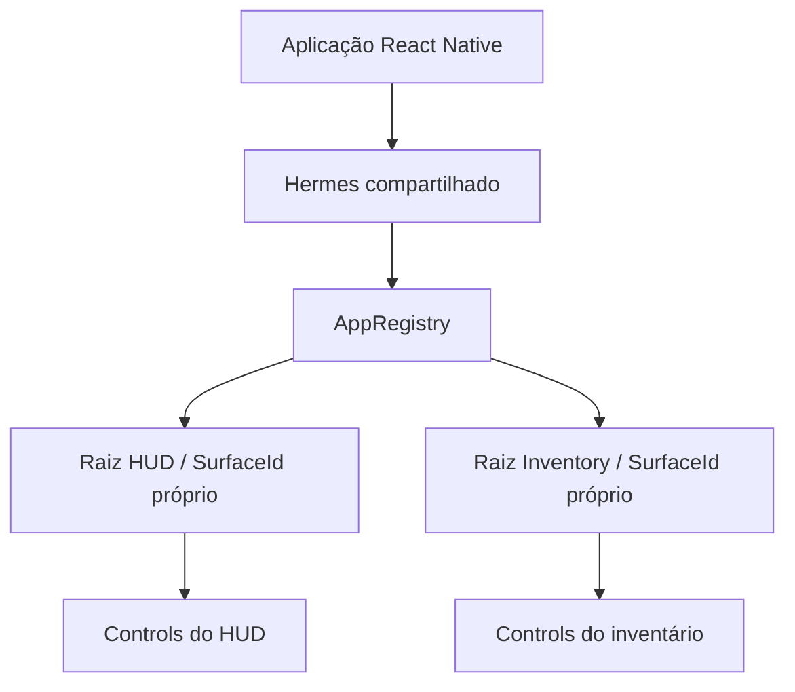
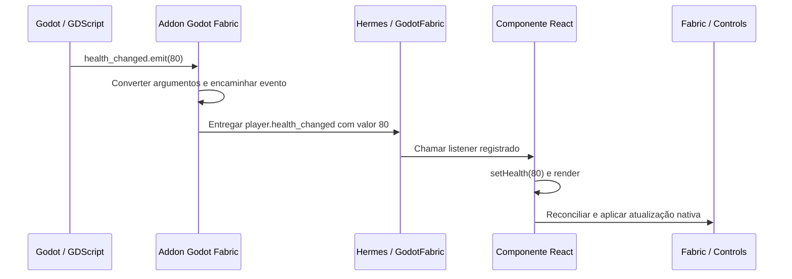

# Godot Fabric — Arquitetura 2.0

**Status:** documento de direção; V2-D01 a V2-D18 aprovadas, V2-D19 a V2-D32 pendentes.

**Data:** 2026-10-02.

**Base consultada:** `main@7e61b74`, React Native 0.87.1 / React 19.2.3.

“2.0” identifica a proposta de arquitetura. Não representa uma versão publicada
do SDK nem certificação de paridade com React Native. Os exemplos de integração
ilustram a direção aprovada e ainda não executam no projeto atual.

Este documento registra as decisões da discussão e os contratos que precisam
ser implementados. O [registro das 32 decisões](ARCHITECTURE_V2_DECISIONS.md)
identifica 18 aprovações e 14 escolhas pendentes, com seus cenários de validação.
Cada ponto pendente apresenta uma situação prática, consequências dos caminhos
e detalhes ainda a especificar. O registro distingue escolhas de produto,
contratos públicos e mecanismos internos a validar por evidência.
A [arquitetura atual](ARCHITECTURE.md), a
[auditoria de paridade](PARITY.md) e o [roadmap para 1.0](../ROADMAP.md) continuam
descrevendo, respectivamente, a implementação, seus gaps e o status do trabalho.

## Objetivo e escopo desta consolidação

Construir uma plataforma React Native para Godot, aproveitando React, Fabric,
Hermes e Yoga originais. JSX, hooks e reconciliação devem produzir UI na árvore
do Godot através do addon, usando o executável oficial do engine.

A direção geral busca uma experiência integrada ao Godot: configurar o addon,
adicionar uma surface e executar o jogo. O fluxo básico autocontido e a separação
entre ferramentas do SDK e dependências do projeto seguem V2-D18. Contratos do
builder, resolução de módulos e exportação ainda precisam de discussão específica.
Descoberta de extensões nativas segue V2-D13, compatibilidade binária segue V2-D14 e schemas/
Codegen seguem V2-D15. O contrato funcional dos componentes segue V2-D16 e
a classificação do reuso das bibliotecas segue V2-D17.

Os temas consolidados são:

1. Aplicação, runtime, raízes e ciclo de vida.
2. Dimensões, contextos de UI, layout adaptativo e NativeWind.
3. Comunicação entre Godot e JavaScript, com gestão de estado independente.
4. Autoridade sobre a árvore, input e tempo da UI.
5. Adapters nativos e classificação da compatibilidade das bibliotecas.
6. Distribuição do SDK, ferramentas e dependências do projeto.

As direções de V2-D01 a V2-D18 foram aprovadas em 2026-10-02 e estão
consolidadas abaixo. A aprovação define a direção dos contratos; assinaturas
finais, detalhes que as recomendações deixaram para especificação e provas de
comportamento continuam necessários. As decisões restantes estão listadas ao final.

## Tema 1 — Aplicação, runtime e surfaces

### Uma aplicação compartilhada, várias raízes

A configuração inicial será uma aplicação React Native por execução do jogo,
com um runtime Hermes compartilhado e várias surfaces. O runtime pertence à
aplicação e pode sobreviver à troca de cenas.

Cada surface tem sua identidade de raiz, componente de entrada, props,
constraints de layout, ciclo de vida e conteúdo nativo. HUD e inventário podem
existir simultaneamente sem serem duas aplicações independentes.



Separar raízes não isola a execução JavaScript: uma tarefa que bloqueie o runtime
afeta todas as surfaces. Aplicações com runtimes separados seriam uma extensão
futura, com outro contrato de isolamento.

### AppRegistry desde o início

O host deve integrar o AppRegistry do RN para registrar, iniciar e desmontar
raízes. Somente componentes montados diretamente pelo Godot como entradas
precisam de registro. Componentes filhos seguem a composição normal do React.

```tsx
import { AppRegistry } from "react-native";
import { HUD } from "./HUD";
import { Inventory } from "./Inventory";

AppRegistry.registerComponent("HUD", () => HUD);
AppRegistry.registerComponent("Inventory", () => Inventory);
```

Uma `HealthBar` dentro de `HUD` não precisa ser registrada. A mesma entrada
registrada pode ser montada em duas surfaces com props diferentes e estados
locais independentes.

Para o caso simples, o autor poderá exportar um componente padrão e o builder
gerará o registro no AppRegistry. O formato do nome gerado e os campos de
configuração ainda precisam de especificação. Várias entradas externas terão
registro explícito.

Essa direção usa o [contrato de entrada e ciclo de vida do AppRegistry](https://reactnative.dev/docs/appregistry).

### Configuração e identidade aprovadas

#### V2-D01

**Configuração da aplicação:** usar um recurso versionado, referenciado pelo
projeto, para entry, bundle e opções da aplicação. Surfaces selecionam suas
entradas e props, respeitando a posse compartilhada do runtime.

O builder gera um nome documentado para a entrada simples. Registros duplicados
produzem diagnóstico, sem sobrescrever a entrada existente. O formato do recurso,
campos e nome gerado ainda precisam de especificação.

#### V2-D02

**Identidade das montagens:** atribuir IDs únicos no runtime e gerações separadas
para validar referências. Integrar montagem/desmontagem ao ciclo do Node, com
operações explícitas de update e unmount.

Atualizar props preserva a identidade da raiz e seu estado local. Substituir a
montagem invalida referências anteriores. O contrato da surface deve indicar
quando ela está pronta para receber input e comandos; seus estados e notificações
exatos serão especificados antes da implementação.

### Posse de estado e recursos

| Escopo | Responsabilidade |
| --- | --- |
| Aplicação | Hermes, cache de módulos, AppRegistry e timers globais |
| Store criada no escopo de um módulo | Dados compartilhados pelas raízes que a utilizam |
| Instância da raiz e seus componentes | `useState`, providers, effects e suas subscriptions |
| Surface e árvore montada | Controls, referências nativas e destinos de input |
| Projeto do jogo | Definir onde ficam suas regras e seu estado de domínio |

Context não atravessa automaticamente raízes diferentes. Compartilhar uma store
é uma escolha explícita. Dados de gameplay mantidos no Godot podem ser
representados no JavaScript para apresentação, sem transferir sua autoridade.

### Ciclo de vida

| Operação | Comportamento decidido |
| --- | --- |
| Ocultar uma surface | Preserva a raiz, estado local e effects; ocultar não suspende o trabalho |
| Desmontar uma surface | Executa o cleanup do React, remove a árvore nativa e invalida suas referências |
| Montar novamente | Cria novo estado local; stores da aplicação continuam disponíveis |
| Trocar de cena | Pode desmontar suas surfaces, preservando a aplicação compartilhada |
| Reiniciar a aplicação | Recria o runtime e suas raízes; referências e callbacks da execução anterior ficam inválidos |

Uma futura política de suspensão de trabalho em surfaces ocultas será uma
operação distinta. Pausa do jogo e background do sistema seguem a direção de
[V2-D11](#v2-d11), com a semântica exata de retomada ainda a especificar e validar.

### Timers e falhas

Desmontar uma raiz não cancela todos os timers do runtime compartilhado. Um
effect que cria um intervalo deve cancelá-lo no cleanup. Recursos nativos
vinculados a uma montagem precisam de identidade e geração para impedir que
respostas antigas acessem uma árvore substituída.

Erros de render podem ser tratados por error boundaries. Exceções assíncronas
precisam de política própria; boundaries não fornecem isolamento geral da VM.
O compartilhamento do runtime torna explícito esse acoplamento de execução.

### Aceitação do tema 1

Montar HUD e inventário simultaneamente; atualizar seus estados locais de forma
independente; desmontar e remontar o inventário sem reiniciar o HUD ou perder a
store compartilhada. Verificar cleanup, timers globais preservados e rejeição de
referências antigas após substituição da raiz ou reinício da aplicação.

## Tema 2 — Dimensões, layout adaptativo e NativeWind

### Janela e surface têm medidas diferentes

As métricas públicas do RN descrevem a janela ou o display. O tamanho disponível
para uma raiz é uma constraint própria de sua surface.

| Elemento | Exemplo em unidades lógicas |
| --- | --- |
| Janela principal | 1920 × 1080 |
| Surface do HUD | 1920 × 1080 |
| Surface do inventário | 600 × 700 |

`Dimensions.get("window")` e `useWindowDimensions()` descrevem a janela da
aplicação. `Dimensions.get("screen")` descreve o display, convertido segundo a
política de escala da plataforma. Redimensionar somente o inventário altera
suas constraints Yoga, sem redefinir o significado das métricas da janela.

Esses significados seguem [Dimensions](https://reactnative.dev/docs/dimensions)
e [useWindowDimensions](https://reactnative.dev/docs/usewindowdimensions).

### Layout pelo espaço realmente disponível

Flexbox, porcentagens e `onLayout` serão os mecanismos portáveis para compor UI
dentro de um painel. Um gráfico, por exemplo, pode receber a largura medida de
seu contêiner.

Foi aceita a direção de um helper opcional `useSurfaceDimensions()`, específico
do SDK, para consultar a raiz atual. Seu nome final e import ainda precisam de
definição. Ele não muda a semântica de `useWindowDimensions()`.

### NativeWind: janela para media queries, contêiner para container queries

Breakpoints como `md:` usam as métricas da janela. Container queries usam o
tamanho do contêiner marcado na árvore. Essa diferença permite adaptar um
inventário pequeno dentro de uma janela grande.

```tsx
// Sintaxe-alvo; suporte no Godot ainda precisa ser certificado.
<View className="flex-1 @container">
  <View className="flex-col @md:flex-row">
    <ItemList />
    <ItemDetails />
  </View>
</View>
```

NativeWind v4 documenta suporte ao
[plugin de container queries](https://www.nativewind.dev/docs/tailwind/plugins/container-queries).
Isso não prova que nosso host já fornece todos os contratos necessários. A
integração deverá exercitar compilação, runtime, medição e mudanças de layout.

### Coordenadas, escala e associação ao viewport

Yoga trabalha em unidades lógicas. O host converte entre coordenadas locais,
viewport, janela e pixels físicos. Transformações de Controls, densidade do
display e `fontScale` precisam preservar seus significados próprios.

Renderização, medição e hit testing devem concordar. Alterar a escala visual de
um Control não redefine automaticamente a densidade do dispositivo.

O contexto de hospedagem segue a direção aprovada de [V2-D12](#v2-d12).

### V2-D12

**Contexto explícito por surface:** representar desde o início a associação
da raiz com sua Window/Viewport, espaço disponível e conversões necessárias.
O host fornece esse contexto; componentes React compostos com as APIs existentes
continuam com a mesma autoria, sem descobrir individualmente sua janela.

Métricas globais do RN continuam ligadas à janela principal, conforme aprovado.
Medidas locais pertencem à surface e suas constraints. Registrar uma segunda
janela não redefine automaticamente `Dimensions` para toda a aplicação.

Desenho, medição e input precisam concordar após deslocamento e escala. Respeitar
os ajustes de input realizados pelo próprio Godot, evitando conversão duplicada.
As regras de [Viewports do Godot](https://docs.godotengine.org/en/stable/tutorials/rendering/viewports.html)
incluem ajustes de input e condições de entrega a SubViewports.

O contexto explícito prepara a arquitetura; suporte anunciado a cada modo
depende de testes próprios de geometria, input, medidas e foco. UI numa textura
3D exige mapear a interação do mundo para a textura, além do contrato de
SubViewport retangular apresentado na janela.

Formato do contexto/helper, origem/unidades, notificações de mudança, safe areas,
foco ao transferir uma raiz ou fechar uma janela e os marcos de certificação
ainda precisam de especificação. Não foram fixados nomes finais de API nem
certificados novos modos de hospedagem por esta aprovação.

### Aceitação do tema 2

Com HUD e inventário montados, redimensionar apenas o inventário. Seu layout e
container queries reagem, o tamanho do HUD permanece estável e as métricas da
janela não mudam. Cliques e medidas continuam alinhados à geometria resultante.
Redimensionar a janela deve atualizar suas métricas e os breakpoints pertinentes.

Exercitar uma surface em região parcial da janela, um SubViewport ampliado e
uma janela secundária nos modos que serão certificados. Medição, desenho e
destino do clique concordam; contexto local não altera o significado das APIs
globais. Validar foco e lifecycle ao fechar ou transferir o hospedeiro.

## Tema 3 — Comunicação entre Godot e JavaScript

### Integração independente da gestão de estado

Godot Fabric fornece chamadas, conversão de valores, resultados, erros e eventos
entre Godot e JavaScript. O projeto escolhe Zustand, Redux, Jotai, Context ou
hooks do React para organizar o estado da aplicação.

O núcleo não obriga uma store nem inclui `useGameState` ou `useGameCommand` como
contratos fundamentais. Helpers desse tipo podem existir em um pacote opcional.
Uma representação local dos dados pode ser útil para renderizar; ela não exige
um gerenciador de estado de domínio dentro do addon.

| Camada | Responsabilidade |
| --- | --- |
| Godot | Executar os métodos e regras que o projeto mantém no jogo |
| Godot Fabric | Entregar chamadas e eventos, com contratos de execução e validade |
| Aplicação JavaScript / biblioteca escolhida | Organizar dados, seletores e ações |
| React e Fabric | Renderizar, reconciliar e atualizar a árvore nativa |

O RN oferece [módulos nativos](https://reactnative.dev/docs/turbo-native-modules-introduction)
e [eventos nativos tipados](https://reactnative.dev/docs/the-new-architecture/native-modules-custom-events).
Essa é a direção da integração. JSX não recebe um signal automaticamente.

### Nome público: GodotFabric nos dois lados

O serviço do addon em GDScript será chamado `GodotFabric`. A interface
JavaScript também será `GodotFabric`, com `GodotFabric.subscribe(...)`.

O import `@godot-fabric/runtime` é a localização proposta para essa interface;
não representa um pacote já publicado. A nomenclatura pública não renomeia os
tipos e componentes internos do Fabric original do RN.

### Exemplo completo: signal até a UI

**Exemplo da direção aprovada, ainda não executável.** No Godot, o addon conecta um
callback nativo ao signal indicado:

```gdscript
extends Node

signal health_changed(value: int)
var health: int = 100

func _ready():
    GodotFabric.bind_signal("player.health_changed", health_changed)

func take_damage(amount: int):
    health = maxi(0, health - amount)
    health_changed.emit(health)
```

No JavaScript, a interface do SDK registra um listener no serviço exposto ao
Hermes pelo addon. O componente usa um effect para assinar e remover o listener:

```tsx
import { useEffect, useState } from "react";
import { Text } from "react-native";
import { GodotFabric } from "@godot-fabric/runtime";

export function HealthBar() {
  const [health, setHealth] = useState<number | null>(null);

  useEffect(() => {
    const subscription = GodotFabric.subscribe(
      "player.health_changed",
      (value: number) => setHealth(value),
    );

    return () => subscription.remove();
  }, []);

  return <Text>Vida: {health ?? "—"}</Text>;
}
```



O caminho ocorre no processo do jogo. O callback executa no contexto permitido
pelo runtime executor; emitir o signal não deve causar reentrada arbitrária em
render ou montagem. O JSX apresenta o valor atualizado pelo React.

Com Zustand, o listener atualiza a store escolhida e o componente usa seu hook
normal. A conexão com o Godot pode pertencer à aplicação compartilhada, enquanto
HUD e inventário assinam a mesma store. Não é preciso abrir uma assinatura nativa
por componente. O projeto continua responsável pelo cleanup dessas conexões.

### Contratos de comunicação aprovados

#### V2-D03

**Valor inicial e acompanhamento:** a conexão devolve valor inicial e revisão,
com acompanhamento a partir dessa revisão, sem perder alterações durante a
instalação do listener. O transporte não impõe uma store nem regras de domínio.

O exemplo acompanha eventos futuros. Se o signal já foi emitido antes da
assinatura, ele não fornece a vida atual automaticamente. A leitura inicial
consistente requer esse contrato adicional, cuja assinatura pública e protocolo
de revisões ainda precisam ser especificados.

#### V2-D04

**Origem e argumentos:** identificar explicitamente origem e namespace, com
schema de argumentos. A forma simples com string permanece possível. Múltiplas
instâncias, colisões de nomes, troca de origem e signals com vários argumentos
precisam de representação e diagnóstico definidos.

O exemplo usa uma origem simples. Ele não define por si só o formato final
para endereçar dois jogadores ou versionar seus schemas.

#### V2-D05

**Chamadas ao jogo:** oferecer transporte pequeno, registro por GDScript e
facades tipadas opcionais. Ações que dependem da execução no Godot retornam
resultado assíncrono; leitura síncrona só é permitida quando seu contrato puder
garantir execução segura. Não exigir C++ por jogo para a integração básica.

Operações executam na thread apropriada, em um ponto seguro. Cada método declara
se a resposta confirma aceitação ou conclusão, além de resultado, erro e
cancelamento. A API de registro/chamada ainda precisa de especificação.

Uma operação aceita pode concluir após fechar o painel, conforme seu contrato.
A conclusão não pode acessar refs desmontadas.

#### V2-D06

**Conversões e referências:** começar com DTOs tipados e handles com identidade
e validade. Rejeitar conversões sem contrato; remover a origem ou reiniciar o
runtime invalida suas referências.

A especificação deve definir arrays, dictionaries, null, vetores, cores,
recursos, ciclos e números fora do intervalo inteiro exato do JavaScript.
Tipos e erros precisam corresponder ao transporte implementado.

#### V2-D07

**Entrega de eventos:** preservar sequência por origem e respeitar as
prioridades do RN. Definir ordem entre canais, orçamento de processamento e
política de overflow, com comportamento verificável sob carga.

Estado representa um valor atual e pode permitir agrupamento explicitamente.
Acontecimentos não recebem essa política por padrão: dois danos consecutivos
continuam sendo dois eventos. Não descartar silenciosamente para aliviar a fila.

Raízes diferentes podem observar a mesma revisão de dados. Isso não implica um
commit visual simultâneo de todas as raízes; seus commits continuam sob o RN.

#### V2-D08

**Posse das conexões:** oferecer bindings removíveis, remoção idempotente e
invalidação quando a origem é destruída. No JavaScript, manter
`subscription.remove()` como interface de remoção.

Subscriptions globais podem sobreviver ao fechamento de uma surface;
subscriptions criadas em effects seguem seu cleanup. Reiniciar o runtime
invalida callbacks da geração anterior. A especificação deve cobrir eventos
enfileirados, listeners sem binding, reconexão e a API de desligamento no Godot.

### Aceitação do tema 3

Criar um exemplo genérico com HUD e inventário, usando Zustand para demonstrar
que o transporte funciona com uma biblioteca independente. Alterar a vida no
Godot atualiza a UI; equipar um item chama o jogo e atualiza os consumidores.

Fechar o inventário durante uma operação aceita permite sua conclusão conforme
o contrato. Reabrir mostra os dados atuais. Verificar leitura inicial sem perda
de atualização, cleanup repetido, ordem dos eventos e referências invalidadas
quando uma entidade ou geração do runtime deixa de existir.

## Tema 4 — Autoridade sobre árvore, input e tempo

As direções de V2-D09 a V2-D11 estão aprovadas. O contexto de hospedagem está
consolidado em V2-D12 no tema 2; detalhes de retomada de V2-D11 precisam de
especificação e comparação com o RN da versão fixada.

### V2-D09

**Layout e hierarquia:** Godot posiciona e dimensiona a surface; Fabric/Yoga
controla os descendentes montados. Conteúdo externo e operações imperativas
entram por contratos próprios, incluindo transformações e clipping.

Um Container do Godot pode fornecer espaço à surface. Alterações diretas nos
descendentes geridos por Fabric não criam um segundo layout implícito; sua
integração deve respeitar uma fronteira explícita.

### V2-D10

**Input e foco:** o host roteia input entre raízes, Controls externos e gameplay,
com políticas de consumo declaradas. Dentro da raiz, usar responders e
Pressability do RN. Modais possuem foco explicitamente e o restauram ao fechar.

Input não consumido segue a política do Godot. A especificação deve definir
essas políticas para fundo transparente, teclado/gamepad e overlays, sem dupla
ativação do gameplay quando um botão ou modal consome a interação.

### V2-D11

**Tempo da UI e lifecycle:** timers públicos usam tempo real monotônico para
agendamento. Pausar ou acelerar a simulação não muda esse relógio; runtime e
input da UI continuam disponíveis durante a pausa do jogo. Cooldowns e outras
regras de gameplay recebem o tempo ou estado do jogo como dados explícitos.
Ocultar uma surface preserva estado/effects, conforme o ciclo de vida aprovado.

Separar deadlines de timers, relógio civil de `Date.now()`, tempo da simulação
e oportunidades de apresentação de frames. RAF acompanha estas oportunidades;
isso não define um único mecanismo para todas as animações.

Background, perda de foco e surface oculta são situações distintas. Mapear
`AppState` para o lifecycle do aplicativo, sem derivá-lo da visibilidade de um
painel. Não prometer execução quando o sistema operacional suspende o processo.

Na retomada, recuperar os dados atuais e evitar rajadas de períodos perdidos
de intervals, sem inventar frames intermediários. A regra exata para timeouts
vencidos, intervals, RAF e animações ainda deve ser especificada e comparada
com o RN da versão fixada por OS. Essa direção não autoriza descartar eventos
do jogo: ordem e overflow continuam sujeitos ao contrato de V2-D07.

O RN documenta [timers e RAF](https://reactnative.dev/docs/timers) e
[AppState](https://reactnative.dev/docs/appstate). A integração com a
[pausa/process mode do Godot](https://docs.godotengine.org/en/stable/tutorials/scripting/pausing_games.html)
precisa cobrir o pump do runtime e callbacks nativos; a direção aprovada não
certifica esse comportamento no protótipo.

**Relógio de frames (regra implementada no protótipo):** o RN executa os callbacks de
`requestAnimationFrame` e os frames do Native Animated a partir do display link da
plataforma (`CADisplayLink` no iOS, `Choreographer` no Android), que nunca dispara
duas vezes dentro de um período de atualização e, depois de uma parada, dispara uma vez
e atrasado, sem repor os frames perdidos. O host tem um único relógio de frames,
`native/frame_clock.h`, o único lugar em que a cadência é decidida. A cada frame do
Godot o runtime o consulta com o instante do frame, a taxa de atualização que a tela da
janela informa, o modo de apresentação da janela e se algo consome frames (callbacks de
frame pendentes ou um backend do Native Animated com uma animação a rodar). Só um *tick*
executa os callbacks e o frame de animação; timers, input, a fase do host e a fila de
trabalho seguem a cada frame do Godot. O host liga o próprio `requestAnimationFrame`
(depois de o `TimerManager` do RN instalar o dele) e o tick passa o seu timestamp único
a todos os callbacks do tick e ao frame do Native Animated, em vez do `performance.now()`
que o rAF do `TimerManager` do RN 0.87.1 lê a cada callback: uma partida deliberada, como
a dos navegadores, que passam o timestamp compartilhado do frame. Um frame só é tick se
há consumidor, e então o modo decide:

- **Presentation** (janela numa tela real que pode desenhar, com V-Sync ligado ou
  adaptativo): todo frame com consumidor é tick, por mais perto que esteja do anterior. O
  motor bloqueia na tela e apresenta cada frame do processo como uma imagem; o tempo entre
  os frames do Godot não diz nada aqui, porque a CPU corre à frente da tela e o motor
  encadeia os frames.
- **Time** (headless, V-Sync desligado ou mailbox, janela que não pode desenhar, ou
  desconhecido): com `T = 1000 / R` ms, sendo `R` a taxa que a tela da janela informa
  quando positiva e finita, e 60 caso contrário (o fallback do próprio Godot e o intervalo
  de um frame que o RN assume), o frame no instante `t` é tick se, e somente se, nenhum
  tick serviu um consumidor ainda, ou `t − (frame anterior do Godot) ≥ T / 2`, ou
  `t − (tick anterior) ≥ T`. Todo frame do Godot, tick ou não, é o frame anterior do
  seguinte; só um tick é o tick anterior. Uma janela que não pode desenhar (minimizada, por
  exemplo) não é apresentada: o loop principal do Godot soma o
  `low_processor_usage_mode_sleep_usec` por frame enquanto nenhuma janela desenha, com
  V-Sync ou sem, e essa espera, não a apresentação, pacia os frames.

Daí decorre, no modo Time: dois ticks nunca ficam mais próximos que `T / 2`; um loop
limitado à taxa de atualização (`Engine.max_fps`) ou mais lento faz tick em todo frame
enquanto o jitter ficar abaixo de `T / 2`; um loop mais rápido que `T / 2` faz tick cerca
de uma vez por `T`; uma parada dá um tick tardio, e os frames de recuperação atrás dele
esperam; depois de ocioso, o primeiro frame com consumidor faz tick na hora quando está
vencido, isto é, quando nenhum tick serviu um consumidor ainda, quando começa a `T / 2` do
frame anterior ou quando passou um período desde o último tick, e num loop mais rápido que
`T / 2` um pedido a menos de um período do último tick espera o período acabar, como um
display link. O modo Time serve só a loops que nada pacia: aplicado a um loop apresentado,
descartaria frames que chegam à tela. O modo vem da janela (`FrameClock::detect_pacing`):
headless, janela que não pode desenhar (`DisplayServer.window_can_draw`, origem
`undrawable`), V-Sync desligado ou mailbox dão Time, V-Sync ligado ou adaptativo numa janela
que pode desenhar dá Presentation, e a origem aparece no `snapshot().frameClock`.

Esta regra ainda não faz: timestamps regulares de apresentação como o `targetTimestamp`
do iOS (um tick de Presentation carrega o tempo de CPU do frame, então os passos entre
ticks são tão irregulares quanto esses frames); quantizar `setTimeout` e `setInterval` a
ticks (os timers do RN rodam em frames de display e os do host seguem a cada frame do
Godot); nem a regra de retomada de timeouts vencidos, intervals e animações depois da
suspensão do OS, que segue a especificar. `ADAPTIVE` e `MAILBOX` só têm o teste de
unidade como cobertura: o renderizador medido os devolve como `ENABLED`. A
[evidência](evidence/frame-clock/README.md) e a [pesquisa](research/frame-clock.md)
registram o que foi executado, localmente, com a CI hospedada pendente.

### Aceitação do tema 4

Uma surface dentro de um Container recebe constraints corretas. Intervenções
externas em sua subtree são tratadas explicitamente. Clique no fundo chega ao
jogo quando permitido; botão/modal não ativam gameplay; foco é transferido e
restaurado para os destinos corretos.

Pausar a simulação mantendo menu, input e timers da UI disponíveis; acelerar
somente a simulação sem alterar debounce e outros timers públicos. Ocultar uma
surface preserva seus effects. Exercitar suspensão/resume quando o OS permitir,
com timeouts e intervals vencidos, frames e reconexão dos dados; verificar o
contrato de retomada contra o RN pertinente, sem perder acontecimentos do jogo.

## Tema 5 — Extensões nativas e compatibilidade das bibliotecas

### V2-D13

**Seguir o modelo de integração de dependências nativas do RN:** bibliotecas
declaram sua integração por plataforma; ferramentas descobrem essa configuração,
integram as dependências ao build e disponibilizam os providers no aplicativo.
O [autolinking do RN](https://github.com/react-native-community/cli/blob/main/docs/autolinking.md)
usa configuração das dependências e integração com os builds de Android/iOS.
Godot precisa de seu caminho correspondente de descoberta, build/export e registro.

Adapters externos podem fornecer componentes e módulos sem alterar/recompilar
o core do Godot Fabric ou o executável Godot. Descobrir deterministicamente os
adapters declarados no projeto, com manifesto de componentes/módulos/capabilities
e requisitos por target. Validar colisões e dependências declaradas ausentes
antes de ativar o bundle. Isso não gera uma implementação Godot ausente da lib.

**Definir o conjunto de adapters por geração, preservando registro sob demanda:**
a seleção e versões dos adapters nativos pertencem à configuração da aplicação.
Isso não congela as estruturas internas do Fabric nem exige instanciar todos
os módulos antecipadamente. O RN 0.87.1 permite adicionar providers e atender
pedidos de registro de componentes sob demanda no
[ComponentDescriptorProviderRegistry](https://github.com/react/react-native/blob/v0.87.1/packages/react-native/ReactCommon/react/renderer/componentregistry/ComponentDescriptorProviderRegistry.h).
O host deve preservar esses caminhos para implementações disponíveis no conjunto selecionado.

Trocar o código nativo de um adapter exige um recarregamento/reinício compatível
com suas posses e o host, podendo exigir reiniciar o processo. Reiniciar Hermes
não comprova descarregamento seguro da biblioteca nativa. O contrato não exige
troca arbitrária de binários enquanto objetos/callbacks antigos os utilizam.

Registro nativo de providers é distinto do AppRegistry de entradas React e
da composição de componentes filhos. Montagens, remoções, updates e re-renders
continuam dinâmicos; componentes que usam capacidades existentes não precisam
de adapter próprio. Essa configuração também não congela os bindings de jogo
que seguem os contratos de comunicação V2-D03 a V2-D08.

Manifesto, API de registro, integração com configuração/autolinking das libs,
ordem/dependências/ciclos e descoberta no editor/export ainda precisam de
especificação. A compatibilidade binária fica em V2-D14; schemas e Codegen em
V2-D15. A aprovação não certifica esses mecanismos no protótipo.

### V2-D14

**Começar com uma combinação nativa identificada do SDK e dos adapters:** a
fronteira inicial pode expor os contratos C++ do RN/Fabric, com adapters
compilados contra o conjunto correspondente de SDK, headers, dependências,
runtime e toolchain por target e arquitetura. Distribuir artefatos identificados
para essa combinação. Semver ou um campo `adapterAbi` isolado não comprovam
compatibilidade entre esses binários.

Uma atualização que altere essa combinação de forma incompatível exige
recompilar o adapter ou obter seu binário correspondente. Mudanças somente em
TSX, estilos ou código JavaScript não exigem recompilação nativa por esse
contrato. O caminho continua usando o executável oficial do Godot, sem exigir
recompilar o engine.

O host deve detectar e rejeitar uma combinação declarada incompatível antes de
cruzar a fronteira binária. Quando o carregamento da biblioteca puder executar
inicializadores, validar o manifesto antes desse carregamento; uma verificação
posterior não desfaz os efeitos dos inicializadores. A identificação compara
requisitos declarados e não substitui testes de integração/certificação.

Fingerprint, diferenças consideradas incompatíveis, política de rejeição e
distribuição por target ainda precisam de especificação. Uma interface C
versionada com handles opacos pode ser uma evolução separada, sem promessa
de estabilidade dessa ABI na direção inicial. Ela também não elimina a
necessidade de adaptar e validar implementações quando o RN muda.

### V2-D15

**Reaproveitar specs e Codegen do RN onde forem aplicáveis, com integração
própria para Godot:** a spec identifica a fonte da parte derivável do contrato
de props, eventos, comandos, métodos e tipos de componentes/módulos nativos.
Consumir ou gerar os artefatos pertinentes a partir dessa fonte, preservando
a interface da biblioteca original. Registro manual não substitui esses contratos.

O [Codegen documentado pelo RN](https://reactnative.dev/docs/the-new-architecture/using-codegen)
está integrado aos builds Android/iOS. O host precisa definir seu caminho de
consumo e geração para Godot; a aprovação não pressupõe um target Godot já
disponível na ferramenta upstream.

O adapter implementa desenho, input, operações e integração com o host.
Codegen gera partes da ligação, sem gerar automaticamente esse comportamento.
Para quem escreve telas, JSX e composição React continuam normais; componentes
compostos com capacidades existentes não precisam de uma spec nativa própria.
Esta decisão não substitui o registro de bindings do jogo de V2-D03 a V2-D08.

Identificar versão e proveniência dos artefatos derivados e verificar sua
atualização em relação à spec e à versão das ferramentas. Uma incompatibilidade
de schema ou artefato desatualizado deve produzir diagnóstico verificável,
sem remover campos silenciosamente. Extensões específicas do Godot precisam
ser explícitas; seu formato e versionamento ainda serão especificados.

Schemas iniciais, defaults/nullability, comandos/eventos, integração com o build,
responsabilidade pela geração/distribuição e mecanismo de detecção de divergência
ainda precisam de especificação. A compatibilidade nativa segue V2-D14. Suporte
a uma biblioteca depende de implementar e validar seus contratos; usar Codegen
não certifica por si só esse suporte.

### V2-D16

**Cada adapter deve cumprir o contrato funcional das capacidades declaradas
pelo componente, seguindo sua semântica no RN:** explicitar criação, montagem,
updates, reordenação de filhos e remoção, incluindo props, defaults, state
nativo, eventos, comandos, refs e posse das medidas. Componentes não precisam
inventar capacidades ausentes de seu contrato; limites implementados precisam
ser explícitos, com classificação de compatibilidade a discutir em V2-D17.

| Parte | Contrato a cumprir |
| --- | --- |
| Props | Aplicar mudanças, defaults e remoções conforme o componente, sem manter valores antigos indevidamente |
| Eventos | Entregar payloads e ordem pertinentes ao contrato, evitando duplicações indevidas |
| Estado nativo | Integrar informações produzidas pelo componente ao estado do renderer quando seu contrato exigir |
| Refs e comandos | Operar na instância/montagem correta e tratar invalidação; um comando antigo não pode atingir uma nova montagem |
| Layout e medição | Manter medidas, coordenadas e pintura coerentes com Fabric/Yoga e o contexto da surface |
| Ciclo de vida | Montar, atualizar, reordenar filhos e desmontar com cleanup e posses definidos |

O RN documenta [eventos e métodos de TextInput](https://reactnative.dev/docs/textinput).
Um campo controlado exige tratar edição, seleção, updates e comandos de foco
conforme esse contrato; copiar `value` para um `LineEdit` não define o ciclo todo.
Os detalhes de sincronização precisam de especificação e comparação com o RN
pertinente, distinguindo updates atrasados de mudanças intencionais do autor.

O [estado nativo do renderer](https://reactnative.dev/architecture/render-pipeline#react-native-renderer-state-updates)
pode conter, por exemplo, o offset de um `ScrollView` usado em medição. É uma
responsabilidade do componente/renderer e convive com o estado da aplicação em
React, Zustand ou outra biblioteca; esta decisão não impõe uma biblioteca de estado.

Seguir a árvore e as transações de montagem produzidas pelo Fabric, incluindo
nós virtuais e [view flattening](https://reactnative.dev/architecture/view-flattening).
Um elemento React não implica sempre um Control materializado. O mapeamento
para Nodes implementa esse contrato e respeita a autoridade de layout V2-D09
e os contextos V2-D12.

Capacidades por componente, sincronização/agendamento de eventos, coordenadas,
refs/commands e tratamento de operações após desmontagem ainda precisam de
especificação. A aprovação define a direção funcional e não certifica os
componentes atuais nem fecha os gaps de paridade.

### V2-D17

**Priorizar bibliotecas originais e distinguir origem de alcance comprovado:**
executar seu JavaScript/specs e implementar os backends Godot necessários,
preservando as interfaces pertinentes. Um adapter Godot é parte da integração
da plataforma; sua presença é distinta de substituir a biblioteca inteira por
uma implementação local com API semelhante.

| Informação | O que a evidência precisa identificar |
| --- | --- |
| Origem | JavaScript/specs originais, adapter nativo e eventuais facades substitutas, com arquivos e versões identificados |
| Alcance | Plataforma, capacidades e comportamentos exercitados, resultados e limitações da versão declarada |

Documentar suporte por biblioteca, versão, plataforma e capacidades validadas.
Suporte parcial acompanha o progresso rumo à paridade, com gaps explícitos.
Implementações alternativas que substituam uma biblioteca por uma API nossa
devem ter nome e escopo próprios. Usar o mesmo nome de import não comprova a
origem dos arquivos executados nem o alcance dos contratos implementados.

Na base consultada, o [experimento de gráficos](../examples/chart/README.md)
usa Chart Kit original com uma implementação SVG local limitada. A prova
identifica os comportamentos exercitados nesse cenário; suporte integral ao
pacote upstream `react-native-svg` exige outros contratos. A
[arquitetura consultada](ARCHITECTURE.md#boundaries) também identifica os
transforms/runtime originais de NativeWind; essa origem não substitui a
validação dos comportamentos de cada biblioteca.

Um consumidor independente instala a versão declarada e executa os exemplos.
Registrar pacote, adapter, interfaces, configurações necessárias de resolução
e limitações; aliases internos não publicados não podem ser uma dependência
oculta dessa prova. O consumo das specs e o contrato funcional seguem V2-D15
e V2-D16; critérios completos de certificação continuam pendentes em V2-D31.

Rótulos públicos, fixtures por biblioteca e tratamento das APIs fora do subset
ainda precisam de especificação. Esta aprovação define a classificação e não
amplia o suporte comprovado das bibliotecas atuais.

### Aceitação do tema 5

Um consumidor instala dois adapters externos e os utiliza sem modificar o core.
Descoberta e requisitos funcionam no editor e no export pertinente; colisão ou
dependência declarada ausente impede ativação com diagnóstico. Exercitar registro
de provider sob demanda e criação de módulo conforme seu contrato, sem bloquear
esse comportamento por um freeze artificial do registry. Troca de adapter
respeita o ciclo de carregamento; re-renders e bindings de jogo continuam operantes.

O adapter da combinação suportada carrega e opera; variantes com dependência,
toolchain, target ou arquitetura incompatíveis são rejeitadas antes de acessar
a interface. Se houver inicializadores no carregamento, a rejeição pelo
manifesto acontece antes deles. Uma edição somente de TSX/estilos atualiza o
bundle sem recompilar o adapter; uma atualização nativa incompatível informa
qual artefato precisa ser substituído, sem exigir recompilar Godot.

Uma biblioteca externa declara prop, evento com payload e comando/método em
sua spec; os artefatos pertinentes são consumidos/gerados para o adapter Godot.
Alterar a spec atualiza os contratos derivados. Schema incompatível, campo não
suportado ou artefato desatualizado gera erro verificável. Exercitar essa interface
no backend e identificar quais artefatos e versões executaram, sem tratar geração
de código como prova de desenho, input ou suporte integral à biblioteca.

Um componente externo exercita mudanças/remoções de props, defaults, eventos,
comando, medição, reordenação e desmontagem. Verificar cleanup, invalidação de
ref e comandos pendentes, sem atingir uma nova montagem. Comparar medidas e
pintura e exercitar materialização/flattening conforme as transações do Fabric.
Um campo controlado adicional cobre digitação, seleção e updates atrasados,
comparando o comportamento com o RN pertinente. Registrar o ciclo observado,
incluindo casos negativos; um print isolado não comprova esse contrato inteiro.

Um projeto consumidor separado reproduz a instalação e execução da biblioteca
na versão declarada. A evidência identifica o código original, o backend Godot
e quaisquer substituições, junto do target e capacidades exercitadas. Conferir
que uma prova parcial ou alternativa é descrita com seu alcance, e que toda
configuração necessária de resolução foi publicada para o consumidor.

## Tema 6 — Distribuição do SDK e dependências

### V2-D18

**Oferecer um fluxo básico autocontido pelo editor Godot:** instalar/configurar
o addon, configurar a aplicação, escrever TSX e apertar Play. O SDK fornece suas
ferramentas compatíveis e, quando necessário, um Node privado, permitindo iniciar
o exemplo básico sem Node global. Identificar versões e proveniência por host
distribuído. A integração com o editor não transforma o SDK em um package manager.

| Responsável | O que controla |
| --- | --- |
| Godot Fabric | Addon, ferramentas de build, versões compatíveis de React/RN e runtime nativo |
| Projeto do usuário | TSX, assets, bibliotecas adicionais, configuração e lockfile |

**Instalação de bibliotecas adicionais é uma operação explícita:** o editor pode
oferecer uma interface que delegue ao gerenciador de pacotes configurado.
Play verifica dependências e produz diagnóstico com a ação necessária quando
uma estiver ausente ou incompatível. Instalar bibliotecas não é um efeito
silencioso de Play. Atualizar o SDK preserva o lockfile do projeto e informa
incompatibilidades; não troca silenciosamente a versão de React do renderer.
A matriz de gerenciadores/workspaces e a identidade dos módulos ainda são
discussões de V2-D19/V2-D20.

Ferramentas incluídas no download entregam um pacote maior já preparado para
uso offline. Um download versionado durante a configuração reduz o pacote
inicial, exigindo conexão inicial ou um caminho de instalação offline definido.
O formato de distribuição ainda não foi escolhido: ambos precisam cumprir a
experiência básica autocontida, a identificação das versões e o contrato offline.
Node externo pode ser um caminho avançado; não é requisito do fluxo básico.

Offline distingue o exemplo incluído, com SDK completamente provisionado, de
um projeto com dependências adicionais nunca baixadas. Esta aprovação não
promete disponibilizar bibliotecas ausentes do pacote/cache sem conexão.
Conteúdo do download, hosts atendidos, cache, atualização/reversão e experiência
de instalação de bibliotecas ainda precisam de especificação. Exportação e
certificação de plataformas permanecem em V2-D25/V2-D30; a direção de
distribuição não amplia o suporte comprovado do protótipo.

### Aceitação do tema 6

Um consumidor limpo, sem Node global, instala/provisiona o SDK e inicia o
exemplo básico pelo editor. Exercitar o exemplo offline após provisionamento
e diagnosticar dependência adicional nunca baixada. Instalar uma biblioteca
por ação explícita conforme a configuração do projeto; Play não faz essa
instalação silenciosamente. Atualizar o SDK preserva seu lockfile e identifica
incompatibilidades. Registrar host, artefatos/versões e passos de preparação
necessários, sem confundir a direção aprovada com distribuição já implementada.

## Distância entre a direção e a implementação consultada

| Área | Base consultada | Direção deste documento |
| --- | --- | --- |
| Posse do runtime | `FabricSurface::Impl` cria seu Hermes e seus serviços | Aplicação compartilhada possui o runtime; surfaces possuem raízes |
| Entrada React | Exemplo chama `ReactFabric.render` com raiz `1` | AppRegistry, identidades distintas e registro automático no caso simples |
| Constraints e métricas | Surface usa o rect do viewport; métricas expostas têm `scale` e `fontScale` fixos em `1` | Separar janela, display e tamanho disponível para cada surface |
| Integração com o jogo | As APIs públicas `GodotFabric` deste documento ainda não existem | Métodos/eventos tipados, com execução e ciclos de vida explícitos |
| Gestão de estado | A proposta não altera nem impõe uma biblioteca | Biblioteca escolhida pelo projeto, com utilitários opcionais |

Referências da implementação consultada:
[host nativo](../native/fabric_surface.cpp),
[entrada dos exemplos](../examples/entry.jsx) e
[métricas JavaScript](../src/window-dimensions.js).
Essa comparação é uma fotografia da base indicada no início, não um status
automaticamente atualizado da migração.

## Próximos temas ainda abertos

As 14 escolhas pendentes, V2-D19 a V2-D32, têm IDs estáveis no
[registro de decisões da v2.0](ARCHITECTURE_V2_DECISIONS.md).
V2-D01 a V2-D18 já estão aprovadas. As recomendações das entradas pendentes
continuam em discussão; nenhum desses status certifica implementação.
Detalhes de especificação das direções já aprovadas continuam necessários.

| Tema | Contrato a discutir |
| --- | --- |
| Builder e resolução | Protocolo do builder, caches/watch/workspaces, Metro/Babel, condições de packages e identidade única de React; direção de distribuição aprovada |
| Ativação e desenvolvimento | Gerações de artefatos, falhas de avaliação/montagem, reload, Fast Refresh e encerramento seguro |
| Assets e exportação | Recursos, manifestos, host versus target, empacotamento e falhas verificáveis de export |
| Tipos e plataformas | Coerência entre editor/build/runtime, identidade da plataforma Godot e serviços específicos de cada OS |
| Threads e desempenho | Runtime/mount executors, medição de texto, prioridades, reentrada, filas e profiling |
| Certificação de compatibilidade | Oráculo RN original, fixtures diferenciais, tolerâncias e matriz por biblioteca/plataforma |

A priorização da migração está registrada no
[roadmap](../ROADMAP.md#architecture-20-migration-order), com dependências,
frentes paralelas e o primeiro marco de HUD e inventário. Esse plano não aprova
os contratos pendentes nem encerra gaps ou amplia o suporte comprovado do
protótipo. Novas decisões devem atualizar este documento com seu status e
critérios de aceitação, preservando a distinção entre direção e prova executada.
