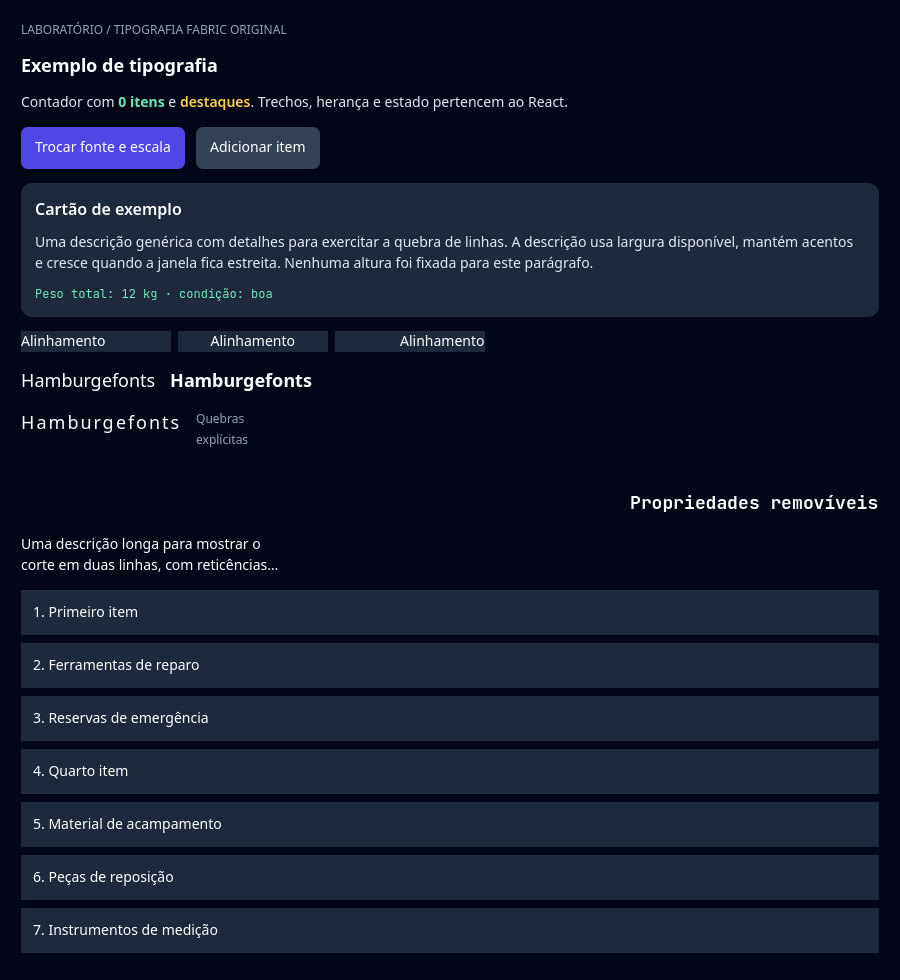
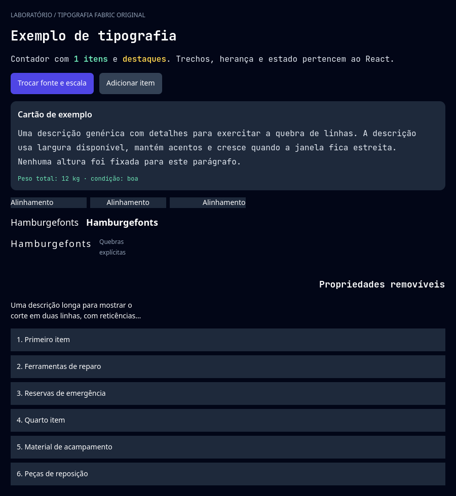
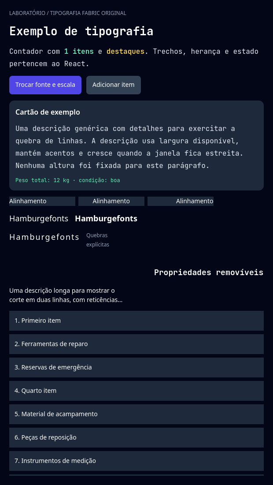
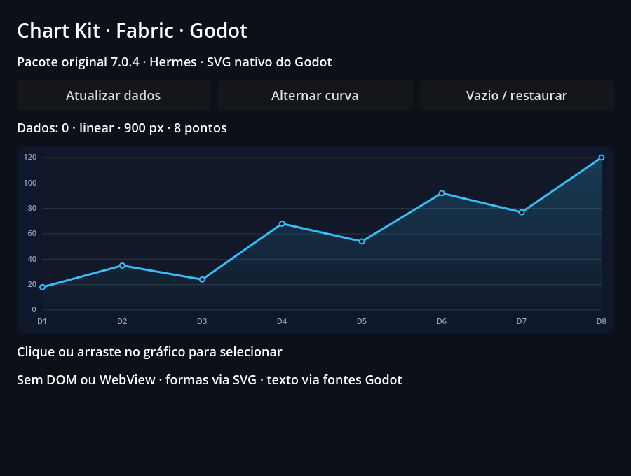
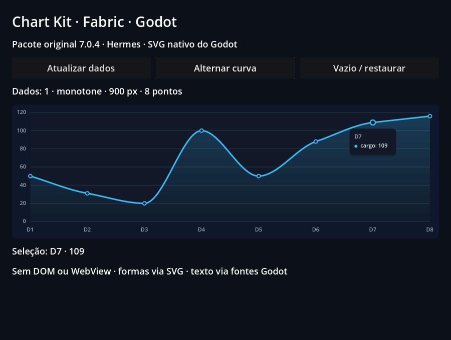

# Initial public release validation

This record describes the initial public-source snapshot before the examples
reorganization. Its provenance hashes remain historical; they are not hashes
of today's moved source files. Subsequent [cold-start/oracle work](cold-start.md)
has separate evidence.

The [runnable examples record](examples/README.md) has fresh source hashes,
reports for the nine interactive cases and the new public counter captures.

The [public controls record](public-controls/README.md) adds the typed form,
fresh ten-example reports and README gallery captures. Earlier records retain
their historical provenance.

The [independent consumer record](consumer/README.md) adds the 2B
Resource/addon/editor prototype, fresh external TSX project, private/offline
build and dependency checks, native roots/lifecycle and two actual captures.

The later [project-resolution record](project-resolution/README.md) exercises
inherited local aliases and non-hoisted dependencies through that normal addon.
Its actual Godot captures and positive/negative cases retain SDK React identity,
type/runtime source agreement, lockfile ownership and exact-byte recovery.

The later [game-services record](game-services/README.md) extends that consumer
with typed Godot operations, state revisions and signals. It also retains the
services laboratory's pause/job-lifetime captures, dedicated native DTO and
application-destruction fixtures, and the 15-example regression matrix.

The separate [iOS export/runtime record](../IOS_BUILD.md) has current-source
native build/package hashes, an unsigned arm64 device export/link and an
x86_64/Rosetta simulator consumer. Its narrow runtime proof and disclosed
official-template limitations do not certify the complete iOS port.

The [original Codegen record](codegen/README.md) adds upstream TS/Flow generation,
20 contract tests and six compiled C++ translation units. That first record did
not load/render the external adapter; later native-adapter records below add
that bounded execution. Complete ABI certification remains open.

The [independent-root retirement record](root-retirement/README.md) extends
GF-07/GF-26/GF-28 with 17 real Godot runs / 318 checks, including callback-driven
unmount/remount, freed hosts, application replacement and stale core signals
across reused tags. External font ownership has an executed failing binary
control. Three graphical root cases retain readbacks and pixel assertions.
Its source, native/SDK fingerprints and preceding hosted CI are kept separate
from full lifecycle, RN differential and all-target acceptance.

The [public View record](view/README.md) adds original RCTView descriptors,
Fabric stacking/hit order, rectangular overflow clipping and solid physical-edge
borders. It retains 67 headless / 107 native assertions, 36 RGBA samples, three
actual captures and the expected-failing previous-host control. The rebuilt host
also passed 16 headless scenes / 672 checks, NativeWind 58 native checks and
17 adapter runs / 318 checks. At that checkpoint, RTL, transforms, rounded
descendant masks, fractional geometry and mobile View differential work remained
open. Subsequent transform execution is recorded separately below; GF-10 remains
in progress.

The later [coordinate record](coordinates/README.md) addresses the offset-root
input/measurement gap found by the View checkpoint. It retains 238 headless /
247 native assertions, six RGBA samples and three captures. Genuine move-out,
return and release exercise original Pressability through translated/scaled
Godot surfaces and raw window input at content density two. The previous host
fails 121 assertions in each lane; an intermediate cached-density host fails
the first contact before a metrics refresh. GF-08/GF-13 remain in progress
with their wider ref/input acceptance still open. Historical View hashes and
reports remain separate.

The later [transform record](transforms/README.md) adds original RN 2D affine
styles and origins on the same Godot Control, with 309 headless / 345 native
assertions, 33 RGBA samples and three captures. Independent matrices/corners,
public measures, stable refs/state, flattening and genuine transformed-parent
input are checked together. The same final fixture fails 65 headless / 68
native assertions against the preceding coordinate host. Six isolated public
rejection cases pass 61 checks; the affine factor test passes 40,932 checks.
The separate input guard passes 25 checks for invalid composed embeddings,
ignored START, restoration and cancellation preserving the last valid sample.
This does not establish singular JSX rendering.
GF-08/GF-10/GF-13 remain in progress; broader ref/View/input acceptance,
transformed clipping, singular/3D support and mobile differential work remain.
The later [uniform scale record](uniform-scale/README.md) accepts RN's uniform
`scale` on the same Control and extends the public rejection cases to eight, and the
[singular transforms record](singular-transforms/README.md) collapses singular JSX
transforms as RN does.

The later [read-only tree record](tree/README.md) adds original RN View IDs,
root-scoped lookup, logical node traversal, snapshot collections, RawText updates
and retained refs during keyed changes and retirement. It passes **89 headless /
99 native checks**, eight RGBA samples and two captures on the unchanged host.
The same fixture fails **25/89 checks** with the preceding JS configuration.
Original source links explain RawText replacement/null ownerDocument and
imperative native IDs, which the record observed reverting on a children-only
commit; the [Animated record](native-animated/README.md) changed that on purpose
(RN's JS thread holds the clone `setNativeProps` committed, so the ID stays), and
this record's executed files keep the earlier observation as history. GF-08 remains
open for complete refs/commands and original mobile differentials.

The [original TextInputState/focus record](focus/README.md) adds 175 headless /
189 native checks, 12 pixels and two captures. Previous-host and eligibility
controls fail 23/160 and 11/175. Its [native command complement](focus/commands.json)
passes 112 checks / 40 owner observations with eight exact argument rejections,
recovery and nine input registrations cleared across two applications. GF-08/
GF-12 remain open; physical keyboard/IME, multiline and mobile focus acceptance
are separate. The subsequent [pointer lifetime record](pointers/README.md)
adds 132/146 public checks,12 pixels,144 native assertions, two original-source
crash controls and 43 original JSX listener/real-focus stop checks. The
[capture analysis](../research/pointer-capture-boundary.md) retains source
boundaries and incomplete transformed/hardware/mobile acceptance.

The subsequent [captured geometry record](pointer-geometry/README.md) adds
631/648 public checks, 14 pixels/three captures, 55 expected previous-host
failures and separate original/binding witnesses. It documents the pinned RN
numerical limitation and native local-inverse behavior; coalescing, hardware,
scroll/windows, EventTarget and mobile acceptance remain open.

The later [ref-getter fault record](pointer-resolver-faults/README.md) isolates a
throwing `canonical.publicInstance` read before the real SDK query. The identical
65-check fixture retains three same-batch TouchStart/Raw/React failures on the
previous host and passes all 65 on the corrected host. Two actual 680×160 frames
add 16 pixel assertions, two React-counter assertions and two saves for 85/85
viewport checks. The descriptor is restored before throwing; broader getter,
root/reentrant, hardware/mobile and priority acceptance remain open. Public
flags stay off; its [hosted CI](pointer-resolver-faults/hosted-ci.json) passed
five jobs, with the getter artifact independently audited.

The later [original View pointerup record](pointer-up/README.md) extends the
existing native interest query to original bubble/capture Up Maps. It retains
62/62 corrected headless and 90/90 viewport checks, with 24 actual pixels/two
captures. The final current SDK bundle passes on the corrected host and retains
eight visible normative failures on the preceding host; original TouchEnd/Raw
and terminal cleanup pass in both. Only two native producer pins differ in that
paired comparison. The initial earlier-SDK negative receipt remains historical.
Bubble `36=true` and capture-only `36=false` then `37=true` have independent
controls. B actually queries false while A remains held; Cancel and stop clean
up separately. View/both-flags acceptance does not certify Document Up,
captured/null-target Up, full lifecycle/events, mobile or hardware. Regression
and SDK checks passed, and its [hosted CI](pointer-up/hosted-ci.json) passed in
run 37241023275; public flags stay off.

The [View Up component fault record](pointer-up-faults/README.md) arms one-shot
throw/non-boolean faults on the actual View ref at offsets 36/37, in a second
application: 240 headless and 268 viewport checks. A bubble fault still lets the
same View's capture listener qualify; an unqualified View hands the lookup to its
owning-surface ancestors and root, all false, while TouchEnd and contact cleanup
survive and each consumed fault leaves one diagnostic. A retained control that
qualifies a failed lookup fails fifteen probe checks and the independent oracle.
The three preceding-host controls reproduce their 8/12/3 normative failures with
the new bundles. Hosted run 37330669524 passed the same 240 checks with identical
IDs, bundle and fault stages ([receipt](pointer-up-faults/hosted-ci.json)).

The [View Up resolver record](pointer-up-resolver-faults/README.md) arms a one-shot
getter on the View's `canonical.publicInstance`, after Down: 296 headless and 324
viewport checks. The first native read fails before any SDK entry, only that
lookup is rejected with one diagnostic, and the next lookup reads the restored
descriptor; with capture and bubble the Up is still delivered. A retained control
whose getter silently succeeds fails nine probe checks and the independent oracle.
Hosted run 37332057453 passed the same 296 checks with identical IDs, bundle and
stages ([receipt](pointer-up-resolver-faults/hosted-ci.json)).

The [View pointermove record](pointer-move/README.md) extends the native interest
query to original View Move Maps at offsets 1/25: 219/219 corrected headless
(including a Move-fault application) and 243/243 viewport checks, with 20 actual
pixels in two captures. The same SDK
bundle, 15 test/SDK producer pins and 19 RN pins retain 45 visible normative
failures on the preceding host; the two native producers are evidenced by the
build records, which differ only in the host, those producers and the generated
`PointerEventsProcessor` tree. Listeners on the target (phase 2) and on its parent
(phases 1/3) and button-less mouse motion each deliver one trusted move per
dispatched sample with its typed/star Raw and one commit at the pinned Default
priority; B without listeners reads its whole path false, in order. The host
flushes RN's queue after every input event, so per-frame merging comes from
Godot's input accumulation. A failing Move lookup is retained once per distinct
cause, up to 16 causes per application, and repeats are counted. The three
preceding-host controls reproduce 8/12/3 failures with the new bundles. Hosted
run 37345287351 passed the same 219 checks with identical IDs, bundle and fault
stages ([receipt](pointer-move/hosted-ci.json)).

The [Document pointermove record](pointer-document-move/README.md) runs eight
lanes (original/current interest × four flag configurations) over the same host:
1,932 headless checks and 330 viewport checks with 24 pixels. Document listeners
need native dispatch and documentElement listeners also the imperative flag; only
the installed current query delivers. Capture runs at phase 1 and bubble at
phase 3 after false lookups on the target and its ancestors; isolation, removal
between samples, Cancel, a JSX sentinel and mouse hover are covered. A retained
control that drops the owner Document from the root query fails 52/40 probe
checks in the two delivering lanes, and the independent oracle rejects it. Hosted
run 37351245158 passed the same 1,932 checks with identical IDs, bundles and stages
([receipt](pointer-document-move/hosted-ci.json)).

The [View hover record](pointer-hover/README.md) extends the native interest query
to `pointerover/out/enter/leave` (offsets 0/23, 2/24, 26/28, 27/29) for mouse and
touch: 158/158 headless checks, 32 visible normative failures on the preceding
host with the same SDK bundle. Out/over consult the whole path; enter/leave keep
RN's per-node rule, including a capture ancestor emitting to its descendants.
Callbacks match RN's order, phase, target and Discrete priority; a touch enters
its path in the Down and leaves it after the Up. A repeated Over lookup fault is
retained once and then counted, and ancestors without a public instance are
skipped without being created. The older pointer probes now separate the hover
lookups every touch and move makes and require them false, and the four
preceding-host controls still reproduce 8/12/3/45 failures. Document hover and
the empty-area root target remain open. Hosted run 37352693788 passed the same 158
checks with identical IDs, bundle and fault stages ([receipt](pointer-hover/hosted-ci.json)).

The [root-path record](pointer-root-path/README.md) resolves an empty point inside
a surface to its root view, as RN's TouchTargetHelper and root hitTest do, so the
root stays in the processor's hover path: 82/82 headless checks with mouse and
touch, View listeners and Document capture listeners. The root is never an event
target, since RN creates its family without an event dispatcher or instance
handle: the path query, the enter/leave loops and the binding all skip it, while
its capture lookups still propagate to entering and leaving descendants. On the
preceding host the same bundle fails exactly 9 View-case checks, and its Document
case crashes (signal 11 in `dispatchEventToJS`) when enter is emitted to the root.
Hosted run 37359026197 passed the same 82 checks with identical IDs and bundle
([receipt](pointer-root-path/hosted-ci.json)).

The [Document hover record](pointer-document-hover/README.md) runs Document and
documentElement over/out/enter/leave listeners in eight lanes (original/current
interest × four flag configurations): 1,530 headless checks. Document listeners
need native dispatch and documentElement listeners also the imperative flag; only
the installed current query delivers. Over/out reach them at phases 1 and 3;
enter/leave reach only capture listeners at phase 1, for the nodes entering or
leaving with the root; bubble enter/leave listeners on the root never run. A
retained control that ignores the owner Document for hover offsets fails 34/22
probe checks, and the independent oracle rejects it. Hosted run 37364101069 passed
the same 1,530 checks with identical IDs and bundles
([receipt](pointer-document-hover/hosted-ci.json)).

The [click record](pointer-click/README.md) runs click synthesis and the scroll
takeover in eight lanes: 728 headless checks. A primary release clicks the
deepest mounted view on both hit paths, never a shared root, and a ScrollView
drag sends its contact one `pointercancel` and then only touches. The preceding
host fails exactly 31 normative checks; a host clicking the release target fails
10, an SDK without `topClick` throws in the legacy lane, and the independent
oracle rejects both controls. Hosted run 37375758262 passed the same 728 checks
with identical IDs and bundles ([receipt](pointer-click/hosted-ci.json)).

The [PanResponder record](pan-responder/README.md) runs RN's original
`PanResponder` in four flag lanes, covering the legacy and native-dispatch
responders: 128 headless checks with identical callbacks and gesture
coordinates in every lane. The preceding SDK fails at mount when its stub throws, and a
PanResponder without capture-phase handlers fails 6 checks rejected by the
independent oracle. Hosted run 37385104730 repeated the 128 checks with identical
IDs and callbacks ([receipt](pan-responder/hosted-ci.json)).

The [AppState record](app-state/README.md) delivers Godot's application focus,
pause and memory-warning notifications through the running main loop to an actual
`FabricApplication` whose two roots read RN's original `AppState`: 75 headless
checks. Focus loss is `inactive`, a pause is `background`, only new states are
sent, focus changes also send `focus`/`blur`, a paused game tree still delivers
events and stop sends nothing. The preceding host fails exactly the 62 lifecycle
checks, and a host whose focus outranks the pause fails 5, which the independent
oracle rejects. Hosted run 37382633328 repeated the 75 checks with identical IDs
and bundle ([receipt](app-state/hosted-ci.json)).

The [shared touches record](shared-touches/README.md) lists every root's active
touches in each TouchEvent, because the roots of one application share RN's one
JS responder: 92 headless checks in four flag lanes over two roots' original
`Pressable`s. A touch ending in another root no longer releases a held press
while the press's own touch is down, while a canceled touch still terminates the
one responder; the two responder implementations differ only where RN's do,
when the responder's own touch ends first. The preceding host fails exactly the 9 normative checks.
Hosted run 37392899167 repeated the 92 checks with identical IDs and
callbacks ([receipt](shared-touches/hosted-ci.json)).

The [Switch record](switch/README.md) runs RN's original `Switch.js` over RN's
shared iOS/macOS Switch descriptor and a custom-drawn Godot switch: 108/108
headless checks with actual mouse and touch input in two roots. Controlled and
fixed values, disabled input, colors, the 63×28 default frame (RN's iOS 26 size),
`setValue`, removal mid-press and the bubbling `topChange` registry are covered.
The preceding host fails exactly the 2 mount checks; a retained sabotage of the
native `setValue` fails 13 checks and the independent oracle rejects it. Hosted
run 37390584578 repeated the 108 checks and the oracle accepts its report
([receipt](switch/hosted-ci.json)).

The [touchables record](touchables/README.md) runs RN's original
`TouchableWithoutFeedback` and `TouchableHighlight` from the public facade with
actual Godot mouse and touch on two roots: 93/93 headless checks. Callbacks keep
Pressability's order and payloads (press out before press on release), the
Highlight's underlay and child opacity show on the native Controls with its
`delayPressOut` timer, and long press, hitSlop and retention, disabled grants,
nesting and removal mid-press follow RN. The same fixture on the preceding SDK
fails exactly its 19 render checks; a retained imitation over the SDK Pressable
fails 42 probe checks and the oracle rejects 12 of 13 sections; an animated
lane showed RN's original TouchableOpacity failing at mount without
`NativeAnimatedModule` (the [Animated record](native-animated/README.md) makes it
public, and the lane now presses it). Hosted run 37394073082 repeated the 93 checks
and the animated lane's 6 ([receipt](touchables/hosted-ci.json)).

The [ActivityIndicator record](activity-indicator/README.md) runs RN's original
`ActivityIndicator.js` over the generated `ActivityIndicatorView` descriptor and
a custom-drawn Godot spinner: 33/33 headless checks across actual SceneTree
frames in two roots. Defaults, small/large/numeric sizes, the phase advancing once
per frame while animating and frozen when stopped, `hidesWhenStopped`, color,
remount and root isolation are covered. The preceding host fails exactly the 2
mount checks; a retained sabotage that stops the per-frame work fails 9 checks
and the independent oracle rejects it. Hosted run 37395264445 repeated the
33 checks and the oracle accepts its report ([receipt](activity-indicator/hosted-ci.json)).

The [capture notification record](pointer-capture-notifications/README.md) runs
`gotpointercapture`/`lostpointercapture` for JSX props and original View,
documentElement and Document listeners in eight lanes: 672 headless checks. A
pending capture is notified at the pointer's next event (lost, then got,
retargeted and Discrete), Up and Cancel release it after their own dispatch,
hover follows the owner, removal clears it without a notification and click keeps
the physical hit paths. No native or SDK code changed; an SDK without got/lost
bubbling fails 12 or 13 checks per lane and an overlay tracking hover by the
physical target 33, and the independent oracle rejects both. Hosted run
37396999119 repeated the 672 checks with identical IDs and raw sequences
([receipt](pointer-capture-notifications/hosted-ci.json)).

The [virtualized-list record](virtualized-list/README.md) scrolls RN's original
`FlatList`, `SectionList` and `VirtualizedList` on the SDK ScrollView with real
wheel steps and touch drags in two roots: 44 headless checks. Windows match RN's
`computeWindowedRenderLimits`, cells outside them unmount and return, and
viewability, `onEndReached`, scroll commands and failures follow RN. The
preceding host fails exactly 3 normative checks, the preceding SDK 11, and an SDK
ScrollView without `onLayout` fails 3, which the independent oracle rejects.
Hosted run 37401008543 repeated the 44 checks with identical IDs
([receipt](virtualized-list/hosted-ci.json)).

The [Appearance record](appearance/README.md) runs RN's original `Appearance` and
`useColorScheme` in two roots of one application, fed through the one Callable
registered with Godot's `DisplayServer` for system theme changes, which every
application shares: 79 headless checks. An override wins over the system,
`unspecified` follows it again, an unsupported system starts `light`, change
events are sent only when the effective scheme changes, stop sends nothing, and
two applications that observe at once both receive each change. The preceding
host fails exactly the 56 Appearance checks, the host from before the shared
callback fails exactly its 9 two-application checks, and a host that emitted for
every callback failed 17 of the first 67; the independent oracle rejects both.
Hosted run 37408741652 repeated the 79 checks with identical IDs and the oracle
accepts its report ([receipt](appearance/hosted-ci.json)).

The [Animated record](native-animated/README.md) runs RN's original `Animated`,
`Easing`, `useAnimatedValue(XY)` and `TouchableOpacity` in two roots of one
application, with the JS driver on `requestAnimationFrame` and, with
`useNativeDriver`, RN's own C++ `AnimatedModule` and shared `AnimationBackend`
advanced by Godot's frame tick (the [frame clock record](frame-clock/README.md) made
that tick display-paced later): 75 headless checks. An independent oracle replays
RN's frame, spring and decay drivers over the timestamps the host delivered and
agrees with the Controls to rounding; mouse and touch presses dim the
`TouchableOpacity` through the native driver. The preceding host fails exactly the
59 normative checks, a host that hands the backend seconds fails 32, and a host whose
JS thread does not update the shadow node references it holds fails 2; the oracle
rejects both. The record also updates two earlier contracts (the touchables suite
renders `TouchableOpacity`; a tree children-only commit keeps an imperative native
ID) and keeps their executed files as history. Four captures. Hosted run
37439650201 repeated the 75 checks on its second attempt, after the first failed one
check of the native decay ([receipt](native-animated/hosted-ci.json)).

The [uniform scale record](uniform-scale/README.md) accepts RN's
`transform: [{ scale }]`, which the transforms guard rejected because RN writes it
as `scale3d(n, n, n)`, on the same planar Control: five Hermes applications (a
scale, a scale with a rotation, a scale about a `transformOrigin`, an
`Animated.View` scaled by `useNativeDriver` and back by a real press, and a
`Pressable` pressed with the real mouse where only its scale reaches), 29
headless checks and 35 with the renderer capture, compared with planar matrices
derived from the JSX by an independent oracle. The planar rule now has one
definition shared by the transform adapter and pointer projection; the eight
public rejection cases pass 81 checks and the affine factor test 41,278. The
preceding host fails exactly the 22 normative checks, with `E_TRANSFORM_3D` at
every mount. `scale: 0` and the other singular transforms failed then; the
[singular transforms record](singular-transforms/README.md) below collapses them. A
separate commit hardens the Animated example's capture check. One capture. Hosted
run 37455258901 repeated the 29, 81 and 25 headless checks ([receipt](uniform-scale/hosted-ci.json)).

The [singular transforms record](singular-transforms/README.md) renders a transform
with no inverse as RN does (the View neither drawn nor hit, no error, restored by the
next invertible transform) instead of throwing `E_TRANSFORM_SINGULAR`; the host hides
its subtree too, as Android does and iOS does when the container clips, and does not
reproduce the descendant hits iOS still allows under an unclipped, overflowing
container (an open item). The transform step returns an explicit planar result that can
be collapsed (a singular matrix, or one whose scale rounds to zero in a float), the
runtime hides the Control in the one place visibility is decided and keeps its last
invertible transform, and pointer projection treats a target or capture owner inside a
collapsed subtree as `display: none`. Eight Hermes applications (`scale: 0`,
`scaleX: 0`, a rank-one matrix, a float rank-loss matrix, an `Animated.View` scaled 0
to 1 and 1 to 0 by `useNativeDriver`, a scale moved through 0 by React state, and a
pointer captured by a View that collapses mid-gesture), 49 headless checks and 58 with
the renderer capture, compared with values derived from the JSX by an independent
oracle; the preceding host fails exactly the 37 normative checks and a retained
sabotage of the pointer projection fails exactly 2. The public rejection cases are six
again, not the checkpoint's six (perspective, `rotateX`, a weight other than 1 and three
out-of-range cases; 61 checks), the input guards 25 and the affine factor test 57,703.
Keyboard focus is released by a native-driver collapse (asserted) and kept by a
React-commit one (an exploratory observation). One capture. Hosted run
37499277022 repeated the 49, 29, 61 and 25 headless checks
([receipt](singular-transforms/hosted-ci.json)).

The [frame clock record](frame-clock/README.md) makes `requestAnimationFrame` callbacks
and RN's Native Animated frames run at a display link's cadence instead of on every
Godot frame. One host clock (`native/frame_clock.h`) decides, once per Godot frame,
whether the frame is a tick. A window presented with V-Sync (enabled or adaptive) on a
real display, and able to draw, ticks every frame with a consumer: the engine presents
each process frame as one image and pipelines them (about 3 and 13 ms apart on a 120 Hz
window), so the time between frames says nothing. A loop nothing paces (headless, V-Sync
off or mailbox, or a window that cannot draw, such as a minimized one, which Godot's main
loop paces with a sleep even with V-Sync) ticks a frame that starts at least half a
refresh period after the previous Godot frame or a whole period after the last tick, at
the rate the display reports for the window's screen (60 Hz when it reports none). The
host's own `requestAnimationFrame` gives every callback of a tick, and the animation
frame, the tick's one timestamp. Eight Hermes loop paces (capped at 60 fps, headless,
uncapped, stalled in the hosted runner's burst pattern, a 144 Hz display, the same loop on
a screen that reports nothing, and the pipelined frames of a V-Sync window presented and
timed), 37 headless checks none of which assumes what timing the machine delivers (the
first hosted run, on a macOS runner too slow for the 3 ms frames, failed two that did; a
recorded report is now replayed through the same checks; review commits
[`e6d42a4`](https://github.com/journey-studios/godot-fabric/commit/e6d42a4efa8cb224c7db82a24625341eeb21f9e8)
and
[`8fc4627`](https://github.com/journey-studios/godot-fabric/commit/8fc46279d6126b87e4fc6cc1d982f75620dfc3b5)),
recomputed frame by frame by an
independent oracle, and a C++ unit test over synthetic pacings. The preceding host fails
exactly the 29 cadence checks (the same native decay lands at 13.5 of 50 uncapped and
45.6 under bursts); three retained sabotages (a clock that always ticks, one that ticks
for idle frames, one that times a presented window) each fail at least one check, and the
oracle rejects each. Timers, input and the work queue still run on every Godot frame, and
five checks of the Animated record were renamed on purpose (its executed files keep the
history). Exploratory headed observations on a 120 Hz Mac: V-Sync on, 720 of 720 frames
ticked at 120.0 per second; V-Sync off, 166 of 2,400 at 114.6 per second;
`Engine.max_fps` 60, 360 of 360; minimized, the window reports it cannot draw and the clock
reads `time` from `undrawable`. The clock has no visual output, so there is no capture.
Open: regular presentation timestamps, timers quantized to ticks, and `ADAPTIVE` and
`MAILBOX` V-Sync beyond the unit test. Hosted run 37538167415 repeated the
37 checks ([receipt](frame-clock/hosted-ci.json)).

The [networking record](networking/README.md) runs React Native's own `fetch` (with
`Headers`, `Request` and `Response`), `XMLHttpRequest`, `FormData`, `Blob`, `File`,
`FileReader`, `URL`, `URLSearchParams` and `AbortController` as globals, installed from
the host's initialization (RN's `setUpXHR`) over three C++ TurboModules with the contract of
RN's Android `RCTNetworking` wrapper (`Networking`, `BlobModule` and `FileReaderModule`)
and a transport on Godot's `HTTPClient`: one connection per request, polled on the main
thread with a byte budget, with redirects (up to 20) and the total time-out enforced by the
host. Two roots of one application run 100 headless checks against a Node server that records
every request as it arrived, over HTTP and over HTTPS with a CA generated at runtime and
trusted only through a validation seam; an independent oracle derives the 137 requests the
cases must have caused and ties the native counters to the server's record (64 redirects
followed, every started request ended exactly one way, no event after the stop, the blob
store's books balanced). UTF-8 and charset decoding, repeated headers, redirects, abort,
time-outs, network errors, blobs and the stop of the application with requests in flight are
covered. The preceding host fails exactly the 84 normative checks (the first use of each
API fails where RN looks up its module, and no request reaches the server); a transport
that never follows a redirect fails 8 checks and one that does not join repeated response
headers fails 2, and the oracle rejects each. Six captures of the example and a C++ test of
the HTTP core (81 assertions). Cookies, compressed responses, HTTP/2, progress events,
incremental streaming, `uri` and file bodies, and every target but macOS are open (the
`WebSocket` global got its module in the record below). Hosted run 37571237096
repeated the 100 checks with identical IDs, and the oracle accepts its report
([receipt](networking/hosted-ci.json)).

The [WebSocket record](websocket/README.md) now describes the HTTPClient/StreamPeer adapter
with pinned wslay; the prior `WebSocketPeer` report remains available as explicit history.
Its current local macOS arm64/headless product run passed 95 checks across 60 server
connections and 53 independent JS/wire comparisons. Exact TLS close 1000 and peer-selected
4002/reason are preserved, while a post-client-close drop remains abnormal. Data-before-close
and interleaved-ping behavior pass. Two real RN load phases independently reach the shared
1 MiB wire-byte and 256 pending-event limits across eight sockets, delivering 1,024 messages
with a bounded pending-event peak and zero pending events at finish. The previous host made zero
connections; both retained source sabotages were rejected by the oracle. Eight reentrant lifetime
cases end with no active sockets; quiescent echo peers record 1001, while greeting with unread
input records a TCP drop as best-effort cancellation. The curated load, lifetime and execution measurements are in the evidence record; raw per-run reports remain ignored. The native SDK pack/addon provision and iOS simulator arm64 build-link pass, with no runtime
or consumer export claimed. [Hosted CI](websocket/hosted-ci.json) passed all five jobs for pinned
head `422c2ee`; later PR-head changes require their own green run. Its 13 `core-ui-v2` Android/iOS
parity cases are not WebSocket differential or Godot mobile runtime proof. This does not complete
GF-22 or add a checkpoint. The networking example separately passes 29/29 headless
and 51/51 graphical checks, with all 11 current captures linked from the record.

The [device services record](device-services/README.md) runs React Native's original `Linking`,
`Clipboard` (the legacy module) and `Vibration` from the public import over three C++ TurboModules
(`LinkingManager` with iOS's contract, `Clipboard` and `Vibration`) that call Godot's `OS.shell_open`,
`DisplayServer` clipboard and `Input.vibrate_handheld` through a replaceable backend: GF-23's first slice.
Two applications of the same bundle run 65 headless checks (a recording validation backend with two roots,
and Godot's real backend, where the headless clipboard rejects with `E_CLIPBOARD_UNAVAILABLE`) and a second
process without `--uri=` runs 2 more, with an independent oracle that replays every step against RN's rules.
Order and counts are judged, never time: a pattern vibrates four times in order, a deep link reaches the
listeners of both roots once each, `openURL` rejects what has no scheme before the backend sees it, and RN's
own repeating-pattern hazard (`cancel()` does not stop it) is demonstrated, not fixed. The preceding host fails
exactly the 52 normative checks and 1 of 2 (hosts `aebbddcd` and `147df0b3`); a host that emits `url` twice
fails 5 and one that caches `getString` fails 9, and the oracle rejects both. The example passes 16 headless
checks, 16 with the native renderer and 23 with seven captures, all linked from the record, with every backend
replaced so that nothing opens a real URL or touches the real pasteboard. `canOpenURL` cannot ask which
handlers are installed, a vibration cannot be cancelled in Godot, a deep link reaches a running application
only through `FabricApplication.deliver_url`, and Alert, Share, Settings, BackHandler, mobile deep-link plugins
and real-device behavior are open. Hosted CI is pending; this does not complete GF-23: only its first-slice checkpoint closes, and no whole GF, other checkpoint, weight or denominator does.

The source was compiled and executed independently on **macOS arm64** using
official Godot **4.7.2**, React **19.2.3**, React Native **0.87.1**, Hermes
**250829098.0.17**, NativeWind **4.2.7** and css-interop **0.2.7**.

The GDExtension and JSX bundle were built in this standalone project. Setup
verified the native archives by SHA-256. Godot itself was not rebuilt. The
[provenance](provenance.json) records public source and evidence hashes.

## Acceptance matrix

| Scene | Headless | Native |
| --- | ---: | ---: |
| React | 36 | 36 |
| Layout | 47 | 47 |
| Input | 45 | 45 |
| Pressability | 43 | 47 |
| Chart Kit | 34 | 34 |
| ScrollView | 62 | 68 |
| NativeWind | 49 | 58 |
| Typography | 50 | 63 |
| **Total** | **366** | **398** |

**764 passing assertions in 16 runs.** [matrix.json](matrix.json) contains
commands and report filenames. The complete per-run reports are not versioned:
`npm run check` regenerates each one as `build/report.json`. Every report was
checked for scene, display mode, expected assertion count and passing results. Native runs are sequential because they share a
generated report path.

Additional release checks: 9 Node contract tests and 6 Python archive-recovery
fixtures; 4 typography Node tests (including the native line-height and rejected
attachment cases); 4 chart tests; 2 native recovery tests. Fallow reported no
unused code. The publication scan and manual source/capture review check scope
and avoid carrying environment-specific logs into the public tree.

The first hosted run exposed static analysis treating a generated test log as
an imported dependency. The test now constructs that filesystem path from the
project directory. Its native line-height check passed again, and static analysis
passed with the log absent. Runtime source and the matrix evidence are unchanged.

## Native captures

The [original EventTarget baseline](event-target/README.md) separately executes
119 headless checks in four runtimes/five surfaces, including 33 manual checks
per enabled root and three reproduced gaps. It preserves production defaults
and does not certify native EventTarget delivery or fix retained ancestry.

The [current-ancestry correction](event-target-ancestry/README.md) then executes
102 checks in each original/corrected variant against the same native host.
Real NativeDOM removals, root retirement/remount and preserved listeners are
separate from a synchronous mutable-parent graph. Shared bundling fixes the
cache. At that checkpoint native delivery was still pending; public EventTarget
flags remain off. Later native integration has its own receipt below.

The [native touch-tag correction](event-dispatch/README.md) executes 647 identical
checks per renderer variant. The original lookup fails two inside-contact
retention assertions; the corrected lookup passes all. Actual Godot input in
the legacy renderer is separate from explicit calls to the original experimental
dispatcher, whose four responder differences remain open. Public flags stay off.

The later [GF-05 runtime example](runtime/README.md) adds three real Viewport
captures with explanations of starting, pausing and completing a React clock.
Its local validation and remaining gaps are recorded separately from this
initial release snapshot.

The [shared-root record](shared-roots/README.md) adds the bounded GF-07
application owner, original AppRegistry, independent lifetimes and three actual
captures. Its matrix retains the 12-example regression results; this earlier
release snapshot and its hashes remain historical.

These images are Godot renderer readbacks of generic fixtures, not desktop
screenshots. They contain no other applications or game content.

The typography child retains count 1 and one mount while fonts and width change.
Glyph pixels verify distinct span colors and real variable-font bold. Logical
Viewport events use validation device 1001. This does not certify physical OS
input, DPI/Retina, IME or mobile gestures.

## Line-height regression

[line-height-negative.json](line-height-negative.json) records the inclusive
run-overlap implementation failing before the fix. A 42-height first run leaked
into the next 21-height line: the measured height was 84 instead of 63. The
corrected implementation uses strict half-open overlap plus a final-run sentinel
exception. The line-height run report, regenerated as
`build/line-height-report.json`, proves both span orders, empty/trailing lines and balanced native cleanup.

The chart test also moves the native GUI pointer to the target button before
press/release after resize. Its original missing motion caused the empty-data
assertion to fail in the graphical lane. The same assertions passed with the
complete pointer sequence; they were not removed or weakened.

## Initial import limitation

The first standalone editor import with an empty `.godot` cache logged a
**signal 11** crash after resource import. The next cached import passed, as did
the editor imports preceding the retained matrix runs. The runner still rejects
crashes; no automatic retry or suppressed native error was added.

A separate font-only control without Fabric, a GDExtension or application code
passed its cold import: [editor-import-control.json](editor-import-control.json).
That control does not attribute the crash to Godot alone. The underlying engine root cause remains unresolved. The current runner
contains the late-extension-discovery failure by preparing the startup list
before import; [cold-start evidence](cold-start.md) records fresh native CI
checks without retries.

## Scope and remaining proof

Only the renderer's reviewed source, generic fixtures, font assets/licenses and
fresh public evidence are committed. This is a new repository history. Runtime
dependencies, build caches, native framework binaries, raw logs and unrelated
project documentation are excluded. The publication scanner has negative
fixtures for local paths, internal references and credential-shaped strings.

These initial results are local runtime evidence. The current workflow also
runs cold native Godot checks, original RN iOS/Android reference apps and
differential comparison. Mobile reference jobs do not certify Godot mobile
builds. [API limits](../API.md)
describe capabilities that still need dedicated validation.

The [native EventTarget integration record](event-dispatch-integrated/README.md)
adds 181/206 original/integrated headless checks, 236 viewport checks,
28 pixels/two captures, exclusive batched native delivery and two native lifetime
fixes. Its preceding-host registry failure and reentrant crash controls are
separate. Public flags remain off; this starts
GF-06 alongside continuing GF-05/GF-07/GF-08/GF-13 work.

The subsequent [native pointer-interest record](pointer-interest/README.md)
adds 193 original / 230 current headless checks and 260 current macOS viewport
checks, with 28 pixel assertions and two 820×280 captures. A query reads the
original EventTarget phase/type maps to qualify View-path `pointerdown` in an
internal opt-in; listener methods, once/abort/removal and ViewProps are preserved.
Manual document-only dispatch is positive while native callbacks/Raw down remain
zero. ScreenTouch down/up/cancel, current flattened View ancestry, removal,
rerender, separate roots and query removal at stop have executed controls.
The default installs no query. DocumentElement/other pointer categories,
arbitrary query-fault cleanup, the full flag matrix, performance, public enablement and hardware/mobile
remain open. The [audited query CI](pointer-interest/hosted-ci.json) confirms
193/230 headless checks at ab0dc44 and five successful jobs after an iOS
discovery timeout on attempt 1. Core references match 13 subset cases; no hosted
captures or Godot mobile pointer certification are implied. The initial
snapshot's hashes remain unchanged.

The [query-fault containment record](pointer-query-faults/README.md) retains
12 normative failures in the identical previous-host fixture and 186 corrected
headless / 204 macOS viewport checks. A thrown or non-boolean interest lookup
records its cause and rejects that lookup while preserving same-batch
TouchStart, both Raw channels and functional React state. Up/Cancel, retirement,
remount and stop clean up separately; four diagnostics remain visible. Two
680×160 frames and 16 exact pixels show A=0/B=0 becoming A=3/B=1. This bounds
query-call/result recovery; getter resolution, reentrancy, documents, complete
flags/events and hardware/mobile certification remain open. No new GF/checkpoint
is closed. Its [audited CI](pointer-query-faults/hosted-ci.json) confirms
186 headless checks/22 pins at b88708c with five successful jobs. The old-host
negative and graphical captures stay local; later Document/root work is outside
that committed head.

The later [Document/root interest record](pointer-documents/README.md) adds
2,723 checks across eight original/current flag configurations and 385 actual
viewport checks with 20 pixels/two 760×220 captures. Current root-family handles
resolve original Document/documentElement Maps without lazy ref creation.
Capture-only offset35 and A-none/B-doc isolation have independent controls;
the previous host retains142 normative failures with identical JS bundles.
Original gates, Raw/state/batching, membership, retirement/remount, stop and
one root throw34 are observed separately. All public flags remain off;
broader faults/events/responders/mobile and full GF acceptances stay open.
Hosted CI and this slice's Pages publication remain distinct from local proof.

The [Document pointerup record](pointer-document-up/README.md) adds eight
original/current SDK × four flag executions: 1,371 headless checks, a separate
243-check actual macOS capture lane and 20 independently decoded pixels.
Original Document D-only and element I-and-D methods, nonempty own-root Map
queries, exact Event identity, healthy legacy pooling, removal, negative A while
B held, Cancel and stop are verified. Down regression passes 2,723 checks.
Hosted run 37244296477 passed the same 1,371 checks in the eight lanes
([receipt](pointer-document-up/hosted-ci.json)); native/SDK bytes reuse the
separately proven View Up implementation and full event/RN/ABI acceptance remains
open.

- [Document Up bubble once/AbortSignal](pointer-document-up-lifecycle/README.md):2,143 headless checks,414 native viewport checks,62 pixels and five actual PNGs; original/current SDK controls are separate. Hosted run 37246479501 passed the same 2,143 checks with identical IDs, bundles and lifecycle stages ([receipt](pointer-document-up-lifecycle/hosted-ci.json)).
- [Document Up rerender, retirement and remount](pointer-document-up-refs/README.md): 2,709 headless checks, 535 native viewport checks and 90 pixels; held-root retirement delivers one TouchCancel and no Up, retained Document listeners stay inert for the replacement root, and the cancelled contact's release is swallowed. Hosted run 37310815360 passed the same 2,709 checks with identical IDs, bundles and refs stages ([receipt](pointer-document-up-refs/hosted-ci.json)).
- [Document Up listener mutation during dispatch](pointer-document-up-mutation/README.md): 4,401 headless checks, 835 native viewport checks and 118 pixels; removal and abort of pending listeners skip them in the same Up, adds to the Map being iterated wait for the next gesture, and bubble listeners added during capture run in the same Up although the root query saw only capture. A retained wrong-phase removal control fails eight probe checks, and the independent oracle rejects it on its own. Hosted run 37319530371 passed the same 4,401 checks with identical IDs, bundles and mutation stages ([receipt](pointer-document-up-mutation/hosted-ci.json)).
- [Document Up reentrant dispatch](pointer-document-up-reentry/README.md): 5,097 headless checks and 946 native viewport checks; a nested pointerup dispatched from a native Up callback runs untrusted at target and at Discrete priority, the native Up resumes with trust, phase, target, path and global binding intact, and re-dispatching the native Up throws. A retained global-leak control fails three probe checks, and the independent oracle rejects it on its own. Hosted run 37321794370 passed the same 5,097 checks with identical IDs, bundles and reentry stages ([receipt](pointer-document-up-reentry/hosted-ci.json)).
- [Document Up root query faults](pointer-document-up-fault/README.md): 6,451 headless checks, 1,179 native viewport checks and 132 pixels; one-shot throw/non-boolean faults at Up offsets 36/37 on the actual documentElement reject only that lookup with one retained diagnostic, a bubble fault still lets capture qualify, and an unqualified Up keeps TouchEnd and contact cleanup. A retained control that qualifies a failed lookup fails nine probe checks, and the independent oracle rejects it on its own. Hosted run 37328158081 passed the same 6,451 checks with identical IDs, bundles and fault stages ([receipt](pointer-document-up-fault/hosted-ci.json)).
