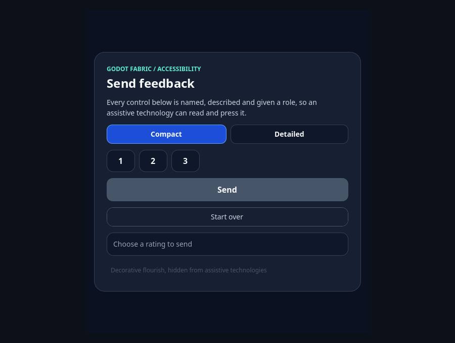
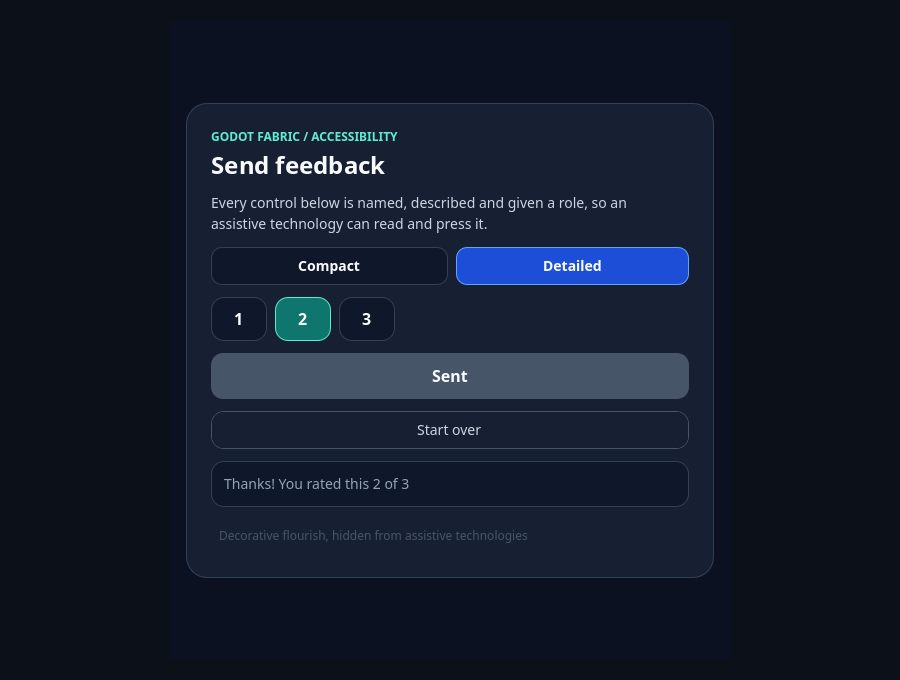

# Accessibility: RN's accessibility props over Godot's AccessKit tree

First slice of GF-20. `View`, `Pressable` and `TouchableOpacity` carry RN's accessibility
props (`accessibilityLabel`, `accessibilityHint`, `accessibilityRole` and `role`,
`accessibilityState` and `aria-*`, `accessibilityLiveRegion`, `aria-hidden` and
`onAccessibilityTap`) to the accessibility element Godot builds for each Control with
AccessKit, and the OS's press reaches RN's callbacks. The record has two kinds of proof, and
they are not the same:

- **Metadata (headless, hosted-CI shape).** 80 checks prove the semantic descriptor the host
  resolved for each element, the properties it set on each Control and the host path of the
  OS's press. **They prove metadata only.** Godot has no OS accessibility driver without a
  window, so nothing was published to an assistive technology in that run, and the report
  says so (`scope.metadataOnly`, `osTree: false`).
- **The real OS tree (graphical macOS, local).** 22 checks read the NSAccessibility tree that
  the running Godot's window serves to the system, from an inspector injected into the
  process, and press elements with `accessibilityPerformPress` (the call behind `AXPress`).
  This is the proof that the OS sees the tree. It needs a macOS window session and is not part
  of hosted CI, which is headless.

Neither proves a screen reader's speech, another platform, or mobile. See [Limits](#limits).

The curated [execution receipt](execution.json) pins the sources, hashes, counts and
controls. Raw per-run reports and logs stay local and ignored; the receipt records only their
SHA-256.

| Lane | Checks | Meaning |
| --- | ---: | --- |
| C++ core test | 594 assertions in 11 groups | The pure role table and descriptor: the table covers exactly RN's two vocabularies, and every Godot role constant it names exists |
| Headless, current host | 80/80 | **Metadata only**, two roots of one Hermes application, an independent oracle accepts the report |
| Headless, previous host, same bundle | 9/19 | Exactly the 10 normative failures: the previous host has no accessible View |
| Headless sabotages | 74, 63, 77 and 75 of 80 | 6, 17, 3 and 5 failures; the oracle rejects each report |
| Bridge, current host | 22/22 | **The real NSAccessibility tree** and `AXPress` on a graphical macOS run |
| Bridge, previous host, same bundle | 2/7 | Exactly the 5 normative failures: the tree has no name RN gave, and nothing is pressable |

```sh
.deps/build/accessibility_core_test
npm run test:accessibility                       # headless: metadata
npm run test:accessibility:bridge                # graphical macOS: the OS tree
node tests/accessibility-native.test.mjs --allow-original-negative   # previous host installed
node tests/accessibility-bridge.test.mjs --allow-original-negative   # previous host installed
node scripts/accessibility-sabotage.mjs          # the four retained sabotages
npm run example -- accessibility                 # the example; add --headless, --check or --capture
```

## Environment

| | |
| --- | --- |
| Platform | macOS 26.6.2 (25G83), arm64 |
| Godot | 4.7.2-stable (official build, not rebuilt) |
| React Native / React | 0.87.1 / 19.2.3 |
| Node | v22.23.3 |
| Implementation | [`42615f4`](https://github.com/journey-studios/godot-fabric/commit/42615f4513cda44671ebc63a7f695ae1d9d7286e) |
| Current host (`fabric_godot.dylib`) | `1654249608505fa8045788598eb4c7ac6aa54c0ff833b867514c1b687fd1b606` |
| Previous host (built from `main` at `e88b5bb`) | `150d7ea12b0a8175077472e05b31e3ef3bbd5856288dd4b2e1608171c7ae0c35` |
| NSAccessibility inspector (`libaccessibility-inspector.dylib`) | `06db70c572470ebb56e9f2397ff223a750c46dc29d1fc1b08898ba7c8a9896f3` |
| SDK bundle (the same on both hosts) | `1d8fdfad4f03345a3528d5c5775352aa2c3147fb12f10d4920ff9a8beebda535` |

The working tree was clean at the implementation commit. The 18 code and configuration inputs
the bundle pins match it by `git show` and SHA-256. Source hashes do not certify the native
build; the host hashes above are the ones the runs loaded.

## What the headless suite proves (metadata)

[`accessibility-probe.gd`](https://github.com/journey-studios/godot-fabric/blob/42615f4513cda44671ebc63a7f695ae1d9d7286e/tests/accessibility-probe.gd)
mounts two roots of one Hermes application with RN's own `View`, `Pressable` and
`TouchableOpacity`, and
[`accessibility-oracle.mjs`](https://github.com/journey-studios/godot-fabric/blob/42615f4513cda44671ebc63a7f695ae1d9d7286e/tests/accessibility-oracle.mjs)
re-derives every stage from the raw observations with its own table. It does not trust a probe
verdict. It proves:

- the descriptor of 17 elements in each root (name, hint, role, Godot role, states, live
  region, hidden, whether a press is offered), and the Control's accessibility name,
  description and live mode (the engine's own constants, looked up by the probe);
- a label that is also a translation key stays literal, with a real `Translation` installed
  (`auto_translate_mode` does not stop Godot's `tr()`, so the View also turns message
  translation off);
- 32 updates and removals of one view, `aria-*` against `accessibility*` in 5 pairs, and the
  whole of both role vocabularies swept: 105 spellings, 44 of them rejected, each mapped to a
  role with the engine's number or rejected with exactly one error;
- the negatives: 13 invalid values stopped where the View renders, each kept by an error
  boundary, and 9 valid-in-RN values the host rejects with the reason, reported once, the View
  carrying no semantics at all; 55 host errors in the whole run, each in the application's own
  list and none hidden;
- the host path of the OS's press (`accessibility_click`, the method the engine's
  `AccessibilityServer` calls): `onAccessibilityTap` alone with no touch; a touch and one
  `onPress` for `Pressable` and `TouchableOpacity` without a handler; nothing for a disabled,
  hidden or plain View; the other root unaffected;
- hiding, removal, a remount, an in-place relabel, and the skip of an unchanged descriptor
  (counters `applies` and `skippedApplies` in each View's snapshot, no timing).

What it does not do: publish. `NOTIFICATION_ACCESSIBILITY_UPDATE` never arrives without an OS
tree, so the role, states and action are in the descriptor and not in Godot's server in that
run, and the press is called by the probe, not by the OS. That is the bridge's job.

## What the bridge proves (the real OS tree)

[`accessibility-bridge-probe.m`](https://github.com/journey-studios/godot-fabric/blob/42615f4513cda44671ebc63a7f695ae1d9d7286e/tests/accessibility-bridge-probe.m)
is compiled by [the test](https://github.com/journey-studios/godot-fabric/blob/42615f4513cda44671ebc63a7f695ae1d9d7286e/tests/accessibility-bridge.test.mjs)
and loaded into the official Godot through `DYLD_INSERT_LIBRARIES` (its entitlements allow it),
which runs graphically with `--accessibility always`. It walks the tree that the window's
content view (`AccessKitSubclassOfGodotContentView`) serves to the system and answers
requests from
[`accessibility-bridge-probe.gd`](https://github.com/journey-studios/godot-fabric/blob/42615f4513cda44671ebc63a7f695ae1d9d7286e/tests/accessibility-bridge-probe.gd).
An external `AXUIElement` client would need the TCC permission; code inside the process
needs none. Without a macOS window session the test fails with a message that says so; it is
never skipped. Every wait is on a state counted in delivered frames (27 waits, the most 4
inspector round trips), never on a fixed time. The oracle accepts the report and rejects the
same report with every title blanked.

An excerpt of the real tree (one of the two roots; the second repeats it):

```
AXUnknown (content view)
  AXGroup
    AXUnknown title=null help=null value=null enabled=true
    AXButton title="Save draft" help="Saves the draft" value=null enabled=true
    AXUnknown title="Tap wins" help=null value=null enabled=true
    AXButton title="Open" help="Opens the file" value=null enabled=true
    AXButton title="Share" help="Shares the file" value=null enabled=true
    AXButton title="Mute" help=null value=null enabled=true
    AXRadioButton/AXTabButton title="Like" help=null value=false enabled=true roleDescription="aba"
    AXUnknown title="Locked" help=null value=null enabled=false
    AXButton title="Off" help=null value=null enabled=false
    AXUnknown title=null help=null value=null enabled=true
    AXButton title="Inside" help=null value=null enabled=true
```

(`roleDescription="aba"` is macOS's own localized word for a tab; the system language of the
machine was Portuguese.) "Skipped" (`importantForAccessibility="no-hide-descendants"`) and
"Gone" (`display: none`, which Fabric never mounts) are absent. It showed:

- the label as the title and the hint as the help; `button` as `AXButton`; a View without a
  role as `AXUnknown`; `disabled` as not enabled;
- `AXPress` on a View with `onAccessibilityTap` ran that handler and sent RN no touch; on a
  `Pressable` with both handlers it ran only the tap; on `Pressable` and `TouchableOpacity`
  without a handler it clicked the View and ran `onPress` once, with its touch start and end;
  the disabled ones refused it and RN saw nothing of them; the second root's element reached
  the second root's handler;
- 17 update stages (prop updates, a removal, hiding, an unmount and a remount) moved the tree:
  `switch` as `AXCheckBox` with
  subrole `AXSwitch` and `checked` as the value (1 and 0); `togglebutton` as `AXCheckBox` /
  `AXToggle` described as `toggle button`; `tab` as `AXRadioButton` / `AXTabButton` with
  `selected` as the value; `header` as `AXStaticText` described as `heading`; `banner` as
  `AXGroup` / `AXLandmarkRegion`; `link` as `AXLink`; `selected` on a list item as
  `AXSelected`; the `aria-*` form of a switch the same as the `accessibility*` one; removing
  every prop removed the name and the role;
- `aria-hidden` on a group removed its descendants (and no other element) from the tree, and
  showing it brought them back; a View with `aria-hidden` was not in the tree; unmounting and
  remounting a View removed and restored its element.

## Roles

Every spelling of RN 0.87.1's `accessibilityRole` (40) and `role` (65) is either mapped or
rejected: 44 spellings map (42 to a Godot role, plus `none` and `presentation`), and 44
spellings, 39 distinct names, are rejected with a reason in the error. No spelling maps to the
generic `ROLE_UNKNOWN` or `ROLE_PANEL`; a role Godot has no word for gets the nearest role plus
a role description (`header` is static text described as `heading`). The full table, the
rejected roles with their reasons and the capabilities (which role can carry `checked`,
`selected`, `expanded` and the OS's press) are in the
[research note](https://github.com/journey-studios/godot-fabric/blob/42615f4513cda44671ebc63a7f695ae1d9d7286e/docs/research/accessibility.md).
The test fails if that table, the C++ core, the oracle's table or the TypeScript unions disagree.

## Controls

The previous host (the build of `main` before the accessible View, preserved before any C++
changed) runs the same bundle. Headless, it fails exactly the 10 normative checks: it mounts
every View as a plain `Panel`, so no element has a descriptor, a name, a hint, a live mode or a
counter. On the bridge it fails exactly 5: its tree has no name RN gave and `AXPress` finds
nothing to press. Both runs end cleanly: no crash, no script error, and no check fails but the
normative ones.

Four retained sabotages each rebuild the host with one decision broken, run the probe and the
oracle, and restore the sources byte for byte (the rebuilt host is the genuine one,
`1654249608…`):

| Sabotage | Source | Probe failures | Oracle |
| --- | --- | ---: | --- |
| The applier never sets the name | `native/accessible_view.cpp` | 6 | rejects |
| `ACTION_CLICK` does nothing | `native/accessible_view.cpp` | 17 | rejects |
| The role table is swapped (a button is given the link role) | `native/accessibility_core.h` | 3 | rejects |
| `hidden` is ignored | `native/accessibility_core.h` | 5 | rejects |

## Captures

`npm run example -- accessibility --capture` saves two frames of the renderer, 900 × 680, while
its validation presses through the host path of the OS's press (16 checks headless and in a
window, 18 with the capture). The [capture receipt](captures.json) records the SHA-256 and
dimensions of each, and the bytes were identical across two runs.



**Initial.** The layout tabs (Compact selected), three unchecked radios, Send disabled until a
rating is chosen, Start over, the polite status that says `Choose a rating to send`, and the
decoration that `aria-hidden` removes from the OS tree (it is still drawn).



**After the presses.** The OS's press on the Detailed tab selected it, on the second radio
checked it, and on Send ran the touchable once: Send says `Sent` and is disabled again, and the
live region's name and text say `Thanks! You rated this 2 of 3`. The example reads descriptors
and the host path of the press; the OS tree itself is read by the bridge test, for its own
fixture. There is no oracle of pixels and no comparison with iOS.

## Regressions

At the implementation commit: `npm run test:contracts` passed (296 Node tests and 13 Python
tests, with the parity inventory at 8113 contracts and 97 public values), and so did
`npm run type-check`, `npm run check:static` and `npm run check:publication`. The example runs
headless and in a window (16 checks each) and with captures (18).

## Code

All links are pinned to the implementation commit.

- Core: [`accessibility_core.h`](https://github.com/journey-studios/godot-fabric/blob/42615f4513cda44671ebc63a7f695ae1d9d7286e/native/accessibility_core.h),
  [`accessibility_core_test.cpp`](https://github.com/journey-studios/godot-fabric/blob/42615f4513cda44671ebc63a7f695ae1d9d7286e/native/accessibility_core_test.cpp)
- View: [`accessible_view.h`](https://github.com/journey-studios/godot-fabric/blob/42615f4513cda44671ebc63a7f695ae1d9d7286e/native/accessible_view.h),
  [`accessible_view.cpp`](https://github.com/journey-studios/godot-fabric/blob/42615f4513cda44671ebc63a7f695ae1d9d7286e/native/accessible_view.cpp),
  and the hub wiring in
  [`application_runtime.cpp`](https://github.com/journey-studios/godot-fabric/blob/42615f4513cda44671ebc63a7f695ae1d9d7286e/native/application_runtime.cpp)
- JS: [`accessibility-view-config.js`](https://github.com/journey-studios/godot-fabric/blob/42615f4513cda44671ebc63a7f695ae1d9d7286e/src/accessibility-view-config.js),
  [`base-view-config.js`](https://github.com/journey-studios/godot-fabric/blob/42615f4513cda44671ebc63a7f695ae1d9d7286e/src/base-view-config.js),
  [`react-native-platform.jsx`](https://github.com/journey-studios/godot-fabric/blob/42615f4513cda44671ebc63a7f695ae1d9d7286e/src/react-native-platform.jsx),
  [`types/react-native.ts`](https://github.com/journey-studios/godot-fabric/blob/42615f4513cda44671ebc63a7f695ae1d9d7286e/types/react-native.ts)
- Tests: [`accessibility-native.test.mjs`](https://github.com/journey-studios/godot-fabric/blob/42615f4513cda44671ebc63a7f695ae1d9d7286e/tests/accessibility-native.test.mjs),
  [`accessibility-fixture.jsx`](https://github.com/journey-studios/godot-fabric/blob/42615f4513cda44671ebc63a7f695ae1d9d7286e/tests/accessibility-fixture.jsx),
  [`accessibility-bridge.test.mjs`](https://github.com/journey-studios/godot-fabric/blob/42615f4513cda44671ebc63a7f695ae1d9d7286e/tests/accessibility-bridge.test.mjs),
  [`accessibility-bundle.mjs`](https://github.com/journey-studios/godot-fabric/blob/42615f4513cda44671ebc63a7f695ae1d9d7286e/scripts/accessibility-bundle.mjs),
  [`accessibility-sabotage.mjs`](https://github.com/journey-studios/godot-fabric/blob/42615f4513cda44671ebc63a7f695ae1d9d7286e/scripts/accessibility-sabotage.mjs)
- Example: [`examples/accessibility`](https://github.com/journey-studios/godot-fabric/tree/42615f4513cda44671ebc63a7f695ae1d9d7286e/examples/accessibility)

## Limits

- **Mobile.** Godot 4.7.2 has no accessibility bridge on iOS or Android (the platform display
  servers have no accessibility driver). This is a real blocker for GF-34 and GF-35, to be
  resolved early. The pure core is ready to feed a bridge; the bridge does not exist.
- **`expanded` and `busy`.** They are published to Godot and carried by the descriptor, and the
  headless suite checks them, but AccessKit's macOS adapter does not serve either, so the bridge
  test cannot cover them. `selected` is served for list items and options (a tab shows it as the
  radio value); the table rejects it on other roles.
- **`AccessibilityInfo`** (settings and events, the iOS `AccessibilityManager` contract) is the
  second slice. Text scale, focus and keyboard navigation, announcements, custom
  `accessibilityActions`, grouping under `accessible`, `Text`, the host's Button and TextInput
  and the Switch are also outside this slice.
- **Not heard.** No screen reader's speech was heard, only the tree a screen reader reads; no
  external `AXUIElement` client and no other platform's tree was read.
- **The click.** Without an `onAccessibilityTap` handler, the OS's press clicks the center of
  the View, so an element overlapped there receives the click.

## Pending

- **The bridge is local only.** `npm run test:accessibility:bridge` needs a graphical macOS
  session; hosted CI is headless and cannot run it. Its receipt is this record.
- **Hosted CI of the headless step.** `npm run test:accessibility` has a step and an artifact in
  the `native-cold-start` job, which has not run for this slice yet. There is no hosted receipt,
  and none is claimed.

Only the `slice` checkpoint of GF-20's first slice closes. No whole GF, other checkpoint, weight or
denominator closes; the bridge is local only and hosted CI is pending.
