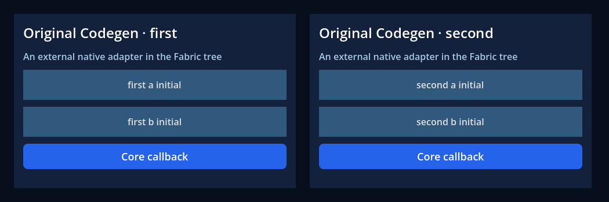
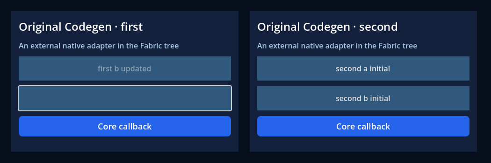

# Shutdown requested from native callbacks

On macOS arm64 Release, a real external Button's `resized` signal called
`FabricApplication.stop()` synchronously during a Fabric geometry update. The
preceding host freed the Control while its signal was still being emitted;
Godot reported that ownership error and the isolated process hung. That process
alone was terminated. [Provenance](provenance.json) identifies the preceding
implementation, baseline log digest, rebuilt extension sources and SDK/toolchain.
The official Godot executable was not rebuilt.

The host now records a stop request and rejects further event/command authority
immediately. Destruction waits for the outer Hermes/Fabric execution scope to
return. Cleanup still pumps original RN teardown work; queued ordinary timers
and subsequent RAF callbacks cannot resume user work during shutdown.

| Executed case | Result |
| --- | --- |
| Stop from resize inside committed layout | [8/8](reentrant-stop.json) |
| Stop from a focus signal in the first RAF | [9/9](reentrant-raf.json) |
| Stop from a focus signal in the first timer | [9/9](reentrant-timer.json) |
| Original external consumer regression | [35/35 headless](headless.json), [37/37 graphical](graphical.json) |

All three shutdown cases prove the Control survives the emitting stack, both
roots disappear, external views/providers and React effects dispose once, and
both external and core Button signals lose event authority after the request.
RAF/timer cases additionally prove their next scheduled callback never runs.
The runner rejects engine/script errors, hangs and missing/excess assertions.
[Runtime stages](runtime.json) retain hashes of executed logs and fixture inputs.

Native runtime/application/modules/services regressions passed 2/4/2/2. One
earlier local invocation ran two gates that both produce `build/app.js` in
parallel; it failed renderer bootstrap. That attempt is not successful evidence.
The four suites were rerun serially and passed. Keep bundle-producing gates
serial; independent consumer projects have separate output directories.

This proof does not cover independently destroying/unmounting a root during its
native update, an adapter violating Control ownership, arbitrary long-lived
async work, hardware input/IME, other platforms, or full RN/ABI certification.
GF-07/GF-26 remain In progress; no architectural decision is implicitly approved.

The [preceding hosted run](preceding-ci.json) passed contracts, original RN
iOS/Android references, the loader's 89 checks and registry's 207 checks, but
failed the traditional consumer's exact recovery bundle fingerprint assertion.
Its external runtime lane did not execute. This failure reproduced the earlier
local mismatch; the assertion stays unchanged, and CI now retains both bundle
files for diagnosis. It does not certify the shutdown implementation above.

Reproduce with the pinned private Node and verified native SDK:
`node scripts/adapter-runtime-check.mjs --sdk <SDK> --out build/<new-directory>
--capture`. This executes the regular consumer and all three shutdown modes.
