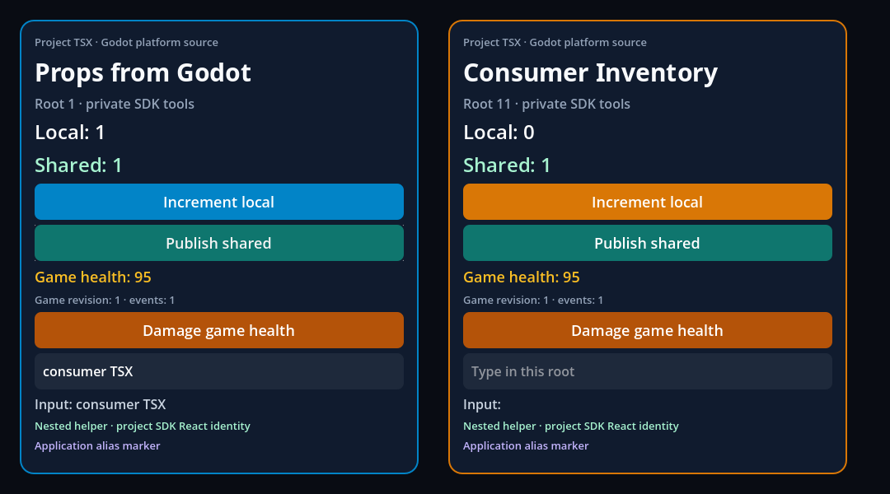
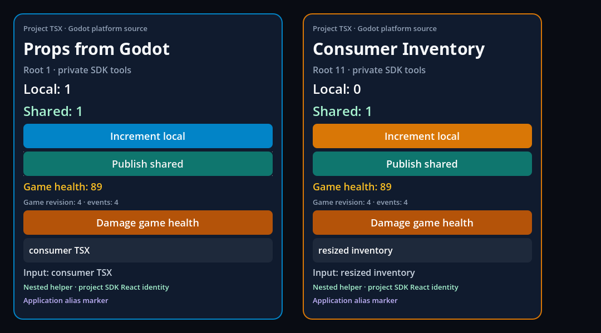

# Application aliases without changing package or SDK ownership

This GF-03/GF-28 follow-up removes the collision limitation in the
[preceding project-resolution slice](../project-resolution/README.md). A local
application alias can now have the same spelling as a library's nested
package or a private SDK dependency. The application, library and SDK each
retain their own implementation and types.

The original TypeScript CLI applies project `paths` to library declarations.
A reproduced `.d.ts` re-export therefore described the application helper even
while esbuild executed the library's nested helper. Separately, project paths
could redirect SDK source outside `node_modules`. Those are distinct causes;
esbuild did **not** redirect the nested library in that control.

The builder now uses the original TypeScript checker with module lookup scoped
to the importer's owner. Application aliases use original TypeScript resolution;
library and SDK imports omit application `paths`/`baseUrl`, retaining absolute
SDK type mappings and separate resolution caches. Packages still use original
esbuild lookup. The explicit effective `tsconfigRaw` preserves supported
transforms without applying application aliases globally. Parent and checker
worker compare the fingerprints of the configuration they actually parsed.
No package installation or project script executes during Play.

## Executed consumer and captures

The real packaged addon/editor ran on **macOS arm64 Release**, official
**Godot 4.7.2**, original **RN 0.87.1 / React 19.2.3 /
Hermes 250829098.0.17**, private **Node 22.23.3**, **TypeScript 6.0.3** and
**esbuild 0.25.12**. The previously verified native SDK was reused; Godot and
its export templates were not rebuilt. [Provenance](provenance.json) separates
native artifacts from the executed JavaScript source.

| Actual case | Evidence |
| --- | --- |
| Fresh consumer, offline rebuild, failure/recovery and project lockfile ownership | [30 tooling checks](consumer-tooling.json) |
| `consumer-helper` means app source in TSX and nested dependency in library `.d.ts`/JS | [40 native checks](consumer-alias-package-native.json), including distinct rendered markers and SDK React identity |
| Same app after state/prop updates and independent root resize | [43 graphical checks](consumer-alias-package-graphical.json) and actual Viewport captures below |
| Assigning the library marker to the application's distinct literal type | Original TS2322; previously valid bundle remains byte-identical |
| Existing original-Codegen component/module consumer | [35 headless / 37 graphical checks](adapter-runtime.json); generated props, events, commands and two roots still execute |
| Resize/RAF/timer reentrant shutdown | [8/9/9 checks](adapter-runtime.json) |
| Complete local contract gates | [199 Node / 13 Python](verification.json); zero failures/skips |
| Targeted resolver/Metro/transform/hooks and serial native regressions | [78 targeted / 10 native tests](verification.json) |



Both roots show the library's “Nested helper” marker and the application's
“Application alias marker”. Local state remains root-specific; shared state
and Godot services still update both roots. These are actual Godot captures of
generic fixtures. They do not certify physical input, mobile targets or exports.



Baseline and recovered consumer bundles retained the exact SHA-256
`942d8f60d5572c4e62b7e5b3020836515dc6cce2cc7179e71d9410091fc02219`.
The assertions compare actual bytes without normalization or retry.

## Supported profile and explicit gaps

This slice accepts `module: ESNext` or `Preserve` with
`moduleResolution: Bundler`, and the existing suffix profile
`[".godot", ".native", ""]`. `Preserve` fixtures prove distinct typed and
executed `import`/`import = require` branches. `NodeNext`, `Node16` and CJS emit
profiles fail with `E_PROJECT_MODULE_PROFILE`: their TypeScript mode can differ
from esbuild's syntax-based selection. Supporting them remains roadmap work.

Custom conditions are explicit in both checker and runtime; no Godot/RN
condition or priority is inserted implicitly. `types` cannot be a runtime
condition (`E_PROJECT_CONDITION_PROFILE`), and declarations cannot execute in
the runtime bundle. This prevents a reproduced side-effect import from silently
loading `.d.ts` instead of JavaScript. `emitDecoratorMetadata` is also rejected
visibly because this transform pipeline does not implement it.

Original Metro 0.87.1 is a pinned differential test oracle, with a declared
neutral `main` profile. The comparison checks conditional exports, author key
order, import/require branches and exact targets despite competing platform
files. It also retains **two actual differences**: Metro warns and falls back
to legacy `main` when an export target is missing; esbuild fails. Metro rejects
an external dependency target in `#imports`; esbuild resolves it through the
importing package. Neither difference is reported as parity. See
[Metro's package-exports contract](https://metrobundler.dev/docs/package-exports/)
and the executed matrix in [verification](verification.json).

The builder uses the public [esbuild tsconfigRaw API](https://esbuild.github.io/api/#tsconfig-raw)
and original [TypeScript path resolution](https://www.typescriptlang.org/tsconfig/paths.html).
The tests preserve the original timing-race negative control, both import
orders, strict:false, inherited JSX and class-field behavior under inherited
ES2019/ES2022/ESNext configurations. They compare executed values and bytes.

[Preceding hosted CI](preceding-ci.json) passed all five jobs at `f2eb57f`;
that run predates this implementation. Local evidence and newer hosted CI
remain separate. Full public types, assets, workspace/PnP layouts, arbitrary
compiler profiles, Metro compatibility, exported applications and all-target
SDK acceptance remain open. GF-03/GF-28 and D20 remain open; no checkpoint
closure or denominator change follows from these bounded fixtures.

```sh
node --test tests/project-resolution.test.mjs tests/package-conditions.test.mjs tests/bundle-determinism.test.mjs tests/platform-seams.test.mjs
npm run test:consumer -- --capture
node scripts/adapter-runtime-check.mjs --sdk <verified-SDK> --out build/<new-directory> --capture
npm run test:contracts
```
