# Frontier: a HUD guiada pelo contexto do jogo, a matriz dos sete contextos e o mapa

Esta fatia fecha os critérios `matriz` e `mapa` do V05-05 do marco 0.5, sobre o jogo, os serviços, o consumidor e a política de
props dos registros anteriores. A HUD de React Native deixa de ser o painel mínimo da fatia `consumidor` e passa a montar, para
cada um dos **sete contextos** que o Godot deriva do estado, exatamente os painéis que o contexto pede: a barra de turno e
recursos (com o End Turn desabilitado e um spinner enquanto a fase da IA roda), as ações da unidade com o motivo da ação
desabilitada, o cartão do tile (com o hover vindo do Godot), a tela da cidade, a pesquisa e o diálogo do evento. O mapa passa a
ser do mundo: um clique em um tile seleciona pelo `select_tile` do próprio jogo, e o ponteiro sobre o mapa é publicado como um
estado à parte, `frontier.hover`. Os critérios `overlays` e `estabilidade` do V05-05 ficam para a fatia 2: aqui o diálogo é um
painel posicionado, ainda não um `Modal` bloqueante (a fatia 2a, mais abaixo, torna a cidade e o diálogo `Modal`s e faz da fila de três
eventos uma regra do jogo). A [pesquisa](../../research/frontier-hud.md) tem a tabela, o store, o hover,
o caminho do input e a ordem do mundo, com arquivo e linha; o recibo [`report.json`](report.json) fixa as fontes, os relatórios e
os resultados.

Os fontes da fatia estão fixados no **commit de implementação
[`38d3182`](https://github.com/journey-studios/godot-fabric/commit/38d3182ec3ea1e81387910ed22ef732d38199c0d)**
(`38d3182ec3ea1e81387910ed22ef732d38199c0d`, árvore `3ad4d3b1a4d564610506857f97bc3fb4eab72d88`, sobre a main `5e1f6a1`, o PR #79,
que fez do fim do turno um job). Todos os comandos abaixo rodaram nessa árvore: o `git status --porcelain` antes do primeiro
comando listava só um arquivo novo de documentação (`docs/research/frontier-hud.md`), e depois do último, só os documentos
desta fatia; nenhum arquivo executado mudou, e cada SHA-256 do recibo bate com `git show 38d3182:<caminho>`. Os arquivos desta
evidência foram escritos depois e não são entrada de nenhuma lane. Ambiente: macOS arm64 (26.6.2), Godot oficial **4.7.2**
(`ed1daf0bf`), React Native **0.87.1** e React 19.2.3 com o Hermes da aplicação, Node **v22.23.3**, em modo headless e, para as
capturas, **janelado** na tela local. A fatia **não tem C++**: o host nativo é o do commit anterior
(`addons/fabric_godot.dylib`, SHA-256 `258d1821…084da`), o que o recibo registra.

Este registro tem **três partes**. A **fatia 1** (as seções até "Em aberto" abaixo) descreve `38d3182`; o PR #82 a levou para a `main` como
`622102e`, e a CI hospedada e o Pages desse commit têm recibos próprios, [`hosted-ci.json`](hosted-ci.json) e
[`publication.json`](publication.json), descritos em "CI hospedada e Pages". A **fatia 2a** é a fila de três eventos e os
overlays bloqueantes (critério `overlays`), em `12b6c83` sobre `622102e`: a seção "Fatia 2a" e o objeto `slice2a` do recibo; o PR #93 a levou para a `main`
como `e108e9d`, e os recibos hospedados dela estão em [`overlays/`](overlays/README.md). A **fatia 2b** é a estabilidade (critério `estabilidade`, o último do
item, com as capturas e os ícones), em `0a0deca` sobre `e108e9d`: a seção "Fatia 2b" no fim e o objeto `slice2b` do recibo. As oito capturas
abaixo foram regeneradas na fatia 2a com os mesmos nomes (o git guarda as de `096a018`); as sete da fatia 2b são as `stability-*.png`.

## As capturas

Oito capturas reais do renderizador, uma por contexto e uma durante a fase da IA, salvas pela corrida janelada
(`node tests/civ-lite-ui-native.test.mjs --capture`); cada uma foi lida antes de entrar aqui, e o SHA-256 de cada PNG está no
recibo. Os contextos são os dos passos do replay que os cobrem (a coluna da direita é o passo). Os PNGs da pasta são os **regenerados na
fatia 2a** (`12b6c83`): seis são idênticos byte a byte aos da fatia 1 (a diferença de hash está no bloco `slice2a` do recibo, que guarda os dois), e
`city` e `dialog`, que agora são `Modal`s, mudaram, e as linhas deles descrevem as imagens atuais; as de `096a018` seguem no histórico do git.

| Contexto (passo) | Captura | O que mostra |
| --- | --- | --- |
| `none` (33) |  | Só a barra: turno 3, fase `idle`, os três recursos com a taxa, End turn habilitado. A seleção foi limpa e nenhum outro painel existe. |
| `tile` (32) | 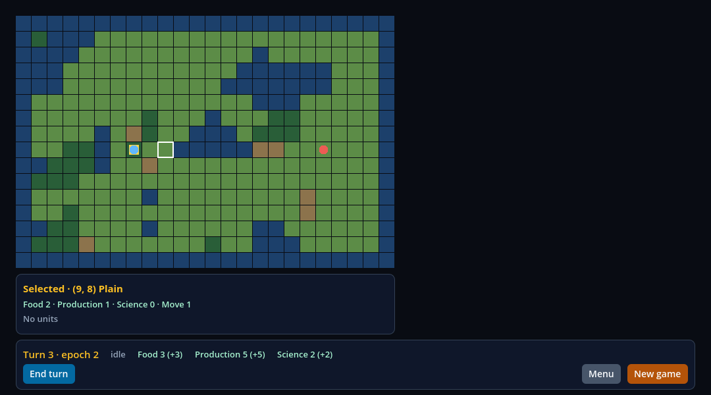 | A barra e o cartão do tile (9, 8), uma planície vazia, selecionado (contorno branco no mapa). Sem painel de ações: não há unidade. |
| `settler` (3) |  | Barra, ações e cartão. "Found city" habilitada, "Fortify" cinza com o motivo do jogo ("Settlers cannot fortify.") e "Clear selection"; o cartão lista as duas unidades do tile (6, 8). |
| `warrior` (9) | 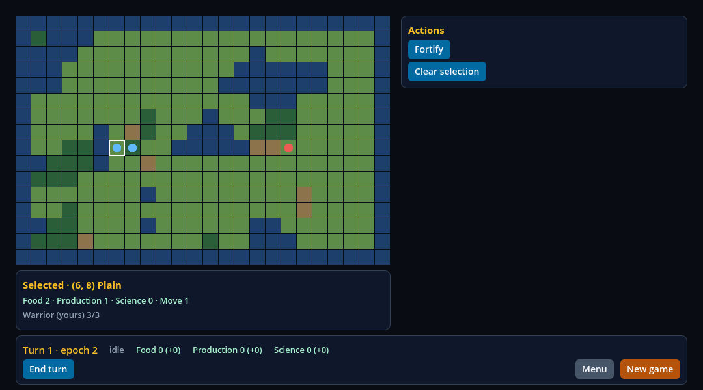 | Barra, ações e cartão do tile (6, 8), agora só com o Warrior. "Fortify" e "Clear selection". |
| `stack` (2) | 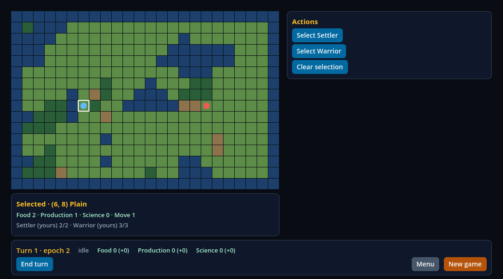 | Barra, ações com um `select_unit` por unidade ("Select Settler", "Select Warrior") e "Clear selection", e o cartão do tile com as duas unidades. |
| `city` (18) | 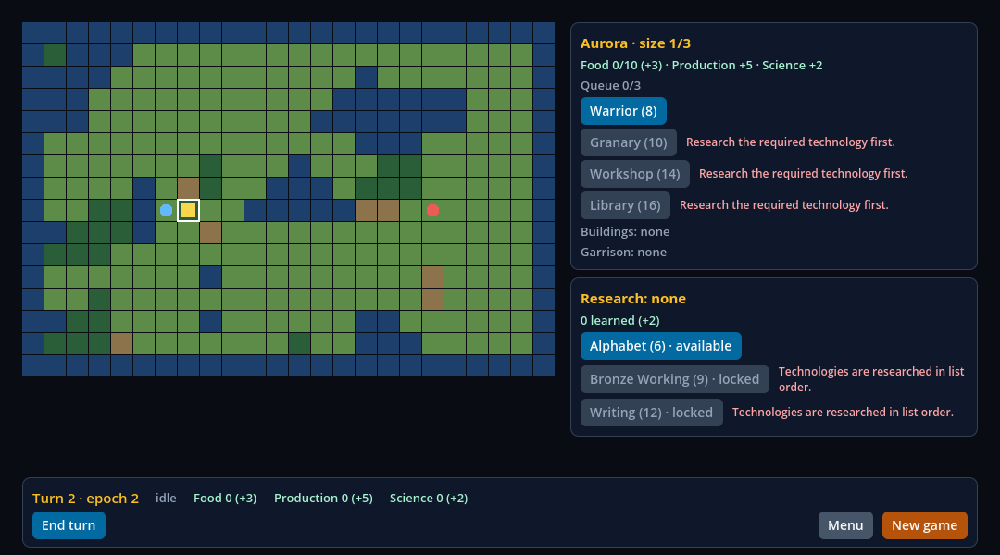 | A tela da cidade e a pesquisa como **overlay** (um `Modal`), com o mapa e a barra escurecidos atrás: Aurora, tamanho 1/3, "Queue 0/3", o Warrior oferecido e os outros três itens cinza com "Research the required technology first.", o botão Close, e a pesquisa (Alphabet disponível; as outras com "Technologies are researched in list order."). |
| `dialog` (45) | 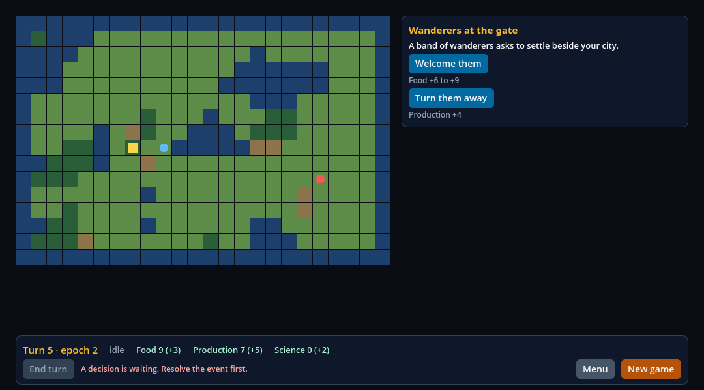 | O diálogo "Wanderers at the gate", "1 of 3", com as duas escolhas e o detalhe de cada, centralizado num `Modal` sobre o mapa escurecido. End turn cinza, com "A decision is waiting. Resolve the event first." ao lado. |
| fase da IA | 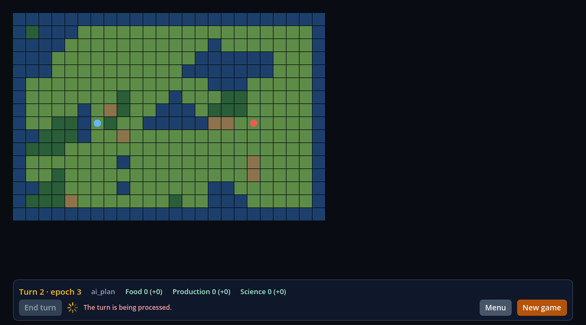 | A barra no meio do turno: a fase `ai_plan`, o spinner girando, End turn cinza com "The turn is being processed." A coluna da direita e o cartão não existem: o contexto é `none`. |

## A tabela contexto → painéis

A tabela de `docs/research/frontier-game.md` ("The seven contexts"), que a fatia anterior deixou para a HUD confirmar, foi
confirmada sem mudança e é a que a HUD implementa ([`hud.tsx:29-44`](https://github.com/journey-studios/godot-fabric/blob/38d3182ec3ea1e81387910ed22ef732d38199c0d/consumers/civ-lite/ui/hud/hud.tsx#L29-L44)):

| Contexto | Painéis (testIDs) |
| --- | --- |
| `none` | `hud-bar` |
| `tile` | `hud-bar`, `hud-tile` |
| `settler`, `warrior` | `hud-bar`, `hud-actions`, `hud-tile` |
| `stack` | `hud-bar`, `hud-actions` (um `select_unit` por unidade), `hud-tile` |
| `city` | `hud-bar`, `hud-city`, `hud-research` |
| `dialog` | `hud-bar`, `hud-dialog` |

Só o contexto decide: nenhum painel olha se a cidade ou o diálogo têm dados, porque o snapshot carrega `city` e `research` em
todos os contextos depois que a cidade existe. Cada painel é uma caixa posicionada, e a raiz e a coluna da direita são
`pointerEvents="box-none"`: nenhum spacer nem View de layout reivindica a área do mapa.

## O que mudou

- **Um store no escopo do módulo** ([`ui/store.ts`](https://github.com/journey-studios/godot-fabric/blob/38d3182ec3ea1e81387910ed22ef732d38199c0d/consumers/civ-lite/ui/store.ts)):
  o único módulo que fala com o jogo. A HUD lê pelo `useFrontier()`, que é `useSyncExternalStore`; as conexões a `frontier.snapshot` e
  a `frontier.hover` seguem os leitores (o primeiro conecta, o último solta, e o menu, que não lê nada, segura zero conexões),
  e as intenções saem por `send(...)`, tipado sobre `callFrontier`, e por `sendAction(ação)`. Nenhum painel assina, chama um
  serviço, ou tem efeito, ref de evento ou `addEventListener`: a lane varre os fontes e confere.
- **A telemetria da validação é um módulo à parte** ([`ui/telemetry.ts`](https://github.com/journey-studios/godot-fabric/blob/38d3182ec3ea1e81387910ed22ef732d38199c0d/consumers/civ-lite/ui/telemetry.ts)):
  o store só diz a ela o que recebeu e enviou, e ela instala o `FrontierHud` que a validação lê. Uma cópia da HUD a apaga com um import.
- **A barra** ([`bar.tsx`](https://github.com/journey-studios/godot-fabric/blob/38d3182ec3ea1e81387910ed22ef732d38199c0d/consumers/civ-lite/ui/hud/bar.tsx)):
  turno, fase, recursos `estoque (+taxa)`, End turn, spinner e Menu/New game. End turn é a ação `end_turn` do snapshot: está
  desabilitado exatamente quando o jogo diz, com o `reason_text` do jogo ao lado, e não por uma segunda regra da HUD na fase. O
  spinner (`hud-turn-spinner`) existe exatamente enquanto `phase != "idle"`.
- **O serviço `frontier.hover`**: um segundo estado, registrado ao lado do snapshot, com o mesmo DTO do cartão do tile
  selecionado (`present` 0 quando o ponteiro não está sobre um tile). O snapshot, a regra de emissão dele e os hashes golden e
  trace não mudaram. O registro passa de 14 para **15 bindings** (dois estados, um sinal, os mesmos 12 métodos); a paridade
  Godot/TypeScript segue verde nos dois sentidos, com duas mutações novas.
- **O input do mapa é do Godot** ([`world.gd`](https://github.com/journey-studios/godot-fabric/blob/38d3182ec3ea1e81387910ed22ef732d38199c0d/consumers/civ-lite/world/world.gd)):
  o mundo ouve em `_unhandled_input`, como a política do P1 prevê, um clique esquerdo em um tile chama `select_tile` pelo nó
  `GameServices` (Godot para Godot, as regras ficam em GDScript) e o movimento do mouse publica o hover. O hover sai quando o
  ponteiro vai para um painel ou para fora da janela. Sem hover de `Pressable` (`onHoverIn` segue recusado) e sem clique direito.
- **A ordem do mundo na árvore**: o `GameServices` agora devolve o mundo antes do `CanvasLayer` da HUD quando o traz de volta
  depois do menu (ver os achados).

## O que foi executado

| Lane | Resultado | Tempo |
| --- | --- | ---: |
| `node tests/civ-lite-ui-native.test.mjs --control --capture` (a lane `test:civ-lite-ui`, com o controle e as capturas) | **143 checks** da probe headless (151 na corrida janelada), oráculo com 0 achados, 23 mutações do oráculo rejeitadas, controle falha em 5 categorias | 95 s |
| `node scripts/civ-lite-ui-sabotage.mjs` | **8 de 8** sabotagens rejeitadas pela probe e pelo oráculo; fontes restauradas byte a byte; a lane restaurada passa | 348 s |
| `npm run test:consumer:civ-lite` | 20 checks de build e posse, **165 nativos**, dez ciclos (as mesmas medidas, com 15 bindings e as duas conexões da HUD) | 30 s |
| `node scripts/consumer-civ-lite-sabotage.mjs` | **5 de 5** rejeitadas (39, 19, 21, 3 e 10 falhas); restaurada; o template restaurado passa | 198 s |
| `npm run test:frontier-services` | **11/11** (a probe com o oráculo e a paridade, agora com 15 registros) | 28 s |
| `npm run test:civ-lite-game` | passou, os mesmos hashes golden e trace | 1 s |

Os gates que leem documentos (`check:publication`, `check:static`, `test:dashboard`, `test:contracts`) rodaram depois, na árvore
que tem estes registros; o recibo guarda o resultado. As onze sabotagens dos serviços rodaram na revisão da fatia, sobre os
mesmos `game_services.gd` e `schema.gd`, e não foram repetidas neste lote.

```sh
npm run test:civ-lite-ui                                      # a lane, headless, com o controle quando o commit existe no checkout
node tests/civ-lite-ui-native.test.mjs --control --capture    # o controle é obrigatório; mais as oito capturas, janeladas
node scripts/civ-lite-ui-sabotage.mjs                         # as oito sabotagens e, no fim, a lane restaurada
npm run test:consumer:civ-lite                                # o consumidor provisionado, sob a nova HUD
node scripts/consumer-civ-lite-sabotage.mjs
npm run test:frontier-services                                # os 15 bindings e a paridade do hover
```

## Como a lane julga

A fatia provisiona o template `consumers/civ-lite/` pelo addon em um projeto fora do checkout, constrói no editor sem Node próprio e
roda, no Godot oficial, a probe [`hud_validation.gd`](https://github.com/journey-studios/godot-fabric/blob/38d3182ec3ea1e81387910ed22ef732d38199c0d/consumers/civ-lite/hud_validation.gd)
(`-- --validate-hud`), que escreve **observações cruas** (a árvore da HUD como o host a reporta: testID, texto, posição, se o Control
bloqueia o ponteiro, se o Pressable está desabilitado). O [oráculo](https://github.com/journey-studios/godot-fabric/blob/38d3182ec3ea1e81387910ed22ef732d38199c0d/tests/civ-lite-ui-oracle.mjs)
foi escrito à parte e julga essas observações de novo, a partir da tabela acima, do formato do que cada painel diz e da geometria
do mapa, sem ler os veredictos da probe.

- **Matriz.** Os passos 0 a 45 do replay (46 passos) passam pelos serviços em um jogo novo; os sete passos que cobrem os contextos
  são o 2 (`stack`), 3 (`settler`), 9 (`warrior`), 18 (`city`), 32 (`tile`), 33 (`none`) e 45 (`dialog`). Em cada passo: o conjunto
  exato de testIDs de painel visíveis é o da tabela, nenhum testID fora dos seis painéis, da raiz e do spinner está montado, a lista
  do painel de ações é a de `snapshot.actions` menos `end_turn` (id, rótulo, habilitada, motivo e ordem), a barra e os cartões dizem o
  que o snapshot diz, e nenhum Control que bloqueia o ponteiro cobre um tile do mapa.
- **A fase da IA.** Um End Turn real na HUD roda o job e **cada quadro** é observado: o spinner e o botão desabilitado têm de
  concordar com a fase, e só fases que o jogo publicou podem aparecer (15 quadros observados e 7 snapshots publicados na
  corrida; a invariante é por snapshot, e nenhuma contagem depende do ritmo do runner). Depois um segundo job é **segurado** na
  primeira fase (o `_process` do nó desligado antes do clique): o spinner gira, End turn está desabilitado com o motivo do jogo
  e um toque nele não faz nenhuma chamada. Liberado, o turno acaba, o spinner some e End turn volta.
- **Input real.** Eventos empurrados pelo viewport com o dispositivo de validação da Surface: um clique em (6, 8) e em (9, 8)
  seleciona o tile que a geometria dá; o ponteiro sobre (12, 4) publica o hover e o cartão o mostra, sem mover a seleção; sobre a
  barra e fora do mapa o hover some; um clique e um giro da roda sobre um painel não chegam ao mundo; um toque real em "Select
  Warrior" e em "Fortify" executa a ação; um toque no "Fortify" desabilitado não faz chamada e a HUD mostra o motivo ("The unit is
  already fortified."); e tudo de novo depois do menu e de um New game.

## O controle causal

Para provar que a lane mede a HUD e não o acaso, a **mesma lane** roda sobre a HUD de `5e1f6a1`: o `ui/index.tsx` anterior, tirado
do git (`git show 5e1f6a1:consumers/civ-lite/ui/index.tsx`, SHA-256 `d477f51c…9a09346`, conferido), na mesma cena e com o mesmo host.
Ele **falha em cinco categorias do oráculo**: `panels` (578 achados), `phase` (374), `content` (86), `actions` (25) e `input` (16),
e 135 checks da probe. Nos sete passos de cobertura ele não mostra nenhum painel dos seis; o End turn e o spinner da fase da
IA não existem; o hover chega ao Godot mas nenhum cartão o mostra. O controle depende do commit `5e1f6a1` estar no checkout: um clone
raso (a CI hospedada) o pula e diz isso, e `--control` torna a ausência um erro.

## As sabotagens

Oito sabotagens retidas quebram um fonte do template de propósito, rodam a lane contra ele e exigem que a probe **e** o oráculo a
rejeitem, pela razão por que foi quebrada ([`scripts/civ-lite-ui-sabotage.mjs`](https://github.com/journey-studios/godot-fabric/blob/38d3182ec3ea1e81387910ed22ef732d38199c0d/scripts/civ-lite-ui-sabotage.mjs)):

| Sabotagem | O que quebra | Checks da probe que falham | Categorias do oráculo |
| --- | --- | ---: | --- |
| `city-by-data` | a tela da cidade é gateada por `city.present` e não pelo contexto | 17 | `panels` |
| `actions-reversed` | o painel de ações lista as ações na ordem oposta | 26 | `actions`, `panels` |
| `spinner-always` | o spinner não é amarrado à fase: gira em repouso | 49 | `bar`, `phase` |
| `end-turn-by-phase` | End turn habilitado por uma regra da HUD (`phase === "idle"`), não pela ação `end_turn` | 2 | `bar` |
| `spacer` | um spacer de altura cheia, com testID, cobre o mapa | 12 | `input`, `map`, `panels` |
| `hover-unpublished` | o mundo deixa de dizer ao nó qual tile está sob o ponteiro | 2 | `input` |
| `world-behind-hud` | o mundo volta depois do menu atrás da camada da HUD | 2 | `input` |
| `disabled-ignored` | o botão deixa de passar o `enabled` do jogo ao Pressable | 18 | `actions`, `bar`, `content`, `input`, `panels`, `phase` |

O oráculo também rejeita, em memória, 23 cópias do relatório genuíno com uma coisa quebrada cada (um painel a menos, um a mais, um
testID sem dono, ações em outra ordem, uma ação desabilitada mostrada habilitada, um motivo que não é o do jogo, o spinner em
repouso, o End turn habilitado contra o jogo, um recurso errado, um Control sobre o mapa, o cartão de outro tile, uma escolha do
diálogo que não é a do jogo, um quadro do job incoerente, o toque no End turn desabilitado que chega ao jogo, nenhuma fase da IA
publicada, um clique que seleciona outro tile, um hover que não é o do ponteiro, um clique ou um giro da roda que chega ao
mundo, o mesmo cartão de hover duas vezes, um motivo que a barra esqueceu, um toque desabilitado que chega ao jogo e o mundo atrás
da camada da HUD), cada uma na categoria que quebra. As cinco sabotagens do consumidor seguem rejeitadas, com a `hud-leak` agora
sobre o `disconnect()` do store.

## O que a lane achou

- **O spacer da HUD anterior nunca engoliu um clique.** O `View` de 624 px do `ui/index.tsx` de `5e1f6a1`, sem testID e sem nada
  que pinte, é **achatado pelo Fabric**: nunca vira um Control e não reivindica nada. No controle, o clique real em (6, 8) seleciona
  o tile. O controle falha porque não há barra, painéis nem cartão, não por causa do spacer. A sabotagem `spacer` usa um spacer com
  testID, que não é achatado, e é rejeitada.
- **O mundo voltava depois da HUD.** O `GameServices` derruba o mundo no menu e traz um novo no New game, e o `add_child` o
  punha **por último**, atrás da `HUDLayer`. O Godot chama `_unhandled_input` na ordem inversa da árvore, então o mundo ouvia antes da
  Surface poder reivindicar. Um clique em um painel continua não chegando ao mundo (o Control do painel o bloqueia na GUI antes do
  estágio sem tratamento, qualquer que seja a ordem), mas **a roda do mouse sobre um painel** passa pela GUI e dependia da ordem.
  Hoje o mundo volta antes do primeiro `CanvasLayer`, e a probe prova com um giro da roda sobre cada painel, antes e depois do menu.
- **Uma janela headless tem 64×64**, o que quer que `window/size` diga, e a HUD, desenhada para 1080×600, saía errada. A probe ajusta
  o tamanho da janela raiz, como as probes de ponteiro do laboratório.
- **O nome do critério não existe.** O critério diz que a lista exibida é idêntica a `unit.available_actions`; o campo do DTO é
  `snapshot.actions`. O oráculo compara com `snapshot.actions` menos `end_turn`.
- **`end_turn` fica na barra.** O snapshot o lista entre as ações, e a HUD o põe na barra, com a mesma regra: habilitado quando a
  ação diz, com o motivo dela quando não.

## Imports de React Native

A HUD importa de `react-native`: `AppRegistry` (o membro `registerComponent`), `View`, `Text`, `Pressable` e `ActivityIndicator`;
de `react`, `useSyncExternalStore`; e de `@godot-fabric/runtime`, `GodotFabric.connect` e `GodotFabric.call` (só no `store.ts`).
As props usadas são `testID`, `style`, `pointerEvents="box-none"`, `key`, `disabled`, `onPress` e, no `ActivityIndicator`, `size`
e `color`. Nenhum `onHoverIn`, clique direito ou `ScrollView`; em `38d3182` também nenhum `Modal`, que a fatia 2a passa a importar (só em
`ui/hud/overlay.tsx`), com as props `testID`, `visible`, `transparent`, `animationType="none"`, `presentationStyle="overFullScreen"` e
`onRequestClose`: o manifesto suporta quatro delas e aceita exatamente esses dois valores nas que recusa por outros (`animationType` aceita `none`;
`presentationStyle` aceita `overFullScreen` e `fullScreen`). O manifesto do escopo do 0.5 decide todos esses nomes
menos o `AppRegistry`, que não é um dos doze: a cobertura dele no manifesto vem pelo PR do P9, que mexe nessa seção.

## Limites

- **O diálogo ainda não era um `Modal`** em `38d3182`. Ele aparecia no seu contexto como painel posicionado; o bloqueio, a fila de três
  eventos, a ordem da remontagem e o resto de `overlays` são a fatia 2a, descrita abaixo.
- **O hover foi exercitado com eventos sintéticos** empurrados pelo viewport (dispositivo 1001, o de validação da Surface), nos
  dois modos, e na corrida janelada que salva as capturas; não com um mouse físico, e não com toque.
- **A CI hospedada roda só o headless.** O passo `npm run test:civ-lite-ui` do `native-cold-start` não salva capturas; elas são uma
  corrida local, janelada. O run hospedado e o Pages do squash `622102e` estão registrados em "CI hospedada e Pages".
- **O controle precisa do commit `5e1f6a1` no checkout**, e um clone raso o pula.
- **Só macOS arm64.** Nada foi comparado com um iPhone, e digitação, hover público no `Pressable` e clique direito seguem fora do 0.5.
- Nenhum checkpoint, peso ou denominador do 1.0 se move; o dashboard não é editado por este registro.

## Em aberto depois da fatia 1: a fatia 2 do V05-05 (a 2a, abaixo, trata dos overlays)

- Os overlays como `Modal`s bloqueantes: o diálogo, a fila de três eventos e a ordem da remontagem.
- A estabilidade: vinte aberturas e fechamentos sem vazar, a restauração do foco, 0 de 100 cliques sob um overlay aberto, as capturas
  por contexto na forma final, o escaneamento da API e os ícones por `Image`.
- A cobertura do `AppRegistry` no manifesto do 0.5, pelo PR do P9.

## CI hospedada e Pages

O push da `main` em `622102e` (o squash do #82, run
[37891490943](https://github.com/journey-studios/godot-fabric/actions/runs/37891490943) do workflow Contracts) passou nos cinco jobs na
primeira tentativa, sem reexecução: `contracts` (2 min), `reference-android` (6 min), `reference-ios` (6 min), `native-cold-start` (65 min) e
`parity-comparison` (23 s). O [recibo](hosted-ci.json), escrito por `scripts/hosted-receipts.mjs` a partir da API do GitHub, dos logs e dos artefatos
baixados e conferido sem rede pelo `--check` do mesmo script, registra o run, o PR e os artefatos:

- **O checkout.** Todos os jobs usaram `622102e`, e a árvore do head do PR (`a5bf38e`, 6 commits) é a árvore do squash.
- **Os passos da fatia.** `npm run test:civ-lite-ui` (passo 130, 53 s) passou o seu teste e imprime `CIVLITE_UI_LANE_PASSED: 143 probe checks; 23 oracle
  mutations; control not run`: o controle sobre `5e1f6a1` foi pulado porque o clone é raso, e a lane diz isso. `npm run test:consumer:civ-lite` (passo 129,
  66 s) imprime `CONSUMER_CHECK_PASSED: civ-lite: 20 build/ownership checks; 165 native checks; 10 cycles`. O job `contracts` passou `npm run test:contracts`
  (7, 43 e 352 testes de Node e 13 de Python), `check:static` e `check:publication`. O `report.json` guarda 334 na execução local de `38d3182`: o #77
  acrescentou ao `test:contracts`, antes do squash, `tests/frontier-baseline-graphics.test.mjs` e `tests/frontier-baseline-heap.test.mjs` (8 e 10 testes).
- **Os artefatos.** `civ-lite-ui` (id 11601295686, 24.448 bytes, SHA-256 `050ae9fc…`) tem 5 arquivos, e o `headless.json` dele tem o SHA-256 `529c6e21…`, o mesmo do
  relatório local que o [`report.json`](report.json) registra em `reports.headless`: o relatório hospedado é, byte a byte, o local. `independent-civ-lite-consumer`
  (id 11601525058, 270.220 bytes, SHA-256 `106fddca…`) tem 10 arquivos. Cada zip é igual ao digest da API e ao do log de upload, e o recibo fixa o SHA-256 de
  cada arquivo. Os logs dos artefatos imprimem `CIVLITE_UI_PASSED`, `CIVLITE_VALIDATION_PASSED` e `CONSUMER_EDITOR_BUILD_PASSED`.

O [Pages](publication.json) rodou sobre o mesmo squash (run 37891490845, 06:02:37 a 06:03:55Z, `build` e `deploy` em success, 43 testes do painel). O
deployment 6954138547 está em success, o artefato `github-pages` (id 11598259138, SHA-256 `a9f82641…`) tem 15 arquivos, e o `migration.json` de dentro tem os
mesmos bytes do `dashboard/migration.json` do squash (SHA-256 `a43c1452…`) e a entrada de atividade `milestone-0-5-v05-05-matriz-mapa-096a018`. Um push
seguinte da `main` substitui o deployment, então o site público não foi comparado.

Continua só local: as capturas e a execução janelada, o controle sobre `5e1f6a1` e as oito sabotagens da fatia 1 (as doze, com a fatia 2a). O recibo é do
squash `622102e`, e a fatia 2a não está nele.

## Fatia 2a: a fila de três eventos e os overlays bloqueantes (critério `overlays`)

Esta parte do registro cobre o critério `overlays` do V05-05: os overlays como `Modal`s bloqueantes, a fila de três eventos e a ordem da
remontagem. Ela roda sobre a `main` em `622102e` (o squash da fatia 1, o PR #82). Os fontes são os de dois commits,
[`12b6c83`](https://github.com/journey-studios/godot-fabric/commit/12b6c83669ee6fe07a6318329dea7430cb98e7d9) (a fila e os overlays) e
[`8ba2a35`](https://github.com/journey-studios/godot-fabric/commit/8ba2a35) (os nomes de check sem contagem de ritmo), mais o ajuste do oráculo do soak em
[`1810828`](https://github.com/journey-studios/godot-fabric/commit/181082868e8374cd83d0cd51d795e6900953fc4f), e os SHA-256 do recibo [`report.json`](report.json) (bloco
`slice2a`) são os dos arquivos em **`1810828`** (`181082868e8374cd83d0cd51d795e6900953fc4f`, árvore `6e2f5fdbf6d782460d17563b5df4035e4a24a811`): o merge da `main` em
`8b7a5e6` (os PRs #83 a #85) no branch, [`b3d835e`](https://github.com/journey-studios/godot-fabric/commit/b3d835e62b609f746d78317bea850cf45779f141), que não mexeu em
`native/` nem em `consumers/civ-lite/`, mais o oráculo do soak. O lote rodou sobre essa árvore antes de ela ser commitada: o `git status --porcelain` antes e depois
listava um só arquivo modificado, `tests/frontier-soak-oracle.mjs` (o oráculo do soak, ajustado à fila de três eventos: ver "O merge da `main` e o soak"), que
entrou em `1810828` com os mesmos bytes; todos os comandos abaixo rodaram nela, e cada SHA-256 de fonte do recibo bate com `git show 1810828:<caminho>` (os documentos
editados depois estão listados em `documentsEditedAfterTheCommit`); os documentos deste registro foram escritos depois e não são entrada de nenhuma lane. O ambiente é
o da fatia 1 (macOS arm64 26.6.2, Godot oficial **4.7.2**, React Native **0.87.1**, Node **v22.23.3**, headless e, para as capturas, janelado) e o host nativo é o mesmo
(`258d1821…084da`): a fatia não tem C++. Nenhum `done` de critério é mexido por este registro.

### A decisão do usuário: a fila é do jogo

Em 2026-10-09 o usuário decidiu que a fila de três eventos é **real no jogo**, não uma lista do lado da HUD. O teto do jogo no
`ROADMAP.md` passou de "um evento bloqueante" para "uma fila de três eventos bloqueantes, cada um um diálogo respondido em ordem", e a
especificação está em [`docs/research/frontier-game.md`](../../research/frontier-game.md). A tabela de eventos (`Rules.EVENTS`):

| # | Evento | Título | Escolhas (efeito) |
| ---: | --- | --- | --- |
| 1 | `wanderers` | Wanderers at the gate | `welcome`: comida +6 mais um sorteio de 4 do PRNG do jogo (+6 a +9); `turn_away`: produção +4 |
| 2 | `traders` | Traders at the crossroads | `buy_grain`: comida +3; `buy_tools`: produção +3 |
| 3 | `scholar` | A scholar asks for shelter | `host`: ciência +3; `send_on`: comida +2 |

- **A fila.** O estado `event` virou `events`: `queue` (os ids levantados e ainda não respondidos, a cabeça primeiro) e `resolved`
  (`{id, choice}`, na ordem das respostas). Os três são levantados juntos, na ordem da tabela, quando o turno 5 começa, uma só vez. O contexto
  é `dialog` enquanto a fila não está vazia.
- **Responder.** `resolve_event` responde só à cabeça e só com uma escolha **dela**: a escolha de outro evento é `unknown_choice`, com a fila
  vazia é `no_event`, e qualquer outra intenção com um evento esperando é `event_pending`. Os efeitos vêm dos dados da tabela, não de um
  caso especial, e só `welcome` sorteia do PRNG: os 385 sorteios (384 do mapa e 1 do presente) são os de antes.
- **O snapshot.** O `dialog` lê a cabeça pela tabela e ganha `index` (1-based) e `count`: "1 of 3", "2 of 3" e "3 of 3". Fechado, os dois são 0.
- **O replay.** Doze turnos e **77 passos** (45 aceitos e 32 recusados de propósito), onde eram 73 (43 e 30): os passos 0 a 45, os que a HUD
  atravessa, não mudaram, e no turno 5 os dois passos da resposta única viraram seis (uma escolha do evento seguinte recusada com
  `unknown_choice`, as três respostas em ordem, com o contexto em `dialog` até a terceira, e uma resposta com a fila vazia, `no_event`).
- **Os hashes mudam, e por isso foram recalculados.** O formato do estado e o roteiro do turno 5 mudaram, então o **hash golden** passou de
  `275b7c61…` para `cb7ab974f47f18c37ae96bda57ffd1b87f8c3733e251a386040dc17ccb540e8d` e o **hash de trilha** de `fba99004…` para
  `ed43495ec48d896c0eb0c4f9a7b97471be86f37082218d16a8411d0f3766275e`. A derivação não é a do próprio jogo: o oráculo independente
  (`tests/civ-lite-game-oracle.mjs`, escrito à parte em Node com o PCG32 em `BigInt` e a mesma tabela) recalcula o estado depois de cada um
  dos 77 passos e **concordou com o jogo em todos** antes de os dois hashes serem fixados em `tests/civ-lite-game-native.test.mjs`; o hash
  golden é idêntico nos três processos da lane. Os registros históricos (`frontier-game`, `frontier-services`, `frontier-authority`)
  seguem descrevendo as execuções que tiveram os hashes antigos.

### Os overlays

A tela da cidade com a pesquisa e o diálogo do evento são agora **`Modal`s bloqueantes** (`ui/hud/overlay.tsx`): o host abre um `Modal`
como uma janela própria sobre a Surface da HUD, exclusiva enquanto está no topo, com o fundo transparente e escurecido
(`rgba(2, 6, 23, 0.62)`) que cobre a janela inteira, de modo que o jogo continua visível, escurecido, atrás. A barra, as ações e o cartão do
tile seguem como caixas posicionadas na árvore. O que os painéis montam continua decidido só pelo contexto (`panelsOf`):

| Overlay | testID | Contexto | O que contém | Escape (`onRequestClose`) |
| --- | --- | --- | --- | --- |
| Cidade | `hud-city-overlay` | `city` | a tela da cidade e a pesquisa, na coluna da direita | fecha: é o `clear_selection` do jogo, o mesmo do botão Close |
| Diálogo | `hud-dialog-overlay` | `dialog` | o diálogo da cabeça da fila, centralizado, com "n of 3" | não faz nada: o evento tem de ser respondido |

O diálogo é montado com `key={snapshot.dialog.id}`: cada evento da fila é uma subárvore nova, e nada de um vaza para o seguinte.

**Bloqueio, medido com 100 de cada.** O probe de overlays empurra pelo viewport eventos reais sobre o mapa (um movimento mais o aperto e a
soltura do botão, em 100 tiles diferentes, antes de passar um quadro) e conta o que o próprio World ouviu e quantas vezes o jogo recebeu
`select_tile`:

| Medida | Esquerdo | Direito | Roda |
| --- | ---: | ---: | ---: |
| Com a tela da cidade **aberta**: chegam ao World | **0** de 100 | **0** de 100 | **0** de 100 |
| Com a tela da cidade **fechada** (pelo botão Close, um toque real): chegam | **100** de 100 (e 100 `select_tile`) | 100 de 100 | 100 de 100 |
| Com o diálogo **aberto**: chegam | **0** de 100 | **0** de 100 | **0** de 100 |
| Com a fila **respondida** (três toques reais): chegam | **100** de 100 (e 100 `select_tile`) | 100 de 100 | 100 de 100 |

"Chegam" quer dizer que o World ouviu os dois eventos de botão de cada clique; "0" quer dizer que o contador do World, o número de chamadas ao
jogo e a seleção ficaram exatamente onde estavam. Sob o overlay, os `Pressable` dele funcionam: um toque no Warrior da cidade pôs o item na
fila (uma chamada), e os três eventos foram respondidos por toques reais.

**A fila, por toques reais.** Do passo 44 do replay (o turno 5 começa e o jogo levanta os três) o probe responde três vezes, com
`welcome`, `buy_tools` e `send_on`: o jogo contou 1 of 3, 2 of 3 e 3 of 3, a HUD mostrou a posição que o jogo deu, o diálogo estava na janela
do `Modal` com o título, o texto e as escolhas da cabeça, cada toque respondeu a cabeça uma vez, e depois da terceira a fila ficou vazia, o
contexto saiu de `dialog` e o `Modal` sumiu. Com um evento esperando, toda outra intenção é `event_pending`, a escolha de outro evento ou de
nenhum é `unknown_choice`, e nada muda. Entre duas cabeças a HUD mostrou o evento velho ou o próximo e nunca outro, e o `Control` do
diálogo era um novo a cada evento (a chave faz isso; a sabotagem `dialog-unkeyed` o prova).

**A remontagem.** Com o segundo evento na cabeça, a Surface foi desmontada (a HUD saiu da árvore) e montada de novo: o jogo manteve a fila
entre as duas coisas, e o **primeiro quadro** da HUD nova já mostrava "2 of 3" no `Modal`, sem nenhum quadro com outro evento (a invariante é por
quadro; o número de quadros observados, 5 na corrida, depende do ritmo da máquina e não é afirmado). A fila seguiu depois, por toques reais, até o
fim; a tela da cidade também volta, depois de uma remontagem, como overlay.

**Uma sessão nova.** Um New game com o segundo evento na cabeça (um respondido e dois esperando) começa uma sessão **sem fila, sem diálogo e
sem `Modal`** até o seu próprio turno 5, quando ela levanta os seus três eventos e a HUD mostra o primeiro, "1 of 3".

**Como a probe lê um `Modal`.** Os `Control`s de um `Modal` são filhos da janela própria dele, e `hud.find_child` não os alcança; a probe lê a
HUD pelo snapshot do host (`hud.call("snapshot")`) e resolve cada nó com `instance_from_id`, guardando se o `Control` está numa janela que não é a raiz
(`consumers/civ-lite/hud_probe.gd`, `observe`, `control_of`). O oráculo da matriz passou a exigir que o que a tabela diz estar no overlay esteja
na janela do `Modal`, e que o `Modal` cubra o mapa inteiro nos passos da cidade e do diálogo e em nenhum outro.

### As capturas da fatia 2a

Quatro capturas novas do renderizador, salvas pela corrida janelada (`node tests/civ-lite-ui-native.test.mjs --control --capture`) e lidas antes de
entrar aqui; o SHA-256 de cada PNG está no recibo. As oito da fatia 1 foram regeneradas nesta corrida com os mesmos nomes (seis saíram idênticas
byte a byte às de `096a018`, porque nesses contextos não há overlay; `city` e `dialog` mudaram e estão descritas na tabela da fatia 1).

| Captura | Imagem | O que mostra |
| --- | --- | --- |
| cidade como overlay | 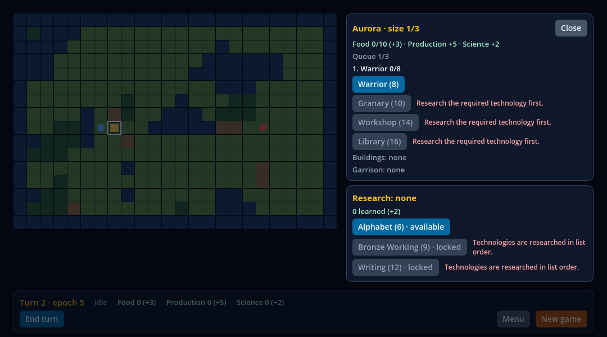 | O turno 2 depois do `found_city` e de um item posto na fila: "Queue 1/3" com "1. Warrior 0/8", o Warrior ainda oferecido, os outros três itens cinza com "Research the required technology first." e a pesquisa ao lado. O mapa e a barra, atrás, aparecem **escurecidos** pelo fundo do `Modal`. |
| diálogo, 1 de 3 | 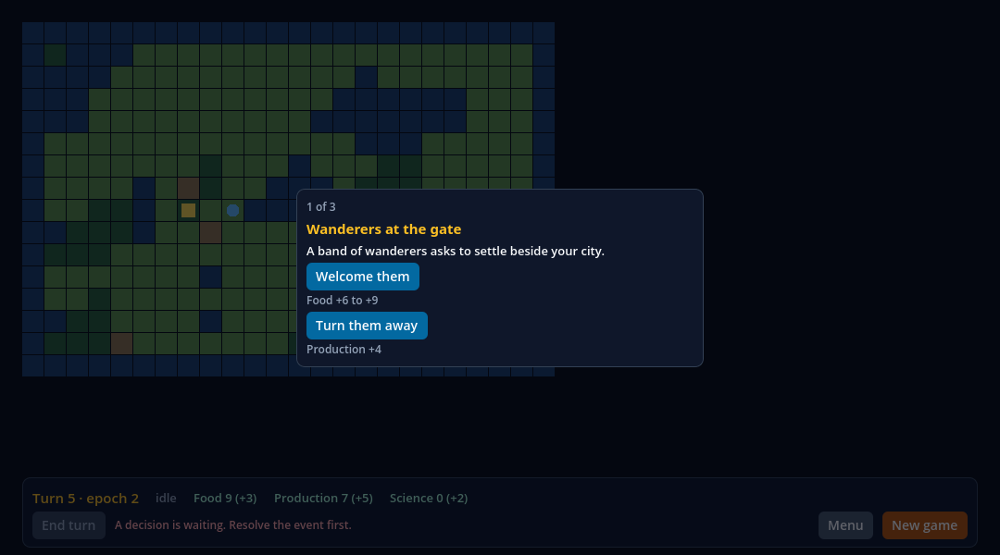 | O turno 5: "1 of 3", "Wanderers at the gate" e as duas escolhas com o detalhe de cada ("Food +6 to +9", "Production +4"), centralizado sobre o mapa escurecido; End turn cinza com "A decision is waiting. Resolve the event first." É a mesma imagem de `dialog.png`. |
| diálogo, 2 de 3, depois da remontagem | 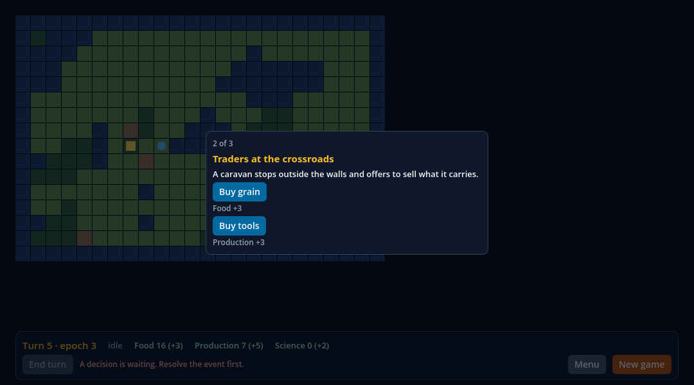 | "2 of 3", "Traders at the crossroads", "Buy grain" ("Food +3") e "Buy tools" ("Production +3"), com a comida em 16: a Surface acabou de ser montada de novo, e o jogo guardou a fila. |
| diálogo, 3 de 3 | 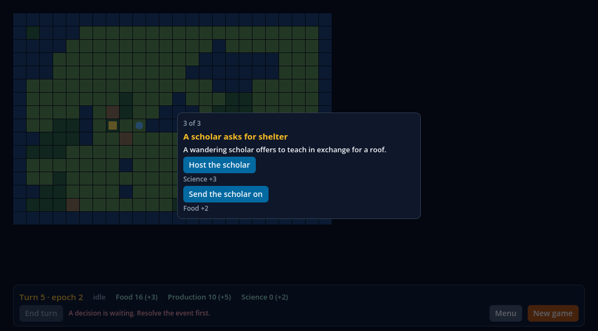 | "3 of 3", "A scholar asks for shelter", "Host the scholar" ("Science +3") e "Send the scholar on" ("Food +2"), com a produção em 10 depois de "Buy tools". |

### O que foi executado (fatia 2a)

As lanes de sabotagem rodaram primeiro e as simples por último: umas e outras escrevem os mesmos arquivos em `build/`, e assim os arquivos que o recibo
fixa são os da última corrida simples.

| Lane | Resultado | Tempo |
| --- | --- | ---: |
| `node scripts/civ-lite-ui-sabotage.mjs` | **12 de 12** sabotagens rejeitadas pela probe e pelo oráculo; fontes restauradas byte a byte; a lane restaurada passa | 819 s |
| `node scripts/civ-lite-game-sabotage.mjs` | **8 de 8** rejeitadas (a nova, `events-out-of-order`, entre elas); restauradas | 15 s |
| `node scripts/frontier-services-sabotage.mjs` | **11 de 11** rejeitadas; restauradas | 271 s |
| `node scripts/consumer-civ-lite-sabotage.mjs` | **5 de 5** rejeitadas; restaurada; o template restaurado passa | 197 s |
| `npm run test:frontier-soak` (o soak do #83, depois do ajuste do oráculo) | passou: 100 turnos em três execuções, 429 decisões e 1.030 snapshots por execução | 207 s |
| `npm run test:frontier-services` | **11/11** (a probe com o oráculo e a paridade, em 77 passos e 15 bindings) | 36 s |
| `npm run test:consumer:civ-lite` | 20 checks de build e posse, **165 nativos**, dez ciclos, 15 bindings (o consumidor segue passando sob os overlays) | 42 s |
| `npm run test:civ-lite-game` | passou, com os hashes novos (`cb7ab974…` e `ed43495…`), idênticos em três processos, e o oráculo concorda em 77 passos | 3 s |
| `node tests/civ-lite-ui-native.test.mjs --control --capture` (a lane `test:civ-lite-ui`, com os dois controles e as capturas) | **144 checks** da probe da HUD (152 janelada) e **26** da probe de overlays (30 janelada), os dois oráculos com 0 achados, **27 + 20** mutações dos oráculos rejeitadas, os dois controles falham | 142 s |
| `node scripts/frontier-soak-sabotage.mjs` (depois do lote, com o oráculo do soak ajustado) | **4 de 4** sabotagens do soak rejeitadas, cada uma pelo texto que o script espera; restauradas; a corrida genuína passa | 614 s |

Os gates que leem documentos (`check:publication`, `check:static`, `test:dashboard`, `test:contracts`) e o `type-check` rodaram depois, na árvore que tem
estes registros; o recibo guarda o resultado.

```sh
npm run test:civ-lite-ui                                      # as duas probes, headless, com os controles quando os commits existem no checkout
node tests/civ-lite-ui-native.test.mjs --control --capture    # os controles são obrigatórios; mais as doze capturas, janeladas
node scripts/civ-lite-ui-sabotage.mjs                         # as doze sabotagens e, no fim, a lane restaurada
npm run test:civ-lite-game                                    # os hashes golden e de trilha, em três processos, e o oráculo
node scripts/civ-lite-game-sabotage.mjs                       # as oito sabotagens do jogo
npm run test:frontier-soak                                    # o soak do #83 sobre o jogo da fila de três eventos
```

### O merge da `main` e o soak

O merge de `origin/main` (`8b7a5e6`) trouxe o #83 (o soak de 100 turnos do jogo com a HUD viva, `test:frontier-soak`), o #84 e o #85 (o gerador
canônico dos recibos hospedados). Nada em `native/` nem em `consumers/civ-lite/` mudou. O soak joga o civ-lite com um jogador fixo, e o oráculo dele
(`tests/frontier-soak-oracle.mjs`) tinha escrito o evento único como um fato do jogo; com a fila de três a lane falhou na primeira corrida sobre o merge
(`turn 5: resolve_event(buy_grain) is a step of the routine, once and in its order`, 202 s).

O oráculo agora diz o contrato: o turno 5 abre com exatamente três `resolve_event`, feitos no contexto `dialog`, respondendo `wanderers` com `welcome`,
`traders` com `buy_grain` e `scholar` com `host` (a tabela está escrita de novo no oráculo, não lida do jogo); nenhum outro turno tem um; o estado de que
o turno 5 parte tem os três ids na fila, e dali em diante o jogo registra as três respostas nessa ordem, com a fila vazia. **Nada foi relaxado**: as outras
checagens do oráculo ficam (toda chamada aceita, uma por passo e na ordem da rotina, os ids dos jobs, os hashes recalculados da serialização e iguais
nas três execuções), e duas exatas substituem as mais fracas. A sonda, o fixture, os casos e o script de sabotagem não mudaram.

A lane passou (três execuções, 100 turnos, 429 decisões e 1.030 snapshots por execução), com os hashes final `0b21c332…` e de trilha `4d6d3c4c…` onde
eram `a35c55f2…` e `fe9d4f36…`, porque o estado do jogo mudou, e com o heap em repouso em 2.117.992 bytes, onde eram 2.117.320; as regras exatas de nós,
heap e memória da lane valem. As quatro sabotagens retidas do soak (`listener-leak`, `nondeterministic-player`, `pause-kills-ui` e `leaky-hide`) rodaram depois do lote, com o oráculo ajustado, e as quatro são rejeitadas pelos textos que o script espera, com as fontes restauradas. O registro do soak em `docs/evidence/frontier-soak/` segue descrevendo a corrida de que foi feito.
A mudança do oráculo entrou em `1810828`.

### Os dois controles causais

A lane roda **duas vezes mais** sobre uma versão anterior, na mesma cena e com o mesmo host, e exige que cada uma falhe nos grupos que a
fatia criou:

- **A HUD de `5e1f6a1`** (o `ui/index.tsx` tirado do git, SHA-256 `d477f51c…9a09346`), sobre o jogo novo: falha em `actions` (25 achados),
  `content` (98), `input` (16), `map` (14), `panels` (578) e `phase` (374), em **136 dos 144 checks**. É o controle da fatia 1 com o jogo
  novo por baixo, e agora também falha em `map`, porque o overlay é parte do que o oráculo exige.
- **O jogo e a HUD de `622102e`** (um `git archive` de `consumers/civ-lite/{game,ui,services}` em `build/civ-lite-overlays-previous/`: um evento,
  painéis na árvore, nenhum `Modal`), sobre a probe de overlays: falha **exatamente** em `blocking` (9 achados), `newgame` (3), `queue` (33)
  e `remount` (8), em **18 dos 26 checks**. Os oito que passam são os que o jogo e a HUD antigos também cumprem: a HUD monta, cada cabeça traz as suas escolhas, a fila fica vazia depois da terceira resposta, o mundo volta a ouvir com a cidade fechada e com a fila respondida, e a sessão nova não tem fila.

Os dois controles dependem dos commits `5e1f6a1` e `622102e` estarem no checkout: um clone raso (a CI hospedada) os pula, a lane diz isso, e
`--control` torna a ausência um erro.

### As 12 sabotagens

Quatro sabotagens novas juntam-se às oito retidas da fatia 1 ([`scripts/civ-lite-ui-sabotage.mjs`](https://github.com/journey-studios/godot-fabric/blob/12b6c83669ee6fe07a6318329dea7430cb98e7d9/scripts/civ-lite-ui-sabotage.mjs)).
Cada uma quebra um fonte do template de propósito, roda a lane contra ele e exige que a probe **e** o oráculo a rejeitem, pela razão por que foi
quebrada; as contagens abaixo são as desta corrida:

| Sabotagem | O que quebra | Checks da probe que falham | Categorias do oráculo |
| --- | --- | ---: | --- |
| `city-by-data` | a tela da cidade é gateada por `city.present` e não pelo contexto | 23 | `blocking`, `map`, `panels`, `queue`, `remount` |
| `actions-reversed` | o painel de ações lista as ações na ordem oposta | 26 | `actions`, `panels` |
| `spinner-always` | o spinner não é amarrado à fase: gira em repouso | 49 | `bar`, `phase` |
| `end-turn-by-phase` | End turn habilitado por uma regra da HUD (`phase === "idle"`), não pela ação `end_turn` | 2 | `bar` |
| `spacer` | um spacer de altura cheia, com testID, cobre o mapa | 14 | `blocking`, `input`, `map`, `panels` |
| `hover-unpublished` | o mundo deixa de dizer ao nó qual tile está sob o ponteiro | 2 | `input` |
| `world-behind-hud` | o mundo volta depois do menu atrás da camada da HUD | 2 | `input` |
| `disabled-ignored` | o botão deixa de passar o `enabled` do jogo ao Pressable | 18 | `actions`, `bar`, `content`, `input`, `panels`, `phase` |
| **`queue-out-of-order`** | o jogo tira da fila o último evento e não a cabeça: os eventos saem fora da ordem da tabela | 8 | `newgame`, `queue`, `remount` |
| **`position-in-js`** | o "n of 3" é calculado na HUD (por um palpite sobre o id) e não é o `index` do jogo | 1 | `queue` |
| **`city-in-tree`** | a tela da cidade volta a ser um painel posicionado na árvore, não um `Modal` | 5 | `blocking`, `map`, `panels`, `remount` |
| **`dialog-unkeyed`** | o diálogo perde a `key` do evento: o mesmo `Control` serve aos três | 1 | `queue` |

A sabotagem do jogo `events-out-of-order` (a mesma troca no `intents.gd`, vista pela lane do jogo) é rejeitada pela probe do jogo, pela
divergência do hash golden e pelo oráculo; as sabotagens do consumidor (5) e dos serviços (11) seguem rejeitadas. Os oráculos também rejeitam,
em memória, cópias do relatório genuíno com uma coisa quebrada cada: 27 da probe da HUD (as 23 da fatia 1 mais um overlay que não bloqueia
o mapa, um `Modal` aberto num contexto sem overlay, a tela da cidade fora do `Modal` e uma posição do diálogo que não é a do jogo) e 20 da probe de overlays.

### O que a fatia 2a achou

- **Um `Modal` esconde a HUD de `find_child`.** Os `Control`s do `Modal` são filhos da janela própria dele; a probe da fatia 1, que lia a árvore,
  não os veria. A probe passou a ler pelo snapshot do host (`instance_from_id`) e a base comum virou `hud_probe.gd`, que as duas probes
  (`hud_validation.gd` e `overlay_validation.gd`) herdam.
- **Com o overlay aberto, o Menu e o New game da barra não podem ser tocados.** O `Modal` cobre a janela inteira, inclusive a barra, que é
  o que "bloqueante" quer dizer; a probe usa os serviços (`open_menu`, `new_game`) para ir ao menu com um evento esperando, e o evento não
  é respondido pela barra.
- **Sair da aplicação com um `Modal` aberto registra um erro do motor** (`remove_child` numa raiz que já está sendo liberada). É do host, não
  do que a probe mede, e é uma tarefa à parte: a probe termina com um `new_game`, sem overlay aberto.
- **Um nome de check carregava um número que depende do ritmo: corrigido em `8ba2a35`, e a lane agora trava isso.** Quatro nomes traziam a contagem do que foi
  observado (`(N frames observed)` na probe de overlays e `(N published)`, `(N frames observed)` e `(N cards)` na da HUD); o digest dos nomes é o que compara
  uma corrida hospedada com a commitada, e o número muda com o ritmo da máquina (o controle de overlays dava 93 onde a corrida dava 5). Os nomes agora são fixos
  e as contagens ficam nos dados do relatório. A lane trava a regra: `assertNamesDoNotDependOnPace` recusa um nome com contagem de quadros, snapshots, cartões,
  amostras ou tempo, e `assertSameNamesAsHeadless` exige que a corrida janelada tenha os nomes da headless, na mesma ordem. Os digests dos seis relatórios foram
  idênticos em três corridas seguidas. Os nomes que embutem o valor observado (os painéis que um passo mostrou, a lista das cabeças) só divergem quando o check
  falha, que é o diagnóstico, e não o ritmo.

### Limites da fatia 2a

- **Só macOS arm64, local.** O run hospedado e o Pages desta fatia ainda não existem, porque ela ainda não está na `main`; nada foi comparado com um iPhone.
- **O Escape não foi pressionado.** `onRequestClose` (fechar a cidade, não fazer nada no diálogo) está no código e nos testes de fonte, mas a
  probe fecha a cidade pelo botão Close, por um toque real, e responde ao diálogo pelas escolhas; nenhuma tecla foi enviada.
- **O bloqueio foi medido com eventos empurrados pelo viewport** (o dispositivo de validação da Surface), nos dois modos, não com um mouse
  físico nem com toque; 100 de cada tipo, em 100 tiles, sem passar um quadro entre eles.
- **Os controles precisam dos commits `5e1f6a1` e `622102e` no checkout**, e um clone raso os pula; a CI hospedada roda só o headless, sem
  capturas, sem controles e sem sabotagens.
- **`estabilidade` segue aberta** (vinte aberturas e fechamentos sem vazar, a restauração do foco, o escaneamento da API, os ícones por
  `Image`), assim como a cobertura do `AppRegistry` no manifesto, que é do P9. Nenhum checkpoint, peso ou denominador do 1.0 se move.

### Em aberto depois da fatia 2a

(Depois deste registro: o #93 levou a fatia 2a para a `main` como `e108e9d`, com os recibos hospedados em [`overlays/`](overlays/README.md), e a fatia 2b, abaixo, fechou a estabilidade.)

- A estabilidade: vinte aberturas e fechamentos sem vazar, a restauração do foco, as capturas por contexto na forma final, o escaneamento da
  API e os ícones por `Image`.
- O erro do motor ao sair com um `Modal` aberto (do host), a tarefa à parte.
- O run hospedado e o Pages da fatia 2a, depois do merge dela na `main`.

## Fatia 2b: a estabilidade, a varredura contra o manifesto e os ícones por `Image` (critério `estabilidade`)

Esta parte do registro cobre o critério `estabilidade` do V05-05, o último dos quatro: abrir e fechar cada tela 20 vezes sem vazar nós nem listeners,
com o foco restaurado e 0 de 100 cliques ao mundo sob o overlay; as capturas do macOS por contexto; uma varredura sem APIs proibidas; e os ícones por
`Image` (ou por glifos, se a `Image` não bastasse: bastou). Com ela os quatro critérios do item estão feitos, e o V05-05 está completo. A fatia roda sobre a
`main` em `e108e9d` (o squash do #93, a fatia 2a) e **não tem C++**: o host nativo é o mesmo (`addons/fabric_godot.dylib`, SHA-256 `258d1821…084da`).
O [recibo](report.json) é o bloco `slice2b`. A [pesquisa](../../research/frontier-hud.md) tem a definição de "repouso" e de "foco restaurado", a regra do heap e a
varredura, com arquivo.

Os fontes estão fixados no **commit de implementação [`0a0deca`](https://github.com/journey-studios/godot-fabric/commit/0a0decaf87548b2515101e27ac62ccf6cfc370f2)**
(`0a0decaf87548b2515101e27ac62ccf6cfc370f2`, árvore `a0defa5d541b44f113f4071fc5f7dee54a8a479c`, sobre `e108e9d`). O lote de proveniência rodou na árvore limpa desse commit
(o `git status --porcelain` antes do primeiro comando não listava nada), e os arquivos de documentação e os recibos desta fatia foram escritos durante e depois
dele: nenhum arquivo executado mudou, e cada SHA-256 de fonte do recibo bate com `git show 0a0deca:<caminho>`. Ambiente: macOS arm64, Godot oficial **4.7.2**,
React Native **0.87.1**, Node **v22.23.3**, em modo headless e, para as capturas, janelado.

### O que a lane mede

Uma terceira probe, `consumers/civ-lite/stability_validation.gd` (`-- --validate-stability`, com `stability_judge.gd`), roda no mesmo projeto, depois das outras duas, e o
oráculo `tests/civ-lite-stability-oracle.mjs` a julga de novo, a partir dos dados brutos, sem os veredictos dela:

- **A tela da cidade: 20 ciclos de duas rodadas.** Um clique real no tile da cidade abre a tela; um toque real no Close a fecha. Um segundo clique a abre e o Escape a
  fecha (`onRequestClose`, que é o `clear_selection` do jogo): 40 aberturas, cada fechamento com uma chamada ao jogo.
- **O diálogo: 20 ciclos.** `new_game`, os intents do replay pelos serviços até o turno 5 (o fim do turno que levanta os três eventos) e as três respostas por toque
  real: 60 respostas. O `Modal` é montado uma vez e fica até a terceira resposta, então cada ciclo é medido em **quatro repousos** (o diálogo aberto e depois de cada uma
  das três respostas), e cada um tem o do ciclo 1 como baseline.
- **Os ícones**, em quatro contextos (`none`, `stack`, `settler`, `city`).

Depois de cada fechamento (e com o overlay aberto) a probe espera a tela **chegar ao repouso por estado**, lê o host com o heap do Hermes coletado antes
(`validation_collect_garbage_on_status`, ligada na aplicação só em volta da leitura) e grava: os nós da SceneTree, os órfãos e as `Window`s; as views nativas, as tags e os
nós do snapshot do host; as rotas do ponteiro (`stored`, `suppressed`, `contacts`, `active`, `hoverPointers`) e o processador do ponteiro; os bindings, as subscriptions e
as tarefas e eventos pendentes do registro; as subscriptions da store da HUD; as conexões de `snapshot_changed` e de `hover_changed`; o trabalho pendente; o heap e o foco.
**Cada um é igual ao do ciclo 1 da sua série, exatamente.** O oráculo diz também o que uma tela em repouso tem sem olhar para o ciclo 1 (15 bindings, as duas subscriptions da HUD, nenhum
órfão, nada pendente, nenhuma rota do ponteiro ativa ou suprimida, as `Window`s que o jogo tinha antes), para que um vazamento que começou antes do baseline não seja o baseline; e exige que,
depois de um fechamento, a HUD seja o que era antes da abertura (nós, views, `Window`s) e que o que a rodada criou ela tenha apagado (`creates` menos `deletes` igual dos dois lados).

**O repouso é um estado, e foi isto que a primeira revisão achou.** A primeira versão declarava o repouso por "sem trabalho pendente, sem tag retirando, os Modals da tela" e um
punhado de quadros de folga. Numa corrida mais lenta, nos ciclos 13 e 14 da cidade, a leitura "aberto" pegou os cinco ícones do Modal ainda em `"status": "loading"`, com `"loads": 0`:
o decode das `Image`s corre num worker, no ritmo da máquina, e o check "desenhou depois de carregada" falhou. A probe agora espera (`come_to_rest`, com os quadros só como teto) o
estado que o oráculo julga, em duas leituras seguidas com a mesma assinatura: nada pendente (trabalho, timers, animation frames, tarefas do host, eventos), nenhuma rota ativa ou suprimida,
nenhuma tag retirando, tantos Modals e `Window`s quanto a tela tem, nenhum nó órfão, views, tags e nós do host em igual número e **todas as `Image`s assentadas** (carregadas e
desenhadas, ou falhas com o seu erro). Nada numa medida é esperado por uma contagem de quadros; a espera do Escape no diálogo e a do burst seguem a mesma regra. A lane passou **três
vezes seguidas** depois do ajuste, e a sabotagem `icon-missing` continua rejeitada, agora pelo status de erro da `Image` e não por timeout.

### Os números por ciclo

Cada linha é uma série de 20 leituras em repouso (o ciclo 1 → o ciclo 20); em todas, **os 20 valores de cada coluna são iguais**. A base é o jogo recém-aberto, sem overlay nenhum: 28 nós, 17 views nativas, 0 `Window`s, 2 subscriptions, 15 bindings.

| Série | Nós da árvore | Órfãos | `Window`s | Views nativas | Subscriptions do registro | Subscriptions da HUD | Conexões de `snapshot_changed` | Rotas do ponteiro guardadas |
| --- | ---: | ---: | ---: | ---: | ---: | ---: | ---: | ---: |
| cidade, antes de abrir (rodadas de Close) | 28 → 28 | 0 → 0 | 0 → 0 | 17 → 17 | 2 → 2 | 2 → 2 | 2 → 2 | 0 → 0 |
| cidade aberta (Close) | 67 → 67 | 0 → 0 | 1 → 1 | 55 → 55 | 2 → 2 | 2 → 2 | 2 → 2 | 1 → 1 |
| cidade, depois do Close | 28 → 28 | 0 → 0 | 0 → 0 | 17 → 17 | 2 → 2 | 2 → 2 | 2 → 2 | 0 → 0 |
| cidade, antes de abrir (rodadas de Escape) | 28 → 28 | 0 → 0 | 0 → 0 | 17 → 17 | 2 → 2 | 2 → 2 | 2 → 2 | 0 → 0 |
| cidade aberta (Escape) | 67 → 67 | 0 → 0 | 1 → 1 | 55 → 55 | 2 → 2 | 2 → 2 | 2 → 2 | 1 → 1 |
| cidade, depois do Escape | 28 → 28 | 0 → 0 | 0 → 0 | 17 → 17 | 2 → 2 | 2 → 2 | 2 → 2 | 0 → 0 |
| diálogo, antes do turno 5 | 44 → 44 | 0 → 0 | 0 → 0 | 33 → 33 | 2 → 2 | 2 → 2 | 2 → 2 | 0 → 0 |
| diálogo aberto (1 of 3) | 43 → 43 | 0 → 0 | 1 → 1 | 31 → 31 | 2 → 2 | 2 → 2 | 2 → 2 | 0 → 0 |
| diálogo, depois da resposta 1 (2 of 3) | 43 → 43 | 0 → 0 | 1 → 1 | 31 → 31 | 2 → 2 | 2 → 2 | 2 → 2 | 0 → 0 |
| diálogo, depois da resposta 2 (3 of 3) | 43 → 43 | 0 → 0 | 1 → 1 | 31 → 31 | 2 → 2 | 2 → 2 | 2 → 2 | 0 → 0 |
| diálogo, depois da resposta 3 (fechado) | 28 → 28 | 0 → 0 | 0 → 0 | 17 → 17 | 2 → 2 | 2 → 2 | 2 → 2 | 0 → 0 |

- **Heap em repouso**, pela regra do baseline (`heapAtRest`: sem os dois primeiros ciclos, a mediana da segunda metade dos 18 restantes menos a da primeira, no máximo 2.048 bytes), sobre
  as 20 leituras de cada série depois de um fechamento: depois de um Close, 2.297.856 → 2.295.048 bytes (as medianas das metades: 2.296.920 e 2.295.624, diferença **-1296**); depois de um Escape, 2.296.576 → 2.293.768 (-1296); depois da terceira resposta, 2.298.000 → 2.298.000 (+128). Antes da primeira medida a probe enche a telemetria da HUD (`FrontierHud.stats` guarda os 64 últimos resultados; 70 chamadas e
  mais duas aceitas, para que a barra não mostre uma recusa velha), porque senão o heap subiria o que a telemetria cresce até 64, que é limitado e não é vazamento; o oráculo exige os 64.
- **Objetos do motor** (`OBJECT_COUNT`): fora da igualdade exata, porque têm um jitter de um objeto e os 300 eventos de um burst ficam vivos por cerca de cem quadros. A probe espera, por
  estado, a contagem voltar ao que era antes do burst, e o oráculo julga os repousos depois de um fechamento pela mesma regra do heap com limite de um objeto (a mediana da segunda metade
  igual à da primeira, nas três séries).
- **`modalRuntimeMembers` não é o número de Modals abertos**: conta os runtimes na pilha de Modals (`native/modal_window_stack.h`, `runtime_count`) e vale 1 enquanto a aplicação roda,
  com Modal ou sem. Um Modal aberto é um nó `modal` com `modalWindow` no snapshot do host e uma `Window` na SceneTree; a probe conta os dois e confere que os membros ficam em 1.

### O foco restaurado, como este host o mede

O foco de React Native está fora do 0.5 (o manifesto diz que nenhuma `View` recebe foco de teclado), e nada no host devolve o foco a um `Control` quando um `Modal` fecha
(`native/modal_window_stack.cpp` só chama `grab_focus` na `Window` exclusiva do topo quando ela abre). "Foco restaurado" quer dizer, aqui, três coisas que o host sabe dizer:

1. o `gui_get_focus_owner()` da viewport raiz depois de cada fechamento é o de antes da abertura (nenhum `Control`, em todos os ciclos das duas telas);
2. com um overlay aberto, há exatamente uma `Window` de Modal exclusiva e visível (a do topo da pilha, a única), a viewport raiz não tem dono de foco e nenhum nó do snapshot fora dessa
   `Window` reporta `focused`;
3. o Escape fecha a tela da cidade e não faz nada no diálogo (abaixo).

Se a `Window` raiz e a do Modal têm o foco do sistema operacional fica gravado, mas não é julgado: depende da área de trabalho do usuário numa corrida janelada.

### O Escape e os 100 cliques sob o overlay

- **Escape na cidade:** em cada uma das 40 aberturas, o fechamento (por Close ou por Escape) fez **uma** chamada `clear_selection` ao jogo e o contexto saiu de `city`. O Escape é um evento de tecla
  empurrado pela viewport (como `tests/modal-host-probe.gd` faz), não um teclado físico.
- **Escape no diálogo:** em cada um dos 20 ciclos, a `Window` do Modal ouviu o Escape (uma conexão em `window_input` o conta: 1), e nada mudou: o mesmo evento na cabeça, nenhuma chamada,
  o mesmo hash do estado, o `Modal` ainda aberto, nenhuma `Window` a mais.
- **0 de 100, de novo:** no ciclo 1 e no ciclo 20 de cada tela, com o overlay aberto, 100 cliques esquerdos, 100 direitos e 100 giros da roda empurrados no mapa chegam ao `World` 0 vezes, sem
  nenhuma chamada `select_tile` e sem mudar a seleção (a medida da fatia 2a, agora repetida dentro dos ciclos para que um vazamento não abra um buraco).

### A varredura contra o manifesto

`tests/civ-lite-hud-scan.mjs` lê a HUD (`index.tsx` e `hud/*`) pela árvore sintática do TypeScript e o `docs/compatibility/scope-0.5.json`, e nunca uma cópia das listas: cada nome importado de
`react-native` tem de ser um dos `names` do manifesto, e um que o `outOfScope` ou o `notInTheManifest` deixam de fora (`TextInput`, `Keyboard`, `FlatList`, ...) é recusado com a frase que o diz;
cada prop de um elemento JSX desses componentes tem de ser uma que o manifesto suporta para ele (uma recusada passa só com um valor da lista `accepts`, como `animationType="none"`; uma ignorada é
recusada, porque não muda nada aqui; uma que o RN nem declara para o componente, como `onContextMenu` e `onAuxClick`, é recusada como desconhecida); cada membro lido de um nome com lista de
`subset.members` tem de estar nela (`AppRegistry.registerComponent`), e o nome só é lido assim: os membros desestruturados dele (`const { getAppKeys } = AppRegistry`) são conferidos contra a lista
(um resto ou um membro calculado é recusado), e qualquer uso solto do nome ligado (um alias, um argumento, um retorno, um export) é recusado, porque esconderia que membro se lê depois; qualquer subcaminho de
`react-native` (`react-native/Libraries/...`) é recusado, seja um import estático, um re-export, um import de tipo, um `require` ou um import dinâmico. Um import padrão ou de namespace, um `require` e um import dinâmico são recusados porque escondem quais nomes se usam; um import
só de tipo some no build e não é um nome. O `AppRegistry`, o ponto de entrada da HUD, entrou no manifesto (supported, com `registerComponent` e `getAppKeys`) e o teste do manifesto passou a 13 nomes; o
`docs/compatibility/scope-0.5.json` e o `tests/scope-0.5.test.mjs` entraram nos `SHARED_PATHS` do quadro de agentes, porque toda fatia do 0.5 os estende.

A lane prova que a varredura pode falhar com **21 mudanças** de uma cópia dos fontes (um import de `FlatList`, de `TextInput` e de `Keyboard`; um nome que o manifesto não decide; um import de namespace; um
`require`; `onHoverIn`, `onContextMenu` e `onMouseEnter`; `animationType="slide"`; filhos numa `Image`; um spread; `AppRegistry.runApplication`; um import estático, um re-export, um `require` e um import dinâmico de um subcaminho de `react-native`; o `AppRegistry` desestruturado
em um membro fora do subconjunto ou com um resto, usado por um alias e passado como argumento) e **dois casos que ela deixa passar** (um import só de tipo e um membro do subconjunto desestruturado): 23 casos. A regex que a
lane já tinha (hooks, listeners, falar com o jogo) fica: o manifesto não lista nada disso.

### Os ícones por `Image`

Seis PNGs de 32x32, **arte original** desenhada de formas por `scripts/civ-lite-icons.mjs` (colono, guerreiro, cidade, comida, produção e ciência), ficam em `consumers/civ-lite/ui/icons/`; o gerador escreve
os PNGs com blocos zlib sem compressão, então os bytes só dependem do código dele, e a lane exige que os arquivos commitados sejam o que ele desenha. `ui/hud/icons.ts` importa cada um como asset
(`ui/assets.d.ts` declara `*.png`, como o consumidor das bibliotecas; o plugin de assets registra o arquivo e o copia ao lado do bundle) e o componente `Icon` de `ui/hud/kit.tsx` o desenha com uma
`Image`. Eles estão na barra (os três recursos), nas ações (a unidade de um `select_unit` ou `fortify`; a cidade em `found_city`), no cartão do tile (cada unidade e a cidade) e na tela da cidade (o título e cada item de
produção), que fica **dentro da `Window` do Modal**: uma `Image` ali carrega e desenha como qualquer outra (`errors` 0, `status` `loaded`, `drawn` um dicionário, `loads` 1), nas 40 aberturas. Nenhum
glifo foi necessário. O oráculo deriva, do snapshot do jogo, quais ícones cada contexto monta e de qual arquivo é cada um; nada disso é lido da HUD.

| Contexto | Images montadas | Dentro da `Window` do Modal |
| --- | ---: | ---: |
| `none` (a barra) | 3 | 0 |
| `stack` (barra, duas ações de seleção, duas unidades no cartão) | 7 | 0 |
| `settler` (barra, Found city e Fortify, duas unidades no cartão) | 7 | 0 |
| `city` (barra, o título e os quatro itens da cidade) | 8 | 5 |

### As capturas da fatia 2b

Sete capturas reais do renderizador, salvas pela corrida janelada (`node tests/civ-lite-ui-native.test.mjs --control --capture`); cada uma foi lida antes de entrar aqui, e o SHA-256 de cada PNG
está no recibo.

| Captura | Imagem | O que mostra |
| --- | --- | --- |
| a barra com os ícones | 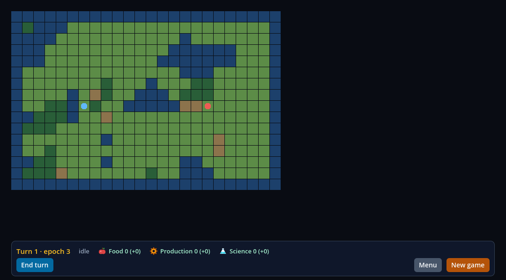 | O turno 1: "Turn 1 · epoch 3" e os três recursos, cada um com o seu ícone (a maçã, a engrenagem e o frasco), sem a recusa velha da telemetria. |
| as ações com os ícones | 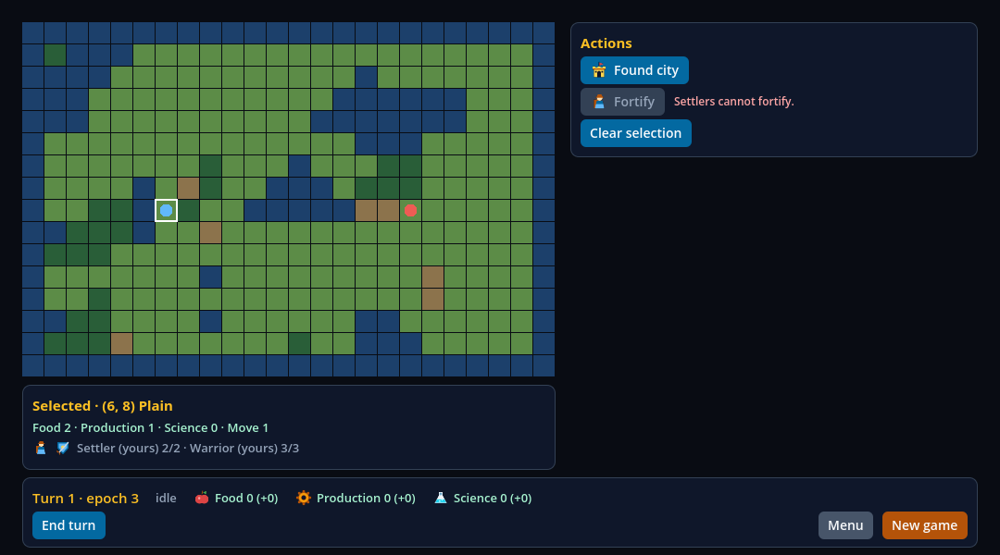 | O colono selecionado: "Found city" com o ícone da cidade, "Fortify" cinza com o do colono e o motivo "Settlers cannot fortify.", e o cartão do tile com o ícone do colono e o do guerreiro antes do texto. |
| a tela da cidade |  | O turno 2: o ícone da cidade no título "Aurora · size 1/3" e os ícones de Warrior, Granary, Workshop e Library nos itens, **dentro do Modal**, com o mapa e a barra escurecidos atrás. |
| a cidade, ciclo 1 |  | A mesma tela no primeiro ciclo (época 5). |
| a cidade, ciclo 20 | 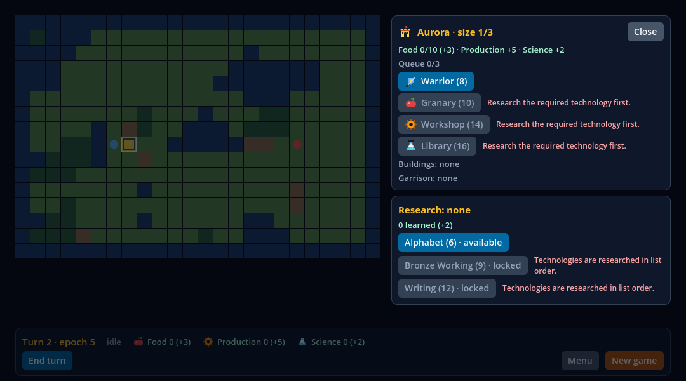 | A mesma tela no vigésimo ciclo: **os mesmos bytes** do ciclo 1 (SHA-256 igual). |
| o diálogo, ciclo 1 |  | "1 of 3", "Wanderers at the gate" e as duas escolhas, no turno 5 da época 6. |
| o diálogo, ciclo 20 |  | O mesmo diálogo no turno 5 da época 25. O SHA-256 difere: os dígitos da época deslocam o que está à direita deles na primeira linha da barra. A probe compara as duas imagens, pixel a pixel, no próprio motor, com essa linha mascarada, e não acha nenhum pixel diferente: não houve deriva visual. |

### O que foi executado (fatia 2b)

Cada comando rodou na árvore limpa de `0a0deca`, em sequência; as lanes de sabotagem e as simples escrevem os mesmos arquivos em `build/`, então a lane simples foi a última e os arquivos que o recibo fixa
são os da última corrida simples (os da corrida janelada que só ela escreve, como as capturas e `graphical.json`, são os da primeira).

| Comando | Resultado | Tempo |
| --- | --- | ---: |
| `node tests/civ-lite-ui-native.test.mjs --control --capture` | passou: a lane com os controles e as capturas (a janelada) | 279 s |
| `node scripts/civ-lite-ui-sabotage.mjs` | passou: as 17 sabotagens e, no fim, a lane restaurada | 926 s |
| `npm run test:consumer:civ-lite` | passou: o consumidor independente (20 checks de build e posse, 165 nativos, dez ciclos) | 35 s |
| `npm run test:frontier-turn` | passou: a lane do turno (V05-06) | 243 s |
| `npm run test:frontier-soak` | passou: o soak de 100 turnos do jogo com a HUD viva | 202 s |
| `npm run test:frontier-services` | passou: os serviços e a paridade TS/Godot | 27 s |
| `npm run test:civ-lite-ui` | passou: a lane simples, a última | 210 s |

Os gates que leem documentos (`check:publication`, `check:static`, `test:dashboard`, `test:contracts` e o `type-check`) rodaram depois, na árvore que tem estes registros; o recibo guarda o resultado.

```sh
npm run test:civ-lite-ui                                      # as três probes, headless, com os controles quando os commits existem no checkout
node tests/civ-lite-ui-native.test.mjs --control --capture    # os controles obrigatórios; mais as capturas, janeladas (com `node` direto: `node --test` não repassa a flag)
node scripts/civ-lite-ui-sabotage.mjs                         # as 17 sabotagens e, no fim, a lane restaurada
```

### O controle causal: a HUD e o jogo de `e108e9d`

A lane roda a mesma probe sobre o `ui`, o `game` e o `services` de `e108e9d` (um `git archive` em `build/civ-lite-stability-previous/`: a HUD sem ícones) e a varredura sobre a HUD dele:

- **A varredura** contra o manifesto **dele** (`git show e108e9d:docs/compatibility/scope-0.5.json`) acha exatamente uma coisa: `index.tsx`: o `AppRegistry` não está nos `names` do manifesto. Contra o manifesto desta fatia, que
  decide o `AppRegistry`, a mesma HUD passa.
- **A probe** falha **exatamente os três checks de ícones** ("Icons: ..."), com 44 achados da categoria `icons` no oráculo e nenhum de outra: a HUD de `e108e9d` não monta nenhuma `Image`. Todos os de vazamento,
  heap, foco, Escape e bloqueio passam, o que também diz que a HUD da fatia 2a não vazava e que as sabotagens abaixo é que quebram a lane.

### As 17 sabotagens

Cinco sabotagens novas juntam-se às doze ([`scripts/civ-lite-ui-sabotage.mjs`](https://github.com/journey-studios/godot-fabric/blob/0a0decaf87548b2515101e27ac62ccf6cfc370f2/scripts/civ-lite-ui-sabotage.mjs)).
Cada uma quebra um fonte do template de propósito e roda a lane contra ele; as de estabilidade rodam só a probe nova (`mode: "stability"`) e a de import só a varredura (`mode: "scan"`). A probe **e** o
oráculo (ou a varredura) têm de a rejeitar, pela razão por que foi quebrada, e o fonte volta byte a byte. As contagens abaixo são as desta corrida:

| Sabotagem | O que quebra | Checks que falham | Categorias |
| --- | --- | ---: | --- |
| `city-by-data` | a tela da cidade é gateada por `city.present`, não pelo contexto | 23 | `blocking`, `map`, `panels`, `queue`, `remount` |
| `actions-reversed` | o painel de ações lista na ordem oposta | 26 | `actions`, `panels` |
| `spinner-always` | o spinner gira em repouso | 49 | `bar`, `phase` |
| `end-turn-by-phase` | End turn habilitado por uma regra da HUD, não pela ação do jogo | 2 | `bar` |
| `spacer` | um spacer com testID cobre o mapa | 14 | `blocking`, `input`, `map`, `panels` |
| `hover-unpublished` | o mundo deixa de publicar o hover | 2 | `input` |
| `world-behind-hud` | o World volta atrás da camada da HUD depois do menu | 2 | `input` |
| `queue-out-of-order` | o jogo tira da fila o último evento e não a cabeça | 8 | `newgame`, `queue`, `remount` |
| `position-in-js` | o "n of 3" é calculado na HUD | 1 | `queue` |
| `city-in-tree` | a tela da cidade volta a ser um painel da árvore, não um Modal | 5 | `blocking`, `map`, `panels`, `remount` |
| `dialog-unkeyed` | o diálogo perde a `key` do evento | 1 | `queue` |
| `disabled-ignored` | o botão deixa de passar o `enabled` ao Pressable | 18 | `actions`, `bar`, `content`, `input`, `panels`, `phase` |
| `close-leaks-connection` | **nova.** a store abre uma conexão ao snapshot a cada `clear_selection` (Close, Escape) e não a solta | 6 | `heap`, `leak` |
| `modal-stays-mounted` | **nova.** o Modal da cidade é gateado por `city.present`: a Window fica aberta, vazia, depois de fechar | 15 | `coverage`, `escape`, `focus`, `icons`, `leak` |
| `focus-grabbed` | **nova.** um Control do World toma o foco ao abrir um overlay | 2 | `focus` |
| `icon-missing` | **nova.** um ícone aponta para um asset que não existe | 2 | `icons` |
| `import-outside-manifest` | **nova.** a HUD importa `TextInput`, que o manifesto deixa de fora | 1 | `import` |

Uma sabotagem de Window que fica aberta não consegue ser só "um vazamento": um `Modal` aberto bloqueia o mapa, então `modal-stays-mounted` falha também o que depende de clicar no mapa; é o que se espera
de um Modal exclusivo. Os oráculos rejeitam também, em memória, cópias do relatório genuíno com uma coisa quebrada cada: 38 do da estabilidade (vazamentos de nó, `Window`, view, subscription, conexão,
rota do ponteiro, órfão e do que a rodada criou; o heap e os objetos; o foco; o bloqueio; o Escape; os ícones, inclusive uma `Image` ainda carregando; os ciclos que faltam) e as 14 da varredura.

### O que a fatia 2b achou

- **O repouso de uma tela é um estado, e as `Image`s fazem parte dele.** Foi achado na primeira revisão da fatia (acima): o check de ícones falhou numa corrida mais lenta porque o repouso era declarado antes de o
  decode terminar. A probe agora espera o estado inteiro que o oráculo julga e a lane passou três vezes seguidas. Não consegui reproduzir a falha na máquina de desenvolvimento, nem com 40 laços de CPU concorrentes:
  a correção vem da leitura do log e do que o host reporta (`status` `loading`, `loaded`, `failed`).
- **`modalRuntimeMembers` conta runtimes, não Modals** (acima); a primeira versão da probe esperava por ele e esperava o limite inteiro em toda medida.
- **Um burst deixa 300 eventos de entrada vivos por cerca de cem quadros**, e o `OBJECT_COUNT` não é igual de um ciclo a outro (jitter de um objeto): a igualdade exata não vale para ele.
- **A telemetria da HUD cresce até 64 resultados**: sem enchê-la antes, a regra do heap acusaria o que é um crescimento limitado.
- **Uma sabotagem cujo erro é uma `Image` que não carrega** aparece pelo `status` `failed` e pelo erro "Could not find image", e a probe não depende de nenhum timeout para vê-la.
- **A varredura achou uma lacuna do manifesto**: o `AppRegistry` estava na HUD desde a fatia 1 e não no manifesto. Entrou nesta fatia.
- **O Escape é entregue à `Window` do Modal** (um `window_input` o conta), o que faz o check do diálogo provar que a tecla chegou, e não só que nada mudou.
- **Depois do pin, a revisão do PR #100 achou quatro coisas, todas válidas.** O rótulo do check do grupo `tree` falava de "objects", que esse grupo não julga (o digest dos nomes dos checks da probe de estabilidade passou de
  `0bd9d789…` para `9c25b65f…`; os da HUD e de overlays não mudaram); a varredura deixava passar um subcaminho de `react-native` e o uso de `AppRegistry` por desestruturação ou por um alias, e agora os recusa; e a nota da
  árvore suja do recibo estava incoerente com a lista que ela descreve. As fontes pinadas em `0a0deca` não foram reescritas; o bloco `slice2b.afterThePin` do recibo guarda o que mudou depois e o digest novo.

### Limites da fatia 2b

- **Só macOS arm64, local.** O run hospedado desta fatia só existirá depois de ela estar na `main`; a CI hospedada roda a lane headless, sem controles (o clone é raso), sem capturas e sem sabotagens. O
  recibo hospedado dos overlays (#93) está em [`overlays/`](overlays/README.md).
- **O ruído do heap num runner hospedado não foi observado**: a regra é a do baseline, que já tolera a banda vista lá (2.376 bytes), e os objetos do motor têm limite de um.
- **O Escape foi um evento de tecla pela viewport**, não um teclado físico; o bloqueio foi medido com eventos empurrados pela viewport, não com mouse físico nem toque; nada foi comparado com um iPhone.
- **O foco é o que o host sabe dizer** (acima); o foco de React Native não existe no 0.5.
- **Os ícones são desenhados para este app**: não dizem nada sobre formatos que o host recusa (GIF) nem sobre imagens de rede, que estão fora do 0.5.
- **As tabelas de views nativas de `docs/research/frontier-turn.md`** (o tour de 19 cliques) são as da HUD sem ícones: pelo relatório da lane do turno em `0a0deca`, `none` passou de 14 para 17 views, `tile` de 18 para
  21, `warrior` de 24 para 30, `stack` de 26 para 33, `settler` de 27 para 34, `dialog` de 28 para 31 e `city` de 47 para 55. A lane do turno passou porque julga cada contexto contra ele mesmo; quem a rodar de novo regrava as tabelas.
- **O V05-05 está completo, mas o marco 0.5 não**: nenhum `done` de saída (X1 a X10), nenhum checkpoint, peso ou denominador da 1.0 se move.

### Em aberto depois da fatia 2b

- O run hospedado e o Pages desta fatia, depois do merge dela na `main`.
- O erro do motor ao sair com um `Modal` aberto (do host), a tarefa à parte.
- As tabelas de `docs/research/frontier-turn.md`, regravadas pela lane do turno sobre a HUD com ícones.
- O resto do marco 0.5 (V05-06 em diante e a comparação final).
