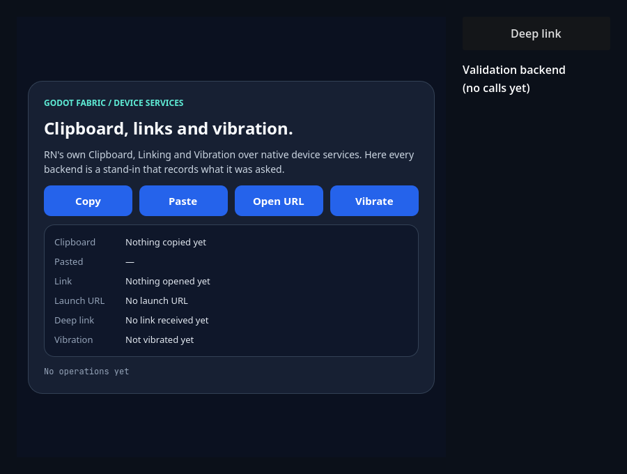
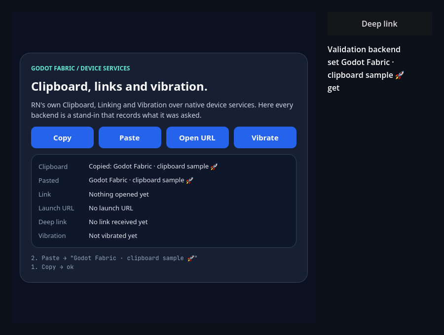
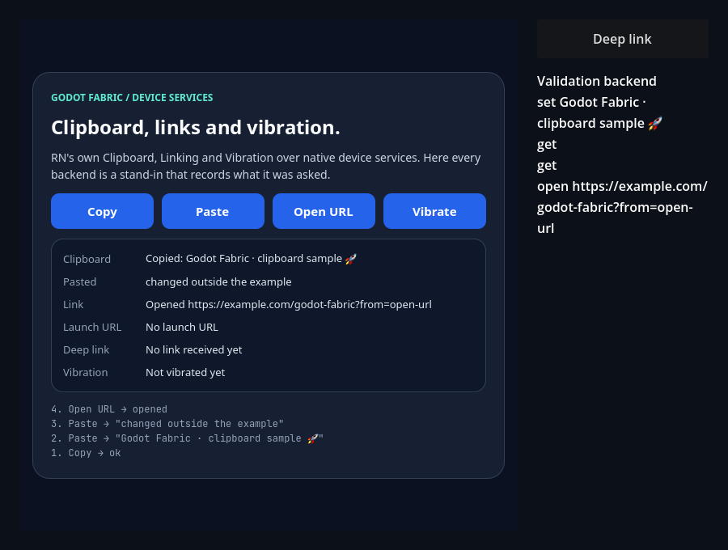
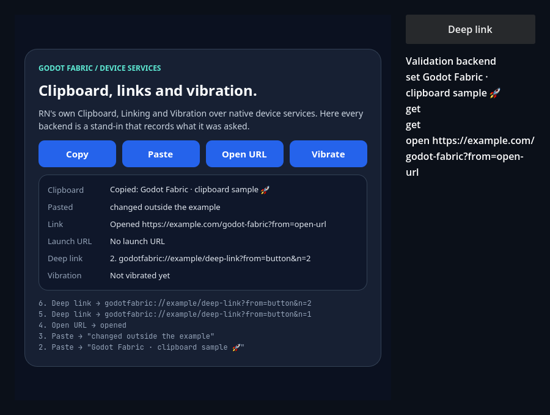
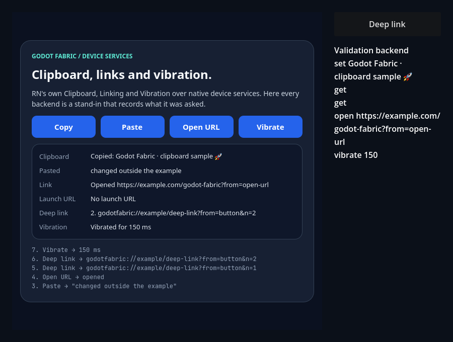
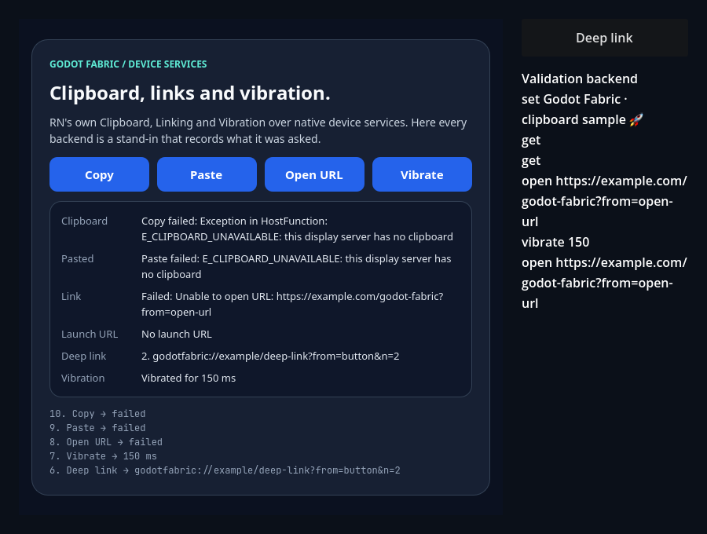

# Linking, Clipboard e Vibration do RN sobre os serviços de dispositivo do Godot

Esta fatia, a primeira do GF-23, faz os módulos originais `Linking`, `Clipboard` (o legado) e
`Vibration` do RN 0.87.1 rodarem na aplicação, lidos pelo import público `react-native`, sobre
três TurboModules C++ do host: `LinkingManager` (o contrato do iOS, que é o que o `Linking.js`
toma com `Platform.OS` igual a `"godot"`), `Clipboard` e `Vibration`. Os módulos chamam o
`OS.shell_open`, a área de transferência do `DisplayServer` e o `Input.vibrate_handheld` do
Godot por uma struct de backend, e uma execução de validação substitui qualquer função dela. Um
dono por `FabricApplication`, compartilhado pelas roots da aplicação, cria os módulos no primeiro
uso e os encerra no stop. O [recibo](execution.json) fixa fontes, hashes, capturas e resultados.

Todo link de código abaixo está fixado no commit de implementação
[`71d708c`](https://github.com/journey-studios/godot-fabric/commit/71d708c37be48478607f08528a5e300dc51ee0b0)
(árvore `55db8994`), em cujo conteúdo cada comando abaixo rodou.

| Lane executada | Checks | Observação |
| --- | ---: | --- |
| Host anterior `aebbddcd` (main `e88b5bb`) | 13/65 e 1/2 | Exatamente as 52 falhas normativas e a 1 do launch: sem os módulos, a primeira leitura de `Clipboard` e de `Vibration` falha com `'Clipboard' could not be found`, o `Linking` carrega e seus métodos falham em `nullthrows`, e o host não tem `deliver_url`; os 13 checks estruturais valem nos dois hosts |
| Sabotagem `duplicate-url`, host `7870332c` | 60/65 | Exatamente 5 falhas: cada link chega duas vezes a cada ouvinte; o oráculo rejeita o relatório com `deep-link-one: link events` |
| Sabotagem `stale-clipboard`, host `88c64ebe` | 56/65 | Exatamente 9 falhas: `getString` responde com o primeiro texto lido; o oráculo rejeita o relatório com `clipboard-unicode/get` |
| Host atual `147df0b3`, headless | 65/65 e 2/2 | Duas aplicações (backend de validação com duas roots, e o backend real do Godot), com o oráculo independente; um segundo processo sem `--uri=` |
| Exemplo `device-services` | 16 headless, 16 gráficos, 23 gráficos com captura | Cliques reais; todos os backends são substitutos que registram o que lhes foi pedido |

As lanes executam o mesmo bundle (`40614c07`), com as mesmas fontes de teste e SDK; só os
produtores nativos diferem. O host anterior foi compilado a partir da main `e88b5bb`, antes de a
árvore receber o trabalho desta fatia, e o binário anterior fica em
`build/device-services-previous-host/`, local e fora do repositório. As duas sabotagens são
retidas: `node scripts/device-services-sabotage.mjs` troca um trecho de
`native/device_services.cpp` de cada vez, recompila, roda o runner e o oráculo, restaura a
fonte byte a byte (hash conferido), recompila o host genuíno e registra tudo em um recibo local.
O host genuíno e o restaurado têm o mesmo SHA-256, `147df0b3…`.

**Ambiente**: macOS arm64; Godot oficial 4.7.2 (`ed1daf0bf`), RN 0.87.1, React 19.2.3, Hermes
250829098.0.17 e Node v22.23.3. A suíte roda em modo headless; o exemplo, em headless e com o
renderer nativo.

```sh
npm run test:device-services
```

Com o host anterior instalado em `addons/`, o mesmo runner confere o controle com
`node tests/device-services-native.test.mjs --allow-original-negative`; os hosts sabotados rodam com
`--sabotage=duplicate-url` e `--sabotage=stale-clipboard`, e o launcher abre o
[exemplo](https://github.com/journey-studios/godot-fabric/blob/71d708c37be48478607f08528a5e300dc51ee0b0/examples/device-services/README.md)
com `npm run example -- device-services` (também `--headless`, `--check` e `--capture`).

> **CI hospedada pendente.** O passo `npm run test:device-services` e o artefato
> `native-device-services` do workflow `contracts.yml` ainda não rodaram na CI hospedada. Tudo
> o que esta página registra é evidência local, em macOS arm64. Nenhum GF, checkpoint, peso ou
> denominador fecha com ela.

## O que o RN faz

O `Linking.js` entrega o módulo nativo ao `NativeEventEmitter` só com `Platform.OS === 'ios'`,
então com `"godot"` o evento `url` chega pelo `RCTDeviceEventEmitter` e nada chama
`addListener` ou `removeListeners` no módulo. `openURL` e `canOpenURL` validam a URL no JS
(um não-string e depois a string vazia) antes de qualquer chamada nativa, e o contrato do
`RCTLinkingManager` do iOS resolve `true` ou rejeita `Unable to open URL: <url>`, responde
`canOpenURL` com um booleano e resolve `getInitialURL` com a URL de lançamento ou `null`. O
`NativeClipboard` exige o módulo com `getEnforcing` na importação, e o `index.js` o expõe por um
getter preguiçoso que avisa a descontinuação uma vez. O `Vibration.js` chama `vibrate` para um
número e, para um array fora do Android, agenda o padrão no JS, um `vibrate(400)` por passo:
`cancel()` só chega ao módulo nativo e não zera o estado do JS, então um padrão com `repeat` não é
cancelável e o `vibrate()` seguinte é ignorado. Isso é comportamento original do RN, e o host nem o
causa nem o corrige. A [nota de pesquisa](https://github.com/journey-studios/godot-fabric/blob/71d708c37be48478607f08528a5e300dc51ee0b0/docs/research/device-services.md)
tem as fontes com as linhas.

## O que esta fatia faz

1. Um [`DeviceServices`](https://github.com/journey-studios/godot-fabric/blob/71d708c37be48478607f08528a5e300dc51ee0b0/native/device_services.cpp)
   por `FabricApplication` registra os três módulos no registro de TurboModules, com o
   `NativeLinkingManagerCxxSpec`, o `NativeClipboardCxxSpec` e o `NativeVibrationCxxSpec` gerados
   pelo RN, e envia o evento `url` pelo `emitDeviceEvent` original. O
   [`StoppableInvoker`](https://github.com/journey-studios/godot-fabric/blob/71d708c37be48478607f08528a5e300dc51ee0b0/native/stoppable_invoker.h)
   (o mesmo que o networking usa) descarta o que ficou na fila depois do stop.
2. O [núcleo puro](https://github.com/journey-studios/godot-fabric/blob/71d708c37be48478607f08528a5e300dc51ee0b0/native/device_services_core.h)
   (regra de scheme da RFC 3986, argumentos `--uri=`, a struct de backend e os contadores) não
   precisa de Godot nem do RN e tem [teste próprio](https://github.com/journey-studios/godot-fabric/blob/71d708c37be48478607f08528a5e300dc51ee0b0/native/device_services_core_test.cpp),
   que passa (`DEVICE_SERVICES_CORE_PASSED`) e roda também dentro da suíte.
3. O [backend do Godot](https://github.com/journey-studios/godot-fabric/blob/71d708c37be48478607f08528a5e300dc51ee0b0/native/godot_device_backend.cpp)
   usa `OS.shell_open`, `DisplayServer.clipboard_*` (com `has_feature(FEATURE_CLIPBOARD)` antes de
   cada chamada, porque o headless não tem clipboard e registraria um erro do engine) e
   `Input.vibrate_handheld`, que `DisplayServer` e `Input` alcançam pelos singletons, sem mexer no
   perfil de classes. A meta `validation_device_services` da aplicação substitui só as chaves
   presentes por Callables; uma chave cuja Callable deixou de valer é um backend que recusa, nunca
   o real.
4. `canOpenURL` resolve `true` se e só se a string é uma URL absoluta com scheme e ao menos um
   caractere depois dos dois-pontos; `openURL` rejeita `Unable to open URL: <url>` sem chamar o
   backend para uma string sem scheme, e a mesma mensagem quando o backend recusa;
   `openSettings` rejeita sempre; `getInitialURL` lê o primeiro `--uri=<url>` válido dos argumentos
   do usuário e depois dos do engine; `FabricApplication.deliver_url(url)` entrega um link à
   aplicação em execução, uma vez para todos os ouvintes de todas as roots, em ordem, e devolve
   `false`, sem emitir, para uma string sem scheme e para uma aplicação parada.
5. Onde o `DisplayServer` não tem clipboard, `getString` rejeita e `setString` lança
   `E_CLIPBOARD_UNAVAILABLE`; com clipboard, um vazio resolve `""`. `vibrate` aceita uma duração
   finita e não negativa (`E_ARGUMENT` nos outros casos), `cancel()` chega ao backend e
   `vibrateByPattern`, que o JS original nunca chama com esta plataforma, lança `E_UNSUPPORTED`.
6. Os módulos são criados pela primeira leitura da API pública, via os getters CommonJS de
   [`src/device-services.js`](https://github.com/journey-studios/godot-fabric/blob/71d708c37be48478607f08528a5e300dc51ee0b0/src/device-services.js)
   (o do `Clipboard` repete o aviso de descontinuação do RN, impresso como linha de log
   `HERMES:`, nunca como `ERROR:`). Depois do stop, qualquer método retido lança
   `E_MODULE_DISPOSED` de forma síncrona e nada mais é emitido; desmontar uma root mantém os
   serviços da outra.

## O que foi verificado

O [probe](https://github.com/journey-studios/godot-fabric/blob/71d708c37be48478607f08528a5e300dc51ee0b0/tests/device-services-probe.gd)
roda duas `FabricApplication` reais, cada uma com seu Hermes e o mesmo bundle, e um segundo
processo:

- **A, backend de validação**: toda função do backend é uma Callable que registra a chamada. Duas
  roots. Cobre a criação preguiçosa (nenhum módulo antes da primeira leitura da API); o Clipboard
  (ASCII, multibyte com emoji astral e acento combinante, quebras de linha com CRLF, a string
  vazia, sobrescrita, mudança externa, `set` e `get` no mesmo turno do JS, a falha da ponte de
  `setString(undefined)` e de `setString(42)`, e um clipboard que fica indisponível e volta); o
  Linking (`canOpenURL` para URLs válidas e inválidas, `openURL` com a URL exata, com um backend
  que recusa, com uma string sem scheme e com os invariantes do próprio RN, `openSettings`,
  `sendIntent` e `getInitialURL` de um `--uri=` real); os deep links (uma emissão por ouvinte
  entre uma assinatura de biblioteca e duas roots, a ordem, links inválidos, remover uma
  assinatura duas vezes, desmontar uma root); a Vibration (o padrão, 250, o padrão
  `[0, 100, 50, 100]` como quatro chamadas em ordem, `cancel`, o erro do próprio RN para
  `vibrate("x")`, os erros nativos e `vibrateByPattern` direto); o hazard do `repeat`, que o
  RN deixa sem cancelar; e o stop, com módulos retidos. Os checks de padrão julgam ordem e
  contagem, nunca tempo.
- **R, backend real**: só o `open_url` é um substituto que sempre recusa, para que nada abra uma
  URL de verdade. No Godot headless o clipboard rejeita com `E_CLIPBOARD_UNAVAILABLE` e zero
  linhas `ERROR:` no log, a vibração é um no-op silencioso e o `getInitialURL` lê o `--uri=` do
  próprio processo.
- **Segundo processo, sem `--uri=`**: `getInitialURL` resolve `null`.

O [oráculo](https://github.com/journey-studios/godot-fabric/blob/71d708c37be48478607f08528a5e300dc51ee0b0/tests/device-services-oracle.mjs)
refaz cada passo a partir das regras do RN (os invariantes do JS, o agendador e o `_vibrating` do
`Vibration.js`, uma emissão de `url` por ouvinte) e compara chamadas, log do backend, eventos e os
contadores do host. O teste o alimenta com um relatório cujos checks foram todos marcados como
passados, e é ele que rejeita as sabotagens, sem confiar no probe.

O host anterior roda o mesmo bundle: as duas aplicações montam e param, e ele falha exatamente os
checks que precisam dos serviços nativos. As duas sabotagens, uma que emite `url` duas vezes
(equivalente a uma emissão por root com duas roots) e uma que mantém um cache obsoleto em
`getString`, são rejeitadas pelo probe e pelo oráculo.

## O exemplo

`npm run example -- device-services` abre uma tela com quatro botões React (Copy, Paste, Open URL e
Vibrate) e um botão nativo do Godot, Deep link, que chama `FabricApplication.deliver_url`: um deep
link é algo que a plataforma entrega à aplicação, não algo que a tela React possa pedir. Todos os
backends são substitutos: **nada abre uma URL de verdade, o Copy não toca o pasteboard real e a
vibração não vibra**, nem na execução interativa. À direita, um rótulo nativo lista as últimas
chamadas ao backend. A validação clica cada botão com eventos reais de mouse, inclusive o nativo
(com a entrada da superfície suspensa, porque ela consome os eventos do device de validação), e lê
o resultado da árvore nativa, do que o React observou e dos contadores do host. Com `--capture`
salva sete quadros do renderer:



**Inicial**: seis estados em branco (`Nothing copied yet`, `No launch URL`, ...) e `(no calls yet)`
no log do backend.


**Copy** escreve a amostra (acentos e um emoji) no pasteboard de validação; o log nativo mostra
`set ...`.



**Paste** lê de volta exatamente o texto que o Copy escreveu, emoji incluído.



**Open URL**, depois de uma mudança do pasteboard feita fora da aplicação (que o Paste seguinte lê
como `changed outside the example`): o backend recebeu a URL exata, uma vez, e a tela diz `Opened
https://example.com/godot-fabric?from=open-url`.



**Deep link**, depois de dois cliques reais no botão nativo: a tela ouviu os links `n=1` e `n=2`,
cada um uma vez e em ordem (a linha `Deep link` mostra o segundo; o log da tela guarda os dois).



**Vibrate**: `Vibrated for 150 ms` na tela e `vibrate 150` no log do backend.



**Falhas**: com o clipboard indisponível, Copy e Paste mostram `E_CLIPBOARD_UNAVAILABLE` (o `setString`
lança, e a mensagem traz o prefixo `Exception in HostFunction:` que o RN acrescenta à exceção de uma
função do host), e um backend que recusa faz o `openURL` rejeitar com `Unable to open URL: ...`.

As sete capturas têm 900 × 680 pixels e foram conferidas uma a uma; o recibo fixa o SHA-256 de cada
uma. O exemplo passa 16 checks em headless, 16 com o renderer nativo e 23 com as capturas.

## Regressões

No mesmo commit passaram `npm run test:networking` (100 checks) e `npm run test:websocket` (95
checks), porque o `StoppableInvoker` dos módulos de rede virou o template compartilhado, o
`npm run type-check`, o `npm run check:static`, o `npm run check:publication` e o
`npm run test:contracts` (281 testes Node e 13 Python, com o `test:parity` e o `test:dashboard`
dentro dele). O `Clipboard`, o `Linking` e o `Vibration` entram nos tipos de `types/react-native.ts`,
verificados por `tests/types/consumer.tsx`.

## Decisões e divergências aceitas

- O `canOpenURL` responde pelo scheme porque o Godot não consulta handlers instalados; não há lista
  de bloqueio, e `c:\arquivo` é uma URL de scheme `c`.
- Um deep link entregue antes de existir runtime, ou antes de o JS ler `Linking`, é aceito
  (`deliver_url` devolve `true`), contado como não observado e não é guardado para um ouvinte
  futuro.
- No `getInitialURL`, valores `--uri=` inválidos são ignorados e vale o primeiro válido; um par de
  aspas simples ou duplas em volta do valor é removido.
- O botão Deep link do exemplo é um `Button` nativo do Godot; clicá-lo com o ponteiro exige suspender
  a `FabricSurface`, e a janela headless (64 × 64) é ajustada ao tamanho do projeto para o hover
  funcionar.
- As entradas `Clipboard`, `Linking` e `Vibration` da auditoria de compatibilidade passam de
  `missing_public_export` para `environment_or_utility_subset`, e as contagens da fachada vão de
  39, 5 e 53 para 42, 5 e 50.
- As linhas de código do Godot não estão na nota de pesquisa: não há fonte do engine na máquina de
  execução. O comportamento do `shell_open` no macOS vem da pesquisa que fundamentou o desenho, e
  os fatos headless (o clipboard sem feature, a vibração silenciosa e o argumento de lançamento)
  foram executados pelo probe.

## Limites

- `canOpenURL` não consulta handler instalado: uma URL com scheme válido resolve `true` mesmo que
  nada na máquina trate esse scheme.
- `openURL` é síncrono (`OS.shell_open`) e não se cancela; no macOS o engine devolve `OK` para
  qualquer URL que recebe, então a rejeição vem do scheme ou de um backend de validação, não do
  sistema.
- O Godot não tem cancelamento nem consulta de capacidade para vibração: `cancel()` é um no-op
  registrado, `vibrateByPattern` lança se chamado direto, e o padrão com `repeat` do RN não é
  interrompido por `cancel()`, como no RN.
- Um deep link com a aplicação em execução só existe por `FabricApplication.deliver_url`: o
  engine não emite evento. Um lançador que inicia o processo com `--uri=` só é coberto
  pelo `getInitialURL` onde a plataforma passa o argumento.
- `openSettings` e `sendIntent` sempre rejeitam.
- A suíte e o exemplo substituem todo backend que poderia abrir uma URL, tocar o pasteboard real
  ou vibrar: esses efeitos reais não são exercitados. Só o clipboard do headless, a vibração
  silenciosa do desktop e o argumento de lançamento são exercitados contra o backend real do Godot.
- `Alert`, `Share`, `Settings` e `BackHandler` (que dependem da decisão pendente V2-D30 e do Modal
  do GF-18), plugins mobile de deep link (GF-34 e GF-35), Windows e Linux seguem abertos. Esta fatia
  é a primeira do GF-23 e não o completa.
