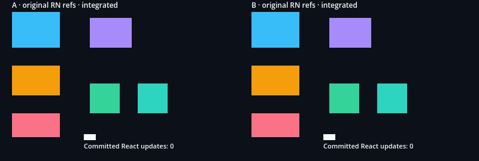

# Native EventTarget inside the original renderer batch

Local execution: official Godot 4.7.2, macOS arm64, RN 0.87.1, React 19.2.3
and Node 22.23.3. [Receipt](report.json) retains source/bundle/native digests,
original RN inputs, separate controls and two actual frames. This internal
opt-in does not enable public EventTarget flags or certify full RN parity.

Shared bundling inserts a hash-guarded selection into the pinned renderer's
existing batched callback. Typed/star Raw channels emit once, then the original
`dispatchNativeEvent` exclusively handles delivery before legacy extraction.
Original event/responder classes and the React scheduler are retained. Default
**generated renderer source** stays byte-identical to the delivered tag correction;
this is not an assertion about the complete default bundle.

| Executed lane | Godot checks | Result |
| --- | ---: | --- |
| Original selection, headless | 181 | Passed; native imperative touch absent |
| Integrated selection, headless | 206 | Passed; imperative touch delivers once |
| Integrated native viewport | 236 | Passed; 28 pixels and two captures |

The lanes share fixture/RN inputs/native host. Integrated adds original EventTarget
and ResponderEvent property checks; the full check-ID lists are not identical.
Both report exactly two intentional native errors, with no additional error,
registry warning, crash or leak marker. A separate Node assertion certifies
terminal-registry ordering. [Example and scene map](../../../examples/event-target/README.md).

Actual ScreenTouch/ScreenDrag delivery through Input.parse_input_event proves:

- Blue: imperative-only touch, with no JSX helper on its path. Original native
  delivery is zero; integrated delivers one trusted callback. Its explicit manual
  original positive is kept separate from native transport.
- Purple: four JSX/six imperative callbacks through current flattened ancestry.
  Raw channels/callbacks share the payload. Two functional updates produce one
  layout-effect commit after callbacks; Yoga/Control width and count follow it.
- Original receiver, refs, timestamps, capture/bubble, cancellation, transient
  cleanup and global event restoration. Touch-start callback priority is the
  recorded native default; this does not certify all scheduling categories.
- Faults recover on the next gesture. A combined grant/normal fault skips normal
  delivery in legacy; EventTarget executes both and reports its pending responder
  error. No fallback runs the other renderer; no universal first-error policy is claimed.
- Responder one/two-contact lifecycle, cancellation, real touched-leaf removal,
  held-root unmount and surviving-root recovery. Native root-local payloads match
  an original manual root-local oracle. Explicit global arrays are a separate
  sensitivity control, rather than mobile native certification.

Two native defects discovered by this probe are corrected:

1. React Delete enqueued PointerCancel after a beat, but the same pump erased
   its pointer registry entry before delivery. Only IDs pending before a beat
   retire after its work queue drains; backlog defers retirement. The preceding
   published host fails the normative registry-order assertion once in each lane.
   The identical queue-only fixture/check IDs/RN inputs pass on the corrected host.
   This control excludes the next crash case.
2. A real leaf tree_exiting callback could unmount its root and detach its
   ancestor while Godot already removed that child. The intermediate host crashes
   with engine signal11/SIGABRT in the original lane, producing no report. Root-scoped
   child-removal deferral fixes both current lanes. Revoked-origin pointer envelopes
   include queued null-target terminals; TouchCancel still cleans responders.
   B survives. Ordinary resize/free retains immediate detachment and its separate
   executed regression. Integrated was not executed in the crashing control.

Regression proof includes 235 Node/13 Python contracts, 18 overlay guards,
fresh native SDK pack/verify, loader89/21 and 13 actual adapter runs/213 checks.
The runtime includes resize-driven Surface destruction, unmount/remount and owner
changes; metadata does not substitute execution. The final independent consumer passes30 build/ownership and40 native checks;
all22 examples/2250 headless checks pass on the current host. Pointer processor,
error/projection, focus-command and647-per-variant tag regressions also pass. The [preceding hosted tag correction](../event-dispatch/report.json)
is confirmed at897b127; hosted CI for this new integration remains pending.

Imperative pointer native interest remains zero with a manual positive. Public
flags stay disabled. Four original experimental responder differences, the new
renderer selection's full flag matrix, dev renderer, complete ref types/PanResponder,
registered-null-target JS delivery, reentrant full-queue guarantees, performance,
hardware/mobile differentials and self-free during own descendant mutation remain
open. The unmount-only control does not certify that last case. GF-05/06/07/08/13
remain in progress; only GF-06's first host-validated semantic slice is complete.
