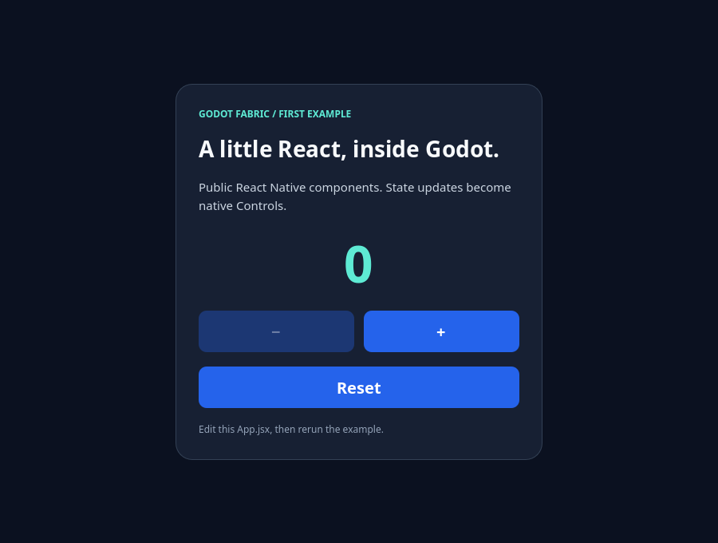
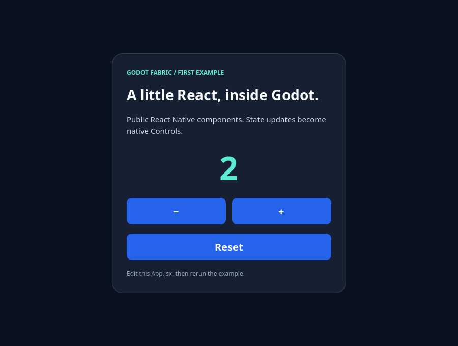

# Runnable example validation

This record validates the move to `examples/` and the new public React Native
counter. Runs used macOS arm64, official Godot 4.7.2, React 19.2.3,
React Native 0.87.1 and Hermes 250829098.0.17. Godot was not rebuilt.
These are local runtime results; the current PR's hosted jobs are separate proof.

## Acceptance

| Example | Headless | Native renderer with capture |
| --- | ---: | ---: |
| Counter | 19 | 24 |
| React | 36 | 36 |
| Layout | 47 | 47 |
| Input | 45 | 45 |
| Pressable | 43 | 47 |
| Scroll | 62 | 68 |
| Chart | 34 | 34 |
| NativeWind | 49 | 58 |
| Typography | 50 | 63 |
| **Total** | **385** | **422** |

**807 passing assertions in 18 sequential runs.** [matrix.json](matrix.json)
links every retained per-case report and its count. Reports contain native
snapshots, React observations and complete assertion results. The runner removes
old output and requires a fresh matching scene/display mode, nonempty passing
checks and the acceptance marker. Errors, crashes and timeouts fail the run.
[provenance.json](provenance.json) records source/evidence SHA-256 hashes for this
snapshot; the initial release's older hashes remain historical.

```sh
npm run test:examples
npm run test:examples -- --capture
npm run test:contracts
npm run check:static
npm run check:publication
npm run test:cold
npm run example -- parity --headless
```

The contract suite passed 21 Node tests and 8 Python fixtures. Static analysis,
publication scope and the nine-case Godot oracle passed. Two fresh disposable
projects passed cold import, React/typography runtime and warm import; those
runs also exercise the retained root scene aliases. The existing cold-start
containment and its limits are explained in [cold-start evidence](../cold-start.md).

The hosted macOS job now runs every interactive example headless after its
uncached setup. Original RN iOS/Android jobs still compare the shared parity
fixture; no new mobile-Godot support is claimed.

## Public counter

The [source](../../../examples/counter/App.jsx) only imports React and public RN
View/Text/Pressable/StyleSheet. Its observations are optional harness code.
Logical Viewport pointer events on device 1001 trigger the original Pressability
path; the harness does not invoke React setters directly.

Checks cover disabled decrement, pressed styling, 0 → 1 → 2 → 1 → 0 updates,
one React mount, preserved native identity and balanced unmount. After stopping,
Controls/tags, contacts/responder and timers are empty and React cleanup ran once.
The graphical lane checks actual glyph pixels and changed value-region readback
hashes. Reports: [headless](counter-headless.json), [native](counter-native.json).





Images are Godot renderer readbacks of this generic fixture. They contain no
desktop applications, unrelated games or private configuration. Only these two
new captures are retained here; the original demos' captures remain in the
[initial release evidence](../README.md).

## Limits and organization

The [catalog](../../../examples/README.md) distinguishes public, internal and
mixed UI APIs. The eight original demos preserved their headless/native counts
after relocation. Public TextInput remains unavailable; internal input/scroll
editing checks do not certify that API. The parity fixture remains identical
under `tests/parity/`; it is an automated reference case rather than a gallery.

These checks certify bounded prototype behavior on the supported macOS build.
Injected logical events are not physical OS input, IME, accessibility, DPI or
mobile certification. Independent consumer packaging and full RN compatibility
remain work in the [1.0 roadmap](../../../ROADMAP.md).
