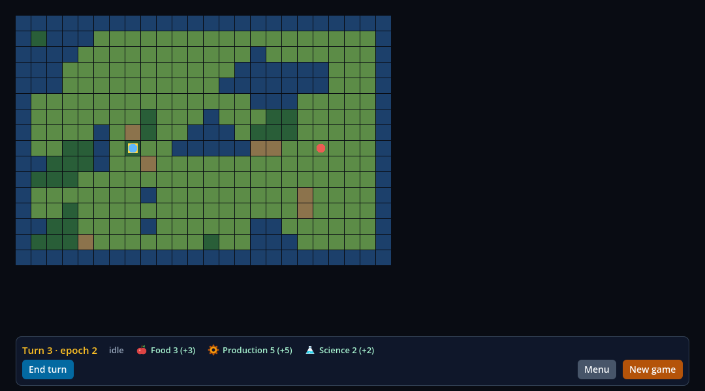
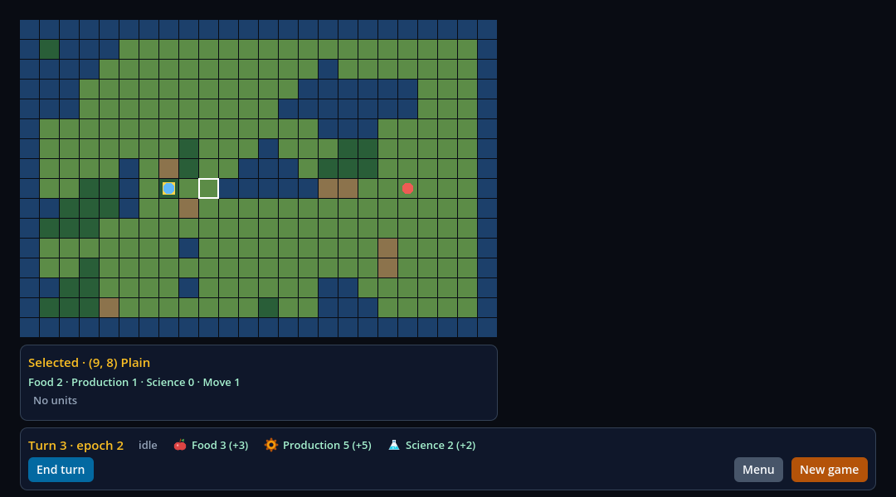
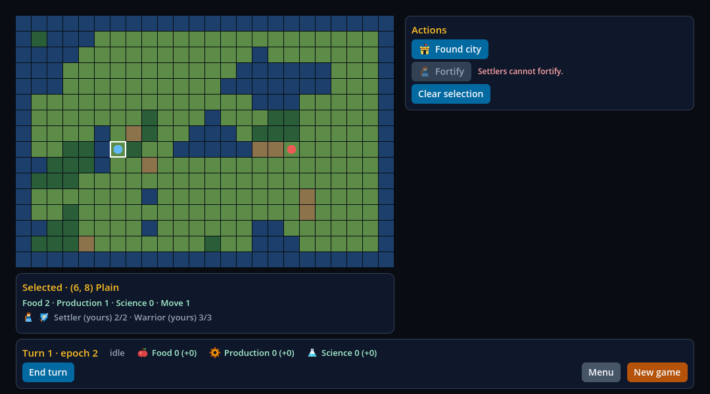
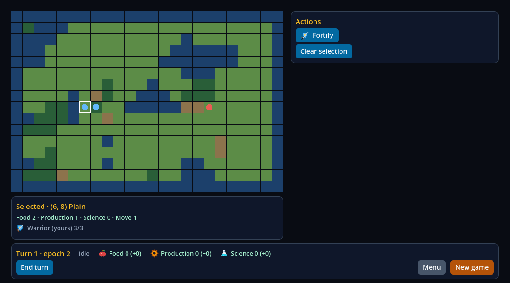
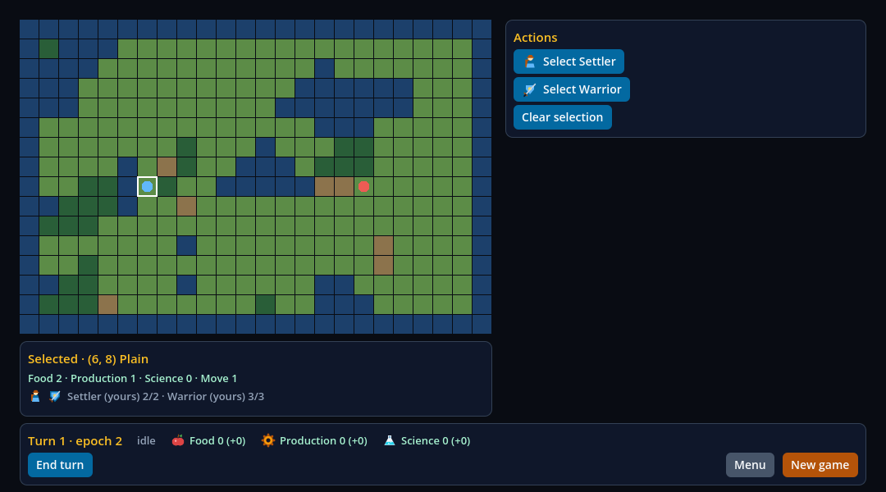
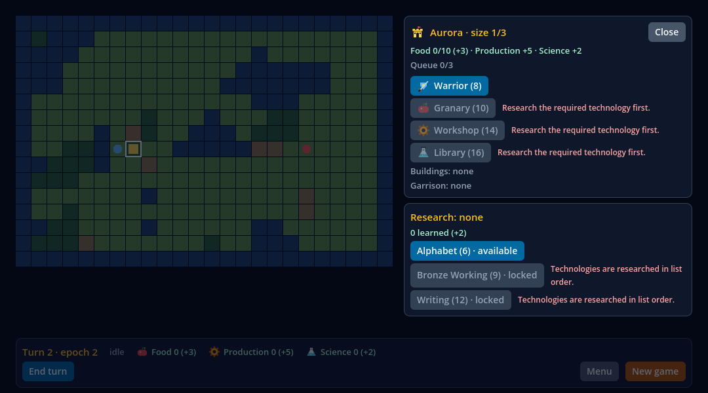
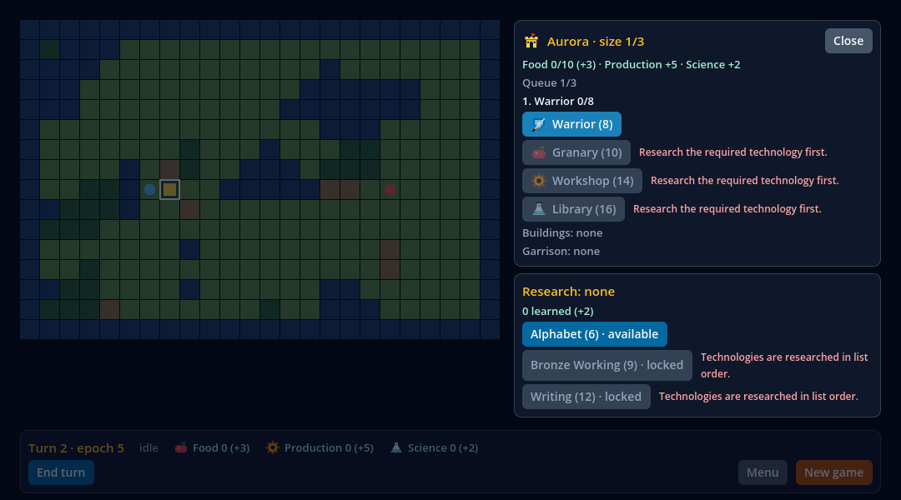
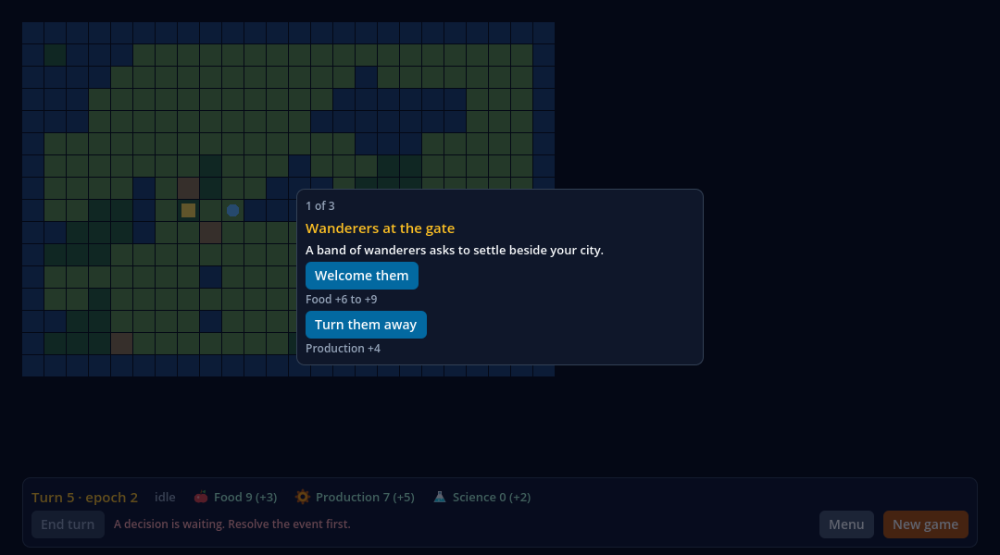
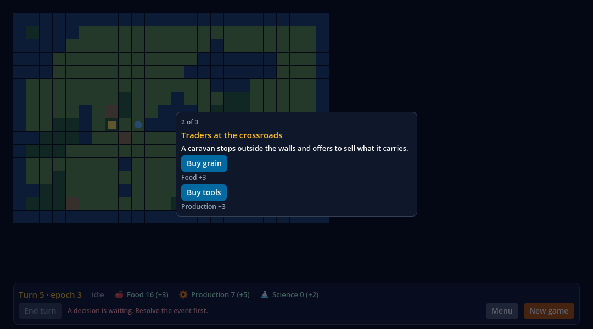
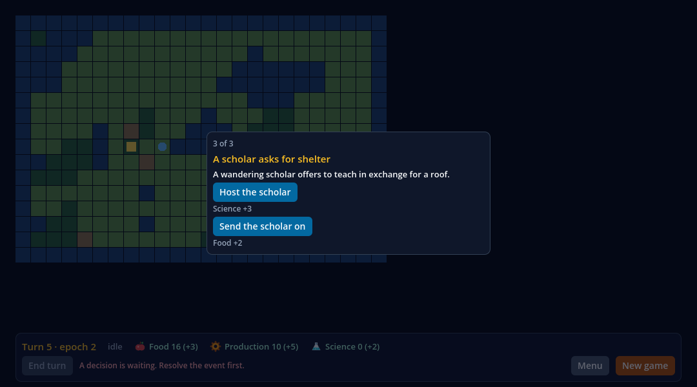

# Braço B do comparativo final: a HUD nativa do Godot passa a matriz de contexto (V05-10, critério `braco-b`)

Registro da entrega do braço B do V05-10: o mesmo jogo Frontier com uma HUD nativa do Godot escrita em GDScript (Controls, sinais, atualizando só o que mudou), com os
mesmos 6 painéis, 7 contextos e testIDs da HUD React Native do V05-05 (braço C), e a prova de que ela passa a regra de invalidação `parity` do
[protocolo](../../research/frontier-comparison-protocol.md): em cada um dos sete contextos os testIDs visíveis são os da tabela da matriz. Implementação em `d8bd678285efb13681e1a5d39fdec394069888b7`
(<https://github.com/journey-studios/godot-fabric/commit/d8bd678285efb13681e1a5d39fdec394069888b7>). O desenho e o que difere do braço C estão em [docs/research/frontier-arm-b.md](../../research/frontier-arm-b.md).

**Este registro não afirma nenhum resultado comparativo.** Nenhuma execução comparativa rodou. A passada de otimização do braço B (no máximo 3,2 h, uma rodada) foi feita e
mediu só o braço B, em headless e fora de qualquer execução comparativa ([Passe de otimização](#passe-de-otimização)); nada aqui diz que uma HUD é mais rápida, mais lenta ou mais barata que a outra. O esforço está registrado, não julgado. Fecham-se só o critério `braco-b` do V05-10
(sem tarefa, fase, sequência, checklist nem decisão tocados) e nenhuma tarefa do GF.

## O que foi executado

Localmente, macOS arm64, Godot 4.7.2 oficial, Node v22.23.3, no worktree do braço B a partir de `09ed8f7`. O host nativo foi reconstruído antes da primeira execução (o
preservado era anterior ao #104 e o `create-consumer` recusa um host que não bate com as fontes); a entrega não tem C++.

| Comando | Resultado |
| --- | --- |
| `node --test tests/civ-lite-ui-native.test.mjs` (as duas HUDs) | passou: HUD React Native 144 + 28 + 41 verificações, HUD nativa 144 + 28 |
| `node --test-name-pattern="native HUD" tests/civ-lite-ui-native.test.mjs --capture` | passou: mais as 8 capturas dos contextos e da fase da IA e as 4 dos overlays, em janela |
| `node scripts/civ-lite-ui-sabotage.mjs` | passou: as 20 variantes da lane (17 de antes e as 3 do braço B) rejeitadas pela sonda e pelo oráculo, as fontes restauradas byte a byte e a lane limpa passando depois (status 0) |
| `npm run test:consumer:civ-lite` | passou: 20 verificações de construção e posse, 165 nativas, 10 ciclos |
| `npm run test:civ-lite-game` | passou: o hash dourado do replay de 12 turnos não mudou |
| `npm run test:frontier-services` | passou: 11 testes |
| `npm run test:frontier-soak` | passou: 1 teste |
| `npm run test:frontier-turn` | passou: 1 teste |
| `npm run test:contracts` | passou: 490 testes de Node e 13 de Python, a validação do painel inclusive |
| `npm run type-check`, `npm run check:static`, `npm run check:publication` | passaram (0 achados; 2 028 arquivos varridos, sem falha) |
| `node scripts/milestone-guards.mjs --check --base origin/main` | passou: X9 e X10 limpos (contra 8f33064) |

## Paridade: os painéis de cada contexto

A mesma sonda (`hud_validation.gd`, sem uma linha alterada), na cena `res://main_native.tscn`, toca os passos 0 a 45 do replay pelos serviços e observa a HUD depois de cada um; os sete
passos de cobertura são os sete contextos. O oráculo independente (`tests/civ-lite-ui-oracle.mjs`, também sem alteração: a mesma tabela, os mesmos 46 passos, as mesmas regras)
julga o relatório cru e dá **0 achados**. Os testIDs de painel visíveis em cada passo de cobertura são exatamente os da tabela:

| Contexto | Passo | Painéis vistos na HUD nativa | Tabela |
| --- | ---: | --- | --- |
| `none` | 33 | `hud-bar` | `hud-bar` |
| `tile` | 32 | `hud-bar`, `hud-tile` | `hud-bar`, `hud-tile` |
| `settler` | 3 | `hud-bar`, `hud-actions`, `hud-tile` | `hud-bar`, `hud-actions`, `hud-tile` |
| `warrior` | 9 | `hud-bar`, `hud-actions`, `hud-tile` | `hud-bar`, `hud-actions`, `hud-tile` |
| `stack` | 2 | `hud-bar`, `hud-actions`, `hud-tile` | `hud-bar`, `hud-actions`, `hud-tile` |
| `city` | 18 | `hud-bar`, `hud-city`, `hud-research` | `hud-bar`, `hud-city`, `hud-research` |
| `dialog` | 45 | `hud-bar`, `hud-dialog` | `hud-bar`, `hud-dialog` |

Em todos os 46 passos a lista de ações é a do snapshot menos End turn (id, rótulo, habilitada, motivo, ordem), a barra diz o turno, a fase e os três recursos do snapshot, o End turn está
habilitado exatamente quando a ação `end_turn` do jogo diz, e nenhum Control da árvore que para o ponteiro cobre um ladrilho; o overlay cobre o mapa inteiro nos contextos `city` e
`dialog` e em nenhum outro. A fase do turno (13 quadros observados, todos os sete estados publicados, o spinner e o End turn certos em cada quadro, um segundo turno retido na fase
`ai_plan`) e a entrada real (clique, hover, painel, ação, menu e volta) também passam, nas 144 verificações da sonda.

## Como as sondas leem as duas HUDs

`hud_probe.gd` ganhou **um** ponto de leitura, o leitor (`hud_reader.gd`): `hud_reader_host.gd` é o código de antes (as linhas vêm do snapshot do host React Native) e `hud_reader_native.gd`
devolve as mesmas linhas dos Controls nativos, as do overlay inclusive. Cada Control é nomeado pelo seu testID, como o host nomeia os que monta; um Button do Godot guarda texto e ícone
como propriedades, e o leitor os relata como as linhas `<testID>-label` e `<testID>-icon` que a árvore do React Native tem como filhos. `modal` é "dentro do overlay". A cena diz qual
leitor vale (`Application/Runtime` é o do host); nenhuma sonda pergunta em que braço roda. O relatório traz `arm`.

A sonda de overlays (`overlay_validation.gd`) roda nos dois braços: a fila de três eventos, o bloqueio (100 cliques, 100 cliques com o botão direito e 100 giros da roda no mapa sob cada
overlay chegam 0 vezes ao mundo, e 100 de 100 com o overlay fechado), o Escape e o jogo novo. O que o braço B não pode dizer está listado no relatório e escrito no oráculo, que exige
que a lista seja exatamente a do braço: **não se aplica ao braço B** a lista de erros da aplicação depois do remonte (não há `Application`). O remonte do B tira a HUD da árvore e a
devolve, e o primeiro quadro já mostra o evento da cabeça da fila. O Escape, que antes só a sonda de estabilidade do braço C olhava, é agora uma etapa das duas: na tela da cidade é um
`clear_selection` e o overlay some, no diálogo nenhuma chamada chega ao jogo e a cabeça é a mesma (a sonda passou de 26 para 28 verificações nos dois braços). A sonda de estabilidade
é do host React Native e não roda no braço B.

## Contra-controle e sabotagens

**Contra-controle.** A mesma lane numa HUD nativa quebrada de propósito, cuja tabela ignora o contexto e monta as ações e o cartão do ladrilho nos sete, falha a matriz: categorias
`panels` (188 achados), `content` (72), `map` (14), `input` (2) e `phase` (2), 25 verificações da sonda, e os painéis vistos nos sete contextos são os mesmos três
(`hud-bar`, `hud-actions`, `hud-tile`). O oráculo rejeita 27 cópias mutadas do relatório genuíno do braço B (as da HUD React Native, agora sobre o relatório nativo) e 23 do relatório de
overlays, cada uma na categoria que quebra, e um relatório nativo que não lista o que não diz.

**Sabotagens retidas** (`scripts/civ-lite-ui-sabotage.mjs`, com a convenção de restaurar byte a byte; a receita é `build/civ-lite-ui-sabotage.json`). Cada uma é rejeitada pela sonda e pelo
oráculo pela regra que quebra:

| Sabotagem | O que quebra | Rejeitada por |
| --- | --- | --- |
| `native-city-shows-tile` | a tabela monta também o cartão do ladrilho no contexto `city` | a sonda (14 verificações, "a HUD mostrou ... para o contexto city") e o oráculo (`panels` e `remount`) |
| `native-overlay-not-blocking` | o overlay deixa de parar o ponteiro: ainda escurece o jogo, mas o mundo ouve os cliques, os cliques com o botão direito e a roda sob a tela da cidade e o diálogo | a sonda (5 verificações: o Modal cobre o mapa, 0 de 100 chegam ao mundo) e o oráculo (`map` e `blocking`) |
| `native-end-turn-by-phase` | o End turn é habilitado por uma regra da HUD (a fase é `idle`) e não pela ação `end_turn` do jogo | a sonda (2 verificações da barra, no contexto `dialog`) e o oráculo (`bar`) |

## Capturas

Janela do macOS, lane `--capture`, lidas uma a uma: os mesmos painéis e a mesma intenção de layout da HUD React Native, não o mesmo pixel (a fonte e a métrica de texto são as do Godot).

| Contexto | Captura |
| --- | --- |
| `none`: só a barra |  |
| `tile`: barra e cartão do ladrilho selecionado |  |
| `settler`: ações (Found city, Fortify recusada com o motivo), cartão |  |
| `warrior`: ação Fortify, cartão |  |
| `stack`: uma `select_unit` por unidade, cartão com os dois ícones |  |
| `city`: tela da cidade e pesquisa em overlay sobre o mapa escurecido, barra desabilitada por baixo |  |
| `dialog`: o evento "1 of 3" em overlay centralizado |  |
| fase da IA: spinner, fase `ai_plan`, End turn desabilitado com o motivo do jogo |  |

Os overlays da sonda de overlays: a tela da cidade com o Warrior na fila, e o diálogo em "1 of 3", em "2 of 3" depois do remonte e em "3 of 3".

|  |  |
| --- | --- |
|  |  |

## Extras pedidos depois da paridade (tempo à parte)

Dois pedidos do orquestrador, feitos depois de o braço B passar e que não são esforço do B:

- **A cena do braço A**, `consumers/civ-lite/main_bare.tscn`: a raiz `GameServices` e o `World` e nada mais (sem `HUDLayer`, `Application`, `FabricSurface` nem nó de validação).
  Sobe em headless e em janela com `--quit-after 60`, sai com 0 e não loga erro (a lane do braço B o confere); e uma execução avulsa tocou o replay inteiro pelos serviços na cena (77 passos,
  nenhum código diferente do roteiro, o hash dourado no fim, o `World` presente e nenhuma `CanvasLayer`). Nenhuma sonda roda nela.
- **O gancho para o executor do Agente 4**: a HUD nativa guarda o último snapshot que mostrou num só lugar (`_applied`, atribuído em `_show_game`) e o devolve por `applied_snapshot()`; o método
  do contrato do executor é trivial de acrescentar sobre ele, e o formato fica para quando o executor o der.

## Passe de otimização

A passada única do protocolo para o braço B (uma rodada: perfil, as mudanças que o perfil justifica, uma nova medida, parar; no máximo 3,2 h; só o B, com meios idiomáticos do Godot, fora de qualquer
execução comparativa e preservando a paridade). A base é a `main` em `151427e` (a janela de estresse e o `stats()` do #119 já dentro); a implementação está em `960b4adb101647f4794f3c8231f0f7668289886c`.
Os números brutos de cada execução estão em [optimization.json](optimization.json) e os quadros de cada ocorrência em [optimization-frames.json](optimization-frames.json).

**Como se mediu.** Um arnês de rascunho (não commitado) sobre a cena `main_native.tscn`, headless, um processo do Godot por execução, com o instrumento de tempo de CPU do #97. Ele toca as quatro janelas do protocolo pelo
nó `GameServices` como o roteiro de execução faz: `ai-phase` e `event-burst` (a segunda fecha quando `stats().events == notifications_emitted()`, depois de pelo menos cinco quadros) em dois jogos de 62 turnos, um sem seleção e um
com a tela da cidade aberta (o contexto mais pesado); `context-switches` com a rodada de 12 trocas de `tests/frontier-comparison-cycle.gd` (24 de aquecimento e 200 medidas, não as 50 do protocolo, para um p95 mais firme); e `stress`
(`stress_begin`, 20 `stress_step` um por quadro, dois quadros depois: 23 quadros; 2 rodadas de aquecimento e 30 medidas; `stress_end` fora da janela). O "antes" é o `native_hud` do `origin/main` numa cópia de rascunho, sem a WIP. O
"depois" é a árvore de trabalho. Foram 5 execuções de cada, alternadas (a ordem se inverte a cada par). Por ser headless não há desenho: o tempo é o de script e de layout. A máquina era compartilhada (carga de 1 minuto entre 4 e 10, longe
dos 2,0 do protocolo) e andou em estados mais lentos, então um trecho fixo de GDScript, com dados próprios, foi cronometrado entre as fases de cada execução; as colunas "normalizado" dividem cada fase pela média das duas calibrações
em torno dela sobre 82 µs (o estado mais rápido visto). Nada disto entra em estatística alguma do comparativo.

**O que o perfil mostrou** (na `main`, medianas das execuções):

- **`ai-phase` com a cidade aberta.** O primeiro quadro, o que aceita o End Turn, custa 6,7 ms, dos quais 4,6 ms são o script da HUD: o jogo desabilita todas as escolhas e dá a cada uma o seu motivo, e as listas das ações, da cidade e da
  pesquisa eram destruídas e refeitas inteiras. É o p95 da janela (7,9 ms).
- **`context-switches`.** A troca que abre a tela da cidade custa 9,1 ms por ocorrência: instanciar, `add_child` e a primeira renderização de dois painéis (cerca de 1,3 ms de script) e o layout deles. As outras trocas ficam entre 1,4 e 4,3 ms.
- **`stress`.** O quadro que começa o modo custa 35 ms (16 ms de script: montar 300 Labels) e cada passo, de 1,0 a 2,0 ms por quadro, crescendo com o passo. Do script do passo (0,49 ms), uma renderização que não muda nada já custava 252 µs
  (derivar as chaves e os textos de 300 linhas por `map`, e perguntar a cada linha se mudou) e criar o Label da linha nova era a maior parte do resto.
- **`event-burst` e o `ai-phase` sem seleção** são leves (p95 de 0,7 e 1,9 ms) e não pedem mudança.

**O que mudou e por quê.** 240 linhas inseridas e 69 retiradas em 7 arquivos (`git diff origin/main` nos caminhos):

1. **Listas atualizadas no lugar** (`kit.gd` +73 −7, `actions.gd`, `city.gd`, `research.gd`): `Kit.sync_choices` e `Kit.sync_lines` levam as linhas à nova descrição uma a uma (a linha que continua é atualizada onde difere, uma chave nova faz uma linha, uma que saiu perde a sua; o
   motivo de uma recusa é um Label feito quando é preciso e escondido quando não). Era a WIP, e o perfil a justifica: é o quadro 0 do `ai-phase` com a cidade.
2. **Painéis guardados fora da árvore** (`hud.gd` +57 −22): um painel que sai do contexto vai inteiro para um pool por nome (`_pool`, `_take`, `_unmount`) e volta com `add_child` mais uma renderização que só toca o que mudou; o diálogo e o menu
   continuam sendo feitos de novo e liberados, porque cada evento é uma subárvore própria. Também era a WIP; paga na troca para a cidade.
3. **Painel de estresse incremental** (`stress.gd` +85 −13, novo): compara as listas novas com as últimas mostradas (duas comparações nativas) em vez de perguntar a cada linha; o log que avançou por linhas inteiras não toca nas 199 que ficaram, a linha que sai
   recebe a chave e o texto da que entra e vai para o fim (um Label é o que um passo tem de mais caro), e só um item de produção que mudou tem o texto reposto; qualquer outra mudança (o modo recomeçou, um salto na sequência) cai na reconciliação completa de antes.
4. **`scripts/civ-lite-ui-sabotage.mjs`** (+2 −2): a variante `native-stress-rows-rebuilt` procurava um trecho do `stress.gd` que não existe mais; passou a quebrar o trecho novo (descarta as linhas a cada renderização) e continua dizendo a mesma coisa.

Da WIP nada foi descartado, e duas coisas foram consideradas e não feitas: manter o painel de estresse escondido dentro da árvore (poria 330 nós permanentes na leitura de nós do fim da execução) e qualquer virtualização da lista (as linhas precisam ser Controls
com testID).

**Resultado** (5 execuções de cada; medianas das execuções do p50, p95, média por quadro e soma dos quadros de uma ocorrência; ms):

| Janela | p95 antes → depois | p50 antes → depois | média antes → depois | ocorrência (soma) antes → depois |
| --- | --- | --- | --- | --- |
| `ai-phase`, cidade aberta | **7,95 → 3,51 (−56%)** | 0,40 → 0,77 (+89%) | 1,70 → 1,13 (−33%) | 8,48 → 5,65 (−33%) |
| `ai-phase`, sem seleção | 1,91 → 1,96 (+2%) | 0,49 → 0,54 (+9%) | 0,69 → 0,75 (+8%) | 3,47 → 3,74 (+8%) |
| `event-burst`, cidade aberta | 1,49 → 1,46 (−2%) | 0,08 → 0,07 (−7%) | 0,27 → 0,30 (+11%) | 1,37 → 1,52 (+11%) |
| `event-burst`, sem seleção | 0,70 → 0,73 (+4%) | 0,07 → 0,08 (+8%) | 0,16 → 0,19 (+13%) | 0,82 → 0,93 (+13%) |
| `context-switches` | 4,63 → 4,32 (−7%) | 0,093 → 0,095 (+2%) | 1,09 → 0,96 (−12%) | 3,27 → 2,87 (−12%) |
| `stress` | 3,50 → 3,41 (−3%) | 1,36 → 0,93 (−31%) | 2,79 → 2,26 (−19%) | 64,2 → 51,9 (−19%) |

Normalizado pela calibração, os mesmos pares dão p95 −62% (`ai-phase`, cidade), −17% (trocas) e −10% (estresse). Os p95 por execução da `ai-phase` com a cidade não se sobrepõem (antes 7,55 a 8,22; depois 3,45 a 3,95); os das trocas
(3,73 a 4,80 contra 3,85 a 4,44) e os do estresse (2,52 a 20,3 contra 3,32 a 3,57) se sobrepõem, e o que se pode dizer deles é só que não pioraram. O primeiro quadro da `ai-phase` com a cidade aberta caiu de 6,7 para 3,2 ms (o script da HUD nele, de 4,6 para 0,9 ms, numa execução de diagnóstico à parte). A troca `map-city` caiu de 9,1 para 5,6 ms por ocorrência (o pool) e as outras seis
trocas de seleção ficaram onde estavam; no estresse o script do passo caiu de 492 para 121 µs, os quadros de passo de 1,0–2,0 para 0,7–1,4 ms, e uma renderização sem mudança de 252 µs para 0,8 µs.

**O que não melhorou, ou piorou.**

- Os quatro quadros que seguem o primeiro da `ai-phase` com a cidade aberta custam de 0,1 a 0,3 ms **a mais** (a mediana da janela sobe de 0,40 para 0,77 ms): as linhas que ficam no lugar, com o Label do motivo
  mostrado e escondido em vez de refeito, deixam mais trabalho de layout nesses quadros. A soma por ocorrência ainda cai um terço. A causa não foi isolada.
- O quadro que começa o estresse segue em cerca de 30 ms (35 antes): é entrar na árvore com 300 Labels, e o pool só tira a criação. Não pesa no p95 da janela (são 30 dos 690 quadros, menos de 5%), mas pesa no p99 e na média.
- Desmontar custa um pouco mais de script (o fim do estresse, 0,73 → 1,03 ms; a volta da cidade para nada, 0,28 → 0,43 ms), porque o painel vai ao pool em vez de ser liberado depois.
- O pool mantém vivos mais objetos (1 640 → 2 419 ao fim da execução; nenhum na árvore, que segue com 32 nós), e isto aparece na memória residente da leitura do fim.
- `ai-phase` sem seleção e `event-burst` não mudaram (as diferenças ficam dentro da dispersão entre execuções, de uns 10%).

**Paridade e custo do `stats()`.**

- `node --test tests/civ-lite-ui-native.test.mjs` (as duas HUDs, com a etapa de estresse): 2 de 2, na árvore final.
- As cinco sabotagens nativas pelo filtro de variantes do script (`native-stress-rows-rebuilt` na sonda e no oráculo `stress`, `native-stats-miss-turn-ended` em `stats`, `native-city-shows-tile` em `panels` e `remount`, `native-overlay-not-blocking` em `blocking` e `map`,
  `native-end-turn-by-phase` em `bar`) foram rejeitadas, o controle passou e as fontes voltaram byte a byte.
- O custo de uma leitura do `stats()` do B não mudou: o código é o mesmo, e as quatro leituras (20 000 leituras cada) deram 0,50 e 0,90 µs na `main` e 0,87 e 0,95 µs na árvore otimizada; a diferença entre elas é o estado da máquina.

**Tentativas que não contam.** A primeira medida do "depois" foi inválida: a cópia de rascunho não tinha os ícones importados (8 920 erros de carga, scripts que não compilavam) e foi posta de lado. As duas séries seguintes
(sem calibração dentro da execução) pareciam mostrar um processo mais lento na árvore nova, por causa de um laço de referência do fim da execução (142 a 172 µs contra 82 a 87 µs na `main`); as calibrações entre as fases, acrescentadas depois, deram a mesma
máquina nas duas árvores (78 a 151 µs em execuções de qualquer uma das duas, a máquina andando em estados mais lentos e mais rápidos), e o que sobrou foi um efeito do laço do fim, que na árvore nova roda depois de renderizações repetidas que agora custam quase nada e não
mantêm a CPU ocupada (não isolado). Uma série calibrada ainda sobre a árvore anterior à mudança que reaproveita a linha que sai do log também foi posta de lado. Todas estão em `optimization.json`, em `attempts`, com os números; a
comparação acima é a última, feita com a árvore final.

**Tempo.** **2,18 h** de tempo ativo de subagente, medidas pelo orquestrador sobre a transcrição pela regra da emenda: 0,46 h de 07:25:50 a 07:53:28 UTC (até a parada pedida para a janela de estresse) e 1,72 h de 10:12:34 a 11:55:30 UTC (a retomada), dentro das 3,2 h.

**Uma rodada, com uma ressalva.** As mudanças entraram em dois passos: a reconciliação das listas e o pool de painéis na primeira sessão, e a reciclagem da linha que sai do log do painel de estresse na retomada, acrescentada depois de uma série calibrada intermediária (a posta de lado acima). O painel de estresse só existia desde o #119, depois da primeira sessão, e a medida final (5 contra 5, alternadas) é uma só, sobre a árvore final; mas o registro diz que essa última mudança veio depois de uma medida, e não antes, como uma rodada estrita pediria.

## Esforço

| | Braço B (HUD nativa) | Braço C (HUD React Native) |
| --- | ---: | ---: |
| Arquivos da HUD | 22 (12 `.gd`, 8 `.tscn`, `theme.tres`, `main_native.tscn`) | 13 (`ui/hud/*` 10, `ui/store.ts`, `ui/telemetry.ts`, `ui/index.tsx`) |
| Linhas da HUD | 1 310 (736 de `.gd`, 371 de `.tscn`, 179 do tema, 24 da cena) | 698 (663 sem `icons.ts`) |
| Leitor das sondas | `hud_reader.gd` 57 + `hud_reader_native.gd` 110 = 167 linhas novas; `hud_reader_host.gd` (74) é o código do braço C movido | |
| Sonda compartilhada | `hud_probe.gd` +32 −41, `overlay_validation.gd` +42 −8 (o Escape), `stability_validation.gd` −10 | |
| Jogo e HUD React Native | `services/game_services.gd` +5 −2 (uma busca que tolera a falta de `Application`) | sem alteração |
| Tempo ativo de subagente | **1,71 h** medidas pelo orquestrador sobre a transcrição, pela regra da emenda (a soma dos intervalos menores que 30 minutos entre eventos; nenhum intervalo passou de 10 minutos, então o corte não muda o número), de 05:18:39 a 07:01:02 UTC de 2026-10-10. O número inclui os dois extras pedidos no meio do trabalho (a cena `main_bare.tscn` do braço A e o `applied_snapshot()`), que o implementer estima em cerca de 0,2 h e que não se separam da transcrição; o braço B ficou portanto em no máximo 1,71 h do time-box de 12,8 h | 12,8 h (7,35 + 5,12 + 0,12 + 0,19, na emenda do protocolo) |

As linhas do B contam a cena e o tema, que no C vivem dentro do TSX; sem eles são 736 linhas de script contra 698 de TSX/TS. A medida do tempo é a do protocolo: a soma dos intervalos
de menos de 30 minutos entre os eventos com carimbo da transcrição, e o orquestrador a refaz da transcrição. Nenhuma conclusão de custo sai deste quadro: ele alimenta o critério.

## O que a lane achou

- **Uma cena sem `Application` não era silenciosa.** O `GameServices` ligava `$Application.runtime_available` em `_enter_tree`, e a cena nativa falhava com `Node not found: "Application"`
  e um erro de script, ao contrário do que a especificação supunha. A correção são quatro linhas (`get_node_or_null`, ligar só se houver); em toda cena com `Application` o nó faz o que fazia.
- **O ícone de um Button some com `expand_icon`.** Num Button do tamanho do texto o ícone colapsava; a constante `icon_max_width` do tema o desenha em 20 px.
- **O giro da roda atravessa um Control que para o ponteiro.** A primeira execução reprovou "um clique e um giro da roda num painel não chegam ao mundo": o GUI marca o clique como tratado,
  mas o giro segue para `_unhandled_input`. A raiz da HUD o reivindica enquanto `gui_get_hovered_control()` não é nulo, e por isso precisa vir depois do mundo na árvore, como a Surface do C.
- **Um leitor não pergunta a árvore ao nó que lê.** A primeira versão do leitor do host usava o `get_tree()` do próprio Control, nulo para um Control que o host desmonta; usa o da HUD.

## Limites

- Execução local em macOS arm64 (a lane headless e as capturas em janela). A CI hospedada e o Pages do squash `4c3abb7` estão na seção [CI hospedada e Pages](#ci-hospedada-e-pages).
- A sonda de estabilidade (20 aberturas e fechamentos, vazamentos, foco, ícones) é do host React Native e não roda no braço B. O braço B não tem o equivalente medido de vazamento, foco e
  ícones; isto fica aberto para as execuções.
- O hover e o clique foram exercitados com eventos sintéticos pela viewport (e em janela, nas capturas), sem mouse físico. iOS, texto digitado e IME, imagens de rede e outras
  plataformas estão fora.
- As medidas de tempo de quadro do braço B são só as do passe de otimização (headless, máquina compartilhada, B sozinho) e não entram em estatística nenhuma do comparativo. Memória, partida, pacote e as medidas comparativas são da `execucao` e da `metricas`.

## Abertos

| Item | Dono |
| --- | --- |
| Passada de otimização do braço B: feita, ver [Passe de otimização](#passe-de-otimização) (o p95 da `ai-phase` com a cidade cai 56%; o resto, ver a tabela) | V05-10 |
| `execucao`, `metricas`, `mudanca` e `relatorio` | V05-10 |

## Pins

O commit de implementação é `d8bd678285efb13681e1a5d39fdec394069888b7`. O `report.json` guarda o SHA-256 de cada fonte que as lanes rodaram, dos relatórios e das capturas.

## CI hospedada e Pages

**O run.** Desde o #88 um push da `main` não roda as suítes nativas, então o recibo vem do workflow Contracts **disparado à mão** sobre a `main` em
`4c3abb7`, o squash do #113 (run [38034333213](https://github.com/journey-studios/godot-fabric/actions/runs/38034333213), evento `workflow_dispatch`,
ramo `main`). O run passou nos **oito jobs**, todos com o checkout em `4c3abb7`.

**Os passos.** Os dois rodaram no job `native-suites-runtime`:

- `npm run test:civ-lite-ui` (passo 61, 3 min 35 s) passou os seus dois testes (TAP 2 de 2): o da HUD React Native, que imprime `CIVLITE_UI_LANE_PASSED: 144 + 28 + 41 probe checks`, e o da HUD nativa, que imprime `CIVLITE_UI_NATIVE_PASSED: 144 + 28 probe checks on the native HUD; 27 + 23 oracle mutations; control fails ["content","input","map","panels","phase"]`: a mesma matriz e a mesma sonda de overlays, julgadas pelos mesmos oráculos, e o controle que ignora o contexto falhando a matriz também na CI.
- `npm run test:consumer:civ-lite` (passo 60) imprime `CONSUMER_CHECK_PASSED: civ-lite: 20 build/ownership checks; 165 native checks; 10 cycles`.

O artefato `civ-lite-ui` (id 11664316123, 143.689 bytes, SHA-256 `d48d3007…`, 23 arquivos) traz os relatórios das duas HUDs, e `independent-civ-lite-consumer` (id 11664421091, SHA-256 `e8b4388e…`) os do consumidor. O job `contracts` passou `npm run test:contracts` (7, 43 e 518 testes de Node). O [recibo](hosted-ci.json) guarda os jobs, os passos, os digests e os arquivos dos artefatos.

**O Pages.** O push de `4c3abb7` rodou o workflow do Pages (run [38034328997](https://github.com/journey-studios/godot-fabric/actions/runs/38034328997), `build` e `deploy` em success, 43 testes do painel passando). O [recibo](publication.json) registra o deployment 6977719677 em success, o artefato `github-pages` que ele usou (id 11663099234, SHA-256 `001c9e0c…`) e que o `migration.json` publicado é o commitado em `4c3abb7`, com a entrada de atividade do braço B.

**O que continua só local:** as capturas, as sabotagens retidas da lane e a medida do tempo ativo sobre a transcrição.

O `--work-dir` abaixo é um exemplo: qualquer diretório fora do repositório serve.

```sh
node scripts/hosted-receipts.mjs --write --slice frontier-arm-b --work-dir "${TMPDIR:-/tmp}/godot-fabric-hosted-receipts"
node scripts/hosted-receipts.mjs --check
```
