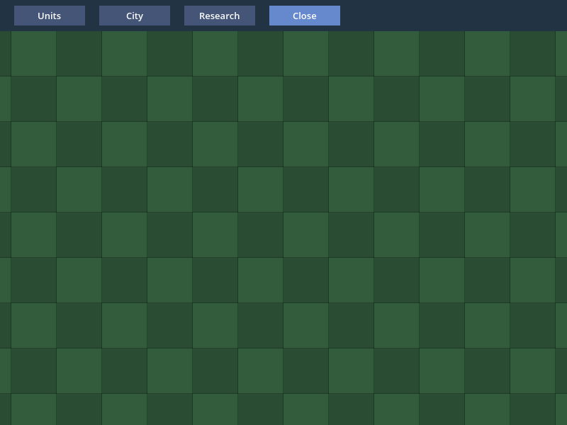
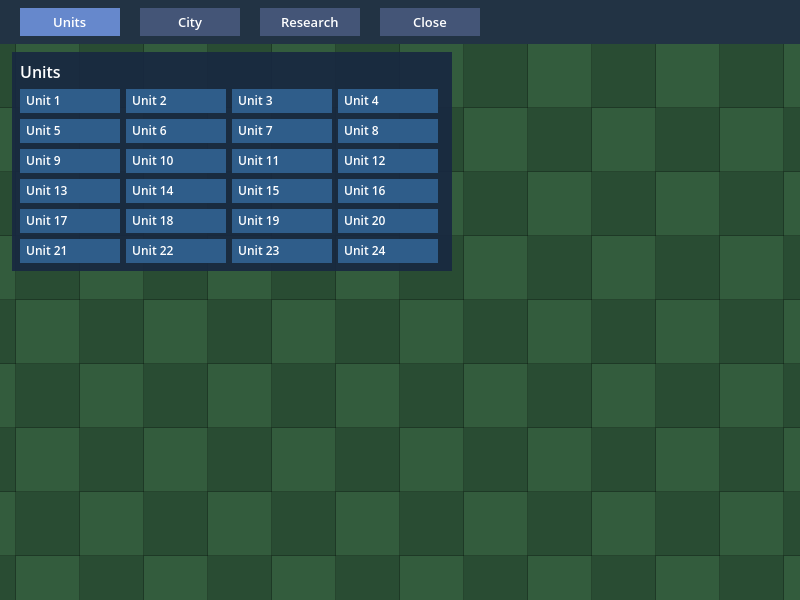
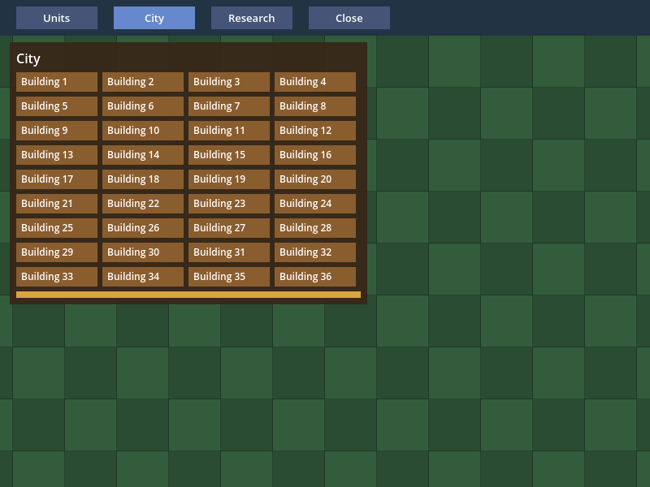
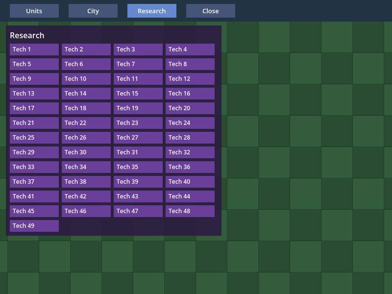

# A linha de base de desempenho do HUD do Frontier: o que custa trocar um painel no macOS

> **Registro fixado.** Os números, os fontes e os hashes abaixo são os da execução sobre o commit de implementação `346146d` e continuam
> valendo, e o recibo `execution.json` não foi regenerado. Uma execução hospedada (PR #77, job `native-cold-start`, run 37868943054)
> reprovou um único check do processo 2, o do heap em repouso (as 5 últimas voltas estáveis contra as 5 primeiras): o heap se move,
> sem tendência, entre quatro níveis (2.031.680, 2.032.000, 2.033.736 e 2.034.056 bytes), uma **faixa de ruído de 2.376 bytes**, mais
> larga que o limite de 2.048; o piso da primeira janela de 5 voltas foi 2.031.680 e o da última, 2.033.736, 2.056 bytes de diferença.
> O gate passou a comparar a **mediana** das duas metades das voltas estáveis medidas (as 15 primeiras contra as 15 últimas; `floor(n/2)`
> em geral), com o mesmo limite do GF-30 (2.048 bytes, importado, inclusivo). As duas séries hospedadas passam com crescimento 0, um
> vazamento de 200 bytes por volta sobre qualquer uma é recusado, e o menor vazamento recusado é de 137 bytes por volta num heap sem
> ruído (158 e 113 sobre as séries hospedadas). Um sorteio de 30 valores das 60 leituras hospedadas, repetido 200.000 vezes, reprova sem
> vazamento em cerca de 12,7% dos casos com o piso de janelas de 5 voltas, 4,2% com o piso das metades e 0,05% com a mediana das metades
> (um limite grosseiro: os transitórios reais vêm em sequências de uma a três voltas). Ver "O heap em repouso" na nota de pesquisa. A
> suíte atual, rodada de novo no mesmo código, passa. Onde este registro diz "5 voltas" no heap em repouso (a linha da lista abaixo e a da
> tabela da proposta), é o gate de `346146d`: nas duas execuções fixadas aqui o heap ficou em 2.032.000 bytes, e a diferença entre as metades é 0.

> **Atualização de 2026-10-09: a faixa janelada foi apresentada.** Uma execução da faixa sobre o commit
> [`1bc3a3c`](https://github.com/journey-studios/godot-fabric/commit/1bc3a3cc7d5d1a160f2158a87a5f8c623b504130) (a janela desenhável do #99) foi apresentada pelo display, nas cinco vagas, na primeira tentativa de cada; a
> seção [Faixa janelada apresentada (2026-10-09)](#faixa-janelada-apresentada-2026-10-09) e o recibo [`windowed-presented.json`](windowed-presented.json) fixam o tempo de quadro e a proposta que ele dá. O que as seções
> anteriores dizem do tempo de quadro como PENDENTE é o registro como estava e fica como foi escrito; o `execution.json` continua o de `346146d`, sem regenerar.

Esta fatia fecha o critério `baseline` do V05-06 do marco 0.5 Frontier (pacote P6) **na parte que não depende de um display**: uma linha
de base, na cena de prova do V05-02, de uma troca de painel do HUD de 50 a 100 nós nativos, estendendo o harness do GF-30, com a
**proposta** de orçamento registrada e não congelada. A pergunta: quanto custa, no macOS, o que o HUD do jogo mais faz no meio de um
turno, que é um clique numa barra de botões trocar o painel (unidades, cidade ou pesquisa) por outro? A resposta tem duas metades: as
contagens **exatas** (nós, criações, remoções, um clique, uma troca) e o **custo de CPU** da troca, que a suíte headless fixa neste
registro, e o **tempo de quadro de uma janela apresentada** (vsync ligado, 120 Hz), que ficou **PENDENTE** neste registro: nenhuma tentativa da faixa
janelada foi apresentada pelo display (a tela estava apagada), e a faixa, endurecida, recusou todas e terminou sem estatística de quadro. Uma execução de 2026-10-09 o fixou depois
(ver [Faixa janelada apresentada](#faixa-janelada-apresentada-2026-10-09)).
O [recibo](execution.json) fixa fontes, hashes, contagens, proveniência e resultados; a [nota de pesquisa](../../research/frontier-baseline.md)
tem a cena, o método, o protocolo janelado e a justificativa da proposta. Os critérios `turno`, `soak` e `congelado` do V05-06 seguem
abertos: esta fatia mede uma troca, não um turno do jogo, e o congelamento é um ato posterior e único.

Todo link de código abaixo está fixado no commit
[`346146d`](https://github.com/journey-studios/godot-fabric/commit/346146d4721c3082c495059d47d2ddc2ec7fc3e4) (árvore `a8681137`), que corrige a faixa janelada do
commit de implementação [`375b6e9`](https://github.com/journey-studios/godot-fabric/commit/375b6e932b36e4875ce8ed02e67fd0948c5784d3)
(a primeira fatia, sobre a main `7ef63ed`, o V05-02, #71). Os fontes rastreados eram iguais aos desse commit quando cada comando abaixo
rodou; os arquivos desta pasta e os documentos que apontam para eles estavam no working tree, sem commit, e não são entrada de nenhum
comando. Cada fonte executada, listada em `sourcePins` do recibo, tem o mesmo SHA-256 que o blob desse commit.

| Lane executada | Resultado | Observação |
| --- | --- | --- |
| Suíte headless, 2 processos Godot | 19/19 checks em cada (18 de julgamento e o de gravar o relatório) | 384 trocas por processo (2 voltas de aquecimento e 30 estáveis: 360, 30 por par ordenado), as mesmas linhas exatas nos dois processos; o oráculo independente aceita os dois relatórios |
| Replay do relatório gravado | 18/18 | O probe julga em Godot, sem a aplicação, os mesmos checks sobre as leituras gravadas |
| Negativos do relatório | 8 rejeitados, 2 aceitos, 11 incompletos recusados | Oito quebras feitas no relatório (nó vazado, remoções erradas, duplo press, clique que chegou ao mundo, painel sem o último nó, heap sem coleta, heap que cresceu 3.000 bytes, execução cortada) falham o probe e o oráculo, cada uma só no seu check; um transitório de 2.056 bytes na última volta e uma subida de exatamente o limite passam; 11 relatórios danificados dão status 2 e nenhum erro de script |
| Sabotagem `leaky-panel` | rejeitada | 9 checks do probe; oráculo: "A click showed its panel: the run was not cut short" |
| Sabotagem `no-gc` | rejeitada | 1 check; oráculo: "base: Hermes' heap is read after a collection" |
| Sabotagem `world-leak` | rejeitada | 9 checks; oráculo: "A click showed its panel: the run was not cut short" |
| Sabotagem `no-key` | rejeitada | 1 check; oráculo: "swap 5 (research to units): the host created the 50 nodes of the new panel" |
| Faixa janelada, host atual, janela do macOS | **NÃO APRESENTADA, código de saída 3**: 0 de 5 execuções, 3 tentativas rejeitadas como `unpaced: the display is not presenting` | A janela desenhou e o vsync leu `enabled` a 120 Hz, mas nada deu ritmo ao laço (mediana ociosa de 0,70 ms, contra os 4,167 ms mínimos): **nenhuma estatística de quadro**. A execução só de capturas passou (5/5 checks) |
| Host anterior | **N/A** | A fatia não muda C++: não há host a comparar; o controle são as quatro sabotagens |

As quatro sabotagens quebram uma fonte de propósito (`scripts/frontier-baseline-sabotage.mjs`, com `guardSources`): o arquivo de veredito de
cada variante é apagado antes de rodá-la e um arquivo ausente conta como não rejeitada; as fontes voltam byte a byte (SHA-256 igual antes e
depois, no recibo) e o script termina com uma rodada da fonte genuína, que passou.

**Ambiente**: macOS 26.6.2 (25G83) arm64 num Apple M3 Pro (`Mac15,6`, 11 núcleos lógicos, 18 GB); Godot oficial 4.7.2 (`ed1daf0bf`), RN 0.87.1,
React 19.2.3, Hermes 250829098.0.17 e Node v22.23.3. A suíte roda em modo headless (`opengl3` nomeado, sem display); a faixa gráfica numa janela
real de 800 × 600 na tela embutida (`Color LCD`, 1512 × 982 pontos, 3024 × 1964 pixels, 120 Hz, escala 2) com o renderer `gl_compatibility` (adaptador
`Apple M3 Pro`), com o **vsync lido de volta da janela como `enabled` e a taxa da tela como 120,0 Hz**. O host nativo é o da main, compilado por
`npm run setup` nesta árvore (`c78aadd3…`); a fatia não o muda.

**Carga do sistema**. O Mac não estava ocioso: outros agentes rodavam trabalho ao mesmo tempo, na mesma máquina (inclusive suítes Godot em outras
worktrees). O `vm.loadavg` de 1 minuto, antes e depois de cada comando:

| Comando | `vm.loadavg` antes | depois |
| --- | --- | --- |
| `npm run test:frontier-baseline` | `{ 7.18 5.75 5.54 }` | `{ 5.36 5.65 5.53 }` |
| `node scripts/frontier-baseline-sabotage.mjs` | `{ 7.61 6.18 5.73 }` | `{ 4.16 5.06 5.32 }` |
| faixa janelada, tentativa 1 (rejeitada) | `{ 5.17 5.22 5.37 }` | `{ 5.77 5.35 5.41 }` |
| faixa janelada, tentativa 2 (rejeitada) | `{ 5.77 5.35 5.41 }` | `{ 5.79 5.37 5.42 }` |
| faixa janelada, tentativa 3 (rejeitada) | `{ 5.79 5.37 5.42 }` | `{ 6.68 5.60 5.50 }` |

Os tempos abaixo são, portanto, uma linha de base desta máquina **como ela estava**, e não o seu melhor caso; as contagens exatas não dependem disso.

Os comandos, na ordem em que rodaram:

```sh
npm run test:frontier-baseline
node scripts/frontier-baseline-sabotage.mjs
caffeinate -d node scripts/frontier-baseline-graphics.mjs        # saiu com 3: não apresentada
node tests/frontier-baseline-native.test.mjs --replay=build/frontier-baseline-current-report.json
```

## CI hospedada e Pages

O push da `main` em `3bb51d6` (o squash do #77, run
[37884924042](https://github.com/journey-studios/godot-fabric/actions/runs/37884924042) do workflow Contracts) passou nos
cinco jobs na primeira tentativa, sem reexecução: `contracts` (2 min), `reference-android` (5 min), `reference-ios` (8 min),
`native-cold-start` (51 min) e `parity-comparison` (21 s). O [recibo](hosted-ci.json) confere o run, o PR e o artefato
contra a API do GitHub e os logs:

- **O checkout.** Todos os jobs usaram `3bb51d6`, e a árvore do head do PR (`c5c914f`) é a árvore do squash.
- **O passo da fatia.** `npm run test:frontier-baseline` (passo 38, 3 min) passou: `# tests 1`, `# pass 1`, `# fail 0`, o
  teste em que os painéis da HUD trocam por um clique real com as contagens exatas de nós, criações e remoções e o host volta
  à base. O job `contracts` passou `npm run test:contracts` (7, 43 e 352 testes de Node e 13 de Python), e nele os 8 testes de
  `tests/frontier-baseline-graphics.test.mjs` e os 10 de `tests/frontier-baseline-heap.test.mjs` (o julgamento da faixa janelada e
  o da série de heap, que rodam sobre dados e não abrem janela), além de `check:static` e `check:publication`.
- **O artefato.** `native-frontier-baseline` (id 11596358583, 400.062 bytes, SHA-256 `3ad621bf…`, igual ao digest da API e ao
  do log de upload) tem 6 arquivos, e o recibo fixa o SHA-256 de cada um. O log dele imprime `FRONTIER_BASELINE_PASSED: 19`, os
  19 checks da suíte headless desta página. O recibo guarda a duração do passo e nenhuma medição do probe: as contagens exatas
  valem em qualquer ritmo, e os tempos e percentis desta página são os da máquina local.

O [Pages](publication.json) rodou sobre o mesmo squash (run
[37884924120](https://github.com/journey-studios/godot-fabric/actions/runs/37884924120), build e deploy em success, 43 testes
do painel). O deployment 6953105313 está em success, o artefato `github-pages` (id 11595901432, SHA-256 `5938a996…`, igual ao
digest da API e ao do log de upload) tem 15 arquivos, e o `migration.json` de dentro tem os mesmos bytes do
`dashboard/migration.json` do squash e a entrada de atividade `milestone-0-5-v05-06-baseline-headless-ebfe8a0`. Um push
seguinte da `main` substitui o deployment, então o site público não foi comparado.

Continua só local: a faixa janelada (que nunca roda na CI; a execução apresentada de 2026-10-09 é local), as quatro capturas, as sabotagens retidas e a
repetição do relatório gravado.

## Leitura

**Esta é uma linha de base e uma proposta, não um orçamento, e a faixa headless não diz nada sobre o tempo de quadro (o da janela apresentada está em [Faixa janelada apresentada](#faixa-janelada-apresentada-2026-10-09)).** O achado principal: o host monta o painel
novo **dentro do `flush` que entrega o clique** (o evento de ponteiro, a atualização do React, o commit e o mount rodam nele), então os nós já
existem quando `Input.flush_buffered_events()` volta: **0 quadros** depois do flush, em todas as 720 trocas estáveis dos dois processos. Quanto custa
esse flush depende dos nós criados: **uma troca que cria 100 nós custa 9,2 ms de CPU na mediana e 12,4 ms no p95 (sobre 180 trocas dos
dois processos), mais que o período de 8,33 ms de uma tela de 120 Hz**; criar 50 custa 5,9 ms na mediana (p95 de 8,6 ms), abaixo desse período na mediana e acima dele no p95, e só apagar 50 a 100 custa de
1,8 a 2,4 ms. Do custo de uma troca de 50 nós, a maior parte é JavaScript (a renderização e o commit do React), uma parte menor é o mount no host e o layout do Yoga é
pequeno. O que isso vira em tempo de quadro numa janela apresentada não estava medido neste registro e foi medido depois: ver [Faixa janelada apresentada](#faixa-janelada-apresentada-2026-10-09).

## O que o probe prova

O [probe](https://github.com/journey-studios/godot-fabric/blob/346146d4721c3082c495059d47d2ddc2ec7fc3e4/tests/frontier-baseline-probe.gd) instancia a [cena](https://github.com/journey-studios/godot-fabric/blob/346146d4721c3082c495059d47d2ddc2ec7fc3e4/examples/frontier-baseline/scene.tscn) (o mundo do V05-02, sem mudança: o
mapa de 24 × 16 tiles sob uma `Camera2D` com zoom 2, mais uma `FabricSurface` em tela cheia com o `IGNORE` por padrão e uma `FabricApplication` com o
[fixture](https://github.com/journey-studios/godot-fabric/blob/346146d4721c3082c495059d47d2ddc2ec7fc3e4/tests/frontier-baseline-fixture.jsx)) e troca o painel por um **clique real**: a injeção do próprio V05-02
([`tests/world-input-driver.gd`](https://github.com/journey-studios/godot-fabric/blob/346146d4721c3082c495059d47d2ddc2ec7fc3e4/tests/world-input-driver.gd), `preload` e não cópia) entrega um movimento, um press e um release no centro do
botão pelo `Input.parse_input_event`, de uma vez, por `Input.flush_buffered_events()`. O HUD usa só `View`, `Text` e `Pressable`, com as props que a
política do P5 aceita (`style`, `testID`, `pointerEvents`, `onPress`); nenhuma foi recusada. Os painéis são árvores de HUD (uma raiz, um cabeçalho, chips de
`View` + `Text` e, na cidade, uma barra de produção) de **50 (`units`), 75 (`city`) e 100 (`research`) nós nativos**, e 0 (`empty`, a base, que tem 12 nós
nativos e 19 nós na SceneTree). Uma **volta** do percurso faz as 12 trocas, uma por par ordenado dos quatro painéis, e termina na base; cada processo faz 2
voltas de aquecimento e 30 estáveis. Depois de cada troca o probe lê, pelo [sampler compartilhado](https://github.com/journey-studios/godot-fabric/blob/346146d4721c3082c495059d47d2ddc2ec7fc3e4/tests/performance-sampler.gd) (o mesmo do soak do
GF-30), as contagens do motor e a seção `performance` do host com o heap do Hermes depois de uma coleta forçada. O [oráculo](https://github.com/journey-studios/godot-fabric/blob/346146d4721c3082c495059d47d2ddc2ec7fc3e4/tests/frontier-baseline-oracle.mjs)
deriva do zero os tamanhos dos painéis (a raiz, o cabeçalho, 2 nós por chip e a barra), as trocas do percurso e as contagens, recalcula os percentis
registrados das amostras cruas e passa as séries do host pelo `verifyReading` do oráculo do GF-30. O que a suíte **julga**, exato, nos dois processos:

- depois de toda troca, a SceneTree, o monitor de nós do Godot, as views nativas do host e a Surface têm os nós da base mais os do painel novo, e o Godot
  não conta nenhum órfão além da base;
- toda troca **cria** os nós do painel novo e **apaga** os do antigo (nos contadores do host, nos da Surface e no snapshot da aplicação lido em volta do clique);
- quando a árvore tem o painel novo, o snapshot da Surface tem o último nó dele e a raiz de nenhum outro painel;
- todo clique troca **exatamente uma vez** (um press no botão do painel novo, uma mudança do estado do React) e **nenhum evento dele chega ao mundo Godot**
  (`world.received` vazio);
- toda volta termina na base (nós, órfãos, views nativas e a única raiz) e toda leitura do heap do Hermes segue uma coleta forçada;
- o heap vivo em repouso, lido depois de 30 quadros ociosos no fim de cada volta, não cresce do piso das 5 primeiras voltas estáveis ao das 5 últimas mais que
  o limite do GF-30, 2.048 bytes (importado, inclusivo): o piso, porque uma leitura pode trazer uma alocação transitória de 2.056 bytes que a seguinte não traz
  (ver a nota de pesquisa).

Medido nos dois processos: heap em repouso **2.032.000 bytes** no estado estável (crescimento 0 bytes, contra 1.960.448 na base), os mesmos nos dois;
**latência 0 quadros depois do flush em todas as 720 trocas estáveis**. O que depende do ritmo da máquina (os quadros que um clique leva, a injeção, o pump e
suas fases, o heap e a memória residente de uma troca, a memória estática do Godot) é só registrado, com proveniência, e nunca julgado. O headless não tem
ritmo (~6,9 ms por quadro, sem desenhar) e só descreve custo de CPU num laço sem relógio: não é tempo de quadro.

## Por transição (headless)

Mediana (p50) e percentil 95 (p95) das 30 trocas estáveis de cada par ordenado, em milissegundos, nos dois processos ("1 / 2"); o pump e suas fases são a
contabilidade do host no processo 1. "Clique até os nós" é o tempo do começo da injeção do clique até o instante em que a SceneTree tem o painel novo.

| Troca | Criados | Apagados | Clique até os nós p50 (proc. 1 / 2) | p95 (1 / 2) | Pump p50 | JS p50 | Mount p50 | Layout p50 | Heap sobre a base p50 (KB) |
| --- | ---: | ---: | ---: | ---: | ---: | ---: | ---: | ---: | ---: |
| empty → units | 50 | 0 | 5,1 / 5,3 | 8,6 / 9,1 | 5,1 | 3,3 | 1,4 | 0,3 | 245 |
| units → empty | 0 | 50 | 1,8 / 1,8 | 2,7 / 2,5 | 1,7 | 1,2 | 0,4 | 0,0 | 78 |
| empty → city | 75 | 0 | 7,1 / 7,0 | 11,6 / 10,4 | 7,0 | 4,4 | 2,1 | 0,5 | 318 |
| city → empty | 0 | 75 | 2,1 / 2,1 | 3,1 / 3,4 | 1,9 | 1,3 | 0,5 | 0,0 | 80 |
| empty → research | 100 | 0 | 8,7 / 8,7 | 12,4 / 12,3 | 8,6 | 5,4 | 2,6 | 0,6 | 395 |
| research → empty | 0 | 100 | 2,4 / 2,4 | 3,6 / 3,4 | 2,1 | 1,4 | 0,6 | 0,0 | 81 |
| units → city | 75 | 50 | 7,5 / 7,4 | 13,2 / 10,6 | 7,3 | 4,5 | 2,3 | 0,5 | 320 |
| city → units | 50 | 75 | 5,8 / 5,9 | 11,5 / 7,3 | 5,5 | 3,4 | 1,7 | 0,3 | 243 |
| units → research | 100 | 50 | 9,1 / 9,3 | 12,3 / 12,1 | 8,9 | 5,4 | 2,9 | 0,6 | 397 |
| research → units | 50 | 100 | 6,2 / 6,2 | 15,4 / 9,3 | 5,9 | 3,6 | 1,9 | 0,3 | 242 |
| city → research | 100 | 75 | 9,7 / 9,4 | 13,9 / 14,7 | 9,4 | 5,6 | 3,1 | 0,6 | 397 |
| research → city | 75 | 100 | 8,0 / 7,9 | 9,8 / 10,0 | 7,7 | 4,7 | 2,5 | 0,5 | 320 |

Lendo a tabela:

- **O painel está lá quando o clique volta.** O host monta o painel novo dentro do `flush` que entrega o clique, então a SceneTree tem os nós novos no
  instante em que `Input.flush_buffered_events()` volta: **0 quadros** depois do flush em todas as 720 trocas estáveis dos dois processos. O "clique até o
  painel, em quadros de processo" é 0, e o tempo é o desse chamado.
- **O custo segue os nós que a troca cria**, e apagar é barato: a mediana sobre todas as trocas que criam 0, 50, 75 e 100 nós é 2,2 e 2,2 ms,
  5,8 e 6,0 ms, 7,8 e 7,6 ms, 9,1 e 9,3 ms nos processos 1 e 2 (cerca de 0,07 ms por nó criado sobre um piso de uns 3 ms). Na troca
  de 50 nós do processo 1 (`empty → units`), de 5,1 ms de pump, 3,3 são JavaScript (a renderização e o commit do React), 1,4 são o mount dos nós no host e 0,35 são o
  layout do Yoga.
- **Uma troca que cria 100 nós custa mais que um período de 120 Hz** (8,33 ms: mediana de 9,2 ms, p95 de 12,4 ms) e cabe em um período de 60 Hz (16,7 ms), nas duas.
- **O custo varia com o estado da máquina**: execuções de desenvolvimento anteriores do mesmo código, com a máquina mais carregada, deram medianas de 11 a 12 ms para a troca de 100 nós (não fixadas); esta, 9,2 ms. A ordem de grandeza e a posição frente aos 8,33 ms se mantêm, a margem não.
- **Um painel montado segura heap e o devolve.** Montado, o heap vivo do Hermes fica 245, 318 e 395 KB sobre a base (idêntico nos dois processos); depois que o
  painel sai, fica 78 a 81 KB sobre a base logo após a troca e cerca de 70 KB em repouso (2.032.000 bytes contra 1.960.448 da base, que os primeiros mounts
  subiram), um piso que não cresce com as voltas.
- A janela do próprio host (os últimos 128 pumps do processo 1, percentis recalculados das amostras pelo oráculo do GF-30): pump p50 0,012 ms, p95 0,77, p99 10,3,
  máximo 28,8; mount p50 2,1 ms; layout p50 0,46 ms. A maioria dos pumps é ociosa; as trocas estão na cauda.
- A memória residente do processo variou de 131 a 192 MB e a memória estática do Godot cresceu 369 KB por volta, que é o probe guardando as suas 13 leituras por volta;
  as duas são só registradas.
- O transitório de 2.056 bytes do heap não apareceu em nenhum dos dois processos desta execução, e o piso foi o mesmo.

As contagens exatas são as mesmas nos dois processos; os tempos são próximos e não idênticos (as medianas dos dois processos diferem até 0,3 ms entre pares), e o p95 de 30 amostras
é a 29ª, que se move com uma troca lenta.

## Faixa janelada: PENDENTE (não apresentada pelo display)

*Histórico, superado pela [execução apresentada de 2026-10-09](#faixa-janelada-apresentada-2026-10-09); o texto é o do registro de `346146d`.*

`caffeinate -d node scripts/frontier-baseline-graphics.mjs` roda a mesma cena, o mesmo percurso e o mesmo código de troca do probe headless
([`tests/frontier-baseline-swap.gd`](https://github.com/journey-studios/godot-fabric/blob/346146d4721c3082c495059d47d2ddc2ec7fc3e4/tests/frontier-baseline-swap.gd)) numa janela real, com o renderer nativo, e mede o que só uma janela
apresentada tem: o intervalo entre quadros de processo consecutivos (o [probe gráfico](https://github.com/journey-studios/godot-fabric/blob/346146d4721c3082c495059d47d2ddc2ec7fc3e4/tests/frontier-baseline-graphics-probe.gd)). O protocolo
(5 execuções em processos separados, 2 voltas de aquecimento descartadas, janela ociosa de 600 quadros, 30 voltas estáveis, p50, p95 e p99 por execução pelo posto
mais próximo, mediana e IQR entre as execuções) está na nota de pesquisa. O que importa aqui é a **regra de validade**, que o commit `346146d` acrescentou: uma
execução só é medição se a janela **desenhou** (um quadro depois de cada clique estável e em ao menos 9 de cada 10 quadros da janela ociosa) **e** se o laço teve o
**ritmo de um display** (a mediana ociosa é ao menos metade do período de atualização lido de volta, 4,167 ms a 120 Hz). Uma execução que falha em qualquer uma é
**rejeitada com o motivo**, fica no recibo com os intervalos crus e é repetida, até 3 vezes; se uma execução esgota as tentativas, a faixa **para**, escreve o recibo
com `presented: false` e **nenhuma estatística de quadro**, e sai com o **código 3** (nem sucesso, nem queda). O oráculo recusa um recibo com execução aceita sem ritmo
(`verifyGraphicsReceipt`, com testes em `tests/frontier-baseline-graphics.test.mjs`).

**O que aconteceu.** O Mac estava ocioso havia cerca de 96 minutos (`HIDIdleTime`) e a tela estava apagada ou na tela de bloqueio (o `caffeinate -d` não a acorda se a sessão
está bloqueada, e a faixa não a destrava). Todas as tentativas **desenharam** (o `frame_post_draw` disparou depois de 99,9% dos quadros de processo) e o vsync leu `enabled` a
120 Hz, mas **nada deu ritmo ao laço**: um quadro ocioso levou uns 0,7 ms. A faixa rejeitou as três tentativas da execução 1 e parou:

| Execução | Tentativa | Mediana ociosa (ms) | Mínimo exigido (ms) | Quadros desenhados | Motivo | `loadavg` antes | depois |
| ---: | ---: | ---: | ---: | ---: | --- | --- | --- |
| 1 | 1 | 0,704 | 4,167 | 5.067 de 5.071 | unpaced: the display is not presenting | `{ 5.17 5.22 5.37 }` | `{ 5.77 5.35 5.41 }` |
| 1 | 2 | 0,708 | 4,167 | 5.047 de 5.051 | unpaced: the display is not presenting | `{ 5.77 5.35 5.41 }` | `{ 5.79 5.37 5.42 }` |
| 1 | 3 | 0,704 | 4,167 | 5.057 de 5.061 | unpaced: the display is not presenting | `{ 5.79 5.37 5.42 }` | `{ 6.68 5.60 5.50 }` |

Os intervalos crus dessas três tentativas estão em [`windowed-raw.json`](windowed-raw.json) (SHA-256 no recibo), em `rejectedAttempts`, e **não são tempos de quadro**: são o custo de
CPU de um quadro de processo num laço que nenhum display freia. Nenhuma estatística deles aparece como resultado neste registro. O recibo tem `presented: false`,
`summary: null` e `raw: []`. A execução só de capturas, que não mede nada e não depende do ritmo do laço, passou.

**Referência não fixada.** Uma execução anterior do mesmo código, com a tela apresentando a janela, deu, nas medianas de cinco execuções, quadro ocioso p50 de 7,8 ms (os
aglomerados de uns 3 e 13 ms a 120 Hz) e quadro da troca p50 de 12,2, p95 de 18,6 e p99 de 25,5 ms. O recibo cru dela foi sobrescrito antes de ser guardado, então **este registro
não a fixa**: é uma referência, não um resultado, e nenhuma linha do orçamento parte dela. Para fixar o quadro apresentado é preciso rodar a faixa com a tela acordada e
destravada (a faixa agora o confere sozinha).

## Tentativas janeladas de 2026-10-09: não apresentadas

*Histórico: estas duas execuções, mais cedo no mesmo dia, foram superadas pela execução sobre `1bc3a3c` ([apresentada](#faixa-janelada-apresentada-2026-10-09)); o texto é o de quando foram escritas.*

Depois do registro acima, a faixa janelada do baseline (`node scripts/frontier-baseline-graphics.mjs`, os scripts da main, sem mudança) rodou **duas vezes** sobre o commit `e6a271d364a27f73acf995ed846c78eed055dde0`, cuja árvore (`669f2d8f9739a1fc4189092828fad2bc1d24a386`) é idêntica à da main
[`1adcdb3`](https://github.com/journey-studios/godot-fabric/commit/1adcdb3c89b9eeb7c86744f7bced5e6d1cb1f37f), com o usuário presente e a tela acesa, na mesma máquina (Apple M3 Pro, "Color LCD" 120 Hz, janela de 800 × 600, `gl_compatibility`, vsync lido de volta como `enabled`). **As duas terminaram não apresentadas** (`presented: false`, código 3, nenhuma
estatística de quadro, `summary: null`): a vaga 3 esgotou as 3 tentativas nas duas. **O baseline janelado segue PENDENTE**, o critério `baseline` segue aberto e as linhas do orçamento que dependem dele ficam como estão. Os recibos brutos **não são commitados** (ficaram fora do repositório); os hashes estão abaixo.

**Tentativa A** (`build/frontier-baseline-graphics.json`, 735.913 bytes, SHA-256 `bada551e3014ae950cb5c2ef80e8997752fdd730184099424ed2545d587b49e1`), status `not presented: unpaced: the display is not presenting (slot 3, 3 attempts)`: vagas 1 e 2 aceitas, a 3 rejeitada em três tentativas (duas `undrawn` e uma `unpaced`).

| Execução | Tentativa | Veredito | Mediana ociosa (ms) | Mínimo exigido (ms) | Quadros desenhados | Das 360 trocas estáveis, sem quadro desenhado | `loadavg` antes | depois |
| ---: | ---: | --- | ---: | ---: | ---: | ---: | --- | --- |
| 1 | 1 | rejeitada: `undrawn` | 6,888 | 4,167 | 145 de 5.778 | 360 | `{ 6.24 6.17 5.84 }` | `{ 7.96 6.62 6.02 }` |
| 1 | 2 | **aceita** | 4,665 | 4,167 | 5.062 de 5.066 | 0 | `{ 7.96 6.62 6.02 }` | `{ 6.83 6.49 6.00 }` |
| 2 | 3 | rejeitada: `undrawn` | 4,643 | 4,167 | 2.986 de 5.416 | 180 | `{ 6.83 6.49 6.00 }` | `{ 6.56 6.49 6.03 }` |
| 2 | 4 | rejeitada: `undrawn` | 6,894 | 4,167 | 1.979 de 5.458 | 197 | `{ 6.56 6.49 6.03 }` | `{ 7.08 6.63 6.10 }` |
| 2 | 5 | **aceita** | 11,772 | 4,167 | 5.075 de 5.079 | 0 | `{ 7.08 6.63 6.10 }` | `{ 6.35 6.56 6.10 }` |
| 3 | 6 | rejeitada: `undrawn` | 6,700 | 4,167 | 4.245 de 5.241 | 73 | `{ 6.35 6.56 6.10 }` | `{ 6.61 6.59 6.13 }` |
| 3 | 7 | rejeitada: `undrawn` | 6,893 | 4,167 | 182 de 5.774 | 360 | `{ 6.61 6.59 6.13 }` | `{ 6.31 6.51 6.13 }` |
| 3 | 8 | rejeitada: `unpaced` | 4,136 | 4,167 | 5.106 de 5.110 | 0 | `{ 6.31 6.51 6.13 }` | `{ 6.44 6.57 6.17 }` |

**Tentativa B** (`build/frontier-baseline-graphics.json`, logo depois, 453.863 bytes, SHA-256 `c03a9f46cf35379eb6eabc3e86e8a0960f7d52d40745db23ae4b4fcdeb2f02c4`), status `not presented: undrawn: the window did not draw throughout (slot 3, 3 attempts)`: vagas 1 e 2 aceitas, a 3 com três tentativas `undrawn`.

| Execução | Tentativa | Veredito | Mediana ociosa (ms) | Mínimo exigido (ms) | Quadros desenhados | Das 360 trocas estáveis, sem quadro desenhado | `loadavg` antes | depois |
| ---: | ---: | --- | ---: | ---: | ---: | ---: | --- | --- |
| 1 | 1 | **aceita** | 11,548 | 4,167 | 4.989 de 4.993 | 0 | `{ 10.90 9.35 7.84 }` | `{ 7.87 8.71 7.68 }` |
| 2 | 2 | **aceita** | 5,177 | 4,167 | 5.076 de 5.080 | 0 | `{ 7.87 8.71 7.68 }` | `{ 6.89 8.28 7.57 }` |
| 3 | 3 | rejeitada: `undrawn` | 6,516 | 4,167 | 3.845 de 5.282 | 106 | `{ 6.89 8.28 7.57 }` | `{ 5.64 7.77 7.42 }` |
| 3 | 4 | rejeitada: `undrawn` | 5,211 | 4,167 | 2.970 de 5.396 | 180 | `{ 5.64 7.77 7.42 }` | `{ 6.47 7.68 7.40 }` |
| 3 | 5 | rejeitada: `undrawn` | 6,882 | 4,167 | 90 de 5.771 | 360 | `{ 6.47 7.68 7.40 }` | `{ 7.05 7.70 7.42 }` |

O que os números mostram, e só isso:

- Nas oito rejeições `undrawn` a janela deixou de desenhar parte do percurso (de 90 a 4.245 quadros desenhados de 5.241 a 5.778 quadros de processo) e, em quatro delas (A1, A4, A7 e B5), a janela ociosa não desenhou nenhum quadro (601 desenhos nas outras nove tentativas de A e B), com o intervalo ocioso médio em 6,900 ms; nas demais foi de 8,324 a 8,459 ms, um período de atualização (8,333 ms). A causa **não foi isolada** e não está provada.
- O `loadavg` de 1 minuto ficou entre 6,2 e 8,0 em A e entre 5,6 e 10,9 em B: o Mac estava sob carga.
- A tentativa A8 foi recusada como `unpaced` por uma mediana ociosa de 4,136 ms, **0,031 ms abaixo** do mínimo, com a média em 8,333 ms e 5.106 de 5.110 quadros desenhados: seus 600 intervalos se dividem em 300 abaixo de 4,167 ms e 300 de 12 ms ou mais, nenhum entre eles, e a mediana é o último dos curtos. A regra é a do baseline e não foi tocada.
- As quatro capturas da tentativa A (`panel-empty`, `-units`, `-city` e `-research`) foram gravadas e não medem nada; nenhuma estatística de quadro de A ou de B é resultado.

## Faixa janelada apresentada (2026-10-09)

> **Registro fixado no commit [`1bc3a3c`](https://github.com/journey-studios/godot-fabric/commit/1bc3a3cc7d5d1a160f2158a87a5f8c623b504130).** A faixa janelada do baseline rodou **uma vez** sobre ele, com a árvore limpa (árvore `5837a44a`, sobre a main `decc2ad`), e o display **apresentou a janela**:
> `presented: true`, código de saída 0, **5 de 5 vagas aceitas na primeira tentativa de cada, nenhuma rejeitada**, vsync `enabled` a 120 Hz, 0 de 25.469 quadros amostrados sem poder desenhar. Isto substitui o que as seções anteriores desta página dizem do tempo de quadro como PENDENTE; elas ficam como foram escritas.

É a execução do baseline da fatia da [janela desenhável](../windowed-presence/README.md) (#99, [recibo](../windowed-presence/execution.json)), que descreve o ambiente, a presença do usuário e as 11 fontes fixadas, e **não publica** as estatísticas de quadro: este registro as publica. O [recibo desta seção](windowed-presented.json) guarda o resumo, as tentativas, os hashes, a conta da proposta e o commit. O **recibo bruto não é commitado** (grande; `docs/evidence/**/*-report.json` é ignorado): `frontier-baseline-graphics.json`, 437.679 bytes, SHA-256 `36b32e0d6d1418af122260aa453bdd77bd9619811181731a88855a1e526e13b7`. Ele foi só lido, e nenhum intervalo cru entra no repositório. A [nota de pesquisa](../../research/frontier-baseline.md#the-windowed-baseline-presented-2026-10-09-1bc3a3c) lê estes números.

| Faixa | Resultado | Observação |
| --- | --- | --- |
| Baseline janelado (`caffeinate -d node scripts/frontier-baseline-graphics.mjs`) | **APRESENTADA, código de saída 0** | 5 de 5 vagas aceitas na **primeira** tentativa de cada; janela de 800 × 600, vsync `enabled`, 120 Hz; 0 de 25.469 quadros sem poder desenhar |
| `verifyGraphicsReceipt` | **aceito** pelos dois oráculos | o de `1bc3a3c` (`a55e1d85…`) e o da árvore em que este registro foi escrito (a main `ffeeb5c` incorporada, `501caaeb…`) |
| `graphicsRunValidity` | 5 de 5 execuções válidas | desenhou e deu ritmo, pelos dois |
| `summarizeGraphicsRuns` sobre os intervalos crus | **igual** ao `summary` do recibo | por execução e entre execuções; só `mapMotionEvents` (o movimento do ponteiro real sobre o mapa), que o `raw` não guarda, ficou fora da comparação |
| Recálculo independente | **igual, ao microssegundo** | um script à parte, fora do repositório (posto mais próximo, quartis de cinco), para a faixa inteira, por nós criados, o ocioso, o clique até o desenho e a injeção |
| Usuário no Mac | **ausente** | o tempo ocioso de teclado e ponteiro cresceu 234,5 s em 235 s de relógio |
| Host anterior | **N/A** | a fatia não muda C++ |

**Ambiente**: o mesmo da página (Apple M3 Pro, `Mac15,6`, 11 núcleos lógicos, 18 GB; macOS 26.6.2 (25G83) arm64; Godot oficial 4.7.2 `ed1daf0bf`; Hermes 250829098.0.17; Node v22.23.3), tela embutida `Color LCD` (1512 × 982 pontos, 3024 × 1964 pixels, 120 Hz, escala 2), janela de 800 × 600 no `gl_compatibility` sobre `opengl3` (adaptador `Apple M3 Pro`), vsync lido de volta como `enabled`, 120 Hz, `max_fps` 0. O host nativo (`212d0f6e…`) e o bundle (`7895d359…`) são os do recibo; as fontes executadas são as de `1bc3a3c`, e as seis da faixa estão em `hashes.sources` do recibo desta seção.

### A janela foi apresentada

Cinco execuções, cada uma num processo, cerca de 46 s cada. "Sem poder desenhar" é `undrawableFrames` de `sampledFrames`; a referência ociosa é a mediana das meias-somas de pares consecutivos dos 600 intervalos ociosos (a regra desde o #94) e a mediana ociosa, que já não julga, fica como registro. Em todas, um quadro foi desenhado depois de cada um dos 360 cliques estáveis e a janela ociosa desenhou 601 vezes para os seus 600 intervalos.

| Vaga | Tentativa | Veredito | Quadros de processo | Desenhados | Sem poder desenhar | Ref. ociosa (ms) | Mediana ociosa (ms) | `loadavg` antes | depois |
| ---: | ---: | --- | ---: | ---: | ---: | ---: | ---: | --- | --- |
| 1 | 1 | **aceita** | 5.133 | 5.117 | 0 de 5.120 | 8,339 | 6,022 | `{ 5.70 5.76 7.08 }` | `{ 5.38 5.66 6.97 }` |
| 2 | 2 | **aceita** | 5.125 | 5.109 | 0 de 5.112 | 8,336 | 7,928 | `{ 5.38 5.66 6.97 }` | `{ 5.26 5.60 6.89 }` |
| 3 | 3 | **aceita** | 5.095 | 5.079 | 0 de 5.082 | 8,334 | 4,580 | `{ 5.26 5.60 6.89 }` | `{ 5.79 5.69 6.85 }` |
| 4 | 4 | **aceita** | 5.098 | 5.082 | 0 de 5.085 | 8,338 | 4,367 | `{ 5.79 5.69 6.85 }` | `{ 6.04 5.82 6.84 }` |
| 5 | 5 | **aceita** | 5.083 | 5.067 | 0 de 5.070 | 8,339 | 8,368 | `{ 6.04 5.82 6.84 }` | `{ 6.16 5.92 6.82 }` |

### O quadro ocioso

600 intervalos consecutivos entre quadros de processo, com o mapa e o HUD parados, em ms. Com o vsync ligado os intervalos vêm em dois grupos que se alternam (o `frame-clock.md`): o p95 e o p99 são do grupo longo, e o p50 cai num grupo ou no outro, daí a sua faixa.

| Execução | p50 | p95 | p99 | máximo | Intervalos acima de 2× a referência ociosa |
| ---: | ---: | ---: | ---: | ---: | ---: |
| 1 | 6,022 | 14,854 | 15,604 | 52,315 | 4 de 600 |
| 2 | 7,928 | 14,583 | 15,169 | 15,888 | 0 de 600 |
| 3 | 4,580 | 14,504 | 14,854 | 19,290 | 1 de 600 |
| 4 | 4,367 | 14,554 | 15,213 | 25,699 | 3 de 600 |
| 5 | 8,368 | 15,167 | 15,509 | 44,654 | 3 de 600 |
| **Mediana [IQR]** | 6,022 [3,348] | 14,583 [0,300] | 15,213 [0,340] | 25,699 [25,364] | 3 [2] |

### O quadro da troca

É o intervalo do quadro de processo que levou o clique, do começo do quadro em que a injeção é entregue ao começo do seguinte. Os nós já existem quando o flush volta (**0 quadros** em todas as 1.800 trocas estáveis das cinco execuções) e um quadro desenhado seguiu todo clique. As 360 trocas estáveis de uma execução se agrupam pelos nós que a troca cria, o tamanho do painel que ela mostra (0, 50, 75 ou 100: 90 trocas de cada). Cada célula é a **mediana entre as cinco execuções** da estatística de cada uma, com o intervalo interquartil das cinco entre colchetes (ms):

| Nós criados | p50 | p95 | p99 |
| ---: | ---: | ---: | ---: |
| 0 | 3,662 [0,014] | 13,714 [0,031] | 14,284 [0,732] |
| 50 | 8,448 [0,058] | 11,052 [0,403] | 15,565 [3,959] |
| 75 | 11,171 [0,144] | 14,080 [1,876] | 19,278 [3,406] |
| 100 | 13,144 [0,111] | 16,577 [0,131] | 24,607 [5,514] |
| todas as trocas (360 por execução) | 10,596 [0,123] | 14,835 [0,378] | 18,175 [1,639] |

Por execução, todas as trocas (ms):

| Execução | p50 | p95 | p99 | máximo | Acima de 2× a referência ociosa |
| ---: | ---: | ---: | ---: | ---: | ---: |
| 1 | 10,410 | 14,835 | 18,175 | 22,366 | 6 de 360 |
| 2 | 10,502 | 14,497 | 18,978 | 25,918 | 5 de 360 |
| 3 | 10,625 | 15,928 | 19,836 | 60,024 | 11 de 360 |
| 4 | 10,596 | 14,217 | 15,447 | 19,278 | 2 de 360 |
| 5 | 10,673 | 14,875 | 17,339 | 24,621 | 6 de 360 |

Por execução, por nós criados (p50 / p95 / p99, ms):

| Nós criados | Execução 1 | Execução 2 | Execução 3 | Execução 4 | Execução 5 |
| ---: | --- | --- | --- | --- | --- |
| 0 | 3,565 / 13,794 / 15,141 | 3,667 / 13,714 / 14,284 | 3,653 / 13,721 / 13,897 | 3,662 / 13,632 / 14,983 | 3,731 / 13,690 / 14,251 |
| 50 | 8,414 / 11,052 / 13,282 | 8,436 / 10,688 / 12,201 | 8,494 / 11,843 / 20,135 | 8,448 / 10,713 / 17,241 | 8,588 / 11,116 / 15,565 |
| 75 | 11,053 / 15,420 / 22,366 | 10,926 / 14,080 / 18,780 | 11,171 / 15,409 / 18,960 | 11,197 / 13,533 / 19,278 | 11,534 / 13,426 / 24,621 |
| 100 | 13,144 / 16,568 / 20,404 | 13,130 / 16,577 / 25,918 | 13,144 / 19,442 / 60,024 | 13,255 / 14,730 / 16,615 | 13,541 / 16,699 / 24,607 |

### Do clique ao primeiro quadro desenhado

Do começo da injeção ao primeiro quadro desenhado depois de os nós existirem (ms):

| Execução | p50 | p95 | p99 | máximo |
| ---: | ---: | ---: | ---: | ---: |
| 1 | 10,366 | 14,636 | 17,343 | 20,313 |
| 2 | 10,455 | 14,418 | 18,926 | 25,796 |
| 3 | 10,580 | 15,878 | 19,735 | 59,945 |
| 4 | 10,552 | 14,157 | 15,373 | 19,225 |
| 5 | 10,630 | 14,835 | 17,278 | 24,572 |
| **Mediana [IQR]** | 10,552 [0,125] | 14,636 [0,417] | 17,343 [1,648] | |

### O CPU dentro do quadro, contra o headless

A injeção e o flush da troca (o tempo até os nós existirem), por nós criados, na janela (mediana entre as cinco execuções, IQR entre colchetes) e no headless (os dois processos reunidos, da tabela "Por transição" e da proposta):

| Nós criados | Janela p50 | Janela p95 | Headless p50 | Headless p95 |
| ---: | ---: | ---: | ---: | ---: |
| 0 | 2,621 [0,077] | 3,715 [0,156] | 2,2 | 3,2 |
| 50 | 6,251 [0,027] | 8,327 [0,901] | 5,9 | 8,6 |
| 75 | 7,885 [0,220] | 10,193 [0,855] | 7,7 | 10,6 |
| 100 | 9,413 [0,114] | 11,515 [0,406] | 9,2 | 12,4 |

O CPU que a troca põe no quadro é, na janela, o do headless (a mesma ordem, a diferença de décimos de ms no p50), e o que a janela acrescenta é o ritmo do laço: o quadro de uma troca de 0 nós, que custa 2,6 ms de CPU, é de 3,7 ms na mediana e 13,7 ms no p95, os dois grupos do quadro ocioso.

### A carga e a ausência do usuário

O Mac **não estava quieto**: o trabalho de outros agentes rodava nele. O `vm.loadavg` (1, 5 e 15 minutos) foi `{ 5.41 5.71 7.07 }` antes da faixa e `{ 6.79 6.05 6.87 }` depois, e em torno das cinco execuções a média de um minuto ficou entre 5,26 e 6,16, a de cinco entre 5,60 e 5,92 e a de quinze entre 6,82 e 7,08, em 11 núcleos lógicos (a tabela acima traz o par de cada tentativa). **Os números são, portanto, pessimistas**: uma máquina quieta pode mostrar tempos menores, e o `congelado` pode exigir uma execução numa máquina quieta antes de congelar qualquer linha da proposta.

**Ninguém usou o Mac.** O `HIDIdleTime` do `IOHIDSystem` (os nanossegundos desde o último evento de teclado, ponteiro ou trackpad) foi de 6476,6 s (2026-10-09T19:56:43Z) a 6711,1 s (2026-10-09T20:00:38Z): cresceu 234,5 s em 235 s de relógio, então nenhum desses eventos houve na faixa, e a sessão não estava bloqueada ao fim (`IOConsoleLocked = No`). Isso **não** diz que ninguém olhou a tela, e entrada por outro dispositivo (Universal Control, compartilhamento de tela) pode não mover esse contador. O que o registro não tem: um usuário trabalhando no Mac durante a faixa.

### A proposta, com a conta

**PROPOSTA, não congelada.** A regra, escrita antes desta execução na nota de pesquisa: para cada estatística de tempo de quadro de uma janela apresentada, a **mediana entre as cinco execuções mais três vezes o seu IQR** (quartis por posto mais próximo; o IQR de cinco é o quarto valor menos o segundo), **para cima a 0,5 ms**. As contagens não se arredondam. A conta foi feita em microssegundos inteiros, dos intervalos crus. O recibo tem o quadro por grupo, então a proposta é **por nós criados**; as linhas de todas as trocas são só referência.

| Estatística (ms) | As cinco execuções, em ordem | Q1 | Mediana | Q3 | IQR | Mediana + 3 IQR | Para cima a 0,5 ms |
| --- | --- | ---: | ---: | ---: | ---: | ---: | ---: |
| Quadro da troca p50, 0 nós criados | 3,565 / 3,653 / 3,662 / 3,667 / 3,731 | 3,653 | 3,662 | 3,667 | 0,014 | 3,704 | **4,0** |
| Quadro da troca p95, 0 nós criados | 13,632 / 13,690 / 13,714 / 13,721 / 13,794 | 13,690 | 13,714 | 13,721 | 0,031 | 13,807 | **14,0** |
| Quadro da troca p99, 0 nós criados | 13,897 / 14,251 / 14,284 / 14,983 / 15,141 | 14,251 | 14,284 | 14,983 | 0,732 | 16,480 | **16,5** |
| Quadro da troca p50, 50 nós criados | 8,414 / 8,436 / 8,448 / 8,494 / 8,588 | 8,436 | 8,448 | 8,494 | 0,058 | 8,622 | **9,0** |
| Quadro da troca p95, 50 nós criados | 10,688 / 10,713 / 11,052 / 11,116 / 11,843 | 10,713 | 11,052 | 11,116 | 0,403 | 12,261 | **12,5** |
| Quadro da troca p99, 50 nós criados | 12,201 / 13,282 / 15,565 / 17,241 / 20,135 | 13,282 | 15,565 | 17,241 | 3,959 | 27,442 | **27,5** |
| Quadro da troca p50, 75 nós criados | 10,926 / 11,053 / 11,171 / 11,197 / 11,534 | 11,053 | 11,171 | 11,197 | 0,144 | 11,603 | **12,0** |
| Quadro da troca p95, 75 nós criados | 13,426 / 13,533 / 14,080 / 15,409 / 15,420 | 13,533 | 14,080 | 15,409 | 1,876 | 19,708 | **20,0** |
| Quadro da troca p99, 75 nós criados | 18,780 / 18,960 / 19,278 / 22,366 / 24,621 | 18,960 | 19,278 | 22,366 | 3,406 | 29,496 | **29,5** |
| Quadro da troca p50, 100 nós criados | 13,130 / 13,144 / 13,144 / 13,255 / 13,541 | 13,144 | 13,144 | 13,255 | 0,111 | 13,477 | **13,5** |
| Quadro da troca p95, 100 nós criados | 14,730 / 16,568 / 16,577 / 16,699 / 19,442 | 16,568 | 16,577 | 16,699 | 0,131 | 16,970 | **17,0** |
| Quadro da troca p99, 100 nós criados | 16,615 / 20,404 / 24,607 / 25,918 / 60,024 | 20,404 | 24,607 | 25,918 | 5,514 | 41,149 | **41,5** |
| Quadro ocioso p99 | 14,854 / 15,169 / 15,213 / 15,509 / 15,604 | 15,169 | 15,213 | 15,509 | 0,340 | 16,233 | **16,5** |
| Trocas de 100 ms ou mais, por execução | 0 / 0 / 0 / 0 / 0 | 0 | 0 | 0 | 0 | 0 | **0** |
| Intervalos ociosos de 100 ms ou mais, por execução | 0 / 0 / 0 / 0 / 0 | 0 | 0 | 0 | 0 | 0 | **0** |
| Quadro da troca p50, todas as trocas (referência) | 10,410 / 10,502 / 10,596 / 10,625 / 10,673 | 10,502 | 10,596 | 10,625 | 0,123 | 10,965 | 11,0 |
| Quadro da troca p95, todas as trocas (referência) | 14,217 / 14,497 / 14,835 / 14,875 / 15,928 | 14,497 | 14,835 | 14,875 | 0,378 | 15,969 | 16,0 |
| Quadro da troca p99, todas as trocas (referência) | 15,447 / 17,339 / 18,175 / 18,978 / 19,836 | 17,339 | 18,175 | 18,978 | 1,639 | 23,092 | 23,5 |

Lendo a proposta:

- **O p99 por tamanho é o pior das 90 trocas** (posto 90 de 90), então é a linha mais ruidosa: o IQR vai de 0,7 a 5,5 ms e as propostas chegam a 27,5, 29,5 e 41,5 ms. O congelamento pode preferir descartá-las e usar o p99 reunido (23,5 ms, referência).
- **O p95 de 75 nós (20,0 ms) fica acima do de 100 (17,0 ms)** porque os cinco p95 de 75 nós são dois de uns 15,4 ms, um de 14,1 e dois de uns 13,5 (IQR 1,876), enquanto os de 100 nós são três de uns 16,6 ms, um de 14,7 e um de 19,4, e o segundo e o quarto valores, que dão o IQR (0,131), estão juntos. É ruído de cinco execuções, não um efeito do painel.
- **O quadro ocioso p99 de 16,5 ms** é o grupo longo dos aglomerados do vsync (13 a 15 ms): um limite do quadro da troca abaixo disso reprovaria uma janela parada.
- **Nenhum quadro de 100 ms ou mais**: 0 de 1.800 quadros de troca e 0 de 3.000 intervalos ociosos. O maior quadro da faixa, 60,0 ms (uma troca de 100 nós da execução 3), não é só da troca: as janelas ociosas das execuções 1 e 5 têm intervalos de 52,3 e 44,7 ms com nada acontecendo. A causa desses engasgos não foi isolada.
- **Os quadros acima de 2× a referência ociosa** (16,7 ms), a contagem que a comparação final V05-10 usa, são 6 [1] de 360 quadros de troca por execução (de 2 a 11) e 3 [2] de 600 intervalos ociosos (de 0 a 4); por tamanho, as trocas acima dela são 0 (0 nós), de 0 a 1 (50), de 1 a 2 (75) e de 0 a 9 (100) de 90.
- **Em quadros**: o quadro de uma troca de 100 nós é de 13,1 ms na mediana (1,6 períodos de 120 Hz, 8,33 ms) e 16,6 ms no p95, no período de 60 Hz (16,67 ms): abaixo dele em três das cinco execuções (14,73, 16,57 e 16,58 ms) e acima em duas (16,70 e 19,44); o p99 (24,6 ms) está acima. A troca de 50 nós leva cerca de um período de 120 Hz (8,4 ms).

### O que isto mostra, e o que não mostra

- **Mostra** o tempo de quadro de uma janela apresentada pelo display (vsync ligado, 120 Hz), pela regra de validade da página, em cinco execuções aceitas de primeira, e a proposta que a regra escrita dá a partir dele.
- **Não mostra** o tempo de quadro de uma máquina quieta, nem o de um Mac em uso (a carga de 5,4 a 6,8 e a ausência do usuário estão acima); nem quadros perdidos (sem os timestamps de apresentação que o Godot não dá); nem FPS sem limite (o vsync leu `enabled`).
- É **uma** execução da faixa, de cerca de quatro minutos: as cinco execuções são processos separados, não dias separados.
- **Não congela nada.** O `congelado` do V05-06 é um ato posterior e único; o `turno` e o `soak` não mudam.

### Capturas

A execução gravou as quatro capturas dos painéis (`panel-empty`, `-units`, `-city` e `-research`, 800 × 600) e elas são **as mesmas bytes que já estão nesta página** (os SHA-256 de `windowedLane.captures` do `execution.json` são os mesmos: `98fff17b…`, `f66f7fbb…`, `dfb7ab35…` e `a8e20412…`), então nenhuma captura é acrescentada. A run das capturas amostrou 60 quadros e nenhum sem poder desenhar.

### Fontes e hashes

| Arquivo | SHA-256 |
| --- | --- |
| recibo bruto `frontier-baseline-graphics.json` (437.679 bytes, fora do repositório) | `36b32e0d6d1418af122260aa453bdd77bd9619811181731a88855a1e526e13b7` |
| `tests/window-presence.gd` (blob de `1bc3a3c`) | `0ee6ce5f27db38f84994111266fc58cf0844494bcc7c63ceb1a6ca5320c38b15` |
| `tests/frontier-baseline-graphics-probe.gd` (blob de `1bc3a3c`) | `dae47afe2e5c3656f9d018b4f631e045205d06f43c936d62250b2283fa521412` |
| `tests/frontier-baseline-swap.gd` (blob de `1bc3a3c`) | `31c9e6ce27f7deceaaf3266566b719d315314af0c1f0129b9d8755a88d3aedff` |
| `tests/frontier-baseline-oracle.mjs` (blob de `1bc3a3c`) | `a55e1d856b254e78e4f732fcff1e5cfc82934d1ccda82ca975ad011e82e8a4ed` |
| `scripts/frontier-baseline-graphics.mjs` (blob de `1bc3a3c`) | `c974c68b37d39a8432d53302c1ba14e0b141ca0a6324225a7ddbda1112373b84` |
| `tests/performance-sampler.gd` (blob de `1bc3a3c`) | `1c0020bcf4022228bf65e503250ec4e5abc87a9eb64360efbe52e2550be7bd52` |
| host nativo | `212d0f6e428f2cf2333bfb2d5be50c022e010aba906e3c582e05796340b7786e` |
| bundle do baseline | `7895d35990a9c89e33b1fa0388c77b6554b24f69cd8a4c6aca5b86457b4e5e1a` |

A CI hospedada e o Pages deste registro ficam pendentes até o push da `main` que o incorpora; a faixa janelada em si nunca roda na CI.

## Proposta de orçamento (PROPOSTA, não congelada)

**Nada daqui é um limite hoje**, com a exceção das linhas marcadas **exato**, que a suíte já julga. A tabela traz os valores que a linha de base headless e a janelada apresentada sugerem e a regra
que derivou cada um, para que o congelamento (o critério `congelado` do V05-06, um ato posterior e único, depois desta linha de base e antes da primeira sessão em
dispositivo) aceite, aperte ou descarte cada um. O achado principal: **uma troca que cria 100 nós custa 9,2 ms de CPU na mediana e 12,4 ms no p95 (sobre 180 trocas dos dois processos headless), mais que o período de 8,33 ms de uma tela de 120 Hz**
(em execuções anteriores, com a máquina mais carregada, a mediana foi de 11 a 12 ms); a fatia não decide o que fazer com isso.

| Métrica (faixa) | Linha de base | Limite proposto | Regra |
| --- | --- | --- | --- |
| Nós nativos após a troca; criações e remoções; um clique, uma troca, nenhum clique no mapa; a volta termina na base (headless, **exato**) | a base de 12 nós mais 0, 50, 75 ou 100 | exato | já julgado |
| Heap vivo em repouso, 5 últimas voltas estáveis contra as 5 primeiras (headless, **exato**) | 0 bytes (2.032.000 nos dois processos) | no máximo 2.048 bytes | o limite do GF-30, importado, já julgado |
| Quadros do clique até o painel (headless) | 0 em 720 de 720 trocas estáveis | no máximo 1 | o máximo medido mais um quadro, para um commit que caia no pump seguinte |
| CPU da troca (injeção e flush), p95, por nós criados 0 / 50 / 75 / 100 (headless, 180 trocas cada, dois processos) | 3,2 / 8,6 / 10,6 / 12,4 ms (p50 2,2 / 5,9 / 7,7 / 9,2) | 4,5 / 11,0 / 13,5 / 16,0 ms | p95 reunido dos dois processos × 1,25, para cima a 0,5 ms; o de 100 nós é perto do período de 60 Hz (16,7 ms) |
| Heap que um painel montado segura sobre a base (headless, coleta forçada) | 249.024 / 327.808 / 406.072 bytes para 50 / 75 / 100 nós (iguais nos dois processos) | 320.000 / 410.000 / 510.000 bytes | p50 × 1,25, para cima a 10.000 bytes |
| Quadro da troca p50, p95 e p99, por nós criados 0 / 50 / 75 / 100, quadro ocioso p99 e quadros de 100 ms ou mais, de uma janela apresentada (vsync ligado, 120 Hz) | fixados pela execução de 2026-10-09 sobre `1bc3a3c`: ver [Faixa janelada apresentada](#faixa-janelada-apresentada-2026-10-09) (p50 3,662 / 8,448 / 11,171 / 13,144 ms; p95 13,714 / 11,052 / 14,080 / 16,577; p99 14,284 / 15,565 / 19,278 / 24,607; ocioso p99 15,213; 0 quadros de 100 ms ou mais) | p50 4,0 / 9,0 / 12,0 / 13,5 ms; p95 14,0 / 12,5 / 20,0 / 17,0; p99 16,5 / 27,5 / 29,5 / 41,5; ocioso p99 16,5; 0 quadros de 100 ms ou mais | mediana das cinco execuções + 3 IQR, para cima a 0,5 ms; a conta linha por linha está na seção; de uma máquina carregada e sem o usuário, **pessimista**, e o `congelado` pode exigir uma execução numa máquina quieta |
| Memória residente e memória estática do Godot por volta | RSS 131 a 192 MB headless; estática 369 KB por volta (o próprio probe) | nenhum | só registradas: andam em dezenas de MB e na contabilidade do probe, e não podem ser limite |

A regra do ROADMAP da comparação final (V05-10) vale para o tempo de quadro: **FPS sem limite só conta com o vsync lido como desligado**. Com o vsync ligado, que é o caso do
padrão lido aqui, o resultado é o **tempo de CPU por quadro** (a injeção e o flush, o pump e suas fases, que a faixa headless registra exatamente), e os tempos de quadro se leem
contra o período que a tela informa: 8,33 ms nos 120 Hz desta. Uma troca de 100 nós, com o seu trabalho de 9,2 ms de mediana (12,4 no p95), não cabe num único quadro a 120 Hz nesta máquina, e um orçamento
em quadros a essa taxa a reprovaria por construção: o congelamento terá de escolher entre um limite de CPU por troca (acima), um limite em quadros a uma taxa menor ou mudar o que a
troca cria (menos nós, nós mais rasos, uma lista que monta só o que se vê). Nada aqui decide isso.

## Sabotagens retidas

`node scripts/frontier-baseline-sabotage.mjs` quebra uma fonte de propósito, roda a suíte headless sobre ela
(`--sabotage=<nome>`, que reempacota a fonte quebrada) e exige que o probe e o oráculo rejeitem o relatório. Uma
execução cortada (um clique cujo painel não aparece) falha todos os checks que precisam do percurso inteiro; a coluna
que interessa é a do oráculo.

| Variante | O que quebra | Probe | Oráculo |
| --- | --- | --- | --- |
| `leaky-panel` | mantém montado cada painel que já mostrou e torna invisíveis (`opacity` 0) os que substituiu | 9 checks (a execução para na segunda troca: os nós do painel antigo continuam lá) | "A click showed its panel: the run was not cut short" |
| `no-gc` | o sampler nunca pede a coleta forçada do heap do Hermes antes de uma leitura | 1 check (as leituras do heap seguem uma coleta forçada) | "base: Hermes' heap is read after a collection" |
| `world-leak` | os botões da barra ganham `pointerEvents="none"`: o clique vai para o mapa e nenhum painel muda | 9 checks (a execução para no primeiro clique; o mapa o ouviu) | "A click showed its panel: the run was not cut short" |
| `no-key` | o painel é renderizado sem `key`, e o React atualiza os nós do painel antigo em vez de montar um novo | 1 check (criações e remoções) | "swap 5 (research to units): the host created the 50 nodes of the new panel" |

**O achado do `display: none`.** A primeira versão do `leaky-panel` escondia o painel antigo com `display: "none"`
(cada painel num `View` de embrulho) e **não foi rejeitada**: os 18 checks passaram. Um painel escondido assim não
acrescenta nó nenhum à SceneTree, às contagens do host nem à Surface (o embrulho não cria nó e a subárvore escondida
não é montada), então as contagens exatas estavam certas; ele ficou na árvore JS e no heap do Hermes (3,4 MB em repouso
contra 2,0), constante depois da primeira volta, e por isso o check de crescimento do heap, corretamente, calou. A
variante retida usa `opacity`, que mantém os nós. Que o `display: none` não custe nó ao host vale saber para painéis de
HUD que se escondem em vez de se desmontar.

## Host anterior

**N/A: a fatia não muda C++.** Não há host anterior a comparar; o controle são as quatro sabotagens acima, mais os
negativos do relatório gravado (rejeitados pelo probe e pelo oráculo, cada um só no seu check).

## Capturas

As quatro capturas (800 × 600, o readback do viewport da root, de uma execução que não mede nada, com os pixels
conferidos: a barra sobre o mapa, cada painel onde o HUD o põe e a base de volta depois deles) estão nesta pasta, com o
SHA-256 no recibo (`windowedLane.captures`). A faixa janelada apresentada de 2026-10-09 gravou as mesmas quatro capturas e elas são **as mesmas bytes** (mesmo SHA-256), então
não se acrescenta outra:



**A base**: a barra com os quatro botões (o último, `Close`, realçado) sobre o mapa, sem painel (0 nós, 12 na base).



**`units`**: 50 nós nativos, a raiz, o cabeçalho e 24 chips.



**`city`**: 75 nós, 36 chips e a barra de produção.



**`research`**: 100 nós, 49 chips.

## Limitações

- **Cliques sintéticos**: os eventos são entregues pelo `Input.parse_input_event`; não há ponteiro de hardware, tela de
  toque real, iPhone nem exportação móvel.
- **Uma máquina sob carga**: um Apple M3 Pro, uma tela, um modo de vsync (o padrão, `enabled`, lido de volta), com a
  máquina dividida com outros agentes; o `loadavg` está registrado antes e depois de cada comando e os tempos não são o
  melhor caso. Um tempo de quadro com o vsync desligado não foi medido.
- **O tempo de quadro de uma janela apresentada (vsync ligado, 120 Hz) está fixado por uma execução** (2026-10-09, `1bc3a3c`, ver [Faixa janelada apresentada](#faixa-janelada-apresentada-2026-10-09)):
  cinco execuções de uma sessão da faixa (cerca de quatro minutos), sem ninguém no Mac e com a máquina carregada por outros agentes (média de carga de 5,4 a 6,8 em 11 núcleos lógicos), então
  faltam um usuário em uso e uma máquina quieta; as linhas do orçamento derivadas dele são uma proposta, e o `congelado` pode exigir uma execução numa máquina quieta. Nenhum FPS sem limite
  é reivindicado. As tentativas anteriores, que nenhum display apresentou, e a execução anterior sem recibo são histórico.
- **Sem timestamps de apresentação**: os quadros perdidos com o vsync ligado (a métrica do V05-10 do ROADMAP) seguem
  **abertos**. Os intervalos são de quadros de processo, que com o vsync ligado vêm em aglomerados (o
  `frame-clock.md` mediu cerca de 3 ms e 13 ms a 120 Hz nesta tela), então nenhum quadro perdido se lê deles.
- O HUD é um fixture com a forma dos painéis do Frontier, não o HUD do Frontier (o V05-05 está aberto); painéis com
  imagens, entrada de texto, ScrollView ou animações não foram medidos.
- **`turno`, `soak` e `congelado`** do V05-06 seguem abertos: a proposta de orçamento é a entrada do congelamento, que
  é um ato posterior e único.
- A CI hospedada repete a suíte headless (19 checks, seção "CI hospedada e Pages"); a faixa janelada é só local e nunca roda na
  CI.
- O host anterior não se aplica (nenhum C++ mudou).
