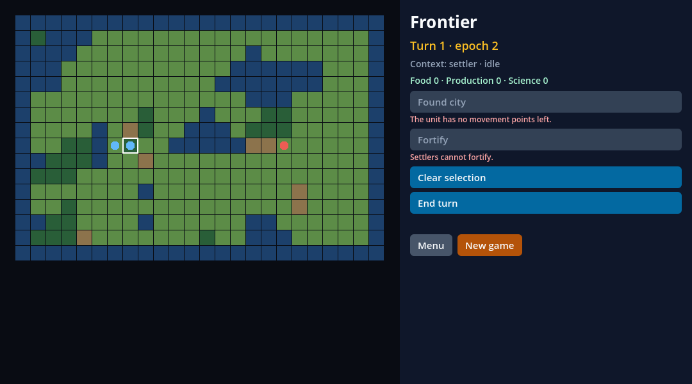

# Frontier: o consumidor provisionado pelo addon e dez ciclos sem vazamento

Esta fatia fecha o critério `consumidor` do V05-03 do marco 0.5, ligada ao GF-07, sobre o jogo do GF-28 e os serviços do
[registro anterior](../frontier-services/README.md). O **Frontier** deixa de ser um jogo que só roda no projeto raiz do
laboratório e vira um **projeto consumidor** de verdade: o template
[`consumers/civ-lite/`](https://github.com/journey-studios/godot-fabric/tree/b0509db210eae4aa944d053ba51e8cdbb87c56d3/consumers/civ-lite)
é provisionado pelo addon como o `consumers/minimal`, construído pelo plugin do editor com o toolchain privado do addon (sem
Node global e sem rede), abre no editor, e roda **dez ciclos** de novo jogo, intenções pela HUD, recarga do cenário e menu, em
que nada vaza (nós, órfãos, bindings, assinaturas, conexões) e o `epoch` só sobe. O nó `GameServices` deixa de apontar para o
caminho `res://sdk` do laboratório: a cena injeta a fachada. A HUD é a mínima, em TSX público (`View`, `Text`, `Pressable`),
dentro do escopo de props do 0.5. A fatia não tem C++ e não toca `native/`, `src/` nem `sdk/`. A
[pesquisa](../../research/frontier-consumer.md) tem a cena, a fachada injetada, o cenário, o menu e as decisões; o
[recibo](execution.json) fixa fontes, hashes, contagens e resultados.

Os fontes da fatia estão fixados no **commit de implementação
[`b0509db`](https://github.com/journey-studios/godot-fabric/commit/b0509db210eae4aa944d053ba51e8cdbb87c56d3)**
(`b0509db210eae4aa944d053ba51e8cdbb87c56d3`, árvore `7da779952ea29025af0ff84592bdac8300117f43`, sobre a main `75a85ad`, o PR #73,
que trouxe os serviços do P4). Os comandos abaixo, porém, **rodaram no merge
[`029416f`](https://github.com/journey-studios/godot-fabric/commit/029416fd3067e1d6c147dac44cd670be5110e337)**
(`029416fd3067e1d6c147dac44cd670be5110e337`, árvore `704b324b0865be42ce5d5410eb233acc6c27c2f6`), que junta ao commit de
implementação a main `b0e40aa` (o PR #74, a política de props `prop-scope` dos componentes da HUD do 0.5): assim a HUD foi
exercida **sob a política**, e nenhuma prop de `View`, `Text` ou `Pressable` foi recusada. O merge não toca nenhum arquivo
da fatia (`consumers/civ-lite/`, `scripts/consumer-civ-lite-*.mjs`, `docs/research/frontier-consumer.md`, os testes do
`frontier-services` e o `tsconfig.godot.json` são byte a byte os do commit de implementação, conferido no recibo) e só
acrescenta os trechos da main a `package.json`, `.fallowrc.json` e `.github/workflows/contracts.yml`. A árvore estava limpa e
igual à do merge, sem arquivo novo fora dos diretórios ignorados (`git status --porcelain` vazio antes do primeiro comando e
depois do último), quando cada comando abaixo rodou; os arquivos desta evidência foram acrescentados depois e não são
entradas. Ambiente: macOS arm64 (26.6.2), Godot oficial **4.7.2** (`ed1daf0bf`), React Native **0.87.1** e React 19.2.3 com o
Hermes da aplicação, Node **v22.23.3** (npm 10.9.9), em modo headless e, para as capturas, **janelado** na tela local.

| Lane executada | Checks | Observação |
| --- | ---: | --- |
| Consumidor civ-lite, `npm run test:consumer:civ-lite -- --capture` | 19 de build e posse, 145 nativos (148 com as capturas) | provisiona o template, constrói no editor, roda os dez ciclos headless e janelados, constrói de novo sem rede e salva as duas capturas; as duas execuções dão as mesmas medidas |
| 4 sabotagens, `node scripts/consumer-civ-lite-sabotage.mjs` | 29, 19, 21 e 3 falhas | Cada uma é rejeitada pela validação do próprio consumidor, pela razão por que foi quebrada; o fonte volta byte a byte e o template restaurado passa no check normal |
| Serviços, `npm run test:frontier-services` | 8/8 | o probe do P4 com a fachada injetada, o oráculo e a paridade Godot/TypeScript, agora com 14 registros (o 12º método é o `open_menu`) |
| Consumidor mínimo, `npm run test:consumer` | 30 de build e posse, 40 nativos | o consumidor do addon continua passando sob a política `prop-scope` |
| Controle com host anterior | N/A | A fatia não tem código nativo: não há binário anterior a comparar, e o SDK anterior também não discrimina, porque nada sai de `src/` nem de `sdk/` |

```sh
npm run test:consumer:civ-lite -- --capture   # o consumidor provisionado: editor, sem Node, offline, 10 ciclos, capturas
node scripts/consumer-civ-lite-sabotage.mjs   # as 4 sabotagens e, no fim, o template restaurado no check normal
npm run test:frontier-services                # o P4 com a fachada injetada e o 12º método
npm run test:consumer                         # o consumidor mínimo sob a política prop-scope
```

A rodada do consumidor civ-lite levou 45,0 s, a das sabotagens 197,5 s, o `test:frontier-services` 18,0 s e o
`test:consumer` 115,9 s.

## O que foi verificado

Os valores abaixo estão no [recibo](execution.json); os fontes estão fixados no commit de implementação.

### O template provisionado

`scripts/create-consumer.mjs --template civ-lite` copia
[`consumers/civ-lite/`](https://github.com/journey-studios/godot-fabric/tree/b0509db210eae4aa944d053ba51e8cdbb87c56d3/consumers/civ-lite)
para um diretório novo e provisiona o addon nele
(`GODOT_FABRIC_PROVISIONED`; o manifesto do addon registra o commit `029416f`, sem sujeira, Godot 4.7.2, React 19.2.3, RN
0.87.1 e Node 22.23.3). O template tem o que o `consumers/minimal` tem: `project.godot` (plugin do addon e
`[godot_fabric] application="res://ui/application.tres"`), `main.tscn`, `ui/application.tres`, `ui/index.tsx`,
`validation.gd`, `package.json` e `package-lock.json` com os mesmos pares fixados, `tsconfig.json` e `.gitignore`; `game/` e
`services/` continuam onde estavam. Cada fato abaixo é um dos 19 checks de build e posse do script
[`consumer-civ-lite-check.mjs`](https://github.com/journey-studios/godot-fabric/blob/b0509db210eae4aa944d053ba51e8cdbb87c56d3/scripts/consumer-civ-lite-check.mjs)
(os nomes estão no recibo):

- **Sem Node global.** Com `PATH=/usr/bin:/bin`, `spawnSync("node")` dá `ENOENT`. O build roda no Node privado do addon.
- **Editor.** `godot --headless --editor -- --godot-fabric-build-check` imprime `CONSUMER_EDITOR_BUILD_PASSED`, sem nenhuma
  linha `ERROR:`, e o `package-lock.json` do projeto não muda (antes e depois de construir e rodar).
- **Offline.** O builder do addon, rodado pelo Node privado sob `sandbox-exec` com a rede negada, dá o mesmo bundle
  (SHA-256 `eff29777…`).
- **Sem o laboratório.** O projeto provisionado é o template mais o addon, sem os diretórios `sdk`, `tests`, `build`,
  `consumers`, `examples`, `src` e `native`; o bundle não tem entrada de `examples/`, de fora do projeto nem de dependência do
  projeto.
- **TSX público.** A HUD importa só `react`, `react-native`, `@godot-fabric/runtime` e `./frontier-types`; o bundle é feito
  do `ui/index.tsx` e do `ui/frontier-types.ts` do projeto.
- **A fachada é injetada.** O `main.tscn` aponta `fabric_api` para `res://addons/godot_fabric/godot_fabric.gd`; nenhum script do
  projeto nomeia um caminho `res://sdk` nem a classe global `GodotFabric`. No laboratório, o probe do P4 atribui o
  `preload("res://sdk/addon/godot_fabric.gd")` antes de o nó entrar na árvore; sem fachada, `_bind_services` falha alto com
  `FABRIC_ERROR` e não registra nada.
- **A cena.** A raiz é o nó `GameServices`, persistente pela vida da aplicação; os filhos são `Application`, `World`, a
  `FabricSurface` da HUD em tela cheia e o `Validation`. Recarregar o cenário e ir ao menu só soltam e trazem de volta o
  `World`: a aplicação, o registro, as bindings e o `epoch` nunca são recriados.

Com `consumers/civ-lite/project.godot` no lugar, o projeto raiz continua carregando `game/` e `services/`: o
`test:civ-lite-game` (1/1) e o `test:frontier-services` (8/8) passam.

### Os 145 checks nativos

`validation.gd` roda com `harness.runtime()` e `-- --validate`; a contagem é exata e está fixada no script:
**6** antes dos ciclos (a fachada injetada, o bundle avaliado uma vez sem erro, os 14 bindings, um `World`, a HUD conectada no
epoch 1, o projeto sem diretório do laboratório), **10** no primeiro ciclo (que é a linha de base e não tem com o que se
comparar), **14** em cada um dos outros nove e **3** depois deles (o epoch só subiu; o registro, parado, sem binding, assinatura
nem trabalho pendente; só a conexão do `World` resta no sinal). A execução janelada acrescenta os 3 das capturas: 148. O
script do check relê a série do relatório em JavaScript e não toma a comparação do Godot como dada.

### Os dez ciclos

Cada ciclo é: **(a)** Novo jogo pressionado na HUD; **(b)** três intenções do roteiro pela HUD (`select_unit [1]` e
`move_unit [1, 7, 8]` mandadas pela função que os botões da HUD usam, e Fim de turno pressionado no botão da ação `end_turn` do
snapshot); **(c)** recarregar o cenário (`reload_world()`: o `World` sai da árvore e é liberado, um novo entra, e há um novo
jogo); **(d)** o menu aberto na HUD (o `World` sai da árvore e é liberado, a HUD mostra o menu e solta a conexão com o
snapshot); **(e)** Novo jogo pressionado no menu (o `World` volta, a HUD volta ao jogo). Cada espera é por estado (o epoch
que a HUD viu é o do nó, a HUD mostra `Turn 1 · epoch N`, o `World` existe ou não, a contagem de conexões da HUD é 0), com um
número de quadros só como limite; dois quadros no fim deixam os `queue_free` acontecerem. A série da execução headless:

| Ciclo | nós | órfãos | bindings | assinaturas | conexões de `snapshot_changed` | conexões da HUD | epoch (Godot, HUD) | epochs que a HUD viu |
| ---: | ---: | ---: | ---: | ---: | ---: | ---: | --- | --- |
| 1 | 21 | 0 | 14 | 1 | 2 | 1 | 4, 4 | 2, 3, 4 |
| 2 | 21 | 0 | 14 | 1 | 2 | 1 | 7, 7 | 5, 6, 7 |
| 3 | 21 | 0 | 14 | 1 | 2 | 1 | 10, 10 | 8, 9, 10 |
| 4 | 21 | 0 | 14 | 1 | 2 | 1 | 13, 13 | 11, 12, 13 |
| 5 | 21 | 0 | 14 | 1 | 2 | 1 | 16, 16 | 14, 15, 16 |
| 6 | 21 | 0 | 14 | 1 | 2 | 1 | 19, 19 | 17, 18, 19 |
| 7 | 21 | 0 | 14 | 1 | 2 | 1 | 22, 22 | 20, 21, 22 |
| 8 | 21 | 0 | 14 | 1 | 2 | 1 | 25, 25 | 23, 24, 25 |
| 9 | 21 | 0 | 14 | 1 | 2 | 1 | 28, 28 | 26, 27, 28 |
| 10 | 21 | 0 | 14 | 1 | 2 | 1 | 31, 31 | 29, 30, 31 |

Depois de todo ciclo: `pendingHostTasks` e `pendingEvents` são 0; há exatamente um `World`; os dois `World` que o ciclo soltou
(o da recarga e o do menu) estão liberados; no menu a HUD não tinha conexão alguma e a cena não tinha `World`; as seis chamadas
do ciclo foram aceitas; nenhum erro da aplicação, da HUD nem do log (nenhum `FABRIC_ERROR`, nenhum `SCRIPT ERROR`). O epoch sobe
exatamente 3 por ciclo (os três novos jogos) e começa em 1: 4, 7, …, 31, estritamente crescente e igual no Godot e na HUD. A
execução janelada deu as mesmas medidas em tudo o que é afirmado. O `OBJECT_COUNT` fica registrado e **não** é afirmado: headless
é 1614 em todos os ciclos, janelado entre 1613 e 1618 e sem voltar ao do primeiro ciclo (um renderizador que se estabiliza), de
modo que ele não diz "voltou ao do primeiro ciclo" como as medidas afirmadas dizem. O relatório não tem erro algum, e o
bundle foi avaliado uma só vez (`bundleEvaluations` 1) para os dez ciclos.

### As capturas

Duas capturas reais da execução janelada, 1080x600, tiradas pelo próprio `validation.gd` do projeto provisionado
(SHA-256 no recibo):

| Captura | O que mostra |
| --- | --- |
|  `frontier-consumer-game.png`, `4104be42…` | o mapa de 24x16 desenhado pelo `World` (a água, a planície, a floresta e a colina, o Colono selecionado depois de se mover, os guerreiros e a unidade da facção), com a HUD ao lado: o turno e o epoch, o contexto, os estoques e as ações, as desabilitadas com o `reason_text` do jogo |
|  `frontier-consumer-menu.png`, `3dd48d41…` | o menu depois de `frontier.open_menu`: sem `World` atrás, e o Novo jogo da HUD |

O check da captura do jogo exige que o pixel de um marcador de unidade do mapa e o do fundo do painel da HUD estejam na tela
(a HUD sobre uma área de mapa transparente). Não há captura do que é *interativo* além disso: os cliques são sintéticos (abaixo).

### As sabotagens

`node scripts/consumer-civ-lite-sabotage.mjs` quebra um fonte do template por vez (o
[`sabotage-sources.mjs`](https://github.com/journey-studios/godot-fabric/blob/b0509db210eae4aa944d053ba51e8cdbb87c56d3/scripts/sabotage-sources.mjs)
o restaura byte a byte, qualquer que seja o fim da execução), roda `consumer-civ-lite-check.mjs --sabotage=<nome>` (provisiona o
template quebrado, constrói no editor e roda a validação com `--sabotage`) e exige que a validação o rejeite pela razão por que foi
quebrado. O arquivo de resultado de cada variante é apagado antes de ela rodar, e uma variante que não o deixa (uma queda, uma
asserção que veio antes) conta como não rejeitada.

| Sabotagem | Quebra | Falhas | O que a série e os checks mostraram |
| --- | --- | ---: | --- |
| `hud-leak` | o efeito da HUD não remove mais a conexão com o snapshot ao sair da tela | 29 | as assinaturas do registro e as da HUD: 2 no ciclo 1 e 11 no décimo; a primeira falha é a do menu, no ciclo 1 |
| `orphan` | o `World` é tirado da árvore (`remove_child`) e não liberado (`queue_free`) | 19 | órfãos 2 no ciclo 1 e 20 no décimo, **com os nós da árvore iguais (21)**; a primeira falha é a de que os `World` soltos não foram liberados |
| `epoch-reset` | `reload_world` zera o epoch antes do novo jogo | 21 | o epoch termina o décimo ciclo em 2; a primeira falha é a de que o ciclo subiu 1 e não 3 |
| `no-facade` | o `main.tscn` não injeta mais a fachada | 3 | o log traz `FABRIC_ERROR: GameServices has no fabric_api`; o nó não registrou binding algum; as 3 falhas são do que vem antes dos ciclos e nenhum ciclo é rodado |

A linha de base de uma execução sabotada já está contaminada (o primeiro ciclo também vaza), de modo que a comparação com o
primeiro ciclo acusa o crescimento e os checks de dentro de cada ciclo acusam o primeiro vazamento. O controle, o template
restaurado no check normal, saiu com 0.

**A quinta sabotagem, `world-leak`, foi descartada.** Ela quebrava o `World`: "não desconecta `snapshot_changed` no
`_exit_tree`". Um script descartável no Godot 4.7.2 (fora do repositório) ligou a um mesmo sinal um método de um Node, uma
lambda criada num Node, uma lambda criada num RefCounted e um método de um RefCounted, soltou a última referência dos
RefCounted e liberou os nós:

```text
connections before free: 3
connections after node frees: 1
  remaining: <anonymous lambda>(self lambda)
orphans: 1.0 nodes: 2
```

O motor derruba sozinho a conexão cujo alvo é um Node liberado, lambdas incluídas; só a lambda criada por um RefCounted
sobrevive ao objeto. Esse vazamento é impossível por construção para um `World` simples, e o primeiro desenho só o tornava
possível embrulhando o handler num RefCounted (`Subscription`) cujo único papel era permitir a sabotagem. O `World` ficou
simples: conecta um método e o desconecta no `_exit_tree` (simetria, e vale no quadro entre o `remove_child` e a liberação), e a
contagem por ciclo das conexões de `snapshot_changed` ficou como guarda. Um `World` não liberado é outro vazamento, e tem a sua
sabotagem (`orphan`).

## Regressões

Rodadas no mesmo merge, depois dos comandos acima; todas com saída 0.

| Comando | Resultado | Tempo |
| --- | --- | ---: |
| `npm run type-check` | sem diagnósticos, a HUD (`ui/index.tsx`) incluída | 0,3 s |
| `npm run check:static` | `✓ No issues found` | 0,4 s |
| `npm run check:publication` | `passed: true`, 1741 arquivos, nenhuma falha (contados no merge, antes de esta evidência ser acrescentada) | 0,8 s |
| `npm run test:civ-lite-game` | 1/1 subteste, o mesmo hash dourado e o mesmo hash de trilha | 2,1 s |

## Recibo de fonte

Os 49 arquivos que rodaram (os 26 do template, os scripts do consumidor, da harness, do provisionamento e das sabotagens, o
fixture, o probe, o teste nativo, o oráculo, o teste de paridade e o teste de tipos dos serviços, o nó de aplicação e a
fachada do addon, o `src/prop-scope.mjs` da política, e os quatro arquivos compartilhados `package.json`,
`tsconfig.godot.json`, `.fallowrc.json` e `.github/workflows/contracts.yml`) têm o SHA-256 do conteúdo igual ao do blob do
merge `029416f`, comparado byte a byte com `git show`; os da fatia são também os do commit de implementação `b0509db`. O
recibo lista cada SHA-256 e cada blob. Depois dos comandos, quatro arquivos só ganharam links para este registro (o `README.md`
da raiz, o `consumers/civ-lite/README.md`, o índice `docs/evidence/README.md` e a pesquisa `docs/research/frontier-consumer.md`);
o recibo guarda o SHA-256 que o `consumers/civ-lite/README.md` tinha quando rodou, que o check lê só para reescrever seus
links `../../`. **O recibo de fonte não certifica o build hospedado**: ele prova o GDScript, o TSX, os
scripts, os testes e o oráculo que rodaram nesta máquina, e o `fabric_godot.dylib` que o projeto raiz e o addon provisionado
carregam foi construído aqui a partir dos fontes nativos da main (`a06edfbc…`, o mesmo nos dois); esta fatia não o altera nem o
compara.

> **CI hospedada e Pages pendentes.** O passo `npm run test:consumer:civ-lite` e o artefato `independent-civ-lite-consumer` do
> workflow `contracts.yml` ainda não rodaram na CI hospedada, e nada foi publicado no Pages. Tudo o que esta página registra é
> evidência local, em macOS arm64. Este registro cobre o critério `consumidor` do V05-03; o critério `autoridade`, os demais
> itens do 0.5 e todo número da 1.0 seguem como estavam.

## Limites e abertos

- A HUD é a **mínima de serviço** (o turno, o contexto, as ações com os motivos, Menu e Novo jogo), não a jogável do V05-05 e
  do V05-08; o cenário desenha o mapa e não recebe entrada.
- Os cliques são **sintéticos**: o mouse apertado e solto pela viewport no centro do controle de cada `Pressable`, headless e
  janelado, e a função `send()` da própria HUD para `select_unit` e `move_unit`. Nenhuma pessoa e nenhum dispositivo clicou.
- A execução janelada é local, numa máquina macOS, na tela local; a CI hospedada roda o check headless e ainda não o rodou.
- O critério `autoridade` segue aberto: um job que sobrevive ao fechamento da tela e rajadas contra os orçamentos de 64
  tarefas e 128 eventos por fase não foram medidos; o `end_turn` é uma chamada síncrona de GDScript.
- D22 e D23 ficam de fora: nada aqui recria a aplicação, de modo que a HUD nunca se reconecta a uma nova.
- Os ciclos medem nós, órfãos, bindings, assinaturas, trabalho pendente, conexões e o epoch; não medem tempo, custo por
  quadro nem memória, e o `OBJECT_COUNT` é registrado, não afirmado.
- O 12º método, `frontier.open_menu`, não é uma regra do jogo: derruba o `World`, não muda estado, não publica snapshot e deixa
  o epoch; com ele os serviços têm **14 bindings** (um estado, um sinal e 12 métodos), e não 13.
- O controle com host anterior não se aplica: não há C++.
- A CI hospedada e a publicação no Pages estão pendentes.
