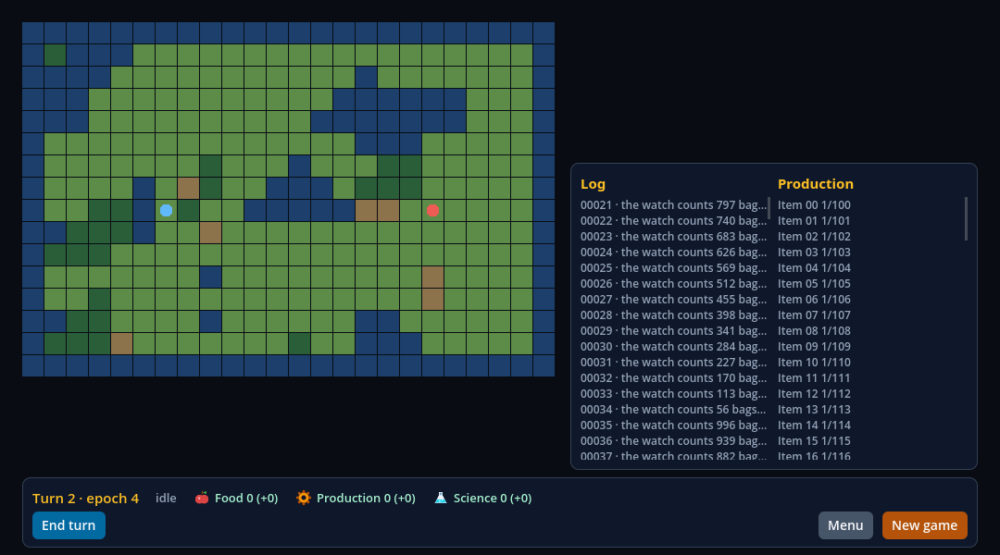

# A janela de estresse do comparativo e o `stats()` do executor (V05-10, a serviço de `execucao` e `metricas`)

Registro da entrega que dá ao jogo, às duas HUDs e ao executor o que a janela `stress` do [protocolo](../../research/frontier-comparison-protocol.md) precisa: o modo de estresse do jogo
(um log de 200 linhas e uma lista de produção de 100 itens, preenchidos num quadro e atualizados por 20 quadros seguidos), um painel `hud-stress` nas duas HUDs (a React Native, braço C, e a nativa do
Godot, braço B) e o `stats()` que o executor lê nos quadros medidos, com o mesmo formato nos dois braços. Implementação em `ee96490db72b75e0bcf8a75a50db38487deb7ac3`
(<https://github.com/journey-studios/godot-fabric/commit/ee96490db72b75e0bcf8a75a50db38487deb7ac3>). O desenho, o caminho do `stats()` no C e o que cada escolha custa estão em
[docs/research/frontier-stress.md](../../research/frontier-stress.md).

**Este registro não afirma nenhum resultado de medição.** Nenhuma execução comparativa rodou; os números abaixo são o custo do gancho (`stats()`) e das lanes, não o custo de uma HUD. Nenhum critério do V05-10
fecha (a entrega serve `execucao` e `metricas`) e nenhuma tarefa do GF, checkpoint, peso ou denominador se move. O protocolo, o jogo (regras, estado, hash dourado) e a passada de otimização do braço B
não foram tocados.

## O que foi executado

Localmente, macOS arm64, Godot 4.7.2 oficial, Node v22.23.3, no worktree a partir de `4c3abb7`. O host nativo foi reconstruído (o campo opcional do esquema e os contadores de entrega são C++), com o anterior
guardado em `build/stress-previous-host/` para o controle causal.

| Comando | Resultado |
| --- | --- |
| `node --test tests/civ-lite-ui-native.test.mjs` (as duas HUDs) | passou: HUD React Native 152 + 28 + 41 verificações, HUD nativa 152 + 28; 38 mutações do relatório da HUD, 23 do de overlays |
| `node tests/civ-lite-ui-native.test.mjs --capture` | passou: mais as 9 capturas de cada braço e as 4 dos overlays, em janela |
| `npm run test:frontier-stress` (novo) | passou: 18 verificações da sonda do nó e do registro, sem JavaScript |
| `node scripts/civ-lite-ui-sabotage.mjs` | passou: as 25 variantes da lane (20 de antes e as 5 desta entrega) rejeitadas pela sonda e pelo oráculo, as fontes restauradas byte a byte e a lane limpa passando depois (status 0) |
| `npm run test:civ-lite-game` | passou: o hash dourado do replay não mudou |
| `npm run test:frontier-services` | passou: 11 testes, a paridade TypeScript e Godot do campo opcional inclusive |
| `npm run test:frontier-soak` e `npm run test:frontier-turn` | passaram: 1 teste cada |
| `npm run test:consumer:civ-lite` | passou: 20 verificações de construção e posse, 165 nativas, 10 ciclos |
| `npm run test:contracts` | passou: 518 testes de Node e 13 de Python, a validação do painel e o teste de tipos do campo opcional inclusive |
| `npm run type-check`, `npm run check:static`, `npm run check:publication` | passaram |
| `node scripts/milestone-guards.mjs --check --base origin/main` | passou: X9 e X10 limpos |

## O modo de estresse

`consumers/civ-lite/services/stress.gd` é uma sobreposição que o nó `GameServices` guarda, fora do estado do jogo: o estado, o hash, o log do próprio jogo (`LOG_MAX` 32), o hash dourado e o hash do rastro não
mudam, e a sonda do nó confere. Três métodos do nó, registrados para o React Native como os outros (o registro tem 18 vínculos agora, eram 15), entram nela, a mudam e saem dela:

| Método | O que faz | Recusado quando |
| --- | --- | --- |
| `stress_begin()` | no quadro que o recebe, enche o log (200 linhas) e a lista (100 itens) e publica um snapshot | um turno corre (`turn_in_progress`, o código do próprio jogo); o modo já está ligado (`stress_on`, novo) |
| `stress_step()` | acrescenta uma linha (o log fica em 200: a mais antiga sai), sobe o progresso do item `passos % 100` e publica um snapshot | o modo está desligado (`stress_off`, novo) |
| `stress_end()` | sai do modo e publica um snapshot | o modo está desligado (`stress_off`) |

O snapshot traz `stress: {log, production}` só enquanto o modo está ligado, e **depois de `stress_end()` é, byte a byte, o de antes de `stress_begin()`** (as sondas o comparam como texto de chaves ordenadas).
O conteúdo é determinístico: uma linha começa pelo número de sequência em cinco dígitos, que é a sua chave, e um item é chaveado pelo `id`. O esquema ganhou o seu primeiro campo opcional, `{optional: schema}`, só
como campo de objeto (o registro nativo, o espelho TypeScript e o extrator da paridade o conhecem; `docs/GAME_SERVICES.md` diz).

## Os painéis

`hud-stress` aparece **em todos os contextos** enquanto o snapshot traz `stress`, com `hud-stress-log` (200 linhas) e `hud-stress-production` (100 linhas), cada linha um texto com testID, e não está na
tabela de painéis por contexto: a tabela não muda, e a matriz roda com o modo desligado, com o mesmo veredito de antes.

- **C:** `ui/hud/stress.tsx`, dois `ScrollView` de `Text` com `key` pela chave da linha e pelo `id` do item (não há `FlatList` no manifesto do 0.5).
- **B:** `native_hud/stress.tscn` e `stress.gd`, dois `ScrollContainer` de `VBoxContainer` de `Label`, reconciliados por chave no lugar por um reconciliador que o próprio painel traz.

A sonda confere as mesmas coisas nos dois: depois de 20 passos, 180 das 200 linhas e as 100 do outro são os mesmos Controls de antes (um passo monta uma linha, desmonta outra e muda o texto de um item).

## O `stats()` do executor

```
stats() -> {snapshots: int, context: String, events: int}
```

Nos dois braços, com o mesmo formato. **B:** o nó da HUD (`HUDLayer/HUD`) conta nos próprios manipuladores de sinais (o `stats()` antigo, de validação, virou `intents_sent()` e fica atrás do leitor). **C:** o nó `HudStats`
(`hud_stats.gd`, em `main.tscn`) lê os contadores que o registro nativo mantém para cada serviço (`FabricApplication.service_delivery`, novo, que lê o vínculo da origem padrão): o que o registro absorveu e as revisões distintas que entregou ao runtime de JavaScript (uma emissão que chega a várias assinaturas conta uma vez; o registro não funde revisões).
`GameServices.notifications_emitted()` conta, do lado de quem emite, o mesmo conjunto (snapshot, cartão de hover e fim de turno), e o executor fecha `event-burst` onde `events == notifications_emitted()`.

**O caminho do C é o contador nativo, não um empurrão da store**, porque é o único que não custa nada ao C nos quadros medidos: o empurrão é uma chamada de JavaScript, uma tarefa do registro e uma invocação em Godot por
snapshot e por cartão, nos quadros da própria janela, e aparece um quadro depois. Nenhum caminho do `stats()` avalia JavaScript nem lê o snapshot da Surface (a lição do #108).

### Custo

Headless, macOS arm64, host Release, uma execução por processo e nunca as duas HUDs ao mesmo tempo, com a máquina sob a carga do outro trabalho (carga de 1 minuto entre 4 e 8, não a 2,0 do protocolo: não são execuções
comparativas). Números brutos em [costs.json](costs.json).

| Leitura | Custo por leitura |
| --- | ---: |
| B: `stats()` do nó da HUD | 0,9 µs (mediana; p95 1,1 µs) |
| C: `stats()` do `HudStats` (três leituras de contador e uma busca do contexto) | 4,5 µs (mediana; p95 10,2 µs) |
| C, o caminho não tomado: `application.evaluate("JSON.stringify(FrontierHud.stats())")` | 130 µs |
| C, o caminho não tomado: o `snapshot()` da Surface (32 347 bytes em repouso) | 581 µs |

**O custo do contador nativo por notificação, no C,** foi medido como a diferença dos quadros do soak entre a árvore de antes (`main.tscn` de `4c3abb7` no host anterior, sem contadores) e a de depois (no host novo), com o
mesmo arnês, o instrumento de tempo de CPU do #97 e 5 execuções de 60 turnos de cada lado, alternadas: a mediana dos quadros de `ai-phase` é 3,22 ms antes e 3,22 ms depois, o p95 6,98 e 7,04 ms, e a mediana de `event-burst`
0,065 e 0,086 ms: **dentro da dispersão entre execuções** (as medianas de execuções soltas variam 0,4 ms). Depois da correção da revisão (o contador conta revisões distintas: uma comparação a mais por evento), as leituras acima
foram medidas de novo, e a árvore nova sozinha deu mediana de `ai-phase` de 3,44 ms em 5 execuções (3,43 a 3,46): 0,2 ms acima da primeira medida da mesma árvore, que é a deriva entre duas sessões de medida nesta máquina e
tão grande quanto qualquer diferença que os contadores pudessem fazer. O custo por notificação está abaixo do que o instrumento enxerga, e por construção são poucas instruções. O B paga três incrementos por notificação.
Na etapa de estresse da lane os dois braços contam os mesmos números (de 73 a 81 eventos e de 67 a 74 snapshots num turno, 103 eventos no fim).

## Prova

- **A etapa de estresse da sonda da HUD** (`hud_validation.gd`, a quarta, nos dois braços pelo leitor): o modo recusado durante um turno; o `stats()` num turno inteiro; a recusa de um passo e de um fim com o modo
  desligado; o início, com 200 e 100 linhas nos painéis do próprio contexto; um segundo início; vinte passos, um por quadro, com a identidade das linhas; o fim, com o painel fora e o snapshot byte a byte como estava; e o
  `stats()` final contra o contador do nó. O oráculo (`tests/civ-lite-ui-oracle.mjs`) escreve as linhas e os itens a partir das regras, à parte do jogo; 11 mutações de uma cópia do relatório são rejeitadas nas duas
  categorias novas, `stress` e `stats`.
- **O nó e o registro** (`tests/frontier-stress-probe.gd`): as três intenções com seus códigos e textos, os snapshots que publicam, o hash do estado do jogo parado, a identidade byte a byte, os contadores, um jogo novo saindo
  do modo e o campo opcional por vínculos reais: aceito ausente e presente, recusado com o tipo errado, com um campo que a declaração não nomeia, com um campo obrigatório faltando e como opcional que não é campo de objeto.
- **Cinco sabotagens retidas** (`scripts/civ-lite-ui-sabotage.mjs`), cada uma rejeitada pela sonda e pelo oráculo pela regra que quebra:

  | Sabotagem | O que quebra | Rejeitada por |
  | --- | --- | --- |
  | `stress-rows-rebuilt` | o painel React Native chaveia cada linha do log também pela linha mais nova: a cada passo todas as chaves mudam e 200 linhas são montadas de novo | a sonda (identidade das linhas) e o oráculo (`stress`) |
  | `native-stress-rows-rebuilt` | o painel nativo libera todas as linhas a cada renderização e as refaz | a sonda e o oráculo (`stress`) |
  | `stress-end-keeps-overlay` | `stress_end` publica um snapshot e deixa a sobreposição no nó: o modo nunca termina, o painel fica e o snapshot não é o de antes | a sonda (o fim e a identidade byte a byte) e o oráculo (`stress`) |
  | `stats-miss-turn-ended` | o `stats()` da HUD React Native não conta os fins de turno que o registro absorveu | a sonda (o turno inteiro) e o oráculo (`stats`) |
  | `native-stats-miss-turn-ended` | a HUD nativa trata `turn_ended` e não o conta | a sonda e o oráculo (`stats`) |

- **O controle causal: o host anterior.** O mesmo pacote no host construído antes do campo opcional recusa o esquema do snapshot, e a HUD nunca recebe um snapshot: a sonda da HUD React Native falha 139 de 145
  verificações e a sonda do nó falha o que alcança (3 de 6, ela para no acessor que o host anterior não tem).

## Capturas

Janela do macOS, lane `--capture`, depois de 20 passos, lidas uma a uma: o painel cheio nas duas HUDs, com o log a partir da linha 00021 e os itens de 00 a 16 à vista, e as mesmas colunas e a mesma intenção de layout
(a fonte e o corte do texto são os de cada HUD: o React Native corta com reticências, o Godot corta seco).

| React Native (braço C) | Nativa (braço B) |
| --- | --- |
|  |  |

## Esforço

| | Braço B (nativa) | Braço C (React Native) |
| --- | ---: | ---: |
| Painel de estresse | 109 linhas (`stress.gd` 52, `stress.tscn` 57) mais cerca de 8 no `hud.gd` | 34 linhas (`stress.tsx`) mais 4 no `hud.tsx` |
| `stats()` | cerca de 22 linhas no `hud.gd` e 5 no leitor | 32 linhas (`hud_stats.gd`), 4 no `main.tscn` e 5 no leitor |
| Tempo ativo, estimado | cerca de 0,25 h (o painel, o `stats()` e o que a lane pede dele) | cerca de 0,25 h (o painel, o `stats()` e o que a lane pede dele) |

O que é do jogo e dos dois (não é esforço de um braço): `stress.gd` do nó (46 linhas), as três intenções, o estágio e o ordenador de publicação em `game_services.gd` (+110 −9), o esquema, o espelho TypeScript, o C++ do campo
opcional e dos contadores (cerca de 60 linhas), a etapa de estresse na sonda da HUD (153 linhas) e as regras do oráculo (77), a sonda do nó (251) e as sabotagens. Tempo ativo total: cerca de 1,5 h, da primeira leitura à última lane.

## Limites

- Execução local em macOS arm64 (as lanes headless e as capturas em janela). A CI hospedada e o Pages do squash `151427e` estão na seção [CI hospedada e Pages](#ci-hospedada-e-pages).
- O log não rola até o fim em nenhuma das HUDs (o C não pode, sem ref nem efeito, que a varredura do manifesto proíbe; o B faz igual).
- O `stats()` do C conta o que o registro entregou ao runtime de JavaScript: os ouvintes da store rodam no mesmo passo, quando o Hermes esvazia a fila, então o contador pode estar à frente da store por esse passo e nunca
  atrás. A HUD React Native não tem ouvinte de `turn_ended`, e o fim de turno conta para ela quando o registro o absorve; o conjunto de notificações é snapshot, cartão de hover e fim de turno (a nota de pesquisa explica a leitura).
- A janela de estresse ainda não foi medida: é do executor.

## Abertos

| Item | Dono |
| --- | --- |
| O executor, o jogador do soak, o ciclo de contextos e a harness do braço A | V05-10 (Agente 4) |
| A passada de otimização do braço B, agora sobre as quatro janelas | V05-10 |
| `execucao`, `metricas`, `mudanca` e `relatorio` | V05-10 |

## Pins

O commit de implementação é `ee96490db72b75e0bcf8a75a50db38487deb7ac3`. O `report.json` guarda o SHA-256 de cada fonte que as lanes rodaram, dos relatórios e das capturas; `costs.json` guarda os números brutos do custo.

## CI hospedada e Pages

**O run.** Desde o #88 um push da `main` não roda as suítes nativas, então o recibo vem do workflow Contracts **disparado à mão** sobre a `main` em
`151427e`, o squash do #119 (run [38044068758](https://github.com/journey-studios/godot-fabric/actions/runs/38044068758), evento `workflow_dispatch`,
ramo `main`). O run passou nos **oito jobs**, todos com o checkout em `151427e`.

**Os passos.**

- `npm run test:frontier-stress` rodou no job `native-suites-frontier` (passo 14) e passou o seu único teste (TAP 1 de 1): a sonda do nó e do registro, com os códigos das três intenções, a identidade byte a byte do snapshot, o hash do estado parado, os contadores de entrega e o campo opcional do schema. O artefato `native-frontier-stress` (id 11666882177, SHA-256 `5d464e28…`, 3 arquivos) traz o log, que imprime `FRONTIER_STRESS_PASSED`.
- `npm run test:civ-lite-ui` rodou no job `native-suites-runtime` (passo 61) e passou os seus dois testes (TAP 2 de 2), as duas HUDs com o estágio de estresse e o `stats()`. O artefato `civ-lite-ui` (id 11667239503, SHA-256 `d25c2be8…`, 23 arquivos) traz os relatórios.

O job `contracts` passou `npm run test:contracts` (7, 43 e 518 testes de Node). O [recibo](hosted-ci.json) guarda os jobs, os passos, os digests e os arquivos dos artefatos.

**O Pages.** O push de `151427e` rodou o workflow do Pages (run [38044064101](https://github.com/journey-studios/godot-fabric/actions/runs/38044064101), `build` e `deploy` em success, 43 testes do painel passando). O [recibo](publication.json) registra o deployment 6979311173 em success, o artefato `github-pages` que ele usou (id 11667550739, SHA-256 `e69a9cab…`) e que o `migration.json` publicado é o commitado em `151427e`, com a entrada de atividade da janela de estresse.

**O que continua só local:** as capturas, as sabotagens retidas, o controle sobre o host anterior e a medida do custo de `stats()`.

O `--work-dir` abaixo é um exemplo: qualquer diretório fora do repositório serve.

```sh
node scripts/hosted-receipts.mjs --write --slice frontier-stress --work-dir "${TMPDIR:-/tmp}/godot-fabric-hosted-receipts"
node scripts/hosted-receipts.mjs --check
```
