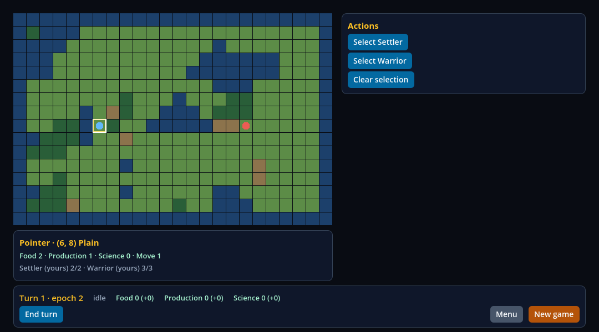
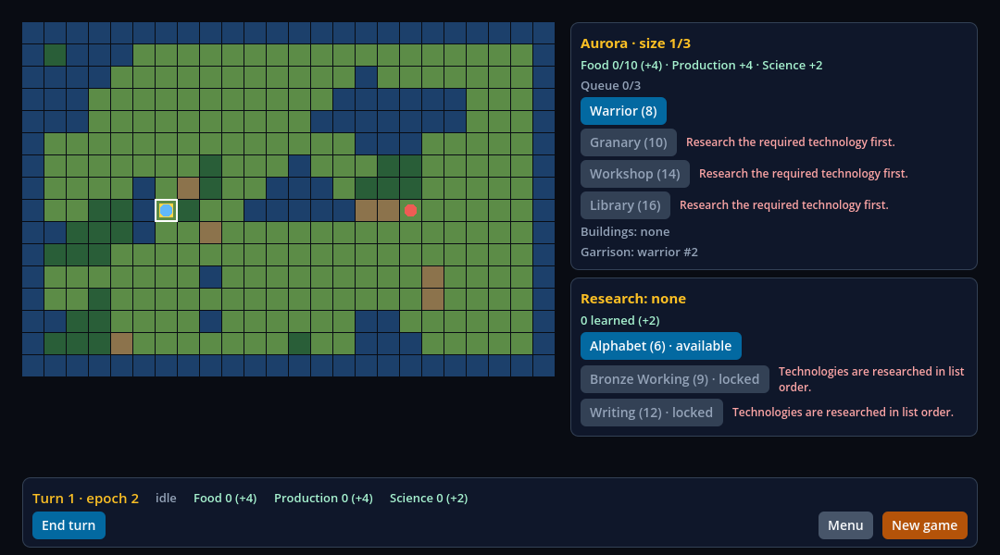
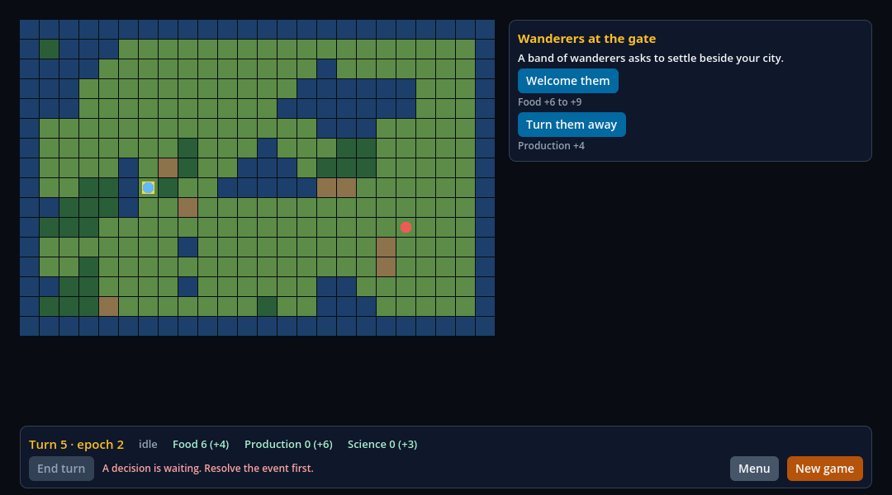

# O turno do Frontier no consumidor: do clique ao painel, a IA fatiada e o heap, a memória e os nós de cada transição

> **Registro fixado.** Os números, os fontes e os hashes abaixo são os da execução sobre o commit de implementação `116a72f` (a fatia inteira, sobre a main `a49f851`) e o recibo
> [`execution.json`](execution.json) os fixa. Os comandos rodaram nesta ordem e em sequência, com a árvore limpa (`git status` vazio antes do primeiro, depois das sabotagens e depois do último);
> os arquivos desta pasta e os documentos que apontam para eles foram escritos depois e não são entrada de nenhum comando. A nota de pesquisa e este registro dizem os mesmos números.

Esta fatia mede o critério `turno` do V05-06 do marco 0.5 Frontier (pacote P6) **na parte que não depende de um display**: o jogo Frontier **como um consumidor o tem** (o template `consumers/civ-lite` provisionado em um projeto próprio,
com o HUD e a cena intocados), clicado de verdade por 32 rodadas de 16 cliques que passam pelos sete contextos, e a pergunta tem quatro partes: quantos quadros e quantos milissegundos leva um clique até o painel
do contexto em que ele leva o jogo; o que acontece quadro a quadro num turno com a IA fatiada (uma fase por quadro, um snapshot por quadro, o fim do turno uma vez); e o que cada transição deixa em nós nativos, no heap do Hermes e na memória
residente. O **tempo de quadro de uma janela apresentada** (vsync ligado, 120 Hz), que também é parte do critério, está **PENDENTE**: nenhuma tentativa da faixa janelada foi apresentada pelo display (a tela estava apagada), e a faixa recusou
todas e terminou sem estatística de quadro. O [recibo](execution.json) fixa fontes, hashes, contagens, proveniência e resultados; a [nota de pesquisa](../../research/frontier-turn.md) tem a cena, o percurso, as regras e a faixa janelada. O critério `turno` **não fecha**
nesta fatia (seu registro é uma atividade), e a parte janelada do `baseline` e o `congelado` seguem abertos.

Todo link de código abaixo está fixado no commit [`116a72f`](https://github.com/journey-studios/godot-fabric/commit/116a72fe608ab7a2bdecffe28a7d67358d439965) (árvore `557565aa`, SHA completo no recibo). Cada fonte executada, listada em `sourcePins` do recibo (36 arquivos),
tem o mesmo SHA-256 que o blob desse commit, conferido ao gerar o recibo.

| Lane executada | Resultado | Observação |
| --- | --- | --- |
| Suíte headless, 1 processo Godot no projeto provisionado | 23/23 checks do probe | 32 rodadas (2 de aquecimento e 30 estáveis), **512 cliques, 128 turnos e 546 leituras**; o oráculo independente aceita o relatório, regra por regra |
| Negativos do oráculo sobre o relatório gravado | 22 rejeitados, cada um **pela regra que o limita e só ela**; 9 aceitos | os aceitos não são vazamento (um transitório de 2.056 bytes, uma subida de exatamente o limite do heap, as duas séries hospedadas do PR #77, uma primeira metade que afunda, um RSS que cai 30 MiB, que sobe 30 MiB, que sobe exatamente o limite e uma rampa de 3 MiB por rodada) |
| Sabotagem `skipped-phase` | rejeitada | 3 checks do probe; oráculo, regra `turns`: "the game advanced one phase in each frame, in the order of the service, and ended at idle" |
| Sabotagem `leaky-transition` | rejeitada | 1 check do probe; oráculo, regra `rests`: "start, round 1: Godot counts no orphan node" |
| Sabotagem `click-misses-panel` | rejeitada | 8 checks do probe; oráculo, regras `shape` e `clicks` (e as que precisam da execução inteira) |
| Sabotagem `heap-leak` | rejeitada | 1 check do probe; oráculo, regra `heap`: "The live heap at rest rose 477536 bytes…" |
| Faixa janelada, host atual, janela do macOS | **NÃO APRESENTADA, código de saída 3**: 0 de 5 execuções, 3 tentativas rejeitadas como `unpaced: the display is not presenting` | a janela desenhou e o vsync leu `enabled` a 120 Hz, mas nada deu ritmo ao laço (mediana ociosa 0,606 ms contra o mínimo de 4,167 ms); sem estatística de quadro |
| Capturas | 7 de 7 | uma imagem do quadro desenhado por contexto, 1080 × 600, do HUD real sobre o mapa real |
| Host anterior | **N/A** | A fatia não muda C++: não há host a comparar; o controle são as quatro sabotagens |

As quatro sabotagens quebram uma coisa de propósito e estão numa tabela só (`tests/frontier-turn-sabotages.mjs`): duas quebram **a cópia provisionada** do jogo ou do HUD, que o lane descarta, e duas quebram o probe, por `scripts/sabotage-sources.mjs` (`guardSources`).
**O template nunca é editado**: o hash da árvore de `consumers/civ-lite` (`d95206e1…`) é o mesmo antes e depois. O arquivo de veredito de cada variante é apagado antes de rodá-la e um arquivo ausente conta como não rejeitada; cada rejeição do oráculo tem de casar com a regra
para a qual a variante foi escrita; o probe volta byte a byte (SHA-256 igual antes e depois, no recibo) e o script termina com uma rodada da fonte genuína, que passou.

**Ambiente**: macOS 26.6.2 (25G83) arm64 num Apple M3 Pro (`Mac15,6`, 11 núcleos lógicos, 18 GB); Godot oficial 4.7.2 (`ed1daf0bf`), RN 0.87.1, React 19.2.3, Hermes 250829098.0.17 e Node v22.23.3.
A suíte roda em modo headless (`opengl3` nomeado, sem display); a faixa janelada, numa janela de 1080 × 600 no `gl_compatibility` (adaptador "Apple M3 Pro", tela embutida "Color LCD", 1512 × 982 pontos, 3024 × 1964 pixels, 120 Hz, escala 2).
O host nativo é o da main, compilado por `npm run setup` nesta árvore (`497e4f95…`); a fatia não o muda. O bundle do HUD que o editor construiu no projeto provisionado tem `8f750693…`.

**Carga do sistema**. O Mac não estava ocioso: outros agentes rodavam trabalho ao mesmo tempo, na mesma máquina. O `vm.loadavg` antes e depois de cada processo do probe (o tempo é o do processo):

| Processo | `vm.loadavg` antes | depois | Duração |
| --- | --- | --- | ---: |
| `npm run test:frontier-turn`, o processo do probe headless | `{ 4.07 3.15 2.80 }` | `{ 1.49 2.48 2.60 }` | 171,9 s |
| sabotagem `skipped-phase`, o processo do probe | `{ 1.46 2.05 2.57 }` | `{ 1.88 2.09 2.50 }` | 169,4 s |
| sabotagem `leaky-transition`, o processo do probe | `{ 2.25 2.17 2.51 }` | `{ 1.80 2.01 2.38 }` | 172,0 s |
| sabotagem `click-misses-panel`, o processo do probe | `{ 3.06 2.30 2.48 }` | `{ 2.97 2.29 2.47 }` | 3,6 s |
| sabotagem `heap-leak`, o processo do probe | `{ 4.82 2.73 2.62 }` | `{ 1.58 2.39 2.52 }` | 172,4 s |
| faixa janelada, tentativa 1 (rejeitada) | `{ 1.87 2.49 2.59 }` | `{ 2.03 2.49 2.59 }` | 21,6 s |
| faixa janelada, tentativa 2 (rejeitada) | `{ 2.03 2.49 2.59 }` | `{ 3.72 2.85 2.71 }` | 21,5 s |
| faixa janelada, tentativa 3 (rejeitada) | `{ 3.72 2.85 2.71 }` | `{ 3.38 2.84 2.72 }` | 21,7 s |

Pelo relógio do shell: as sabotagens levaram 794 s, a suíte 192,2 s (o teste inteiro: provisionamento, build do editor, o processo do probe, o oráculo e os negativos) e a faixa janelada 90 s. Os tempos abaixo são, portanto, uma linha de base desta máquina
**como ela estava**, e não o seu melhor caso; as contagens exatas não dependem disso.

Os comandos, na ordem em que rodaram:

```sh
node scripts/frontier-turn-sabotage.mjs                    # as quatro sabotagens e uma rodada genuína, 794 s, saiu com 0
npm run test:frontier-turn                                 # a suíte, 192 s; roda depois para que o comparison.json traga os veredictos das sabotagens
caffeinate -d node scripts/frontier-turn-graphics.mjs      # a faixa janelada, 90 s, saiu com 3: não apresentada
```

> **CI hospedada pendente.** O passo `npm run test:frontier-turn` e o artefato `native-frontier-turn` do workflow `contracts.yml` ainda não rodaram na CI hospedada. Tudo o que esta página registra
> é evidência local, em macOS arm64. As sabotagens e a faixa janelada nunca rodam na CI.

## O que a execução faz

O lane provisiona o template `civ-lite` com o addon, constrói o HUD pelo plugin do editor (sem Node próprio e sem rede) e só então copia o probe, o runner e o sampler para `res://turn_probe/` do projeto provisionado. O Godot roda
`-s res://turn_probe/frontier-turn-runner.gd`: a SceneTree é o runner, que põe a `res://main.tscn` do próprio template na raiz e acrescenta o probe; a Application do addon funcionou assim, sem autoload. Cada rodada começa num **jogo novo, preparado
pelos serviços** (a única coisa que não é clique e não é medida) e dá 16 cliques reais, de movimento, pressão e soltura pelo viewport no dispositivo de validação 1001: um tile do mapa, os botões do painel de ações, o End turn da barra quatro vezes
e a resposta ao evento. Passa pelos sete contextos; o `dialog` é aberto por um clique (o End turn do quarto turno levanta o evento quando o turno 5 começa). Depois que os painéis aparecem, o probe espera 30 quadros ociosos e lê, com o sampler do GF-30, as
contagens do motor, as views nativas do host, o snapshot da Surface, a memória residente e o heap do Hermes depois de uma coleta forçada.

O que se julga é exato e não depende do ritmo (regras do oráculo `clicks`, `rests`, `turns`, `heap`, `rss` e `errors`; ver a nota de pesquisa); o que depende do ritmo (os quadros de um clique, as durações) é registrado e nunca julgado, e **nenhum limite de tempo foi posto em lugar nenhum**.

## Do clique ao painel

Quadros e milissegundos do começo da injeção (a pressão e a soltura, entregues de uma vez) até o HUD mostrar os painéis do contexto, nas 30 rodadas estáveis (480 cliques); p50 / p95 / máximo. "Injeção" é o tempo da entrega: o clique no mapa roda o `select_tile` do jogo dentro dela, o de um botão roda o
handler do React.

| Passo | Tipo | Contexto antes para depois | Quadros p50 / p95 / máx | Clique até painel (ms) p50 / p95 / máx | Injeção p50 (ms) |
| --- | --- | --- | --- | --- | ---: |
| `map-stack` | map | none para stack | 2 / 2 / 2 | 10,2 / 11,9 / 12,7 | 0,60 |
| `select-warrior` | action | stack para warrior | 2 / 2 / 2 | 10,1 / 11,3 / 11,6 | 0,91 |
| `clear-selection` | action | warrior para none | 2 / 2 / 2 | 10,7 / 11,4 / 11,6 | 0,98 |
| `map-stack-again` | map | none para stack | 2 / 2 / 2 | 10,3 / 10,8 / 12,6 | 0,57 |
| `select-settler` | action | stack para settler | 2 / 2 / 2 | 9,8 / 10,6 / 11,0 | 0,94 |
| `map-tile` | map | settler para tile | 2 / 2 / 2 | 10,5 / 12,3 / 13,0 | 0,51 |
| `map-stack-third` | map | tile para stack | 2 / 2 / 2 | 9,4 / 11,0 / 11,0 | 0,58 |
| `select-settler-again` | action | stack para settler | 2 / 2 / 2 | 9,7 / 10,6 / 10,9 | 0,93 |
| `found-city` | action | settler para city | 2 / 2 / 2 | 13,5 / 15,2 / 16,4 | 0,96 |
| `map-tile-again` | map | city para tile | 2 / 2 / 2 | 10,2 / 11,6 / 12,0 | 0,57 |
| `map-city` | map | tile para city | 2 / 2 / 2 | 13,5 / 14,6 / 15,2 | 0,60 |
| `end-turn-1` | turn | city para none | 8 / 8 / 8 | 52,5 / 53,1 / 53,2 | 0,85 |
| `end-turn-2` | turn | none para none | 8 / 8 / 8 | 51,8 / 52,9 / 55,3 | 0,91 |
| `end-turn-3` | turn | none para none | 8 / 8 / 8 | 51,5 / 52,9 / 53,2 | 0,96 |
| `end-turn-4` | turn | none para dialog | 8 / 8 / 8 | 50,8 / 51,6 / 52,7 | 0,97 |
| `answer-event` | dialog | dialog para none | 2 / 2 / 2 | 10,2 / 11,9 / 12,4 | 1,03 |

Por contexto a que o clique leva (os cliques que não são End turn):

| Contexto a que o clique leva | Passos | Amostras | Quadros p50 / p95 / máx | Clique até painel (ms) p50 / p95 / máx |
| --- | --- | ---: | --- | --- |
| `none` | `clear-selection`, `answer-event` | 60 | 2 / 2 / 2 | 10,5 / 11,6 / 12,4 |
| `tile` | `map-tile`, `map-tile-again` | 60 | 2 / 2 / 2 | 10,4 / 11,6 / 13,0 |
| `settler` | `select-settler`, `select-settler-again` | 60 | 2 / 2 / 2 | 9,7 / 10,6 / 11,0 |
| `warrior` | `select-warrior` | 30 | 2 / 2 / 2 | 10,1 / 11,3 / 11,6 |
| `stack` | `map-stack`, `map-stack-again`, `map-stack-third` | 90 | 2 / 2 / 2 | 10,0 / 11,0 / 12,7 |
| `city` | `found-city`, `map-city` | 60 | 2 / 2 / 2 | 13,5 / 14,6 / 16,4 |

- **2 quadros nos 480 cliques estáveis, qualquer que seja o contexto, o dispositivo do clique (o do mapa ou o de um botão) ou o painel**, e **8 para um End turn** (os sete quadros do job e um em que o HUD alcança). É uma observação, e o oráculo **não a fixa**: ele só impõe o teto (10 quadros para
  um clique e 40 para um turno), que pega um travamento. A explicação que cabe na estrutura: o clique é uma ida e volta pelo jogo (o estado é do Godot, o snapshot chega ao JavaScript no bombeamento do quadro e o React renderiza e monta no do seguinte); não é um trace dos bombeamentos.
- **O tempo acompanha as views que a transição mantém.** Os contextos de 14 a 27 views nativas levam 9,7 a 10,5 ms na mediana; os da cidade, que têm 42, 13,5 ms. A maior parte dos 10 ms é o piso do laço headless (um quadro a cada ~6,9 ms sem nada que o freie, contado de uma injeção que acontece dentro do primeiro quadro): **não é uma latência
  apresentada**.
- A injeção é barata: 0,5 a 0,6 ms para um clique no mapa e 0,8 a 1,0 ms para um botão. A cauda é curta: o p95 é no máximo 15,2 ms e o máximo 16,4 ms, em 480 cliques.
- `dialog` é alcançado por `end-turn-4`, cujo clique até os painéis do dialog leva 50,8 ms na mediana (os sete quadros do turno e mais um).

## O turno, quadro a quadro

Cada quadro dos 120 turnos estáveis, a partir do quadro em que o jogo aceita o End turn: a fase em que o jogo estava no fim do quadro, o intervalo desde o quadro anterior, os nós da SceneTree e se o HUD mostrava o spinner.
O primeiro intervalo é mais curto porque começa na injeção, que vem uns milissegundos depois da fronteira do quadro.

| Quadro | Fase em que o jogo estava | Intervalo p50 / p95 / máx (ms) | Nós da SceneTree (mín a máx) | Spinner mostrado |
| ---: | --- | --- | --- | ---: |
| 1 | `ai_plan` | 2,8 / 4,1 / 7,0 | 24 a 52 | 0 de 120 |
| 2 | `ai_move` | 7,4 / 10,3 / 10,7 | 26 a 56 | 120 de 120 |
| 3 | `production` | 7,3 / 7,7 / 8,1 | 26 a 56 | 120 de 120 |
| 4 | `growth` | 6,7 / 7,1 / 8,4 | 26 a 56 | 120 de 120 |
| 5 | `research` | 7,0 / 8,0 / 9,0 | 26 a 56 | 120 de 120 |
| 6 | `refresh` | 6,9 / 7,4 / 8,3 | 26 a 56 | 120 de 120 |
| 7 | `idle` | 6,9 / 7,4 / 7,6 | 26 a 56 | 120 de 120 |
| 8 | `idle`, o HUD alcança | 6,8 / 7,9 / 8,1 | 24 a 26 | 0 de 120 |

O host não expõe o bombeamento e as fases por quadro, só os totais correntes e as últimas 128 amostras de cada série; então vão **em volta do turno**, sobre os 120 turnos estáveis (ms, p50 / p95 / máx): o bombeamento 24,2 / 32,9 / 33,7, dos quais JavaScript 21,7 / 29,6 / 30,4,
a montagem do host 1,7 / 2,3 / 2,4 e o layout do Yoga 0,7 / 0,9 / 1,1, em 10 bombeamentos para os 8 quadros (10 em todo turno). As 1.200 amostras de bombeamento dos turnos são 2,8 ms na mediana, 4,8 no p95 e 8,5 no máximo.
Os sete quadros do job levam 44,7 ms (p50; 46,0 no p95 e 47,2 no máximo) do primeiro ao último.

- **Exato, e o que o oráculo julga** nas 128 voltas (120 estáveis): uma fase em cada um dos sete quadros, na ordem do serviço (`ai_plan`, `ai_move`, `production`, `growth`, `research`, `refresh`, `idle`); um snapshot publicado em cada um deles (sete em sete quadros consecutivos) e nenhum antes ou depois;
  `turn_ended` **uma vez**, no quadro da última fase, antes do seu snapshot; o job terminou uma vez; os ids dos 128 jobs sobem de um em um; 128 `turn_ended` para 128 End turn.
- **Os intervalos de quadro são o piso do laço, não o custo das fases.** O quadro de cada fase leva 6,7 a 7,4 ms na mediana, o ~6,9 ms do laço headless sem freio; o bombeamento do host no turno é 24 ms dos 45. O que se mediu aqui é que **nenhum quadro carrega duas fases e que o turno
  são oito quadros, não quanto dura um quadro**: isso é da faixa janelada.
- **O HUD segue o jogo por um quadro**: o spinner não aparece no quadro que aceita o turno (0 de 120), aparece nos seis seguintes e some no oitavo; o snapshot que um quadro publica é renderizado pelo bombeamento do próximo, o mesmo caminho que faz um clique levar 2 quadros.

## Nós nativos por contexto

Exato e idêntico nas 546 leituras: **em toda rodada e em todo passo que leva a um contexto**, o snapshot da Surface e a contagem do host são as mesmas views nativas, a SceneTree tem essas mais 10 (os nós da cena e do probe, que nenhum clique muda) e o monitor de nós do Godot conta os mesmos nós.
**Nenhum nó órfão em nenhuma leitura** (0 em 546).

| Contexto | Views nativas | Nós da SceneTree | Passos que levam a ele |
| --- | ---: | ---: | --- |
| `none` | 14 | 24 | `clear-selection`, `end-turn-1`, `end-turn-2`, `end-turn-3`, `answer-event` e o início de toda rodada |
| `tile` | 18 | 28 | `map-tile`, `map-tile-again` |
| `settler` | 27 | 37 | `select-settler`, `select-settler-again` |
| `warrior` | 24 | 34 | `select-warrior` |
| `stack` | 26 | 36 | `map-stack`, `map-stack-again`, `map-stack-third` |
| `city` | 42 | 52 | `found-city`, `map-city` |
| `dialog` | 24 | 34 | `end-turn-4` |

Os números não são fixados no oráculo (o HUD do V05-05 vai mudá-los): ele exige **um** valor por contexto em toda leitura que leva a ele, na Surface, no host e na árvore.

## Heap e memória residente, por transição

Cada linha é uma série de uma leitura por rodada (32), tomada depois do passo, com 30 quadros ociosos e coleta forçada do heap do Hermes. O heap é a mediana das 30 rodadas estáveis; o crescimento é a regra do baseline (`heapAtRest`, importada): a mediana das 15 últimas rodadas menos a das 15 primeiras, limite de 2.048 bytes;
a memória residente é a regra frouxa do soak (`rssGrowthAtRest`, importada) sobre as mesmas metades, limite de 48 MiB (49.152 KB). Ambas são a mesma função, `growthOfHalves` de `tests/performance-oracle.mjs`.

| Série (a leitura em repouso depois do passo) | Views nativas | Heap em repouso (bytes, mediana estável) | Crescimento entre as medianas | Maior degrau (bytes) | RSS p50 (MiB) | RSS mín a máx (MiB) | Diferença entre as medianas (MiB) |
| --- | ---: | ---: | ---: | ---: | ---: | --- | ---: |
| `start` | 14 | 2.175.808 | 128 | 1.784 | 197,0 | 137,8 a 204,8 | -57,6 |
| `map-stack` | 26 | 2.244.944 | 128 | 1.784 | 197,0 | 137,8 a 204,9 | -57,6 |
| `select-warrior` | 24 | 2.270.792 | 128 | 1.784 | 197,0 | 137,8 a 204,9 | -57,6 |
| `clear-selection` | 14 | 2.178.608 | 128 | 1.784 | 197,0 | 137,8 a 204,9 | -57,6 |
| `map-stack-again` | 26 | 2.245.016 | 128 | 1.784 | 197,0 | 137,8 a 204,9 | -57,6 |
| `select-settler` | 27 | 2.289.696 | 128 | 2.040 | 197,0 | 137,9 a 205,0 | -57,6 |
| `map-tile` | 18 | 2.210.856 | 128 | 2.040 | 197,0 | 137,9 a 205,0 | -57,6 |
| `map-stack-third` | 26 | 2.260.888 | 128 | 2.040 | 197,1 | 138,0 a 205,0 | -57,6 |
| `select-settler-again` | 27 | 2.289.696 | 128 | 2.040 | 197,1 | 138,0 a 205,0 | -57,6 |
| `found-city` | 42 | 2.338.336 | 128 | 2.040 | 197,4 | 138,3 a 204,7 | -58,1 |
| `map-tile-again` | 18 | 2.195.376 | 128 | 2.040 | 196,9 | 138,3 a 204,7 | -58,1 |
| `map-city` | 42 | 2.335.280 | 128 | 2.040 | 196,9 | 138,4 a 204,8 | -58,1 |
| `end-turn-1` | 14 | 2.172.184 | 128 | 1.864 | 196,9 | 137,7 a 204,8 | -58,1 |
| `end-turn-2` | 14 | 2.164.936 | 128 | 1.328 | 196,9 | 137,7 a 204,8 | -58,1 |
| `end-turn-3` | 14 | 2.165.120 | 128 | 1.328 | 196,9 | 137,7 a 204,8 | -58,1 |
| `end-turn-4` | 24 | 2.223.928 | 128 | 1.328 | 197,0 | 137,8 a 204,8 | -58,1 |
| `answer-event` | 14 | 2.177.904 | 128 | 1.328 | 197,0 | 137,8 a 204,8 | -58,1 |

- **O heap ficou plano ao byte quando as listas limitadas do HUD encheram, e toda série cresceu 128 bytes entre as medianas** (a mediana inicial 2.175.680 e a final 2.175.808 para o início de uma rodada; o limite é 2.048). O contexto dá o nível: o heap guarda as fibras dos painéis, então sobe com as views nativas
  (2,07 MiB com as 14 da barra, 2,23 MiB com as 42 da cidade).
- **A rampa.** O heap do início da rodada foi 2.125.960 bytes na rodada 0 e 2.166.752 na rodada 1 (as primeiras renderizações de cada painel), depois subiu 2.760, 1.784, 1.296, 1.040, 1.040, 992 bytes nas rodadas seguintes e ficou em 2.175.680 da rodada 9 à 14. `consumers/civ-lite/ui/telemetry.ts` guarda as últimas 64 respostas, fases e épocas
  que o HUD viu (`KEPT = 64`), o HUD faz 10 chamadas por rodada (320 na execução, todas respondidas) e 64 respostas são 6,4 rodadas: a rampa termina onde essas listas enchem (uma leitura dos números, não isolada). A regra passa porque a mediana das 15 primeiras rodadas estáveis já está no platô; **um HUD cujas listas limitadas
  levassem mais de umas doze rodadas para encher reprovaria a regra numa execução sem vazamento**, e o aquecimento (2 rodadas) é o do baseline, não escolhido para este HUD. Os degraus de +128 bytes na 16ª rodada e de +256 na 32ª têm o tamanho de 16 e 32 entradas de 8 bytes (uma lista que ganha uma entrada por rodada e dobra o armazenamento: consistente, não isolado).
- **A memória residente andou em dezenas de MiB e caiu**, como em todo harness do repositório. As 17 séries vão de 137,7 a 205,0 MiB; a diferença entre as medianas das metades é de
  -58,1 a -57,6 MiB, e **-57,8 MiB para a execução lida em ordem** (510 leituras estáveis, metades de 255), contra os 48 MiB que a regra permite (ela limita uma subida, e esta é uma queda).
  O processo ficou em 193,0 a 204,8 MiB nas primeiras 21 rodadas, subindo 0,5 a 0,6 MiB por rodada, e caiu para 137,8 MiB na rodada 22 (o sistema comprimindo o processo, como o soak viu; não isolado), de onde subiu de novo no mesmo ritmo; a memória estática do Godot
  (as leituras do próprio probe, 546 delas) foi de 27,6 para 46,4 MiB, 0,6 MiB por rodada, que é o ritmo dessa subida. A regra é uma guarda grosseira, **cega a um vazamento de menos de uns 3 MiB por rodada** (45 MiB nas 15 rodadas entre as medianas;
  o oráculo mostra que 3 MiB por rodada passa e 4 MiB reprova). O detector de vazamento é o heap.

## Erros

O `errors` do host é 0 nas 546 leituras; o HUD fez 320 chamadas e o jogo respondeu 320, nenhuma rejeitada (`problemCount` 0 em toda leitura); o HUD manteve as suas 2 conexões; o nó publicou 1.312 snapshots e 128 `turn_ended`;
**nenhum erro JavaScript e nenhuma rejeição de promessa passou sem tratamento** (o probe instala um handler global onde o runtime tem um, o que não é o caso: não há `ErrorUtils`, e o rastreador de rejeições do Hermes, que estava vigiando), e **o controle depois da execução, uma rejeição que ninguém trata, foi vista uma vez**
pelo rastreador; nenhum `FABRIC_ERROR` e nenhuma linha `ERROR:` no log.

## Sabotagens retidas

`node scripts/frontier-turn-sabotage.mjs` quebra uma coisa por vez, roda a suíte (`--sabotage=<nome>`) e exige que o probe **e** o oráculo rejeitem o relatório, o oráculo pela regra para a qual a variante foi escrita. A tabela das variantes, com o texto que cada uma troca, é
[`tests/frontier-turn-sabotages.mjs`](https://github.com/journey-studios/godot-fabric/blob/116a72fe608ab7a2bdecffe28a7d67358d439965/tests/frontier-turn-sabotages.mjs), lida pelo lane, pelo script e pelo teste.

| Variante | Onde quebra | O que quebra | Probe | Oráculo (regras que acusaram) |
| --- | --- | --- | --- | --- |
| `skipped-phase` | a cópia provisionada de `services/game_services.gd` | `_process` chama `advance_job` duas vezes: um quadro roda duas fases | 3 checks: uma fase por quadro na ordem do serviço, um snapshot em cada um dos sete quadros, o fim do turno uma vez | `turns`: "the game advanced one phase in each frame, in the order of the service, and ended at idle" (os quadros mostram `ai_plan`, `production`, `research` e `idle`, dois snapshots em três deles) |
| `leaky-transition` | o probe | todo clique deixa um nó do Godot que ninguém libera (`Node.new()` no clique) | 1 check: nenhum órfão em repouso | `rests`: "start, round 1: Godot counts no orphan node" (16 órfãos no início da rodada 1, um por clique da rodada 0, depois 32 e 48) |
| `click-misses-panel` | o probe | o clique é entregue 2.000 pixels à esquerda do tile ou do botão | 8 checks: o primeiro clique não mostra nada dentro do teto e tudo depois dele falta | `shape` e `clicks` (as esperadas): `shape` "No click was cut short" e `clicks` "round 0 map-stack: the HUD showed the panels of stack within 10 frames of the click (-1)"; `rests`, `heap`, `rss` e `turns`, que precisam da execução inteira, falham também, porque ela terminou no primeiro clique |
| `heap-leak` | a cópia provisionada de `ui/hud/hud.tsx` | o HUD guarda 64 números de cada renderização para sempre (um array de módulo em que `GameScreen` empurra) | 1 check: o heap vivo em repouso | `heap`: "The live heap at rest rose 477536 bytes from the median of the first half (15 rounds) of the steady rounds to the median of the last, over the limit of 2048" |

Uma primeira versão do `heap-leak` (`(globalThis.turnLeak ??= []).push(…)`) **não foi rejeitada**: o build do editor a recusou (erro de TypeScript TS7017, `globalThis` sem assinatura de índice), a execução morreu antes de julgar e o arquivo de veredito não existia; o script acusou. Foi reescrita como um array tipado de módulo.

O oráculo é ainda posto à prova sobre o relatório gravado e alterado, sem nada a reconstruir: 22 alterações que ele tem de rejeitar, cada uma pela regra que a limita e só por ela (um nó ou um órfão que se desvia; uma view que a Surface e o host não concordam; um painel que falta em repouso; um clique acima do teto;
uma segunda chamada; um mapa que não ouviu o clique; uma execução cortada; uma fase pulada; duas fases num quadro; um segundo fim de turno; um quadro sem snapshot; um heap lido sem coleta; um erro do host; um heap que cresce 3.000 bytes, 2.049 e 200 bytes por rodada sobre qualquer das duas séries hospedadas; um RSS que cresce o limite mais 1 KB e 4 MiB por rodada;
uma rejeição não tratada; um rastreador cego) e 9 que ele tem de aceitar. A lista completa está em `turn.oracle.negatives` do recibo.

## Faixa janelada: PENDENTE (não apresentada pelo display)

`caffeinate -d node scripts/frontier-turn-graphics.mjs` (`npm run bench:frontier-turn-graphics`) roda o mesmo probe, no mesmo projeto provisionado, com o `--windowed` do Godot no renderer `gl_compatibility`, o mesmo percurso e os mesmos cliques, e mede o que só uma janela apresentada tem: o intervalo entre quadros de processo consecutivos,
numa janela **ociosa** (600 quadros), nos quadros que levaram um **clique** e em **todo quadro de um turno** (as fases da IA fatiada). O protocolo é o do baseline (5 execuções em processos separados, 2 rodadas de aquecimento descartadas, 30 rodadas estáveis de 16 cliques e 4 turnos, p50, p95 e p99 por execução pelo posto mais próximo, mediana e IQR
entre as execuções), e a **regra de validade e as estatísticas são as do baseline, importadas e não copiadas** (`graphicsRunValidity`, `summarizeGraphicsRuns`, `verifyGraphicsReceipt`): uma execução só é medição se a janela **desenhou** (um quadro depois de cada clique estável e em ao menos 9 de cada 10 quadros da janela ociosa) **e** se o laço teve o **ritmo de um display**
(a mediana ociosa é ao menos metade do período de atualização lido de volta, 4,167 ms a 120 Hz). Uma execução que falha em qualquer uma é **rejeitada com o motivo**, fica no recibo com os intervalos crus e é repetida, até 3 vezes; se uma execução esgota as tentativas a faixa **para**, escreve o recibo com `presented: false` e **nenhuma estatística de quadro**,
e sai com o **código 3**. Os testes da validade e do recibo, sobre execuções sintéticas do formato do turno, estão em `tests/frontier-turn-graphics.test.mjs` (parte do `npm run test:contracts`).

**O que aconteceu.** O Mac estava ocioso havia cerca de 11,6 horas (`HIDIdleTime` de 41.783 s) e a tela estava apagada ou na tela de bloqueio (o `caffeinate -d` não a acorda). Todas as tentativas **desenharam** (o `frame_post_draw` disparou depois de cada um dos 11.473 a 11.488 quadros de processo de uma tentativa e 601 vezes nos 600 quadros da janela ociosa) e o vsync leu `enabled`
a 120 Hz, mas **nada deu ritmo ao laço**: um quadro ocioso levou uns 0,6 ms. A faixa rejeitou as três tentativas da execução 1 e parou, sem forçar nada:

| Execução | Tentativa | Mediana ociosa (ms) | Mínimo exigido (ms) | Quadros desenhados | Motivo | `loadavg` antes | depois |
| ---: | ---: | ---: | ---: | ---: | --- | --- | --- |
| 1 | 1 | 0,606 | 4,167 | 11.488 de 11.488 | unpaced: the display is not presenting | `{ 1.87 2.49 2.59 }` | `{ 2.03 2.49 2.59 }` |
| 1 | 2 | 0,587 | 4,167 | 11.474 de 11.474 | unpaced: the display is not presenting | `{ 2.03 2.49 2.59 }` | `{ 3.72 2.85 2.71 }` |
| 1 | 3 | 0,589 | 4,167 | 11.473 de 11.473 | unpaced: the display is not presenting | `{ 3.72 2.85 2.71 }` | `{ 3.38 2.84 2.72 }` |

Os intervalos crus das três tentativas estão no recibo da faixa (`rejectedAttempts`, 0,9 MB; o SHA-256 `70a16c2340088532…` está no recibo desta página e o arquivo **não foi guardado** nesta pasta) e **não são tempos de quadro**: são o custo de CPU de um quadro de processo num laço que nenhum display freia. Nenhuma estatística deles aparece como resultado. O recibo da faixa tem `presented: false`, `summary: null` e `turnFrames: null`.
A execução só de capturas, que não mede nada e não depende do ritmo do laço, passou.

O recibo fixado em `116a72f` foi gravado com `scenario: "frontier-turn-captures"` e a proveniência da execução de capturas; a correção da revisão do PR #86 passa a gravar `scenario: "frontier-turn-graphics"` com a proveniência da última tentativa rejeitada. O status, as medianas ociosas e o código de saída 3 não mudam.

## Capturas

Uma imagem do quadro desenhado por contexto, a primeira vez em que cada um aparece, de uma execução que não mede nada (`--lane=captures`), do HUD real sobre o mapa real (1080 × 600, `gl_compatibility`), com os hashes no recibo:

| Contexto | Arquivo | SHA-256 | Bytes |
| --- | --- | --- | ---: |
| `city` | [`context-city.png`](context-city.png) | `3b5e11112457434f…` | 69.596 |
| `dialog` | [`context-dialog.png`](context-dialog.png) | `2c49788c474f3f4e…` | 37.762 |
| `none` | [`context-none.png`](context-none.png) | `20d09cb50280d2ee…` | 16.581 |
| `settler` | [`context-settler.png`](context-settler.png) | `1f3a3d8d01550b2c…` | 38.191 |
| `stack` | [`context-stack.png`](context-stack.png) | `765d6a18fc0a5b00…` | 36.120 |
| `tile` | [`context-tile.png`](context-tile.png) | `ad60018e4b62a7b6…` | 24.544 |
| `warrior` | [`context-warrior.png`](context-warrior.png) | `b115bee3c902fa8f…` | 33.800 |

Na de `stack` o ponteiro está sobre o tile (6, 8), que tem o Settler e o Warrior empilhados, e o painel de ações lista as três escolhas; na de `settler` o Settler está selecionado, "Found city" está habilitado e "Fortify" mostra a razão do jogo; na de `none` só a barra; na de `dialog` é o turno 5, com o evento esperando e o End turn desabilitado pela razão do jogo.






## Host anterior

**N/A: a fatia não muda C++.** Não há host anterior a comparar; o controle são as quatro sabotagens acima, mais os negativos do relatório gravado.

## Limitações e o que segue aberto

- **O tempo de quadro de uma janela apresentada (vsync ligado, 120 Hz) está PENDENTE**: nenhuma tentativa da faixa janelada foi apresentada pelo display; a faixa rejeitou todas como `unpaced` e terminou com `presented: false`, código 3 e nenhuma estatística de quadro. Nenhum tempo de quadro de um clique, de uma fase do turno ou de um quadro ocioso é reivindicado,
  e nenhuma linha de orçamento parte desta fatia. Os quadros perdidos com o vsync ligado também não se leem (precisam de timestamps de apresentação que o Godot não dá).
- **`turno` e a parte janelada do `baseline` seguem abertos**, e o registro do `turno` é uma atividade, não `done: true`: ele fecha quando a faixa roda apresentada, com o recibo ao lado desta evidência. **`congelado`** é um ato posterior e único; esta fatia registra e não propõe nenhum limite.
- **Headless e cliques sintéticos**: eventos empurrados pelo viewport no dispositivo de validação; não há ponteiro de hardware, tela de toque real, iPhone nem exportação móvel, e os tempos são o custo de CPU num laço que nada freia.
- **Uma máquina sob carga**: um Apple M3 Pro dividido com outros agentes; o `loadavg` está registrado em torno de cada processo, e só valem como conclusão as diferenças que se mantiveram entre as rodadas.
- **O HUD é o trabalho em andamento do V05-05** (barra, ações, tile, cidade, pesquisa e diálogo como painéis posicionados; sem Modal, pilha de overlays, imagens, rolagem, entrada de texto ou animação além do spinner), e o percurso é um caminho fixo pelos turnos 1 a 5 de um cenário: não é uma economia que cresce,
  uma sessão longa (o soak tem os seus 100 turnos) nem os orçamentos de 64 tarefas e 128 eventos (o caso de estresse dos serviços). Os números são os desse HUD e mudam quando ele muda; as regras exatas comparam cada contexto consigo mesmo.
- Os 2 quadros do clique até o painel são uma observação e uma explicação que cabe na estrutura; os bombeamentos não foram rastreados dentro dos quadros. O host reporta o bombeamento e as fases de JS, montagem e layout como totais correntes e as últimas 128 amostras, **não por quadro**.
- A regra do heap é a do baseline e é cega ao que o aquecimento não terminou (as listas limitadas do HUD encheram por umas seis rodadas), e há 17 séries, então a chance de uma reprovar só por ruído é maior que a do baseline (grosseiramente 1% para as 17). A do RSS é uma tendência grosseira sobre 15 rodadas.
- O rastreador de rejeições do Hermes reporta de um timer; o probe espera 2,3 s antes de ler a contagem e o controle é um `TypeError`. O probe instala os handlers depois que o bundle rodou: um erro lançado enquanto o bundle é avaliado só é visto pelo `errors` do host.
- O sampler do GF-30 é **copiado** para o projeto provisionado (o lane copia `tests/performance-sampler.gd`) em vez de carregado de `res://tests/`, que um projeto provisionado não tem; são os mesmos bytes (o hash está no recibo).
- O host anterior não se aplica (nenhum C++ mudou). Os documentos de compatibilidade (`docs/compatibility/react-native-0.87.1.json`, `BASELINE.md`), `docs/API.md`, `docs/NATIVE_MODULES.md` e `docs/PARITY.md` não se aplicam: a fatia não acrescenta nome RN, API pública nem módulo nativo.
- **CI hospedada e publicação no Pages pendentes**: o passo da suíte está no job nativo do `contracts.yml` e leva uns 3 minutos localmente.
