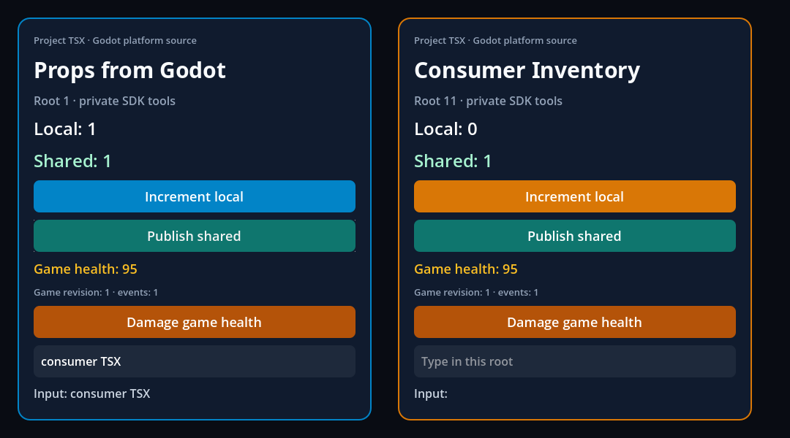

# Typed game services and independent consumer checkpoint

Recorded **2026-10-03**, with original React **19.2.3**, RN **0.87.1**, Hermes
**250829098.0.17** and official Godot **4.7.2**, on macOS arm64. Godot was not
rebuilt. [Provenance](provenance.json) identifies the source contents, native
binary, bundle and retained artifacts; earlier evidence directories retain
their historical hashes.

## What now runs

The [public API](../../GAME_SERVICES.md) connects GDScript methods, state getters
and ordinary signals to React through a real JSI TurboModule, Promises and
AsyncEventEmitter. Registration precedes the first React mount. An initial
snapshot pairs a value with its revision; an intervening change triggers a
retry while the separately installed happening listener retains the signal.
The game owns rules and jobs. React owns its UI representation, optionally
through Zustand or another store.

| Executed fixture | Result | Retained report |
| --- | ---: | --- |
| Services laboratory, headless | 36/36 | [services-headless.json](services-headless.json) |
| Services laboratory, renderer | 39/39 | [services-native.json](services-native.json) |
| Real Hermes DTO/generation boundary | 133/133, including 64 exact rejections | [boundaries.json](boundaries.json) |
| Terminal stop/synchronous application destruction | 15/15 | [lifetime.json](lifetime.json) |
| Independent consumer, build/dependency ownership | 18/18 | [consumer.json](consumer.json) |
| Independent consumer, headless | 40/40 | [consumer-headless.json](consumer-headless.json) |
| Independent consumer, renderer | 43/43 | [consumer-native.json](consumer-native.json) |
| Interactive example regressions | 15 cases, 605/605 | [examples.json](examples.json) |

Commands: `npm run test:services`, `npm run example -- services --headless`,
`npm run example -- services --capture`, `npm run test:consumer -- --capture`
and `npm run test:examples`. Native runs are sequential because report paths
are shared. The runner removes prior reports and rejects missing markers,
unexpected errors, crashes, script failures and failed assertions.

## State, pause and accepted game work

The first getter changes health to 95 while the connection is reading. HUD and
inventory observe the consistent revision. Zustand 5.0.15 shares the React
representation; both roots retain separate local state.

The equip method acknowledges acceptance with a job identifier. Inventory
unmounts while the pausable GDScript timer continues to own that job. During
simulation pause, the UI timer advances and the job stays pending. After resume,
HUD receives `bronze-blade` and completion. Closing UI did not cancel game work;
another explicit operation tests cancellation.

Hide preserves the existing mount/state; unmount retires it. Remount retains
the shared game representation and resets local React state. Shutdown removes
signals, connections, bindings, native tags and queued work.

## Same services in an independent TSX project

The consumer has its own scene, TSX, manifest and lockfile. The SDK's
`runtime_available` hook registers game services before the roots mount. Public
`@godot-fabric/runtime` imports deliver the initial revision, typed completion
and ordered signals to both native health labels. Closing one root keeps the
other root's application connections; final React cleanup removes them once.
No game C++ or state-management dependency is required.

Inventory narrows to 430 points. Yoga constraints and original RN
`measureInWindow` agree with Godot's global rectangles within **0.1 point**.
HUD constraints/state and RN window/screen metrics remain stable. Native
editing reaches only inventory; restoring its width updates the same ref
without remounting. The retained report includes both measured rectangles.

The 18 ownership checks retain offline builds without global Node, project
lockfile preservation, type/syntax/resource/tool/dependency rejection and
recovery, and project-library hooks with one React identity.

## Boundary and destruction evidence

The DTO fixture copies valid accented/supplementary Unicode, plain/null-prototype
objects and dense arrays across the real native boundary. It exercises exact
depth/node limits and rejects lossy strings, accessors, hidden fields, symbols,
extra array properties, holes and custom prototypes through both the public
facade and direct native module. Getter and game-call counters prove rejected
input did not execute user code. NUL/lone surrogates remain an explicit
`E_SERVICE_DTO_STRING` gap, not full string-domain parity.

Revoking/rebinding a name changes its generation and cancels old queued calls
and deliveries. Destroying a source invalidates its connections. Seventy calls
and 140 state events exceed the host's 64-task/128-event phase budgets, retain
order and complete while a timer/frame callback also advances. Two precisely
expected binding-closure diagnostics are checked; other errors still fail.

The lifetime fixture stops an application before its first mount, then proves
later activation rejects without constructing Hermes. A fresh application
mounts real Controls; a registered GDScript method synchronously calls
`application.free()` and returns. The independent deferred host phase survives,
the pending operation rejects, and the surviving surface has zero roots/tags,
balanced creates/deletes and no scheduler or deferred-host authority. This is
runtime evidence, not a sanitizer certification. The one expected stopped-mount
error is matched exactly and every other native error fails.

## Regressions and limits

[regressions.json](regressions.json) additionally records native modules,
metrics errors, shared roots/clock, activation failures, timer errors, two fresh
cold projects and 13 Godot oracle cases. Strict public types, 47 Node contract
tests, 10 Python fixtures and static analysis passed locally. Hosted CI must
still be read for the published head; a local subset is not target certification.

This checkpoint advances GF-07/GF-08/GF-09/GF-25/GF-28. Complete generated
module/component specs, byte-size policy, full string domain, cross-thread
execution, activation/reload/restart generations, OS services, mobile service
consumers and platform parity remain open. The independent consumer's
geometry/service proof and laboratory's pause/job proof remain separate;
[the roadmap](../../../ROADMAP.md) retains their integrated acceptance gaps.
D19–D32 are still pending. The separate [iOS experiment](../../IOS_BUILD.md)
has its own versions, hashes and narrower export/runtime limitations.
