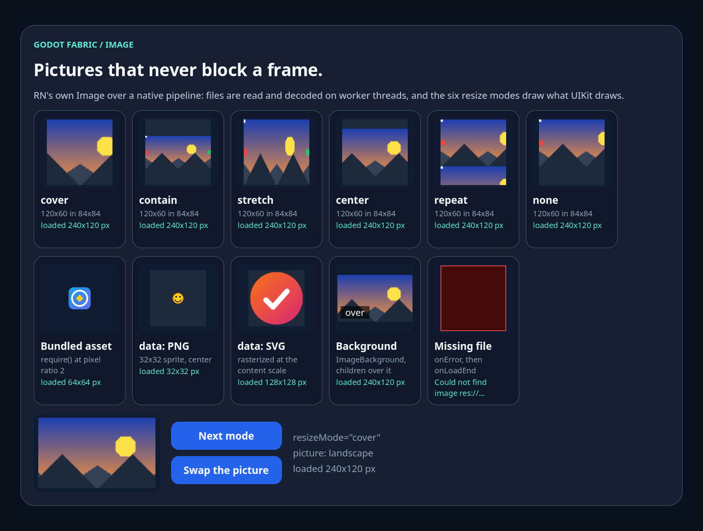
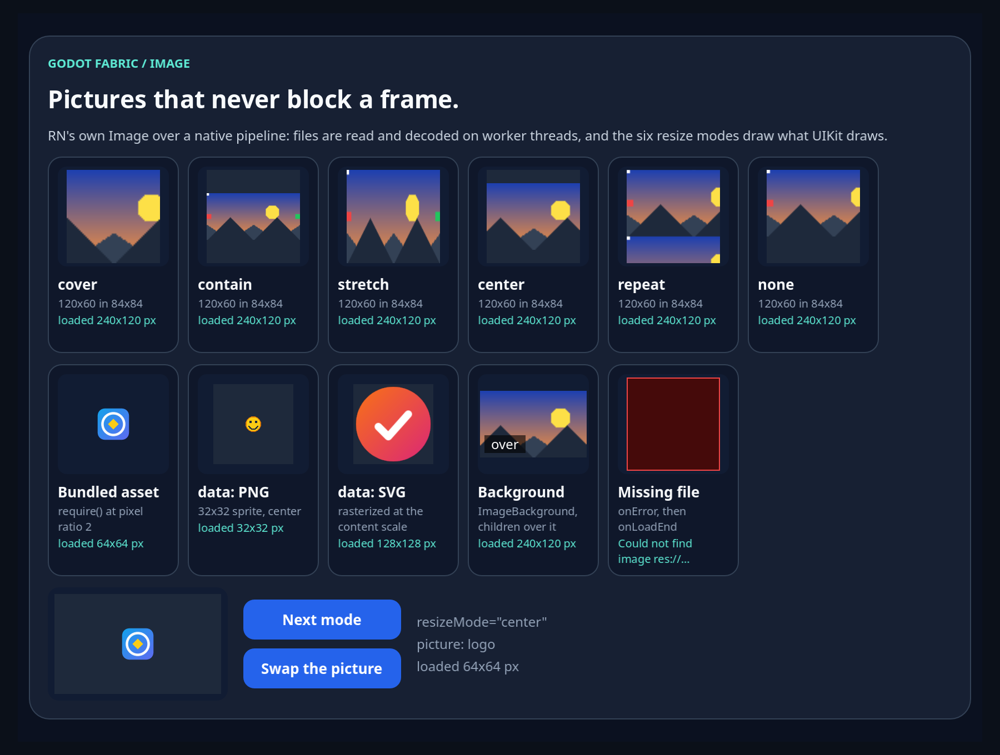

# Image: o pipeline de imagens do RN sobre decodificação em threads do Godot

Esta fatia entrega o `Image` público, o `ImageBackground`, o `AssetRegistry` e o
`Animated.Image`. Antes, `Image` e `ImageBackground` eram placeholders que lançavam erro ao
renderizar. Agora o facade renderiza o `Image.ios.js` original do RN 0.87.1 atrás de um wrapper
que recusa o que o host ainda não implementa, e quem decide quando uma imagem é pedida é o
pipeline C++ do próprio RN: o `ImageShadowNode` pede a imagem de dentro do layout, o
`ImageRequest` e o coordenador de observadores guardam o estado, e o host só fornece o
`ImageManager`, a leitura e a decodificação em threads do `WorkerThreadPool` do Godot e a view
`GodotImage`, que desenha a textura com os seis modos de redimensionamento do UIKit. O
[recibo](report.json) fixa fontes, hashes e resultados.

| Lane executada | Checks | Observação |
| --- | ---: | --- |
| Host anterior `6716da5a`, mesmo bundle | 8/11 | Só 11 checks são alcançáveis lá: falham exatamente os 3 normativos de montagem e de contrato; as outras 60 normativas não são executadas |
| Sabotagem retida: a decodificação roda na main thread | 62/74 | 12 falhas, e o oráculo independente rejeita o relatório |
| Sabotagem retida: a view não larga o pedido que trocou | 72/74 | 2 falhas, e o oráculo independente rejeita o relatório |
| Host atual `2e7eab76`, headless | 74/74 | Frames reais do SceneTree, 44 Images montadas e o oráculo independente sobre o relatório |

```sh
npm run test:images
```

## O que o RN faz

O `ImageShadowNode` pede a imagem dentro do `layout`: o `updateStateIfNeeded` escolhe a fonte
(a única, ou a de melhor ajuste de área entre várias), dá a ela o frame de conteúdo e a escala
dos pontos e, se a fonte ou os parâmetros mudaram, grava um `ImageState` cujo `ImageRequest`
nasce do `ImageManager` achado no `ContextContainer` sob a chave `"ImageManager"`. O
`ImageRequest` é um coordenador de observadores com duas funções, retomar e cancelar: observar
um pedido concluído entrega e consome a resposta, tirar o último observador de um pedido em
andamento cancela, e observar um pedido cancelado o retoma. A montagem iOS
(`RCTImageComponentView.mm`) troca o observador quando o pedido do estado muda, emite
`onLoadStart` quando a fonte muda, e depois `onLoad` e `onLoadEnd`, ou `onError` e
`onLoadEnd`, com o tamanho em pixels (pontos vezes a escala da fonte). O gerenciador iOS pede a
decodificação com o frame de conteúdo, `clipped:NO` e o modo de esticar, e o
`RCTDecodeImageWithData` trata esticar como cobrir, nunca amplia e só cria uma miniatura quando
a fonte é maior que o alvo. Um asset empacotado é carregado inteiro e informa progresso `(1, 1)`
só em caso de sucesso. No JavaScript, o `resolveAssetSource` e o `AssetSourceResolver` transformam
o descritor que o módulo do Metro registra no `AssetRegistry` num arquivo ao lado do bundle, e o
`pickScale` escolhe a primeira escala maior ou igual à razão de pixels. As referências com linha
estão na [nota de pesquisa](../../research/images.md).

## O que este host fazia

O facade exportava `Image` e `ImageBackground` como `unavailable(...)`, que lançavam erro ao
renderizar, o `AssetRegistry` não era exportado, o `Animated.Image` falhava com "Image is not
implemented" e o `ContextContainer` da aplicação não tinha `ImageManager`. O host anterior não
registrava o `ImageComponentDescriptor` gerado nem o módulo `ImageLoader`: o mesmo bundle falha
nele onde o `Image.ios.js` pede o módulo, com `TurboModuleRegistry.getEnforcing(...): 'ImageLoader'
could not be found`.

## A implementação

1. O [wrapper](../../../src/image.jsx) renderiza o `Image.ios.js` original depois de
   [recusar](../../../src/image-contract.mjs) `tintColor`, `blurRadius`, `capInsets`,
   `defaultSource`, `loadingIndicatorSource`, `fadeDuration`, `progressiveRenderingEnabled`,
   `resizeMethod`, `resizeMultiplier`, `overlayColor`, o raio de borda no estilo da Image e
   `headers`, `method`, `body` e `cache` nas fontes, com a mensagem do host que nomeia a prop e o
   motivo; valores inválidos, ids de asset não registrados e uma Image dentro de `Text` também
   falham ao renderizar. O `Image.ios.js` carrega no primeiro uso, porque ele pede o módulo
   `ImageLoader` ao ser avaliado: um bundle sem imagens, ou rodando num host sem o módulo, ainda
   avalia, e a falha de um módulo que lançou na avaliação fica guardada.
2. O plugin de plataforma do SDK aponta `Image`, `ImageBackground` e `AnimatedImage` para o
   wrapper, e o [plugin de assets](../../../sdk/toolchain/asset-plugin.mjs) faz do `require()` de
   uma imagem o módulo do Metro, com o descritor do Metro (os testes o comparam com o
   `getAssetData` do próprio Metro, hash incluído): cada variante `@Nx` entra num só descritor, os
   arquivos são copiados ao lado do bundle e um `<bundle>.assets.json` lista cada um com o SHA-256
   e o do bundle. O hook de export iOS copia esses arquivos.
3. O [`GodotImageManager`](../../../native/godot_image_manager.cpp), registrado sob a chave do RN,
   monta o `ImageRequest` que o RN espera, com as funções de retomar e cancelar, e entrega a fonte e
   um `weak_ptr` do coordenador ao [`ImageLoader`](../../../native/image_loader.cpp). Quando um
   pedido começa, recomeça ou é cancelado, quem decide é o RN.
4. O `ImageLoader` enfileira jobs (no máximo quatro no pool) e roda cada um com
   `WorkerThreadPool::add_native_task`: leitura, detecção do formato pelos bytes mágicos, leitura
   do cabeçalho, limites, decodificação e redução. A main thread nunca lê arquivo nem decodifica;
   só cria a textura, num orçamento de bytes por pump (uma textura sempre), e avisa os
   observadores na ordem dos blocos do `RCTImageManager`. Cancelar sinaliza o job: a decodificação
   em andamento termina, porque o pool exige que toda tarefa seja aguardada, e o resultado é
   descartado sem textura. Parar cancela tudo, solta o portão da certificação e aguarda cada
   tarefa. Cada job gravado leva a identidade da thread que o rodou.
5. O [`image_core.h`](../../../native/image_core.h) classifica a URI (`res://` e assets empacotados,
   `user://`, `file://`, `data:` em base64 ou com percentual, http(s) recusado pelo nome), lê as
   dimensões do cabeçalho de PNG, JPEG, WebP, BMP, TGA e SVG e recusa as absurdas antes de qualquer
   decodificador, e porta o `RCTTargetSize`. Uma imagem que não é asset empacotado é reduzida para
   cobrir o pedido em pixels e nunca ampliada; um asset empacotado é decodificado inteiro, na
   escala do nome do arquivo; um SVG é rasterizado na escala do pedido.
6. O [`GodotImage`](../../../native/image_view.cpp) é um `Panel` que observa o pedido do estado como
   o `RCTImageComponentView`: troca o observador quando o pedido muda, `onLoadStart` só quando a
   fonte muda, `onLoad` e `onLoadEnd` com o tamanho em pixels, `onError` e `onLoadEnd`, e nada
   depois de se soltar. O [`image_geometry.h`](../../../native/image_geometry.h) calcula os
   retângulos dos seis modos; `repeat` ladrilha no tamanho da imagem em pontos. O módulo
   `ImageLoader` responde `getSize` e `getSizeWithHeaders` só pelo cabeçalho e rejeita o resto como
   descrito nos limites.

## Padrões e desvios

A [nota de pesquisa](../../research/images.md) lista cada desvio do RN. Os que mudam o que se vê:
os códigos de erro do `ImageLoader` vão como prefixo da mensagem (`E_GET_SIZE_FAILURE: ...`) e
não em `Error.code`; `repeat` ladrilha num tamanho inteiro de pontos; um SVG é rasterizado na escala
do pedido; `res://` é tratado como o bundle, decodificado inteiro; `getSize` acredita no cabeçalho;
GIF é recusado; e o arredondamento da miniatura do ImageIO foi assumido como o mais próximo, sem
comparação com um aparelho iOS.

## O que foi verificado

Duas roots de uma aplicação Hermes, 44 Images montadas (41 casos declarados, a sonda de
escala, o `ImageBackground` e o `Animated.Image`) e 74 checks, 63 deles normativos (os que
dependem do pipeline nativo) e 11 estruturais:

- **Montagem e contrato.** Cada Image vira um `GodotImage` nativo e pede exatamente uma vez ao
  loader; cada prop não suportada falha onde a Image renderiza, nomeando a prop e o motivo; a
  recusa de filhos do próprio RN chega ao host.
- **Assets empacotados.** O descritor registrado é o do Metro; o `PixelRatio` é a escala de
  conteúdo da janela, 2; o `pickScale` escolhe o `@2x` e o `AssetSourceResolver` o nomeia ao lado do
  bundle; a textura tem 32×32 pixels com os pixels do arquivo (conferidos pelo hash do
  manifesto); o layout usa o tamanho em pontos do asset, 16×16; os eventos vêm uma vez e na ordem
  `loadStart`, `progress`, `load`, `loadEnd`, com progresso `(1, 1)`; e o decodificador não
  redimensiona o asset.
- **Os seis modos.** Os retângulos de `cover`, `contain`, `stretch`, `center`, `repeat` e `none`
  de uma imagem de 40×20 pontos num frame de 60×60 são os que o UIKit desenha, calculados pelo
  oráculo a partir das fórmulas; só `repeat` ladrilha; a imagem é desenhada no frame de conteúdo,
  dentro da borda e do padding; `objectFit` chega como o modo equivalente; e trocar o modo
  redesenha sem carregar nada.
- **Fontes e formatos.** PNG, JPEG, WebP, BMP e TGA decodificam para os 24×24 pixels do
  cabeçalho, os sem perdas com os pixels que o gerador do fixture escreveu; o SVG é rasterizado na
  escala do conteúdo (24 pontos viram 48 pixels); `user://` e `file://` decodificam os mesmos
  pixels; um arquivo mostrado em 5×5 pontos na escala 2 é reduzido para 20×10 pixels e nunca
  ampliado; `data:` em base64 e com percentual; e o progresso de arquivo e de `data:` segue os
  handlers do iOS. Entre várias fontes, o shell node escolhe a de melhor ajuste.
- **Falhas.** Cada fonte que falha emite `loadStart`, `error` e `loadEnd` e não deixa textura; o
  arquivo ausente diz que não foi achado; imagens corrompidas ou truncadas falham com o erro de
  decodificação do iOS; GIF, formato desconhecido e dados vazios são recusados pelo nome; um
  cabeçalho que declara 65535×65535 pixels é lido e recusado antes de qualquer decodificador; e
  http(s) e base64 inválido falham por `onError`.
- **Threads.** Cada leitura e decodificação rodou numa thread de worker, com identidade
  diferente da main thread (73 jobs em 11 identidades nesta execução, nenhum na main thread); nunca
  houve mais jobs no pool do que o limite; toda tarefa entregue pelo pool foi aguardada.
- **Statics.** `getSize` e `getSizeWithHeaders` devolvem `{width, height}` em pixels para
  `res://`, `data:` e todos os formatos, sem decodificar (uma imagem corrompida ou enorme ainda tem
  tamanho); um tamanho ilegível rejeita com `E_GET_SIZE_FAILURE` para a promise e para o
  callback; `prefetch` rejeita dizendo que o host não tem cache; `queryCache` não acha nada; e o
  `resolveAssetSource` escolhe a escala pelo `PixelRatio`.
- **Escalas e troca.** Nas razões 3, 1 e 2 o `pickScale` escolhe `@3x`, `@1x` e `@2x`, cada
  textura com os pixels da variante e o layout em 16 pontos; uma Image com várias fontes escolhe de
  novo quando a escala muda. Trocar a fonte troca o pedido, com um `loadStart` e depois os eventos
  da imagem nova; renderizar a mesma URI de novo não carrega nem informa nada.
- **Orçamento de upload.** Com um orçamento de um byte, cada poll cria exatamente uma textura
  (`peakUploadsPerPoll` 1) e as seis imagens ainda carregam.
- **Decodificações em andamento.** Com o pool segurado, um pedido trocado durante a
  decodificação não informa nada, só o que o substituiu; a decodificação que termina depois do
  cancelamento é descartada e não cria textura; desmontar uma Image com a decodificação em
  andamento não entrega nenhum evento além do `loadStart` e não vaza textura; desmontar a raiz
  descarta a decodificação em andamento, cancela os cinco pedidos que esperavam e não vaza nada.
- **Parada.** Parar a aplicação com decodificações em andamento aguarda todas: as tarefas
  iniciadas são as aguardadas, nada fica no loader e nenhuma textura sobrevive.

Nenhum check fixa uma contagem que dependa de ritmo de quadros ou de tempo: as esperas são por
estado, o pool é segurado por um portão, e as cotas (no máximo 4 em voo, 1 textura por poll com
orçamento de um byte) vêm de limites com motivo. No fim da execução registrada o loader contava
71 pedidos (43 carregados, 14 falhos, 5 cancelados, 3 descartados e 6 ainda em andamento ou
esperando quando a aplicação parou), 74 tarefas iniciadas e 74 aguardadas, nenhuma textura viva
e um pico de 4 jobs no pool; esses números são observações desta execução.

## Controles

O host anterior foi preservado e roda o mesmo bundle. Como o módulo `ImageLoader` não existe
lá, a montagem falha e a sonda só executa os estágios que independem do pipeline nativo: 11
checks, dos quais os 8 que independem do pipeline passam e os 3 que dependem dele falham (a
montagem das Images, a contagem de pedidos e a recusa de filhos do RN). As outras 60 checks
normativas não são executadas nesse host, o que o recibo registra como tal. O log mostra o erro
`'ImageLoader' could not be found` por Image, sem crash e com o cleanup balanceado, e o oráculo
aceita o relatório em modo original.

As duas sabotagens retidas quebram um comportamento cada e o oráculo rejeita as duas no mesmo
ponto, a sequência de eventos do estágio com decodificação em andamento. Na primeira, a
decodificação roda na chamada que enfileira o job em vez de no pool: 12 checks falham (as
identidades de thread, as tarefas aguardadas, os estágios com o pool segurado, a desmontagem e a
parada), porque nada fica em voo para segurar e os eventos do pedido trocado chegam de uma vez. Na
segunda, a view não tira o observador do pedido que trocou, então esse pedido não é cancelado e
sua imagem ainda chega depois da que o substituiu: 2 checks falham. As fontes foram restauradas
byte a byte (os dois SHA-256 antes e depois conferem) e o rebuild reproduziu o host `2e7eab76`.

O oráculo também recusa 15 mutações do relatório genuíno, cada uma pelo motivo que o dano nomeia
(progresso de arquivo, thread de worker, thread da main, pixels da variante, o corte do `cover`, o
ladrilho do `repeat`, a decodificação cancelada descartada e sem textura, o orçamento de um byte,
as tarefas aguardadas, o arquivo ausente, o http(s), o descritor do Metro, o `prefetch` e a escala
do `pickScale`).

## Capturas

O exemplo interativo [`images`](../../../examples/images/README.md) abre no launcher com
`npm run example -- images`, e `npm run example -- images --capture` salva dois quadros do
renderizador nativo, de 1800 × 1360 pixels (900 × 680 pontos na escala de conteúdo 2), enquanto a
validação dele clica de verdade nos dois botões e lê cada imagem na `GodotImage` que a mostra, no
que o JS observou e, com o renderizador, em pontos do quadro (17 checks headless, 25 com o
renderizador). O recibo registra o caminho, o SHA-256 e as dimensões de cada quadro, e os bytes se
repetiram em duas execuções.



**Os seis modos e as fontes.** Os seis modos de uma paisagem de 120×60 pontos em frames de 84×84:
`cover` recorta as marcas vermelha e verde das bordas, `contain` a mostra inteira entre duas
faixas, `stretch` a distorce, `center` mostra o miolo no tamanho natural, `repeat` a ladrilha no
tamanho em pontos e `none` a desenha no canto superior esquerdo com a parte de baixo vazia. Abaixo:
o logo de 32 pontos lido do arquivo `@2x` (carregado como 64×64 pixels), o sprite PNG de 32×32 pixels
centralizado, o SVG rasterizado em 128×128 pixels, o `ImageBackground` com o texto `over` sobre a
imagem e o arquivo ausente como uma caixa vermelha escura com o erro `Could not find image res://...`.
O preview está em `cover` e diz `loaded 240x120 px`.



**Depois dos cliques.** Nove cliques reais em `Next mode` levam o preview por contain, stretch,
center, repeat, none e cover (sem carregar nada) e depois por contain, stretch e center; um clique em
`Swap the picture` carrega outro pedido. O preview mostra o logo em `center`, com
`resizeMode="center"`, `picture: logo` e `loaded 64x64 px`, e as onze imagens de cima ficam iguais.

A validação compara a cor de pontos do quadro com as marcas que a imagem tem (a marca vermelha da
borda esquerda aparece em stretch, contain e repeat e é cortada em cover e center; `none` desenha o
pixel branco do canto e deixa o fundo embaixo; as seis telhas têm seis digests diferentes) e a
imagem que falhou não deixa pixels de imagem. Não há oráculo independente de pixels do quadro
inteiro, e a comparação com o UIKit segue aberta em Limites.

Estas execuções são locais: a CI hospedada ainda não rodou esta fatia.

## Regressões

Todas as suítes do job `native-cold-start`, o `test:examples`, o `test:contracts`, a análise
estática, o scan de publicação e o `type-check` rodaram uma vez na árvore da implementação antes
da rodada de revisão. Oito passos falharam nessa primeira passada por motivos alheios ao
comportamento testado e foram corrigidos e repetidos: a análise estática (itens não usados e
uma importação não listada nos arquivos novos), os controles e as sabotagens locais de outras
suítes (Animated, relógio de quadros, rede, WebSocket e os guards de transform), que fixam bundles
e produtores que esta fatia mudou, o `codegen-native` com um diretório de saída reaproveitado e a
própria lane de Imagens contra um controle defasado. Esses recibos vivem só em `build/`, não vão
para o git e não existem na CI; foram refeitos nos hosts anteriores preservados, com os antigos
guardados como `*.pre-images.json`, e as cinco sabotagens afetadas (Animated, relógio de quadros,
rede, WebSocket e a singular dos transforms) foram refeitas. O check do Animated que listava
`Image` entre os componentes que falham ao renderizar passou a não listá-la, porque o
`Animated.Image` agora renderiza; a suíte continua passando.

Depois da rodada de revisão, que extraiu a guarda de vida do mount dos controles e trocou o
fingerprint dos pixels por uma seam da certificação, na árvore commitada passaram a suíte de
Imagens (74 na lane atual, 3 falhas normativas no controle, 12 e 2 nas sabotagens), o teste C++ do
núcleo (`IMAGE_CORE_PASSED`, 7 grupos e 68 asserções), Animated, Switch, Touchables, comandos de
foco, toques compartilhados, click, módulos, os 31 exemplos, os testes de contrato (7, 8 e 291 testes
Node e 13 Python), a análise estática, o scan de publicação e o `type-check`. O recibo
registra cada passo.

As 159 fontes de código e configuração executadas (16 do bundle e da suíte, 95 do build nativo, 30
de verificação e 18 do fixture, com sobreposição) correspondem à implementação
`552fb56a098f35beb41a0a333f99f0f35b4b3ec9` por `git show`/SHA-256, e as lanes rodaram dessa árvore
commitada, sem fonte alterada durante a execução. Os documentos desta fatia foram escritos
depois delas; os gates que os leem rodaram de novo na árvore final.

## Limites

- **Imagens de rede.** Fontes http(s), com `headers`, `method`, `body` e `cache`, falham por
  `onError` nomeando a fatia futura; dependem do GF-22 e de uma camada de pedidos para imagens.
- **Cache e prefetch.** Não há cache de imagem decodificada, `prefetch` real nem `queryCache`
  real: cada Image lê e decodifica o arquivo de novo.
- **Props visuais.** `tintColor`, `blurRadius`, `capInsets`, `defaultSource`,
  `loadingIndicatorSource`, `fadeDuration`, `progressiveRenderingEnabled`, `resizeMethod`,
  `resizeMultiplier` e `overlayColor` falham onde a Image renderiza, e um raio de borda no estilo
  da própria Image também (o host recorta só retângulos).
- **Formatos.** GIF e WebP animados, `nativeImageSource` e Image dentro de `Text` não são
  entregues.
- **Export.** Os assets foram carregados do diretório do projeto (`res://build/...`) e de
  `user://`; o hook de export iOS copia os arquivos do manifesto, mas nenhum app exportado, export
  desktop ou Android foi executado.
- **Pixels.** As capturas são do renderizador nativo do macOS na escala 2 e a validação amostra
  alguns pontos; não há oráculo independente do quadro inteiro, e o arredondamento da miniatura do
  ImageIO, a geometria exata do ladrilho do UIKit e a memória de decodificação num aparelho não
  foram comparados com o iOS.
- **Plataformas.** Só macOS arm64 foi executado; Windows, Linux, Android, iOS e Web não foram
  exercitados, nem hardware real.
- **CI.** A CI hospedada desta fatia está pendente.

Nenhum GF inteiro, contrato, paridade, alvo, outro checkpoint, peso ou denominador fecha: só o
checkpoint de fatia do GF-16.
