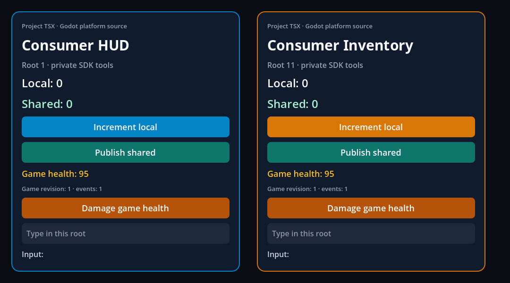

# macOS Release export: executed minimal consumer

Producer `58f527193039222b19794960e7b662cb34c65e74`, with main `ec831ac` (LayoutAnimation) integrated, produced and published a signed, relocated macOS arm64 Release application. The run began at 20:04:52.883 UTC and finished at 20:05:27.433 UTC on 2026-10-08. This is local validation of the minimal consumer; hosted CI and the delivery PR review are pending.

The final app contains one Godot engine, one addon host, the two required runtime frameworks and a 27-file PCK. Its regular files total 106,438,140 bytes (filesystem allocation and symlink metadata are separate). React 19.2.3, RN 0.87.1, Hermes 250829098.0.17 and Godot 4.7.2.stable.official.ed1daf0bf are pinned/observed. [Executed summary](executed-summary.json), [app receipt](executed-export.json), [original/public file hashes](executed-observation-files.json).

The exact SDK manifest and actual builder report/bundle were retained before disposable project cleanup. The [independent root review](root-independent-review.json) passed 18 checks, including all 219 source pins against producer Git blobs, SDK/report/bundle bindings, exact PCK contents, capture hashes and final-path `codesign --verify --deep --strict`. Source, unsigned and signed binary hashes are distinct in the receipt.

The exported executable ran from outside the disposable project, after moving the app, with Node absent from PATH and DYLD overrides removed. Its reports preserve the exact ordered 40 headless / 43 macOS assertions from the editable consumer. All three captures are 1080×600 and byte-identical to the editable baseline; they were produced by the exported app in this run.

[Actual headless log](executed-runtime-headless.log), [actual graphical log](executed-runtime-headed.log), [export log](executed-macos-export-release.log), [payload preflight](executed-macos-export-preflight.log). The empty [final signature log](executed-root-final-signature.log) accompanies an independently observed successful exit; the root review records the verdict.

The [native control report](native-controls.json) records an unchanged signed copy after repeated framework normalization, plus four rejected mutations: absent RN framework, modified enclosing Info.plist, an absolute RPATH added by `install_name_tool`, and a changed source lock in an independent native-input copy. Each uses the production gate and retains its actual diagnostic. These copied-app controls test admission gates; they do not claim that each mutation ran the entire export/publish pipeline. The lightweight CLI lane separately verifies existing and dangling-symlink output refusal.

The native lane passed all 7 tests without skips, including the isolated 28-control payload/hook test. Contract testing recorded 327 Node tests: 326 passed and one explicit native-export skip; all 23 Python tests passed. The dedicated macOS CI step supplies the reviewed template and repeats the native lane; its hosted result remains pending.

## Packaging changes and limits

The official template archive was checked against its locked 1,281,349,702 bytes and SHA-256 before deriving a private arm64 member. The [derivation observation](official-template-derivation.json) binds the official TPZ, its macOS ZIP, universal engine, thinned member and derived archive. Installed templates were not modified.

The stock exporter omitted both runtime frameworks. The new platform hook includes them and reuses the same payload validation as iOS. Preflight is mandatory because an export-plugin error alone did not make Godot exit nonzero in the retained stock experiments.

The official RN framework archive ships flattened copies for its root binary, Resources and Versions/Current, plus four resource bundles at the root. macOS signing rejected that structure. The staged-app normalizer checks duplicate bytes before replacing aliases, moves the known resource bundles into Versions/A, and preserves their root lookup through matching links. Nested bundles are signed before the framework. This preserves the vendor/SDK inputs and follows [Apple's versioned-framework requirements](https://developer.apple.com/library/archive/technotes/tn2206/). Godot emits a warning when generating missing Hermes plist fields; actual deep/strict signing and both runtimes passed.

The proof uses the same Mac and fresh per-app user data. It does not establish a clean OS user profile, another Mac/VM, Developer ID distribution, notarization, mobile behavior or the Frontier game's twelve-turn replay. Only the `plugin` and `assinatura` criteria of V05-07 are locally satisfied. The other V05-07 criteria, all exit criteria and the complete GF-28 acceptance remain open. The 1.0 task model stays unchanged.

## Historical preparation

The earlier [editable baseline](editable-baseline-receipt.json), [baseline root review](editable-baseline-root-review.json) and stock observations retain their own provenance. Their captures are named `editable-*`; they are separate from the exported captures above. [Pre-implementation file hashes](pre-implementation-files.json) distinguish original observations from path-redacted public copies. Original JSON/log observations stay untouched under ignored build directories.

The first stock setup attempt failed on missing texture import configuration before the hook ran. A later stock export returned zero and included one host but no Hermes/RN frameworks. The [stock inventory](stock-export-inventory.json) and [invocation](stock-export-invocation.json) record that concrete gap, rather than runtime acceptance. Early implementation attempts and framework-layout signing probes also remain under ignored build directories, including the valid bare-RPATH rejection and flattened-framework failure; no app was published from those rejected attempts.

The [implementation review](implementation-review.md) records the structural fixes and actual builder checks with two PNG variants and missing-manifest rejection. Those asset preflight checks do not claim an image-bearing exported-app acceptance; the minimal consumer is intentionally asset-free.
