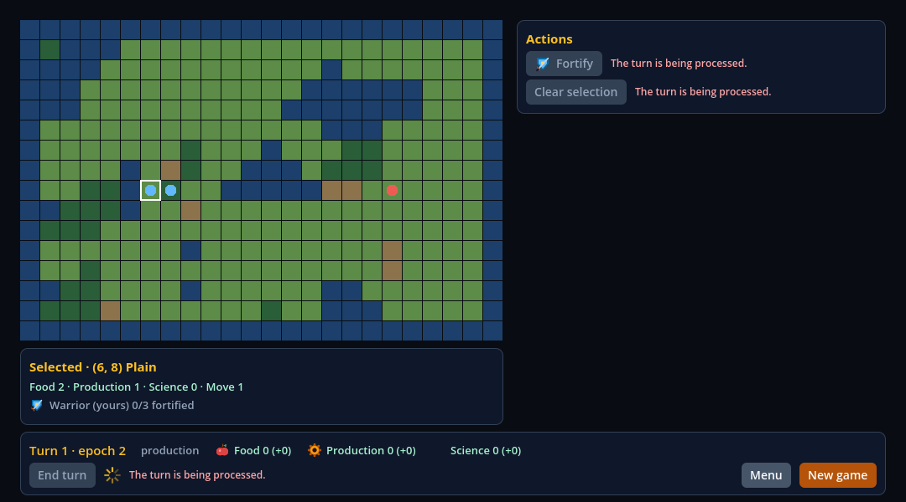
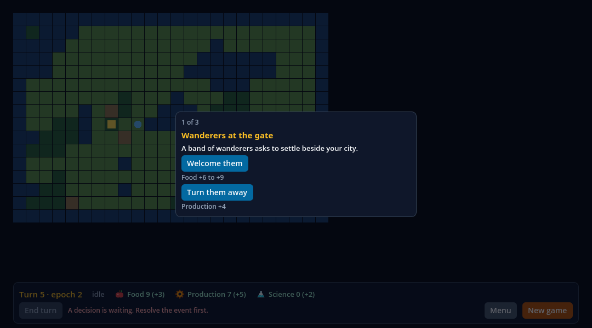
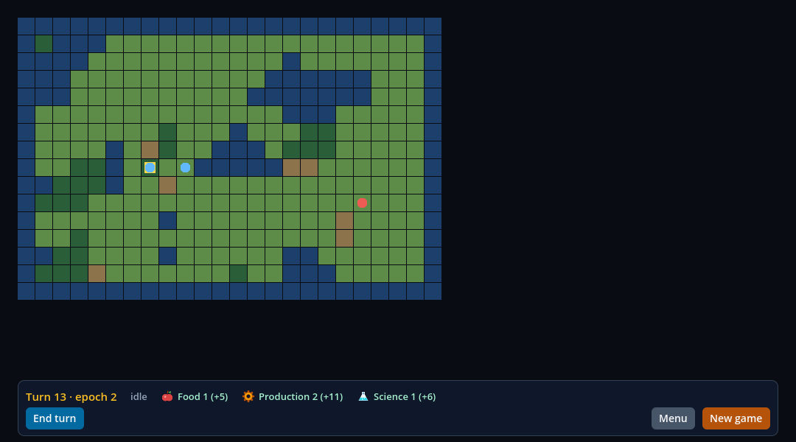

# Frontier como `.app` Release: o replay de 12 turnos no hash dourado (V05-07, critério `replay`)

Registro do commit de implementação `5da4e7729b71e427e4dfd80a612bf0d5a6c2a3b9`. Fecha o critério `replay` do V05-07 e as saídas X1, X2 e X7 do marco 0.5, no limite **mesmo Mac, perfil limpo**:
o critério `limpa` (segundo Mac ou VM sem Node, Godot e Xcode) **não é reivindicado** e continua aberto.

## O que foi provado

- O jogo (`consumers/civ-lite`, Frontier) é exportado como um `.app` Release do Godot 4.7.2 arm64 com os frameworks Hermes e React Native embutidos, assinado ad hoc
  (`codesign --verify --deep --strict` passa), com `otool -L` e `LC_RPATH` só do próprio bundle e do sistema.
- O replay de 77 intents (12 turnos) chega ao **mesmo hash dourado e ao mesmo hash de trilha** que o lane headless fixa
  (`tests/civ-lite-game-native.test.mjs`) em **6 de 6 execuções**: 3 no projeto provisionado (binário do editor) e 3 numa cópia do `.app` feita em outro diretório,
  cada uma em um perfil de usuário limpo.
  - hash dourado: `cb7ab974f47f18c37ae96bda57ffd1b87f8c3733e251a386040dc17ccb540e8d`
  - hash de trilha: `ed43495ec48d896c0eb0c4f9a7b97471be86f37082218d16a8411d0f3766275e`
- A matriz da HUD (`-- --validate-hud`: 46 passos, os 6 painéis, os 7 contextos) passa no `.app` Release: 152 de 152 checks, julgados de novo pelo oráculo independente
  do lane da HUD (`tests/civ-lite-ui-oracle.mjs`). É a parte do X1 que o `.app` ainda não tinha.
- Uma sabotagem retida (a semente do jogo alterada na cópia descartável do projeto) é rejeitada nas 6 execuções pelos hashes fixados, e nada é publicado.

## Execução

Tudo foi executado na árvore limpa do commit `5da4e7729b71e427e4dfd80a612bf0d5a6c2a3b9` (o SDK provisionado registra `sourceDirty: false` e esse commit), uma execução depois da outra, com o template derivado
`macos-arm64-template.zip` (SHA-256 do arquivo e do membro arm64 em `report.json`):

| comando | resultado |
| --- | --- |
| `npm run test:export:civ-lite` | 1 de 1 passa, 0 pulados: o replay nas 6 execuções, a matriz da HUD no `.app` e o oráculo independente |
| `npm run test:export:macos` | 14 de 14 passam, 0 pulados: o lane do minimal (40/43 checks, três capturas, sete controles rejeitados) com o runner generalizado |
| `node scripts/macos-export-civ-lite-sabotage.mjs` | `MACOS_EXPORT_CIVLITE_SABOTAGE_REJECTED: game-seed` |

**O primeiro run hospedado.** O run de Contracts disparado na branch (38068936447) passou o export, as seis execuções do replay e a matriz da HUD, e falhou depois, na auditoria do app publicado:
a varredura por caminhos da máquina de build deixava de excluir os dois binários dos frameworks, porque a lista de binários nomeava os links de topo de cada framework e a varredura percorre os arquivos
reais em `Versions/`. No runner os frameworks são construídos no workspace e carregam o caminho dele; no Mac do desenvolvedor não carregam, e a auditoria passava por acaso. A execução deste registro, em
`5da4e77`, continua valendo como evidência daquele commit e não foi alterada. A correção (a exclusão pelo caminho real de cada binário, com a conferência de que os quatro foram achados na varredura)
está no commit seguinte, e os recibos da CI hospedada vêm depois do merge.

## Capturas

Três quadros do replay tocando no `.app` Release, o `Frontier.app` cujo SHA-256 (`21c248a6…`) está em `report.json` e que foi conferido de novo, igual, depois da captura. Foram gravados
com o Movie Maker do próprio Godot, sem mudar código nenhum, numa janela de verdade (renderer de compatibilidade sobre o Metal), de um diretório de trabalho fora do repositório:

```sh
"<app>/Contents/MacOS/"* --write-movie <diretório>/frame.png --fixed-fps 60 -- --validate-replay
```

A execução gravou 73 quadros de 1080×600 a 60 FPS; os outros 70 foram apagados na hora. O diretório de dados do aplicativo não existia antes e foi removido depois. Os hashes que esta execução imprimiu são os fixados
(`CIVLITE_REPLAY_HASHES: golden=cb7ab974…540e8d trace=ed43495e…66275e`, `CIVLITE_REPLAY_PASSED: 246`). Ela ilustra, não prova: a evidência é a do lane, com os perfis limpos.

| quadro | arquivo | o que mostra |
| --- | --- | --- |
| 2 | `app-start.png` | pouco depois de a tela do jogo aparecer (o quadro 0 ainda diz "Connecting to the game"): turno 1, o primeiro job em andamento, o mapa, o painel de ações, o cartão da casa selecionada e a barra |
| 24 | `app-mid.png` | no meio do replay, turno 5: o diálogo de evento "Wanderers at the gate" (1 de 3) sobre o mapa, com o End turn desabilitado pela razão do jogo |
| 72 | `app-end.png` | o último quadro: turno 13 em repouso, com os recursos do fim do replay |







## O desenho

**A porta do replay.** Um Release template oficial do Godot 4.7.2 é construído com `disable_path_overrides`: `-s` e `--main-loop` são aceitos e ignorados; `--path`,
`--main-pack` e `--scene` abortam; `--headless` e os argumentos de usuário depois de `--` funcionam. O replay roda, portanto, da cena exportada, atrás de um argumento de usuário,
como o `--validate`. `consumers/civ-lite/replay_validation.gd` é um nó inerte de `main.tscn` (o `ReplayValidation`): com `-- --validate-replay` toca os 77 intents de
`game/replay.gd` pelo `GameServices` (cada `end_turn` é um job que ele espera terminar), calcula o hash da serialização canônica depois de cada intent com o `game/canon.gd`
do jogo (o código com que a sonda headless calcula o seu), imprime `CIVLITE_REPLAY_HASHES: golden=… trace=…` e grava o relatório em `user://` (`res://` é somente leitura num export).
Ele não fixa hash nenhum: os valores fixados ficam fora do jogo. Sai com 0 só quando todos os seus checks passam, e com 1 se algum falha: cada passo respondeu o código e deixou o contexto que o replay diz, cada job de fim de turno terminou, os doze turnos foram aceitos e o turno 13 começa, os sete contextos foram observados e o replay termina em repouso, sem job.
O jogo, a HUD, as outras validações e os hashes fixados não mudaram. A única mudança em outro arquivo do jogo: `hud_validation.gd` grava o relatório em `user://` quando exportado
(`OS.has_feature("template")`) e continua em `res://` no editor.

**O runner generalizado.** `scripts/macos-export.mjs --consumer civ-lite` (o padrão continua `minimal`, com o mesmo caminho, a mesma evidência e o mesmo lane 40/43, que
passou 14 de 14 depois da mudança, ver "Execução"). A parte que transforma um projeto já preparado num `.app` assinado virou a função exportada
`exportPreparedProject({harness, template, staging, bundleIdentifier, bundle, exportFilter, includeFilter, excludeFilter, templateMember, receipt})`, que devolve o app, o executável
e o PCK com seus SHA-256 e o SHA-256 do template; ela não provisiona nada. Os dois consumidores provisionam a sua cópia, validam o payload e chamam a função.
`scripts/macos-export-civ-lite.mjs` tem a etapa de execução do jogo.

**O perfil limpo.** O projeto da cópia descartável ganha o nome `Frontier Export <token>`, então o diretório de dados do aplicativo
(`~/Library/Application Support/Godot/app_userdata/Frontier Export <token>`) é só deste export. Antes de cada execução o runner afirma que o diretório não existe, registra o caminho,
e o remove depois de guardar o relatório byte a byte; o relatório do jogo confirma o mesmo caminho em `OS.get_user_data_dir()` e que o diretório não tinha relatório anterior.
A cópia do `.app` é um clone do bundle num diretório temporário fora do checkout; o hash do bundle é o mesmo antes e depois das execuções e as assinaturas são verificadas de novo depois delas.

## Resultados

| execução | onde | hash dourado | hash de trilha | checks do gate |
| --- | --- | --- | --- | --- |
| `replay-editor-1` a `-3` | projeto provisionado, binário do editor, headless | `cb7ab974…540e8d` | `ed43495e…66275e` | 246 de 246 |
| `replay-app-1` a `-3` | cópia do `.app` Release, headless | `cb7ab974…540e8d` | `ed43495e…66275e` | 246 de 246 |
| `hud-app` | cópia do `.app` Release, headless, `--validate-hud` | (matriz da HUD) | | 152 de 152; 46 linhas; 6 painéis; 7 contextos |

Cada execução em modo `app` reporta `template` e `release` verdadeiros e `debug` e `editor` falsos: é o Release template que corre. O oráculo
(`tests/macos-export-civ-lite-oracle.mjs`) lê o roteiro do próprio `replay.gd`, refaz o hash dourado a partir do estado canônico final e o de trilha a partir dos 77 hashes por passo,
confere a identidade dos seis estados e a de cada perfil. `report.json` guarda o SHA-256 dos relatórios e dos logs de cada execução, do app, do PCK, do template (arquivo e membro),
do host e dos frameworks, e das fontes.

## A sabotagem retida

`node scripts/macos-export-civ-lite-sabotage.mjs` troca `const SEED := 4242` por `4243` na cópia descartável do projeto (a tabela está em
`tests/macos-export-civ-lite-sabotages.mjs`; o template `consumers/civ-lite` nunca é editado, e a árvore dele tem o mesmo SHA-256 antes e depois). O jogo toca o roteiro
inteiro e todos os checks do gate passam, porque o gate não fixa hash: só os hashes fixados fora do jogo percebem. As 6 execuções chegam ao hash dourado
`06f416ee…fdcf6d` e ao de trilha `29de813c…e1212`, o export é rejeitado (`The replay did not reach the pinned hashes in 6 of 6 runs`), nada é publicado e o oráculo rejeita os 6 relatórios.

## Repetir

```sh
MACOS_EXPORT_TEMPLATE="$PWD/build/macos-arm64-template.zip" npm run test:export:civ-lite
MACOS_EXPORT_TEMPLATE="$PWD/build/macos-arm64-template.zip" node scripts/macos-export-civ-lite-sabotage.mjs
```

O lane não está em `test:contracts`; a metade sem template é `tests/macos-export-civ-lite-oracle.test.mjs`. O `.app` publicado fica em `build/macos-export-civ-lite-native/Frontier.app`
(o executável é `Contents/MacOS/Frontier Export <token>`); `Frontier.app/Contents/MacOS/* --headless -- --validate-replay` roda o replay num `.app` exportado.

## Abertos

- `limpa`: a prova em um segundo Mac ou VM sem Node, Godot e Xcode. O limite "mesmo Mac, perfil limpo" está no recibo (`limitations`).
- Developer ID e notarização, e o iPhone (NO-GO registrado no X8), fora deste registro.
- Os braços A e B da comparação exportam sem `addons/godot_fabric` e sem os frameworks, como o protocolo os define (o A é o controle sem HUD, o B a HUD nativa em GDScript). O script de medição do slot 3 faz esse export pela função `exportPreparedProject`, e ele ainda está por construir.
- A CI hospedada do lane (passo novo em `native-suites-runtime`) e o Pages vêm depois do merge.
