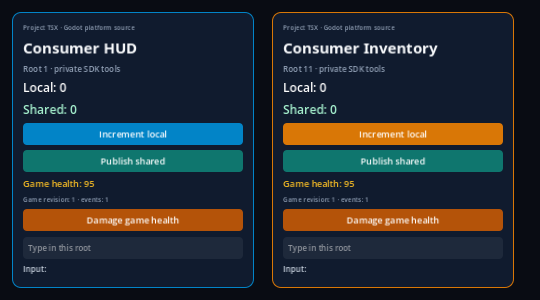
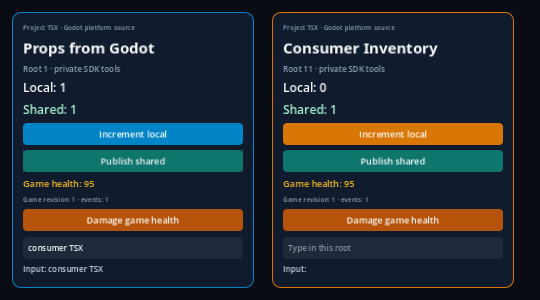
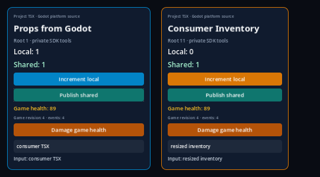

# macOS export containment review

This delta records the local macOS arm64 export produced from clean source commit `881a711b9972421017e98997539e56615586d1e1`. The SDK manifest records 220 clean source pins; its host SHA-256 is `1333055f5ce81a8625a1d3e25cd29adeafc18018260cef5a83882f281552c773`. Those source pins and the reused host bytes match the earlier `29969eb` proof, which had already rebuilt the host after the P1 integration. The macOS export runner and its tests are outside the 220 SDK inputs.

The export receipt passed and was signed ad hoc. The unchanged consumer assertions passed 40/40 headless and 43/43 headed. The separate native lane passed 13/13 with no skips and five copied-app/source controls. The independent local archive audit passed 284/284. The portable review checks passed 11/11 with one explicit native-template skip; contracts ran 396 Node tests (395 passed, one explicit skip) and 23 Python tests; static checks passed with 311 entry points and no issues.

The export ran on macOS arm64; macOS 26.6.2 was read back during the review.
The retained manifest pins Godot 4.7.2, React 19.2.3, RN 0.87.1 and the private
Node 22.23.3; the locked Hermes is 250829098.0.17. Actual export interval:
2026-10-08T23:13:38.221Z–23:14:12.869Z. The executed native command was:

```sh
MACOS_EXPORT_TEMPLATE="$PWD/build/p2-native-export-producer/official-arm64-template.zip" \
  npm run test:export:macos
```

The three captures were produced by this export and byte-match the existing fixed-window publication, so this delta links those files rather than duplicating them:







Evidence: [export receipt](export/receipt.json), [SDK manifest](export/sdk-manifest.json), [build report](export/build-report.json), [headless runtime](export/runtime-headless.json), [headed runtime](export/runtime-headed.json), [native controls](controls/report.json), [284-check local audit](local-audit/audit.json), [source/public hash index](evidence-index.json), [native test log](gates/native-tests.log), [contracts log](gates/contracts.log), [static log](gates/static.log), and [portable review log](gates/portable-review.log).

This is local evidence; final hosted CI for the final head remains pending. It does not prove a second Mac, clean-system replay, Frontier replay, iPhone behavior, distribution signing, or notarization. The earlier remount failure remains unexplained: its sequential replays passed, but did not establish the cause. Raw artifacts stay in ignored `build/` paths recorded in the index; copied text replaces only worktree, home, and disposable-project path prefixes using the fixed-window policy.

The [local dashboard capture](../dashboard-containment-local.md) preserves the
two open P2 criteria; it does not establish a public Pages deployment.
