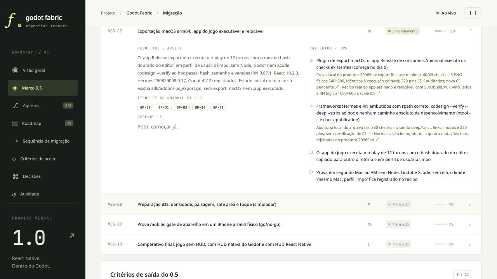

# Local dashboard after containment review

The browser at `http://127.0.0.1:4317/#milestones` read the updated source metadata
for producer `881a711` and showed P2 at 50%, with the game replay and second-machine
criteria open. Frontier remains 31%; release 1.0 remains 20.5% with 0/39 completed
items. This screenshot records the local dashboard, not a public Pages deployment.

[Capture and data hashes](dashboard-containment-local.json),
[executed review delta](containment-review/README.md).
The existing criterion links keep the valid `29969eb` evidence. Only source
metadata and a review activity entry changed; all completion values remain intact.
