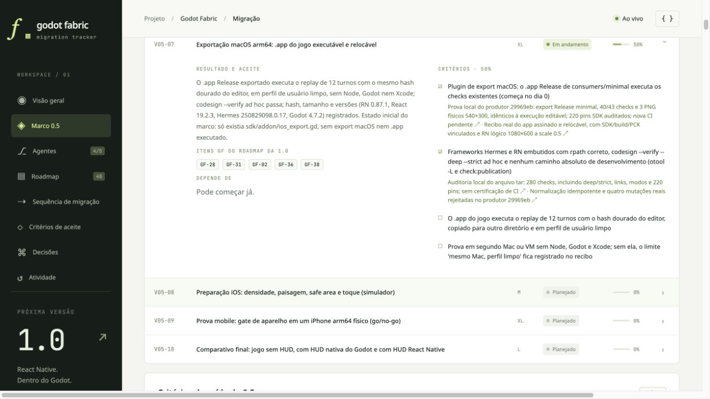

# Fixed-window evidence in the local dashboard

The local dashboard at `http://127.0.0.1:4317/#milestones` displayed the updated
P2 evidence links pinned to documentation commit
`ead6ad46a68083c0ba9fd10e82d296d93750ac23`. The screenshot shows both completed
minimal-export criteria and the two remaining game/second-machine criteria.
This is a local observation, not a Pages deployment.

The [observation record](dashboard-fixed-window-local.json) binds this image to
the served dashboard JSON by SHA-256. The DOM also showed Frontier 13/42 criteria
(31%), 2/10 items and 0/11 exit criteria, and release 1.0 at 20.5%, 32/156 checkpoints
and 0/39 items. No additional done value changed. All 43 dashboard/coordination
tests passed after this update. Hosted CI and public dashboard publication remain
pending; [the actual app evidence](fixed-window/README.md) is local.
