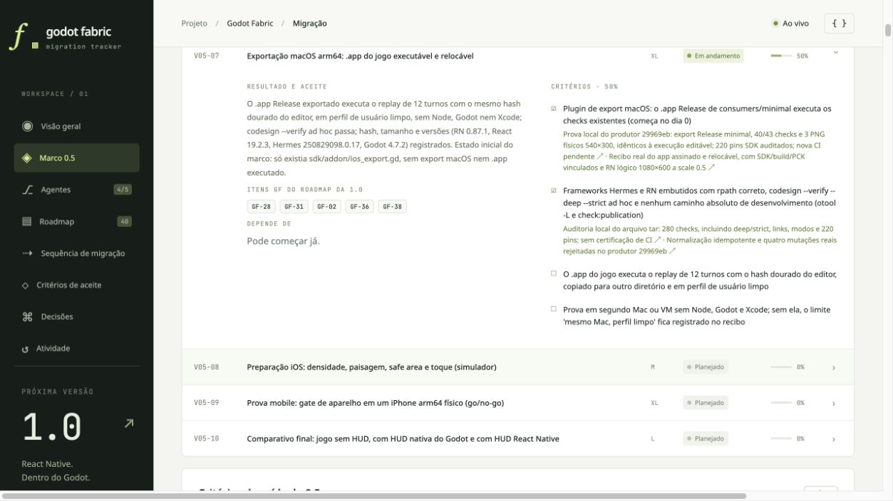
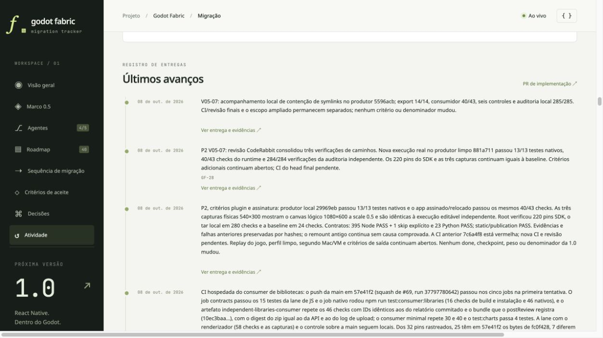

# Dashboard local: symlink review

These actual browser captures record the local dashboard after the symlink review
activity and source metadata were updated to clean producer `5596acb`. The P2 card
stays at 50%, with the Frontier replay and second-machine criteria open. Its existing
criterion evidence links remain unchanged. The activity records the newer local
14/14 native lane, 40/43 runtime checks, six controls and 285-check archive audit.

[Capture hashes and readback](dashboard-symlink-local.json). This is a local browser
observation, not a public Pages deployment. No criterion or 1.0 denominator changed.
