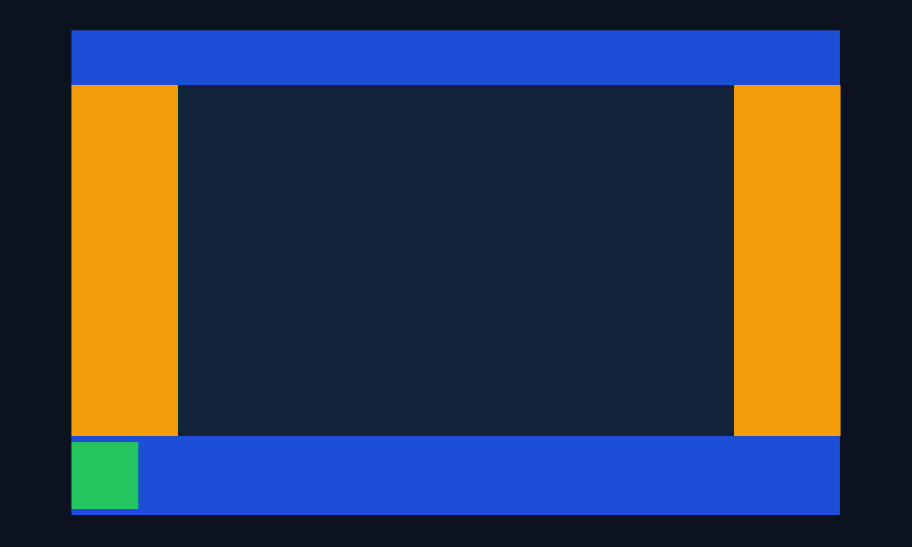
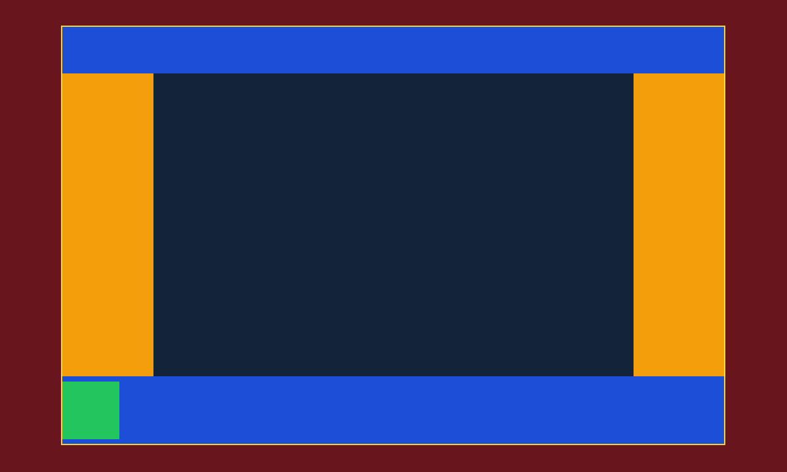
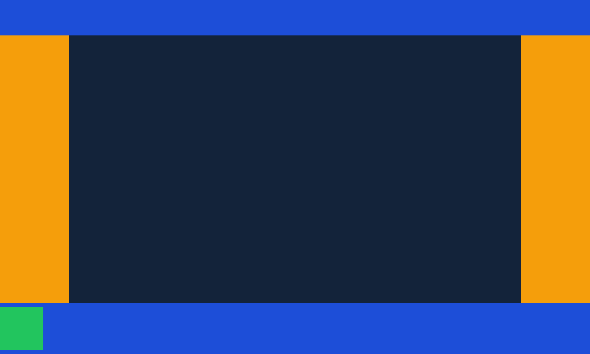

# Densidade de tela e SafeAreaView do RN no desktop

Esta fatia entrega duas coisas que a HUD do Frontier precisa antes de qualquer telefone: uma **política de densidade**
(`FabricApplication.density_policy`) que faz o ponto do React Native valer o ponto da tela, e o **`SafeAreaView` do
próprio RN** montado de verdade pelo host, com o padding calculado pela regra do UIKit a partir de uma área segura que o
Godot informa. Ela é uma fatia do **GF-09** (densidade e insets) e do **GF-18** (o `SafeAreaView` fixado), com o que sobra para o
**GF-35** (mobile), provada **no desktop** com duas lanes e uma execução janelada em tela Retina.

**Esta fatia não afirma o V05-08 e não tem simulador nem dispositivo.** O portão do iPhone do 0.5 é **NO-GO desde
2026-10-09**: o 0.5 fecha como um marco macOS completo, o V05-08 foi bloqueado no PR #102 e o mobile volta ao GF-35 (o
registro está em [`../frontier-device/README.md`](../frontier-device/README.md), que entrou na `main` com o #102, `0b9fbbf`). Por
isso nada abaixo foi rodado num simulador, num aparelho ou no Android, e nenhuma linha deste registro diz que o iPhone
mostra a HUD dentro do notch. Os "insets" desta fatia são **números que o teste informa** (a semente
`validation_safe_area`), não os de um iPhone.

Tudo aqui foi executado **a partir do commit de implementação
[`05ff576cf9f218e581bc03e9ca05ae2a59c7e6a6`](https://github.com/journey-studios/godot-fabric/commit/05ff576cf9f218e581bc03e9ca05ae2a59c7e6a6)**, sobre a base `d1ce9cd` (a `main` com o #102 e o #103 mergeada na
branch `feat/mobile-density`, com os controles em `b0e40aa`, o squash do PR #74). A árvore em que cada lane rodou é a da
implementação; os arquivos de **evidência** deste registro (`README.md`, `report.json`, as três capturas), o
`docs/API.md`, o `docs/research/mobile-density.md`, o `ROADMAP.md` e o dashboard foram escritos depois e **não são
entrada de nenhuma lane**. Ambiente: macOS arm64 (26.6.2), Godot oficial **4.7.2** (`ed1daf0bf`), React Native
**0.87.1**, React 19.2.3, Node **v22.23.3**. As lanes de contagem rodam com o servidor de tela `headless`; a execução das
capturas rodou numa janela do macOS, `gl_compatibility`, num Apple M3 Pro com tela Retina (escala 2). O recibo
[`report.json`](report.json) fixa os SHA-256 das fontes, dos relatórios, do host e das capturas, e as contagens abaixo.

## O que a fatia faz

**Política de densidade.** `density_policy` é `content` (o padrão: o comportamento de hoje, nada muda num projeto
existente) ou `screen`, e só pode mudar antes de a aplicação inicializar. Com `screen`, a janela vai para
`CONTENT_SCALE_MODE_CANVAS_ITEMS`, sem `content_scale_size`, e o fator de escala é o da tela
(`DisplayServer.screen_get_scale`, reaplicado a cada bombeamento, então uma janela arrastada para outra tela segue). O
resultado que o RN lê é o do iOS: `Dimensions.window.scale` igual à escala da tela e um Pressable de 44 pontos que mede
44 ± 0,5 em `measureInWindow`. Uma escala que o display server não tem (o headless) é dada pela semente
`validation_screen_scale`. O raciocínio, com as linhas do Godot e do RN, está em
[`docs/research/mobile-density.md`](../../research/mobile-density.md).

**`SafeAreaView` do RN.** O módulo nativo `RCTSafeAreaViewNativeComponent` e o `SafeAreaViewComponentDescriptor` do RN
passam a ser compilados e registrados; o componente monta como o mesmo Control `view` do `View`. O padding é o `State`
que o RN pede, calculado por `native/display_insets_core.h` com a regra do UIKit (a parte de cada faixa que o frame da
view alcança, arredondada ao pixel, e um limiar de `1/escala + 0,01` abaixo do qual o `State` não muda), com o teste de
C++ puro `native/display_insets_core_test.cpp` (31 asserções). O host só lê `get_display_safe_area` no iOS e no Android;
no macOS a janela nunca é acolchoada pelo Dock, e no headless a leitura é vazia. A semente `validation_safe_area` é
um Dictionary de `left`, `top`, `right` e `bottom`: uma faixa ausente vale 0, e uma faixa presente tem de ser um int ou um
float finito e não negativo, senão o host a recusa com `validation_safe_area.<lado> must be a finite non-negative number`,
guarda as faixas (e o padding) da última semente válida e segue a próxima semente válida. As diferenças em relação ao RN iOS (a
atualização a cada bombeamento, o arredondamento na escala do conteúdo, a ausência dos mapeamentos de `View.js` e a view
que pende para fora da janela) estão em `departuresFromRN` do recibo e na seção 2 da nota de pesquisa.

## As lanes e os números

| Lane | Comando | Resultado |
| --- | --- | --- |
| C++ puro | `.deps/build/display_insets_core_test` | `DISPLAY_INSETS_CORE_PASSED`, 31 asserções |
| Headless atual | `npm run test:mobile-density` | **149 checks** passando |
| Controle causal | `node tests/mobile-density-native.test.mjs --previous` | **90 de 149** falham no host e no SDK de `b0e40aa`, exatamente os checks normativos |
| Sabotagens retidas | `node scripts/mobile-density-sabotage.mjs` | quatro sabotagens do host, cada uma rejeitada pela sonda e pelo oráculo; fontes restauradas byte a byte |
| Janelada (local) | `npm run bench:mobile-density-graphics` | **11 checks** com pixels lidos de três capturas |

**Headless atual (149 checks).** Uma sonda GDScript monta a HUD de [`tests/mobile-density-fixture.jsx`](../../../tests/mobile-density-fixture.jsx)
(seis `SafeAreaView`: a raiz, um que sangra 20 pontos para fora da janela, um aninhado, um flutuante, um na borda de
cima e um no canto) em sete estágios, que são os nomes dos grupos abaixo: `mount` (escala 2, insets 47, 20, 47,5 e 21 pontos), `scale-3`
(a escala vira 3), `sub-threshold` (a esquerda anda 0,3 ponto, abaixo do limiar de 0,343), `moved` (os quatro lados
andam: 50, 24, 44 e 30), `cleared` (sem semente de insets), `scale-2` (a escala volta a 2) e `platform-scale` (sem
semente de escala: a que o display server dá, 1 no headless). Os checks por grupo: `mount` 11, `scale-2` 10, `scale-3` 10,
`platform-scale` 10, `sub-threshold` 10, `moved` 10, `cleared` 10, `content` 7, `policy` 3, `cleanup` 2, `report` 1, o
grupo das faltas da semente, `seam`, 17, e o grupo do mundo, `world`, 48. Entre eles: `Dimensions.window.scale` igual à escala, a janela em pontos igual aos seus
pixels sobre a escala, nenhum `didUpdateDimensions` quando só os insets mudam, o padding de cada `SafeAreaView` igual ao
da regra do UIKit, o layout mostrando esse padding, a HUD inteira dentro do retângulo seguro, o `State` sem pedido novo
abaixo do limiar, a política recusando um valor desconhecido e a mudança depois da inicialização, e `density_policy`
`content` deixando as configurações de stretch do projeto como estavam.

**As faltas da semente (grupo `seam`, 17 checks).** Uma aplicação própria, em escala 2, recebe três sementes em que uma
faixa não é um número finito não negativo, cada uma num lado: um negativo (`left`), um String (`top`) e um NaN (`right`).
Entre elas a semente volta a ser válida, e para cada falta a sonda espera o estado, não um número de quadros (o diagnóstico
no host, depois dois bombeamentos do próprio host). Os checks, que não carregam contagem no nome: o host recusa a faixa com
um diagnóstico que a nomeia, uma única vez; mantém as faixas da última semente válida; todo `SafeAreaView` mantém o padding
que ela deu; nenhum `SafeAreaView` guarda um NaN nem um negativo; e a semente válida seguinte é seguida de novo. Mais o
mount e o acompanhamento das faixas válidas antes da primeira falta. Sem a validação, rodei esta lane uma vez contra o
código antigo da leitura (um `static_cast<double>` direto, sem retenção): as quatro checagens do negativo e três do String
falham, e o NaN derruba o processo do Godot (`folly::toJson: JSON object value was a NaN`, ao serializar o snapshot do
host). Essa execução foi avulsa, não é uma sabotagem retida.

**O oráculo.** [`tests/mobile-density-oracle.mjs`](../../../tests/mobile-density-oracle.mjs) foi escrito a partir do RN e
do UIKit, não da sonda nem do host: do relatório cru (os frames de `measureInWindow`, a semente, a escala, o `State`) ele
recalcula a densidade, os eventos, o padding de cada view e o lado de cada clique, e julga. Aceitou o relatório atual
(7 estágios, 6 views, 3 estágios sem mudança, 3 faltas da semente, 8 casos do mundo) e rejeitou os das sabotagens. Para
as faltas ele fixa as três faltas e as sementes válidas entre elas (não as lê do relatório), exige as mensagens de
diagnóstico, as faixas e o padding mantidos, nenhum valor não finito ou negativo, e recalcula com a regra do UIKit o
padding que a semente seguinte deve dar.

**O controle causal.** Roda a mesma lane contra o dylib que a `main` tinha em `b0e40aa` (SHA-256 do host
`bec9ec4b…`) e o SDK desse commit, extraído do git. **90 de 149 checks falham, e são exatamente os normativos** (a lista
completa está em `reports.previous.failedIds` do recibo): 78 fora do grupo do mundo (sem `density_policy` a escala
medida fica em 1 nos sete estágios, e o `SafeAreaView` é um `View` sem padding, como era; mais 16 do grupo `seam`, que o host
antigo não tem como satisfazer) e 12 no grupo do mundo. Os 59 restantes passam nos dois hosts, o que
mostra que a lane não afirma o que o host antigo já fazia.

**As quatro sabotagens do host** (a lane restaura a fonte byte a byte e confere o SHA-256 do dylib genuíno depois):

| Sabotagem | Arquivo | Checks que falham | Primeira rejeição do oráculo |
| --- | --- | ---: | --- |
| `ignore-frame` (o padding ignora o frame da view) | `native/display_insets_core.h` | 15 | o layout de `bleed` mostra (47, 20, 48, 21) e a regra dá (20, 0, 0, 0) |
| `no-threshold` (o `State` muda a cada diferença) | `native/display_insets_core.h` | 6 | o `State` de `hud` guarda 47,667 à direita e a regra dá 47,5 |
| `no-reapply` (a escala não é reaplicada) | `native/fabric_application.cpp` | 23 | `Dimensions.window.scale` é 3, não 2 |
| `ignore-seam` (a semente dos insets é ignorada) | `native/fabric_application.cpp` | 41 | o layout de `hud` mostra zero e a regra dá (47, 20, 48, 21) |

**O grupo do mundo (48 checks, 8 casos).** Uma HUD de tela cheia sobre um mundo mínimo que conta os cliques esquerdos que
chegam ao seu `_unhandled_input`, com a raiz `SafeAreaView` e, como controle, a raiz `View`, cada uma `box-none` e
`auto`, nas escalas 1 e 2, com três pontos por caso e 20 cliques por ponto: 20 cliques na área vazia e 20 na faixa de
padding chegam 20 vezes ao mundo e nenhuma à HUD sob `box-none`; 20 cliques no centro do Pressable (do frame de
`measureInWindow`) o apertam 20 vezes e nenhuma chega ao mundo; sob `auto` a raiz toma todo ponteiro, a faixa de padding
inclusa, e o mundo não ouve nenhum. A raiz `SafeAreaView` e a raiz `View` deixam as mesmas contagens em cada ponto, e só
a primeira desloca a barra pelos insets. Os 12 checks do grupo que falham no host de `b0e40aa` são os 8 da área vazia e
da faixa de uma raiz `box-none` (esse host é anterior ao spike do ponteiro: o Surface ainda toma o ponteiro) e os 4 de
"a raiz `SafeAreaView` ganha o padding da semente".

## A execução janelada em escala 2

Uma janela real do macOS (1200x720 pixels, 600x360 pontos), com `density_policy` `screen` e sem semente de escala:
`DisplayServer.screen_get_scale` devolveu **2**, `Dimensions.scale` foi 2, o fator de conteúdo foi 2 em `canvas_items` e
um Pressable de 44 pontos mediu 44 ± 0,5 (88 pixels na captura). A semente `validation_safe_area` informou as faixas de
um iPhone em paisagem (47, 20, 47,5 e 21 pontos). A sonda capturou o quadro desenhado e leu pixels dele (11 checks): as
quatro faixas mostram a cor da raiz, e a barra de cima, o Pressable e o painel lateral mostram as suas, nos frames que o
`measureInWindow` deu, dentro do retângulo seguro; com a semente removida o mesmo pixel da faixa esquerda é o do
painel lateral. Os pixels foram lidos do quadro, não do relatório da sonda. As três capturas foram **vistas** antes
deste texto ser escrito:



`insets-scale-2.png`: com os insets, o painel lateral esquerdo e o Pressable verde (88 pixels) começam 94 pixels para
dentro (47 pontos), a barra de cima começa 40 pixels abaixo do topo (20 pontos) e a de baixo termina 42 pixels acima da
base (21 pontos); as quatro faixas mostram a cor da raiz.



`insets-scale-2-bands.png`: o mesmo quadro com as faixas que a sonda informou pintadas em vermelho translúcido e o
retângulo seguro contornado em amarelo, para o leitor; nenhum check de pixel roda sobre esta captura. O contorno
amarelo toca as barras e os painéis, e nada da HUD entra no vermelho.



`no-insets-scale-2.png`: o mesmo código sem a semente: a barra de cima, os painéis laterais, a barra de baixo e o
Pressable vão até a borda da janela. Os números dos frames estão no recibo; os SHA-256 das capturas estão em
`screenshots.files`. As faixas são os números da semente, não os de um iPhone.

## CI

O passo de C++ puro `display_insets_core_test` roda no job `native-cold-start` de
[`contracts.yml`](../../../.github/workflows/contracts.yml). O passo `npm run test:mobile-density` (e o upload do artefato
`native-mobile-density`) roda no job `native-suites-runtime`, ao lado da suíte do Modal, a outra lane de métricas da
janela, depois dos passos de restauração. Os dois jobs rodam só por `workflow_dispatch`. A execução janelada **não** roda
na CI (precisa de uma janela de verdade e do renderizador nativo, que o runner não tem). Os recibos hospedados estão na seção
seguinte.

## CI hospedada e Pages

**O run.** Desde o #88 um push da `main` não roda as suítes nativas, então o recibo vem do workflow Contracts **disparado à mão** sobre a
`main` em `8cd2491`, o squash do #104 (run [38018685996](https://github.com/journey-studios/godot-fabric/actions/runs/38018685996),
evento `workflow_dispatch`, ramo `main`). O run passou nos **oito jobs**, todos com o checkout em `8cd2491`, e a árvore do head do PR é a
árvore da `main` no squash.

**O passo da fatia.** `npm run test:mobile-density` rodou no job `native-suites-runtime` (passo 56, 10 s) e passou o seu único teste (TAP
1 de 1). O artefato `native-mobile-density` (id 11657841383, 64.549 bytes, SHA-256 `1159e08a…`, 5 arquivos) traz o log da lane, que
imprime `MOBILE_DENSITY_PASSED: 149`, os mesmos 149 checks da lane local. O teste de C++ puro `display_insets_core_test` roda no job
`native-cold-start`, que passou. O job `contracts` passou `npm run test:contracts` (7, 43 e 467 testes de Node, 13 de Python e
`PARITY_INVENTORY_PASSED: 8113 contracts, 97 public values`), `check:static` e `check:publication`, e a comparação de paridade com as
referências imprimiu `PARITY_COMPARISON_PASSED: 13 subset cases, ios + android`. O [recibo](hosted-ci.json) guarda os jobs, os passos, os
digests e os arquivos do artefato.

**O Pages.** O push de `8cd2491` rodou o workflow do Pages (run [38018671228](https://github.com/journey-studios/godot-fabric/actions/runs/38018671228),
`build` e `deploy` em success, 43 testes do painel passando). O [recibo](publication.json) registra o deployment 6975225058 em success, o
artefato `github-pages` que ele usou (id 11657771431, SHA-256 `981b40e9…`) e que o `migration.json` publicado é, byte a byte, o
commitado em `8cd2491`, com a entrada de atividade desta fatia.

**O que continua só local:** a execução janelada e as três capturas, o controle causal sobre `b0e40aa` e as quatro sabotagens.

```sh
node scripts/hosted-receipts.mjs --write --slice mobile-density --work-dir <diretório fora do repositório>
node scripts/hosted-receipts.mjs --check
```

## Como conferir os pins

O `report.json` guarda o SHA-256 de cada fonte executada e de cada captura. As fontes são conferidas contra o commit de
implementação e as capturas, que são evidência e entram num commit posterior, contra o checkout (a saída esperada é `ok`):

```sh
node -e '
const { execFileSync } = require("node:child_process");
const { createHash } = require("node:crypto");
const { readFileSync } = require("node:fs");
const r = require("./docs/evidence/mobile-density/report.json");
const sha = (bytes) => createHash("sha256").update(bytes).digest("hex");
const atCommit = (path) => sha(execFileSync("git", ["show", `${r.implementationCommit}:${path}`], { maxBuffer: 1 << 26 }));
const bad = [
  ...Object.entries(r.sourcePins).filter(([path, want]) => atCommit(path) !== want),
  ...r.screenshots.files.map((file) => [file.path, file.sha256]).filter(([path, want]) => sha(readFileSync(path)) !== want),
];
console.log(bad.length === 0 ? "ok" : bad);
'
```

## Limites e o que fica em aberto

- As lanes são macOS arm64: headless para as contagens e uma execução janelada numa tela Retina para os pixels. A CI
  roda só a lane headless e o teste de C++ puro, e só por dispatch.
- **Não há simulador nem dispositivo.** O NO-GO do iPhone (2026-10-09) devolveu o V05-08 ao GF-35: a leitura real de
  `get_display_safe_area` no iOS (pixels em coordenadas de tela, convertidos pela escala do conteúdo), a trava de
  paisagem e o Info.plist exportado só em paisagem nunca foram exercidos aqui. O raciocínio de por que só o simulador
  x86_64 poderia rodar essa lane está na seção 5 da nota de pesquisa, para o GF-35 retomar.
- Os critérios dos 20 toques e do segundo plano do V05-08 não foram trabalhados. O Android lê a área segura pela mesma
  função e não foi exercitado. Um `SafeAreaView` dentro de um Modal divide as faixas da janela dona e não tem caso
  próprio na lane. As faixas são os números da semente; a leitura do macOS (o retângulo útil, sem Dock) nunca é usada.
- Nenhum checkpoint, nota, peso nem denominador da 1.0 se move com esta fatia; o dashboard recebe só uma entrada de
  atividade.
