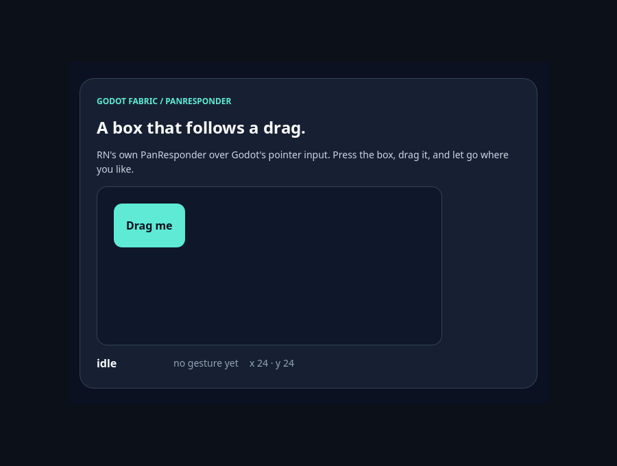
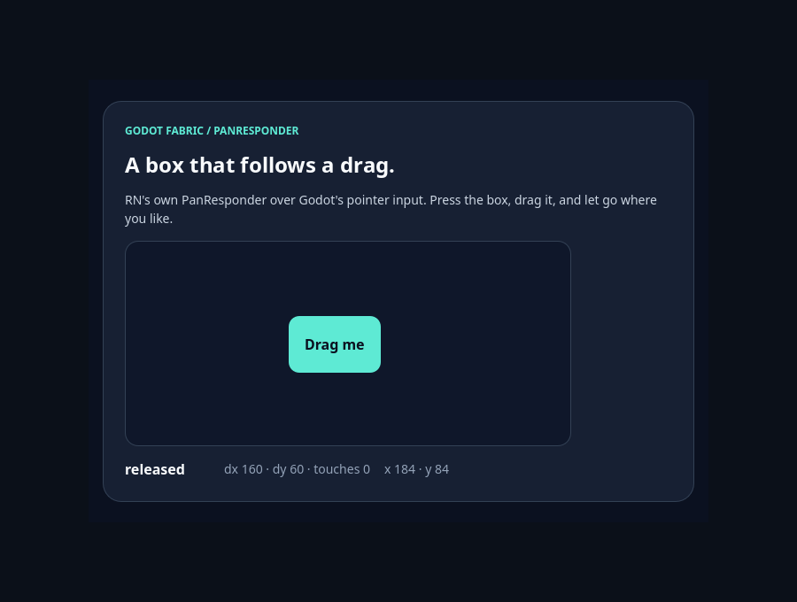

# PanResponder original

Esta fatia troca o `PanResponder` da plataforma — um stub que lançava erro ao
criar ("Chart platform PanResponder/pinch zoom is not implemented") — pelo módulo
original do RN. Ele é JS puro sobre os eventos de responder e o histórico de
toques, que o host já entrega; nenhum código nativo muda. A
[pesquisa](../../research/pan-responder.md) traz as regras do RN que o oráculo
reproduz, e o [recibo](report.json) fixa fontes, hashes e resultados.

| Lane | Checks | Responder do RN |
| --- | ---: | --- |
| desabilitada / só imperativo | 32 cada | `ResponderEventPlugin` do plugin legado |
| só interno / habilitado | 32 cada | `ReactNativeResponder` do dispatch nativo |

São **128 checks headless**. As duas implementações produzem exatamente os mesmos
callbacks e as mesmas coordenadas do `gestureState` (`x0`, `y0`, `moveX`, `moveY`,
`dx`, `dy` e toques ativos) nas quatro lanes; a velocidade depende do tempo das
amostras e é verificada em cada lane.

```sh
npm run test:responders:pan
```

## O que foi verificado

Toques e o botão esquerdo do mouse reais do Godot sobre duas raízes de uma
aplicação: um painel livre, um pai que reivindica movimentos verticais acima de
10 pontos (com um `Pressable` e um filho que recusa ceder), um pai que captura
todo início e uma View removida no meio do gesto.

- **Arrastos.** Toque e mouse recebem grant no centróide inicial (`x0/y0`),
  moves com o deslocamento acumulado, end sem toques ativos e release com o
  deslocamento final; a velocidade acompanha o movimento.
- **Dois dedos.** O segundo dedo dispara um start com dois toques ativos; cada
  move usa o centróide dos dois, porque o `TouchHistoryMath` do RN compara de
  forma inclusiva com o instante já contabilizado; os toques terminam um a um
  antes do release.
- **Negociação.** O pai toma o gesto do `Pressable` (grant, depois o `pressOut`
  sem `press`); o filho que recusa mantém o gesto, e o pai recebe o grant
  especulativo do RN e depois o reject; o pai de captura vence o início do filho;
  um tap sem movimento pressiona uma vez (`pressIn`, `pressOut`, `press`).
- **Remoção.** Remover a View que tem o gesto cancela o contato; o responder
  desmontado não recebe mais callbacks, como no RN, e o gesto seguinte recebe o
  grant normalmente.
- **Isolamento.** A raiz B só recebe o próprio gesto.

## Controles

- **SDK anterior.** Com o `react-native-platform.jsx` da `main`, o stub lança no
  primeiro `create` das duas raízes e o run falha exatamente nas 3 checagens de
  montagem e limpeza, com o erro registrado. O arquivo foi restaurado byte a byte.
- **Sabotagem retida.** Um `PanResponder` que descarta os handlers de captura
  falha 6 checagens: o estado deixa de reiniciar no primeiro toque e nenhum pai
  consegue reivindicar. O oráculo independente do runner, sem os gates de status
  do probe, rejeita o relatório sabotado e aceita os finais.

## Capturas

O exemplo interativo [`pan-responder`](../../../examples/pan-responder/README.md) abre no launcher
com `npm run example -- pan-responder`, e `npm run example -- pan-responder --capture` salva três
quadros do renderizador nativo, de 900 × 680, enquanto a validação dele pressiona a caixa, a
arrasta em quatro passos e a solta com o mouse (11 checks headless, 18 com o renderizador). O
[recibo de capturas](captures.json) registra o caminho, o SHA-256 e as dimensões de cada quadro,
e os bytes se repetiram em duas execuções seguidas.



**Antes.** A caixa na posição inicial (x 24, y 24), em verde-água; o React não guarda gesto e a
leitura diz `idle` e `no gesture yet`.


**Arrastando.** O quadro depois do segundo de quatro passos do arrasto, com o botão esquerdo
mantido: a caixa âmbar acompanha o ponteiro pelo `dx` e `dy` do gesto (80 e 30, um toque ativo),
em x 104, y 54.



**Depois.** Depois da soltura: a caixa ficou onde foi solta (x 184, y 84), de novo em
verde-água, e a leitura diz `released` com `dx 160 · dy 60 · touches 0`.

A validação compara o SHA-256 das regiões das duas posições que a caixa ocupa: as duas mudam
entre antes e depois, então o renderizador desenhou a caixa onde ela foi solta e não mais onde
começou. Não há oráculo independente de pixels, e as quatro lanes acima continuam sendo o que
este recibo certifica.

Estas execuções são locais: o recibo de [CI hospedada](hosted-ci.json) desta fatia não cobre o
exemplo, que o `npm run test:examples` do job `native-cold-start` passa a repetir (sem captura)
quando ele entra na `main`. Nenhum GF, checkpoint, peso ou denominador fecha.

## Regressões

No mesmo host passaram os três gates do job `contracts` (260 testes Node e 13
Python, análise estática e scan de publicação), o `test:recovery`, as 27 suítes
nativas — 22 exemplos, Down 2.731, query faults 187, resolver faults 66, Document Up
6.459, View Up 297, Move 220, Document Move 1.940, hover 158, caminho da raiz 82,
hover em Document 1.530, click 728, o próprio PanResponder 128 e `parity:godot` — e
o lote do SDK nativo (codegen, pack/verify, registro, loader e runtime de adapters,
consumidor independente e cold start).

O bundle do SDK e o bundler compartilhado mudaram, então os sete controles de host
anterior que os fixam (View Up, query-fault, resolver-fault, Move, hover, caminho da
raiz e click) foram refeitos nos hosts preservados e continuam com 8, 12, 3, 45, 32,
9 e 31 falhas normativas (o caso de Document do caminho da raiz segue caindo no host
do hover). O controle do click caiu por timeout na primeira tentativa, com a máquina
carregada pelas entregas paralelas; ele foi refeito em seguida e a suíte do click
foi repetida contra ele.

## Limites

Pinch zoom por bibliotecas de gráfico, handles do `InteractionManager`,
velocidade em hardware real, ScrollViews aninhados e negociação com controles
nativos do Godot seguem abertos.

A [CI hospedada](hosted-ci.json) desta fatia é o push da `main` em 2ec988e (run
37385104730), com os cinco jobs verdes na primeira tentativa. O artefato
`native-pan-responder` repete os **128 checks headless** nas quatro lanes com IDs e
callbacks idênticos aos fixados e os bundles da segunda corrida de revisão (a árvore
mesclada com o AppState); as 11 fontes produtoras batem com os bytes esperados, e as
três entradas de verificação que diferem dos pins de b3327e4 vêm da mescla do
AppState, como registra o recibo. O [Pages](publication.json) (run 37385104756)
implantou exatamente os dados de 2ec988e, e o JSON público confere com eles. Nenhum
GF, checkpoint, dependência, peso ou denominador foi fechado.

Na revisão, a comparação entre lanes passou a incluir `x0`, `y0`, `moveX` e
`moveY` (antes cobria callbacks, deslocamento e toques ativos). O runner de
`9a6ee3e` repetiu os 128 checks no mesmo host, com os mesmos bundles e IDs; só o
próprio runner mudou entre as fontes fixadas. Depois o runner passou a exigir os
32 checks em cada lane normal (`54129b3`), e a árvore mesclada com a `main`
(AppState) repetiu os 128 checks no host dela (`06a33274`), com os mesmos IDs e
callbacks. O recibo registra as duas corridas em `reviewReruns`.

As 14 fontes de código/configuração executadas (11 produtoras do bundle e 3 de
verificação) correspondem à implementação `b3327e4237b1b7e768b1698194dd5f4f077e5b80`
por `git show`/SHA-256. A execução partiu de 72155bc com as mudanças desta fatia
ainda locais. Este pin pós-commit não é uma nova corrida.
