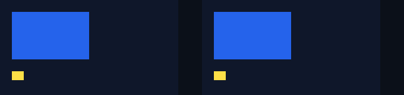

# A ref getter fault preserves the following native TouchStart

Reading a component's `stateNode.canonical.publicInstance` can execute a JavaScript
getter before the SDK interest query runs. In the preceding native host, an
exception from that read escaped the query boundary and discarded the same
batch's following TouchStart, Raw delivery and React update. The corrected host
includes the three slot reads in the existing `E_POINTER_LISTENER_QUERY` catch.
It rejects that lookup while allowing the original native queue to continue.

[Curated receipt](report.json), [isolated example](../../../examples/pointer-resolver-fault/README.md)
and [failure analysis](../../research/pointer-resolver-faults.md).
Execution used official Godot 4.7.2, RN 0.87.1, React 19.2.3 and Node 22.23.3
on macOS arm64 Release. The receipt owns executed source, bundle, native host,
report and image hashes; execution preceded the implementation commit.
All 23 executed code/configuration pins, plus the fresh SDK source hashes, match
implementation `b3920e190e8d3e0f3b4f6c0fac39cbd2e753a2d8`. The original execution base/source-dirty
identity and local build record are retained.

| Executed lane | Result |
| --- | --- |
| Previous native host, identical fixture | 62/65 pass; exactly three normative failures remain visible |
| Corrected host, headless | 65/65 pass |
| Corrected host, actual macOS viewport | 85/85 pass: 65 checks, 16 pixel assertions, two React-counter assertions and two capture saves |

Both causal headless lanes use the same 65 check IDs, identical executed bundle
bytes, 18 original RN inputs and 17 producer pins. Only
`native/application_runtime.cpp` differs among those producers. The old failures
are the same-batch TouchStart callback, its typed/star Raw delivery and its
functional React commit. Recognizing that negative control does not make those
three failed checks green.

## The executed fault and recovery

The test resolves an actual connected View's opaque Fiber and canonical object,
then replaces its own configurable `publicInstance` data property with a
one-shot getter. That getter restores the exact original descriptor **before
throwing**. Value, writability, enumerability and configurability are checked
afterward. This separates native batch loss from a permanently damaged ref.
The fixture reuses the real SDK query observer and original listener Maps;
it installs no second query or listener registry.

The failing bubble lookup at offset `34` never enters the SDK: the recorded
entry count is zero at the throw. On the corrected host, seven following healthy
capture/ancestor/root queries enter the SDK and return boolean false. Neither
the failed lookup nor those later negatives produces a pointerdown callback or
Raw pointerdown. The same batch's original trusted TouchStart and both Raw
channels survive, preserve payload/timestamp identity and increment React state
in exactly one native commit. Transient event fields and the priority context
restore afterward; complete priority mapping is not certified here.

The previous host retains a `Non-js exception` diagnostic. The corrected host
retains `E_POINTER_LISTENER_QUERY` with the same deliberate cause. Exactly one
diagnostic remains visible through recovery and stop. The physical contact is
legitimately held after Down. B completes a healthy gesture while A is held;
Cancel clears A, and a subsequent A gesture succeeds. B releases before A's
Cancel. Stop removes the query, empties recorded roots, contacts, pointer
registries, queued work, timers and frames, and balances native node creation
and deletion for both roots. These observations are bounded lifecycle checks.

## Actual viewport frames

Both images are 680 × 160 Godot renderer readbacks. Blue is the real input
target; yellow width reflects each surface's React TouchStart counter. The
initial frame is A=0/B=0. The updated frame is A=2/B=0 after one healthy A
gesture and the faulted Down's preserved TouchStart, **before B receives input
or A is cancelled**. It does not depict the completed cleanup matrix.




Each frame has eight exact RGBA assertions and a React-counter assertion.

## Reproduction and limits

Run against the built corrected host:

```sh
npm run test:pointers:resolver-faults
node tests/pointer-resolver-fault-native.test.mjs --capture
```

For an already installed preceding native host:

```sh
node tests/pointer-resolver-fault-native.test.mjs --allow-original-negative
```

The negative option selects no binary. It requires exactly the three declared
failed checks, preserves them and rejects additional or missing failures. It
cannot be combined with capture. Godot ScreenTouch Down/Up/Cancel enters through
`Input.parse_input_event`; this is native injected input, not physical hardware.

Executed regressions pass: 250 Node/13 Python contracts, static analysis,
publication scan, fresh corrected SDK pack/verify, the 2,723-check Document flag
matrix, View interest 193/233, query faults 186 and integrated dispatch 181/206.
All 22 examples/2,250 checks, consumer 30 build/ownership and 40 native checks,
loader 89/21 and 13 native adapter runs/213 checks pass. Portable processor and
geometry gates each pass two tests. The fresh SDK contains the executed host
bytes; full ABI certification remains false. The reused helper required a new
query-fault baseline signature: identical current fixtures retain the old
174/186 with twelve visible negatives, then pass 186 on the corrected host.
Historical receipts remain unchanged.

The code places `stateNode`, `canonical` and `publicInstance` property reads
inside the catch, but **only this one-shot `publicInstance` getter was faulted
and executed**. Separate stateNode/canonical faults, permanent or proxy getters,
broader root-resolution failures, fault/flag combinations and reentrant stop
or retirement remain unverified. Interest still covers only `pointerdown`.
Other pointer categories, full responders, hardware, exported mobile runtime,
development renderer, performance and full ABI acceptance remain open. Public
imperative/native-dispatch flags stay off.

CI for this getter fixture is pending. The preceding
[Document/root CI](https://github.com/journey-studios/godot-fabric/actions/runs/37233393202)
passed five jobs with its own 2,723 Document checks; that run does not cover this
later correction. Local evidence and public dashboard publication are separate.
