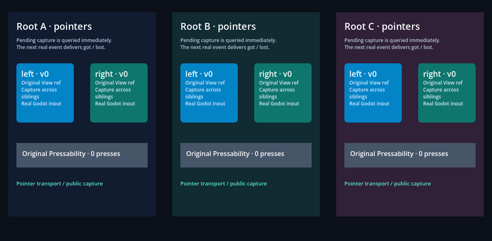

# Original pointer events, capture and native lifetime

The public `View` ref uses the pinned RN `setPointerCapture`,
`hasPointerCapture` and `releasePointerCapture` methods. Godot mouse/touch input
enters original `PointerEvent` serialization and `PointerEventsProcessor`.
ReactFabric, React, Hermes and the pending/active capture negotiation remain
upstream. A hash-pinned **generated native overlay** hardens lifetime, no-hit
routing and exception cleanup; it does not modify downloaded `.deps` sources
or recompile the Godot engine. The SDK includes and identifies the overlaid
headers consistently with the host library. This changes the experimental
native binary combination; adapters must use its freshly packaged SDK.

## Executed macOS arm64 evidence

Godot 4.7.2, RN 0.87.1, React 19.2.3, Hermes 250829098.0.17 and Node 22.23.3.
See [the receipt](report.json) for exact source/native/bundle hashes, commands,
checks, modes and remaining acceptance. Local proof, the
[audited hosted artifacts and CI snapshot](ci.json), and verified Pages
publication are recorded separately.

CI run `37197503396` at `a15fde4` passed all five jobs. The pointer artifact was
audited independently: 144 native assertions, 43 JSX checks, six expected errors
and both original-source crash controls. Hosted Node is 22.23.2; reported
binary hashes identify that separate build. Android/iOS reference success
covers the existing oracle fixtures and does not certify Godot mobile ports.

| Fixture | Executed result | What it proves |
| --- | --- | --- |
| Public pointers, headless | 132 passing checks | Immediate pending queries; next-sample got/lost; transfer, inactive/wrong-owner no-ops; sibling/outside-all drag; shared-root IDs and selective touch cancel; independent app; removal/replacement/retirement and balanced shutdown |
| Public pointers, native window | 146 passing checks, 12 pixel samples, two captures | Same native path plus declared frames/colors in real Viewport readbacks |
| Native processor | 144 passing assertions | Actual UIManager/ShadowTrees, connected and retained removed targets, cross-root capture retirement and synchronous callback reentrancy; recovery after nine listener-fault phases |
| Unmodified processor/binding controls | Two expected SIGSEGV failures | Retained deleted capture target has no newest clone; a throwing listener leaves the original moved hover tracker null and the next sample crashes. Both controls reach their named boundary first |
| Original JSX fault boundary | 43 passing checks, six deliberate diagnostics | Out/Over/Enter/Leave/Got/Up faults stay visible; own capture authority retires, next hover/new Down recover, default priority restores, independent captured pointer survives |
| Synchronous native stop | Included in those 43 checks | `onGotPointerCapture` calls genuine TextInput focus; LineEdit's focus signal calls application stop before callback returns. No following pointer callback; another app's existing capture continues |

Cancellation is tested through Godot's mouse `canceled` flag and touch cancel;
original Pressability receives cancellation without a press. Native button
masks retain ownership until the final held button releases. A release over
another shared root is processed once. The same event Ref can be reused on a
subsequent root callback dispatch. Focus-loss cancellation permits a fresh
physical Down; existing Pressability regression assertions remain intact.

A callback fault retires that pointer's processor authority until a new Down;
the original exception reaches the host diagnostic. The generated binding uses
scope guards for its temporary EventTarget retention and prior event priority.
The fault fixture measures actual priority recovery and native/root cleanup;
it does not claim a separate garbage-collector or leak-sanitizer certificate.

## Captures



Each box is a native Godot Control created by original React reconciliation.
A/B share one application; C owns another. Pixel expectations derive from the
JSX declarations, not from host-computed rectangles.


A's left box has a new React key/ref, the original Pressable counter committed
once, and A's React label changed. B/C keep their identities and state.
Screenshots illustrate committed rendering; the event/capture/lifetime checks
in the receipt prove behavior that a still image cannot show.

## Reproduce

```sh
npm run test:pointers:processor
npm run example -- pointers --headless
npm run example -- pointers --capture
npm run test:examples
```

The processor command runs the portable native fixtures and an isolated original
renderer bundle at `build/pointer-errors.js`; it preserves `build/app.js`.
The original-source crash controls run in child processes and are expected
failures, not ignored green tests. Runtime reports/logs stay in ignored `build/`;
the JSON receipt retains curated checks/provenance instead of raw build logs.

## Subsequent geometry slice

This record describes the preceding untransformed fixture. The later
[captured geometry evidence](../pointer-geometry/README.md) separately verifies
transformed/cross-root offsets, flattened refs, immediate density changes,
singular cancel and hidden capture. It also preserves the incomplete pinned
RN algorithm as a numerical counterfactual. That later evidence supersedes
the transformed-offset gap below within its bounded desktop scope.

## Still open

GF-08/GF-13 stay **In progress**. This is injected, untransformed desktop input,
not complete EventTarget, PanResponder/responder negotiation, physical-device,
keyboard/IME, transformed captured offsets, scroll/multi-window capture or
mobile parity. Original imperative EventTarget flags remain off. The original
capture retargeter subtracts a target origin; transformed offsets need a
separate geometry/original-reference oracle. Global arbitration across
independent applications and root z-order are not certified. No new
architecture decision, release acceptance or complete GF item follows from
this slice. [Source boundaries](../../research/pointer-capture-boundary.md).
