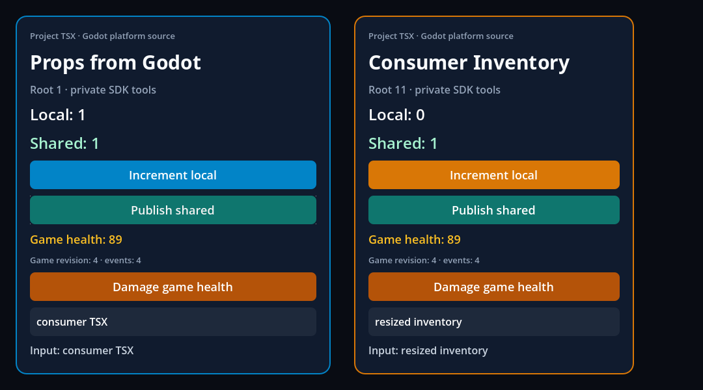

# Project aliases, dependency ownership and platform source agreement

This GF-03/GF-28 slice exercises the **normal provisioned addon builder**. The
project still owns its TSX, dependency declarations and lockfile; original
React/Fabric/Hermes, the RN transforms and the editor entrypoint remain in use.

Two reproduced gaps motivated it: a valid local TypeScript `paths` alias was
rejected as a missing npm package, and a library's dependency installed inside
that library was rejected for not appearing at the app's root. Separately,
editing `moduleSuffixes` could change the type source without changing the
bundled implementation. The earlier [diagnostic probes](../bundle-determinism/resolution-gaps.json)
remain historical discovery evidence.

The builder now reads the effective TSConfig with the original TypeScript
parser, preserves inherited alias bases and lets esbuild resolve local sources.
Installed imports use the importing package's declarations and resolution
directory. Named React/RN imports retain the provisioned SDK identity, even
when a library carries another React copy. Config and manifest snapshots guard
publication against changes during a build.

For this prototype, effective `moduleSuffixes` must remain exactly
`[".godot", ".native", ""]`. An unsupported order fails visibly before
publishing. Local aliases cannot target SDK internals, installed packages,
declaration-only files or paths outside the project. Collisions with imports
inside installed libraries or the private SDK are rejected: esbuild applies
project aliases globally, so silently accepting them could replace a library's
own dependency. Full Metro behavior and D20 remain open.

The shared RN hooks were also restricted to the provisioned RN tree and exact
public internal specifiers. A project file named `Utilities/Platform`,
`ReactNative/UIManager`, `ReactNative/RendererProxy`, `BatchedBridge/NativeModules`
or `ReactNative/AppRegistryImpl` now retains its authored implementation.

## Executed consumer cases

Local execution uses **macOS arm64 Release**, official **Godot 4.7.2**, original
**RN 0.87.1 / React 19.2.3 / Hermes 250829098.0.17**, private **Node 22.23.3**,
**TypeScript 6.0.3** and **esbuild 0.25.12**. The native host is reused from the
verified shutdown SDK; this JavaScript change does not rebuild Godot or its
export templates. [Provenance](provenance.json) identifies consumed source and
native hashes separately.

| Actual execution | Result |
| --- | --- |
| Fresh independent consumer, normal editor hook, no global Node | [27 tooling checks](consumer-tooling.json) |
| Network-denied rebuild and recovery | Lockfile unchanged; exact baseline/recovered bundle hash identical |
| Inherited `@ui/store` and `@ui/platform` aliases | [40 native](consumer-local-alias-native.json), [43 graphical](consumer-local-alias-graphical.json); types and bundle select `platform.godot.ts` |
| Library with its helper only in the library's `node_modules` | [40 native](consumer-nested-dependency-native.json); helper executes and React remains SDK-owned |
| Outside/symlink alias, changed suffix order, React type spoof, undeclared direct helper | Visible build rejection; previous bundle preserved |
| Existing selected Codegen component/module consumer | [35 headless / 37 graphical](adapter-runtime.json); generated props, events, commands and two roots still execute |
| Resize/RAF/timer shutdown regressions | [8/9/9 checks](adapter-runtime.json) |
| Complete local contract gates | [172 Node / 13 Python](verification.json); zero failures/skips |
| Native runtime, roots, modules and services regressions | [10 serial tests](verification.json) |
| Existing example matrix | [15 headless examples / 605 checks](verification.json), including charts and NativeWind |

The baseline/recovered consumer bundle SHA-256 is
`942d8f60d5572c4e62b7e5b3020836515dc6cce2cc7179e71d9410091fc02219`.
The full consumer runner keeps the original equality assertion; it does not
normalize output, retry a failure or install dependencies implicitly.


The HUD changes its local count and input while Inventory keeps its own values.
Both roots receive the shared store and Godot health update. `@ui/*` imports
reach the same project sources as the original relative imports.



Inventory is resized through the original public ref; its input and the shared
health revision persist. These are actual Godot Viewport captures of generic
consumer fixtures. They do not certify physical OS input, IME or mobile targets.

## Reproduce and remaining scope

```sh
node --test tests/project-resolution.test.mjs tests/platform-seams.test.mjs
npm run test:consumer -- --capture
node scripts/adapter-runtime-check.mjs --sdk <verified-SDK> --out build/<new-directory> --capture
npm run test:contracts
```

The behavioral module tests execute original TypeScript resolution, esbuild
`write:false` output and the shared platform plugin; they do not merely match
implementation strings. The native consumer uses the actual packaged addon.
[Verification](verification.json) records the exact executed gates and counts.
The retained consumer summaries include every executed check, geometry,
root/service cleanup counters and the complete source report's hash. Repeated
per-node snapshots and raw logs remain in `build/consumer`.

[Preceding CI](preceding-ci.json) passed all five jobs at `9c75031`, confirming
the earlier TSConfig determinism delivery. That run predates this resolver.
Current hosted certification is tracked separately in the dashboard.

GF-03/GF-28 remain **In progress**. Full public types/import inventory, assets,
package exports/conditions, arbitrary compiler settings, alias collisions
supported without changing package identity, alternative dependency layouts,
project Babel/NativeWind, development/reload and exported Debug/Release
applications on all targets remain open. D19–D32 are not approved by this
bounded implementation or its successful local tests.
