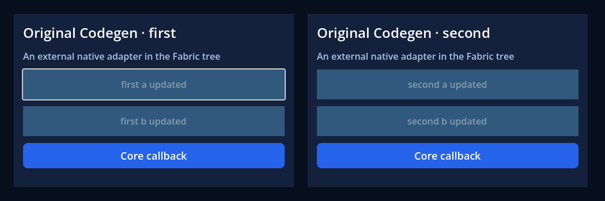

# Independent roots retiring inside native callbacks

A real external Button can now unmount its own React root during a Fabric
layout commit without deleting the emitting Control or stopping another root.
The host retires event/ref authority immediately and performs original React
cleanup and physical deletion in a deferred Godot phase. Immediate remount and
replacement by another application preserve the new owner and generation.
This is an executed GF-07/GF-26/GF-28 slice on **macOS arm64 Release**; the
complete item acceptance remains open.

## Reproduced failures and corrections

The [unmount baseline](baseline.json) identifies the previous native binary.
Ordinary unmount passed, but `unmount()` from an external Button's `resized`
signal during committed layout freed the emitting Control and failed to return
before the isolated process timeout. Only that process was terminated. Original
RN `ShadowTreeRegistry.visit` holds a shared lock while visiting; starting or
removing a surface on that stack requires a conflicting exclusive lock.

The host now retains retiring Controls, detaches them from a host that may be
freed, and schedules finalization outside the emitting/execution stack. A
reentrant mount reserves its identity immediately and starts the original
Fabric surface after retirement. Completion checks both the original
application and root identity before changing a host's current state. Other
roots keep their VM, state, module cache and timers/RAF scheduling.

An additional [callback baseline](stale-core-baseline.json) reproduces a separate
bug after the first retirement implementation: an old core Button's deferred
`pressed` Callable followed a mutable host into its new application. Both
applications used root 1 and Fabric tag 14; the new React callback incorrectly
received the old signal. The control without that signal received no event.
The reproduction used normal frame/deferred execution, without a forced pump
or Hermes reentry. Core signal connections now capture their originating
runtime, root, tag and mount identity. The new test rejects the old signal and
then proves the new Button still delivers exactly one legitimate callback.

The [appearance baseline](appearance-baseline.json) executes the current fixture
against the preceding binary: two of five assertions fail because a generic
ViewProps update removes the external adapter's font-color override. The old
appearance path also cast original external Props to unrelated core
`ControlProps`. The host now passes those core props only from its typed core
branch; common ViewProps styling preserves the external adapter's font color.
All five assertions pass on the rebuilt extension.

## Executed acceptance

[Checks](checks.json) retain every assertion name/result; [boundary snapshots](boundaries.json)
retain selected native identities, authority state and React/module counters.
[Runtime stages](runtime.json) identify the raw reports, consumed sources,
SDK/bundle/adapter and executed log hashes. [Provenance](provenance.json) records
native inputs, compiler, versions, captures and the tested source identity.

| Case | Passing checks |
| --- | ---: |
| Existing original-Codegen consumer, headless / graphical | 35 / 37 |
| Existing whole-application stop from resize / RAF / timer | 8 / 9 / 9 |
| One-root unmount from resize / pressed / RAF / timer | 17 / 17 / 18 / 18 |
| Same-host immediate remount from resize | 21 |
| Synchronous host free during resize | 17 |
| Same-host replacement by another application | 18 |
| Old deferred core signal across repeated root/tag IDs | 21 |
| External font ownership through props/defaults/layout updates | 5 |
| Graphical unmount / remount / owner switch | 21 / 25 / 22 |
| **Total: 17 Godot runs** | **318** |

These root cases assert immediate authority loss, Control survival until the
emitting stack returns, exactly-once view/effect cleanup, unchanged surviving
root identity, working original TurboModule/Commands/typed events, and stale
transport/ref rejection. The pressed case also checks that a previously queued
ordinary JS event is not delivered after retirement. RAF/timer cases prove
the next callback still runs in the surviving root. Final application stop
releases every remaining generation.

Graphical cases save actual viewport readbacks and assert surviving panel/core
Button colors plus title pixels. The runner fails on engine/script/host errors,
hangs, missing/excess assertions, or source/artifact drift. Its headless root and
appearance lanes are part of the existing native CI job; current local execution
does not imply that the new hosted run has passed.

[Regressions](regressions.json) passed **199 Node / 13 Python tests**, **10 native
tests** (runtime/application/modules/services, 2/4/2/2), and **15 headless
examples / 605 checks** on the same rebuilt host. Bundle-producing gates ran
serially; the independent adapter consumer owns a separate build directory.


After the first root unmounts, the second root retains its native identity,
updates its external component state and continues receiving events.


An immediate remount constructs fresh first-root Controls/tags while the
second root retains its original identity and state.



The owner-switch case looks the same after state updates, but uses a second
Hermes application for the first root. The native identities and callback
scope in the reports distinguish it from a same-runtime remount.


## Reproduction and limits

Build the owned GDExtension, pack/verify its native SDK, then run:

```sh
node scripts/adapter-runtime-check.mjs --sdk build/native-sdk-root-retirement-v2-20261003 --out build/adapter-runtime-new --capture
```

Use a fresh output directory. The consumer imports original Codegen specs,
generated descriptors/Props/emitter/Commands/CxxSpec and original React; the
official Godot executable and export templates were not rebuilt. Pack/build
receipts do not by themselves claim execution or ABI certification.

The [preceding hosted CI](preceding-ci.json) passed all five jobs at `80729da`.
That validates the preceding importer-scoped alias delivery and existing
fixtures, before these new root cases. Current slice CI is reported separately
when executed.

Complete bootstrap, activation/restart, scene pause/resume, overlays/portals,
full touch/responder cancellation, original RN lifecycle differential cases,
arbitrary native ownership violations, long-running async operations and other
platform/export binaries remain open. Original NativeDOM `isConnected` can
remain true until deferred React cleanup commits; the host independently rejects
retired event/ref authority. No upstream renderer, registry or Reconciler was
forked to manufacture synchronous disconnection. D19–D32 remain pending.
