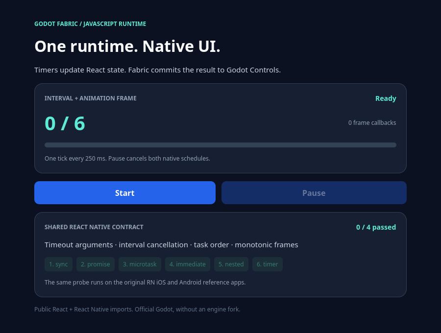
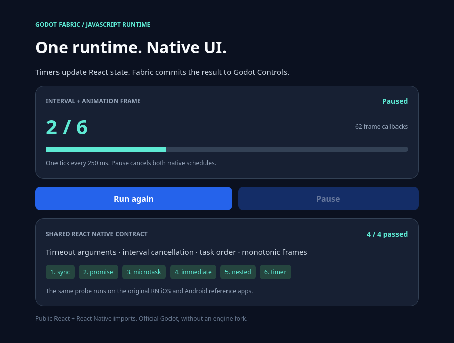

# GF-05: timers, microtasks and native frames

Local validation used macOS arm64, official Godot 4.7.2, React 19.2.3,
RN 0.87.1 and Hermes 250829098.0.17. No Godot engine rebuild was required.
This is a bounded GF-05 implementation; the roadmap item remains In progress.
The counts, hashes and captures below describe this implementation's recorded
snapshot before integration with the public form. The current catalog contains
both examples; [public control evidence](../public-controls/README.md) retains
its separate snapshot.

## What changed

The previous host had no `setInterval` or `queueMicrotask`, dropped extra
`setTimeout` arguments and implemented immediate callbacks as zero-delay timers.
A real-Hermes baseline produced `promise,timer,immediate` and an empty callback
argument list. After this change it produces `promise,immediate,timer` and
preserves `['token', 42]`.

The build compiles upstream RN `TimerManager.cpp` unchanged. It owns callback
arguments, timeout coercion and timer/interval cancellation. The Godot
[deadline registry](../../../native/timer_registry.h) implements the original
`PlatformTimerRegistry` boundary. Original RN portable microtask/immediate
modules execute over Hermes Promise jobs. Fabric's renderer and scheduler
remain upstream; this change adds no separate React reconciler.

## Runnable case and actual captures

```sh
npm run example -- runtime               # interactive native UI
npm run example -- runtime --headless    # 23 contract assertions
npm run example -- runtime --capture     # 33 assertions and renderer readbacks
npm run test:runtime                     # registry and callback-error tests
```

The [React application](../../../examples/runtime/App.jsx) only imports public
React/RN UI primitives and the shared portable runtime probe. Public Pressable
input starts and pauses a 250 ms interval and a recursive RAF loop. These
callbacks update React state; Fabric reconciles it into existing native Controls.
No native signal or direct React setter substitutes for pointer input in either
validation lane. Injected viewport events use device 1001 for OS focus isolation.

**Initial:** no interval or frame loop has started. The initial public Text
shows `0 / 6` and the progress track contains no filled pixels.



**Paused:** pointer input starts the clocks and completes four runtime probes,
then pauses at partial progress. The interval and next RAF are cancelled;
ticks and frames remain unchanged beyond the previous timer deadline. The
original Pressability delayed press-out timer is allowed to finish before
asserting the entire native timer queue is empty. Text keeps its native identity.



**Complete:** running again reaches six ticks, fills the track and cancels the
next scheduled tick/frame. The task trace below the clock shows the verified
order: sync → promise → microtask → immediate → nested microtask → timer.


These PNGs are 900 × 680 Godot Viewport readbacks. The harness asserts actual
glyph pixels, different Text-region hashes and progress pixels matching the
committed tick fraction. They are not generated illustrations or screenshots
of unrelated applications. Frame counts are observations of each run, not
cross-platform performance guarantees.

## Acceptance and original-native oracle

- **Runtime example:** 23 headless + 33 graphical assertions. Shutdown begins
  with active timers, frames, an immediate and a microtask; none execute after
  stop begins. Cached scheduling functions cannot restart work. Controls/tags,
  timers/frames/work are empty and React cleanup completes.
- **Deadline registry:** 12 native assertions cover deadline order, no early or
  duplicate dispatch, queued cancellation, zero intervals, no catch-up bursts,
  the 256-item dispatch budget and shutdown.
- **Callback failures:** six assertions in actual Hermes. Timeout, microtask,
  RAF and two recurring callback errors remain visible in the host error
  channel. Unrelated tasks still run; an interval survives an exception and
  cancels itself on its second invocation. Failed registrations and native
  work are empty after cleanup. Expected failures run separately from the
  ordinary examples; positive runs still reject every host error.
- **Regression:** all ten interactive examples passed sequentially in both
  lanes: **408 headless + 455 graphical assertions**. Two disposable projects
  passed cold import, runtime and warm import. Source gates passed 21 Node
  tests, eight Python fixtures, static analysis and the publication scan.

> Later note: since commit [`e67f82c`](https://github.com/journey-studios/godot-fabric/commit/e67f82ca54a83c8cfbc7db6e97ae11a70871ea2d) RAF callbacks run on the ticks of the
> [frame clock](../frame-clock/README.md) and not on every Godot process frame, so the
> statements here and under Remaining GF-05 work about real Godot process frames describe
> this record's executed state. The `runtime_errors` check `A failed callback cannot
> prevent unrelated queued work` no longer asserts the exact order
> `["after-frame","timeout","after-timeout"]`: timers run on every Godot frame and frame
> callbacks only on ticks, so which of them runs first is the host's pacing. It asserts that
> all three callbacks ran and that the two timers kept their order; the check name and the
> six callback-failure assertions above are unchanged.

[matrix.json](matrix.json) records fresh per-case counts/report hashes;
[provenance.json](provenance.json) binds source, upstream modules and captures.
Raw reports and logs stay in ignored `build/` and hosted artifacts.

The first hosted source gate caught output URLs in the native test being
interpreted as imports by static analysis. Existing local output files and
incremental analysis state masked the failure. The test now builds filesystem
output paths with `path.join`; `npm run check:static -- --no-cache` was verified
with both generated files absent, without adding an ignore or weakening the gate.

The first hosted iOS execution passed all 13 cases, then its simulator shutdown
exceeded the previous 30-second deadline. The runner now allows two minutes for
that owned-simulator cleanup. Timeout/errors still invalidate the report and
fail the job; a passing fixture alone does not establish a green hosted run.

The shared `core-ui-v2` oracle now has **13 cases**: the original nine UI cases
plus timeout arguments/coercion/cancellation, interval arguments/self-cancellation,
microtask/immediate ordering and cancellable monotonic frames. The same
[runtime probe](../../../tests/parity/runtime.js) is copied verbatim into the
original RN iOS and Android reference applications. Its source has its own
provenance hash; stale nine-case reports are rejected. The Godot oracle passed
locally. The [hosted run](https://github.com/journey-studios/godot-fabric/actions/runs/37006291589)
passed all five jobs on `d4e5673`, including the original iOS/Android references
and the three-way comparison. Downloaded artifacts were accepted by the current
strict protocol: **13 matched subset cases** with both mobile references.
The matrix retains that run/commit and comparison hash. This result certifies
the recorded subset; full RN API
coverage and Godot mobile builds remain separate milestones. See the
[oracle instructions](../../compatibility/BASELINE.md).

## Remaining GF-05 work

The full upstream `InitializeCore` is not installed. Idle callbacks, required
URL/encoding/abort globals, unhandled rejection/error-handler parity and
microtask starvation protection remain open. The bounded native work pump
does not bound an infinite chain of Promise jobs or arbitrary blocking JS.

> Later note: since the [networking record](../networking/README.md), RN's own `URL`,
> `URLSearchParams`, `AbortController` and `AbortSignal` (with the rest of `setUpXHR`'s
> globals) are installed by `src/initialize.js`. Their contract is certified only as far as
> that record's checks (an `AbortController` aborts its signal once, `URLSearchParams`
> decodes, `fetch` honors a signal); the encoding globals are still open, and this
> record's executed files stay as written.

RAF uses real Godot process frames rather than upstream TimerManager's
zero-delay fallback. The oracle certifies cancellation and monotonicity; it
does not require matching frame cadence, exact timestamps or all ordering
relative to UI events. Timer callbacks run on the Godot main thread and overdue
intervals resume from callback completion without replaying missed ticks.

Surface stop suppresses the portable microtask/immediate callbacks owned by
this bootstrap. Ordinary Promises have no general cancellation mechanism.
Hardware input, DPI/font scale, OS app lifecycle and mobile Godot builds are
separate milestones. GF-09 real system metrics remain Planned.
