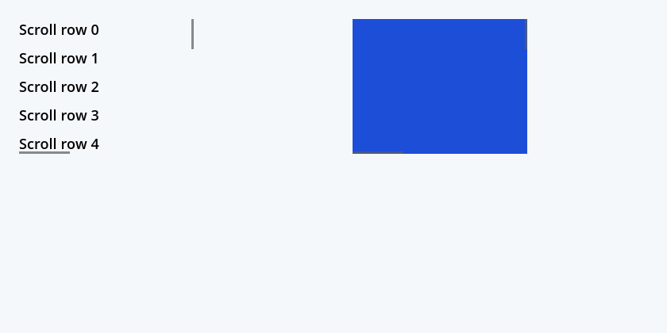
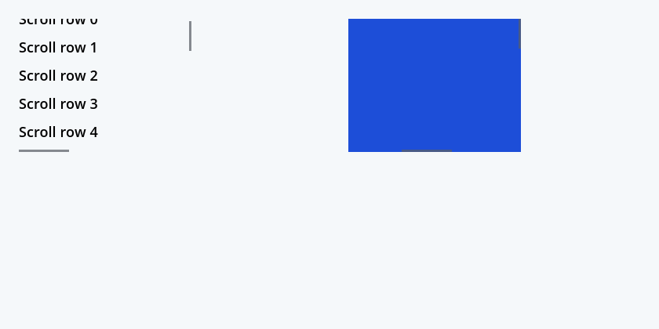
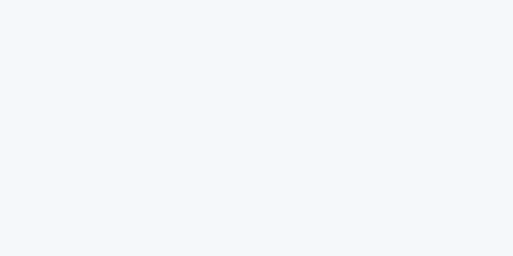
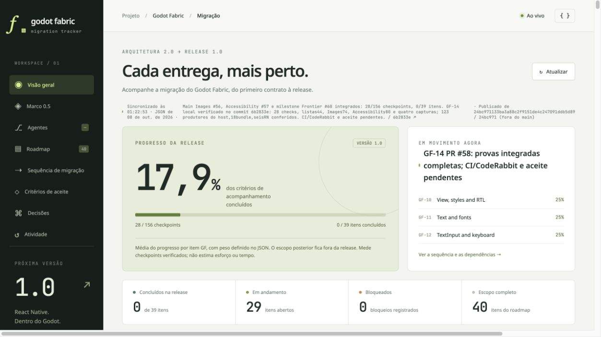
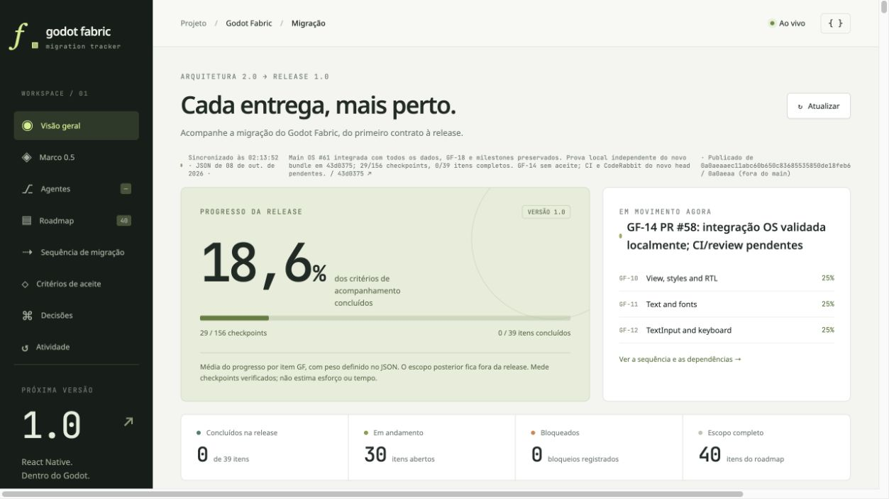
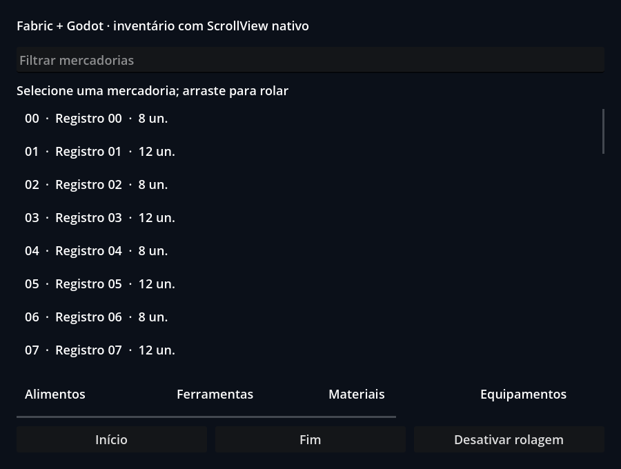
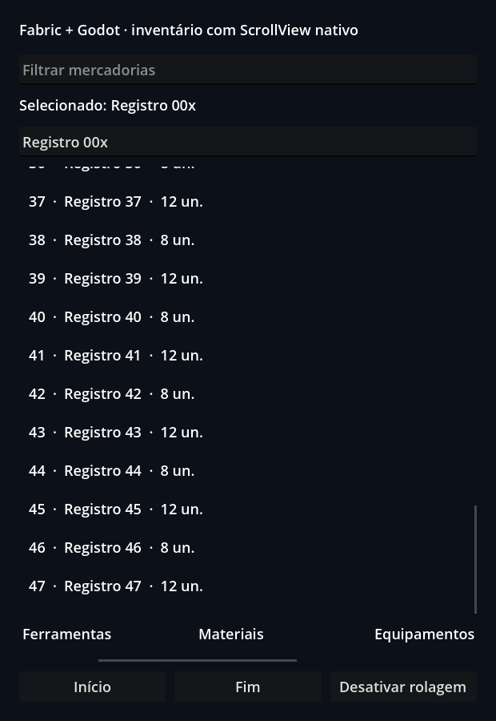
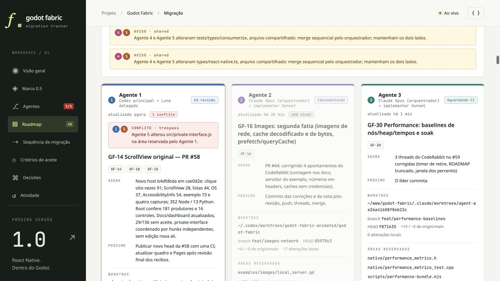

# ScrollView desktop probe

This is a local, headless execution record for the GF-14 desktop slice. It is
under review; it is not an accepted checkpoint or hosted CI result. The probe
mounts the original React Native 0.87.1 `ScrollView` in two Fabric roots and
checks command behavior, fractional offsets and DOM measurement, native pan and
momentum, cancellation, horizontal config delivery, content removal and final
runtime cleanup.

| Run | Result | Scope |
| --- | ---: | --- |
| Mounted GF-14 probe | 28/28 | Godot 4.7.2, headless, original RN component |
| VirtualizedList consumer regression | 44/44 | Existing names and offsets retained, including shelf x=180 |
| ScrollView contract/native node tests | 4/4 | Neutral values, public rejection and component-specific Fabric config |
| Type check | passed | `tsc-rs` Godot configuration |
| Native ScrollMotion tests | 44 checks | Release coordinate, frame-partitioned decay, stale velocity, throttle and bounds |

The integrated mounted probe observes a fractional offset of 13.25 consistently in native
state, Fabric state, painted content position and RN DOM measurement. Its
horizontal second root receives `horizontal=true`, pans to a measured x offset,
and completes BeginDrag, EndDrag, MomentumBegin and MomentumEnd in order. The
list regression preserves the historical 180 px shelf offset with matching
logical/Fabric offset and painted content translation. The report also checks
that stopping the app retires roots, tags, contacts, captures, routes and pending
work.

An accepted wheel step or changed `contentOffset` during a claimed pan ends the
drag once at its current offset before applying the external replacement. The
later Move and Up cannot resume that drag or emit another EndDrag. The wheel
case applies y=178 after EndDrag at y=130; the prop case applies y=260 after
EndDrag at y=130. Logical offset, Fabric state and painted content stay aligned.

Host-equivalent RN options mount the original component without a Fabric error
and still scroll to `(12,24)`, with painted translation `(-12,-24)`. The explicit
option policy accepts neutral flags, `keyboardDismissMode="none"`, cancellation
enabled and persistent indicators enabled. Cancellation disabled and fading
indicators requested with `persistentScrollbar=false` remain unsupported.

The vertical diagonal drag releases at `(80, 150)` and the horizontal diagonal
drag releases at `(150, 70)`. EndDrag records those exact points, the transverse
velocity is zero, Fabric state and painted content preserve the transverse
offset, and each lifecycle is `BeginDrag`, `EndDrag`, `MomentumBegin`,
`MomentumEnd`. The settled active-axis offset agrees with the measured momentum
target. Changing orientation during a claimed gesture cancels that gesture
before the new axis is installed.

Both mounted ScrollViews overflow in both axes. Horizontal `scrollToEnd(false)`
reaches x=540 while retaining y=35; vertical `scrollToEnd(false)` reaches y=590
while retaining x=55. This follows the pinned Android command policy and does
not assert iOS parity.

The following identities bind the result to its inputs:

| Artifact | SHA-256 |
| --- | --- |
| Loaded `addons/fabric_godot.dylib` | `840d7f3e5b9526e4843b009f17db3422d56cd5195277a90f049eb7fe3cdb23e2` |
| `.deps/build/native-sdk-build.json` | `10d8910b7d4a70a0f76b252e030e37036545feb504420c2bd72b22813dc22c45` |
| Mounted probe bundle | `f2af26ef113aebf2178bbb7f0c307920ffbdf67ff8272feff2ebd76d8f842910` |
| GDScript probe source | `3c42b5ef82ac59a1d9cdea759f5110e40c69edf21e84c2f627ee6ef9fcb47915` |
| Mounted report | `55dec9749c2a85139654e3d023709d9512997bf5b761439829b3dfb82fab006c` |
| Mounted log | `1d0191864f8cff7ddaccd5a7159459139614b89a3b3185911e2dc3af5fc4a8ed` |

The build record's host digest matches the loaded library and remained stable
during the probe. All eight compiled native source pins in the receipt match
the current native scroll, pointer and runtime source files. This verifies the
recorded build inputs and loaded bytes; the receipt does not certify the
experimental external SDK adapter ABI. The bundle pins the mounted fixture,
probe and wrapper sources, plus RN's original ScrollView, command codegen,
native component, registry and view-config sources. `receipt.json` gives the
compact machine-readable identities and results.

The root-owned [independent receipt](root-independent.json) is preserved as
pre-integration evidence for the earlier 22-check bundle and hosts built before
Device Services integration. It is not a repeat of this 28-check integrated
host. Its original artifacts remain under ignored
`build/scroll-view-pre-integration-60fa18/`; this receipt records the integrated
host and current sources.

The root-owned [integrated independent receipt](root-integrated.json) preserves
the earlier 25-check comparison: host `4f28ed0f` passes; host `60fa18ed` fails
exactly the two diagonal controls and orientation cancellation.

The [interruption receipt](root-interruption.json) preserves the independent
28-check comparison on Accessibility-integrated host `bbb683e2`. The frozen `4f28ed0f` host executes the same
bundle and probe and fails exactly the wheel and `contentOffset` interruption
controls, without unrelated errors or cleanup failures. Report derivation checks
the EndDrag ordering, logical/Fabric/paint offsets and retirement before later
Move and Up, rather than trusting check flags alone. Original pre-fix artifacts
remain under ignored `build/scroll-view-pre-wheel-cancel-4f28/`.

The historical [Images-integrated receipt](root-images-integration.json)
records the 28-check run from `6b2833e` after main Images #56 and Frontier #60,
using bundle `7944e7ca` on host `840d7f3e`. Its original identities remain
preserved, with immutable links to its then-current receipts in `24bc971`.

The current [OS-integrated independent receipt](root-os-integration.json)
records a new isolated 28-check run after main OS-specific #61 at `43d0375`.
The host is unchanged, but the facade changes produce bundle `f2af26ef`.
The root independently derives the interruption, diagonal, neutral-option and
cleanup invariants, the 44-check list and sabotage oracles, Accessibility 80,
Images 74, OS contracts 37 and all four graphical artifact identities. All four
new captures match the historical PNG bytes; their current execution receipts
bind them to the new bundle. The older negative controls retain their original
bundles and scopes.

The [committed producer proof](committed-source.json) compares every one of the
123 recorded native input files and 18 recorded GF-14 bundle producer files
against committed Git blobs at `43d0375`. It separately verifies six installed
pinned RN inputs and 40 supplemental repository inputs from the bundle metafile,
common bundler, resolver, asset tool and dependency manifests. These groups
overlap; they are not a count of distinct compiled files. Later receipt-only
commits do not change the tested producer sources.

The [current facade regression receipt](facade-regressions-43d0375.json)
records Accessibility 80/80, Images 74/74, Text layout 76/76, Device Services
65/65 plus two launch checks, native modules 76/76 and Metrics/Errors 58/58.
The root reruns the first four lanes' behavioral oracles and the launch oracle,
checks the recorded hashes and source pins, and checks report counts/results for
the remaining native-test lanes. Their native assertions are not relabeled as
a new independent behavioral oracle. These are local desktop checks; the
headless accessibility lane does not certify an OS tree or assistive hardware.

## Windowed graphical capture

A separate Godot macOS windowed probe executed the same host and unchanged
GF-14 bundle. It saved the initial two-root view, the 13.25 px fractional
offset, a horizontal pan, and the empty post-cleanup frame. The probe measured
the inner pixel as RN blue `(0.1137, 0.3059, 0.8471)` and a point 16 px outside
the horizontal viewport as the capture's light clear color
`(0.9608, 0.9725, 0.9804)`, showing that the wide blue child is clipped at the
viewport. Native x, Fabric x and painted content translation agree at the
settled horizontal offset. The light clear color exists only in this capture
probe; the frozen public bundle is unchanged.

The [graphical receipt](graphics-receipt.json) pins the probe, host, bundle,
checks, log and screenshot bytes. This is a macOS Godot render using the
Compatibility renderer; it is not physical touch hardware, a refresh-rate
matrix, or a mobile export. The logs contain only the runtime's UIManager
destructor warnings after orderly stop; the checks and runner reject script,
engine and Fabric errors.

## Retained negative control

The dedicated list sabotage removes only `onLayout` forwarding in a temporary
copy of the current wrapper. All 44 checks still run; exactly the initial feed
window and its derived viewability checks fail. The independent RN oracle also
rejects the report even if its check flags are forced to “passed”. The positive
44-check report remains intact. Reproduce with
`node --test scripts/scroll-view-list-sabotage.mjs`; the
[negative receipt](sabotage-receipt.json) records hashes and failed checks.

The reproducible gates are `npm run test:scroll-view`, `npm run test:lists`,
`node --test scripts/scroll-view-list-sabotage.mjs`, `npm run type-check`,
`npm run test:text-layout`, `npm run test:modules`, `npm run test:device-services`,
and `.deps/build/scroll_motion_test`. The mounted report
and its raw log/bundle are retained under the ignored `build/` tree. Pixel
clipping is checked in the separate graphical lane above; hardware touch, a
refresh-rate matrix, mobile exports and full RN parity remain future work.

## Published review progress

The [publication receipt](publication-24bc971.json) records the dashboard data
from committed PR head `24bc971`, rendered and deployed by the workflow on main.
The uploaded artifact, public JSON and committed data match, allowing only the
publication metadata added by the workflow. This snapshot shows 28/156
checkpoints and 0/39 complete items. This is a historical publication snapshot.
After OS #61 integration the branch has 29/156 checkpoints; all GF-14 checkpoints
remain open until the new head passes hosted CI and CodeRabbit acceptance.

The [OS-integrated publication receipt](publication-0a0aeaa.json) records the
current 29/156 dataset from committed head `0a0aeaa`, rendered and deployed by
main workflow run `37731033472`. The uploaded artifact and public JSON match
exactly; removing only the generated publication metadata yields the committed
JSON. All GF-14 checkpoints remain open. Subsequent documentation-only updates
preserve this dataset and the tested producer sources.

## Legacy example CI correction

The native lane for `4a6dd92` failed on obsolete example assumptions about
ScrollContainer and a private content testID. The
[correction receipt](legacy-example-regression.json) binds the exact green
main tree, local RED, native responder source analysis, final 73/79 focused
checks, the principal's independent 73-check repeat and unchanged dedicated
product producers. It preserves the distinction between the full 34-scenario
suite before the final category sizing change and the final focused runs.

The following final macOS captures show the original RN example with a
48 px category viewport and the inventory filling the remaining space.

These local results do not accept hosted CI or any GF-14 checkpoint. The
previous 29/156 publication above is a historical dataset once newer review
progress is deployed; every GF-14 checkpoint remains open.

## Click regression and AccessibilityInfo integration

The later CI run on `d785d1c` passed ScrollView, lists and OS, then failed
`test:pointers:click`; the final parity job was skipped. All eight raw pointer
reports were inspected. The anonymous content View made the old empty-testID
root lookup ambiguous, and the old test still required a JS touch stream after
native takeover. Its release-time displacement also included momentum. These
are migrated expectations, not accepted hosted results.

Correction `b097fb3` obtains the shared AppRegistry parent from original RN
public instances, verifies both pointer/touch cancellation pairs before native
scrolling and holds the contact stationary before release. The oracle retains
exact offsets, identity, callback order, cleanup and 91 checks per lane. The
principal rejected an initial proposal that confused the surface
`documentElement` with the mounted AppRegistry View, reviewed the final design,
and rejected 16 damaged copies using the exact Node case verifier.

Main's AccessibilityInfo implementation is integrated in `cae0d2e`; the rebuilt
host `b4dfdbda` passes eight pointer lanes (91 each), ScrollView 28, lists 44,
OS 37, AccessibilityInfo 54 and the legacy ScrollView example 73. List and OS
negative controls are regenerated on that host. Four fresh graphical checks
pass; the principal views each capture, whose bytes match the prior images
above. Contract checks pass 352 Node and 13 Python tests.

The [current producer map](committed-source-cae0d2e.json) binds 127 recorded
native inputs and the current bundle groups to committed sources: 181 distinct
repository paths, with overlap between groups. The old 43d/123-pin proof remains
historical. SDK packing/verification passes; its adapter and ABI certification
claims remain false. The [correction and integration receipt](click-regression-and-accessibility-integration.json)
records actual report/log identities, independent measured scroll checks, the
failed hosted run and limitations. A new hosted run and CodeRabbit review of
the published head remain required. GF-14's slice and full acceptance remain
open; dashboard progress stays 29/156.

The local shared board records this task and its reserved files. Its historical
`private-interface.js` alert was coordinated after inspecting independent
ScrollView and LayoutAnimation hunks; neither side should discard the other's
methods. The live registry remains local.

