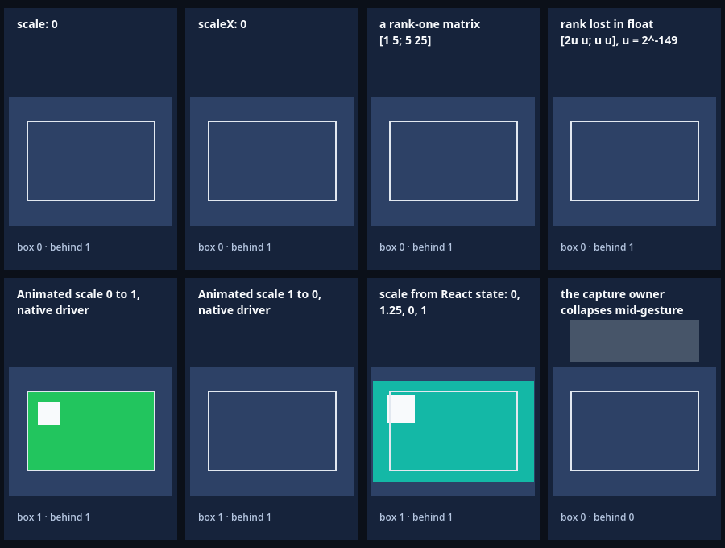

# Transforms singulares do RN em Controls planares do Godot: a View colapsa

Esta fatia faz o host renderizar um transform planar singular como o RN: a View não é
desenhada nem recebe hit, nenhum erro é lançado, e tudo volta com a próxima transformada
invertível. O host esconde também a sub-árvore da View, de propósito: é o que o Android faz
(o `TouchTargetHelper` pula o filho e a sub-árvore dele) e o que o iOS faz quando o
container recorta. O iOS ainda deixa o `hitTest:` chegar a descendentes de um container que
não recorta e tem `overflowInset`, e esse hit o host não reproduz (item aberto, em Limites).
O `Transform::Scale` do RN zera todo fator de módulo menor que 1e-5, então `scale: 0`,
`scaleX: 0` e toda animação que começa ou termina em 0 chegam ao host como uma matriz
exatamente singular; uma matriz de posto 1 também chega, e uma matriz que só perde o posto
na precisão de um `float` (onde o Control guarda a escala) também. O host anterior lançava
`E_TRANSFORM_SINGULAR` (ou `E_TRANSFORM_RANGE`, no posto perdido em `float`): um `scale: 0`
estático derrubava o commit que o montava, e uma entrada ou saída animada derrubava o quadro
que chegava a 0. Agora a etapa de transformação devolve um resultado explícito
(`PlanarTransform`: os fatores, ou `collapsed`), o runtime esconde o Control no único ponto
em que decide a visibilidade (`visible = displayType != None && !collapsed`), o Control
guarda a última transformada invertível que carregou, e a projeção de ponteiros trata um
alvo ou dono de captura dentro da sub-árvore colapsada como `display: none`. Oito aplicações
Hermes novas, cada uma num Surface do Godot, comparam o Control, as medidas do RN, cliques
reais e um ponteiro capturado com valores derivados da declaração JSX por um oráculo
independente. O [recibo](report.json) fixa fontes, hashes, captura e resultados.

| Lane executada | Checks | Observação |
| --- | ---: | --- |
| Host anterior `87a011d5` | 12/49 | Exatamente as 37 falhas normativas: nenhum estilo singular monta (`E_TRANSFORM_SINGULAR` no primeiro erro de cada montagem, e `E_TRANSFORM_RANGE` no posto perdido em `float`), o `exit` erra nos quadros que chegam a 0 e o `capture` erra no colapso; passam a independência dos runtimes, o repouso e o clique do `exit`, o gesto do `capture` até o colapso e as oito liberações |
| Host atual `cc89e2d4`, headless | 49/49 | Oito aplicações: `scale: 0`, `scaleX: 0`, matrizes de posto 1 e de posto perdido em `float`, `Animated.View` de 0 a 1 e de 1 a 0 com `useNativeDriver`, escala por estado do React (0, 1,25, 0, 1) e ponteiro capturado por uma View que colapsa |
| Host atual, renderizador nativo (`--capture`) | 58/58 | Os 49 mais a captura salva e os pixels de cada caso, decodificados à parte pelo Node |
| Host sem o ramo `collapsed` da projeção de ponteiros (sabotagem retida) | 47/49 | Exatamente os dois checks do `capture` que dependem do ramo; o oráculo rejeita o relatório |
| Guards públicos de rejeição | 61 em 6 aplicações | `singular` e `rank-one` saíram e viraram casos positivos; ficam `3d`, `rotate-x`, `w-not-one` e os três de faixa |
| Guards de entrada | 25 | Inalterados: um embedding externo singular segue cancelando o contato |
| Lane da escala uniforme | 29 | Inalterada; o controle local dele, refeito no host da fatia dele (`e90888f8`) com o bundle compartilhado, segue falhando 22 de 29 |
| Teste de fatores afins (C++) | 57.703 | Eram 41.278: os singulares viram `collapsed`, e entram o posto perdido em precisão nativa, o resultado `PlanarTransform` e o `rounds_to_zero` |

O host anterior é o `87a011d5`, o que a fatia da [escala uniforme](../uniform-scale/README.md)
executou, compilado do commit `6fbfb18`; entre `6fbfb18` e a base desta fatia (`9e7cc4f`)
mudaram só documentos e READMEs de exemplos, então as fontes nativas dele são as da base. O
host atual foi recompilado a partir das fontes do commit `ca9f195`, com as fontes nativas
tocadas pelo commit forçadas a recompilar, e reproduz o hash `cc89e2d4`. As lanes executam o
mesmo bundle; só os produtores nativos diferem.

```sh
npm run test:transforms:guards
npm run test:transforms:guards -- --capture
node scripts/transform-guards-check.mjs --lane=singular --allow-original-negative
node scripts/transform-singular-sabotage.mjs
.deps/build/affine_transform_test
```

O primeiro roda os guards de rejeição, os guards de entrada e os lanes da escala uniforme e
dos transforms singulares em headless, com o relatório e o log do lane atual em `build/`, e
confere, quando presentes, os controles locais. O segundo roda os dois lanes no
renderizador nativo (abre uma janela por lane), confere os PNGs salvos e registra o SHA-256
deles. O terceiro, com o host anterior instalado em `addons/`, confere o controle: exige que
falhem exatamente os checks que o probe lista como normativos. O quarto, a sabotagem
retida, reconstrói o host sem o ramo da projeção de ponteiros, roda o lane contra ele,
restaura a fonte byte a byte e reconstrói o host genuíno.

## O que o RN faz

Uma View cuja transformada planar é singular (não tem inversa) não é desenhada nem recebe
hit nas duas plataformas, e o RN não lança erro; o que acontece com os descendentes dela
difere entre as plataformas (abaixo). A próxima atualização com uma transformada
invertível a desenha e a acerta de novo, porque nada é guardado.

- **De onde vem o zero.** O `Transform::Scale` zera o fator de módulo menor que 1e-5
  (`ReactCommon/react/renderer/graphics/Transform.cpp`, linhas 43-60, com o `isZero` em
  `Transform.h`, linhas 26-31). Assim `scale: 0`, `scaleX: 0` e todo valor animado abaixo
  de 1e-5, a entrada que começa em 0 e a saída que termina nele, geram uma matriz
  exatamente singular. Uma entrada `matrix` não é achatada, então `[1 5; 5 25]` é singular
  por si. O `BaseViewProps::resolveTransform` só multiplica as operações e as envolve nas
  translações do `transformOrigin` (`BaseViewProps.cpp`, linhas 526-561).
- **iOS.** A matriz vai para o `CATransform3D` da camada e a view fica "visualmente
  degenerada", nas palavras do próprio RN; o `RCTViewComponentView` recusa o hit na
  própria view quando o determinante da parte 2×2 é menor que 1e-6
  (`RCTLayerTransformCollapsesAxis`, que faz o `pointInside:` devolver NO,
  `React/Fabric/Mounting/ComponentViews/View/RCTViewComponentView.mm`, linhas 100-118). Os
  descendentes são outro caso: o `betterHitTest` (linhas 738-785) só abandona a sub-árvore
  quando o container recorta ou não tem `overflowInset` e o ponto está fora (linhas
  754-760); com um container que não recorta e tem `overflowInset` diferente de zero ele
  percorre os filhos (linhas 762-767), então o `hitTest:` ainda pode chegar a descendentes
  da view colapsada. O teste do próprio RN cobre `scaleX: 0`, `scaleY: 0` e uma view
  escalada a 0,9 e depois a 0 (`React/Tests/Mounting/RCTViewComponentViewTests.mm`, linhas
  145-184), sempre o hit na própria view.
- **Android.** O `BaseViewManager` zera o contexto de decomposição, e o
  `MatrixMathHelper.decomposeMatrix` retorna cedo para uma matriz singular, de determinante
  3×3 menor que 1e-5 (`MatrixMathHelper.kt`, linhas 22-29 e 97-114, e o `reset` do contexto,
  que zera a escala, nas linhas 487-509), então a view recebe escala 0
  (`BaseViewManager.java`, linhas 611-632). O `TouchTargetHelper.getChildPoint`
  devolve `false` para um filho de matriz não invertível e o filho é pulado, com a
  sub-árvore dele (`TouchTargetHelper.kt`, linhas 216-220 e 282-321).
- **O C++ do Fabric nunca inverte uma transformada.** O
  `LayoutableShadowNode::computeRelativeLayoutMetrics` aplica a transformada de cada nó ao
  frame com o `Transform::applyWithCenter`, a caixa envolvente dos quatro cantos
  mapeados (`core/LayoutableShadowNode.cpp`, linhas 82-198, com a chamada na linha 172;
  `graphics/Transform.cpp`, linhas 460-478), então uma matriz singular dá um frame
  degenerado: um ponto para `scale: 0`, um segmento vertical para `scaleX: 0`, a caixa
  envolvente de um segmento diagonal para uma matriz de posto 1. O `onLayout` é o frame do Yoga e não muda; o
  `getBoundingClientRect`, o `measure` e o `measureInWindow` vêm do `dom/DOM.cpp` (linhas
  273-298, 492-525 e 527-552) e informam essa caixa degenerada.

## O que este host fazia

O `affine_factors` lançava `E_TRANSFORM_SINGULAR: singular transforms are not implemented`
para a matriz exatamente singular, e o `apply_transform` lançava `E_TRANSFORM_RANGE:
transform loses rank at native coordinate precision` quando um fator de escala arredondava
a zero em `real_t`. Um estilo estático derrubava o commit que o montava, com um segundo erro
de recuperação (`map::at: key not found`); um animado, o quadro do backend que chegava a 0.
Um pop-in que começa em escala 0, um menu que colapsa ou um selo alternado por estado
quebravam a aplicação onde o RN mostra nada.

O Godot não desenha um Control singular. O `Control.set_scale` troca um componente zero por
1e-5 (`Control.scale = (0, 0)` volta como `(1e-05, 1e-05)`, num script descartável), então um
Control não tem escala singular, e a inversão de uma transformada singular é um erro do motor:
o `Transform2D.affine_inverse()` dela imprime `Condition "det == 0" is true` no binário do
editor que os lanes executam (também num script descartável, não retido). Os guards de
entrada do [registro das transformações](../transforms/README.md) consomem o evento depois
de cancelar o contato justamente para que a GUI do Godot não tente outra inversão de um
Surface singular. Esconder o Control é a representação que nunca chega a essa inversão: nada
dele é desenhado e o picking do Godot ignora um Control escondido.

## A mudança

1. **Um resultado explícito.** O [`affine_factors`](../../../native/affine_transform.h)
   devolve `std::optional<AffineFactors>`: `nullopt` para uma matriz singular, pela mesma
   detecção exata de antes (magnitude zero, ou colunas proporcionais pelo teste de produtos
   que evita um determinante falso depois da normalização). Matrizes não finitas e não
   planares continuam lançando `E_TRANSFORM_NONFINITE` e `E_TRANSFORM_3D` antes. O
   `planar_transform<Native>` é a definição única de View colapsada: uma matriz singular, ou
   cujo fator de escala arredonda a zero na precisão do próprio Control (`Native` é
   `godot::real_t`; o `rounds_to_zero` compara com a metade do menor subnormal, sem
   conversão que possa estourar). O `PlanarTransform` carrega `collapsed` ou os fatores, e o
   padrão dele é a identidade. O exemplo de perda de posto é `[2u u; u u]` para o menor
   subnormal `u` de um `float`: não é singular, pois o determinante é `u²`, mas o menor valor
   singular, `0,38 u`, arredonda a zero.
2. **O adaptador de transformações.** O `resolve_transform`
   ([`transform_adapter.cpp`](../../../native/transform_adapter.cpp)) devolve esse resultado e
   mantém os erros para o que um Control não carrega: `E_TRANSFORM_3D`,
   `E_TRANSFORM_NONFINITE` e `E_TRANSFORM_RANGE` para fatores ou translações fora da faixa
   nativa. A faixa da transformada direta e da inversa fica no `apply_transform`, que precisa
   do tamanho do Control. O `apply_transform` volta cedo para um resultado colapsado, então o
   Control guarda a última transformada invertível e a geometria dele segue finita até uma
   atualização trazer outra.
3. **O runtime.** O `ApplicationRuntime::apply`
   ([`application_runtime.cpp`](../../../native/application_runtime.cpp)) resolve uma vez
   por View, guarda o resultado junto com o shadow commitado e decide a visibilidade num só
   lugar: `visible = displayType != None && !collapsed`. A regra que já existia para
   Controls escondidos cancela os contatos da sub-árvore. As atualizações síncronas do native
   driver passam pelo mesmo `apply`, então uma animação por 0 colapsa e restaura o Control
   quadro a quadro.
4. **A projeção de ponteiros.** O [`pointer_local_point`](../../../native/pointer_geometry.cpp)
   usa a mesma definição: um alvo ou dono de captura dentro de uma sub-árvore colapsada é
   marcado como escondido, como já acontece com `display: none`, em vez de projetado pela
   última transformada invertível do Control, que não descreve mais o que o RN desenha. O
   evento entregue mantém os offsets que o retargeter do próprio RN calculou: ele subtrai a
   origem da caixa transformada do dono da captura do ponto cliente
   (`ReactCommon/react/renderer/uimanager/PointerEventsProcessor.cpp`, linhas 92-119, uma
   "implementação básica/incompleta" nas palavras do comentário dele), e para `scale: 0` essa
   caixa é o ponto no centro do dono. As checagens de embedding externo
   (`E_POINTER_GEOMETRY_SINGULAR` para raiz ou transformada montada singular) não mudam.
5. **O que continua rejeitado.** 3D e `perspective`, `rotateX` e `rotateY` (as entradas de z
   que o guard planar rejeita), peso diferente de 1, matrizes não finitas e resultados ou
   inversas fora da precisão nativa (`E_TRANSFORM_RANGE`, nos casos `range-large`,
   `range-small` e `range-pivot`). Os guards públicos passam a seis casos e 61 checks: os
   dois que rejeitavam singulares, `singular` e `rank-one`, são casos positivos agora.

## O que foi verificado

> Nota posterior (2026-10-06): o commit [`4d8312d`](https://github.com/journey-studios/godot-fabric/commit/4d8312d98766d8ca44b0020b24e6483e4f572f04) trocou as condições das pernas animadas (`entrance` e `exit`) que os itens abaixo descrevem (rampa que anda num sentido só, número mínimo de amostras e de quadros desenhados entre as pontas) pelo recálculo, no oráculo, do `FrameAnimationDriver` do RN a partir dos timestamps que o host entregou: a [CI hospedada](https://github.com/journey-studios/godot-fabric/actions/runs/37484991404) mostrou quadros quase duplicados dando um degrau contra a rampa. As frases dos checks `FRAMES_UP` e `FRAMES_DOWN` foram renomeadas (`and intermediate frames were drawn` virou `and the Control changes only on frames the backend delivered`). Os itens abaixo e o [recibo](report.json) seguem como executados na implementação.

O [`singular.gd`](../../../examples/transforms/singular.gd) monta cada caso pelo import
público, numa aplicação Hermes e num Surface do Godot próprios (grade 4×2 de cards
215×325), e compara o Control e o que o RN calcula com valores derivados da declaração
JSX (o [`App.jsx`](../../../examples/transforms/App.jsx) da galeria de transforms), nunca do
que o host reporta. A View sob teste é um `Pressable` com uma criança marcadora, sobre uma
placa que também é um `Pressable`: um clique real do mouse no centro do box chega à placa
enquanto o box está colapsado e ao box quando ele aparece, segurado 0,2 s (acima dos 130 ms
de `minPressDuration` da Pressability, então o `onPressOut` não é adiado). Os cliques são
eventos de mouse reais do Godot, no dispositivo de validação.

- **`scale: 0`, `scaleX: 0`, a matriz de posto 1 `[1 5; 5 25]` e a de posto perdido
  `[2u u; u u]`.** O Control e a criança dele ficam escondidos (`visible` e
  `is_visible_in_tree()` falsos) e o Control guarda uma transformada global finita e
  invertível (`[1, 0, 0, 1, …]`, determinante 1) e o tamanho de layout 160×100. O `onLayout`
  informa uma vez o box de layout `(28, 140, 160, 100)`. O `getBoundingClientRect` e o
  `measureInWindow` informam, na janela, um ponto `(113, 200)` para `scale: 0`, um segmento
  de largura 0 e altura 100 em `(338, 150)` para `scaleX: 0`, uma caixa de 660 × 3300 em
  `(233, -1450)` para a matriz de posto 1 e um ponto `(788, 200)` para a de posto perdido; o
  `measure` informa a origem de layout `(28, 140)` e o `pageX`/`pageY` do box, na raiz
  (`(108, 190)`, `(108, 140)`, `(-222, -1460)`, `(108, 190)`). O clique real no centro do box
  dispara `in`, `out` e `press` uma vez cada (com `in` primeiro), todos com `target` igual
  à tag da placa, `locationX`/`locationY` `(102, 80)` (o ponto na placa) e `pageX`/`pageY`
  `(108, 190)`; durante o toque há um contato e a placa segura o responder, depois nenhum. A
  legenda do card, que o `onPress` atualiza para `box 0 · behind 1`, é lida do nó nativo e
  aparece na captura. Doze quadros depois a matriz e o tamanho seguem iguais e não há erro
  do host.
- **`Animated.View` de 0 a 1 com `useNativeDriver` (`entrance`).** Colapsada em repouso, com o
  backend do RN anexado e parado (nenhum quadro), e um clique real chega à placa. A subida de
  600 ms (91 amostras, 76 estritamente entre as pontas) termina com o Control na matriz
  identidade e um clique real chegando ao box; o backend aplicou 89 atualizações diretas em
  90 quadros e parou, o React renderizou duas vezes (a montagem e a legenda do primeiro
  clique) e nenhuma durante a animação, e o RN informou um fim com `finished: true`. Em cada
  quadro mostrado o Control tem a matriz planar do próprio fator, vista pela escala e pelo
  ângulo do Control e comparada com a matriz global, nunca menor que o zero do RN (1e-5).
  A curva sai do zero por baixo: os quatro primeiros quadros ficam escondidos e o primeiro
  mostrado tem fator −1,8e-4, uma lasca espelhada (meia volta na escala 1,8e-4), antes de
  passar a 5,1e-5 e subir; a folga é a da própria curva do RN, cujo `FrameAnimationDriver`
  arredonda o índice de quadro e estende o segmento linearmente
  (`animated/drivers/FrameAnimationDriver.cpp`, linha 81). O oráculo aceita também que os
  primeiros quadros caiam de volta pelo zero do RN (o Control colapsa e volta), como uma
  execução anterior mostrou; o que ele exige é que nenhum quadro apareça abaixo do zero do RN
  e que nenhum fique escondido com a escala claramente longe dele.
- **`Animated.View` de 1 a 0 (`exit`).** Mostrada em repouso na matriz identidade, e um clique real
  chega ao box. A descida (90 amostras, 76 entre as pontas) tem cada quadro mostrado na matriz
  do próprio fator até 5,6e-5, e o quadro seguinte, em que o RN zera o fator, esconde o
  Control, que guarda a última transformada invertível (`[5.6e-5, 0, 0, 5.6e-5, …]`); um clique
  real chega então à placa e não ao box. O backend aplicou 88 atualizações diretas em 89
  quadros e o React não renderizou durante a animação. Um campo de texto dentro do box tem o
  foco do teclado quando a animação começa, e o colapso o libera: o Godot fica sem dono de
  foco e o JS viu `focus` e depois `blur`.
- **Escala por estado do React: 0, 1,25, 0, 1 (`toggle`).** Montada em 0 (escondida, clique
  na placa), 1,25 (mostrada, matriz global `[1.25, 0, 0, 1.25, 463, 472.5]`, clique no box), 0
  (escondida de novo, o Control guardando a matriz de 1,25, clique na placa) e 1 (mostrada na
  identidade, a partir da transformada guardada, clique no box). O terceiro passo acontece
  sob um contato segurado no box mostrado: o RN mantém o toque, mas o host o cancela, como
  faz com toda sub-árvore escondida; `onPressOut` dispara, `onPress` nunca, e o contato e o
  responder são liberados (`cancels` e `pointerCancels` sobem uma unidade). O `onLayout`
  nunca disparou de novo e o `getBoundingClientRect` do estado final é o box de layout.
- **Ponteiro capturado por uma View que colapsa (`capture`).** O ponteiro é pressionado numa
  faixa cinza (fonte), `setPointerCapture` o entrega ao box, o ponteiro se move sobre a
  placa abaixo do box visível, o estado colapsa o box com o ponteiro ainda pressionado, o
  ponteiro se move de novo e é solto sobre a placa. Os seis eventos que o JS recebe são
  `down` (na fonte, em coordenadas dela) e, no dono, `gotpointercapture`, dois `move`, `up` e
  `lostpointercapture`. Antes do colapso o dono recebe as coordenadas dele, `(122, 116)`;
  depois, os offsets do retargeter do RN para uma caixa degenerada, `(52, 70)`, o ponto
  cliente `(160, 260)` menos o centro `(108, 190)`; o mesmo vale para o `up` e o
  `lostpointercapture`. Como o alvo físico do ponteiro é a placa, o
  colapso do dono não cancela contato algum.
- **Liberação.** Parar cada aplicação libera o Control, a tag e os recursos de agendamento,
  com criações e remoções de Controls equilibradas; as oito aplicações rodam em runtimes
  Hermes distintos.

O [oráculo](../../../scripts/transform-singular-oracle.mjs) é escrito à parte da sonda, em
Node, e nunca consulta os veredictos dela: deriva da declaração a caixa que o RN calcula
(a caixa envolvente dos quatro cantos mapeados pela matriz, em torno do centro), a
matriz planar de cada estado, os pontos dos cliques e os offsets do gesto capturado, e
confere tudo o que a sonda gravou dos Controls reais, dos quadros, das medidas do RN e dos
eventos. Para o caso de posto perdido, ele checa por conta própria que a matriz não é
singular (determinante diferente de 0) e que o menor valor singular, `0,38 u`, arredonda a
zero em `Math.fround`. Um relatório com todos os checks marcados como aprovados ainda é
rejeitado se um Control gravado estiver errado ou ausente. Na execução do recibo ele
aceita o relatório, com erro máximo de 1,6e-11 nos coeficientes lineares e 4,0e-5 na
translação em 181 quadros animados (152 entre as pontas). O runner confere ainda a lista
de falhas normativas por nome e por posição, o PNG decodificado à parte, e que os erros
visíveis do Godot são exatamente os checks que falharam e os erros do host que o relatório
guarda.

## Controles

**Host anterior.** O mesmo bundle roda no host anterior. A montagem de cada estilo singular
(os quatro estáticos, o `entrance` e o `toggle`) falha com `Exception in HostFunction:
E_TRANSFORM_SINGULAR: singular transforms are not implemented` (no caso de posto perdido,
`E_TRANSFORM_RANGE: transform loses rank at native coordinate precision`), seguida de
`map::at: key not found` na recuperação; o `exit` monta mostrado e recebe o clique, e falha
três vezes com `E_TRANSFORM_SINGULAR` quando o backend entrega o quadro que zera o fator,
com o Control parado na última escala; o `capture` passa até o colapso (o gesto antes dele
é igual) e o commit do colapso lança `E_TRANSFORM_SINGULAR`. Falham exatamente os 37 checks
normativos: os 20 estáticos (montagem, escondido, medidas, clique e estabilidade em cada um
dos quatro casos), os 5 do `entrance`, os 4 do `exit` (a execução, os quadros, o fim e o
foco), os 6 do `toggle` e os 2 do `capture` depois do colapso. Passam os 12 restantes (a
independência dos runtimes, o repouso e o clique do `exit`, o `capture` antes do colapso e
as oito liberações), os 61 checks dos guards públicos e os 25 dos guards de entrada, e o
oráculo rejeita o relatório.

**Sabotagem retida.** O host anterior não isola a projeção de ponteiros, porque rejeita o
commit inteiro de uma transformada colapsada. O
[`transform-singular-sabotage.mjs`](../../../scripts/transform-singular-sabotage.mjs)
constrói o host genuíno, troca uma linha de `native/pointer_geometry.cpp`
(`if (collapsed(*layout)) {` vira `if (false && collapsed(*layout)) {`, o que remove o
ramo), reconstrói (`59e90f1c…`), roda `--lane=singular --sabotage` contra ele, restaura a
fonte byte a byte e reconstrói o host genuíno, provando os dois hashes
(`cfb85146…` na fonte, `cc89e2d4…` no host). Falham exatamente os dois checks do `capture`
que dependem do ramo: sem ele o evento depois do colapso é projetado pela transformada
guardada do Control e informa as coordenadas de layout do dono, `(132, 120)`, em vez do
payload do RN, `(52, 70)`; nenhum erro de host, e o oráculo rejeita o relatório
(`capture event 3 (owner move): offsets and client point[0]: 132 against 52`). O recibo
local fica em `build/transforms-singular-sabotage.json`, e o runner o confere nas execuções
seguintes, quando presente: fonte restaurada igual à genuína, host reconstruído igual ao
genuíno, recibo sobre a fonte e o host sob teste, e relatório da sabotagem vindo do host
sabotado do recibo; um recibo com o hash do host ou da fonte adulterado é rejeitado com
mensagem própria.

## Captura

`npm run test:transforms:guards -- --capture` salva um quadro do renderizador nativo, 900
× 680, com os oito cards e 33 pontos de pixel com cor derivada do estado analítico:
[transform-singular.png](transform-singular.png). A linha de cima mostra os quatro casos
estáticos colapsados (`scale: 0`, `scaleX: 0`, a matriz de posto 1 e a de posto perdido):
só a placa e o contorno claro do box de layout, e a legenda `box 0 · behind 1`, o clique que
chegou à placa. A de baixo, o `Animated.View` verde mostrado no fim da subida (a caixa e a
criança branca, `box 1 · behind 1`), o rosa colapsado no fim da descida (`box 1 · behind 1`),
o card de estado em 1,25 (caixa teal ampliada além do contorno, com a criança, `box 1 ·
behind 1`) e o do ponteiro capturado, com o dono colapsado e a faixa-fonte acima (`box 0 ·
behind 0`).



O PNG tem SHA-256 `fc70a39bbadaf3051a78eb8b78d87b8f6a7d482a3d2d1b1824608756a491f754`, igual em
várias execuções seguidas. O [exemplo](../../../examples/transforms/README.md#singular-transforms)
o mostra com a explicação de cada card. A captura da escala uniforme, de uma execução
nova no host atual, é byte a byte igual à já commitada, o que serve de sinal de regressão.

## Regressões

Na execução, sobre a árvore commitada `ca9f195` e no mesmo host, passaram o
`test:recovery` e as 35 suítes nativas do job `native-cold-start` (23 exemplos com 2.262
checks, o `animated` com 12 e o `transforms` com 309; os guards de transformações com 61
checks de rejeição, 25 de entrada, os 29 do lane da escala uniforme e os 49 do lane dos
singulares; Down 2.731 nas oito lanes, query faults 187, resolver faults 66, Document Up
6.459, View Up 297, Move 220, Document Move 1.940, hover 158, caminho da raiz 82, hover em
Document 1.530, click 728, notificações de captura 672, PanResponder 128, AppState 75, listas
44, Appearance 79, Switch 108, toques compartilhados 92, touchables 93 com 7 na lane
`animated`, ActivityIndicator 33 e o Animated 75) e o lote do SDK nativo (affine com 57.703
checks, codegen nativo com 6 unidades de tradução, pack/verify, registro de adapters com 207
checks, loader com 89, runtime de adapters, consumidor independente com 30 checks de
build/propriedade e 40 nativos, cold start com duas importações frescas e `parity:godot` com
13 casos). Os contadores são os mesmos da fatia da escala uniforme, exceto os que esta fatia
muda de propósito: os guards de rejeição (de 81 para 61), o teste de fatores afins (de
41.278 para 57.703) e o lane novo dos singulares (49 checks, 58 com a captura). O
`test:animated` falhou uma vez na primeira passada, numa asserção de tempo do oráculo da
composição do driver JS (tolerância de 2 ms, sem relação com transforms), e passou nas três
repetições seguintes; as demais suítes passaram na primeira. As etapas do SDK e dos adapters
recusam um diretório de saída que já existe e os recibos anteriores guardam os deles em
`build/`, então rodaram com os mesmos comandos e diretórios novos. Os três gates do job
`contracts` (264 testes Node e 13 Python, análise estática e scan de publicação) rodaram
sobre a árvore final, com estes documentos, e estão no recibo. O lane atual, o controle, a
sabotagem e a captura foram executados da árvore commitada antes das suítes. O controle local
do lane da escala uniforme foi refeito no host da fatia dela (`e90888f8`, 22 de 29 seguem
falhando) porque o bundle compartilhado mudou; os controles de host anterior das demais
fatias, que ficam só em `build/`, não foram refeitos, e a CI não os executa.

## Contratos atualizados

O guard de transformações é um contrato de fatias anteriores, e três coisas mudam com ele
de propósito. O teste de fatores afins deixa de rejeitar singulares (esses checks viram os
positivos de "colapsa") e ganha o posto perdido em precisão nativa, o `PlanarTransform` e
o `rounds_to_zero`; o conjunto de rejeições públicas passa de oito casos e 81 checks para
seis e 61, porque `singular` e `rank-one` viram casos positivos; e a projeção de ponteiros
adota a definição compartilhada de View colapsada. Os arquivos executados do
[registro das transformações](../transforms/README.md) (`checks.json`, `guards.json` e os
demais) e o [registro da escala uniforme](../uniform-scale/README.md) continuam como
histórico do que foi observado na época, e os READMEs deles ganharam só uma nota apontando
para este. Os documentos atuais deixam de dizer que os singulares falham: a
[API](../../API.md), o README, o ROADMAP, a pesquisa da escala uniforme e a do Animated, e
os exemplos de transforms e do Animated.

## Limites

- **Foco do teclado.** Um colapso pelo native driver solta o foco do teclado de um campo
  dentro da View (o `hide` do próprio Godot; o check `exit/FOCUS_RELEASED` assegura que o
  Godot fica sem dono de foco e que o JS viu `focus` e depois `blur`). Um colapso por commit
  do React o mantém, porque a transação do host restaura o dono do foco no fim dela, como
  já faz com `display: none`: uma observação exploratória, não assegurada pela suíte (ver
  abaixo). O RN mantém o foco nos dois casos. Uma guarda `is_visible_in_tree()` nessa
  restauração igualaria os dois caminhos e fica como item aberto.
- **Toques.** O RN mantém um toque em andamento dentro de uma View colapsada; este host o
  cancela, porque um Control que não está visível não recebe entrada, como em toda sub-árvore
  escondida. Manter o contato exigiria uma projeção guardada por uma transformada singular, o
  que o Godot não representa (o `Control.scale` nunca é zero); essa alternativa, uma escala
  zero real com a projeção guardada, que manteria toques e foco pelo colapso, fica como item
  aberto.
- **Limiares.** O iOS recusa hits com determinante menor que 1e-6 (escala abaixo de cerca de
  1e-3) e o Android trata como singular um determinante 3×3 menor que 1e-5, enquanto o host
  só colapsa onde o achatamento do próprio RN deixa a matriz exatamente singular ou a escala
  arredonda a zero em `float`. Entre 1e-5 e 1e-3 o host mostra um Control de área menor que
  um pixel, que na prática nenhum ponteiro alcança; o limiar do iOS, 1e-6 no determinante,
  fica fora do colapso exato do host.
- **Hit em descendentes no iOS.** O iOS recusa o hit na própria View singular, mas o
  `hitTest:` ainda alcança descendentes quando o container não recorta e tem `overflowInset`
  diferente de zero (`RCTViewComponentView.mm`, linhas 754-767); o Android pula o filho e a
  sub-árvore dele, e o iOS faz o mesmo quando o container recorta. O host esconde a
  sub-árvore inteira, então nem a View nem os descendentes recebem hit: uma escolha
  deliberada, que coincide com o Android e com o caso recortado do iOS e não reproduz o hit
  nos descendentes de um container que não recorta e transborda no iOS. Reproduzir esse hit
  exigiria manter os descendentes visíveis e acertáveis sob uma transformada singular, o que
  o Godot não representa (o `Control.scale` nunca é zero) sem uma projeção por descendente;
  fica como item aberto.
- **Payload do ponteiro.** O dono de captura colapsado recebe o payload original do RN (o
  ponto cliente menos a origem da caixa transformada dele), não coordenadas do Control; é o
  mesmo precedente do `display: none`.
- **Fora desta fatia.** 3D, `perspective`, `rotateX` e `rotateY` (as entradas de z que o
  guard planar rejeita), peso diferente de 1 e o z do `transformOrigin` seguem rejeitados.
  O cenário prova o hit testing, a projeção e o colapso com o mouse; o toque num `Pressable`
  colapsado ou restaurado, o colapso sob um `ScrollView`, o clipping transformado, `scaleZ` e
  os exports mobile do Godot não são asseguração desta fatia.
- **Fechamento.** Nenhum GF, checkpoint, peso ou denominador fecha: o GF-10 não é
  primeira fatia dele, então o checkpoint de fatia, que já estava fechado, não muda, e o
  contrato, a paridade e os alvos seguem abertos.

Observações exploratórias, fora do recibo e não asseguradas pela suíte: (a) num experimento
descartável, com um campo de texto dentro de uma View colapsada por estado do React, o
`LineEdit` ficou com o foco e o JS viu `focus`, `blur` e `focus` (o `hide` do Godot soltou o
foco e a restauração da transação o devolveu); (b) o runner rejeitou um recibo de sabotagem com o
hash do host adulterado ("The receipt is not about the host under test") e outro com o hash
da fonte adulterado ("is not the source the sabotage ran against"), e voltou a aceitar o
recibo original restaurado; (c) numa execução anterior, nos primeiros quadros da curva o
Control colapsou e voltou, o que o oráculo aceita porque nada fica escondido com a escala
longe do zero.

Na execução, as 87 fontes de código e configuração executadas (14 produtoras desta fatia, 63
entradas do build nativo e 16 de verificação, com 6 em comum) correspondem à implementação
`ca9f195bca7ece12e05e4c0768a39fcb352fa87c` por `git show`/SHA-256, e o recibo registra as 12
fontes originais do RN que as citações usam. A execução foi feita na própria árvore
commitada (base `9e7cc4f`, árvore `db9834b8933b92dbf0c7e3f0eeebc3695f7d6aa0` idêntica à da
implementação, sem alteração local nas fontes executadas; os documentos desta fatia foram
redigidos fora da árvore enquanto as suítes rodavam e só entraram nela depois), então este
pin não é uma corrida nova. O recibo traz o hash da captura; os relatórios brutos dos lanes
ficam em `build/` e não entram no Git.

A [CI hospedada](hosted-ci.json) desta fatia é o push da `main` em b274a0c (run
37499277022), com os cinco jobs verdes na primeira tentativa e sem reexecução. O
artefato `native-transform-guards` repete as quatro lanes headless: os **49 checks**
dos transforms singulares, os 29 da escala uniforme, os 61 dos seis casos de
rejeição e os 25 das guardas de entrada. Os digests dos IDs batem com os fixados
depois de desfazer a troca da frase de três checks dos trechos animados (commit
`4d8312d`), os oráculos independentes aceitam os dois relatórios baixados, e os 37
checks que o host anterior falha e os 2 da sabotagem do ramo colapsado passam todos
no run. A lane de captura (58 checks) não roda no runner hospedado. 82 dos 87
arquivos rastreados batem com `ca9f195` na árvore do checkout; os outros 5 são os
que o `4d8312d` mudou. O [Pages](publication.json) (run 37499277071) implantou
exatamente os dados commitados de b274a0c; o site público já foi substituído pelo
deploy seguinte da `main`. Nenhum GF, checkpoint, peso ou denominador fecha.
