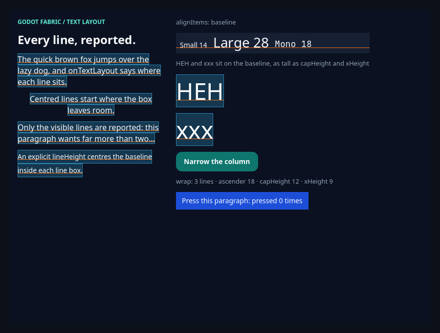

# Text original: o `Text.js` do RN e o press no parágrafo

Esta fatia, a segunda do GF-11, faz o `Text` público renderizar o `Libraries/Text/Text.js` ORIGINAL
do RN 0.87.1, no lugar do wrapper do repositório que registrava `RCTText` e `RCTVirtualText` por
conta própria. O `Text.js` é dono das props, do processamento do estilo, do Pressability de um
parágrafo pressionável e dos dois componentes nativos (`NativeText` e `NativeVirtualText`), que agora
registram esses nomes uma vez. O wrapper
([`src/text.jsx`](https://github.com/journey-studios/godot-fabric/blob/ba5ff00fe1b22c6d5ba30925e57e8df6687a8261/src/text.jsx))
ficou só com o contrato do host: o que esta plataforma aceita e o que rejeita, e o tamanho padrão 18.
O [`PlatformBaseViewConfig`](https://github.com/journey-studios/godot-fabric/blob/ba5ff00fe1b22c6d5ba30925e57e8df6687a8261/src/base-view-config.js)
passou a declarar os estilos de texto (sem eles o payload os descartava em silêncio), e o
[`ParagraphLayout::prepare`](https://github.com/journey-studios/godot-fabric/blob/ba5ff00fe1b22c6d5ba30925e57e8df6687a8261/native/paragraph_layout.cpp)
recusa `ellipsizeMode` head e middle e `adjustsFontSizeToFit`, para que um `NativeText` importado
direto, contornando a fachada, não receba um corte silencioso. A
[pesquisa](https://github.com/journey-studios/godot-fabric/blob/ba5ff00fe1b22c6d5ba30925e57e8df6687a8261/docs/research/text-original.md)
registra as fontes do RN com linhas, a tabela item, comportamento upstream e decisão, e os abertos. O
[recibo](execution.json) fixa fontes, hashes, contagens e resultados, e o [recibo de capturas](captures.json)
os quadros.

Tudo aqui foi executado **a partir do commit de implementação
[`ba5ff00`](https://github.com/journey-studios/godot-fabric/commit/ba5ff00fe1b22c6d5ba30925e57e8df6687a8261)**
(`ba5ff00fe1b22c6d5ba30925e57e8df6687a8261`, árvore `79a6288785c91a4c12dd7e726c6d1026635e6fa3`),
que traz a implementação (`e67b1a0`), o merge da main `dd05760` e a rodada de correções da revisão. A
árvore estava limpa e igual à do commit, sem arquivo novo fora dos diretórios ignorados, quando cada
comando abaixo rodou; os arquivos desta evidência foram acrescentados depois e não são entradas. Ambiente:
macOS arm64, Godot oficial **4.7.2** (`ed1daf0bf`), React Native **0.87.1**, React **19.2.3**, Hermes
**250829098.0.17** e Node **v22.23.3**; a suíte roda headless e o exemplo e as capturas, com o renderizador nativo.

| Lane executada | Checks | Observação |
| --- | ---: | --- |
| SDK e host anteriores: o `src/` da main `6d02746`, host `2cf11ea1`, bundle `a7be1d75` | 51/114 | Exatamente as 63 falhas normativas: o wrapper antigo registra `RCTText` e o `TextNativeComponent` do RN colide, nenhum press com handler monta, as props que o RN tem e o wrapper não rejeitava passam e o host não recusa nada. O oráculo rejeita 5 das 7 seções |
| O mesmo bundle atual no host anterior `2cf11ea1` | 111/114 | Exatamente os 3 checks de contorno: o host fica silencioso para `adjustsFontSizeToFit`, head e middle. O oráculo rejeita só `bypass` |
| Sabotagem `register`, bundle `a0887eaf` | 3/105 | 102 falhas: o wrapper registra `RCTText` de novo e a aplicação nem sobe (`Tried to register two views with the same name RCTText`); o oráculo rejeita as 7 seções |
| Sabotagem `style`, bundle `00610073` | 109/114 | 5 falhas: sem estilos de texto no config base; o oráculo rejeita `registry` (`RCTText declares the style fontFamily`) e `static` |
| Sabotagem `ancestor`, bundle `023453db` | 101/114 | 13 falhas: contexto de ancestral privado; o oráculo rejeita `static`, `negative` e `stop` |
| Sabotagem `span-press`, bundle `991f58f5` | 107/114 | 7 falhas: um `Text` aninhado pode ter press; o oráculo rejeita `negative` |
| Sabotagem `default`, bundle `fd7f945a` | 112/114 | 2 falhas: o tamanho padrão é o 14 do RN; o oráculo rejeita `static` (`s-default: run 0 style`, 14 em vez de 18) |
| Sabotagem `guard`, bundle `7edabedb`, host reconstruído | 111/114 | 3 falhas: o host sem a guarda tem o mesmo SHA-256 do host anterior (`2cf11ea1…`); o oráculo rejeita `bypass` |
| SDK atual, bundle `7edabedb`, host `a8b7b887`, headless | 114/114 | Uma aplicação Hermes, com mouse e toque reais, e o oráculo independente |
| Exemplo `text-layout`, headless | 22/22 | Inclui um clique real na linha pressionável |
| Exemplo `text-layout`, renderizador nativo | 36/36 | Os 22 mais a tinta pintada contra as linhas reportadas; duas capturas |
| Driver das capturas do press, renderizador nativo | 14/14 | Antes, durante e depois do clique: duas capturas novas |

```sh
npm run test:text-original
node scripts/text-original-sabotage.mjs            # os dois controles, as 6 sabotagens e a lane atual, com os fontes restaurados
node tests/text-original-native.test.mjs --previous        # o SDK e o host anteriores (o host instalado em addons/)
node tests/text-original-native.test.mjs --previous-host   # o bundle atual no host anterior
npm run example -- text-layout --capture
```

O host anterior é o `fabric_godot.dylib` que o build da main (fontes de `6d02746`) produziu antes da
fatia, preservado em `build/text-original-previous-host/` e instalado em `addons/` pelo
`scripts/text-original-sabotage.mjs` só durante os dois controles sobre ele; o host genuíno volta depois e o
rebuild reproduz o mesmo binário (`a8b7b887…`). A rodada completa do script levou cerca de 3 min 46 s e o
`npm run test:text-original`, 13 s.

## O que foi verificado

O [probe](https://github.com/journey-studios/godot-fabric/blob/ba5ff00fe1b22c6d5ba30925e57e8df6687a8261/tests/text-original-probe.gd)
monta o [fixture](https://github.com/journey-studios/godot-fabric/blob/ba5ff00fe1b22c6d5ba30925e57e8df6687a8261/tests/text-original-fixture.jsx)
numa aplicação Hermes com três roots (os alvos de press, 19 parágrafos estáticos e as props rejeitadas) e
uma root por caso de contorno, importando só de `react-native`. O bundle precisa conter o `Text.js`, o
`TextNativeComponent.js`, o `TextAncestorContext.js`, o `Pressability.js`, o `usePressability.js`, o
`View.js`, o renderer e o registry originais, ou o teste falha. O
[oráculo](https://github.com/journey-studios/godot-fabric/blob/ba5ff00fe1b22c6d5ba30925e57e8df6687a8261/tests/text-original-oracle.mjs)
não lê o `src/` nem os veredictos do probe: refaz o Pressability a partir das amostras e dos timestamps
brutos (a região do alvo mais `pressRetentionOffset`, com bordas estritas e os offsets 20/20/20/30 por
padrão; os 130 ms do `minPressDuration`; os 500 ms do long press), compara cada rodada de estilo run a run
com o que o estilo declara e cada mensagem de erro palavra por palavra, e rejeita um relatório mesmo com
todos os checks marcados como passados. O teste julga entrega e ordem; as esperas são por condição (o evento
de long press, o `out` adiado) e nunca por um número fixo de quadros.

Os 114 checks são 2 de montagem, 3 de registry, 58 de press, 10 de estilo, 30 de negativos, 3 de contorno,
7 de parada e 1 do relatório; 63 deles falham no SDK e no host anteriores, e 51 valem em qualquer um.

- **Registry.** O `TextNativeComponent` do RN carrega e registra `RCTText` e `RCTVirtualText` uma vez cada: uma
  segunda `register` de cada nome lança `Tried to register two views with the same name`. O `RCTText` declara
  `onTextLayout`, `topTextLayout`, `isPressable` e os sete estilos de texto; o `RCTVirtualText` tem
  `isPressable` e não tem `onTextLayout` nem `topTextLayout`.
- **Press, 18 gestos, cada um com mouse e com toque reais** (36 execuções). O que o Pressability faz, medido
  numa execução (o oráculo julga pelas regras, não por estes números):
  - um **tap** (press e soltura no mesmo quadro, então a duração é de milissegundos qualquer que seja o ritmo dos
    quadros) dá `onPressIn`, `onPress` (2 ms depois) e `onPressOut` 136 ms depois do press in, com o evento da
    soltura persistido; com o toque, `press` junto do `in` e `out` aos 133 ms. Não é a ordem do
    `TouchableWithoutFeedback` (`in`, `out`, `press`), que passa `minPressDuration: 0`, e o `Text.js` não passa;
  - um press **segurado** por 250 ms dá `in`, `out`, `press`: o `out` não é mais adiado (266 ms e 270 ms);
  - um **long press** com `onLongPress` dá `in`, `long` aos 505 ms (o probe espera o evento), `out` na soltura e
    nenhum `onPress`; um tap curto no mesmo parágrafo ainda dá `in`, `press`, `out`;
  - **sair da região e voltar** desativa (`out`) e reativa (`in`), e soltar dentro dela dá `out` e `press`, e soltar
    fora nunca dá `press`: com os offsets padrão (direita 20, embaixo 30) e com `pressRetentionOffset` 14 e 10,
    a 3 px além e a 3 px aquém de cada borda. Cada ativação é segurada além dos 130 ms antes da amostra
    seguinte, porque o Pressability não cancela um `out` adiado quando o press volta;
  - um press **fora** da caixa, num parágrafo `disabled` ou num parágrafo sem handler não reporta nada e não toma
    o responder;
  - um press sobre o texto de um **span aninhado** (e sobre o resto da caixa) é o press do parágrafo externo: o
    alvo do evento é a tag do parágrafo;
  - `onStartShouldSetResponder` sozinho faz o parágrafo ser o responder (`grant` e `release`);
  - todo evento carrega o payload do responder: o parágrafo como `target` e `currentTarget`, `pageX`/`pageY` da
    amostra, `locationX`/`locationY` relativos ao alvo, `touches` 1 até a soltura e 0 nela, e o `out` adiado
    recebe o mesmo evento persistido do `press`.
- **Estilo e padrão 18.** `fontFamily`, `fontWeight` (`'bold'` e o número 600), `lineHeight`, `letterSpacing`,
  `textAlign` e `color` chegam aos `runs` que o host pinta, conferidos run a run em 19 parágrafos; um parágrafo
  sem tamanho tem exatamente o layout de um em 18 (e é maior que um em 14), e os spans herdam esse tamanho, o
  peso e a cor do span em que estão, e um span com tamanho próprio só afeta a si. `allowFontScaling`,
  `maxFontSizeMultiplier`, `dynamicTypeRamp` e `suppressHighlighting` deixam o layout idêntico: aceitos e
  inertes. `onTextLayout` ainda chega ao JS só para o parágrafo externo, e o `numberOfLines` e o `clip` seguem
  como antes.
- **Negativos, 28 props rejeitadas palavra por palavra** antes de qualquer layout nativo, cada uma num boundary que
  recupera: press e responder em span aninhado (`onPress`, `onPressIn`, `onPressOut`, `onLongPress`,
  `onResponderGrant`, `onStartShouldSetResponder` e `onMoveShouldSetResponder`, com `Godot Text does not implement
  <prop> on a nested Text: only the outer paragraph is pressable`), `selectable`, `adjustsFontSizeToFit`,
  `ellipsizeMode` head, middle e inválido (`Godot Text supports tail or clip ellipsizeMode`), `selectionColor`,
  `dataDetectorType`, `textBreakStrategy`, `lineBreakStrategyIOS`, `android_hyphenationFrequency`, `text=` e
  `fontSize=`, `fontStyle` e `textDecorationLine`, `numberOfLines` negativo, fracionário e num span,
  `onTextLayout` que não é função e um `View`, um `Pressable` e um `TouchableHighlight` dentro de um `Text`
  (`Inline Controls are not implemented in Godot Text`). Nenhum deles chega ao host: a aplicação não reporta erro.
- **Contorno.** Um `NativeText` importado direto, sem a fachada, com `adjustsFontSizeToFit`, `ellipsizeMode="head"`
  ou `"middle"`, monta e é recusado pelo host (`measure` e o paint de `GodotParagraph::apply` reportam, e a
  exceção não atravessa o callback do Yoga), com
  `Godot Text does not implement adjustsFontSizeToFit` ou `Godot Text supports tail or clip ellipsizeMode`, e a
  aplicação para com todos os Controls balanceados.

## Controles

**SDK e host anteriores.** O fixture roda sobre o `src/` da main `6d02746`, extraído do git (a fachada
`2ffd5130…` é conferida) para `build/text-original-previous-sdk/` e empacotado pelo mesmo `bundleNativeProbe`
(368 entradas, contra as 389 do bundle atual), no host da main. O `Text.js` não está no bundle dele. Falha
exatamente 63 checks: 1 de montagem (os parágrafos com press lançam `Godot Text does not implement onPress`
no render), os 3 de registry (o `TextNativeComponent` lança a colisão), 6 de tap, 8 de tap com `onLongPress`,
6 de props inertes, 2 de press segurado, 2 de press fora da caixa, 12 de região, 4 de long press, 2 de
`disabled`, 4 de span, 10 de negativos (as props que ele deixava passar em silêncio: `onResponderGrant`,
`onStartShouldSetResponder` e `onMoveShouldSetResponder` num span, `selectionColor`, `dataDetectorType`,
`textBreakStrategy`, `lineBreakStrategyIOS`, `android_hyphenationFrequency`, `text=` e `fontSize=`) e 3 de
contorno (o `require` do `TextNativeComponent` lança e o `NativeText` fica indefinido, então o caso falha no
render). Os 51 que passam valem em qualquer SDK: os estilos e o padrão 18 do wrapper antigo, o responder sem
press, as rejeições com as mesmas palavras e a parada.

**O mesmo bundle no host anterior.** O host da main, com o SDK desta fatia, falha exatamente os 3 checks de
contorno e fica silencioso nos três (nenhum erro, o parágrafo montado e pintado com o corte que a guarda
agora evita); o oráculo rejeita só a seção `bypass`. É a prova de que a guarda nativa, e não a fachada,
é o que recusa o `NativeText` direto.

As seis sabotagens quebram uma decisão cada; os fontes voltam byte a byte (`src/text.jsx`
`29b63dfa…`, `src/base-view-config.js` `df216df6…`, `native/paragraph_layout.cpp` `f8dd2eb1…` antes e depois), mesmo que
um sinal interrompa a execução (`scripts/sabotage-sources.mjs`), e o host genuíno volta com o mesmo binário. O probe e o
oráculo rejeitam cada uma:

| Sabotagem | Checks do probe que falham | Rejeição do oráculo |
| --- | ---: | --- |
| `register`: o wrapper registra `RCTText` de novo | 102 de 105 | as 7 seções; a primeira: `tap is mounted as a paragraph` |
| `style`: sem estilos de texto no config base | 5 | `registry`: `RCTText declares the style fontFamily`; `static`: `s-default: run 0 style` (família `''` em vez de `NotoSans`) |
| `ancestor`: contexto de ancestral privado | 13 | `static`: `s-spans: run 1 style` (18 em vez de 20: o span não é visto como aninhado); `negative`; `stop` |
| `span-press`: um `Text` aninhado pode ter press | 7 | `negative`: `span-press fails with Godot Text does not implement onPress on a nested Text, not` ... |
| `default`: o padrão é o 14 do RN | 2 | `static`: `s-default: run 0 style` (14 em vez de 18) |
| `guard`: sem a guarda nativa | 3 | `bypass`: `fit: the host refuses it` |

O recibo ([execution.json](execution.json)) tem, de cada lane, o SHA-256 do bundle, do host e do relatório bruto
e as seções que o oráculo rejeita. Os hosts: genuíno e restaurado `a8b7b887e367e3e5…` e anterior
`2cf11ea16151a4c0…`, que a sabotagem `guard` reproduz byte a byte. O recibo de fonte não certifica o build nativo
hospedado: os SHA-256 dos fontes são os pinos do recibo do bundle (cada um é igual ao blob do commit
`ba5ff00`), e os dos hosts são os binários construídos nesta máquina, não os que outra máquina compilar.

## Capturas

`npm run example -- text-layout --capture` salva dois quadros do renderizador nativo, de 900 × 680, enquanto
a validação do exemplo clica de verdade no botão que estreita a coluna. Os dois precedem qualquer press, então
a linha pressionável dos dois diz `pressed 0 times`. Como a validação não captura depois de um press, um driver
([`capture-press.gd.txt`](capture-press.gd.txt), que não é código do projeto) instancia a mesma cena, clica no
parágrafo com entrada real do Godot e salva o quadro durante o clique e depois dele, esperando só condições que o
exemplo reporta, e cada quadro é conferido pelo que o host montou e pintou. O
[recibo de capturas](captures.json) registra caminho, SHA-256 e dimensões; cada comando rodou duas vezes seguidas
e salvou os mesmos bytes, e o quadro `before` do driver é idêntico byte a byte ao inicial do exemplo.

```sh
node scripts/check.mjs --text-layout --capture
cp docs/evidence/text-original/capture-press.gd.txt build/capture-press.gd
godot --path . --script res://build/capture-press.gd
```



**Inicial** (`text-original-initial.png`). O exemplo do `text-layout` com a linha nova no fim da coluna da
direita: um `Text` com `onPressIn`, `onPress` e `onPressOut`, azul `#1d4ed8`, que diz `pressed 0 times`. Tudo o
mais é o da fatia 1, e a validação conferiu que a tinta pintada concorda com as linhas reportadas.


**Durante o clique** (`text-original-press-held.png`). O botão do mouse está pressionado sobre o parágrafo: o
`onPressIn` rodou, o React guardou o estado e a linha foi pintada num azul mais escuro, `#1e3a8a`, ainda com
`pressed 0 times` (o `onPress` só roda na soltura). O driver confere que o log do exemplo é exatamente `in` e que
o pixel do padding do parágrafo é `#1e3a8a`.


**Depois do clique** (`text-original-press-after.png`). A soltura rodou `onPress` e, 130 ms depois do press in,
`onPressOut`: o log é `in`, `press`, `out`, a linha diz `pressed 1 times` e voltou ao azul `#1d4ed8`. O driver confere o
texto do nó nativo e o pixel de fundo.


**Coluna estreita** (`text-original-narrow.png`). Depois do clique do exemplo no botão: os parágrafos quebram de
novo (o quebrado passa a quatro linhas, `wrap: 4 lines`), as caixas e as réguas acompanham, e a linha
pressionável, que não foi pressionada, segue dizendo `pressed 0 times`.

## Regressões

Na árvore do commit de implementação, com o host `a8b7b887`, passaram (exit 0 em todas):

- `test:text-layout` (76/76, o caso `press` agora é um check positivo), `test:touchables` (93 e a lane animada
  com 7) e `test:typography` (4/4), com o laboratório `typography` em 50 checks headless e 63 com o renderizador;
- `test:examples`, que roda os 34 exemplos headless (o `text-layout` com 22 checks, o `typography` com 50, o
  `touchables` com 13 e o `pressable` com 47);
- `node --test tests/platform-seams.test.mjs` (16/16): o config gerado de `Switch` e `ActivityIndicator` agora
  segue o config base, que carrega os estilos de texto, e o mapa de estilo dos Controls continua sem eles;
- `test:contracts` completo (301 testes Node, 43 do dashboard, 7 de paridade e 13 Python), o inventário de
  paridade (8.113 contratos e 97 valores públicos), `type-check`, `check:static` e `check:publication`.

## Limites e divergências documentadas

A CI hospedada do passo novo (`native-text-original`, em `contracts.yml`) e a publicação no Pages estão
**pendentes**: nenhuma execução hospedada foi feita, e esta fatia não afirma CI verde. Os números acima são de
execução local em macOS arm64. Nenhum GF, checkpoint, peso ou denominador fecha aqui.

Ficam abertos, e não estão neste recibo:

- **Press em span.** Precisa de hit test por fragmento de texto e de despacho no adaptador de ponteiro; um `Text`
  aninhado que define qualquer prop de press ou responder falha com erro.
- **Acessibilidade de `Text`.** O `Text.js` dá `accessibilityRole: 'link'` a um parágrafo pressionável e a prop chega
  ao parágrafo, mas o host não aplica props de acessibilidade a um parágrafo.
- **Tamanho padrão.** 18, e não o 14 do RN: uma divergência explícita, que mantém os exemplos e as capturas. O host
  já cai em 18 quando o tamanho falta, então a constante da fachada documenta a decisão sem mudar o desenho, e a
  sabotagem `default` troca o 18 pelo 14 do RN.
- **Escala de fonte e destaque.** `allowFontScaling`, `maxFontSizeMultiplier`, `dynamicTypeRamp` e
  `suppressHighlighting` são aceitos e inertes: a escala de fonte do host é 1 e nada destaca fora do iOS.
- **Rejeitados, não implementados:** `selectable`, `adjustsFontSizeToFit`, `selectionColor`, `dataDetectorType`,
  `textBreakStrategy`, `lineBreakStrategyIOS`, `android_hyphenationFrequency`, `ellipsizeMode` head e middle,
  `fontStyle` e `textDecoration*` (as duas últimas e a elipse são as próximas fatias).
- **Ordem do press.** Num tap de um `Text` a ordem é `in`, `press`, `out` (o `out` adiado até 130 ms), não a
  `in`, `out`, `press` de um `TouchableWithoutFeedback`; o oráculo a deriva do Pressability e dos timestamps.
- A suíte roda headless no host do Godot, com o hit test dele; não é um diferencial contra o RN no iOS ou no
  Android, e as capturas não têm um oráculo independente de pixels.
- Windows e Linux têm o mesmo JavaScript, sem execução.
- `src/animated-exports.js:18` (a área do Image) ainda traz uma frase obsoleta sobre o Text; a correção é de lá.
