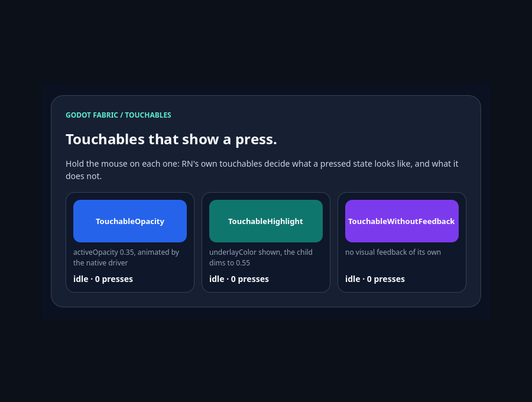
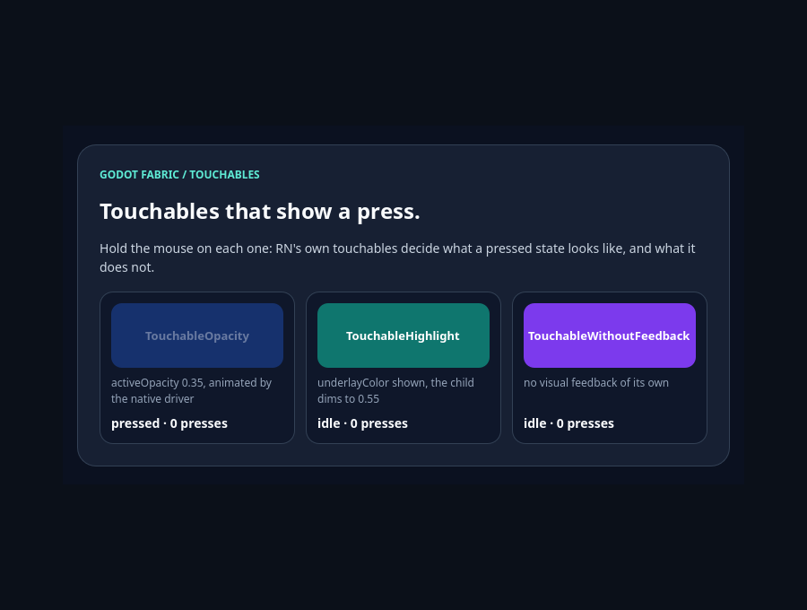
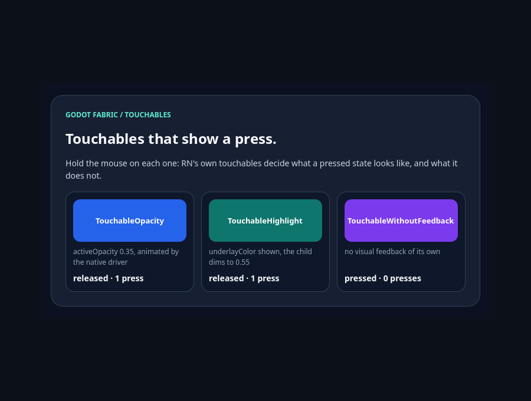

# Touchables originais: TouchableWithoutFeedback e TouchableHighlight do RN

Esta fatia torna públicos `TouchableWithoutFeedback` e `TouchableHighlight` no
import `react-native`, executando os módulos originais do RN 0.87.1
(`Libraries/Components/Touchable/`) sobre a Pressability original. O
`TouchableOpacity` continua indisponível, agora com o motivo explícito: o
`Animated.View` original exige o `NativeAnimatedModule`, que o Godot ainda não
tem. O probe dirige mouse e toque reais do Godot em duas roots de uma aplicação
Hermes, com o bundle de produção do consumidor público. O [recibo](report.json)
fixa fontes, hashes e resultados.

Atualização de 2026-10-06: o `TouchableOpacity` passou a montar e a animar na
fatia do [Animated](../native-animated/README.md), que roda o NativeAnimated C++ do
RN. Este registro, o recibo e as lanes abaixo descrevem o estado da fatia dos
touchables, quando ele ainda era um placeholder, e ficam como histórico.

| Lane executada | Checks | Observação |
| --- | ---: | --- |
| SDK anterior `15e1dda` (local) | 6/25 | Exatamente as 19 falhas normativas de render, cada uma com a mensagem do placeholder; o sentinela Pressable funciona |
| Sabotagem retida (local) | 51/93 | Touchables imitados sobre o Pressable do SDK: 42 checks falham e o oráculo rejeita 12 de 13 seções |
| `TouchableOpacity` original | 6/6 | O efeito do `Animated.View` lança `Native animated module is not available` na montagem |
| SDK atual, headless | 93/93 | Mouse e toque em duas roots, só imports públicos |

As lanes usam o mesmo fixture, o mesmo probe e o mesmo host nativo (o da `main`,
sem mudança em C++); só a fachada empacotada muda.

```sh
npm run test:touchables
node tests/touchables-native.test.mjs --preceding-sdk --sabotage
```

## O que o RN faz

Os três touchables delegam o gesto à Pressability com `minPressDuration: 0`. Na
soltura a Pressability desativa antes de pressionar, então um toque rápido
entrega `onPressIn`, depois `onPressOut` e `onPress` com o mesmo evento de
release.

- O `TouchableWithoutFeedback` não cria host: exige um único filho
  (`React.Children.only`) e o clona com os handlers de responder, o estado de
  acessibilidade e a lista `PASSTHROUGH_PROPS` (`hitSlop`, `testID`, `onLayout`...).
  Ele nunca repassa `style`.
- O `TouchableHighlight` renderiza a `View` do RN com Pressability própria e clona
  o filho único com `opacity: activeOpacity ?? 0.85`. O underlay é estado React:
  aparece antes de `onPressIn`, some em `onPressOut` (se não houver timer de
  esconder), volta em `onPress` e some num timer de `delayPressOut ?? 0`, com
  `onShowUnderlay`/`onHideUnderlay` a cada troca.
- O `TouchableOpacity` renderiza `Animated.View` e anima a opacidade com
  `Animated.timing(..., {useNativeDriver: true})`.

## O que este host fazia

Os três touchables eram placeholders `unavailable(...)` da fachada: renderizar
qualquer um lançava `Godot platform does not implement TouchableX`.

## A mudança

A [fachada](../../../src/react-native-platform.jsx) exporta
`TouchableWithoutFeedback` e `TouchableHighlight` como wrappers finos dos módulos
originais, resolvidos pelo plugin de plataforma como a `View` original. O
wrapper só mantém o contrato do host: nenhum Control dentro de Text (a mesma
regra de View e Pressable) e o estilo da View que o Highlight cria validado pelo
`nativeStyle`, como o da View. Pressability, máquina de estados do Highlight,
timers, clone do filho e `Children.only` são código do RN; um `ref` no Highlight
chega ao host nativo pelo `hostRef` do próprio RN. O `TouchableOpacity` segue
placeholder, e a mensagem agora diz o motivo. `src/components.jsx`,
`src/base-view-config.js` e o código nativo não mudaram.

## O que foi verificado

- **Ordem e payloads.** `onPressIn` no grant; `onPressOut` e depois `onPress`
  com o mesmo payload de release; alvo é a View tocada e o responder é o host do
  touchable; `pageX/pageY` relativos à root e `locationX/locationY` ao alvo;
  contatos 1/1 no grant e 0/1 no release; o mesmo identificador no gesto.
- **Filhos Text.** Um Highlight com um `Text` filho mostra o underlay e escurece o
  parágrafo nativo para `activeOpacity`; um `TouchableWithoutFeedback` com um
  `Text` filho torna o parágrafo alvo e responder.
- **Underlay do Highlight.** Enquanto pressionado, o Control nativo mostra
  `underlayColor` e o filho fica com `activeOpacity`; na soltura vêm
  `hide, out, show, press` e o `hide` do timer de zero; todo quadro depois da
  soltura mostra o visual pressionado ou o de repouso, terminando em repouso.
- **`delayPressOut` 160.** `onPress` sai na hora; todo quadro nos primeiros 150 ms
  mantém o underlay e a opacidade; `onPressOut` chega ≥ 159 ms depois com o evento
  de release persistido (`currentTarget` nulo) e o underlay some.
- **Pressão longa.** `delayLongPress` 250 conta do grant, `onLongPress` recebe o
  evento de grant persistido e a soltura entrega `onPressOut` sem `onPress`;
  mover 15 px (mais que os 10 px do RN) cancela só a pressão longa.
- **hitSlop e retenção.** O hit test nativo honra o `hitSlop` (8 px fora acerta,
  16 px fora erra); a região de retenção da Pressability (retângulo medido +
  `hitSlop` + `pressRetentionOffset`, limites estritos) desativa a 3 px além e
  reativa a 3 px aquém, com mouse na horizontal e toque na vertical; soltar dentro
  da região pressiona mesmo fora da View, soltar fora não.
- **disabled.** Um touchable desabilitado nunca recebe o responder nem mostra
  underlay; um filho desabilitado deixa o Highlight ancestral receber o toque (e,
  como no RN, o Highlight estiliza um `TouchableWithoutFeedback`, que não repassa
  `style`). Desabilitar no meio do gesto não cancela a pressão concedida: ela
  termina na soltura, como a Pressability decide; uma nova pressão não é concedida.
- **Aninhados.** O touchable interno vira o responder e só ele pressiona; o
  Highlight externo nunca mostra underlay.
- **Remoção no meio do gesto.** Remover o Highlight pressionado cancela o contato
  (um cancel nativo), libera o responder e não chama nenhum callback, nem a pressão
  longa pendente nem na soltura; remontado, começa em repouso e pressiona normal.
- **Duas roots.** B recebe só os próprios callbacks, coordenadas relativas a B e a
  mudança visual no próprio host; A não observa nada.
- **Contrato.** Dois filhos e nenhum filho falham no render com o erro do
  `Children.only`; Highlight dentro de Text e estilo não suportado falham com a
  mensagem da fachada; o `TouchableOpacity` falha com o motivo explícito.

## Por que o TouchableOpacity continua indisponível

No RN 0.87.1 o efeito passivo do hook de props do Animated chama
`NativeAnimatedHelper.API.flushQueue()` sempre que `cxxNativeAnimatedEnabled` está
desligado, e as duas variantes de `flushQueue` começam com
`invariant(NativeAnimatedModule, 'Native animated module is not available')`. O
fallback para animação em JS de `shouldUseNativeDriver` nunca é alcançado: o
componente lança no primeiro efeito. Além disso o Animated não entra no bundle
público sem seams novos: os getters preguiçosos de listas puxam
`@react-native/virtualized-lists` e o `AnimatedColor` importa
`processColorObject` de um `PlatformColorValueTypes` sem variante Godot.

A lane animated monta o `TouchableOpacity` original com seams só de teste para
esses dois imports: o host do `Animated.View` é commitado, o efeito lança
`Invariant Violation: Native animated module is not available` e o error boundary
remove o host. Não existe opacidade dirigida por JS para observar; o touchable
depende do GF-19.

## Controles

- **SDK anterior.** O mesmo fixture empacotado com a fachada de `15e1dda` falha
  exatamente os 19 checks normativos de render, cada caso com a mensagem do
  placeholder que renderiza primeiro (`TouchableHighlight`,
  `TouchableWithoutFeedback` ou `TouchableOpacity` sem motivo); o sentinela
  Pressable pressiona e o oráculo rejeita só a seção de montagem.
- **Sabotagem retida.** Uma fachada que imita os dois touchables sobre o
  Pressable do SDK (underlay e opacidade pelo estado `pressed`) falha 42 checks do
  probe, em todos os grupos de gesto menos o do Highlight desabilitado, e o oráculo
  independente, sem os gates de status do probe, rejeita 12 de 13 seções: a duração
  mínima do Pressable põe `onPressOut` depois de `onPress`, não há callbacks de
  underlay e o responder é uma View a mais. Os dois controles são gerados pelo
  runner em `build/` e nunca editam `src/`.

## Capturas

O exemplo interativo [`touchables`](../../../examples/touchables/README.md) abre no launcher com
`npm run example -- touchables`, e `npm run example -- touchables --capture` salva cinco quadros
do renderizador nativo, de 900 × 680, enquanto a validação dele segura o botão do mouse sobre
cada touchable (13 checks headless, 27 com o renderizador). O
[recibo de capturas](captures.json) registra o caminho, o SHA-256 e as dimensões de cada quadro,
e os bytes se repetiram em duas execuções seguidas.



**Em repouso.** O `TouchableOpacity` azul, o `TouchableHighlight` verde-azulado e o
`TouchableWithoutFeedback` roxo, cada legenda com `idle · 0 presses`.



**TouchableOpacity pressionado.** Mouse mantido no primeiro: ele esmaece até o
`activeOpacity` (0,35) pelo driver nativo e a legenda diz `pressed · 0 presses`; os outros dois
não mudam.


**TouchableHighlight pressionado.** Mouse mantido no segundo, depois de o primeiro ter sido
solto (`released · 1 press`, de volta à opacidade total): o `underlayColor` âmbar substitui o
fundo e o filho esmaece até 0,55.



**TouchableWithoutFeedback pressionado.** Mouse mantido no terceiro: nada nele muda, porque o
RN não lhe dá feedback visual; só a legenda, que vem do estado do React, diz `pressed · 0 presses`.


**Soltos.** Depois da terceira soltura, os três com a aparência de repouso e cada legenda com
`released · 1 press`.

A validação compara o SHA-256 da região de cada touchable em cada quadro: enquanto o
`TouchableOpacity` ou o `TouchableHighlight` é mantido, só ele difere do repouso; enquanto o
`TouchableWithoutFeedback` é mantido, os três são desenhados como no repouso; e depois das soltas
os três voltam a ser desenhados como no repouso. Não há oráculo independente de pixels.

Estas execuções são locais: o recibo de [CI hospedada](hosted-ci.json) desta fatia não cobre o
exemplo, que o `npm run test:examples` do job `native-cold-start` passa a repetir (sem captura)
quando ele entra na `main`. Nenhum GF, checkpoint, peso ou denominador fecha.

## Regressões

No mesmo host, o da `main` (sem mudança nativa), passaram os gates do job
`contracts` (260 testes Node e 13 Python, análise estática e scan de publicação),
o `test:recovery` e as 26 suítes nativas: 22 exemplos, Down 2.731 nas oito lanes,
query faults 187, resolver faults 66, Document Up 6.459, View Up 297, Move 220,
Document Move 1.940, hover 158, caminho da raiz 82, hover em Document 1.530, os
próprios touchables 93 e `parity:godot` (13 casos). Também passaram o codegen
nativo, o SDK nativo (pack/verify), os adapters (registry 207 checks em 11 casos,
loader 89 em 21, runtime 13 execuções e 213 checks), o consumidor (30 + 40) e o
cold start. As contagens são as mesmas da `main`. A fachada passa a levar seis
módulos originais a mais para todo bundle do SDK (os dois touchables,
`PressabilityDebug`, `StyleSheet`, `StyleSheetExports` e `composeStyles`), sem
mudar o comportamento das outras suítes.

## Limites

Na exploração, um toque que começou e terminou na root B soltava o responder de
A (os arrays de toques de B não tinham toque dentro de A) e disparava o `onPress`
de A com o payload de B. O defeito era do transporte de toques do host e atingia
todo consumidor do responder; a fatia de [toques compartilhados](../shared-touches/README.md)
(#34) o corrige, listando os toques de todas as roots em cada evento, e o
certifica com `Pressable`. Os touchables passam pelo mesmo responder, e esta suíte
repetiu os 93 checks sobre o host com a correção, mas pressões simultâneas com
os próprios touchables não são afirmadas separadamente. Também seguem abertos o `TouchableOpacity`
(GF-19), `TouchableNativeFeedback` e `TouchableBounce`, foco e ativação por
teclado, acessibilidade (GF-20), síntese de click, declarações tipadas, o
`PressabilityDebugView` de desenvolvimento, hardware e exports mobile.

A [CI hospedada](hosted-ci.json) desta fatia é o push da `main` em 946e624 (run
37394073082), com os cinco jobs verdes na primeira tentativa e sem reexecução. O
artefato `native-touchables` repete os **93 checks headless** da lane `current` e os
6 da lane `animated`; os 19 checks que o SDK anterior falha e os 42 que a sabotagem
falha passam todos no run. A fachada e o bundle do relatório são os da árvore
mesclada, não os fixados, porque a `main` trouxe AppState, PanResponder e Switch
depois da bateria. Os 30 arquivos rastreados batem com a árvore do checkout; 7
diferem de `0e18060` por commits da `main`, e `src/app-state.js` entrou nos pins do
bundle com o AppState (#31). O [Pages](publication.json) (run 37394074068) implantou
exatamente os dados commitados de 946e624; o site público já foi substituído pelo
deploy seguinte da `main`. Nenhum GF, checkpoint, peso ou denominador fecha.

As 30 fontes de código/configuração executadas (27 do harness e do SDK
empacotado e 3 de verificação) correspondem à implementação
`0e180608d08c4a5071ffee25d7fac61e85d537e8` por `git show`/SHA-256. A execução
partiu de `15e1dda` com as mudanças desta fatia ainda locais; este pin pós-commit
não é uma nova corrida.
