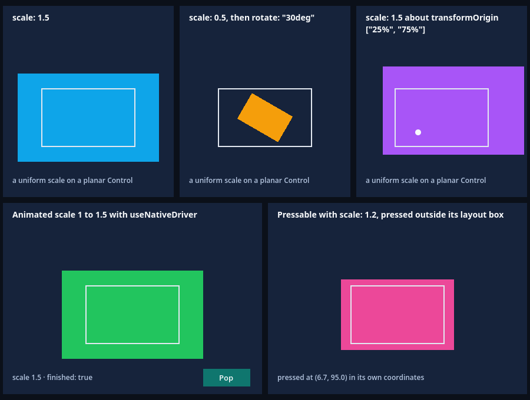

# Escala uniforme do RN em Controls planares do Godot

Esta fatia faz o host aceitar o `transform: [{ scale: n }]` do RN, estático ou animado.
O RN escreve `scale: n` como `scale3d(n, n, n)`, e o guard de transformações do host
(`native/affine_transform.h`) rejeitava toda matriz cujo elemento de z não fosse 1,
com `E_TRANSFORM_3D: expected a planar affine transform`: nenhum `scale` montava, nem o
`Animated.View` com `useNativeDriver` que anima o pop de um botão. Esse elemento só
multiplica z, e os pontos de um Control planar têm z = 0, então o guard passa a
ignorá-lo, mantém a rejeição de todo acoplamento real de z e do peso, e a regra planar
ganha uma definição só, que o adaptador de transformações e a projeção de ponteiros
compartilham. Cinco aplicações Hermes novas, cada uma num Surface do Godot, comparam
o Control com matrizes planares derivadas do JSX por um oráculo independente. O
[recibo](report.json) fixa fontes, hashes, capturas e resultados.

| Lane executada | Checks | Observação |
| --- | ---: | --- |
| Host anterior `e90888f8` | 7/29 | Exatamente as 22 falhas normativas: nenhum estilo com `scale` monta (`E_TRANSFORM_3D` no primeiro erro de cada montagem) e o `scale` animado erra uma vez por quadro; os guards públicos e os de entrada passam |
| Host atual `87a011d5`, headless | 29/29 | Cinco aplicações: três escalas estáticas, o `Animated.View` na subida e na volta, e o `Pressable` com `scale` sob dois cliques reais |
| Host atual, renderizador nativo (`--capture`) | 35/35 | Os 29 mais a captura salva e os pixels de cada caso, decodificados à parte pelo Node |
| Guards públicos de rejeição | 81 em 8 aplicações | Os seis casos anteriores (61 checks) mais `rotate-x` e `w-not-one` (10 cada) |
| Guards de entrada | 25 | Inalterados |
| Teste de fatores afins (C++) | 41.278 | Eram 40.932; o índice 10 deixa de ser rejeitado e o predicado compartilhado é testado direto |

O host anterior é o que a fatia do [Animated](../native-animated/README.md) executou
(`e90888f8`, compilado de `d96383c`, cujas fontes nativas e de SDK são iguais às de
`0157b15`, a base desta fatia). O host atual foi recompilado a partir das fontes do
commit `6fbfb18` e reproduz o mesmo hash. As lanes executam o mesmo bundle; só os
produtores nativos diferem.

```sh
npm run test:transforms:guards
npm run test:transforms:guards -- --capture
npm run test:transforms:guards -- --allow-original-negative
```

O primeiro roda os guards de rejeição, os guards de entrada e o lane da escala uniforme
em headless, com o relatório e o log do lane atual em `build/`. O segundo roda só o
lane da escala uniforme no renderizador nativo (abre uma janela), confere o PNG salvo e
registra o SHA-256 dele. O terceiro, com o host anterior instalado em `addons/`, confere
o controle: exige que falhem exatamente os checks que o probe lista como normativos.

## O que o RN faz

O RN converte `{ scale: n }` em uma operação `Scale` com `x = y = z = n`
(`ReactCommon/react/renderer/components/view/conversions.h`, linhas 811-819), e o
`Transform::Scale` escreve `matrix[0] = x`, `matrix[5] = y` e `matrix[10] = z`
(`graphics/Transform.cpp`, linhas 43-60). Toda escala uniforme carrega `n` no índice
10; `scaleX` e `scaleY` mantêm `z = 1` (linhas 820-843) e `scaleZ` só escreve z (linha
844). O `BaseViewProps::resolveTransform` multiplica as operações na ordem e envolve o
resultado nas translações do `transformOrigin` (`BaseViewProps.cpp`, linhas 532-561).
O Native Animated em C++ monta o mesmo estilo: o `TransformAnimatedNode` coleta
`{ scale: valor }` a cada quadro (`animated/nodes/TransformAnimatedNode.cpp`, linhas
35-56), e o clone das props montadas passa pela mesma conversão.

As plataformas renderizam a escala no plano. O iOS copia as 16 entradas para o
`CATransform3D` da camada (`React/Fabric/RCTConversions.h`, linhas 147-166, aplicado em
`RCTViewComponentView.mm`, linhas 355, 657 e 694): o terceiro elemento da diagonal
multiplica z, e o conteúdo de uma view está em z = 0. O Android decompõe a matriz e
aplica `scale[0]` e `scale[1]` como `scaleX` e `scaleY` (`BaseViewManager.java`, linhas
618-632); `scale[2]` nunca é lido. As duas plataformas divergem nas entradas que de fato
saem do plano (o iOS projeta a matriz 4×4 na camada, o Android decompõe em rotações e
distância de câmera), e este host as rejeita até ter aceite próprio; só o índice 10
deixa de ser rejeitado, porque nas duas plataformas ele não tem efeito no plano.

## O que este host fazia

O `affine_factors` rejeitava `matrix[10] != 1 || matrix[15] != 1` com `E_TRANSFORM_3D:
expected a planar affine transform`, depois de rejeitar os oito acoplamentos de z. O guard
foi escrito para estilos afins 2D e tratava o índice 10 como as entradas que realmente
saem do plano. Um `scale` estático derrubava o commit que o continha, com um segundo
erro de recuperação (`map::at: key not found`); um `scale` animado, a cada quadro que o
backend entregava: o erro é capturado onde o backend aplica a atualização, o Control
ficava sem escala e o host registrava um `E_TRANSFORM_3D` por quadro. A projeção de
ponteiros (`pointer_geometry.cpp`, `local_transform`) tinha uma cópia própria da mesma
regra, com o mesmo problema latente.

## A mudança

1. **Uma definição da regra planar.** O [`planar_violation`](../../../native/affine_transform.h)
   devolve `None`, `ZCoupling` (qualquer das entradas 2, 3, 6, 7, 8, 9, 11 e 14; o
   `rotateX`, o `rotateY` e o `perspective` escrevem algumas delas) ou `Weight` (`matrix[15] != 1`,
   porque o peso divide x e y), nessa ordem. O índice 10 fica de fora: com todos os
   acoplamentos zero ele só multiplica z. O comentário que explica isso mora ali.
2. **O adaptador de transformações.** O `affine_factors` faz um `switch` sobre o
   predicado e mantém as duas mensagens de `E_TRANSFORM_3D` (acoplamento: `perspective and
   3D transforms are not implemented`; peso: `expected a planar affine transform`), depois
   do `E_TRANSFORM_NONFINITE`, que continua valendo para as 16 entradas.
3. **A projeção de ponteiros.** O [`local_transform`](../../../native/pointer_geometry.cpp)
   chama o mesmo predicado e mantém a própria mensagem, `E_POINTER_GEOMETRY_3D`. Antes ele
   teria rejeitado `[10] != 1` e discordado do adaptador. Esse ramo não é alcançável por
   um cenário do Godot com um nó escalado: o `pointer_local_point` ancora no nó montado
   mais fundo, do alvo para cima, e só chama `local_transform` para os nós abaixo da
   âncora; um nó com transform forma contexto de empilhamento (`ViewShadowNode.cpp`, linha
   48) e é sempre montado, então é a própria âncora. Contar as chamadas numa compilação
   descartável deu 0 na cena da fatia, com cliques reais num `Pressable` escalado, e 7 no
   exemplo `pointer-geometry`, todas com matriz identidade (refs achatadas). O ramo é
   coberto pelo teste unitário do predicado compartilhado, que inclui as matrizes
   `Float` do próprio RN.
4. **O que continua rejeitado.** Singulares (`scale: 0` incluso), acoplamentos de z,
   peso diferente de 1, não finitos e fora da precisão nativa. O guard público `3d`
   (`perspective`) continua, e entram `rotate-x` (`rotateX`, mensagem de acoplamento) e
   `w-not-one` (matriz com `[15] = 2`, mensagem do peso), o que prova que o guard ainda
   rejeita 3D de verdade.

## O que foi verificado

> Nota posterior (2026-10-06): o commit [`4d8312d`](https://github.com/journey-studios/godot-fabric/commit/4d8312d98766d8ca44b0020b24e6483e4f572f04) trocou as condições das pernas animadas (a subida e a volta pelo botão Pop) que o item do `Animated.View` abaixo descreve (rampa que anda num sentido só, número mínimo de amostras e de quadros desenhados entre as pontas) pelo recálculo, no oráculo, do `FrameAnimationDriver` do RN a partir dos timestamps que o host entregou: a [CI hospedada](https://github.com/journey-studios/godot-fabric/actions/runs/37484991404) mostrou, no lane dos transforms singulares, quadros quase duplicados dando um degrau contra a rampa, e este lane tinha a mesma condição. A frase do check `FRAMES` foi renomeada (`and intermediate frames were drawn` virou `and the Control changes only on frames the backend delivered`). Os itens abaixo e o [recibo](report.json) seguem como executados na implementação.

O [`uniform-scale.gd`](../../../examples/transforms/uniform-scale.gd) monta cada caso
pelo import público, numa aplicação Hermes e num Surface do Godot próprios, e compara o
Control com uma matriz planar derivada da declaração JSX (o
[`App.jsx`](../../../examples/transforms/App.jsx) da galeria de transforms), nunca do
que o host reporta. Os quatro checks estáticos de um caso são: monta sem erro do host; o
Control carrega a matriz analítica (seis coeficientes e quatro cantos); a escala é
uniforme no fator declarado, o ângulo desenhado é a rotação declarada e a posição soma a
translação da origem; e a matriz e o tamanho de layout ficam parados em 12 quadros
seguintes, sem erro.

- **`scale: 1.5`.** Matriz global, na janela, `[1.5, 0, 0, 1.5, 30, 125]`.
- **`[{ scale: 0.5 }, { rotate: "30deg" }]`.** A matriz de uma similaridade em 30°
  (`[0.433, 0.25, -0.25, 0.433, ...]`): o Control divide a rotação entre a transformada
  própria (120°) e a de offset (-90°), e o ângulo desenhado soma 30°.
- **`scale: 1.5` em torno de `transformOrigin: ["25%", "75%"]`.** A posição do Control
  carrega a translação da origem: `(85, 127.5)`, contra `(65, 140)` de um box sem origem.
- **`Animated.View` com `scale` de 1 a 1,5 e `useNativeDriver`.** O repouso (escala 1, o
  backend do RN anexado e parado), a subida de 600 ms (90 amostras, 73 estritamente entre
  as pontas), o fim (escala 1,5 nos dois eixos, o React renderizou duas vezes e nunca por
  quadro, o backend aplicou 89 atualizações diretas e parou) e a volta por um clique real
  do mouse no botão Pop (87 amostras, 73 entre as pontas, o Control termina na matriz
  identidade, três renders). Em cada quadro a escala é uniforme, não há rotação, o valor
  fica entre as pontas dentro da folga de 1e-3 da curva do próprio RN e anda num sentido
  só, e a matriz é a do próprio fator. A folga existe porque o `FrameAnimationDriver` do RN
  arredonda o índice de quadro e estende linearmente o segmento, então a easing sai do
  valor inicial por cerca de 1e-4 nos primeiros quadros (0,99994 observado).
- **`Pressable` com `scale: 1.2`.** Dois cliques reais do mouse, segurados 0,2 s (acima
  dos 130 ms de `minPressDuration` da Pressability, então o `onPressOut` não é adiado).
  Em coordenadas do box de layout 160×100, o escalado cobre `(-16, -10)` a `(176, 110)`.
  O clique em `(-24, 50)`, fora das duas caixas, não chega ao Pressable e não deixa contato
  nem responder. O clique em `(-8, 104)`, fora do box de layout e dentro do escalado, só
  chega se o hit testing seguir a geometria escalada: dispara `in`, `out` e `press` uma vez
  cada (com `in` primeiro), todos com `target` igual à tag do Pressable, `pageX`/`pageY`
  `(132, 244)` e `locationX`/`locationY` `(6.6667, 95.0)`, que são a inversa da matriz
  escalada aplicada ao ponto (um hit test sem escala daria `(-8, 104)`). Durante o toque
  há um contato e o Pressable segura o responder; depois, nenhum. O texto do card, que o
  `onPress` troca por `pressed at (6.7, 95.0) in its own coordinates`, é lido do nó
  nativo e aparece na captura.
- **Liberação.** Parar cada aplicação libera o Control, a tag e os recursos de
  agendamento, com criações e remoções de Controls equilibradas; as cinco aplicações
  rodam em runtimes Hermes distintos.

O [oráculo](../../../scripts/transform-scale-oracle.mjs) é escrito à parte da sonda, em
Node, e nunca consulta os veredictos dela: deriva a matriz de cada declaração com
aritmética simples (a escala e a rotação em torno da origem, no lugar do box dentro do
seu Surface), os pontos dos dois cliques e a inversa que dá o ponto alvo-local, e confere
tudo o que a sonda gravou dos Controls reais, dos quadros e dos eventos. Um relatório com
todos os checks marcados como aprovados ainda é rejeitado se um Control gravado estiver
errado ou ausente. Na execução do recibo ele aceita o relatório, com erro máximo de
4,8e-8 nos coeficientes lineares e 2,0e-5 na translação em 177 quadros animados. O runner
confere ainda a lista de falhas normativas por nome e por posição, o PNG decodificado à
parte, e que os erros visíveis do Godot são exatamente os checks que falharam e os erros
do host que o relatório guarda.

## Controles

O host anterior roda o mesmo bundle. A montagem de cada estilo com `scale` (as três
escalas estáticas e o Pressable) falha com `Exception in HostFunction: E_TRANSFORM_3D:
expected a planar affine transform`, seguida de `map::at: key not found` na recuperação;
o `Animated.View` monta em repouso (escala 1 é a matriz identidade) e falha a cada quadro
da animação, 88 erros `E_TRANSFORM_3D` do backend mais os dois da exceção e da não-JS, com
o Control parado na escala 1. Falham exatamente os 22 checks normativos: os 12 estáticos
(montagem, matriz, fatores e estabilidade nas três escalas), os 6 do Pressable (os quatro
estáticos e os dois cliques) e os 4 do animado (a execução, os quadros, o fim e a volta).
Passam os 7 restantes (a independência dos runtimes, o repouso do animado e as cinco
liberações), os 81 checks dos guards públicos e os 25 dos guards de entrada, e o oráculo
rejeita o relatório.

Observações únicas fora do recibo, em compilações e fixtures descartáveis, não asseguradas
pela suíte: (a) com `scale: 1` no Pressable, o clique no ponto que só o scale alcança não
grava nenhum evento e o check dos cliques falha junto com os de matriz e fatores, enquanto
o clique fora passa, o que mostra que o check discrimina a geometria usada no hit
testing; (b) o oráculo rejeitou 33 de 33 cópias editadas à mão do relatório (escala,
matriz, translação, ângulo, quadros, renders, a volta, a lista de eventos, os alvos, as
coordenadas, a legenda, o ponteiro e o layout); (c) um `Pressable` cuja própria `scale`
muda enquanto pressionado (1,2 em repouso, 0,9 pressionado) registrou `in`, `press` e
`out` uma vez e o Control passou por 1,2, 0,9 e 1,2, que é o pop de botão que motivou a
fatia; (d) a contagem de chamadas de `local_transform` descrita acima; (e) o teste de
fatores afins desta fatia, antes das linhas do predicado, compilado contra o cabeçalho
anterior, falha no primeiro `scale` uniforme com `E_TRANSFORM_3D`, e o teste anterior,
compilado contra o cabeçalho novo, falha na expectativa do índice 10; (f) `scale: 0` e
`scaleX: 0` montados como estilos públicos, em aplicações Hermes novas, falham com uma só
exceção `E_TRANSFORM_SINGULAR: singular transforms are not implemented` cada, e o mesmo
estilo é o que um valor animado que começa em 0 entrega à montagem.

## Captura

`npm run test:transforms:guards -- --capture` salva um quadro do renderizador nativo,
900 × 680, com os cinco cards e 35 pontos de pixel com cor derivada da matriz:
[transform-uniform-scale.png](transform-uniform-scale.png). Os três cards de cima são os
casos estáticos (azul crescido 1,5, laranja encolhido 0,5 e girado 30°, roxo 1,5 em torno
do ponto branco de 25% × 75%) e os de baixo o `Animated.View` verde no fim da subida
(`finished: true`, antes do clique em Pop) e o `Pressable` rosa de escala 1,2, com o texto
`pressed at (6.7, 95.0) in its own coordinates` depois dos dois cliques. O contorno claro
em cada card é o box de layout sem a transformação, de onde a escala parte.



O PNG tem SHA-256 `5041e1008577144f854015dbd82c24255fc83ae55c4f31c77347eb90657b31a0`, igual em
várias execuções seguidas. O [exemplo](../../../examples/transforms/README.md#uniform-scale)
o mostra com a explicação de cada card.

## Commit à parte

O commit `6f947d3` (`test(animated): Compare the example's captures by region`) corrige
a validação do exemplo do Animated, a pedido do achado do CodeRabbit no PR #40: o check
"o quadro do renderizador difere em todos os estágios" comparava o hash do viewport
inteiro, e pixels alheios (a opacidade do botão Run, o texto de status) podiam fazê-lo
passar mesmo que a caixa animada não fosse desenhada. Agora o hash é por região (a trilha
da caixa e o botão Run) e o exemplo afirma que os pixels da trilha diferem entre repouso,
meio da animação e fim, e que o pressionar muda só os do botão Run. O exemplo `animated`
passa de 10 para 12 checks headless e tem 22 com `--capture`; `npm run test:examples` vai
de 2.260 para 2.262 checks. Os PNGs do exemplo não mudam. Com a caixa forçada a ficar
invisível, o check novo falhou numa execução descartável.

## Regressões

Na execução, sobre a árvore commitada `6fbfb18` e no mesmo host, passaram o
`test:recovery`, as 35 suítes nativas do job `native-cold-start` (23 exemplos com 2.262
checks, o `animated` com 12 e o `transforms` com 309; os guards de transformações com 81
checks de rejeição, 25 de entrada e os 29 do lane da escala uniforme; Down 2.731 nas oito
lanes, query faults 187, resolver faults 66, Document Up 6.459, View Up 297, Move 220,
Document Move 1.940, hover 158, caminho da raiz 82, hover em Document 1.530, click 728,
notificações de captura 672, PanResponder 128, AppState 75, listas 44, Appearance 79,
Switch 108, toques compartilhados 92, touchables 93 com 7 na lane `animated`,
ActivityIndicator 33 e o Animated 75) e o lote do SDK nativo (affine com 41.278 checks,
codegen nativo com 6 unidades de tradução, pack/verify, registro de adapters com 207
checks, loader com 89, runtime de adapters, consumidor independente com 30 checks de
build/propriedade e 40 nativos, cold start com duas importações frescas e
`parity:godot` com 13 casos). Os contadores são os mesmos da fatia do Animated, exceto os
dois que esta fatia muda de propósito (os exemplos, de 2.260 para 2.262, e os guards de
rejeição, de 61 para 81). Os três gates do job `contracts` (264 testes Node e 13 Python,
análise estática e scan de publicação) rodaram sobre a árvore final, com estes
documentos, e estão no recibo. O lane atual, o controle e a captura foram executados de
novo da árvore commitada antes das suítes. Os controles de host anterior das outras
fatias que ficam só em `build/` não foram refeitos, e a CI não os executa.

## Contratos atualizados

O guard de transformações é um contrato de uma fatia anterior, e três coisas mudam com ele
de propósito. O teste de fatores afins deixa de rejeitar o índice 10 (esses checks viram
os positivos de escala uniforme) e ganha o teste do predicado; o conjunto de rejeições
públicas passa de seis casos e 61 checks para oito e 81; a projeção de ponteiros adota a
definição compartilhada. Os arquivos executados do [registro das transformações](../transforms/README.md)
(`checks.json`, `guards.json` e os demais, com 40.932 checks de fatores e seis casos)
continuam como registro histórico do que foi observado na época, e o README dele ganhou
só uma nota apontando para este. Os documentos atuais deixam de dizer que a escala
uniforme falha: a [API](../../API.md), o README, o ROADMAP, a pesquisa e o exemplo do
Animated; o [registro do Animated](../native-animated/README.md) e o relatório dele são o
histórico do que a suíte daquela fatia encontrou e só ganharam uma nota apontando para
este registro.

## Limites

> Nota posterior: a [fatia dos transforms singulares](../singular-transforms/README.md) passou a colapsar `scale: 0`, `scaleX: 0` e os demais singulares; o parágrafo abaixo descreve a execução deste recibo.

`scale: 0`, `scaleX: 0` e qualquer transform singular seguem com `E_TRANSFORM_SINGULAR`:
um pop que começa em escala zero é comum, e é o próximo requisito. 3D, `perspective`,
`rotateX` e `rotateY` (as entradas de z que o guard continua rejeitando), peso diferente
de 1 e o z do `transformOrigin` seguem fora de escopo. O cenário prova o hit testing e a
projeção alvo-local pela transformação real do Control com o mouse; o toque num
`Pressable` escalado, `measure`/`measureInWindow` de um alvo com `scale` (o código é o
original do RN, coberto na galeria com `scaleX`), o clipping transformado, `scaleZ` (que
agora não tem efeito no plano, como nas plataformas) e os exports mobile do Godot não são
asseguração desta fatia. O ramo do guard em `local_transform` não é alcançável com um nó
escalado (o nó é sempre montado e é a própria âncora), então só o teste unitário o cobre.
Nenhum GF, checkpoint, peso ou denominador fecha: o GF-10 não é primeira fatia dele,
então o checkpoint de fatia, que já estava fechado, não muda, e o contrato, a paridade
e os alvos seguem abertos.

Na execução, as 86 fontes de código e configuração executadas (10 produtoras desta fatia,
63 entradas do build nativo e 16 de verificação, com 3 em comum) correspondem à
implementação `6fbfb18c7dac619f58a818a5b3cbc3abb6c61f25` por `git show`/SHA-256, e o
recibo registra as 14 fontes originais do RN que as citações usam. A execução foi feita
na própria árvore commitada (base `0157b15`, árvore
`0c7ae8da6b4ce459eed4285c5b0007a813f59e8a` idêntica à da implementação, sem alteração
local nas fontes executadas; só os documentos desta fatia foram escritos enquanto as
suítes rodavam), então este pin não é uma corrida nova. O recibo traz o hash da captura;
os relatórios brutos dos lanes ficam em `build/` e não entram no Git.

A [CI hospedada](hosted-ci.json) desta fatia é o push da `main` em 9e7cc4f (run
37455258901), com os cinco jobs verdes na primeira tentativa e sem reexecução. O
artefato `native-transform-guards` do job nativo repete as lanes headless: os **29
checks** da escala uniforme, com IDs idênticos aos fixados e o bundle do relatório,
os 81 dos oito casos de rejeição e os 25 das guardas de entrada; o oráculo
independente aceita de novo o relatório baixado (erro linear máximo de 4,8e-8, o do
recibo) e os 22 checks que o host anterior falha passam todos no run. A lane de
captura (35 checks, renderizador nativo) não roda no runner hospedado. Os 86
arquivos rastreados batem com `6fbfb18` na árvore do checkout. O
[Pages](publication.json) (run 37455258872) implantou exatamente os dados commitados
de 9e7cc4f; o site público já foi substituído pelo deploy seguinte da `main`. Nenhum
GF, checkpoint, peso ou denominador fecha.
