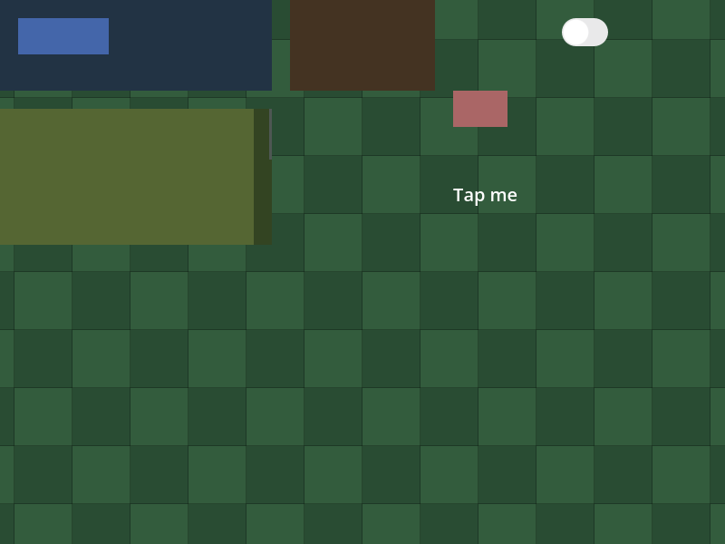
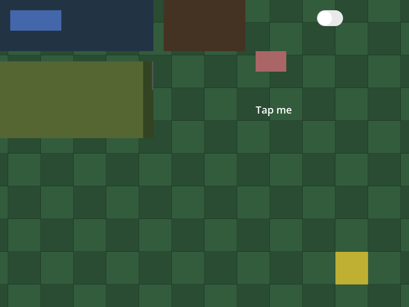
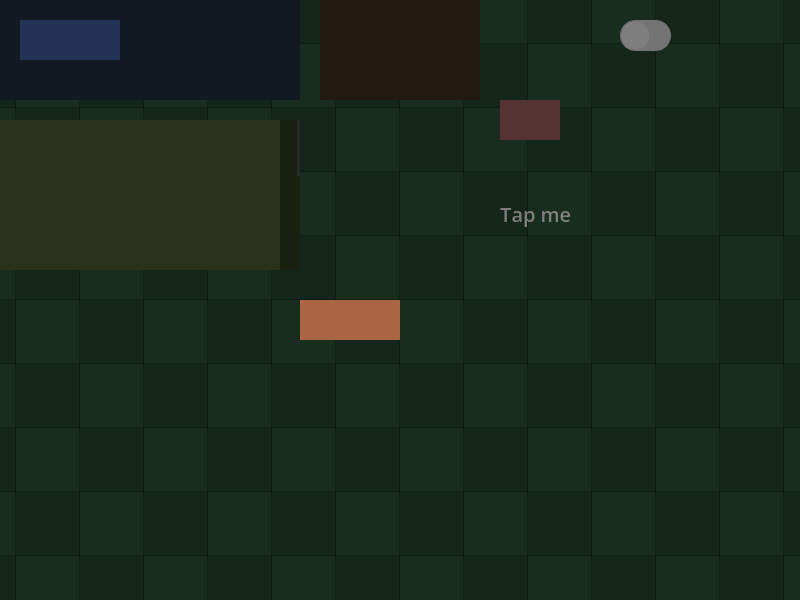
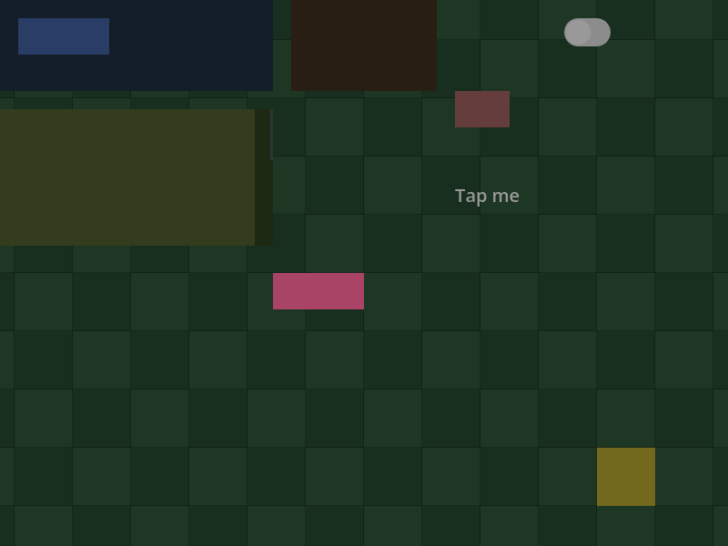

# Um HUD React Native sobre um mundo Godot: quem recebe o ponteiro (fatia 2, variante a2)

Esta fatia é a segunda das três do spike de ponteiro (V05-02, o go/no-go nº 1 do marco 0.5 Frontier). A
[fatia 1](../world-input/README.md), pinada ao commit `0d754f2`, fez a política mínima (a1: a `FabricSurface` deixa o
ponteiro passar ao mundo e só os Controls das Views o barram) e **mediu seis lacunas** que ela deixava: a folga do
`hitSlop`, um `Text` com `onPress`, os vãos de um ScrollView, a roda sobre o HUD, a roda sobre um ScrollView e a roda
sobre um overlay na árvore. Esta fatia as fecha com **uma regra só**, a do React Native num telefone: o ponteiro chega
a exatamente um lado, e **o que o hit test do RN acerta no ponto do evento é do HUD**; o resto é do mundo. No estágio
`_unhandled_input`, depois do GUI, a `FabricSurface` marca o evento como tratado quando o novo método público
`ApplicationRuntime::claims` (que roda o `physical_hit_test` daquela Surface no ponto do evento) acha uma View.
Cobre o botão do mouse (a roda e o release da roda incluídos), o `InputEventScreenTouch` e o mouse que o Godot emula de
um toque (device −1, que o RN ignora e o mundo ouve). O movimento e o arrasto ficam fora da regra e seguem como
estavam. A [nota de pesquisa](../../research/world-input.md) tem a regra, o porquê do hit test e não do handler (com as
referências do iOS e do Android), a ordem do unhandled com as linhas do Godot 4.7.2 e o que segue aberto; o
[recibo](execution.json) fixa fontes, hashes, contagens, capturas e resultados.

Todo link de código abaixo está fixado no commit de implementação
[`0486727`](https://github.com/journey-studios/godot-fabric/commit/048672798db248d2557e111c83c362269fe52730)
(árvore `a2e63245`), em cujo conteúdo cada comando abaixo rodou, sobre o commit do vermelho
[`9727ceb`](https://github.com/journey-studios/godot-fabric/commit/9727ceb81858043d2aaad6d81f0578e15726918f), que traz
o probe, o oráculo, o driver e o fixture com as lacunas como checks normativos e **sem a regra**, e foi feito antes
dela. A base é a main [`c8de44b`](https://github.com/journey-studios/godot-fabric/commit/c8de44b3caa12a82009e55a059e2ce3da68f9485),
que já traz a política a1 (#71), o ScrollView (#58), a política de escopo de props (#74) e o consumidor civ-lite (#76).
Esta pasta é **irmã** da da fatia 1 (`docs/evidence/world-input-a2/`, ao lado de `docs/evidence/world-input/`), de modo
que o registro da fatia 1 continua pinado ao seu commit e só ganha um ponteiro para este.

| Lane executada | Checks | Observação |
| --- | ---: | --- |
| Host a2 (esta fatia), headless | 91/91 | Duas topologias (a, N = 100, e b, N = 20), com o oráculo independente: 50 normativos (31 da a1 e 19 da a2) e 41 comuns |
| Host a1 `28cc9f14` (main `c8de44b`, sem a regra) | 72/91 | Exatamente as **19** falhas normativas da a2; o oráculo rejeita o relatório |
| Host pré-a1 `8bb87738` (reconstruído) | 50/91 | **41** falhas: as 31 da fatia 1 e 10 da a2 (as rodas); os 9 cliques, toques e mouse emulado das lacunas valem ali |
| Sabotagem `surface-stop` (cena) | 60/91 | Exatamente 31 falhas |
| Sabotagem `views-ignore` (cena) | 86/91 | 5 falhas nomeadas (o `Switch`, o hover) |
| Sabotagem `unhandled-off` (cena) | 72/91 | 19 falhas: as lacunas voltam |
| Sabotagem `claim-all` (fonte, host recompilado) | 56/91 | 35 falhas: a área vazia deixa de chegar ao mundo |
| Sabotagem `before-gui` (fonte, host recompilado) | 89/91 | 2 falhas: o `Switch` nativo não recebe o clique nem o toque |
| Faixa janelada, host a2, janela do macOS | 32/32 | N = 100, as seis lacunas; **quadros sem ritmo** (a tela estava dormindo): sem alegação de tempo de quadro |

Os três hosts executam o **mesmo bundle** (`18a9c1df`, as mesmas fontes de teste e de SDK); só os produtores nativos
diferem, e o recibo guarda o SHA-256 de cada relatório cru. As cinco sabotagens e os dois controles rodam por
`node scripts/world-input-sabotage.mjs`, que apaga o relatório de cada variante antes de rodá-la e conta um relatório
ausente como não rejeitado, restaura as fontes e o host byte a byte (SHA-256 igual antes e depois) e termina
recompilando o host a partir das fontes restauradas e comparando-o com o genuíno.

**Ambiente**: macOS arm64 (Apple M3 Pro, macOS 26.6.2); Godot oficial 4.7.2 (`ed1daf0bf`), RN 0.87.1, React 19.2.3,
Hermes 250829098.0.17 e Node v22.23.3. A suíte roda em modo headless; a faixa janelada, numa janela real com o renderer
nativo (`gl_compatibility`).

Os comandos, na ordem em que rodaram na árvore do commit de implementação (`git status` vazio antes e depois):

```sh
node scripts/world-input-sabotage.mjs
npm run test:world-input
node scripts/world-input-graphics.mjs
```

> **CI hospedada pendente.** O passo `npm run test:world-input` e o artefato `native-world-input` do workflow
> `contracts.yml` ainda não rodaram na CI hospedada para esta fatia (nem para a anterior). Tudo o que esta página
> registra é evidência local, em macOS arm64. Os controles e a faixa janelada não rodam na CI.

## Os três hosts

| Host | SHA-256 | Origem |
| --- | --- | --- |
| a2 | `cc8aa3c5691b9e435e4212fd3515fcd1a97ad48229ca93daa339dfe1b627d2ee` | o commit `0486727`: a main `c8de44b` com a regra |
| a1 | `28cc9f14d34b0ec1b7e5038f52551a1175ed20010cf4ceceedbef246c0479fc6` | a main `c8de44b`, compilada por `npm run setup` antes de qualquer mudança (política a1, sem a regra) |
| pré-a1 (reconstruído) | `8bb877385c7c1b73c282ddca2f7bbb12331b5baa271021bb2865465ebc195076` | a main `c8de44b` **sem** o `set_mouse_filter(MOUSE_FILTER_IGNORE)` do construtor da `FabricSurface` |

**Por que o pré-a1 não é o `79f68b1d` da fatia 1.** O controle da fatia 1 foi compilado da main `41fbe22` e ficou numa
worktree isolada que não existe mais, então o binário não pôde ser reaproveitado. O controle desta fatia é a mesma
diferença (o `IGNORE` do construtor) sobre a main atual; por isso difere do `79f68b1d` em todo o resto do que a main
ganhou desde `41fbe22` (o trabalho de ScrollView e do adaptador de ponteiro, #58, e depois). A fonte
`native/fabric_surface.cpp` foi restaurada byte a byte depois da compilação (SHA-256 `4b666885…` antes e depois). As 31
falhas da fatia 1 são as mesmas 31 deste host (conferidas pelo teste, que exige o conjunto igual ao declarado).
O a2 e o a1 diferem em `native/fabric_surface.{h,cpp}` (`_unhandled_input`) e `native/application_runtime.{h,cpp}`
(`claims`); o a1 e o pré-a1, só no construtor.

## A regra

[`FabricSurface::_unhandled_input`](https://github.com/journey-studios/godot-fabric/blob/048672798db248d2557e111c83c362269fe52730/native/fabric_surface.cpp)
chama
[`ApplicationRuntime::claims`](https://github.com/journey-studios/godot-fabric/blob/048672798db248d2557e111c83c362269fe52730/native/application_runtime.cpp)
e chama `set_input_as_handled()` quando ele devolve verdadeiro. `claims` não roteia nada ao JS: aplica as guardas do
`input()` (raiz parando ou parada, `validation_input_device` diferente, ponto não finito, rota de mouse suprimida),
roda `physical_hit_test` e devolve se o tag é diferente de 0. `hit_test`, `apply_pointer_filters`, `input()` e `wheel()` não
mudam: a regra acrescenta um estágio e não reescreve os existentes. Os Controls do GUI que o RN monta (`Button`,
`LineEdit`, `Switch`) não perdem nada, porque a regra roda **depois** do GUI. A área vazia continua do mundo, porque a
raiz `box-none` não é acertável.

## A ordem do unhandled

A Surface só reivindica antes do mundo se o Godot chamar o `_unhandled_input` dela **antes** do do mundo. Chama, pela
ordem da árvore, e o probe confere na cena viva. Do fonte do Godot 4.7.2 (tag `4.7.2-stable`):

- `scene/main/viewport.cpp`: 3489-3553 `Viewport::push_input` (o comentário em 3537 diz que a ordem é `_input` → GUI →
  `_unhandled_input`; cada estágio só `if (!is_input_handled())`, 3535, 3540, 3548); 3620-3634
  `_push_unhandled_input_internal` (o grupo do unhandled em 3631-3633).
- `scene/main/scene_tree.cpp`: 340-355 `_update_group_order` (ordem da árvore, `Node::Comparator`, `node.h:136`);
  1430-1502 `_call_input_pause`, cujo laço `for (int i = gr_node_count - 1; i >= 0; i--)` em 1461 percorre o grupo **em
  ordem inversa da árvore**: o último nó da árvore é chamado primeiro; 1462-1464 para quando o evento já foi tratado;
  1495-1497 o caso `CALL_INPUT_TYPE_UNHANDLED_INPUT`.
- `scene/main/node.cpp`: 255-266, `NOTIFICATION_READY` liga o processamento quando `_unhandled_input` está sobrescrito
  (`GDVIRTUAL_IS_OVERRIDDEN`); 177-179 e 1300-1311, o grupo `_vp_unhandled_input<id>`. O override de GDExtension se liga
  sozinho, como o `_input`; o construtor não acrescenta nada.

Um HUD (`CanvasLayer`) **depois** do mundo na árvore tem a Surface chamada primeiro. O probe confere isso com uma
**testemunha** ([`tests/world-input-order-witness.gd`](https://github.com/journey-studios/godot-fabric/blob/048672798db248d2557e111c83c362269fe52730/tests/world-input-order-witness.gd)):
um nó posto na `CanvasLayer` do HUD, onde a Surface fica, que anota quantos eventos o mundo já tinha ouvido a cada
evento de botão que ela ouve. O oráculo deriva que o mundo ainda não tinha ouvido aquele evento: a lista da
testemunha é igual aos índices dos eventos de botão na lista do mundo (`heard [1, 2]`, `worldIndices [1, 2]`, em (a) e
em (b)). Usa-se a roda, porque todo host a deixa passar ao unhandled, de modo que o check vale em todos eles. A ordem
oposta (HUD antes do mundo) não é medida nem suportada.

## As lacunas, da a1 para a a2

As seis lacunas viram checks normativos (o mundo ouve 0; o RN ouve n onde há handler), com N = 100 em (a) e N = 20 na
barra de cada painel de (b). A coluna a1 é o host a1 (o controle); o que o RN ouve é igual nos dois hosts.

| Lacuna | Alvo | O mundo ouve na a1 | O mundo ouve na a2 | O RN ouve |
| --- | --- | --- | --- | --- |
| L1 `hitSlop` | clique, toque, mouse emulado | 100 press e 100 release; 100 `ScreenTouch` e 100 emulado (press e release); 100 emulado | 0, 0, 0 | `slopPress` 100, 100, nada |
| L2 `Text` com `onPress` | clique, toque, mouse emulado | as mesmas formas | 0, 0, 0 | `textPress` 100, 100, nada |
| L3 vão de ScrollView num wrapper `box-none` | clique, toque, mouse emulado | as mesmas formas | 0, 0, 0 | `wrapDown` 100, 100, nada |
| L4 roda sobre o HUD | uma barra, um painel simples, um `Pressable`, a folga, um `Text` | 100 press e 100 release do botão 4 | 0 | nada |
| L4 roda sobre o vão do ScrollView | o vão | só 100 release (o ScrollView toma o press) | 0 | nada |
| L5 roda sobre um ScrollView | o conteúdo | só 100 release (o press é tomado) | 0 | nada num handler (o ScrollView toma a roda) |
| L6 roda sobre o overlay na árvore aberto | o overlay | 100 press e 100 release | 0 | nada |
| a barra de cada painel de (b) | roda, N = 20 | 20 press e 20 release | 0 | nada |

O mouse emulado é mirado também sozinho (um press e release esquerdos com device −1, sem toque): o RN nunca o ouve e a
a2 o reivindica nos lugares acima. O `Switch` que o fixture ganha (um Control nativo do GUI) é alternado 100 vezes por
100 cliques e por 100 toques, com 0 no mundo, em todos os hosts: o GUI o recebe primeiro. O oráculo deriva cada valor da
geometria do HUD (a zona de folga `[480,80,100,80]` de um `Pressable` de 60 × 40 com `hitSlop` 20 em (500,100), o
`Text` `[500,200,80,30]`, o wrapper `[400,300,300,150]`, o `Switch` `[620,20,51,31]`) e da regra: toda região que o HUD
pinta é do RN, qualquer que seja a entrada, e os handlers dela ouvem clique e toque e nunca a roda nem o mouse
emulado. Um relatório sintético do comportamento da a2 é aceito, e os que têm um press vazado, um toque perdido no
`Text` ou uma ordem errada da testemunha são rejeitados, cada um com a sua mensagem.

## Controles

- **Host a1** (`--allow-a1-negative`): falha **exatamente os 19** checks normativos da a2 (o teste confere que o
  conjunto é igual ao declarado e que o oráculo rejeita o relatório, com `a/tree/open/wheel: what the world heard`): os
  nove cliques, toques e mouse emulado de L1-L3, as sete rajadas de roda de L4 e L5, a roda sobre o overlay na árvore
  aberto (L6) e a roda sobre a barra de cada painel.
- **Host pré-a1** (`--allow-original-negative`): falha **41**: as 31 da fatia 1 (o filtro padrão da Surface, a área
  vazia, a câmera, a alternância, o hover, os controles positivos dos overlays, e o mesmo nos dois painéis) e 10 da a2,
  as da roda, que a Surface STOP dele não esconde. Os nove cliques, toques e mouse emulado de L1-L3 **valem** ali, porque
  a Surface STOP os esconde do mundo. O oráculo rejeita o relatório com `a: a Surface takes no pointer (IGNORE)`.

## Sabotagens retidas

Cada sabotagem tem de falhar os checks que provam o seu motivo (o script exige os nomes), não só falhar algo.

- **`surface-stop`** (a cena devolve `MOUSE_FILTER_STOP` a toda Surface): 31 falhas, as mesmas 31 do host pré-a1; o
  oráculo rejeita pelo filtro da Surface.
- **`views-ignore`** (a cena dá `MOUSE_FILTER_IGNORE` a todo Control das Views): **5** falhas, o `Switch` (clique e
  toque) e o hover (três checks); o oráculo rejeita em `a/switch/left: what the HUD's handlers heard`. Na fatia 1 eram
  21: com a regra, o hit test ainda acha uma View cujo Control é IGNORE, então o mundo já não ouve o `Pressable`, a
  barra nem o painel; o que a sabotagem ainda quebra é o que vive do GUI.
- **`unhandled-off`** (a cena tira das Surfaces o `_unhandled_input`): as lacunas voltam, 19 falhas, o mesmo conjunto do
  host a1; o oráculo rejeita em `a/tree/open/wheel: what the world heard`. Prova também que o override depende do
  estágio unhandled e se liga sozinho (sem a sabotagem, as 19 passam).
- **`claim-all`** (fonte: a `fabric_surface.cpp` reivindica todo evento no unhandled, com ou sem View; host recompilado
  `05bc3863…`): 35 falhas, a área vazia deixa de chegar ao mundo (os cliques, a roda e o toque no vazio, a câmera, a
  alternância, os controles positivos dos overlays e dos painéis, e a ordem); o oráculo rejeita em
  `a/void/left: what the world heard`.
- **`before-gui`** (fonte: a `fabric_surface.cpp` reivindica também no `_input`, antes do GUI; host recompilado
  `c45f0b51…`): **2** falhas, os dois checks do `Switch` nativo (clique e toque): ele não recebe nada, porque o evento já
  foi tratado antes do GUI; o oráculo rejeita em `a/switch/left: what the HUD's handlers heard`. É a prova de que a
  regra tem de rodar depois do GUI.

As fontes das duas sabotagens de fonte (a troca exata) e os SHA-256 dos relatórios crus estão no recibo.

## O que o probe prova

O [probe](https://github.com/journey-studios/godot-fabric/blob/048672798db248d2557e111c83c362269fe52730/tests/world-input-probe.gd)
e o [oráculo](https://github.com/journey-studios/godot-fabric/blob/048672798db248d2557e111c83c362269fe52730/tests/world-input-oracle.mjs)
são os da fatia 1 estendidos: cada rajada é N repetições enfileiradas por `Input.parse_input_event` e entregues de uma
vez por `Input.flush_buffered_events()`, de modo que toda contagem é exata e nenhuma espera quadros (só se esperam
quadros, até a condição valer, para montar a cena, abrir ou fechar um overlay e, na rajada do `Switch`, até o handler
contar n, porque o último evento do GUI chega ao JS depois do flush). São 91 checks: os 66 da fatia 1, os 19 normativos
da a2, a ordem do unhandled em cada topologia (2), o `Switch` nativo (2) e a roda com o overlay na árvore fechado, antes e
depois de abri-lo (2, os controles positivos da L6): esses 6 são comuns e valem em todo host; 57 rajadas, 2
hovers e 4 linhas informativas em (a), 19 rajadas e 4 hovers em (b).

**Linhas informativas** (nunca passam nem falham; o oráculo confere só a forma e o ponto): o movimento sobre a barra (o
GUI o impede: 0 no mundo) e sobre a folga do `hitSlop` (20 de 20 chegam ao mundo), e o arrasto que começa na barra (0
no mundo) e na folga (o toque e o mouse emulado dele são reivindicados, 0; os 20 `ScreenDrag` e os 20 movimentos
emulados chegam ao mundo, e o RN ouve `slopPress` 20).

## Faixa janelada

`node scripts/world-input-graphics.mjs` roda a cena (a) numa janela real, com o renderer nativo: `displayServer`
`macOS`, `gl_compatibility`, Apple M3 Pro. O
[probe gráfico](https://github.com/journey-studios/godot-fabric/blob/048672798db248d2557e111c83c362269fe52730/tests/world-input-graphics-probe.gd)
repete as contagens da fatia 1 com **N = 100** e acrescenta as seis lacunas: um clique, um toque e o mouse emulado na
folga, no `Text` e no vão do ScrollView chegam ao handler (o emulado a ninguém) e não ao mundo; a roda sobre uma barra,
sobre um ScrollView e sobre o overlay na árvore aberto não chega ao mundo nem a um handler. Confere também que o quadro
mostra o tile que os cliques no vazio selecionaram e que 700 rodadas sobre todos os lugares das lacunas não selecionam
tile algum. São **32 checks, todos aprovados**.

**O ritmo do display.** A faixa lê de volta o modo de V-Sync e a taxa de atualização e mede 90 quadros ociosos:
`vsyncMode` `enabled`, `refreshRate` 120 Hz (`periodMs` 8,333), mediana ociosa de **0,776 ms**, `maxFps` 0, `canDraw`
verdadeiro. A mediana está muito abaixo do período de atualização: a tela estava dormindo e os quadros rodaram **sem
ritmo** (`pacing: "unpaced"`). Foram desenhados, não apresentados à taxa de atualização, e a faixa **não faz alegação
alguma de tempo de quadro nem de apresentação**. As contagens são exatas em rajadas entregues por um flush e não
dependem do ritmo, e as capturas são o readback do viewport; por isso valem. As cinco capturas (800 × 600) foram
conferidas uma a uma:



**O mapa com o HUD**, agora com o `Switch` (o botão branco, no alto à direita): a barra com o botão azul, o painel
marrom, o painel verde do ScrollView, o botão da folga e o `Text`, antes de qualquer clique.



**O tile selecionado**: depois de 100 cliques esquerdos na área vazia em (700, 550), o mundo selecionou o tile
(16, 11), em amarelo.


**Depois das lacunas**: 700 rodadas (100 de um clique e de um toque na folga, no `Text` e no vão do ScrollView, e da
roda sobre a barra). Nenhum tile ficou selecionado. O arquivo é **byte a byte igual** ao do mapa com o HUD (mesmo
SHA-256 `0183824d…`): o quadro depois de todas as rodadas é o quadro intocado, que é o que a regra promete.



**O overlay na árvore aberto**: uma `View` cobre o HUD e o mapa, com o botão do overlay; 100 cliques e 100 giros de roda
não chegaram ao mundo nem aos handlers.



**O `Modal` aberto**: escurecido, com o `Pressable` dele. O tile amarelo é o que os 100 cliques de antes (com o overlay
na árvore já fechado) selecionaram; com o `Modal` aberto, 100 cliques não chegaram ao mundo nem aos handlers.

O recibo fixa o SHA-256 de cada captura (`execution.json`, `windowedLane.captures`).

## Regressões

A mudança é global, porque a regra muda a `FabricSurface` para todos: toda cena com uma Surface passa a ter o ponteiro
reivindicado onde o hit test do RN acha uma View. Por isso rodaram, em sequência e sem nada mais rodando na árvore, as
suítes de ponteiro (processor, geometry, interest, query-faults, documents, resolver-faults, up, move, documents:up,
documents:move, hover, root-path, documents:hover, click e capture), as de eventos (original, ancestry, dispatch e
integrated), PanResponder, shared-touches, touchables, modal (7 testes), listas, scroll-view (5), Switch,
accessibility, focus commands e services, o `npm run test:examples` inteiro (36 exemplos, todos "acceptance checks
passed" em headless), o `npm run test:consumer` (`CONSUMER_CHECK_PASSED: 30 build/ownership checks; 40 native checks`),
o `test:consumer:libraries` (16 build/install e 46 nativos), o `test:consumer:civ-lite` (18 build/ownership e 145
nativos, 10 ciclos), o `npm run test:contracts` (7 + 43 + 334 testes Node e 13 Python, com o `test:parity` e o
`test:dashboard` dentro dele), o `npm run type-check`, o `npm run check:static` e o `npm run check:publication`.
Todos passaram, 0 falhas. A implementação rodou isso antes do commit; o líder reexecutou no commit de implementação o
script de sabotagens, o `test:world-input`, o `test:pointers:click`, o `test:touchables`, o `test:modal`, o
`test:scroll-view`, o `test:switch`, o `test:consumer:civ-lite`, o `test:examples` inteiro, o `type-check`, o
`check:static` e o `check:publication`, todos verdes. O `test:frontier-baseline` **não rodou**: o script não está no
`package.json` desta base (o pacote P6 o acrescenta na própria branch).

## O que segue aberto

- **Movimento, hover e arrasto.** Estão fora da regra. Sobre uma View cujo Control barra o ponteiro (a barra) o GUI os
  impede de chegar ao mundo; sobre um lugar que o GUI deixa passar (a folga do `hitSlop`) o mundo ainda ouve o movimento
  (20 de 20) e o arrasto que começa ali (20 `ScreenDrag` e 20 movimentos emulados, com o toque e o mouse emulado dele
  reivindicados). Um mundo que age sobre arrasto (um pan do mapa) veria um arrasto sem press. Um jogo que lê
  `gui_get_hovered_control()` ou o movimento ainda vê o mapa sob uma folga ou um `Text`.
- **Um release longe do press.** A reivindicação segue o ponto de cada evento: um press numa View e um release sobre a
  área vazia, sem Control segurando o foco, dá ao mundo um release de que ele não viu o press.
- **Um HUD antes do mundo na árvore**, um HUD de várias camadas, outra `Camera2D` e várias janelas não foram medidos; a
  ordem do unhandled só garante a Surface primeiro quando a `CanvasLayer` vem depois do mundo.
- **Hardware**, tela de toque real, multitoque e exports móveis: o critério `iphone` do V05-02 segue aberto (pacote P7).

## Leitura para a fatia 3 (a que decide o go/no-go)

Pelos números das duas fatias, a premissa se sustenta para cliques, toques, roda e overlays: um HUD React Native sobre
um mundo Godot dá o ponteiro a exatamente um lado pela regra do telefone, com 0 de 100 vazamentos nas seis lacunas e 100
de 100 para o mundo na área vazia, no headless (duas topologias) e numa janela real do macOS (uma), e com controles e
sabotagens que rejeitam cada jeito de errar (os dois hosts anteriores, as cinco sabotagens e o oráculo independente).
O custo da regra é um método público e um override, sem mudar nenhum estágio existente. O que a decisão ainda tem de
pesar: o movimento, o hover e o arrasto, que hoje são do mundo (e um jogo que faz pan arrastando sobre os vãos do HUD
precisa de uma decisão própria), a ordem com o HUD antes do mundo, e que **nada disso roda num telefone**: ponteiros de
hardware, tela de toque e os exports móveis seguem abertos. **Esta fatia não decide o go/no-go**; a decisão é da
fatia 3.

## Decisões e divergências aceitas

- A regra é por hit test e não por handler (as referências do iOS e do Android estão na nota de pesquisa); roda depois
  do GUI; `hit_test`, `apply_pointer_filters`, `input()` e `wheel()` não mudam.
- O controle pré-a1 é uma **reconstrução** sobre a main atual, não o binário da fatia 1 (acima).
- A roda sobre o overlay na árvore passa a ser normativa (L6); o `Modal` vale em todo host.
- O `Switch` nativo no fixture e a testemunha da ordem são acréscimos desta fatia ao probe: o primeiro prova o
  `before-gui`, a segunda prova a ordem do unhandled na cena viva.
- A `views-ignore` passa de 21 para 5 falhas nomeadas (explicado acima); o script exige as falhas do `Switch` e do
  hover.
- Os dois hosts de sabotagem de fonte (`claim-all` e `before-gui`) são recompilados pelo script e o host genuíno é
  recompilado das fontes restauradas e comparado (SHA-256 igual).
- O claim do quadro de agentes usou arquivos explícitos, porque o `claim` recusa globs; os arquivos compartilhados
  `native/application_runtime.{h,cpp}` ficaram fora das áreas exclusivas (a mudança neles é um método público).

## Limites

- Evidência local em macOS arm64; a CI hospedada está pendente.
- Os eventos são sintéticos, entregues por `Input.parse_input_event`: não há ponteiro de hardware, tela de toque real,
  multitoque (um segundo dedo) nem arrasto real.
- Nenhum export móvel do Godot e nenhuma execução num iPhone.
- As contagens são exatas e não dizem nada sobre latência nem sobre tempo de quadro. Os quadros da faixa janelada
  rodaram sem ritmo (a tela dormia): ela não faz alegação de tempo de quadro nem de apresentação.
- A cena tem o mundo antes da `CanvasLayer` do HUD na árvore e uma `Camera2D` em (384, 256) com zoom 2; outros arranjos
  não foram medidos.
- O controle pré-a1 é uma reconstrução na main atual.
