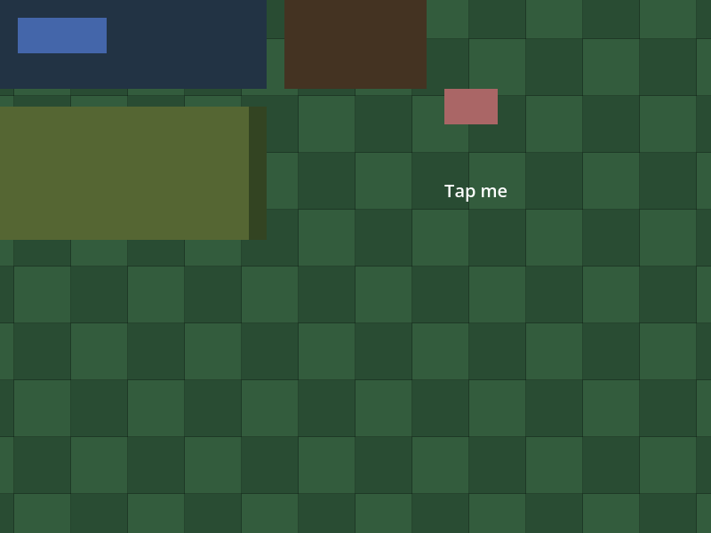
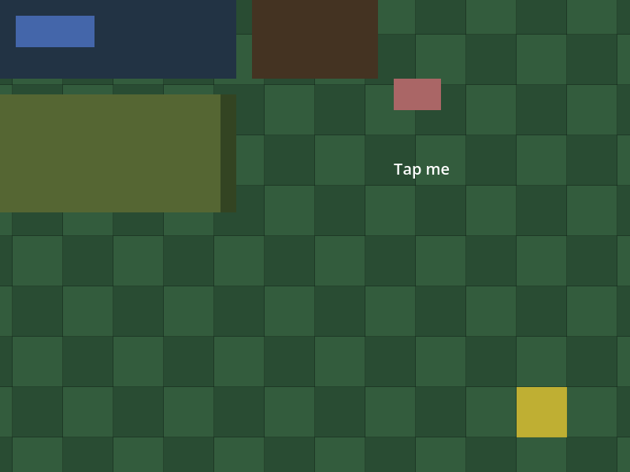
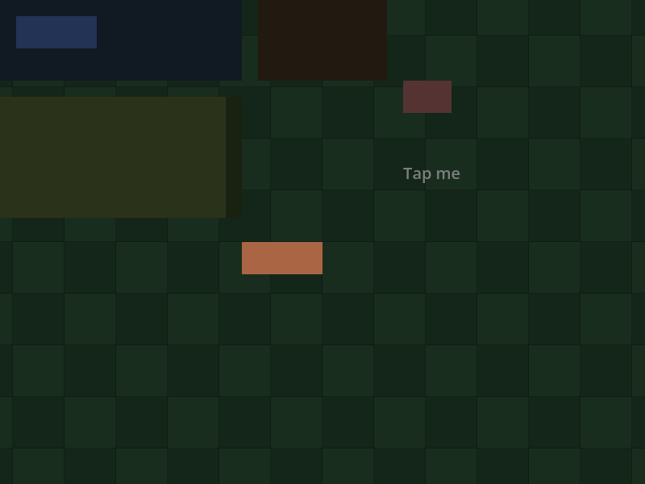
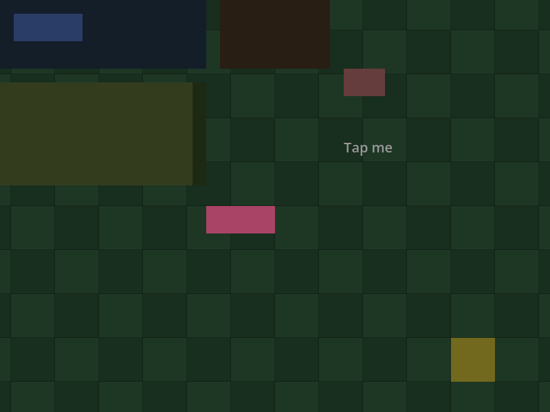

# Um HUD React Native sobre um mundo Godot: quem recebe o ponteiro

Esta fatia é a primeira das três do spike de ponteiro (V05-02, o go/no-go nº 1 do marco 0.5 Frontier). A
pergunta: com um HUD do React Native desenhado sobre um mapa do Godot, na mesma janela, um clique na área
vazia do HUD chega ao mapa exatamente uma vez? Um clique num `Pressable` o aciona uma vez e nunca chega ao
mapa? Com um overlay aberto (uma `View` na árvore React ou um `Modal`), nenhum clique chega ao mapa? A
resposta é a **política mínima (a1)**: a `FabricSurface` passa a ter `MOUSE_FILTER_IGNORE` por padrão,
definido no construtor (`native/fabric_surface.cpp`), no padrão do construtor de `GodotAccessibleView`, e
quem barra o ponteiro são só os Controls das Views que o React Native monta. O
[recibo](execution.json) fixa fontes, hashes, contagens, capturas e resultados; a
[nota de pesquisa](../../research/world-input.md) tem a ordem `_input` → GUI → `_unhandled_input`, as linhas do
Godot 4.7.2 e as lacunas.

Todo link de código abaixo está fixado no commit de implementação
[`0d754f2`](https://github.com/journey-studios/godot-fabric/commit/0d754f20e90829c38aa4a7079cb70737a100fcc1)
(árvore `6d63d265`), em cujo conteúdo cada comando abaixo rodou, sobre o commit do vermelho
[`2fef354`](https://github.com/journey-studios/godot-fabric/commit/2fef3548518e9529b7738ed22500372f737dbd79),
que traz o teste, o fixture, o probe e o oráculo sem a política e foi feito antes dela.

| Lane executada | Checks | Observação |
| --- | ---: | --- |
| Host anterior `79f68b1d` (main `41fbe22`) | 35/66 | Exatamente as 31 falhas normativas: a Surface STOP engole o clique, o toque e o hover da área vazia e os controles positivos dos overlays; os 35 checks que não precisam da política valem nos dois hosts (o Pressable, as barras, os overlays abertos e a roda) |
| Sabotagem `surface-stop`, host atual | 35/66 | Exatamente 31 falhas: o probe devolve `MOUSE_FILTER_STOP` a toda Surface; o oráculo rejeita o relatório com `a: a Surface takes no pointer (IGNORE)` |
| Sabotagem `views-ignore`, host atual | 45/66 | Exatamente 21 falhas: o probe dá `MOUSE_FILTER_IGNORE` a todo Control das Views, e o Pressable, as barras e os painéis deixam o ponteiro passar; o oráculo rejeita o relatório com `a/button/left: what the world heard` |
| Host atual `ab332c33`, headless | 66/66 | Duas topologias (a, N = 100, e b, N = 20), com o oráculo independente |
| Faixa gráfica, host atual, janela do macOS | 18/18 | Renderer nativo `gl_compatibility`, N = 100, quatro capturas |

As lanes executam o mesmo bundle (`a9b5c023`), com as mesmas fontes de teste e SDK; só o produtor nativo
(`native/fabric_surface.cpp`) difere entre os dois hosts. O host anterior foi compilado a partir da main
`41fbe22`, antes da política, e o binário anterior fica em `build/world-input-previous-host/`, local e fora do
repositório. As duas sabotagens são do próprio probe, sem editar C++ nem recompilar: `node
scripts/world-input-sabotage.mjs` as roda, troca o dylib preservado para o controle do host anterior, restaura o
host genuíno byte a byte (SHA-256 igual antes e depois, `ab332c33…`) e termina com uma rodada do host atual, que
escreve o `build/world-input-comparison.json`.

**Ambiente**: macOS arm64 (Apple M3 Pro); Godot oficial 4.7.2 (`ed1daf0bf`), RN 0.87.1, React 19.2.3, Hermes
250829098.0.17 e Node v22.23.3. A suíte roda em modo headless; a faixa gráfica, numa janela real com o renderer
nativo.

Os comandos, na ordem em que rodaram (o controle antes da suíte, depois a faixa gráfica):

```sh
node scripts/world-input-sabotage.mjs
npm run test:world-input
node scripts/world-input-graphics.mjs
```

> **CI hospedada pendente.** O passo `npm run test:world-input` e o artefato `native-world-input` do workflow
> `contracts.yml` ainda não rodaram na CI hospedada. Tudo o que esta página registra é evidência local, em macOS
> arm64. A faixa gráfica não roda na CI.

## Leitura do go/no-go

**Fatia 1 de 3: GO para a política mínima.** Nos dois arranjos medidos, o vazio chega ao mapa uma vez e o
`Pressable` não; com o overlay aberto, o mapa fica fechado no arranjo (a), o único que tem overlay. As contagens
exatas, inclusive sob carga, vêm da suíte headless, nos dois arranjos (com os overlays só em (a)); a janela real
rodou só o arranjo (a). O go/no-go em si é decidido na fatia 3, sobre os números das fatias 1 e 2: a fatia 2 é a variante (a2), para as lacunas
abaixo, depois do merge do PR #58 (as mesmas hunks de `native/application_runtime.cpp`), e a 3 é a decisão. Esta
fatia não fecha o spike: o critério `iphone` do V05-02 segue aberto (pacote P7), porque nada aqui roda num iPhone.

## O que o probe prova

O [probe](https://github.com/journey-studios/godot-fabric/blob/0d754f20e90829c38aa4a7079cb70737a100fcc1/tests/world-input-probe.gd)
instancia a cena (um `Node2D` com um mapa de 24 × 16 tiles de 32 px sob uma `Camera2D` em (384, 256) com zoom 2, e
uma `CanvasLayer` com a `FabricSurface` e uma `FabricApplication`) numa janela de 800 × 600 e entrega eventos reais
pelo `Input.parse_input_event`: cada rajada é N repetições enfileiradas e entregues de uma vez por um
`Input.flush_buffered_events()`, de modo que toda contagem é exata e nenhuma espera frames (só se esperam frames,
até a condição valer, para montar a cena e para abrir ou fechar um overlay). O mundo escuta em `_unhandled_input`; os
handlers do HUD contam num global do
[fixture](https://github.com/journey-studios/godot-fabric/blob/0d754f20e90829c38aa4a7079cb70737a100fcc1/tests/world-input-fixture.jsx),
e não nos contadores de ponteiro do host, porque o RN recebe eventos aimados à root na área vazia. O
[oráculo](https://github.com/journey-studios/godot-fabric/blob/0d754f20e90829c38aa4a7079cb70737a100fcc1/tests/world-input-oracle.mjs)
re-deriva, da geometria do HUD e das regras da política, o que o mundo e os handlers devem ter ouvido em cada
rajada (36 rajadas, 2 hovers e 6 lacunas em (a); 17 rajadas e 4 hovers em (b)) e a conta da câmera, e o teste o
alimenta com um relatório cujos checks foram todos marcados como aprovados.

**(a) uma `FabricSurface` em tela cheia, N = 100** (host atual):

| Rajada | O mundo ouve | Os handlers do HUD ouvem |
| --- | --- | --- |
| área vazia, clique esquerdo | 100 press e 100 release; tile (16, 11) selecionado 100 vezes | 0 |
| área vazia, clique direito | 100 press e 100 release do botão 2; nenhum tile | 0 |
| área vazia, roda | 100 press e 100 release do botão da roda | 0 |
| área vazia, toque | 100 `ScreenTouch` e 100 mouse esquerdo emulado (press e release de cada) | 0 |
| área vazia, outros dois pontos | tiles (15, 7) e (12, 11), um clique cada | 0 |
| `Pressable`, clique | 0 | `onPress` 100, `pointerdown` da barra 100 |
| `Pressable`, toque | 0 mouse emulado e 0 `ScreenTouch` | `onPress` 100 |
| barra com handler | 0 | handler 100 |
| painel simples sem handler (clique e toque) | 0 | 0 |
| `Pressable` do ScrollView | 0 | `onPress` 100 |
| alternando `Pressable` e área vazia | 100 press e 100 release (os cliques no vazio) | `onPress` 100 |

O tile é o da câmera: `floor(((x − 400) / 2 + 384) / 32)` e o mesmo para y, calculado pelo oráculo à parte das
transformações do Godot. `gui_get_hovered_control()` é `null` sobre o mapa e o Control do botão sobre o HUD (no
host anterior, é a própria `FabricSurface` sobre o mapa). `Input.is_emulating_mouse_from_touch()` é verdadeiro.

**Overlays**, em (a), 100 por célula, num ponto da área vazia: **100 de 100 com o overlay fechado, 0 de 100 aberto,
100 de 100 de novo fechado**, e o `Pressable` do próprio overlay pressionado 100 vezes com 0 no mundo. A `View` de
overlay na árvore vale para o clique esquerdo, o direito e o toque; o `Modal`, uma janela hospedeira exclusiva,
para os quatro, a roda incluída.

**(b) duas Surfaces, uma por painel (a metade esquerda e a direita), N = 20:** a área vazia de cada painel dá ao
mundo 20 de 20 para o clique esquerdo, o direito, a roda e o toque, com 0 para o HUD, e o tile de cada painel é o da
câmera ((8, 9) e (15, 9)); o `Pressable` de cada painel é pressionado 20 vezes por clique e por toque com 0 no mundo,
e o handler da barra ouve 20 e o mundo 0; alternar o `Pressable` do painel esquerdo e a área vazia do direito dá 20 e
20; o hover é `null` sobre o mapa e um Control do HUD sobre o botão de cada painel. Duas Surfaces se comportam como
uma.

**O fluxo de toque.** Um toque que chega a um mundo sem handler chega como `InputEventScreenTouch` e como o
`InputEventMouseButton` que o Godot emula dele (device −1, `input_devices/pointing/emulate_mouse_from_touch`, ligado
por padrão): 100 e 100 no vazio, e **nenhum dos dois** no `Pressable` e no painel simples. O mundo desta fatia escuta
o **fluxo do mouse** (inclui o emulado) e conta, mas não age sobre o `ScreenTouch`, de modo que um toque seleciona o
tile uma vez; um jogo que precisa de multitoque escuta `InputEventScreenTouch` e ignora os eventos de mouse com
`device == InputEvent.DEVICE_ID_EMULATION`.

## As 31 falhas normativas do host anterior

O host anterior falha exatamente estes checks, e o teste confere que o conjunto é igual ao que o probe declara
normativo:

- o filtro padrão da Surface é IGNORE, em (a) e em (b) (2);
- a área vazia: clique esquerdo, clique direito e toque em (a) (3), e os três nas duas metades de (b) (6);
- a conta da câmera em (a) e o tile de cada metade de (b) (3);
- a alternância de `Pressable` e vazio em (a) e em (b) (2);
- o hover `null` sobre o mapa em (a) e em cada metade de (b) (3);
- os controles positivos do overlay, que são o mesmo clique com o overlay fechado, antes e depois de abri-lo: a
  `View` na árvore, três entradas, duas fases (6), e o `Modal`, três entradas, duas fases (6).

Nesse host o clique na área vazia chega 0 de 100 ao mundo e o hover é a `FabricSurface`; o `Pressable` ainda é
pressionado 100 vezes com 0 no mundo, as barras e os overlays abertos continuam fechando o mapa, e a **roda no vazio
chega 100 de 100 ao mundo**, porque o GUI do Godot deixa a roda passar por um Control STOP
(`Control.force_pass_scroll_events` é verdadeiro por padrão). Os checks da roda valem nos dois hosts e por isso não
são normativos.

## Sabotagens retidas

- **`surface-stop`**: o probe força `mouse_filter = STOP` em toda Surface. A área vazia cai para 0 de 100 de novo,
  31 checks falham (as mesmas 31 do host anterior) e o oráculo rejeita o relatório pelo filtro da Surface.
- **`views-ignore`**: o probe dá `MOUSE_FILTER_IGNORE` a todo Control das Views, de modo que nenhuma View barra o
  ponteiro. O `Pressable`, as barras e os painéis o deixam passar e o mundo ouve o que o React Native também toma;
  21 checks falham e o oráculo rejeita o relatório na primeira rajada do `Pressable`.

Os três relatórios (o do host anterior e os dois do host atual sabotado) têm o mesmo bundle e os mesmos checks que o
do host atual; o recibo guarda o SHA-256 de cada relatório cru e as listas de checks que falham.

## O que a política mínima deixa aberto

A Surface já não engole o ponteiro, e os únicos bloqueios são os Controls das Views. Onde um controle do RN reage a
um ponteiro que nenhum Control barra, os **dois** ouvem. O probe registra isso em linhas informativas, que nunca
passam nem falham (N = 20, política aplicada):

| Caso | O mundo ouve | O RN ouve |
| --- | --- | --- |
| a folga do `hitSlop` de um `Pressable` | 20 press e 20 release | `onPress` 20 |
| um `Text` com `onPress` (Text é IGNORE) | 20 press e 20 release | `onPress` 20 |
| um vão de ScrollView num wrapper `box-none` (o container é IGNORE) | 20 press e 20 release | `pointerdown` do wrapper 20 |
| a roda sobre uma região do HUD sem ScrollView | 20 press e 20 release | sem handler |
| a roda sobre um ScrollView | só 20 release; **o ScrollView toma o press** | rola |
| a roda sobre um overlay na árvore aberto | 20 press e 20 release | sem handler |

O clique é uma causa só: o teste que decide qual View é dona de um ponto para o RN (`hit_test`, que honra
`pointerEvents` e `hitSlop`) não é a busca do GUI por um Control, e o Control de uma View pode ser menor do que o que
o RN acerta ou não existir. A roda é outra: o GUI a passa por qualquer Control STOP. A variante (a2), um
`_unhandled_input` da Surface que marca o evento tratado quando esse `hit_test` acha uma View, exige um método
público novo em `ApplicationRuntime` e a `CanvasLayer` do HUD depois do mundo: é a fatia 2, depois do PR #58.

## Faixa gráfica

`node scripts/world-input-graphics.mjs` roda a cena (a) numa janela real, com o renderer nativo: `displayServer`
`macOS`, renderer `gl_compatibility`, Apple M3 Pro. O
[probe gráfico](https://github.com/journey-studios/godot-fabric/blob/0d754f20e90829c38aa4a7079cb70737a100fcc1/tests/world-input-graphics-probe.gd)
confirma que o display server não é headless, que o quadro mostra a barra do HUD sobre o mapa (dois pixels lidos),
e repete as contagens da topologia (a) **com N = 100**: 100 cliques no vazio chegam ao mundo uma vez cada, 100 no
`Pressable` o pressionam 100 vezes sem chegar ao mundo, 100 toques no vazio chegam como `ScreenTouch` e como mouse
emulado, 100 toques no `Pressable` o pressionam 100 vezes, o hover é `null` sobre o mapa, e, para o overlay na árvore
e para o `Modal`: abre, 100 cliques não chegam ao mundo nem aos handlers, o `Pressable` dele é pressionado 100 vezes,
e fechado de novo 100 de 100 chegam ao mundo. São **18 checks, todos aprovados**; o recibo da faixa (`build/` local,
resumido em `windowedLane`) guarda o formato, o cenário, o display server, o renderer, o adaptador, o Godot, o
viewport, o N, os checks, os SHA-256 do host e do bundle, as capturas e as limitações. As quatro capturas (800 × 600,
o readback do viewport da root) foram conferidas uma a uma:



**O mapa com o HUD**: a barra com o botão azul, o painel marrom, o painel verde do ScrollView, o botão do `hitSlop` e
o `Text`, antes de qualquer clique.



**O tile selecionado**: depois de 100 cliques esquerdos na área vazia em (700, 550), o mundo selecionou o tile
(16, 11), em amarelo; o HUD não os ouviu.



**O overlay na árvore aberto**: uma `View` cobre todo o HUD e o mapa, com o botão do overlay; 100 cliques não
chegaram ao mundo nem aos handlers do HUD.



**O `Modal` aberto**: escurecido, com o `Pressable` dele; 100 cliques não chegaram ao mundo nem aos handlers do HUD.

O recibo fixa o SHA-256 de cada captura (`execution.json`, `windowedLane.captures`). Como no registro de
`device-services`, o repositório guarda os `.png.import` que o Godot cria ao importar as capturas (um
`Godot --path . --headless --import` os gerou, sem edição manual).

## Regressões

A mudança é global: toda cena com Controls do Godot sob uma Surface passa a receber cliques nas áreas `box-none`.
Por isso rodaram, em sequência, as suítes de ponteiro (processor, geometry, interest, query-faults, documents,
resolver-faults, up, move, documents:up, documents:move, hover, root-path, documents:hover, click e capture), as de
eventos (original, ancestry, dispatch e integrated), PanResponder, shared-touches, touchables, modal (7 testes),
listas, Switch, accessibility, focus commands e services, o `npm run test:examples` inteiro (35 exemplos, todos
"acceptance checks passed" em headless), o `npm run test:consumer` (`CONSUMER_CHECK_PASSED: 30 build/ownership checks;
40 native checks`), o `npm run type-check`, o `npm run check:static`, o `npm run check:publication` e o
`npm run test:contracts` (7 + 43 + 303 testes Node e 13 Python, com o `test:parity` e o `test:dashboard` dentro dele).
Todos passaram, 0 falhas. Essas execuções foram feitas na árvore anterior às duas últimas edições (o N = 100 do probe
gráfico e os docs), que não tocam o que essas suítes executam; o líder reexecutou no commit de implementação o
`test:world-input`, o script de sabotagens (31, 31 e 21), a faixa gráfica (n = 100, 18 checks), o
`test:pointers:click`, o `test:consumer`, o `test:touchables`, o `test:modal`, os 35 do `test:examples`, o
`type-check`, o `check:static` e o `check:publication`, todos verdes.

## Decisões e divergências aceitas

- A política é a mínima (a1), no construtor da `FabricSurface`; uma cena ainda pode sobrescrever o filtro de uma
  Surface que deva tomar o ponteiro (o `surface-stop` faz exatamente isso).
- A roda no vazio e no `Modal` fechado já passa na main: seus checks são comuns, não normativos. A roda sobre o
  overlay na árvore é lacuna informativa (a frase original da decisão 4 foi corrigida: o overlay na árvore é
  normativo só para clique, clique direito e toque; o `Modal`, para os quatro).
- As sabotagens são do probe (flags `--sabotage=<nome>`), sem editar nem recompilar o C++.
- A faixa gráfica roda com N = 100, o mesmo número da topologia (a), porque é a evidência do critério `politica` do
  V05-02 no macOS gráfico; as rajadas entregues por um flush não custam tempo.
- O claim do quadro de agentes usou arquivos explícitos, porque o `claim` recusa globs.

## Limites

- Evidência local em macOS arm64; a CI hospedada está pendente.
- Os eventos são sintéticos, entregues por `Input.parse_input_event`: não há ponteiro de hardware, tela de toque
  real, multitoque (um segundo dedo) nem arrasto.
- Nenhum export móvel do Godot e nenhuma execução num iPhone: o critério `iphone` do V05-02 segue aberto (P7).
- O `hitSlop`, o `Text` com `onPress`, os vãos de ScrollView e a roda sobre o HUD ou sobre um overlay na árvore ainda
  chegam ao mundo além do React Native: estão registrados, não julgados, e ficam para a fatia 2.
- A cena tem o mundo antes da `CanvasLayer` do HUD na árvore e uma `Camera2D` em (384, 256) com zoom 2; outros arranjos
  não foram medidos.
- As contagens são exatas e não dizem nada sobre latência nem sobre tempo de quadro.
- A faixa gráfica roda no renderer Compatibility de um Apple M3 Pro, com eventos sintéticos.
