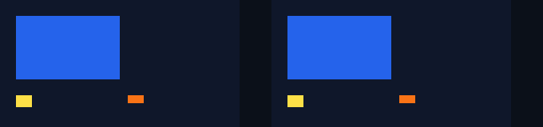
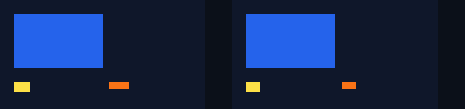
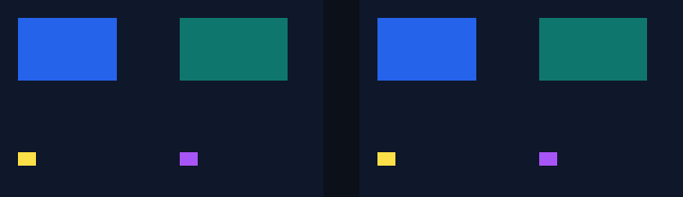
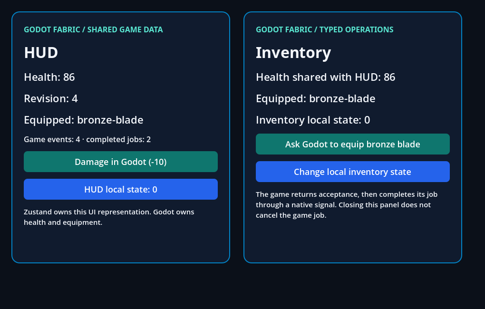

# Runnable examples

These examples share the root Godot project and pinned native runtime. Each
folder has a JSX/TSX application, a Godot scene and instructions. They are runnable
fixtures, not independent npm packages or a published SDK.

## Start

Requirements: macOS arm64, Node 22.13+, Python 3.12+, Xcode Command Line Tools
and official Godot 4.7.2. Follow the [root setup instructions](../README.md#run).

```sh
npm run setup
npm run examples:list
npm run example -- counter
```

The launcher rebuilds JSX/styles, prepares extension startup, imports resources
and opens the selected scene. Edit that example's `App.jsx` or `App.tsx`, close Godot and run
the command again. Rebuild native C++ changes with `npm run setup`.

## Catalog

| Name | Case | UI API | Source and scene |
| --- | --- | --- | --- |
| [shared](shared/README.md) | Two AppRegistry roots, props and independent lifetimes | Public | [App](shared/App.jsx) · [scene](shared/scene.tscn) |
| [counter](counter/README.md) | Minimal React state and public Pressable | Public | [App](counter/App.jsx) · [scene](counter/scene.tscn) |
| [view](view/README.md) | Fabric stacking, rectangular overflow, public geometry and four solid border colors | Public | [App](view/App.jsx) · [scene](view/scene.tscn) |
| [coordinates](coordinates/README.md) | Root/local/screen points, genuine move-out/return and content density | Public | [App](coordinates/App.jsx) · [scene](coordinates/scene.tscn) |
| [transforms](transforms/README.md) | Original RN affine styles, percentage origins, flattening, public measures and transformed input | Public | [App](transforms/App.jsx) · [scene](transforms/scene.tscn) |
| [runtime](runtime/README.md) | Intervals, microtasks, task order and cancellable frames | Public | [App](runtime/App.jsx) · [scene](runtime/scene.tscn) |
| [refs](refs/README.md) | Original RN refs, affine measures and imperative props | Public | [App](refs/App.jsx) · [scene](refs/scene.tscn) |
| [tree](tree/README.md) | Native IDs, original documents, logical traversal, RawText and retained collection snapshots | Public | [App](tree/App.jsx) · [scene](tree/scene.tscn) |
| [focus](focus/README.md) | Original TextInput.State, real LineEdit focus, ref replacement and reentrant retirement | Public | [App](focus/App.jsx) · [scene](focus/scene.tscn) |
| [pointers](pointers/README.md) | Original pointer transport, public View capture and selective multi-root lifetime | Public | [App](pointers/App.jsx) · [scene](pointers/scene.tscn) |
| [pointer-geometry](pointer-geometry/README.md) | Transformed/cross-root capture, logical refs, density and terminal geometry | Public | [App](pointer-geometry/App.jsx) · [scene](pointer-geometry/scene.tscn) |
| [metrics](metrics/README.md) | Original Dimensions, uniform content density and subscription lifetime | Public | [App](metrics/App.jsx) · [scene](metrics/scene.tscn) |
| [services](services/README.md) | Typed GDScript calls/signals, consistent state and shared Zustand data | Public | [App](services/App.jsx) · [scene](services/scene.tscn) |
| [form](form/README.md) | Typed public Button/TextInput with native editing and focus | Public | [App](form/App.tsx) · [scene](form/scene.tscn) |
| [react](react/README.md) | State, keyed reconciliation, effects, Suspense and errors | Internal | [App](react/App.jsx) · [scene](react/scene.tscn) |
| [layout](layout/README.md) | Intrinsic text measurement and responsive layout | Internal | [App](layout/App.jsx) · [scene](layout/scene.tscn) |
| [input](input/README.md) | Controlled native editing, selection and focus | Internal | [App](input/App.jsx) · [scene](input/scene.tscn) |
| [pressable](pressable/README.md) | Upstream Pressability and responder negotiation | Internal | [App](pressable/App.jsx) · [scene](pressable/scene.tscn) |
| [scroll](scroll/README.md) | Scrolling, filtering, selection and editing | Internal | [App](scroll/App.jsx) · [scene](scroll/scene.tscn) |
| [chart](chart/README.md) | Original Chart Kit with the supported SVG subset | Internal | [App](chart/App.jsx) · [scene](chart/scene.tscn) |
| [nativewind](nativewind/README.md) | Utility classes, variables, breakpoints and manual theme | Public | [App](nativewind/App.jsx) · [scene](nativewind/scene.tscn) |
| [typography](typography/README.md) | Nested text, fonts, wrapping and retained child state | Mixed | [App](typography/App.jsx) · [scene](typography/scene.tscn) |
| [animated](animated/README.md) | Original Animated on RN's C++ NativeAnimated advanced by the host's frame clock, and TouchableOpacity | Public | [App](animated/App.jsx) · [scene](animated/scene.tscn) |
| [switch](switch/README.md) | Original RN Switch: controlled values, colors, disabled input and real clicks | Public | [App](switch/App.jsx) · [scene](switch/scene.tscn) |
| [activity-indicator](activity-indicator/README.md) | Original RN ActivityIndicator: sizes, colors, animating and hidesWhenStopped | Public | [App](activity-indicator/App.jsx) · [scene](activity-indicator/scene.tscn) |
| [touchables](touchables/README.md) | Original RN touchables: the opacity, the underlay and the absence of feedback while pressed | Public | [App](touchables/App.jsx) · [scene](touchables/scene.tscn) |
| [virtualized-list](virtualized-list/README.md) | Original RN FlatList and SectionList windowed by the mouse wheel | Public | [App](virtualized-list/App.jsx) · [scene](virtualized-list/scene.tscn) |
| [appearance](appearance/README.md) | Original RN Appearance and useColorScheme: setColorScheme and the system theme | Public | [App](appearance/App.jsx) · [scene](appearance/scene.tscn) |
| [pan-responder](pan-responder/README.md) | Original RN PanResponder dragging a box with the mouse | Public | [App](pan-responder/App.jsx) · [scene](pan-responder/scene.tscn) |
| [networking](networking/README.md) | Original RN fetch, FormData and AbortController over Godot's HTTP client, and WebSocket over Godot's WebSocketPeer, against servers the scene starts | Public | [App](networking/App.jsx) · [scene](networking/scene.tscn) |
| [text-layout](text-layout/README.md) | Text `onTextLayout` lines and the Yoga baseline, drawn over the paragraphs they came from | Public | [App](text-layout/App.jsx) · [scene](text-layout/scene.tscn) |
| [parity](parity/README.md) | Thirteen shared RN/Godot reference cases; automated | Public | [fixture](../tests/parity/fixture.jsx) · [scene](parity/scene.tscn) |

**Public** means the UI uses supported `react-native` imports. Diagnostic
exports may still call local harness helpers. **Internal** uses wrappers in
`src/components.jsx` and cannot be copied unchanged into an ordinary RN app.
**Mixed** combines public UI with internal probes. These labels do not certify
the full RN API. The form exercises the new public single-line `TextInput`;
the older input and scroll probes still use the internal adapter. See the [API limits](../docs/API.md)
and [parity baseline](../docs/compatibility/BASELINE.md).

## Gallery

The [isolated EventTarget validation](event-target/README.md) uses its own
fixture/driver and commands. It compares original versus integrated native
delivery, batching, faults and retirement, with two actual captures. It is
outside the ordinary launcher catalog while public EventTarget flags remain off.

The separate [pointer-interest validation](pointer-interest/README.md) compares
original/current native View `pointerdown` interest using original listener maps.
It has its own fixture and `npm run test:pointers:interest` command, outside the
launcher catalog. Its [receipt](../docs/evidence/pointer-interest/README.md)
records 193/230 headless and 260 current viewport checks; public flags stay off
and that snapshot leaves document-only/other pointer categories open. The later
Document probe below extends root interest with its own receipt.

| Pointerdown interest: initial | After listener-driven React updates |
| --- | --- |
| [](pointer-interest/README.md) | [](pointer-interest/README.md) |

The [query-fault probe](pointer-query-fault/README.md) is another isolated
validation outside the launcher. `npm run test:pointers:query-faults` preserves
same-batch TouchStart/Raw/React delivery after four deliberately failed interest
lookups. The [receipt](../docs/evidence/pointer-query-faults/README.md) records
174/186 on the previous host, 186/186 corrected headless and 204/204 viewport
with visible diagnostics and explicit getter/reentrancy limits.

| Before query faults | TouchStart updates React after lookup failure |
| --- | --- |
| [](pointer-query-fault/README.md) | [](pointer-query-fault/README.md) |

The [Document/root probe](pointer-document/README.md) is also outside the
launcher catalog. `npm run test:pointers:documents` exercises eight independent
original/current flag configurations. Original Document and documentElement
Maps qualify native input through their current root family, with separate
manual, Raw, React, membership, retirement and fault observations.

| Before Document input | After one Document gesture |
| --- | --- |
| [](pointer-document/README.md) | [](pointer-document/README.md) |

These are actual 760×220 Godot readbacks with 20 pixel assertions. The
[receipt](../docs/evidence/pointer-documents/README.md) distinguishes the captured
A=0/B=0 → A=2/B=0 gesture from later controls and remaining event gaps.

The [ref-getter probe](pointer-resolver-fault/README.md) isolates a throwing
`canonical.publicInstance` read before the SDK query. It reuses the two-surface
scene and actual original refs; `npm run test:pointers:resolver-faults` is outside
the launcher catalog. Its [receipt](../docs/evidence/pointer-resolver-faults/README.md)
records 62/65 on the preceding native host with three normative failures,
65/65 corrected headless and 85/85 viewport checks. Actual 680×160 captures
show A=0/B=0 → A=2/B=0 before B's later gesture and A's Cancel. Only the
self-restoring `publicInstance` getter was faulted; wider resolver and mobile
acceptance remain open and public flags stay off.

The [pointerup probe](pointer-up/README.md) uses ordinary original View ref
listeners in its isolated opt-in configuration. `npm run test:pointers:up`
is outside the launcher catalog. It verifies bubble/capture-only qualification,
one trusted Up/Raw/React commit, original TouchEnd, B's false interest while A
is held, Cancel and balanced stop. Its
[receipt](../docs/evidence/pointer-up/README.md) records 62/62 headless, 90/90
viewport checks and eight visible old-host failures with the same current SDK
bundle. Document Up, other flags and full event/lifecycle acceptance remain
open; the regression and SDK checks passed, and hosted run 37241023275 repeated
the 62 headless checks ([receipt](../docs/evidence/pointer-up/hosted-ci.json)).

| Before native Up input | After the first bubble case |
| --- | --- |
| [](pointer-up/README.md) | [](pointer-up/README.md) |

Both actual 680×160 frames have 12 fixed pixel assertions and matching React
counters, with saved PNG pixels decoded independently. The updated stage is
starts A1/B1 and ups A1/B0, before later capture-only and Cancel controls.

The [pointermove probe](pointer-move/README.md) extends the same native interest
to original View `pointermove` listeners. `npm run test:pointers:move` is outside
the launcher catalog. Real drag samples qualify listeners on the target (bubble
`1=true`, capture-only `1=false`/`25=true`, phase 2) and on its parent (phase 3
or 1 after the target's empty pair); button-less mouse motion qualifies too. Each
move is one trusted callback with its typed/star Raw and one React commit, at the
Default priority the pinned mapping gives RN's unique Continuous moves. B without
listeners reads its whole path false, in order, and emits no pointer move. Its
[receipt](../docs/evidence/pointer-move/README.md) records 219/219 headless,
243/243 viewport checks and 45 visible old-host failures with the same SDK bundle;
failing Move lookups are retained once per distinct cause and repeats are counted.
Hover events and capture remain open. Hosted run 37345287351 repeated the 219
headless checks ([receipt](../docs/evidence/pointer-move/hosted-ci.json)).

| Before any move | After the bubble case |
| --- | --- |
| [](pointer-move/README.md) | [](pointer-move/README.md) |

Both 680×160 frames have ten fixed pixel assertions and matching React counters
(moves A0/B0, then A2/B0), with saved PNG pixels decoded independently.

The [Document pointermove matrix](pointer-document-move/README.md) registers
original `pointermove` listeners on Document and documentElement over a target
with no pointer listener, in eight lanes (original/current interest × four flag
configurations): 1,932 headless checks, plus 330 in the current/enabled viewport.
Only current interest with native dispatch delivers; documentElement also needs
the imperative flag. Capture listeners run at phase 1 and bubble at phase 3, the
root query reads `1=true` or `1=false`/`25=true` after the target's and ancestors'
false pairs, and button-less mouse motion qualifies too. Its
[receipt](../docs/evidence/pointer-document-move/README.md) includes a retained
control that drops the owner Document from the root query. Hosted run 37351245158
repeated the 1,932 headless checks
([receipt](../docs/evidence/pointer-document-move/hosted-ci.json)).

| Before Document Move | After two samples reach DocC and DocB |
| --- | --- |
| [](pointer-document-move/README.md) | [](pointer-document-move/README.md) |

The [hover probe](pointer-hover/README.md) registers original `pointerover`,
`pointerout`, `pointerenter` and `pointerleave` listeners on a View or its parent,
bubble or capture, and drives a button-less mouse in and out, then a touch:
`npm run test:pointers:hover`, outside the launcher catalog. Callbacks follow RN's
order, phases and Discrete priority, enter/leave keep their non-bubbling rule, a
touch enters its path in the Down and leaves it after the Up, and the full lookup
sequence is checked. Its [receipt](../docs/evidence/pointer-hover/README.md)
records 158/158 headless checks and 32 visible old-host failures with the same SDK
bundle.

The [root-path probe](pointer-root-path/README.md) moves a mouse and a touch between
a target, the surface's empty area and a point outside every surface:
`npm run test:pointers:root-path`, outside the launcher catalog. The empty area
resolves to the root, which stays in the hover path but never receives an event,
so a Document capture `pointerenter`/`pointerleave` listener sees descendants
enter and leave only with the root. Its
[receipt](../docs/evidence/pointer-root-path/README.md) records 82/82 headless
checks, 9 visible failures on the preceding host and that host's crash in the
Document case.

The [Document hover matrix](pointer-document-hover/README.md) registers original
`pointerover/out/enter/leave` listeners on Document and documentElement over a
leaf with no listener, in eight lanes (original/current interest × four flag
configurations): `npm run test:pointers:documents:hover`, outside the launcher
catalog. Only current interest with native dispatch delivers; over/out reach the
listeners at phases 1 and 3, and enter/leave reach only capture listeners, when
the pointer enters or leaves the surface. Its
[receipt](../docs/evidence/pointer-document-hover/README.md) records 1,530
headless checks and a retained negative control.

The [click matrix](pointer-click/README.md) presses and releases mouse buttons
and touches over a group, a sibling, a top-level view, a `Pressable` and a
`ScrollView` in eight lanes: `npm run test:pointers:click`, outside the launcher
catalog. A primary release clicks the deepest view both hit paths share, and a
scroll drag cancels its contact. Its
[receipt](../docs/evidence/pointer-click/README.md) records 728 headless checks,
the preceding-host control and two retained negative controls.

The [PanResponder matrix](pan-responder/README.md) drives RN's original
`PanResponder` with touches and mouse drags over a free pan view, claiming and
refusing parents, a capture parent and a view removed mid-gesture, in four flag
lanes: `npm run test:responders:pan`, next to the launcher entry
(`npm run example -- pan-responder` drags a box with the mouse). Its
[receipt](../docs/evidence/pan-responder/README.md) records 128 headless checks,
the preceding-SDK control, a retained sabotage and three captures of the example.

The [AppState probe](app-state/README.md) delivers Godot's focus, pause and
memory-warning notifications to an application whose two roots subscribe to the
public `AppState`: `npm run test:app-state`, outside the launcher catalog. Focus
loss is `inactive`, a pause is `background`, and stop sends no event. Its
[receipt](../docs/evidence/app-state/README.md) records 75 headless checks, the
preceding-host control and a retained negative control.

The [Switch probe](switch/README.md) mounts RN's original `Switch.js` in two roots
and toggles it with actual mouse clicks and touch taps: `npm run test:switch`,
next to the launcher entry (`npm run example -- switch`). A value prop that does
not follow is restored by Switch.js's `setValue`, disabled input is ignored and
colors reach the native switch. Its [receipt](../docs/evidence/switch/README.md)
records 108/108 headless checks, the preceding host's 2 mount failures, a retained
sabotage and two captures of the example.

The [text layout example](text-layout/README.md) draws the lines that Text's
`onTextLayout` reports as boxes and baseline rules over the paragraphs, and
aligns a row by `alignItems: 'baseline'`: `npm run test:text-layout`, next to the
launcher entry (`npm run example -- text-layout`; add `--headless` or `--capture`).
Every number is checked against the bundled fonts' tables read in Node, and a
click re-wraps the paragraphs. Its [research](../docs/research/text-layout.md)
records 76 headless checks, the preceding host's 5 failures and three retained
sabotages, with the [evidence record](../docs/evidence/text-layout/README.md) and two captures.

The [shared touches matrix](shared-touches/README.md) presses the original
`Pressable`s of two roots with overlapping touches and the mouse in four flag
lanes: `npm run test:responders:shared-touches`, outside the launcher catalog.
Each TouchEvent lists every touch of the application. Its
[receipt](../docs/evidence/shared-touches/README.md) records 92 headless checks
and the preceding-host control.

The [touchables probe](touchables/README.md) presses RN's original
`TouchableWithoutFeedback` and `TouchableHighlight`, imported from `react-native`,
with real mouse and touch on two roots: `npm run test:touchables`, next to the
launcher entry (`npm run example -- touchables` holds the mouse on all three
touchables, `TouchableOpacity` included). It checks callback order and payloads,
the native underlay and child opacity, `delayPressOut`, long press, hitSlop and
retention, disabled, nesting, removal mid-press and the single-child rule. Its
[receipt](../docs/evidence/touchables/README.md) records 93/93 headless checks,
the preceding-SDK and sabotage controls, five captures of the example and why
`TouchableOpacity` was unavailable then; the [Animated example](animated/README.md)
makes it public.

The [ActivityIndicator probe](activity-indicator/README.md) mounts RN's original
`ActivityIndicator.js` in two roots and measures each spinner across actual
SceneTree frames: `npm run test:activity-indicator`, next to the launcher entry
(`npm run example -- activity-indicator`). The phase advances once per frame
while animating and freezes when stopped; `hidesWhenStopped`, color and the
small/large/numeric frames reach the native spinner. Its
[receipt](../docs/evidence/activity-indicator/README.md) records 33/33 headless
checks, the preceding host's 2 mount failures, a retained sabotage and two
captures of the example.

The [capture notification matrix](pointer-capture-notifications/README.md)
captures mouse and touch contacts over two roots and observes got/lost on JSX
props and on original View, documentElement and Document listeners, with hover
and click while captured, in eight lanes: `npm run test:pointers:capture`,
outside the launcher catalog. Its
[receipt](../docs/evidence/pointer-capture-notifications/README.md) records 672
headless checks and two retained sabotages.

The [virtualized-list probe](virtualized-list/README.md) scrolls RN's original
`FlatList`, `SectionList` and `VirtualizedList` with wheel steps and touch drags
in two roots: `npm run test:lists`, next to the launcher entry
(`npm run example -- virtualized-list` turns the mouse wheel over a `FlatList` and
a `SectionList`). Cells outside the window unmount and return, and an inverted
list follows the finger. Its [receipt](../docs/evidence/virtualized-list/README.md)
records 44 headless checks, the preceding-host and preceding-SDK controls, a
retained negative control and two captures of the example.

The [Appearance probe](appearance/README.md) changes the system theme through the
one Callable registered with Godot's `DisplayServer` and overrides it with
`setColorScheme`, while two roots render through `useColorScheme` and two
applications observe at once: `npm run test:appearance`, next to the launcher
entry (`npm run example -- appearance` switches a screen between light and dark).
Its [receipt](../docs/evidence/appearance/README.md) records 79 headless checks,
the preceding-host and pre-fix controls, a retained negative control and three
captures of the example.

The [Animated probe](animated/README.md) drives RN's original `Animated` with both
drivers and `TouchableOpacity` with real mouse and touch in two roots of one
application, and compares the Controls with an independent oracle that replays RN's
frame, spring and decay drivers: `npm run test:animated`, next to the launcher
entry. Its [receipt](../docs/evidence/native-animated/README.md) records 75 headless
checks, four captures, the preceding-host control and two retained sabotages.

The [uniform scale proof](transforms/README.md#uniform-scale) mounts RN's uniform
`transform: [{ scale }]` in five Hermes applications (static scales, an `Animated.View`
on the native driver and a `Pressable` pressed with the real mouse where only its scale
reaches) and compares every Control with a planar matrix derived from the JSX by an
independent oracle: `npm run test:transforms:guards`, next to the transform gallery.
Its [receipt](../docs/evidence/uniform-scale/README.md) records 29 headless checks, 35
with the renderer capture, and the preceding-host control, which fails exactly 22.

The [singular transforms proof](transforms/README.md#singular-transforms) mounts RN's
singular `transform` styles (`scale: 0`, `scaleX: 0`, a rank-one matrix, a matrix that
only loses rank in a float, an `Animated.View` scaled 0 to 1 and 1 to 0 on the native
driver, a scale moved through 0 by React state and a pointer captured by a View that
collapses) in eight Hermes applications. A real mouse press where the collapsed box was
reaches the plate behind it, and every Control, RN measurement and event is compared
with values derived from the JSX by an independent oracle:
`npm run test:transforms:guards`, next to the transform gallery. Its
[receipt](../docs/evidence/singular-transforms/README.md) records 49 headless checks, 58
with the renderer capture, the preceding-host control, which fails exactly 37, and a
retained sabotage of the pointer projection, which fails exactly 2.

The [networking probe](networking/README.md) runs RN's original `fetch`, `XMLHttpRequest`,
`FormData`, `Blob`, `FileReader` and `AbortController` in two roots of one application
against a deterministic Node server over HTTP and HTTPS, and an independent oracle compares
the 137 requests the server recorded with what JS observed: `npm run test:networking`, next
to the launcher entry (`npm run example -- networking` clicks six buttons against a loopback
server the scene starts). Its [receipt](../docs/evidence/networking/README.md) records 100
headless checks, six captures, the preceding-host control, which fails exactly 84, and two
retained sabotages, which fail 8 and 2.

The [WebSocket probe](../docs/evidence/websocket/README.md) runs RN's original `WebSocket` in two
roots of one application against a deterministic RFC 6455 server over ws and wss, and an
independent oracle compares the server's frame log with what JS observed: `npm run
test:websocket`, next to the second card of the same launcher entry (`npm run example --
networking` clicks Connect, Send, Binary, Server close, Drop and Close against an echo server the
scene starts). Its receipt records 93 headless checks, the preceding-host control, which fails
exactly 81, and two retained sabotages, which fail 4 and 2. The example now has two cards, so
its captures, 11 in all, were taken again and live with that record.

| Public TSX form | Public counter | NativeWind |
| --- | --- | --- |
| [](form/README.md) | [](counter/README.md) | [](nativewind/README.md) |

Every interactive example's README has its own renderer capture.


The [focus example](focus/README.md) compares the original input singleton with
the actual Viewport owner and LineEdit signals. It exercises two roots,
editability, retained refs, reparenting and reentrant retirement. Hardware
keyboard/IME and mobile differentials remain separate acceptance requirements.


The [View example](view/README.md) compares injected input targets, public/native
geometry and actual renderer RGBA samples, including keyed reorder and border
removal. Its [checkpoint](../docs/evidence/view/README.md) preserves the previous
host's expected failures and the offset-root input/measurement gap discovered
in that checkpoint. The later [coordinate example](coordinates/README.md)
addresses it through genuine movement gestures and independent public measures.


Its [evidence](../docs/evidence/coordinates/README.md) records root/target/screen
coordinates, surface movement and scaling, raw window pixels at density two,
and the first contact before cached metrics refresh.


The [transform gallery](transforms/README.md) compares independent analytical
matrices/corners with actual Controls, original public measurements, mouse/touch
events and renderer pixels. Resize and removal preserve refs and React state
while an anonymous wrapper materializes and flattens again. Its
[evidence](../docs/evidence/transforms/README.md) keeps the previous host's
expected failures, explicit unsupported-transform cases and invalid-embedding
input cancellation separate.


The [read-only tree example](tree/README.md) uses original RN documents and
collections to check IDs, root isolation, keyed reorder/replacement, text updates
and retirement. It records pinned collection snapshots and RawText quirks;
its [evidence](../docs/evidence/tree/README.md) includes the same fixture failing
against the previous JS configuration with the unchanged native host.


The [shared application](shared/README.md) adds explicit native application and
surface properties. Its controls use public RN imports; final resource/SDK
authoring and multi-root mobile reference certification remain open.



The [services example](services/README.md) adds GDScript methods/signals, a
consistent initial snapshot, shared Zustand state, pause and accepted-job
lifetime. Its images and positive/negative assertions have a separate
[evidence record](../docs/evidence/game-services/README.md).

## Validation and images

```sh
npm run example -- layout --check       # bounded native check; exits
npm run example -- layout --headless    # bounded contracts; no GPU rendering
npm run example -- layout --capture     # native check plus renderer readbacks
npm run test:examples                   # every interactive case, headless
npm run test:examples -- --capture       # same suite, renderer + screenshots
npm run example -- parity --headless    # automated differential-oracle fixture
```

The default example is the public counter; the default mode is interactive.
`--check`, `--headless` and `--capture` run
acceptance assertions and close Godot. Capture requires a graphical renderer
and cannot be combined with `--headless`. Individual runs write `build/report.json`;
the full suite preserves one report per case in `build/examples/headless/` or
`build/examples/native/`.
Native checks must run sequentially because they share generated output.
Images are Godot Viewport readbacks, not desktop screenshots. Retained results
are in [validation evidence](../docs/evidence/README.md).

The parity case always runs automatically; it has no manual gallery mode or
capture flag. Its reference runners launch original RN on iOS/Android. They
do not establish Godot support on either OS. The separate
[iOS consumer experiment](../docs/IOS_BUILD.md) records its narrower export and
runtime proof; the interactive catalog remains a macOS arm64 laboratory.

## Organization

[catalog.json](catalog.json) supplies the launcher and native scene runner.
[entry.jsx](entry.jsx) is the shared Fabric bootstrap and diagnostic bridge;
`src/` contains the renderer/platform implementation. Native acceptance helpers
remain in `scripts/`. Parity's identical fixture stays in `tests/parity/` so
the Godot, iOS and Android oracles use the same source.

The root `main.tscn`, `layout.tscn` and other original scene paths delegate to
these scenes for compatibility. Godot's main scene remains the React lifecycle
demo. Each example scene also opens directly in the root Godot editor after setup.

## Public pointer capture


The [pointer laboratory](pointers/README.md) tests pending queries, next-event
got/lost, shared-root contact IDs, selective cancellation, removal and app
retirement. It passes 132/146 headless/native checks with 12 pixels; the isolated
exception/real-focus stop fixture passes 43. See [curated evidence](../docs/evidence/pointers/README.md)
for 144 native assertions, two unchanged-source crash controls and remaining
hardware/mobile boundaries.


The [geometry example](pointer-geometry/README.md) adds rotation/skew/reflection,
shared embedded roots, flattened capture refs, immediate density changes,
singular cancel and connected hidden capture. Its separate
[evidence](../docs/evidence/pointer-geometry/README.md) records 631/648 checks,
14 pixels, three captures and 55 expected failures on the previous host.

The [Document pointerup matrix](pointer-document-up/README.md) runs eight
original/current SDK and flag lanes: 1,371 headless checks and 243 native viewport
checks with 20 pixels. Ordinary original Document/element listeners qualify Up
without a leaf JSX pointer helper. Event identity, root ownership, capture-only,
negative A while B held, final removal, Cancel and stop have executed checks.
[The receipt](../docs/evidence/pointer-document-up/README.md) distinguishes the
captured Document-only stage from later cases and from the hosted run that repeated
its 1,371 headless checks ([receipt](../docs/evidence/pointer-document-up/hosted-ci.json)).

| Native initial frame | Document Up commits A2/B0 |
| --- | --- |
| [](pointer-document-up/README.md) | [](pointer-document-up/README.md) |
