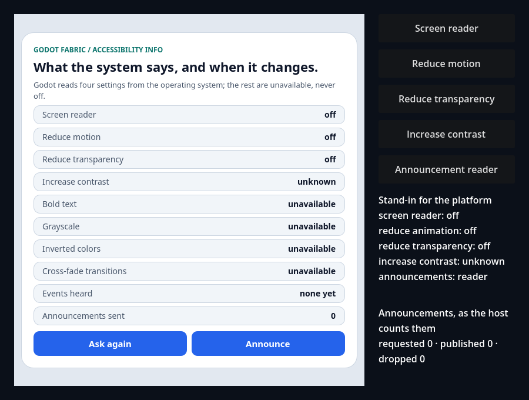
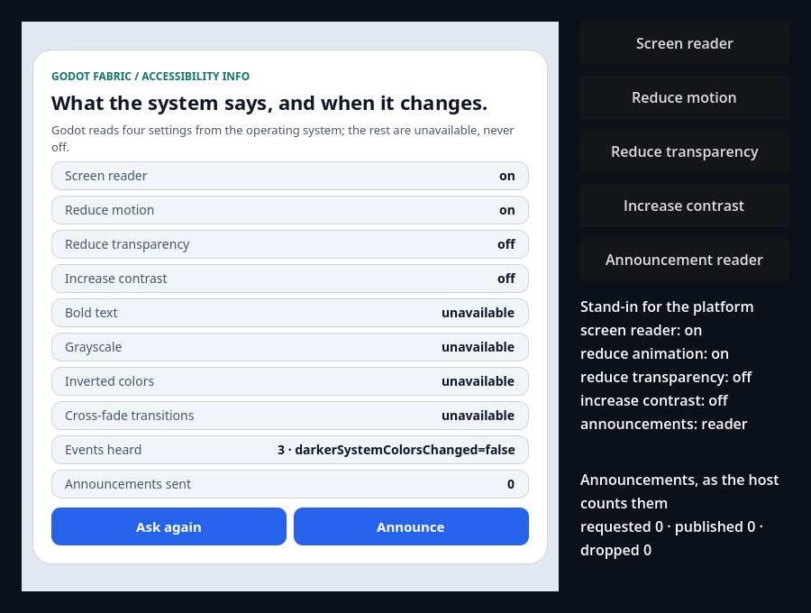
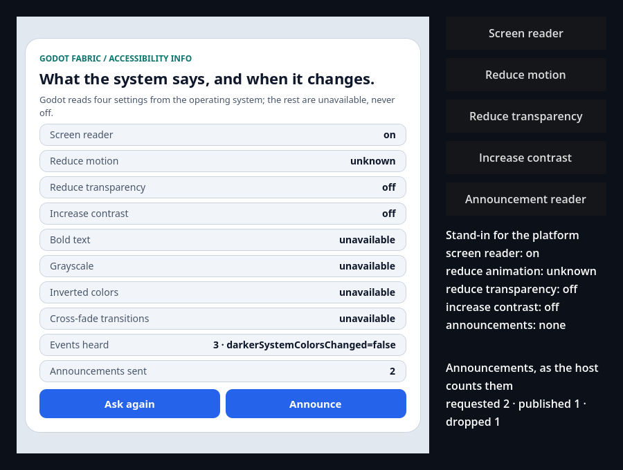

# AccessibilityInfo over Godot's accessibility settings, and announcements

```sh
npm run example -- accessibility-info
npm run example -- accessibility-info --headless
npm run example -- accessibility-info --capture
npm run test:accessibility-info
npm run test:accessibility-info:bridge
```

React Native's original `AccessibilityInfo` comes from the public `react-native` import, over a C++
TurboModule the host installs (`AccessibilityManager`, with the iOS contract that `AccessibilityInfo.js`
takes when `Platform.OS` is `"godot"`). The launcher entry is the interactive demo: a screen that asks
each of RN's getters, listens to each of its events and shows the answer, with an **Ask again** button
a line that counts the events it heard, and an **Announce** button with the count of announcements it sent. Godot reads four settings from the operating system (the
screen reader, reduce motion, reduce transparency and increase contrast, which RN calls "darker system
colors"); `isBoldTextEnabled`, `isGrayscaleEnabled`, `isInvertColorsEnabled` and
`prefersCrossFadeTransitions` have nothing to read and show `unavailable`, never `off`. A setting the
platform does not report (the headless engine, a mobile build) shows `unknown`.

Started without `--headless`, the screen follows the real settings of the machine: turn VoiceOver, Reduce
Motion, Reduce Transparency or Increase Contrast on in System Settings and, within a frame, its row
changes and the events line counts the change. The four native buttons on the right stand in for the
operating system, so the screen can be driven without touching System Settings: each press cycles a
setting through *system* (the real reading), *unknown*, *off* and *on* by changing the application's
`validation_accessibility_settings` meta, which replaces only the keys it names. The fifth, **Announcement
reader**, stands in for the screen reader the announcements are announced to: it cycles the application's
`validation_accessibility_announcer` meta through *reader* (a recorder that behaves as a screen reader),
*none* (a recorder with no screen reader) and *system* (no meta: Godot's real `AccessibilityServer`, which
announces through AccessKit when a screen reader such as VoiceOver is on and drops the announcement when none
is).

**Announce** calls `AccessibilityInfo.announceForAccessibility("Announcement N")`. The screen counts what it
sent (**Announcements sent**), and the native line under the stand-in counts what the host did with it:
`requested`, `published` (a new live element that AccessKit announces to the screen reader) and `dropped` (no screen
reader to announce it to). With VoiceOver on and the stand-in on *system*, pressing it is expected to make VoiceOver say
the text; that speech has **not** been verified. What the graphical test observes is the notification AccessKit posts to
AppKit (the text and the priority level), not VoiceOver's output, so a claim here is limited to what that post proves.

`npm run test:accessibility-info` is the [evidence](../../docs/evidence/accessibility-info/README.md) suite (the announcements have a
[record](../../docs/evidence/accessibility-announcements/README.md) of their own),
outside the catalog: a headless probe in two applications, one with the validation metas (the settings and a
recorder for the announcements) and two roots and one with the real backend, replayed by an independent oracle.
The preceding host, with the same bundle, fails exactly the checks of the announcements, and eight retained host
sabotages are rejected. `npm run test:accessibility-info:bridge` is the local graphical lane: it proves what
AccessKit posts to AppKit for each announcement (see below).

## Use the example



**Initial** is the screen the validation starts from: the screen reader, reduce motion and reduce transparency
report off, increase contrast reports nothing (`unknown`), bold text, grayscale, inverted colors and cross-fade
are `unavailable`, and **Events heard** says `none yet`. **Announcements sent** is 0 and the native line says
`requested 0 · published 0 · dropped 0`. The native label on the right is what the stand-in platform reports.



**Changed** is the screen after the native buttons turned the screen reader and reduce motion on and made increase
contrast known (off): the rows change with the events, and **Events heard** reads
`3 · darkerSystemColorsChanged=false` (the three events, in order, are `screenReaderChanged=true`,
`reduceMotionChanged=true` and `darkerSystemColorsChanged=false`). Reduce transparency did not change and has no
event.



**Announced** is the screen after **Announce** was pressed twice, the second time with the stand-in's *Announcement
reader* turned to *none*: **Announcements sent** says 2, and the native line says
`requested 2 · published 1 · dropped 1`. The first announcement was published (a new live element, polite, with the
text as its value) and the second was dropped because no screen reader was there to announce it to; a screen reader that
turns on afterwards hears neither.

- **Announce** sends an announcement. With a screen reader behind the stand-in (*reader*, or *system* on a Mac with
  VoiceOver running) it is published and the line counts it; with none (*none*, or *system* without VoiceOver) it is
  dropped and counted, and never kept to be announced later.
- **Announcement reader** (native) cycles *reader*, *none* and *system*: try pressing **Announce** after each.
- **Ask again** calls every getter again; the answer is the last reading the host took, so a setting that
  changed shows as soon as the next frame has been polled.
- **Screen reader**, **Reduce motion**, **Reduce transparency** and **Increase contrast** (native buttons)
  change what the stand-in platform reports. A change to a known value is one event, heard once by every
  listener of every root; the row changes with it and the **Events heard** line counts it. Setting a
  value the platform already reports, or making a setting *unknown*, emits nothing; **Ask again** then says
  `unknown`.
- Try this: press **Screen reader** four times from the start. The stand-in line moves through *unknown*,
  *off*, *on* and back to *system*; a press adds an event only when the value it reports is a known one
  that differs from the value the screen last knew, so *unknown* adds none and, if the machine's
  screen reader is off, neither does *off*. A press that does add one shows it in **Events heard** and in
  the row.

With `--capture` the renderer's frames are saved to `build/accessibility-info-initial.png`,
`build/accessibility-info-changed.png` and `build/accessibility-info-announced.png`; the three above are those frames,
checked one by one.

## What the validation establishes

[validation.gd](validation.gd) names all four keys of the stand-in (so a run reads the same on a machine
whose own settings are on and on the headless engine), presses the native buttons, clicks React's **Ask
again** with real mouse input and reads each state from the native tree, from the application's
AccessibilityInfo counters and from what React observed. It waits for the polls the host counts, never for
time. The first render shows three settings off, increase contrast unknown and the four unavailable ones,
with no event heard and the module holding its baseline. Turning on the screen reader and reduce motion
and making increase contrast known are three events, once each and in order, and the rows change with
them; the host counts one event for each change, none for reduce transparency and none for the events Godot
can never send. **Ask again** answers the same values with no new event, a setting that becomes unknown
emits nothing and asking again says `unknown`, and stopping the application releases the root and the
module without a host error. Pressing **Announce** with the mouse sends one announcement that the host publishes
(the recorder's calls are a new element, its text as the value, polite, made in an update and freed outside the next
one), and after the stand-in has no screen reader the next one is counted and dropped (sent 2, published 1, dropped 1).
The headless run passes 12 checks and the capture run 15.

## Evidence suite

```sh
npm run test:accessibility-info
```

With the preceding native host installed in `addons/` (the suite insists that it is the host preserved in
`build/accessibility-announcements-previous-host`), the runner checks the control, which fails exactly the checks of the
announcements and the focus reason:

```sh
node tests/accessibility-info-native.test.mjs --allow-original-negative
```

The graphical lane runs on a Mac with a window session (it opens a window for a few seconds, needs no permission
and is not part of hosted CI):

```sh
npm run test:accessibility-info:bridge
node tests/accessibility-announcements-bridge.test.mjs --allow-original-negative
node tests/accessibility-announcements-bridge.test.mjs --sabotage=announce-name
```

An inspector injected into the process (`DYLD_INSERT_LIBRARIES`) interposes the call AccessKit makes to AppKit for an
announcement and the test judges what the host made AccessKit post: the text, the priority level (50 for polite, 90 for
high) and one post for each announcement, the same text twice as two posts, nothing for an empty text or a refused one. It
does not prove that VoiceOver spoke. The control (preceding host) and the sabotage hosts (`announce-name`,
`swapped-priorities`, `reused-element`, built by `node scripts/accessibility-info-sabotage.mjs`) fail it.

## Original syntax

```jsx
import {useEffect, useState} from 'react';
import {AccessibilityInfo, Text} from 'react-native';

function ReduceMotionNotice() {
  const [reduced, setReduced] = useState(null);
  useEffect(() => {
    AccessibilityInfo.isReduceMotionEnabled().then(setReduced, () => setReduced(null));
    const subscription = AccessibilityInfo.addEventListener('reduceMotionChanged', setReduced);
    return () => subscription.remove();
  }, []);
  return <Text>{reduced === null ? 'unknown' : reduced ? 'reduced' : 'full motion'}</Text>;
}
```

| Setting | RN API | Godot's `DisplayServer` method |
| --- | --- | --- |
| Screen reader | `isScreenReaderEnabled`; `screenReaderChanged` and `change` | `accessibility_screen_reader_active` |
| Reduce motion | `isReduceMotionEnabled`; `reduceMotionChanged` | `accessibility_should_reduce_animation` |
| Reduce transparency | `isReduceTransparencyEnabled`; `reduceTransparencyChanged` | `accessibility_should_reduce_transparency` |
| Increase contrast | `isDarkerSystemColorsEnabled`; `darkerSystemColorsChanged` | `accessibility_should_increase_contrast` |
| Bold text, grayscale, inverted colors, cross-fade | the four getters; `boldTextChanged`, `grayscaleChanged`, `invertColorsChanged` | none: the getters reject `E_ACCESSIBILITY_UNAVAILABLE`, the events never fire |

A getter resolves `true` or `false`, or rejects with `E_ACCESSIBILITY_UNKNOWN` when Godot reports `-1`. A
change event is sent only when a known value differs from the last known one, and a stopped application
sends none.

| Announcement | What the host does |
| --- | --- |
| `announceForAccessibility(text)` | A new static text element with the text as its value and a polite live mode, which AccessKit posts to AppKit as an announcement (the expected result is VoiceOver saying the text; the audible speech was not verified); returns and counts a drop when no screen reader is there |
| `announceForAccessibilityWithOptions(text, {priority: 'high'})` | The same, assertive |
| `{priority: 'default'}`, absent, null, or a string iOS ignores | The same as the plain call |
| `{queue: true}` | Throws `E_UNSUPPORTED`: the macOS accessibility API has no announcement queue |
| `{priority: 'low'}` | Throws `E_UNSUPPORTED`: AccessKit has only polite and assertive |
| `setAccessibilityFocus(tag)` | Throws `E_UNSUPPORTED`: Godot has a single focus, so moving the screen reader's would blur the focused control, which iOS does not do |
| `announcementFinished` | Never fires: no end-of-speech signal exists in macOS, AccessKit or Godot |

## Limits

The headless engine and Godot's mobile servers report that they do not know any of the four settings, so
every getter rejects there; the evidence supplies values through the validation meta. Real operating-system
settings are read by Godot on macOS and are not certified by the suite, and the screen reader is VoiceOver
alone. A change is seen at the next frame. That VoiceOver spoke an announcement is not proven (the graphical lane
proves what AccessKit posts), and the announcements of one frame are published one per update, a frame apart, so that they keep
the order they were asked for. Queueing,
low priority, programmatic focus, text scale, the announcement of a View's live region and the mobile bridges are
open. See the [research](../../docs/research/accessibility-info.md) and the
[announcements note](../../docs/research/accessibility-announcements.md).
