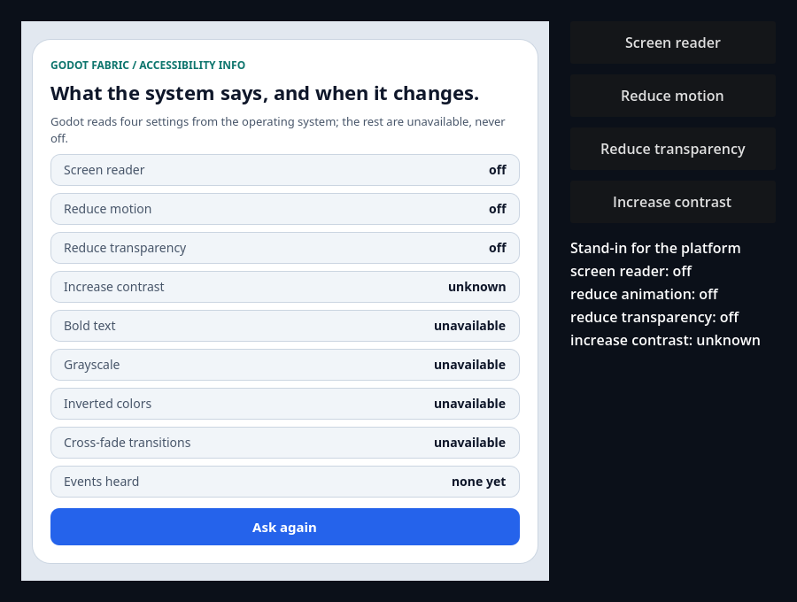
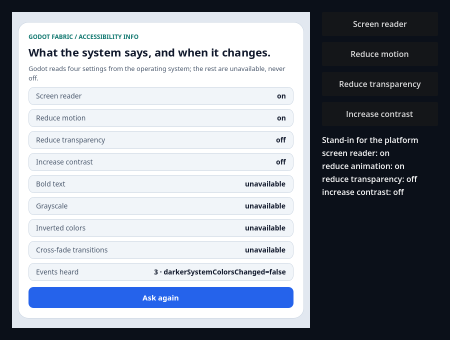

# AccessibilityInfo over Godot's accessibility settings

```sh
npm run example -- accessibility-info
npm run example -- accessibility-info --headless
npm run example -- accessibility-info --capture
npm run test:accessibility-info
```

React Native's original `AccessibilityInfo` comes from the public `react-native` import, over a C++
TurboModule the host installs (`AccessibilityManager`, with the iOS contract that `AccessibilityInfo.js`
takes when `Platform.OS` is `"godot"`). The launcher entry is the interactive demo: a screen that asks
each of RN's getters, listens to each of its events and shows the answer, with an **Ask again** button
and a line that counts the events it heard. Godot reads four settings from the operating system (the
screen reader, reduce motion, reduce transparency and increase contrast, which RN calls "darker system
colors"); `isBoldTextEnabled`, `isGrayscaleEnabled`, `isInvertColorsEnabled` and
`prefersCrossFadeTransitions` have nothing to read and show `unavailable`, never `off`. A setting the
platform does not report (the headless engine, a mobile build) shows `unknown`.

Started without `--headless`, the screen follows the real settings of the machine: turn VoiceOver, Reduce
Motion, Reduce Transparency or Increase Contrast on in System Settings and, within a frame, its row
changes and the events line counts the change. The four native buttons on the right stand in for the
operating system, so the screen can be driven without touching System Settings: each press cycles a
setting through *system* (the real reading), *unknown*, *off* and *on* by changing the application's
`validation_accessibility_settings` meta, which replaces only the keys it names.

`npm run test:accessibility-info` is the [evidence](../../docs/evidence/accessibility-info/README.md) suite,
outside the catalog: a headless probe in two applications, one with the validation meta and two roots and
one with the real backend, replayed by an independent oracle. The preceding host, with the same bundle,
fails exactly its normative checks, and four retained host sabotages are rejected.

## Use the example



**Initial** is the screen the validation starts from: the screen reader, reduce motion and reduce transparency
report off, increase contrast reports nothing (`unknown`), bold text, grayscale, inverted colors and cross-fade
are `unavailable`, and **Events heard** says `none yet`. The native label on the right is what the stand-in
platform reports.



**Changed** is the screen after the native buttons turned the screen reader and reduce motion on and made increase
contrast known (off): the rows change with the events, and **Events heard** reads
`3 · darkerSystemColorsChanged=false` (the three events, in order, are `screenReaderChanged=true`,
`reduceMotionChanged=true` and `darkerSystemColorsChanged=false`). Reduce transparency did not change and has no
event.

- **Ask again** calls every getter again; the answer is the last reading the host took, so a setting that
  changed shows as soon as the next frame has been polled.
- **Screen reader**, **Reduce motion**, **Reduce transparency** and **Increase contrast** (native buttons)
  change what the stand-in platform reports. A change to a known value is one event, heard once by every
  listener of every root; the row changes with it and the **Events heard** line counts it. Setting a
  value the platform already reports, or making a setting *unknown*, emits nothing; **Ask again** then says
  `unknown`.
- Try this: press **Screen reader** four times from the start. The stand-in line moves through *unknown*,
  *off*, *on* and back to *system*; a press adds an event only when the value it reports is a known one
  that differs from the value the screen last knew, so *unknown* adds none and, if the machine's
  screen reader is off, neither does *off*. A press that does add one shows it in **Events heard** and in
  the row.

With `--capture` the renderer's frames are saved to `build/accessibility-info-initial.png` and
`build/accessibility-info-changed.png`; the two above are those frames, checked one by one.

## What the validation establishes

[validation.gd](validation.gd) names all four keys of the stand-in (so a run reads the same on a machine
whose own settings are on and on the headless engine), presses the native buttons, clicks React's **Ask
again** with real mouse input and reads each state from the native tree, from the application's
AccessibilityInfo counters and from what React observed. It waits for the polls the host counts, never for
time. The first render shows three settings off, increase contrast unknown and the four unavailable ones,
with no event heard and the module holding its baseline. Turning on the screen reader and reduce motion
and making increase contrast known are three events, once each and in order, and the rows change with
them; the host counts one event for each change, none for reduce transparency and none for the events Godot
can never send. **Ask again** answers the same values with no new event, a setting that becomes unknown
emits nothing and asking again says `unknown`, and stopping the application releases the root and the
module without a host error. The headless run passes 10 checks and the capture run 12.

## Evidence suite

```sh
npm run test:accessibility-info
```

With the preceding native host installed in `addons/` (the suite insists that it is the host preserved in
`build/accessibility-info-previous-host`), the runner checks the control:

```sh
node tests/accessibility-info-native.test.mjs --allow-original-negative
```

## Original syntax

```jsx
import {useEffect, useState} from 'react';
import {AccessibilityInfo, Text} from 'react-native';

function ReduceMotionNotice() {
  const [reduced, setReduced] = useState(null);
  useEffect(() => {
    AccessibilityInfo.isReduceMotionEnabled().then(setReduced, () => setReduced(null));
    const subscription = AccessibilityInfo.addEventListener('reduceMotionChanged', setReduced);
    return () => subscription.remove();
  }, []);
  return <Text>{reduced === null ? 'unknown' : reduced ? 'reduced' : 'full motion'}</Text>;
}
```

| Setting | RN API | Godot's `DisplayServer` method |
| --- | --- | --- |
| Screen reader | `isScreenReaderEnabled`; `screenReaderChanged` and `change` | `accessibility_screen_reader_active` |
| Reduce motion | `isReduceMotionEnabled`; `reduceMotionChanged` | `accessibility_should_reduce_animation` |
| Reduce transparency | `isReduceTransparencyEnabled`; `reduceTransparencyChanged` | `accessibility_should_reduce_transparency` |
| Increase contrast | `isDarkerSystemColorsEnabled`; `darkerSystemColorsChanged` | `accessibility_should_increase_contrast` |
| Bold text, grayscale, inverted colors, cross-fade | the four getters; `boldTextChanged`, `grayscaleChanged`, `invertColorsChanged` | none: the getters reject `E_ACCESSIBILITY_UNAVAILABLE`, the events never fire |

A getter resolves `true` or `false`, or rejects with `E_ACCESSIBILITY_UNKNOWN` when Godot reports `-1`. A
change event is sent only when a known value differs from the last known one, and a stopped application
sends none. `announceForAccessibility`, `announceForAccessibilityWithOptions` and `setAccessibilityFocus`
throw `E_UNSUPPORTED` until the next slice of GF-20.

## Limits

The headless engine and Godot's mobile servers report that they do not know any of the four settings, so
every getter rejects there; the evidence supplies values through the validation meta. Real operating-system
settings are read by Godot on macOS and are not certified by the suite, and the screen reader is VoiceOver
alone. A change is seen at the next frame. Announcements, programmatic focus, text scale and the mobile
bridges are open. See the [research](../../docs/research/accessibility-info.md).
