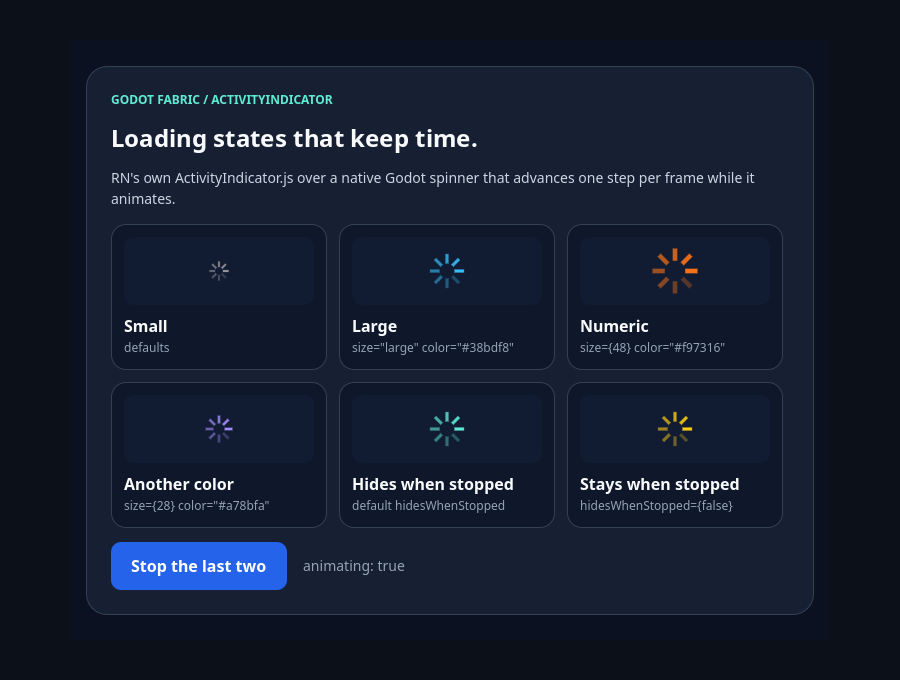

# ActivityIndicator

```sh
npm run example -- activity-indicator
npm run example -- activity-indicator --headless
npm run example -- activity-indicator --capture
npm run test:activity-indicator
```

The public `ActivityIndicator` renders React Native's original
`ActivityIndicator.js` over a native Godot spinner. Because Godot is not
Android, the module takes its iOS-family path: a sized View around the
codegen-generated `RCTActivityIndicatorView` component, whose generated
descriptor the host registers as iOS does. The spinner is drawn in a Godot
Control and advances with real frame time while `animating`. The launcher entry
is the interactive demo: six spinners and a button that stops the last two.
`npm run test:activity-indicator` is the
[evidence](../../docs/evidence/activity-indicator/README.md) suite, outside the
catalog: **33/33 headless checks** across actual SceneTree frames in two roots of
one Hermes application. On the preceding host, the same bundle fails exactly the
**2 normative mount checks**; a retained sabotage that stops the spinner's
per-frame work fails 9 checks and the independent oracle rejects it.

## Use the example



**Running** is the screen as mounted. The first row is the default small
spinner in RN's iOS gray, `size="large"` with `color="#38bdf8"` and a numeric
`size={48}` in orange. The second row is `size={28}` in violet and the two
spinners driven by the `animating` state: one with the default
`hidesWhenStopped` and one with `hidesWhenStopped={false}`. Every spinner fills
its frame (20, 36, 48, 28, 36 and 36 px) and advances one step per frame.


**Stopped** is the screen after a real click on the button. `animating` is now
`false`: the spinner with the default `hidesWhenStopped` is no longer drawn (its
tile is empty), the one with `hidesWhenStopped={false}` stays on its last frame
and does no per-frame work, and the other four keep turning. The button reads
`Start them again`; a second click restarts both from where they stopped.

## What the validation establishes

[validation.gd](validation.gd) sends actual Godot mouse input and reads each
spinner's native Control across actual SceneTree frames. It checks that the
example mounts six spinners as native spinner Controls; that their frames are
RN's (small 20, large 36, the numeric sizes 48 and 28, each spinner filling its
frame) and that `size` selects the native style while a number only sizes the
frame; that without a `color` the spinner draws RN's iOS gray and each `color`
prop reaches its spinner; and that every spinner starts animating while only the
last opts out of `hidesWhenStopped`. While animating, every phase advances
exactly once per frame over ten frames. A click on the button calls `onPress`
once, React re-renders the status and the pressed style is released; the spinner
with the default `hidesWhenStopped` is then hidden and the other one stays drawn;
the two stopped spinners keep their frame count and phase over ten frames while
the other four keep advancing; a second click restarts both and each counts two
starts. React rendered three times, and stopping the application releases every
spinner without a host error. With `--capture` the pixels of the hidden spinner
differ from the ones it had while running. The headless run passes 14 checks and
the capture run 19.

## Evidence suite

```sh
npm run test:activity-indicator
```

With the preceding native host installed, the runner checks the control:

```sh
node tests/activity-indicator-native.test.mjs --allow-original-negative
```

## Original syntax

```jsx
import {ActivityIndicator, View} from 'react-native';

export function Loading({busy}) {
  return (
    <View style={{flexDirection: 'row', gap: 12, padding: 16}}>
      <ActivityIndicator />
      <ActivityIndicator size="large" color="#0a84ff" />
      <ActivityIndicator size={48} color="#ffcc00" animating={busy} hidesWhenStopped={false} />
    </View>
  );
}
```

`size` sets the frame: small is 20×20, large is 36×36 and a number is a square
of that side; the spinner fills it. `animating={false}` stops the spinner, and
`hidesWhenStopped` (true by default) decides whether a stopped spinner is still
drawn. Without `color` the spinner is RN's iOS gray (`#999999`).

## Limits

Accessibility, reduced motion, UIKit's exact timing and spoke geometry,
comparing the captures with UIKit's pixels, hardware and Godot mobile exports
require separate acceptance. See the
[research](../../docs/research/activity-indicator.md).
