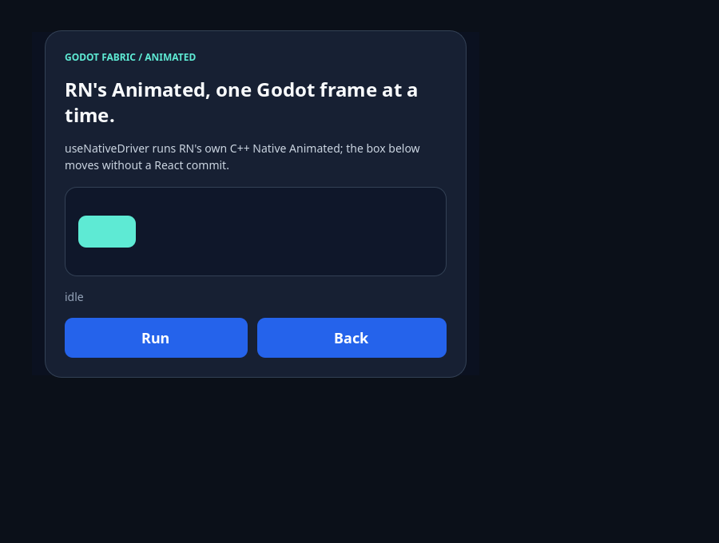
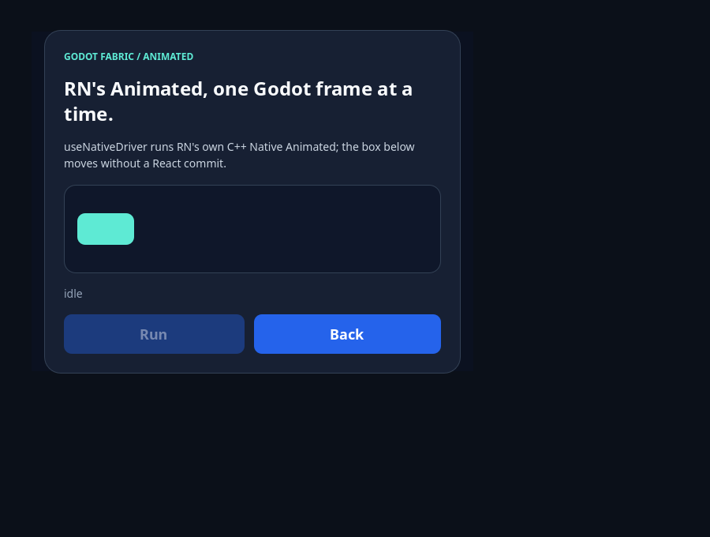
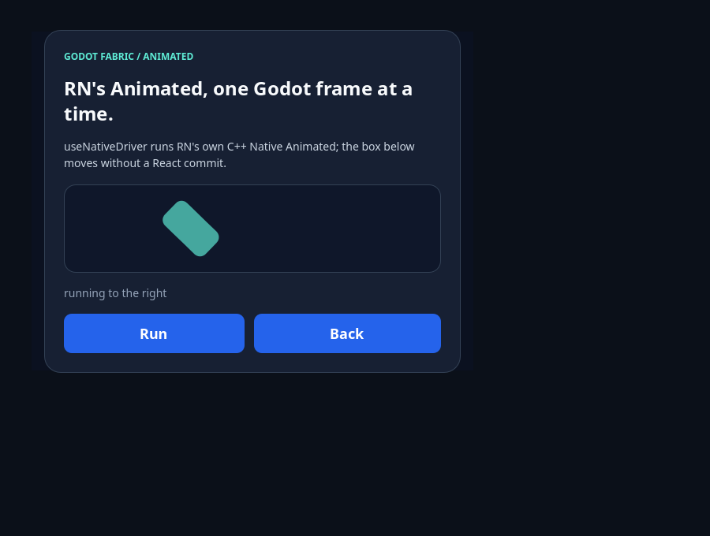
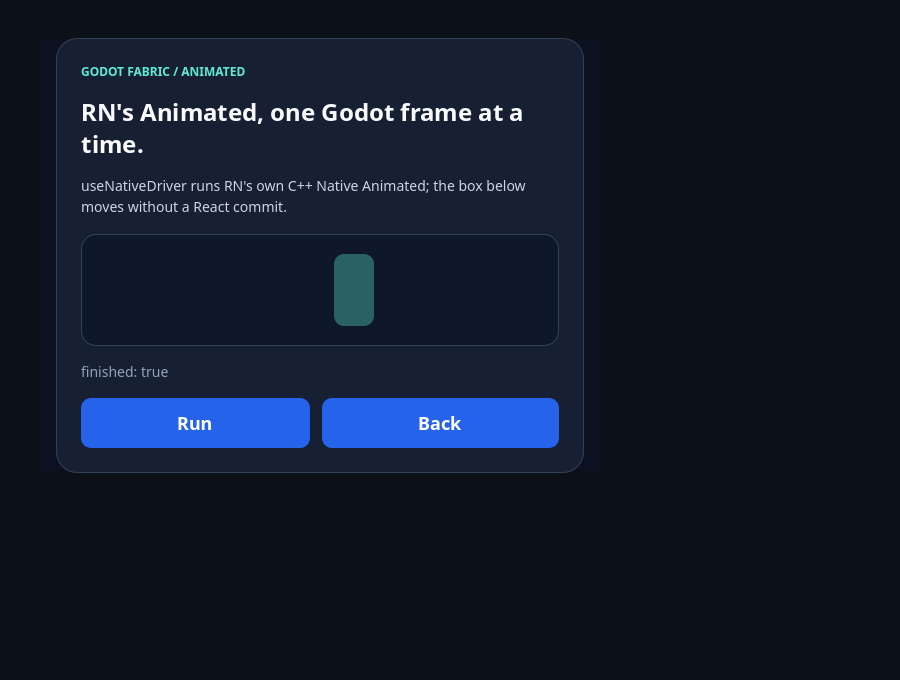

# Animated

```sh
npm run example -- animated
npm run example -- animated --headless
npm run example -- animated --capture
npm run test:animated
```

RN's original `Animated`, `Easing`, `useAnimatedValue` and `TouchableOpacity`
through the public `react-native` import. A box moves, rotates and fades with
`useNativeDriver: true`: RN's own C++ Native Animated and AnimationBackend
animate it, and Godot's frame tick is their clock. The box's Control changes on
every frame without a React commit; only the status text re-renders, when the
animation ends. The two buttons are `TouchableOpacity`: a press dims the button to
its `activeOpacity` through the same native driver, and release brings it back
over RN's 250 ms timing. The launcher entry is the interactive demo;
`npm run test:animated` is the [evidence](../../docs/evidence/native-animated/README.md)
suite, outside the catalog.

## Use the example



**Idle** is the box at opacity 1, no rotation and no translation, with RN's
backend attached and not running. Nothing has been animated yet, so the backend
has delivered no frame.



**Press** holds the mouse down on Run. `TouchableOpacity` dims to its
`activeOpacity` (0.4) with a native timing of 0 ms, so the very next frames show
the button dimmed while the box has not moved.



**Mid-animation** is a frame of the 1200 ms `Easing.inOut(Easing.cubic)` timing
after release. Opacity, `translateX` and `rotate` are three interpolations of one
`Animated.Value`; the backend applied them to the same Control on this frame, and
the status text reads `running to the right`, set when the animation was requested;
React does not render again until the animation ends.



**End** is the box at opacity 0.35, 220 px along the track and a quarter turn,
where RN's end callback re-rendered the status text once: `finished: true`. By then
React has rendered three times (mount, request, end), not once per frame. Back
returns the box over the same timing.

## What the validation establishes

[validation.gd](validation.gd) sends actual Godot mouse input and reads the
Controls the backend updated. It checks that the example mounts the
`Animated.View` and both buttons, that before any animation the backend is attached
and idle with no frame delivered, that a press dims the button through the native
driver, that mid-animation the Control is between the two ends of its opacity,
translation and rotation, that RN reports the end once with `finished: true`, that
the box rests at its final values with no stale update, and that React rendered
three times by then: the animation never committed. Back returns the box and releases the
pressed button, stopping the application releases the backend without a host error,
and with `--capture` the pixels of the track the box moves in differ between rest,
mid-animation and the end, while a press changes only the Run button's. The
[probe](../../tests/native-animated-probe.gd) and its independent oracle cover the
animations frame by frame.

## Original syntax

```jsx
import {Animated, Easing, TouchableOpacity, useAnimatedValue} from 'react-native';

function Slide() {
  const progress = useAnimatedValue(0);
  const run = () =>
    Animated.timing(progress, {
      toValue: 1,
      duration: 1200,
      easing: Easing.inOut(Easing.cubic),
      useNativeDriver: true,
    }).start(({finished}) => console.log(finished));
  return (
    <>
      <Animated.View
        style={{
          opacity: progress.interpolate({inputRange: [0, 1], outputRange: [1, 0.35]}),
          transform: [{translateX: progress.interpolate({inputRange: [0, 1], outputRange: [0, 220]})}],
        }}
      />
      <TouchableOpacity activeOpacity={0.4} onPress={run} />
    </>
  );
}
```

| Driver | Who advances the animation | Who updates the Controls |
| --- | --- | --- |
| `useNativeDriver: true` | RN's `AnimatedModule` and `AnimationBackend` in C++, one frame per Godot frame | The backend, directly, without a commit |
| `useNativeDriver: false` | RN's JS drivers on `requestAnimationFrame` | `setNativeProps` per frame, plus a React commit 48 ms after the last one |

## Limits

`Animated.Text`, `Image`, `ScrollView`, `FlatList` and `SectionList` throw where
they render, with their reason; `Animated.View` does not reject View styles Godot
lacks. A uniform `transform: [{ scale }]`, animated or not, renders as a planar
uniform scale (RN builds it as `scale3d`; the
[uniform scale record](../../docs/evidence/uniform-scale/README.md) shows an
`Animated.View` on the native driver), while `scale: 0` still fails with
`E_TRANSFORM_SINGULAR`. `LayoutAnimation`, native `Animated.event` on the SDK
ScrollView, asserted animation of layout props (exploratory runs of `width` and
`marginLeft` followed frame by frame), `PlatformColor` interpolation, reduced motion,
performance budgets and Godot mobile exports require separate acceptance. See the
[research](../../docs/research/native-animated.md).
