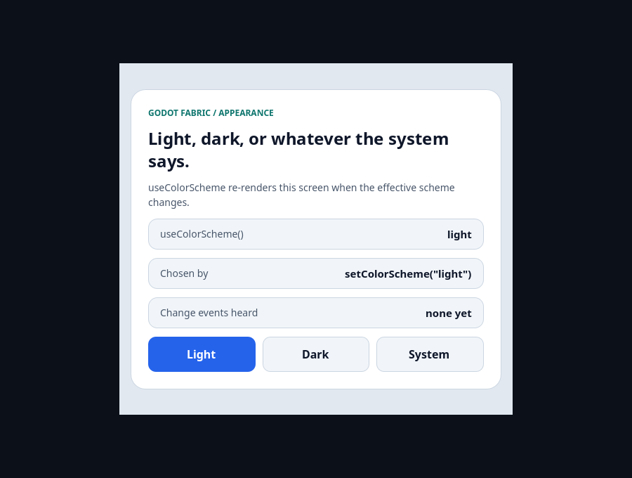
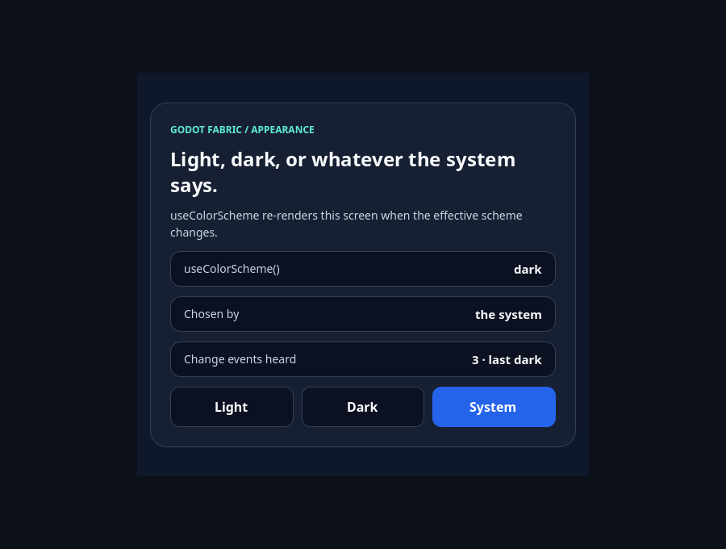

# Appearance and useColorScheme from Godot's system theme

```sh
npm run example -- appearance
npm run example -- appearance --headless
npm run example -- appearance --capture
npm run test:appearance
```

React Native's original `Appearance` and `useColorScheme` come from the public
`react-native` import, fed by Godot's DisplayServer system theme and the
application's `setColorScheme` override. The launcher entry is the interactive
demo: a screen that re-renders in a light or a dark theme from
`useColorScheme`, three buttons (Light, Dark and System) that call
`setColorScheme`, and a readout of the scheme, of what chose it and of the
change events RN sent. Started from the launcher it follows the operating
system's theme, where Godot reports one, until a button overrides it.
`npm run test:appearance` is the
[evidence](../../docs/evidence/appearance/README.md) suite, outside the catalog:
**79/79 headless checks**, with two roots of one Hermes application rendering the
same scheme and two applications that run at once sharing one system theme
callback. The preceding host, with the same SDK bundle, fails exactly **56
normative checks**; the host from before the shared callback fails exactly the 9
checks where two applications observe at once, and a host that emitted for every
system callback failed 17 of the first execution's 67.

## Use the example



**Light** is the screen after a click on Light while the system reports light.
`setColorScheme("light")` is an override that changes nothing effective, so RN
sends no change event (`none yet`) and the page keeps the light theme.


**Dark** is the screen after a click on Dark. The override makes the effective
scheme `dark`: RN sends one change event (`1 · last dark`) and the whole screen
re-renders in the dark theme, with `setColorScheme("dark")` as what chose it.



**System dark** is the screen after System returned control to the system (light,
a second change event) and the operating system then turned dark. Godot's
`DisplayServer` called the one Callable the Appearance module registered, RN
heard a third change (`3 · last dark`) and the screen is dark again, now chosen
by `the system`.

## What the validation establishes

[validation.gd](validation.gd) sends actual Godot mouse input and reads the
colors the host applied, the application's Appearance module and what React
observed. The headless DisplayServer has no system theme, so the validation
supplies it as Godot delivers it: the application's validation meta holds the
scheme the operating system would report, and the one Callable registered with
DisplayServer is called when it changes. The first render follows the system:
`useColorScheme` and `getColorScheme` read light, the page is light, the native
module holds no override and has emitted nothing. A click on Light is an override
that changes nothing effective, so no change event is sent. A click on Dark
makes one change event and the whole screen dark; System follows the light system
again with a second event. A system change reaches the app through the one
Callable: the system is dark, a third event is heard and the screen is dark.
`setColorScheme("light")` then wins over the dark system with one more event, and
later system changes under the override are read and change nothing: no event,
the screen stays light. React re-rendered only for changes of its own state, and
stopping the application releases the root and the module without a host error.
With `--capture` the renderer's frame is saved and the page color sampled inside
the root's rectangle: light and dark match the theme's page color. The headless
run passes 14 checks and the capture run 20.

## Evidence suite

```sh
npm run test:appearance
```

With the preceding native host installed, the runner checks the control; with
the host from before the shared callback, the second command:

```sh
node tests/appearance-native.test.mjs --allow-original-negative
node tests/appearance-native.test.mjs --allow-prefix-negative
```

## Original syntax

```jsx
import {useEffect} from 'react';
import {Appearance, Pressable, Text, useColorScheme} from 'react-native';

function ThemeToggle({onSchemeChange}) {
  const scheme = useColorScheme();
  useEffect(() => {
    const subscription = Appearance.addChangeListener(({colorScheme}) => onSchemeChange(colorScheme));
    return () => subscription.remove();
  }, [onSchemeChange]);
  return (
    <Pressable onPress={() => Appearance.setColorScheme(scheme === 'dark' ? 'light' : 'dark')}>
      <Text>{scheme}</Text>
    </Pressable>
  );
}
// Follow the system again:
Appearance.setColorScheme('unspecified');
```

| Source | Effective scheme |
| --- | --- |
| `setColorScheme('light')` or `('dark')` | That scheme, whatever the system reports |
| `setColorScheme('unspecified')` or `('auto')` | The system's again |
| Godot's system theme callback, one for every application | `dark` when `DisplayServer.is_dark_mode()`, otherwise `light` |
| No system dark mode (headless) | `light` |

A change event is sent only when the effective scheme changes, so a repeated or
overridden system change re-renders nothing. Unknown overrides fail with
`E_ARGUMENT`. Stopping the application sends no event, and a stopped or freed
application no longer receives system theme changes while the others still do.

## Limits

The headless DisplayServer has no system theme: the evidence supplies the system
value through a validation meta and calls the one Callable registered with
DisplayServer. Real OS theme changes, a game that sets its own DisplayServer
theme callback (it replaces Fabric's for every application, or is replaced by
it: the last registration wins), accent colors, `PlatformColor`,
per-window themes and Godot mobile exports require separate acceptance. See the
[research](../../docs/research/appearance.md).
